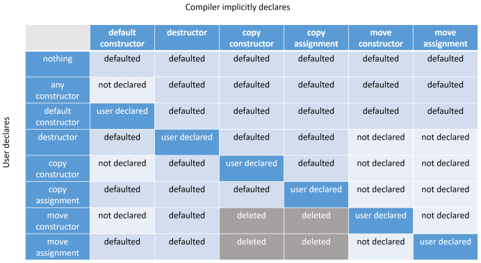

MSDK Coding Guide
============

Contacts: Miroslav Goncharenko (miroslav.goncharenko\@intel.com)

# General information

This document introduces code guide which should highlight some most common issues and bad practices existing in MSDK library's code. This document doesn't cover questions related to comments, code alignment, spaces/tabs and naming conventions. It focuses on code, logic and implementation.

These tips shouldn't be considered as strict rules, they are just good piece of advice on how to implement your solution in modern C++. But please be sure to know recommended way before implementing something different. Violations of these rules must be committed consciously, otherwise better solution is most likely just to follow guidelines.

Feel free to improve this document. Bring more examples and rules. But please try to keep size of document small enough. This document is for wide audience of developers, so avoid insufficient details and rare cases.

# Table of contents

  * [General rules](#general-rules)
  * [Code comments](#code-comments)
  * [Includes, namespaces](#includes-namespaces)
  * [Macro](#macro)
  * [Types](#types)
  * [Memory management](#memory-management)
  * [Smart pointers](#smart-pointers)
  * [Exceptions](#exceptions)
  * [Writing a class](#writing-a-class)
  * [Functions](#functions)
  * [Modern syntax sugar](#modern-syntax-sugar)
  * [Threading](#threading)
  * [Standard library](#standard-library)
  * [Common mistakes](#common-mistakes)
  
# General rules

1.  Do not overcomplicate your code, every single block which makes some work should be as local as possible. Person who reads the code should receive minimal context to understand the logic.

    - Keep variables definition local, i.e. as close to usage as possible.
    
    - Introduce new scope if it helps to isolate logical blocks.
    
    - If function checks parameters, check them immediately at function entrance.
    
    - Do not write huge ```if```/```else``` blocks.
    
    - Prefer to write short code under ```if``` and long under ```else``` statement.
    
    - If program reaches some invalid state and you want to signal it with return code, return immediately. Do not carry this information till the end of the function to final return statement.

      Wrong:
      ```
      mfxStatus sts = MFX_ERR_NONE;

      mfxU32 buffer[100];

      // 50 lines of some code without sts and buffer usage

      sts = WriteDataToBuffer(buffer);

      // 50 more lines

      return sts;
      ```
      Correct:
      ```
      // a lot of code

      mfxU32 buffer[100];

      mfxStatus sts = WriteDataToBuffer(buffer);
      MFX_CHECK_STS(sts);

      // a lot of code
        ```
    - Prefer switch operator to giant else-if statements.

2.  Keep code at level of 0 compiler warning build.

3.  Do not rely on side effects of your code.

# Code comments

4.  Do not leave dead commented code. In most cases such pieces of commented code will stay in source base forever. Either leave meaningful comment why this code is commented (i.e. determine the condition when this code can be switched on again) otherwise delete it at all. Traces of deleted code will remain in git history.

# Includes, namespaces

5.  Watch your includes.

    - Limit it to bare minimum.

    - Prefer limiting scope of include. Do not put everything to some common header which will propagate its content to all translation units which don't need it.

    - Try to capture the balance between spreading headers to many source files, which makes dependency graph more complicated, and accumulating many of the headers to some common include header, which may lead to significant code size inflation after preprocessing.

    - Prefer using forward declaration instead of including a header if you don't need complete type.

    - Do not put using declarations in headers. It could lead to undesired scope expansion.

# Macro

6.  Use macro only if you want some compile-time instrumentation.

    - Otherwise use functions, templates and constants.

      Example:
      ```
      // Instead of
      #define BLOCK_SIZE 1024

      // Use
      constexpr BLOCK_SIZE = 1024;
      ```
    - Remember when you pass something to macro, it will be used in the way you provided it and will be expanded textually.

      Example:
      ```
      IPP_MAX(++i, j);
      // will become
      ((++i) > (j) ? (++i) : j) // twice incremented, it is an unwanted side effect
      ```
    - If macro contains ```if``` statements, it should be put in new local scope with ```{}``` to prevent unexpected behavior in nested ```if``` / ```else``` constructions.

      Example:
      ```
      #define MFX_CHECK_UMC_ALLOC(err) if (err != true) {return MFX_ERR_MEMORY_ALLOC;}
      ...
      if (report_errors)
        MFX_CHECK_UMC_ALLOC(ret_sts);
      else
        ret_sts = ERR_NONE; // After macro expansion this 'else' corresponds to 'if (err != true)' and not to 'if (report_errors)'.
                            // This is undesirable side effect.
      ```

      Fix:
      ```
      #define MFX_CHECK_UMC_ALLOC(err) { if (err != true) {return MFX_ERR_MEMORY_ALLOC;} }
      ...
      if (report_errors)
        MFX_CHECK_UMC_ALLOC(ret_sts);
      else
        ret_sts = ERR_NONE; // No problems now
      ```

    - Use ```MFX_CHECK``` / ```MFX_RETURN``` / ```MFX_CHECK_STS``` macro for ```mfxStatus``` checks. It allows to turn on tracing.

      Hint: Treat these macros like an ```assert``` -  expression have to be evaluated to true and no action is taken in that case, otherwise error is returned.

      Do not put complex conditions into these macros - it may reduce readability, if you need such conditions use the following approach:
      ```
      bool mem_pattern_valid = (par->IOPattern & MFX_IOPATTERN_OUT_VIDEO_MEMORY) && (par->IOPattern & MFX_IOPATTERN_OUT_SYSTEM_MEMORY));
      MFX_CHECK(mem_pattern_valid, MFX_ERR_INVALID_VIDEO_PARAM);
      ```
      Do not put function calls inside these macros, it may lead to double call.

      Example:
      ```
      MFX_CHECK_WITH_ASSERT(MFX_ERR_NONE == SetHRD(par, m_vaDisplay, m_vaContextEncode, m_hrdBufferId), MFX_ERR_DEVICE_FAILED);
      // This code will call SetHRD twice in debug, because in debug expansion of MFX_CHECK_WITH_ASSERT has additional assert.
      // It is definitely not what author of the code desired
      ```
    - Include guards must be used for every header.

    - Include guards are preferable to ```#pragma once```, since the latter is not standardized. But all popular compilers support it. Don't mix these two approaches, choose one.

    - Stop (!!) inventing/using maximum/minimum macro. We already have ```IPP_MAX```, ```MFX_MAX```, ```UMC_MAX```, ```Max```. Use ```std::max```/```min``` instead.

7.  Do not overuse conditional compilation.

    - Do not leave dead code under ```#if 0```. Use comments to hide it from compiler (do not forget to describe your intention in related comment). See [section](#code-comments) about code comments.

8.  Use macro when extend public API / functionality.

    - Fix binary layout of newly defined structs with ```MFX_PACK_BEGIN_USUAL_STRUCT``` / ```MFX_PACK_BEGIN_STRUCT_W_PTR``` macro (they are expanded to proper ```#pragma pack``` directives) to guarantee compatibility with different compilers.

    - Cover new features which are not in publicly released API yet with API guard. Correct way to protect some feature is to define separate ```#define``` statement under proper ```MFX_VERSION``` guard. Do not use ```MFX_VERSION``` directly in code for such purposes.

    - Prefer positive condition to negative one - ```MFX_ENABLE_FEATURE``` to ```MFX_DISABLE_FEATURE```.

# Types

9.  Avoid implicit types conversions

    - Declare single parameter constructors as explicit to forbid implicit type conversion.

    - ```std::max```/```min``` won't compile if you mix different types and this is good.

    - Scoped enums will prevent errors of mixing up different enums

    - Be sure to know literal types: 1 - is ```int```, ```NULL``` is ```int```, 1.0 - is ```double```, etc.

    - Use either mfx aliases for types or built in exact-width types (this one is preferred (currently for integer only: ```uint32_t```, ```int32_t```, etc.)). ```int``` is ```mfxI32```, ```double``` is ```mfxF64```, char is ```mfxI8```, etc.

    - Use ```nullptr``` for invalid pointers, not ```NULL```.

10. Use unsigned types whenever it possible. Unsigned overflow is well defined behavior while signed is not.

11. Avoid usage of local ```static``` variables because it might bring unexpectable overhead. Since C++11 initialization of local ```static``` variables must be thread safe, so compiler generates additional code to provide it.

# Memory management

12. Avoid manual memory management

    - Functions ```memcpy```, ```memset```, ```sizeof``` are dangerous, use them only if you really need them.

    - Do not copy User Defined Types (UDT) with ```memcpy```, ```operator =``` does the same

    - Do not ```memset``` POD structs for initialization, use ```()``` or ```{}``` initializers.

      Example:

      Instead
      ```
      Class()
      {
          memset(&field, 0 , sizeof(field));
      }
      ```
      Use
      ```
      Class()
      : field()
      {}
      ```
    - Do not use ```memcmp``` for comparison of UDT. Even for PODs compiler may fill padding between fields with random garbage which will lead to incorrect comparison result.

    - ```memset```/```memcopy``` non-POD structs will lead to unpredictable fails.

    - Do not use ```memcpy``` if pointers may overlap, use ```memove``` instead

    - Prefer ```std::copy``` to ```memcpy``` for arrays copying. ```std::copy``` is safer, it could be faster, because it could benefit from knowing data block size, ```memcpy``` operates with typeless ```void*```. Also ```std::copy``` works correctly with overlapping blocks (mind the polarity of overlap, maybe you will need ```std::copy_backward```).

    - Use ```std::fill``` to initialize arrays instead of ```memset```.

    - Be aware of pointer aliasing, especially if your compiler is gcc, since it heavily utilizes this feature for optimizations.

    - Use operator new instead of ```malloc```. In pair with modern concepts of allocators / placement new it could lead to much more flexible and efficient memory management.

    - Do not check pointer after operator new. If it fails, it will throw ```std::bad_alloc```, and won't return ```nullptr```.

    - If you want to receive ```nullptr``` in case of allocation failure from operator new, use ```std::nothrow``` specificator.

      Example:
    
      ```
      char a* = new(std::nothrow) int;
      ```
    - Do not check pointer before ```delete```. Deleting ```nullptr``` is defined behavior and does nothing.

    - Avoid macro or functions that check pointers before ```delete```. This is considered bad practice and indicator of bad application logic design.

      Example:
    
      ```
      SAFE_DELETE (p) {if (p){ delete p; p = nullptr;}}
      ```
    - Do not mix ```new```/```delete``` and ```new[]```/```delete[]```.

    - Use C++ cast: ```static_cast```, ```dynamic_cast```, ```const_cast```, ```reinterpret_cast``` (```bit_cast``` in C++17) instead of C-style cast. To limit possible cast scope.

    - Avoid manual allocations/deallocations. Use smart pointers.

# Smart pointers

13. Smart pointers is a correct way to handle memory management. They implement RAII paradigm.

    - ```std::unique_ptr``` is a tiny layer over pointer which brings no real usage overhead, but brings major resistance over memory leaks.

      Example:

      ```
      // Manual memory management
      
      int* memory = new int[10];
      
      // some code
      
      if (error1)
      {
          delete[] memory;
          return;
      }
      
      // some code
      
      if (error2)
      {
          delete[] memory;
          return;
      }
      ```

      ```
      // Memory management using smart pointer
      
      unique_ptr<int[]> memory(new int [10]);
      
      // You don't need to care about deallocation anymore
      ```
    - ```std::shared_ptr``` is a correct way to handle shared object.

    - ```std::shared_ptr``` is thread safe!

    - Copying of ```std::shared_ptr``` involves atomic operations, which has some cost. So don't overuse it.

    - Smart pointers support custom deleters.

      Example:

      Using custom delete function to return memory to pool after it goes out of scope.

    - Use ```std::make_shared``` to create ```shared_pointer```. This function will place ref counter and object in one chunk of memory with only one alloc call, also it could bring some performance benefits. (```std::make_unique``` available since C++14).

    - Use smart pointer as if it were an ordinary pointer, don't call ```.get()``` every time you need to operate with pointer. Smart pointers have ```bool operator ()```, ```operator *``` and ```operator ->```.

      Example:
    
      ```
      // Following code is valid
      unique_ptr<int> ptr;
      
      // some more code
      
      // If you want to check whether pointer is initialized do the following
      If (ptr) // no need to call .get()
      {
          // some code
      
          // If you want to get object
          int t = *ptr; // no need to call .get()
      }
      ```
    - Avoid usage of ```.get()``` function because it potentially leads to losing control over owned pointer. In such situation raw pointer may be used by other code even when owned object is destroyed by destructor of shared pointer.

    - Do not use ```std::auto_ptr```, it is deprecated and removed since C++17.

# Exceptions

14. Exceptions exist! Your code most probably throws them even if you don't do it explicitly.

    - Operator new throws ```std::bad_alloc```.

    - ```dynamic_cast``` to references throws ```std::bad_cast``` in case of failed cast.

    - Use ```nothrow``` specifier for methods which don't throw.

    - Do not use explicit throw lists as functions specifiers. They will force exceptions which are not listed to be converted to ```std::unexpected```. It is deprecated and removed since C++17.

    - Always have at least one ```try```/```catch``` block with ```catch(...)``` to stop the exception and signal an error in block that assumes to be ```nothrow``` (at least you need such catch statement in main).

    - Use ```const``` references in catch expression to avoid excessive copies.

    - Exceptions are cheap on a happy (good) path having almost no overhead. In comparison ```if``` operators for return statuses slow down every call - even successful ones (+ return status occupies an additional register).

    - Pushing to container may trigger allocation calls and cause ```std::bad_alloc``` exception.

      Example:

      ```
      // The following code is not exception safe
      std::vector<int*> p_int;
      int* t = new int();
      p_int.push_back(t); // <- may throw an exception, then t pointer will leak
      ```
    - Exceptions is a powerful mechanism of tracing errors and displaying trace during stack unwinding procedure after error. Think about benefiting from it.

    - Do not throw exceptions in destructor. It could lead to double throw during stack unwinding which will lead to ```terminate()``` call.

    - Do not throw exceptions by pointer, it\'s hard to manage exception object life-time and ownership.

    - Prefer using dedicated exception class instead of throwing ```int```/```char*```/```double``` etc.

    - Don\'t re-invent a wheel, consider using existing exception classes from ```<exception>``` header.

    - If you decided to create your own exception class - inherit it from ```std::exception``` (or its derivatives).

    - Use ```std::system_error``` to convey custom error results through exceptions.

    - \[Windows\] Don\'t use ```catch(...)``` to catch asynchronous (SEH exceptions), use ```__set_se_translator``` or ```__try```/```__except``` instead. [Here](https://stackoverflow.com/questions/4573536/ehsc-vc-eha-synchronous-vs-asynchronous-exception-handling) is good explanation of synchronous vs asynchronous exceptions. Please note, that both ```catch(...)``` and ```__set_se_translator``` require ```/EHa``` compiler switch, which is turned off by default (MSDK explicitly turns it on).

# Writing a class

15. Most of the hacks, performance optimizations, advanced C++ language techniques, templates and programming patterns should be localized inside the class or special utility header. Do not use them outside the class / utility functions if that won't improve readability and reliability of code. The main idea is to leave the high level execution path as clean as possible, so developers can understand the intension by quick overview without need to dig in some complicated C++ code logic.

    - Create a class only if you really need it and this class will be highly utilized in code.

    - Do not reinvent a wheel. If you need a class for some simple concept like queue or fixed array try to use STL implementation or inherit from STL implementation.

    - Try to avoid multiple inheritance.

    - Make interface classes pure virtual.

    - If you use inheritance make the destructors virtual.

    - Classes with virtual tables are non-POD.

    - If class has a virtual method it should be a class but not a ```struct```.

    - Use specifiers override and final for virtual methods in child classes.

    - Do not use protection ```if != this``` in assignment operator. This is optimization for very rare situation, but which will perform additional check at any assignment. There are almost no cases where this optimization brings any benefits.

    - If you use some advanced technics like SFINAE/template metaprogramming, limit them to only class, class methods or utility functions.

    - Write default initializers in place. That will prevent unitialized object creating. This is especially relevant if default value should differ from ```0``` (like for ```VASurfaceID```).

      Example:
        
      ```
      class Point
      {
          int x = 0;
          int y = 0;
      }; // now creation of Point class without {} or () won't lead to creation of uninitialized object.
      ```
    - Prefer initialization before constructor body. That will save default constructor calls (but actually brings no difference for built in types and types with empty default constructors).

      Example:
        
      ```
      class PairOfHeavyObjects
      {
          PairOfHeavyObjects (HeavyObject & ll, HeavyObject & rr)
          {
              l = ll; // \<- at this point default constructors for r and l already been called
              r = rr;
          }
      
      private:
          HeavyObject l, r;
      };
      
      // This approach solves the problem
      PairOfHeavyObjects (HeavyObject & ll, HeavyObject & rr)
      : l (ll)
      , r(rr)
      {}
      ```
    - Use C++11 way to forbid constructors or define default ones.

      Example:
        
      ```
      // C++03 way
      class NonCopyablePoint
      {
          int x = 0, y = 0;
      private:
          NonCopyablePoint (NonCopyablePoint &);
      };
      
      // C++11 way
      Class NonCopyablePoint
      {
          int x = 0, y = 0;
          NonCopyablePoint (NonCopyablePoint &) = delete;
      };
      ```
    - Add ```const``` specifier to methods that doesn't change class state.

      Example:
    
      ```
      class my_vector
      {
      ...
      
      size_t size() **const** { return size; }
      
      private:
          size_t size;
          ...
      }
      ```
    - Declare ```struct```s in C++ way, not in C way. The C++ approach really defines a type with desired name, but C way declares a new pseudonym for nameless types. The latter may create painful issues during includes.

      Example:
    
      ```
      // C way
      typedef struct
      {
          int x, y;
      } Point;
      
      // C++ way
      struct
      {
          int x, y;
      } Point;
      ```
    - Be sure to know [rule of three and rule of five](https://en.wikipedia.org/wiki/Rule_of_three_(C%2B%2B_programming)). See picture below

      

      Figure 1. Table of user declared / compiler declared constructors/operators

    - You can use copy-swap idiom in assignment operator to guarantee state invariance in case of exception during copy / move constructor (i.e. it guarantees that object won't be in "moved from" state or its state would be somehow affected).

      Example:
    
      ```
      my_class& operator= (my_class other) // here copy ctor or move ctor is called, so if those constructor fail - current instance won't be changed
      {
          this = std::move(other); // replace content of current instance by content of copy
      }
      ```

# Functions

16. Use following tips for functions.

    - Declare small frequently used functions as inline.

    - All class methods are inline by default.

    - Declare functions with scope limited to current header file as static.

    - Always check return statuses if function returns some. (Note that functions ```fread``` and ```fwrite``` have return statuses).

    - Check input parameters. Especially pointers.

    - Prefer to pass objects by reference instead of pointers.

    - Avoid default arguments, leave this feature only for backward compatibility.

      Example:
        
      ```
      // This is always true statement, default second argument of DetectFrameNumGap masked typo
      if (view.GetPOCDecoder(0)->DetectFrameNumGap(slice**),** true)
      
      // Correct code is following
      if (view.GetPOCDecoder(0)->DetectFrameNumGap(slice**,** true**)**)
      ```
    - Use ```const``` qualifiers for parameters passed by reference/pointer and for class member functions everywhere it is possible.

    - Prefer to use function return value instead of passing out parameters by reference / pointer.

    - Mark free functions that you don't want to expose as ```static```.

    - Remember that calculation order of arguments required for function call is not specified.

# Modern syntax sugar

17. Modern C++ brings a lot of powerful syntax to ease most commonly used operations. This is a limited list of most useful ones.

    - Use ```auto``` when type deduction is trivial. This will save space in code, remove unnecessary noise in declarations.

      Example:

      ```
      std::reverse_iterator<std::vector<int>> it = vec.rbegin(); // it has complicated type
      
      auto it = vec.rbegin(); // auto reduces visual noise, type of variable it is easily deducible
      ```
    - Remember that ```auto``` doesn't deduce references and ```const``` (and ```volatile```).

    - ```auto``` is very powerful in templates.

    - ```auto``` is the only way to create lambda function object.

    - Be aware of rvalue references and move semantics - this allows to reduce copies. For template functions prefer using forwarding references.

      Example:

      ```
      template <typename T> void foo(**T&&**)
      ```

    - Don't forget about Perfect forwarding (```std::forward```).

    - Since C++11 all containers have method ```emplace```, which creates an object of desired type right inside the container without any copies.

    - In most situations it is better to move smart pointers, but not to copy.

    - Since C++11 RVO (Return Value Optimization) is mandatory for compilers.

    - Try to limit usage of lambdas to situations where you need functors.

    - Remember that lambdas can't me moved, every copy of lambda is also a copy of its closure. Possible solution in situations where you need multiple copies of lambda with heavy closure is to use ```std::function```.

    - Using declaration is more powerful since C++11, use it instead of ```typedef```.

    - Initializer lists make initializations of complex objects more straightforward.

    - Range-based for is an easiest way to iterate through any container or array.
      ```
      // remember that auto doesn't deduce reference, but in most situations copying of an object is still faster than pointer dereferencing (using a reference equivalent to pointer dereferencing)
      for(auto& item : container)
      {
          // do something with item
      }
      ```

# Threading

18. Use threads implementation and synchronization mechanisms from modern standards.

    - Since C++11 ```std``` has a type for threads, use ```std::thread```.

    - ```std::thread``` has limited interface in comparison with native threads, so you can get POSIX interface through ```.native_handle()``` method of ```std::thread```.

    - C++11 has powerful cross-platform synchronization primitives (mutexes, locks, condition variables).

    - C++11 has built in atomic variables, which actually still could be implemented via ```mutex``` if HW doesn't support real atomics (use ```is_lock_free``` / ```is_always_lock_free``` to check).

    - Volatile is not atomic! It doesn't give any atomic guarantee except that compiler won't optimize operations with it.

    - Operations with atomic variables are much slower than with regular variables.

    - Use atomics only for trivial built in types (like ```int```) not for ```struct```s.

    - Sleep is not (!) a synchronization primitive.

    - Use scoped locks to lock mutexes, it guarantees exception safeness and provides other benefits of RAII paradigm.

    - Always protect shared resource access if simultaneous read/write is possible with appropriate synchronization mechanism.

    - Avoid time of check and time of usage mismatch. In multithread application value of shared variable may be changed at any moment by other thread. For ```std::atomic``` variables this issue can be avoided by putting modifications of variable inside Compare And Swap (CAS) loop with ```std::compare_exchange_weak``` (prefer this to ```std::compare_exchange_strong```).

    - Limit usage of synchronizations in multi thread applications. The more synchronization primitives application uses, the less benefit it gets from threading.

    - Prioritize usage of non-blocking locks, such as ```try_lock```.

    - Try to reduce serial part of program since it is the main bottleneck of multithread application (see Amdahl's law).

    - Try to avoid spin lock paradigm in work with shared resource, i.e. use shared access.

    - You can achieve much better design with modern features of language: C++11 introduced ```std::async```, ```std::future``` and ```std::promise```, C++17 added ```std::execution_policy``` for implicit parallelism of stl algorithms.

# Standard library

19. Utilize standard library types and algorithms everywhere when possible.

    - STL developers spent much time to optimize types and algorithms, in most situations their implementation will be the best available.

    - Use ```std::vector``` for variable length arrays instead of heap allocated arrays.

    - ```std::map``` and ```std::list``` are node-based containers without random access iterators.

    - If you don't use ```std::splice```, then it's better to use ```std::dequeue``` rather than ```std::list```.

    - Vector reallocates its content at the time of growth, so pointers to elements may be invalidated after inserting new element.

    - To avoid reallocations ```.reserve()``` memory for ```std::vector```.

    - Use ```.data()``` for getting raw pointer to ```std::vector```'s data, not ```&[0]```.

    - ```operator []``` of ```std::vector``` doesn't check validity of index, but ```.at()``` does (it throws ```std::out_of_range``` for invalid indexes).

    - STL algorithms have generic interface and can be applied to C-style arrays as well.

    - ```std::begin()``` and ```std::end()``` (```std::rbegin()```, ```std::rend()```) functions are best ways to input range to STL algorithms. They brings unified interface for all containers and built in arrays.

      Example:

      ```
      int array[4] = {1, 2, 3, 4};
      std::sort(array, array + 4); // correct right bound value is begin + 4 (may be tricky and lead to errors)
      std::sort(std::begin(array), std::end(array)); // also works and it is impossible to make mistake in boundaries (it is also a unified code for any container)
      ```
    - C++17 brings ```std::size()``` and ```std::data()``` functions which are unified interface to get data and size of any container.

    - Use ```std::strings``` for strings.

    - If you need unified callback interface in your class you may use ```std::function``` to represent any callable object (function, lambda). Remember that ```std::function``` brings heap indirection on every call.

    - C++11 provided powerful mechanisms for random numbers generation.

    - C++11 also brought ```std::chrono``` with full functional operations with time and timers.

    - Do not define limits for built in types on your own. You can obtain them from ```std::numeric_limits```.

    - Do not write your implementation if you need to find, sort, move, accumulate (get sum or product) elements in containers. Use ```std::find```/```find_if```/```accumulate```/```count```/```count_if```. Except possible errors in implementation, STL algorithms can use internal threading to get even more speed up (available since C++17).

    - If you need to apply some function to every element of container, use ```std::for_each()```.

    - Be sure to know all algorithms in picture below (they are the most useful, STL has much more of them).

      

      Figure 2. List of most useful STL algorithms (made by Konstantin Vladimirov, see this [link](https://sourceforge.net/projects/cpp-lects-rus/files/slides-cpp/slides-2018/18-algorithms.pdf/download))

# Common mistakes

20. This is list of some most often mistakes seen in code.

    - Misusage or overusage of references. References are better to use instead of pointers, it allows to skip the pointer check. Some developers consider ```const``` reference as a way to avoid undesired copying of input parameters to functions. The common rule here is that it is very cheap (faster than to dereference a pointer) to copy anything with size less than a cache line (about 64 bytes!).

    - Use prefix ```++i``` operator. Almost all increments which developers use are actually prefix increments. Use postfix ```i++``` only if you need a side effect of postfix ```i++```. This may introduce sufficient difference for some untrivial iterators.

    - Always add ```default:``` in switch operator.

    - If you allocate some buffer during work with C-style strings, do not forget to count terminal ```'\0'``` symbol.
