# **SDK Developer Reference for Multi-Frame Encode**
## Media SDK API Version 1.30

<div style="page-break-before:always" />

[**LEGAL DISCLAIMER**](./header-template.md#legal-disclaimer)

[**Optimization Notice**](./header-template.md#optimization-notice)

<div style="page-break-before:always" />

- [Overview](#overview)
- [HW and algorithms limitations overview](#hw-and-algorithms-limitations-overview)
  * [Problem Statement](#problem-statement)
  * [VME utilization](#vme-utilization)
  * [System utilization](#system-utilization)
- [Multi-frame encode concept](#multi-frame-encode-concept)
  * [VME utilization improvement](#vme-utilization-improvement)
  * [System utilization improvement](#system-utilization-improvement)
- [Media SDK architecture introduction.](#media-sdk-architecture-introduction)
  * [App-Media SDK-Driver stack submission data flow](#app-media-sdk-driver-stack-submission-data-flow)
  * [Synchronization](#synchronization)
    + [Blocking synchronization](#blocking-synchronization)
  * [Media SDK session overview](#media-sdk-session-overview)
  * [Joining sessions](#joining-sessions)
- [Media SDK Internal changes and submission flow](#media-sdk-internal-changes-and-submission-flow)
  * [Encoder dedicated thread change](#encoder-dedicated-thread-change)
  * [MSDK/Driver task synchronization changes](#msdk-driver-task-synchronization-changes)
  * [Inter-session layer concept](#inter-session-layer-concept)
    + [Frames Preparation](#frames-preparation)
    + [Frames Submission](#frames-submission)
    + [Frames Collection](#frames-collection)
      - [Smooth buffering with number of sessions equal to number of frames allowed](#smooth-buffering-with-number-of-sessions-equal-to-number-of-frames-allowed)
      - [Timeout example](#timeout-example)
- [Media SDK API](#media-sdk-api)
- [MFXJoinSession usage](#mfxjoinsession-usage)
- [Encoder initialization changes](#encoder-initialization-changes)
  * [mfxExtMultiFrameParams](#mfxextmultiframeparams)
  * [Multi Frame Encode Scheduling Modes](#multi-frame-encode-scheduling-modes)
- [Frame Management](#frame-management)

Overview
========

HW and algorithms limitations overview
======================================

Problem Statement
-----------------

 - GPU supports only single context execution, limitation is - in single context, at any given time, workload (encoder kernel threads) from only one frame can be executed by EU/VME.

 - In current AVC/HEVC encoder design, MBENC kernel thread for each MB/LCU is launched following 26 degree wavefront dependency pattern because of the dependency on left, above and above right MBs. Left/above/above right MBs are used to calculate initial search starting point and neighboring INTRA prediction mode. This dependency is defined by H.264/H.265 ITU recommendation specification. Due to this dependency, there is inherent limitation in amount of parallel threads that can be dispatched for the computation. The bigger the frame for processing, more parallel threads (going from top of frame to center diagonal); and smaller frames have fewer parallel threads. Due to this, the utilization of the resource (VME) is not efficient for smaller frames (\<1080).

###### Figure 1. wavefront dependency


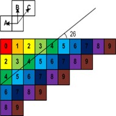

-   thread dispatching - the overhead for thread dispatching is pretty high comparing to one macroblock 

VME utilization  
-----------------

In this section, we will look into the relations between the frame size for encode and the VME utilization. As discussed previously, MB dependencies limit the number of parallel threads (wavefront dependency pattern), and the number of parallel threads is related to its frame size. Now, we will tie this understanding to VME utilization; consider the case below:

- Assuming 1080p frame and each MB takes the 1 unit of time to process.
- Assuming we are not limited by resources, meaning we have enough threads and VMEs.
- EU/VME utilization is very low
    - Peak \# of parallel kernel thread is about 60.  
    - Takes about 256 unit of time to finish the whole frame.
    - Takes about 120 unit of time to ramp up to peak state.
    - Takes about 120 unit of time to ramp down from peak state.

###### Figure 2: MBs per Wavefront in single frame

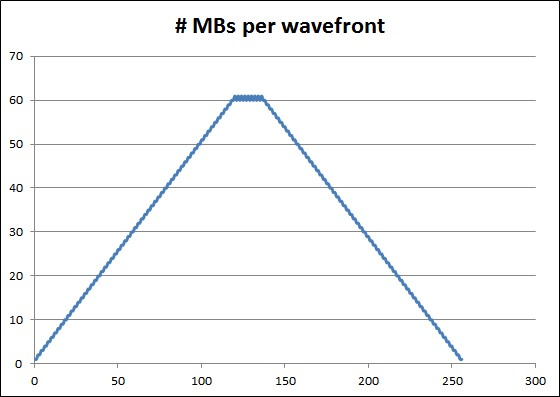

-   Result of algorithm and thread dispatching limitations - we can't utilize VME for 100% at high end GPU SKUs, and even at low-end SKUs for low resolutions.

###### Figure 3. VME utilization at different SKUs

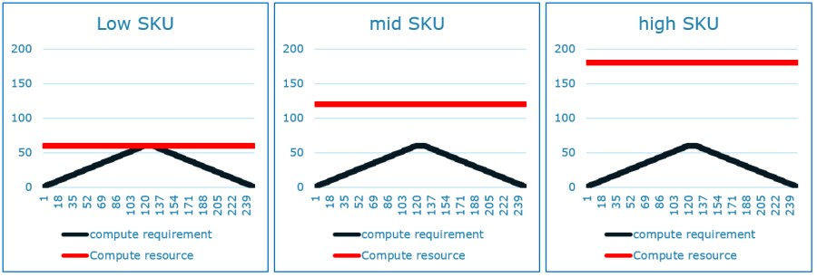

-   On a SKL GT4 system, which has 3 slices and 9 VMEs, when encoding 1080p in "best speed" mode, we can only utilize around 30% of the VME available (that is equivalent to 1 slice worth of VMEs!). When we have a single stream being encoded, as a result, disabling 2 slices and having only 1 slice on starts to become beneficial - (1) to reduce thread scheduling, (2) and power consumption by concentrating the execution on one slice instead of spreading across 3.

###### Figure 4. VME utilization result

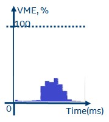

System utilization
------------------

In most transcode use-cases, we are bound by the EUs (due to MBEnc kernel timings), and combine that with poor scalability with VMEs and single context limitation, transcode workloads esp ABR or multi transcode use-cases are impacted. This impact is exacerbated on low resolutions. Consider the pipeline below with 4 parallel transcodes:

###### Figure 5. System utilization bound by EU array

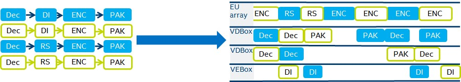

Multi-frame encode concept
==========================

Frames from different streams/sessions are combined together as single batch buffer of the ENC kernel (MF-ENC). This helps to increase number of independent wave fronts executed in parallel, creating more parallelism for ENC operation and thus increasing VME utilization. As a result the EU array can process several frames within the same or near to the same execution time as a single frame.

###### Figure 6. MFE Encode kernel concept

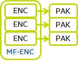

VME utilization improvement
---------------------------

VME utilization increased, within the same or near ENC execution time as single frame.

###### Figure 7. VME utilization improvement

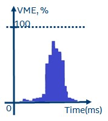

System utilization improvement
------------------------------

As multiple frames execute at a time of single frame, system utilization improved, through improved EU Array time utilization.

###### Figure 8. System utilization improvement

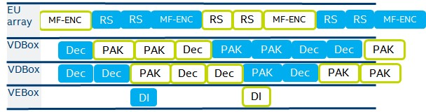


Media SDK architecture introduction
===================================

App-Media SDK-Driver stack submission data flow
-----------------------------------------------

###### Figure 1. SW stack submission flow

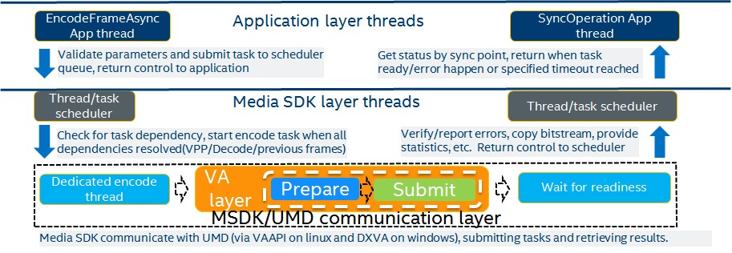

Single frame architecture and code flow is almost the same for legacy encode and FEI from execution and MSDK\<-\>driver communication perspective:

 1.  Media SDK receive frame for processing(pre-ENC/ENC/ENCODE) from application in synchronous part(application thread), verify parameters and prepare scheduler task for execution via either:
    
    -   MFXVideoENCODE\_EncodeFrameAsync - legacy encode, FEI encode.
 2.  Scheduler checks task dependencies like reordered frames tasks and if dependencies are resolved for this task and thread 0 (dedicated
    thread) is free, assigns task for execution and start asynchronous part.
    
 3.  [VA Layer Encoder](https://github.com/Intel-Media-SDK/MediaSDK/blob/master/_studio/mfx_lib/shared/src/mfx_h264_encode_vaapi.cpp) prepare and submit buffers for driver:
    
    -   Pixel buffers: raw, reconstructed surfaces, downscaled surfaces for pre-ENC.
    -   Compressed buffers: compressed headers, bitstream buffer.
    -   VA control buffers with input parameters: sequence level control parameters, picture control parameters, slice control parameters.
    -   FEI non-pixel output buffers: motion vectors, MB statistics, PAK control object.
    -   Additional non pixel video memory control buffers: MBQP map, Intra/Skip map.
    
    -   Encoder submit buffers to [driver UMD](https://github.com/intel/intel-vaapi-driver). Standard [VAAPI](https://github.com/intel/libva) calling sequence:
        -   `vaBeginPicture`
        -   `vaRenderPicture`
        -   `vaEndPicture`.
    -   [Driver UMD](https://github.com/intel/intel-vaapi-driver) prepares and submit batch buffer for execution on HW at `vaEndPicture` call.

 4.  Encoder proceed to synchronization step(see synchronization chapter for details), wait for task to be completed and return result (bitstream or FEI output).
    

 5.  Scheduler return control to application in MFXVideoCORE_SyncOperation and output data can be used by application.
    

Synchronization
---------------

Media SDK implements 2 synchronization approaches: blocking synchronization, event or polling based synchronization.

### Blocking synchronization

Blocking synchronization implemented in linux stack and based on synchronization by resource (for encoder input surface). Dedicated encoder thread is blocked for execution until task is ready, then return control over thread back to scheduler.

###### Figure 2. Blocking synchronization design

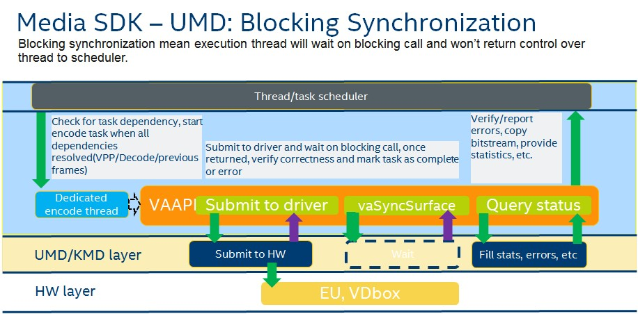

Media SDK session overview
--------------------------

[Media SDK session](https://github.com/Intel-Media-SDK/MediaSDK/blob/master/api/include/mfxsession.h#L30) represent an object that shares access for high level functional objects:
-   Decoder - provides decoding capabilities
-   Encoder - provides encoding capabilities
-   VPP - provides video processing capabilities(DI, DN, Scale, FRC, CSC, etc.)
-   User plugin - provides capability to user implement own processing function(CPU, OpenCL, etc) integrated with Media SDK APIs.
-   [Core](https://github.com/Intel-Media-SDK/MediaSDK/blob/master/_studio/shared/src/libmfx_core_vaapi.cpp) - provides service functions(copy, memory mapping, memory sharing, object sharing) for components and interfaces between external and internal components for memory allocation and  sharing (allocators and devices).
-   [Scheduler](https://github.com/Intel-Media-SDK/MediaSDK/tree/master/_studio/mfx_lib/scheduler) - thread and task allocation, execution, managing task queue, execution order, synchronization, etc.

###### Figure 4. Media SDK session architecture

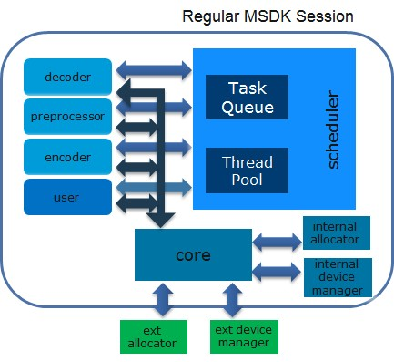

Joining sessions
----------------

[Joining sessions](https://github.com/Intel-Media-SDK/MediaSDK/blob/master/_studio/mfx_lib/shared/src/libmfxsw_session.cpp#L26) will create link between sessions and remove scheduler object from child session, thus core objects are able to share resources between different instances of components and allocators, manage thread and task scheduler within one scheduler object.

###### Figure 5. Join session architecture

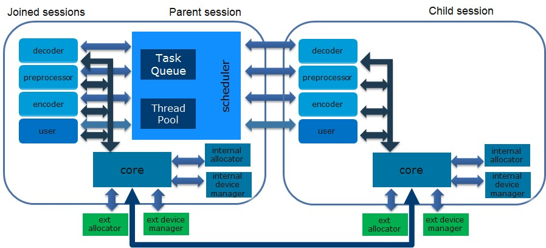

Media SDK Internal changes and submission flow
==============================================

###### Figure 6. Media SDK submission flow change

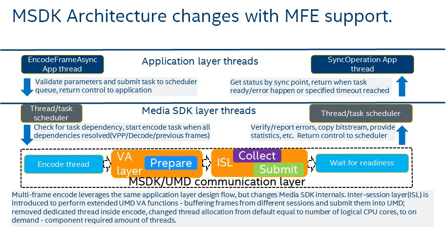

Encoder dedicated thread change
-------------------------------


In joined sessions scenario there is only one scheduler for all encoders. Dedicated thread together with blocking synchronization architecture leading to:
-   Dedicated thread blocked on waiting for task readiness, so can't submit new task before previous finished.
-   All encoder submissions are serialized, so no submission concurrency, as a result no ENC/PAK concurrency between different encoders.
-   Multi-frame scenario can't work as no ability to submit several frames from different encoders, working in one thread.

Removing dedicated thread dependency solving this issue, thus even with Joined session scenario all encoders working using own threads(free threads from common pull). This actual for legacy Encode, FEI Encode, Enc and Pre-Enc paths. Currently most of Media SDK components do not work in dedicated thread

MSDK/Driver task synchronization changes
----------------------------------------

[VAAPI](https://github.com/intel/libva): synchronization changed from vaSyncSurface to vaMapBuffer in encoder, to change synchronization target from input surface to bitstream - this will help to resolve:
 1. In scenario where single input shared with multiple encoders, vaSyncSurface will synchronize by latest one, so encoding result for all encoders depend on input and can bring latency problems.
 2. MFE will benefit as single kernel workload utilize all input and bound by biggest one, but PAK is independent and smaller one can provide result faster, which is not reachable when synchronization done by input surface.

Inter-session layer concept
---------------------------


[Inter session(ISL)](https://github.com/Intel-Media-SDK/MediaSDK/blob/master/_studio/shared/src/mfx_mfe_adapter.cpp) layer introduced as an object shared between different encoders and accessed from ["VA layer"](https://github.com/Intel-Media-SDK/MediaSDK/blob/master/_studio/mfx_lib/shared/src/mfx_h264_encode_vaapi.cpp) encoder part. Major feature in combination with [MFE VAAPI](https://github.com/intel/libva/pull/112) is
that single frame execution of VA layer not changed.  ISL introducing capabilities for:
 - Collecting frames, e.g. buffer frames from different encoders to submit MFE workload.
 - Frame management, e.g. decision about what frames to combine together for better performance.
 - Thread/Time management, required to feet particular frame readiness within latency requirement.

### Frames Preparation

In MFE workload preparation step combines preparation and submission step described in part 3 of ingle frame encoder
pipeline, including [VAAPI](https://github.com/intel/libva) function calls, but real submission moved to ISL exercising [MFE VAAPI](https://github.com/intel/libva/pull/112).
Preparation is done for each encoder involved into MFE pipeline separately. So each encoder using it's own Encode `VAContext` prepare
buffers and call `vaBeginPicture`, `vaRenderPicture` and `vaEndPicture` sequence, after that proceed into ISL layer.

### Frames Submission

Submission responsibility moved from VA layer to ISL in MFE pipeline and performed by `vaMFSubmit` call.

### Frames Collection

Frames collection performed in ISL layer, this is the most functionally complex part of MFE pipeline performing frames and threads management. Below diagrams showing several scenarios of ISL behavior in different situations.

#### Smooth buffering with number of sessions equal to number of frames allowed

Introduces case with 4 parallel streams running in MFE auto mode with maximum 4 frames allowed for submission, the normal flow can be described as following:
 1. Each Thread/Session/Stream after frame preparation in VA layer call ISL layer, taking control over it locking control mutex, ISL layer     check if there are enough frames to submit, if not, current thread release control over ISL to other threads unlocking control mutex and wait for either timeout or submission condition resolved.
 2. Thread 4 submits frames to UMD and signal submission condition resolved to other threads waiting on condition.
 3. All threads go to synchronization stage performed separately at each encode `VAContext`.

###### Figure 7. Smooth Frame Buffering 

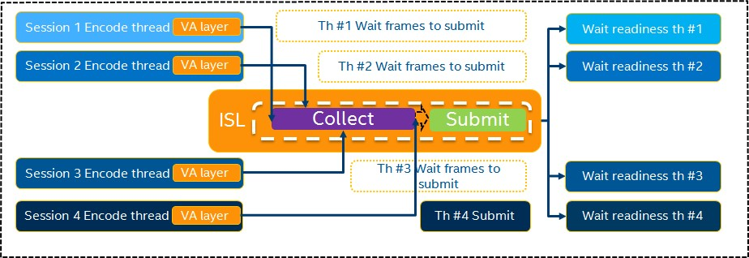

#### Timeout example

This example shows how particular encoding latency constrains achieved in MFE architecture. Introduces case with 4 parallel streams running in MFE auto mode with maximum 4 frames allowed for submission, flow can be described as following:
1.  Session/thread/stream 1, 2 and 3 had submitted frames and wait for either submission or timeout
2.  Session/thread/stream 1 had reached specified timeout(for example 30 fps stream has a requirement to achieve 33 ms sync-to-sync latency, so timeout set in range 1-33 ms depending on frame submission time) took control over ISL and submitted 3 frames.
3.  Session 4 frame has arrived late and go to next submission.

###### Figure 8. Frame buffering with reached timeout

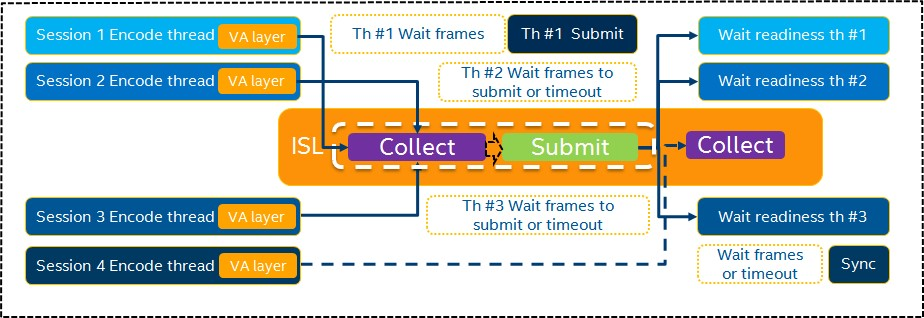

Media SDK API
=============

MFXJoinSession usage
====================

`mfxStatus MFX_CDECL MFXJoinSession(mfxSession session, mfxSession child)` existing API.

*Description*

-   This function joins the child session to the current session.<br>After joining, the two sessions share thread and resource scheduling for asynchronous operations. However, each session still maintains its own device manager and buffer/frame allocator. Therefore, the application must use a compatible device manager and buffer/frame allocator to share data between two joined sessions.<br>The application can join multiple sessions by calling this function multiple times. When joining the first two sessions, the current session becomes the parent responsible for thread and resource scheduling of any later joined sessions.<br>Joining of two parent sessions is not supported.

-   Multi-Frame Encode put a requirement to share common objects between sessions and access common resources, thus Application need to Join encoder(or FEI) sessions to share scheduler, UMD context and core. Join Session API not MFE specific, but required for MFE.

*Parameters*

`mfxSession session` - current session or parent session.
`mfxSession child` - child session;

*Restrictions*

`MFXVideoCORE_SetHandle` have to be called before this call for both parent and child session with the same handle and handle type for MFE. Child session can't be joined to parent session after components were initialized, this limitation related to architecture: scheduler of child session will be destroyed, so when components are initialized they require scheduler to allocate threads associated with component, once scheduler removed - threads being de-allocated. 

Number of joined sessions does not affect number of frames except case when number of session is less than number of possible frames to combine.

Encoder initialization changes
==============================

Extended buffers added:

`mfxExtMultiFrameParam`
----------------------

*Deprecated in 1.35 and removed starting from 2.0*

*Definition:*
```
 typedef struct {

     mfxExtBuffer Header;

     mfxU16      MFMode;

     mfxU16      MaxNumFrames; 

     mfxU16      reserved[58];

 } mfxExtMultiFrameParam;
```
*Description:*

This structure used to query supported parameters for MFE operation and encoder initialization parameters.

`MFXVideoENCODE_Query` or `MFXVideoENC_Query` function reports maximum number of frames supported for particular codec into MaxNumFrames and supported MFEMode.
`MFXVideoENCODE_Init` or `MFXVideoENC_Init` function enables maximum number of frames to be used in all encoder sessions joined together according to MaxNumFrames and MFEMode enabled.
*Members:*
    `Mode` - Multi frame encode scheduling mode.
    `MaxNumFrames` - maximum number of frames to be used in MFE pipeline.

*Limitations:*
Each encoder joined for MFE workload have to enable the same MFE mode and MaxNumFrames, as they share the same ISL which use those parameters to perform scheduling. MaxNumFrames returned from query will depend on platform, codec, as well as can depend on resolution and other parameters, returned value will be aligned with assumption all encoders are running with the same parameters as current encoder.
**This can be improved??** to change or add \"How Many Frames left\", but this will depend on already joined sessions, so MSDK leverage ISL on number of frames it can combine together.

Multi Frame Encode Scheduling Modes
-----------------------------------

/\* Multi Frame Encode Mode \*/\
```
enum {
    MFX_MF_DEFAULT  = 0,
    MFX_MF_DISABLED = 1,
    MFX_MF_AUTO     = 2,
    MFX_MF_MANUAL   = 3,
};
```
*Entries:*
`MFX_MF_DEFAULT` - Media SDK decide what operation mode to choose.
`MFX_MF_AUTO` - Automatic, Media SDK decide what and how many frames to submit as well as how long to wait for frames from different streams.
`MFX_MF_MANUAL` - Application use per frame control to manage submission described in frame management, no timeouts inside MediaSDK, Application fully controls when frame buffer is ready to be submitted.
`MFX_MF_DISABLED` - MFE explicitly disabled.

Frame Management
================

New structure added

*Deprecated in 1.35 and removed starting from 2.0*

*Definition:*
```
typedef struct {
    mfxExtBuffer Header;
    mfxU16      Flush;             //flush internal frame buffer, e.g. submit all frames.
    mfxU32      timeout;           //timeout in millisecond.
    mfxU16      reserved[57];
} mfxExtMultiFrameControl;
```
*Description*

Used by application on Initialization and per frame basis to either:
    -   When passed to `MFXVideoENCODE_Init` or `MFXVideoENC_Init` timeout will be used for all frames in current stream (session).
    -   When passed to `MFXVideoENCODE_EncodeFrameAsync` or `MFXVideoENC_ProcessFrameAsync` - used as per frame management control over MFE submission.

*Members:*

`Flush` - when mode `MFX_MF_MANUAL` used, if enabled will force ISL internal frame buffer to submit all frames within current frame. Otherwise current frame will wait for `MaxFrameNum` to be buffered in ISL or flush from another stream.
`timeout` - when `MFX_MF_AUTO` is enabled, used as time in milliseconds this particular frame can wait for.

