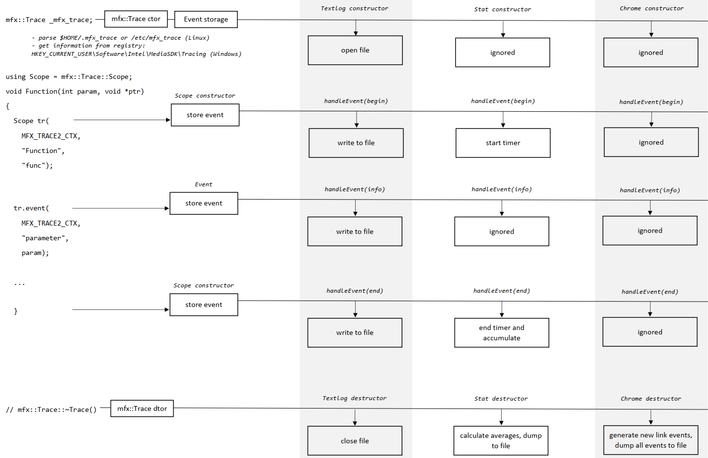

# MediaSDK tracing (mfx_trace2). User documentation

## Scoped tracing

You need to create `mfx::Trace::Scope` object in the beginning of the scope you want to trace.

Example:
```cpp
void Function(int param, void *ptr)
{
    mfx::Trace::Scope tr(MFX_TRACE2_CTX, "Function", "func");  // <-- Function begin event
    tr.event(MFX_TRACE2_CTX, "parameter", param);              // <-- info event
    tr.event(MFX_TRACE2_CTX, "pointer", ptr);                  // <-- info event
    ...
}                                                              // <-- Function end event
```

Also every event created in the scope has its own map that contains additional information. Traces support saving information about variable values which can be used by tracing backends. Saving can be done using `event` method from `mfx::Trace::Scope`. The first parameter (after mfx_trace context) is name, the second parameter is the object to save. All events are sent to tracing backends. Backends process events according to the following diagram:



## Tracing backends

Available tracing backends:
- Text log

  How to enable:
  ```sh
  mkdir build && cd build
  cmake -DENABLE_MFX_TRACE2=ON -DENABLE_TEXTLOG=ON ..
  echo "Output=0x30" > $HOME/.mfx_trace
  echo "TextLog=<path_to_log_file>" >> $HOME/.mfx_trace  # optional, default log path: /tmp/mfx.log
  ```

  Log format:
  ```
  <file>:<log> - <function> <timestamp> <ENTER|VARIABLE|EXIT>
  ```

  Example of the log:
  ```
  /home/user/msdk/_studio/mfx_lib/shared/src/libmfxsw_async.cpp:30 - MFXVideoCORE_SyncOperation 3367604310226 ENTER
  /home/user/msdk/_studio/mfx_lib/shared/src/libmfxsw_async.cpp:31 - MFXVideoCORE_SyncOperation 3367604310258 VARIABLE
          "session":"0x5652f7827d98"
  /home/user/msdk/_studio/mfx_lib/shared/src/libmfxsw_async.cpp:32 - MFXVideoCORE_SyncOperation 3367604310265 VARIABLE
          "syncp":"0x96c00"
  /home/user/msdk/_studio/mfx_lib/shared/src/libmfxsw_async.cpp:30 - MFXVideoCORE_SyncOperation 3367604314485 EXIT
  ```

- Stat

  How to enable:
  ```sh
  mkdir build && cd build
  cmake -DENABLE_MFX_TRACE2=ON -DENABLE_STAT=ON ..
  ```

  Log format:
  ```
  Function name                           : Total time , Number , Avg. time , Std. dev , Category
  ```

  Example of the log:
  ```
  Function name                           : Total time , Number , Avg. time , Std. dev , Category
  MFXVideoCORE_SyncOperation              : 1.073697   , 600    , 0.001789  , 0.000965 , sync
  MFXVideoENCODE_EncodeFrameAsync         : 0.021076   , 605    , 0.000035  , 0.000012 , enc
  ```

- Chrome tracing

  How to enable:
  ```sh
  mkdir build && cd build
  cmake -DENABLE_MFX_TRACE2=ON -DENABLE_CHROME_TRACE=ON ..
  ```

  Chrome traces are dumped in current directory with filename `chrome_trace_<pid>.json`.

  How to use:
  - Open `chrome://tracing` in Chrome browser
  - Load json file using drag-and-drop or "Load" button

- VTune ftrace

  How to enable:
  ```sh
  mkdir build && cd build
  cmake -DENABLE_MFX_TRACE2=ON -DENABLE_VTUNE_FTRACE=ON ..
  ```
