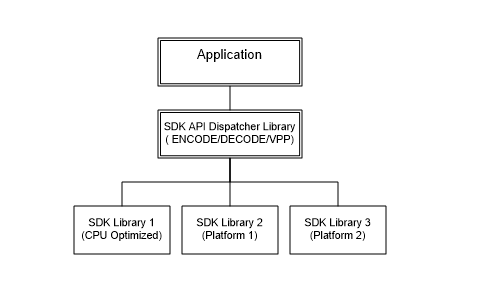
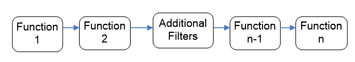
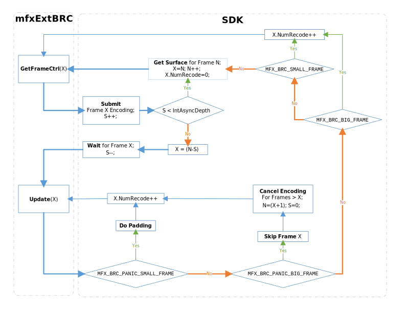
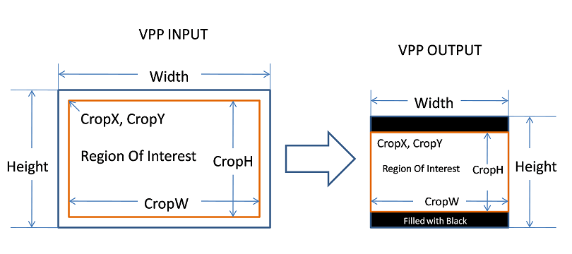
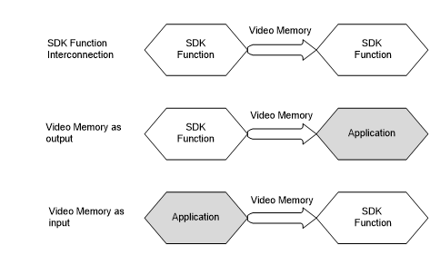
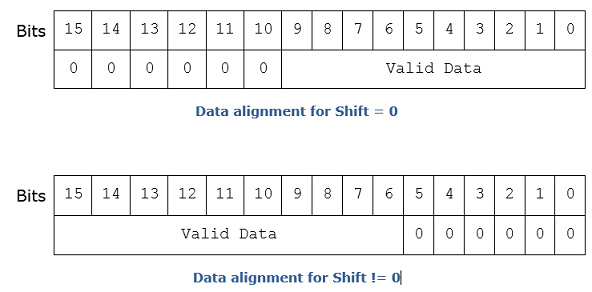



# **Media SDK Developer Reference**
## Media SDK API Version 1.35

<div style="page-break-before:always" />

**LEGAL DISCLAIMER**

INFORMATION IN THIS DOCUMENT IS PROVIDED IN CONNECTION WITH INTEL PRODUCTS. NO LICENSE, EXPRESS OR IMPLIED, BY ESTOPPEL OR OTHERWISE, TO ANY INTELLECTUAL PROPERTY RIGHTS IS GRANTED BY THIS DOCUMENT.  EXCEPT AS PROVIDED IN INTEL'S TERMS AND CONDITIONS OF SALE FOR SUCH PRODUCTS, INTEL ASSUMES NO LIABILITY WHATSOEVER AND INTEL DISCLAIMS ANY EXPRESS OR IMPLIED WARRANTY, RELATING TO SALE AND/OR USE OF INTEL PRODUCTS INCLUDING LIABILITY OR WARRANTIES RELATING TO FITNESS FOR A PARTICULAR PURPOSE, MERCHANTABILITY, OR INFRINGEMENT OF ANY PATENT, COPYRIGHT OR OTHER INTELLECTUAL PROPERTY RIGHT.

UNLESS OTHERWISE AGREED IN WRITING BY INTEL, THE INTEL PRODUCTS ARE NOT DESIGNED NOR INTENDED FOR ANY APPLICATION IN WHICH THE FAILURE OF THE INTEL PRODUCT COULD CREATE A SITUATION WHERE PERSONAL INJURY OR DEATH MAY OCCUR.

Intel may make changes to specifications and product descriptions at any time, without notice. Designers must not rely on the absence or characteristics of any features or instructions marked "reserved" or "undefined." Intel reserves these for future definition and shall have no responsibility whatsoever for conflicts or incompatibilities arising from future changes to them. The information here is subject to change without notice. Do not finalize a design with this information. 

The products described in this document may contain design defects or errors known as errata which may cause the product to deviate from published specifications. Current characterized errata are available on request. 

Contact your local Intel sales office or your distributor to obtain the latest specifications and before placing your product order. 

Copies of documents which have an order number and are referenced in this document, or other Intel literature, may be obtained by calling 1-800-548-4725, or by visiting [Intel's Web Site](http://www.intel.com/).

MPEG is an international standard for video compression/decompression promoted by ISO. Implementations of MPEG CODECs, or MPEG enabled platforms may require licenses from various entities, including Intel Corporation.

Intel and the Intel logo are trademarks or registered trademarks of Intel Corporation or its subsidiaries in the United States and other countries.

\*Other names and brands may be claimed as the property of others.

Copyright © 2007-2020, Intel Corporation. All Rights reserved.
<div style="page-break-before:always" /> 

**Optimization Notice**

Intel's compilers may or may not optimize to the same degree for non-Intel microprocessors for optimizations that are not unique to Intel microprocessors. These optimizations include SSE2, SSE3, and SSSE3 instruction sets and other optimizations. Intel does not guarantee the availability, functionality, or effectiveness of any optimization on microprocessors not manufactured by Intel. 

Microprocessor-dependent optimizations in this product are intended for use with Intel microprocessors. Certain optimizations not specific to Intel microarchitecture are reserved for Intel microprocessors. Please refer to the applicable product User and Reference Guides for more information regarding the specific instruction sets covered by this notice.

Notice revision #20110804

<div style="page-break-before:always" />

- [Overview](#overview)
  * [Document Conventions](#document-conventions)
  * [Acronyms and Abbreviations](#acronyms-and-abbreviations)
- [Architecture](#architecture)
  * [Video Decoding](#video-decoding)
  * [Video Encoding](#video-encoding)
  * [Video Processing](#video-processing)
- [Programming Guide](#programming-guide)
  * [Status Codes](#status-codes)
  * [SDK Session](#sdk-session)
    + [Multiple Sessions](#multiple-sessions)
  * [Frame and Fields](#frame-and-fields)
    + [Frame Surface Locking](#frame-surface-locking)
  * [Decoding Procedures](#decoding-procedures)
    + [Bitstream Repositioning](#bitstream-repositioning)
    + [Multiple Sequence Headers](#multiple-sequence-headers)
    + [Broken Streams Handling](#broken-streams-handling)
  * [Encoding Procedures](#encoding-procedures)
    + [Configuration Change](#configuration-change)
    + [External Bit Rate Control](#External_Bit_Rate_Control)
  * [Video Processing Procedures](#video-processing-procedures)
    + [Configuration](#Configuration)
    + [Region of Interest](#region-of-interest)
  * [Transcoding Procedures](#transcoding-procedures)
    + [Asynchronous Pipeline](#asynchronous-pipeline)
    + [Surface Pool Allocation](#Surface_Pool_Allocation)
    + [Pipeline Error Reporting](#pipeline-error-reporting)
  * [Working with hardware acceleration](#hardware_acceleration)
    + [Working with multiple Intel media devices](#Working_with_multiple_intel_media_devices)
    + [Working with video memory](#Working_with_video_memory)
    + [Working with Microsoft* DirectX* Applications](#Working_with_Microsoft*)
    + [Working with VA API Applications](#working-with-va-api-applications)
  * [Memory Allocation and External Allocators](#Memory_Allocation)
  * [Surface Type Neutral Transcoding](#surface-type-neutral-transcoding)
  * [Hardware Device Error Handling](#hardware-device-error-handling)
- [Function Reference](#function-reference)
  * [Global Functions](#global-functions)
    + [MFXCloneSession](#MFXCloneSession)
    + [MFXClose](#MFXClose)
    + [MFXDoWork](#MFXDoWork)
    + [MFXDisjoinSession](#MFXDisjoinSession)
    + [MFXGetPriority](#MFXGetPriority_1)
    + [MFXInit](#MFXInit)
    + [MFXInitEx](#MFXInitEx)
    + [MFXJoinSession](#MFXJoinSession)
    + [MFXQueryIMPL](#MFXQueryIMPL)
    + [MFXQueryVersion](#MFXQueryVersion)
    + [MFXSetPriority](#MFXSetPriority)
  * [MFXVideoCORE](#mfxvideocore)
    + [MFXVideoCORE_SetHandle](#MFXVideoCORE_SetHandle)
    + [MFXVideoCORE_GetHandle](#MFXVideoCORE_GetHandle)
    + [MFXVideoCORE_SetBufferAllocator](#MFXVideoCORE_SetBufferAllocator)
    + [MFXVideoCORE_SetFrameAllocator](#MFXVideoCORE_SetFrameAllocator)
    + [MFXVideoCORE_QueryPlatform](#MFXVideoCORE_QueryPlatform)
    + [MFXVideoCORE_SyncOperation](#MFXVideoCORE_SyncOperation)
  * [MFXVideoENCODE](#mfxvideoencode)
    + [MFXVideoENCODE_Query](#MFXVideoENCODE_Query)
    + [MFXVideoENCODE_QueryIOSurf](#MFXVideoENCODE_QueryIOSurf)
    + [MFXVideoENCODE_Init](#MFXVideoENCODE_Init)
    + [MFXVideoENCODE_Reset](#MFXVideoENCODE_Reset)
    + [MFXVideoENCODE_Close](#MFXVideoENCODE_Close)
    + [MFXVideoENCODE_GetVideoParam](#MFXVideoENCODE_GetVideoParam)
    + [MFXVideoENCODE_GetEncodeStat](#MFXVideoENCODE_GetEncodeStat)
    + [MFXVideoENCODE_EncodeFrameAsync](#MFXVideoENCODE_EncodeFrameAsync)
  * [MFXVideoENC](#mfxvideoenc)
    + [MFXVideoENC_Query](#MFXVideoENC_Query)
    + [MFXVideoENC_QueryIOSurf](#MFXVideoENC_QueryIOSurf)
    + [MFXVideoENC_Init](#MFXVideoENC_Init)
    + [MFXVideoENC_Reset](#MFXVideoENC_Reset)
    + [MFXVideoENC_Close](#MFXVideoENC_Close)
    + [MFXVideoENC_GetVideoParam](#MFXVideoENC_GetVideoParam)
    + [MFXVideoENC_ProcessFrameAsync](#MFXVideoENC_ProcessFrameAsync)
  * [MFXVideoDECODE](#mfxvideodecode)
    + [MFXVideoDECODE_DecodeHeader](#MFXVideoDECODE_DecodeHeader)
    + [MFXVideoDECODE_Query](#MFXVideoDECODE_Query)
    + [MFXVideoDECODE_QueryIOSurf](#MFXVideoDECODE_QueryIOSurf)
    + [MFXVideoDECODE_Init](#MFXVideoDECODE_Init)
    + [MFXVideoDECODE_Reset](#MFXVideoDECODE_Reset)
    + [MFXVideoDECODE_Close](#MFXVideoDECODE_Close)
    + [MFXVideoDECODE_GetVideoParam](#MFXVideoDECODE_GetParam)
    + [MFXVideoDECODE_GetDecodeStat](#MFXVideoDECODE_GetDecodeStat)
    + [MFXVideoDECODE_GetPayload](#MFXVideoDECODE_GetPayload)
    + [MFXVideoDECODE_SetSkipMode](#MFXVideoDECODE_SetSkipMode)
    + [MFXVideoDECODE_DecodeFrameAsync](#MFXVideoDECODE_DecodeFrameAsync)
  * [MFXVideoVPP](#mfxvideovpp)
    + [MFXVideoVPP_Query](#MFXVideoVPP_Query)
    + [MFXVideoVPP_QueryIOSurf](#MFXVideoVPP_QueryIOSurf)
    + [MFXVideoVPP_Init](#MFXVideoVPP_Init)
    + [MFXVideoVPP_Reset](#MFXVideoVPP_Reset)
    + [MFXVideoVPP_Close](#MFXVideoVPP_Close)
    + [MFXVideoVPP_GetVideoParam](#MFXVideoVPP_GetVideoParam)
    + [MFXVideoVPP_GetVPPStat](#MFXVideoVPP_GetVPPStat)
    + [MFXVideoVPP_RunFrameVPPAsync](#MFXVideoVPP_RunFrameVPPAsync)
- [Structure Reference](#structure-reference)
  * [mfxBitstream](#mfxBitstream)
  * [mfxBufferAllocator](#mfxbufferallocator)
    + [Alloc](#BufferAlloc)
    + [Free](#BufferFree)
    + [Lock](#BufferLock)
    + [Unlock](#BufferUnlock)
  * [mfxDecodeStat](#mfxDecodeStat)
  * [mfxEncodeCtrl](#mfxEncodeCtrl)
  * [mfxEncodeStat](#mfxEncodeStat)
  * [mfxExtBuffer](#mfxExtBuffer)
  * [mfxExtAVCRefListCtrl](#mfxExtAVCRefListCtrl)
  * [mfxExtAVCRefLists](#mfxextavcreflists)
  * [mfxExtHEVCRefListCtrl](#mfxExtHEVCRefListCtrl)
  * [mfxExtHEVCRefLists](#mfxExtHEVCRefLists)
  * [mfxExtCodingOption](#mfxExtCodingOption)
  * [mfxExtCodingOption2](#mfxExtCodingOption2)
  * [mfxExtCodingOption3](#mfxExtCodingOption3)
  * [mfxExtCodingOptionSPSPPS](#mfxExtCodingOptionSPSPPS)
  * [mfxExtOpaqueSurfaceAlloc](#mfxExtOpaqueSurfaceAlloc)
  * [mfxExtVideoSignalInfo](#mfxExtVideoSignalInfo)
  * [mfxExtPictureTimingSEI](#mfxExtPictureTimingSEI)
  * [mfxExtAvcTemporalLayers](#mfxExtAvcTemporalLayers)
  * [mfxExtHEVCTemporalLayers](#mfxExtHEVCTemporalLayers)
  * [mfxExtVppAuxData](#mfxExtVppAuxData)
  * [mfxExtVPPDenoise](#mfxExtVPPDenoise)
  * [mfxExtVppMctf](#mfxExtVppMctf)
  * [mfxExtVPPDetail](#mfxExtVPPDetail)
  * [mfxExtVPPDoNotUse](#mfxExtVPPDoNotUse)
  * [mfxExtVPPDoUse](#mfxExtVPPDoUse)
  * [mfxExtVPPFrameRateConversion](#mfxExtVPPFrameRateConversion)
  * [mfxExtVPPProcAmp](#mfxExtVPPProcAmp)
  * [mfxExtVPPImageStab](#mfxExtVPPImageStab)
  * [mfxExtVPPComposite](#mfxExtEncoderCapability)
  * [mfxExtVPPVideoSignalInfo](#mfxextvppvideosignalinfo)
  * [mfxExtEncoderCapability](#mfxExtEncoderCapability_1)
  * [mfxExtEncoderResetOption](#mfxExtEncoderResetOption)
  * [mfxExtAVCEncodedFrameInfo](#mfxExtAVCEncodedFrameInfo)
  * [mfxExtEncoderROI](#mfxextencoderroi)
  * [mfxExtMasteringDisplayColourVolume](#mfxExtMasteringDisplayColourVolume)
  * [mfxExtContentLightLevelInfo](#mfxExtContentLightLevelInfo)
  * [mfxExtVPPDeinterlacing](#mfxExtVPPDeinterlacing)
  * [mfxFrameAllocator](#mfxFrameAllocator)
    + [Alloc](#Alloc)
    + [Free](#FrameFree)
    + [Lock](#FrameLock)
    + [Unlock](#FrameUnlock)
    + [GetHDL](#FrameGetHDL)
  * [mfxFrameAllocRequest](#mfxFrameAllocRequest)
  * [mfxFrameAllocResponse](#mfxFrameAllocResponse)
  * [mfxFrameData](#mfxFrameData)
  * [mfxFrameInfo](#mfxFrameInfo)
  * [mfxFrameSurface1](#mfxFrameSurface)
  * [mfxInfoMFX](#mfxInfoMFX)
  * [mfxInfoVPP](#mfxInfoVPP)
  * [mfxInitParam](#mfxInitParam)
  * [mfxPlatform](#mfxPlatform)
  * [mfxPayload](#mfxPayload)
  * [mfxVersion](#mfxVersion)
  * [mfxVideoParam](#mfxVideoParam)
  * [mfxVPPStat](#mfxVPPStat)
  * [mfxENCInput](#mfxENCInput)
  * [mfxENCOutput](#mfxENCOutput)
  * [mfxExtLAControl](#mfxExtLAControl)
  * [mfxExtLAFrameStatistics](#mfxExtLAFrameStatistics)
  * [mfxExtVPPFieldProcessing](#mfxExtVPPFieldProcessing)
  * [mfxExtMBQP](#mfxExtMBQP)
  * [mfxExtMBForceIntra](#mfxExtMBForceIntra)
  * [mfxExtChromaLocInfo](#mfxExtChromaLocInfo)
  * [mfxExtHEVCTiles](#mfxExtHEVCTiles)
  * [mfxExtMBDisableSkipMap](#mfxExtMBDisableSkipMap)
  * [mfxExtDecodedFrameInfo](#mfxExtDecodedFrameInfo)
  * [mfxExtTimeCode](#mfxExtTimeCode)
  * [mfxExtHEVCRegion](##mfxexthevcregion)
  * [mfxExtThreadsParam](#mfxExtThreadsParam)
  * [mfxExtHEVCParam](#mfxExtHEVCParam)
  * [mfxExtPredWeightTable](#mfxExtPredWeightTable)
  * [mfxExtAVCRoundingOffset](#mfxExtAVCRoundingOffset)
  * [mfxExtDirtyRect](#mfxExtDirtyRect)
  * [mfxExtMoveRect](#mfxExtMoveRect)
  * [mfxExtCodingOptionVPS](#mfxExtCodingOptionVPS)
  * [mfxExtVPPRotation](#mfxExtVPPRotation)
  * [mfxExtVPPScaling](#mfxExtVPPScaling)
  * [mfxExtVPPMirroring](#mfxExtVPPMirroring)
  * [mfxExtVPPColorFill](#mfxExtVPPColorFill)
  * [mfxExtEncodedSlicesInfo](#mfxExtEncodedSlicesInfo)
  * [mfxExtMVOverPicBoundaries](#mfxExtMVOverPicBoundaries)
  * [mfxExtDecVideoProcessing](#mfxExtDecVideoProcessing)
  * [mfxExtVP9Param](#mfxExtVP9Param)
  * [mfxExtVP9Segmentation](#mfxExtVP9Segmentation)
  * [mfxExtVP9TemporalLayers](#mfxExtVP9TemporalLayers)
  * [mfxExtBRC](#mfxExtBRC)
    + [Init](#BRCInit)
    + [Reset](#BRCReset)
    + [Close](#BRCClose)
    + [GetFrameCtrl](#BRCGetFrameCtrl)
    + [Update](#BRCUpdate)
  * [mfxBRCFrameParam](#mfxBRCFrameParam)
  * [mfxBRCFrameCtrl](#mfxBRCFrameCtrl)
  * [mfxBRCFrameStatus](#mfxBRCFrameStatus)
  * [mfxExtMultiFrameParam](#mfxExtMultiFrameParam)
  * [mfxExtMultiFrameControl](#mfxExtMultiFrameControl)
  * [mfxExtEncodedUnitsInfo](#mfxExtEncodedUnitsInfo)
  * [mfxExtColorConversion](#mfxExtColorConversion)
  * [mfxExtDecodeErrorReport](#mfxExtDecodeErrorReport)
  * [mfxExtCencParam](#mfxExtCencParam)
  * [mfxExtInsertHeaders](#mfxExtInsertHeaders)
  * [mfxExtEncoderIPCMArea](#mfxExtEncoderIPCMArea)
- [Enumerator Reference](#enumerator-reference)
  * [BitstreamDataFlag](#BitstreamDataFlag)
  * [ChromaFormatIdc](#ChromaFormatIdc)
  * [CodecFormatFourCC](#CodecFormatFourCC)
  * [CodecLevel](#CodecLevel)
  * [CodecProfile](#CodecProfile)
  * [CodingOptionValue](#CodingOptionValue)
  * [ColorFourCC](#ColorFourCC)
  * [Corruption](#Corruption)
  * [ExtendedBufferID](#ExtendedBufferID)
  * [ExtMemBufferType](#ExtMemBufferType)
  * [ExtMemFrameType](#ExtMemFrameType)
  * [FrameDataFlag](#FrameDataFlag)
  * [FrameType](#FrameType)
  * [MfxNalUnitType](#MfxNalUnitType)
  * [FrcAlgm](#FrcAlgm)
  * [GopOptFlag](#GopOptFlag)
  * [IOPattern](#IOPattern)
  * [mfxHandleType](#mfxHandleType)
  * [mfxIMPL](#mfxIMPL)
  * [mfxPriority](#mfxPriority)
  * [mfxSkipMode](#mfxSkipMode)
  * [mfxStatus](#mfxStatus)
  * [PicStruct](#PicStruct)
  * [RateControlMethod](#RateControlMethod)
  * [TimeStampCalc](#TimeStampCalc)
  * [TargetUsage](#TargetUsage)
  * [TrellisControl](#TrellisControl)
  * [BRefControl](#BRefControl)
  * [LookAheadDownSampling](#LookAheadDownSampling)
  * [VPPFieldProcessingMode](#VPPFieldProcessingMode)
  * [PicType](#PicType)
  * [SkipFrame](#SkipFrame)
  * [DeinterlacingMode](#DeinterlacingMode)
  * [TelecinePattern](#TelecinePattern)
  * [HEVCRegionType](#HEVCRegionType)
  * [GPUCopy](#GPUCopy)
  * [WeightedPred](#WeightedPred)
  * [ScenarioInfo](#ScenarioInfo)
  * [ContentInfo](#ContentInfo)
  * [PRefType](#PRefType)
  * [GeneralConstraintFlags](#GeneralConstraintFlags)
  * [Angle](#Angle)
  * [PlatformCodeName](#PlatformCodeName)
  * [PayloadCtrlFlags](#PayloadCtrlFlags)
  * [IntraRefreshTypes](#IntraRefreshTypes)
  * [VP9ReferenceFrame](#VP9ReferenceFrame)
  * [SegmentIdBlockSize](#SegmentIdBlockSize)
  * [SegmentFeature](#SegmentFeature)
  * [InsertHDRPayload](#InsertHDRPayload)
  * [SampleAdaptiveOffset](#SampleAdaptiveOffset)
  * [BRCStatus](#BRCStatus)
  * [MFMode](#MFMode)
  * [ErrorTypes](#ErrorTypes)
  * [ChromaSiting](#ChromaSiting)
  * [Protected](#Protected)
- [Appendices](#appendices)
  * [Appendix A: Configuration Parameter Constraints](#Appendix_A)
  * [Appendix B: Multiple-Segment Encoding](#Appendix_B)
  * [Appendix C: Streaming and Video Conferencing Features](#Appendix_C)
    + [Dynamic Bitrate Change](#dynamic-bitrate-change)
    + [Dynamic resolution change](#Dynamic_resolution_change)
    + [Dynamic reference frame scaling](#Dynamic_scaling)
    + [Forced Key Frame Generation](#forced-key-frame-generation)
    + [Reference List Selection](#Reference_List_Selection)
    + [Low Latency Encoding and Decoding](#low-latency-encoding-and-decoding)
    + [Reference Picture Marking Repetition SEI message](#reference-picture-marking-repetition-sei-message)
    + [Long-term Reference frame](#Long-term_Reference_frame)
    + [Temporal scalability](#Temporal_scalability)
  * [Appendix D: Switchable Graphics and Multiple Monitors](#Appendix_D)
    + [Switchable Graphics](#switchable-graphics)
    + [Multiple Monitors](#multiple-monitors)
  * [Appendix E: Working directly with VA API for Linux\*](#Appendix_E)
  * [Appendix F: CQP HRD mode encoding](#Appendix_F)

# Overview

Intel® Media Software Development Kit – SDK, further referred to as the SDK, is a software development library that exposes the media acceleration capabilities of Intel platforms for decoding, encoding and video processing. The API library covers a wide range of Intel platforms.

This document describes the SDK API. 

SDK version 1.35 supposed to be last in 1.xx series. Successor API is oneVPL https://docs.oneapi.com/versions/latest/onevpl/index.html

## Document Conventions

The SDK API uses the Verdana typeface for normal prose. With the exception of section headings and the table of contents, all code-related items appear in the `Courier New` typeface (`mxfStatus` and `MFXInit)`. All class-related items appear in all cap boldface, such as **DECODE** and **ENCODE**. Member functions appear in initial cap boldface, such as **Init** and **Reset**, and these refer to members of all three classes, **DECODE**, **ENCODE** and **VPP**. Hyperlinks appear in underlined
boldface, such as [mfxStatus](#mfxStatus).

## Acronyms and Abbreviations

| | |
| ---- | ---- |
**API** | Application Programming Interface
**AVC** | Advanced Video Codec (same as H.264 and MPEG-4, part 10)
**Direct3D** | Microsoft* Direct3D* version 9 or 11.1
**Direct3D9** | Microsoft* Direct3D* version 9
**Direct3D11** | Microsoft* Direct3D* version 11.1
**DRM** | Digital Right Management
**DXVA2** | Microsoft DirectX* Video Acceleration standard 2.0
**H.264** | ISO*/IEC* 14496-10 and ITU-T* H.264, MPEG-4 Part 10, Advanced Video Coding, May 2005
**HRD** | Hypothetical Reference Decoder
**IDR** | Instantaneous decoding fresh picture, a term used in the H.264 specification
**LA** | Look Ahead. Special encoding mode where encoder performs pre analysis of several frames before actual encoding starts.
**MPEG** | Motion Picture Expert Group
**MPEG-2** | ISO/IEC 13818-2 and ITU-T H.262, MPEG-2 Part 2, Information Technology- Generic Coding of Moving Pictures and Associate Audio Information: Video, 2000
**NAL** | Network Abstraction Layer
**NV12** | A color format for raw video frames
**PPS** | Picture Parameter Set
**QP** | Quantization Parameter
**RGB3** | Twenty-four-bit RGB color format. Also known as RGB24
**RGB4** | Thirty-two-bit RGB color format. Also known as RGB32
**SDK** | Intel® Media Software Development Kit – SDK
**SEI** | Supplemental Enhancement Information
**SPS** | Sequence Parameter Set
**VA API** | Video Acceleration API
**VBR** | Variable Bit Rate
**VBV** | Video Buffering Verifier
**VC-1** | SMPTE* 421M, SMPTE Standard for Television: VC-1 Compressed Video Bitstream Format and Decoding Process, August 2005
**video memory** | memory used by hardware acceleration device, also known as GPU, to hold frame and other types of video data
**VPP** | Video Processing
**VUI** | Video Usability Information
**YUY2** | A color format for raw video frames
**YV12** | A color format for raw video frames
**GPB** | Generalized P/B picture. B-picture, containing only forward references in both L0 and L1
**HDR** | High Dynamic Range
**BRC** | Bit Rate Control
**MCTF** | Motion Compensated Temporal Filter. Special type of a noise reduction filter which utilizes motion to improve efficiency of video denoising
**iGPU**/**iGfx** | Integrated Intel® HD Graphics
**dGPU**/**dGfx** | Discrete Intel® Graphics

<div style="page-break-before:always" />

# Architecture

SDK functions fall into the following categories:

| | |
--- | ---
**DECODE** | Decode compressed video streams into raw video frames
**ENCODE** | Encode raw video frames into compressed bitstreams
**VPP** | Perform video processing on raw video frames
**CORE** | Auxiliary functions for synchronization
**Misc** | Global auxiliary functions

With the exception of the global auxiliary functions, SDK functions are named after their functioning domain and category, as illustrated in Figure 1. Here, SDK only exposes video domain functions.

###### Figure 1: SDK Function Naming Convention


Applications use SDK functions by linking with the SDK dispatcher library, as illustrated in Figure 2. The dispatcher library identifies the hardware acceleration device on the running platform, determines the most suitable platform library, and then redirects function calls. If the dispatcher is unable to detect any suitable platform-specific hardware, the dispatcher redirects SDK function calls to the default software library.

###### Figure 2: SDK Library Dispatching Mechanism



## Video Decoding

The **DECODE** class of functions takes a compressed bitstream as input and converts it to raw frames as output.

**DECODE** processes only pure or elementary video streams. The library cannot process bitstreams that reside in a container format, such as MP4 or MPEG. The application must first de-multiplex the bitstreams. De-multiplexing extracts pure video streams out of the container format. The application can provide the input bitstream as one complete frame of data, less than one frame (a partial frame), or multiple frames. If only a partial frame is provided, **DECODE** internally constructs
one frame of data before decoding it.

The time stamp of a bitstream buffer must be accurate to the first byte of the frame data. That is, the first byte of a video coding layer NAL unit for H.264, or picture header for MPEG-2 and VC-1. **DECODE** passes the time stamp to the output surface for audio and video multiplexing or synchronization.

Decoding the first frame is a special case, since **DECODE** does not provide enough configuration parameters to correctly process the bitstream. **DECODE** searches for the sequence header (a sequence parameter set in H.264, or a sequence header in MPEG-2 and VC-1) that contains the video configuration parameters used to encode subsequent video frames. The decoder skips any bitstream prior to that sequence header. In the case of multiple sequence headers in the bitstream, **DECODE** adopts the new configuration parameters, ensuring proper decoding of subsequent frames.

**DECODE** supports repositioning of the bitstream at any time during decoding. Because there is no way to obtain the correct sequence header associated with the specified bitstream position after a position change, the application must supply **DECODE** with a sequence header before the decoder can process the next frame at the new position. If the sequence header required to correctly decode the bitstream at the new position is not provided by the application, **DECODE** treats the new location as a new “first frame” and follows the procedure for decoding first frames.

## Video Encoding

The **ENCODE** class of functions takes raw frames as input and compresses them into a bitstream.

Input frames usually come encoded in a repeated pattern called the Group of Picture (GOP) sequence. For example, a GOP sequence can start from an I-frame, followed by a few B-frames, a P-frame, and so on. **ENCODE** uses an MPEG-2 style GOP sequence structure that can specify the length of the sequence and the distance between two key frames: I- or P-frames. A GOP sequence ensures that the segments of a bitstream do not completely depend upon each other. It also enables decoding
applications to reposition the bitstream.

**ENCODE** processes input frames in two ways:

* _Display order_: **ENCODE** receives input frames in the display order. A few GOP structure parameters specify the GOP sequence during **ENCODE** initialization. Scene change results from the video processing stage of a pipeline can alter the GOP sequence.

* _Encoded order_: **ENCODE** receives input frames in their encoding order. The application must specify the exact input frame type for encoding. **ENCODE** references GOP parameters to determine when to insert information such as an end-of-sequence into the bitstream.

An **ENCODE** output consists of one frame of a bitstream with the time stamp passed from the input frame. The time stamp is used for multiplexing subsequent video with other associated data such as audio. The SDK library provides only pure video stream encoding. The application must provide its own multiplexing.

**ENCODE** supports the following bitrate control algorithms: constant bitrate, variable bitrate (VBR), and constant Quantization Parameter (QP). In the constant bitrate mode, **ENCODE** performs stuffing when the size of the least-compressed frame is smaller than what is required to meet the Hypothetical Reference Decoder (HRD) buffer (or VBR) requirements. (Stuffing is a process that appends zeros to the end of encoded frames.)

## Video Processing

Video processing (**VPP**) takes raw frames as input and provides raw frames as output.

###### Figure 3: Video Processing Operation Pipeline



The actual conversion process is a chain operation with many single-function filters, as Figure 3 illustrates. The application specifies the input and output format, and the SDK configures the pipeline accordingly. The application can also attach one or more hint structures to configure individual filters or turn them on and off. Unless specifically instructed, the SDK builds the pipeline in a way that best utilizes hardware acceleration or generates the best video processing quality.

Table 1 shows the SDK video processing features. The application can configure supported video processing features through the video processing I/O parameters. The application can also configure optional features through hints. See [“Video Processing procedure / Configuration”](#Configuration) for more details on how to configure optional filters.


###### Table 1: Video Processing Features

 **Video Processing Features** | **Configuration**
 --- | ---
Convert color format from input to output  (See Table 2 for supported conversions)                | I/O parameters
De-interlace to produce progressive frames at the output  (See Table 3 for supported conversions) | I/O parameters
Crop and resize the input frames to meet the output resolution and region of display              | I/O parameters
Convert input frame rate to match the output                                                      | I/O parameters
Perform inverse telecine operations                                                               | I/O parameters
Fields weaving                                                                                    | I/O parameters
Fields splitting                                                                                  | I/O parameters
Remove noise                                                                                      | hint (optional feature)
Enhance picture details/edges                                                                     | hint (optional feature)
Adjust the brightness, contrast, saturation, and hue settings                                     | hint (optional feature)
Perform image stabilization | hint (optional feature)
Convert input frame rate to match the output, based on frame interpolation                        | hint (optional feature)
Perform detection of picture structure                                                            | hint (optional feature)

###### Table 2: Color Conversion Support in VPP*

 **Output Color**><br>**Input Color**˅| **NV12** | **YUY2** | **AYUV** | **RGB32** | **P010** | **P210** | **NV16** | **A2RGB10** | **Y210** | **Y410**
 --- | --- | --- | --- | --- | --- | --- | --- | --- | --- | ---
RGB4 (RGB32) | X<br>limited | X<br>limited | X<br>limited | X<br>Limited | X<br>Limited | X<br>Limited | X<br>Limited | X<br>Limited | X<br>Limited | X<br>Limited
NV12 | X | X | X | X | X |   | X | X | X | X
YV12 | X | X | X | X | X |   |   |   | X | X
UYVY | X | X | X | X | X |   |   | X | X | X
YUY2 | X | X | X | X | X |   |   | X | X | X
AYUV | X | X | X | X | X |   |   | X | X | X
P010 | X | X | X | X | X | X |   | X | X | X
P210 | X |   |   |   | X | X | X | X |   |
NV16 | X |   |   |   |   | X | X |   |   |
Y210 | X | X | X | X | X |   |   | X | X | X
Y410 | X | X | X | X | X |   |   | X | X | X

X indicates a supported function

\* Conversions absent in this table are unsupported

The SDK video processing pipeline supports limited functionality for RGB4 input. Only filters that are required to convert input format to output one are included in pipeline. All optional filters are skipped. See description of [MFX_WRN_FILTER_SKIPPED](#MFX_WRN_FILTER_SKIPPED) warning for more details on how to retrieve list of active filters.

###### Table 3: Deinterlacing/Inverse Telecine Support in VPP

 **Input Field Rate (fps) Interlaced** | **Output Frame Rate (fps) Progressive** | **Output Frame Rate (fps) Progressive** | **Output Frame Rate (fps) Progressive** | **Output Frame Rate (fps) Progressive** | **Output Frame Rate (fps) Progressive** | **Output Frame Rate (fps) Progressive** | **Output Frame Rate (fps) Progressive**
 ---- | ---------------- | --- | ----- | --- | --- | ----- | ---
\-     | 23.976           | 25  | 29.97 | 30  | 50  | 59.94 | 60
29.97 | Inverse Telecine |     | X     |     |     |       |
50    |                  | X   |       |     | X   |       |
59.94 |                  |     | X     |     |     | X     |
60    |                  |     |       | X   |     |       | X

X indicates a supported function.

This table describes pure deinterlacing algorithm. The application can combine it with frame rate conversion to achieve any desirable input/output frame rate ratio. Note, that in this table input rate is field rate, i.e. number of video fields in one second of video. The SDK uses frame rate in all configuration parameters, so this input field rate should be divided by two during the SDK configuration. For example, 60i to 60p conversion in this table is represented by right bottom cell. It should be described in mfxVideoParam as input frame rate equal to 30 and output 60.

SDK support two HW-accelerated deinterlacing algorithms: BOB DI (in Linux’s libVA terms VAProcDeinterlacingBob) and Advanced DI (VAProcDeinterlacingMotionAdaptive). Default is ADI (Advanced DI) which uses reference frames and has better quality. BOB DI is faster than ADI mode. So user can select as usual between speed and quality.

User can exactly configure DI modes via [mfxExtVPPDeinterlacing](#mfxExtVPPDeinterlacing).

There is one special mode of deinterlacing available in combination with frame rate conversion. If VPP input frame is interlaced (TFF or BFF) and output is progressive and ratio between source frame rate and destination frame rate is ½ (for example 30 to 60, 29.97 to 59.94, 25 to 50), special mode of VPP turned on: for 30 interlaced input frames application will get 60 different progressive output frames.

###### Table 4: Color formats supported by VPP filters

 **Color**><br>**Filter**˅ | **RGB4 (RGB32)** | **NV12** | **YV12** | **YUY2** | **P010** | **P210** | **NV16**| **AYUV**| **Y210**| **Y410**|
 ------------------------- | ---------------- | -------- | -------- | -------- | -------- | -------- | ------- | ------- | ------- | ------- |
Denoise                    |                  | X        |          | X        | X        |          |         |         |         |
MCTF                       |                  | X        |          |          |          |          |         |         |         |
Deinterlace                |                  | X        |          | X        | X        |          |         |         |         |
Image stabilization        |                  | X        |          |          |          |          |         |         |         |
Frame rate conversion      |                  | X        |          | X        | X        |          |         | X       | X       | X
Resize                     |                  | X        |          | X        | X        | X        | X       | X       | X       | X
Detail                     |                  | X        |          | X        |          |          |         | X       |         | X
Color conversion (see table 2 for details) | X | X | X | X | X | X | X | X | X | X
Composition                | X                | X        |          | X        | X        |          |         | X       | X       | X
Field copy                 |                  | X        |          |          |          |          |         |         |         |
Fields weaving             |                  | X        |          |          |          |          |         |         |         |
Fields splitting           |                  | X        |          |          |          |          |         |         |         |

X indicates a supported function
Note: Supported color formats might differ depending on HW platform type. Older HW platforms might not support all described color formats

The SDK video processing pipeline supports limited HW acceleration for P010 format - zeroed [mfxFrameInfo](#mfxFrameInfo)`::Shift` leads to partial acceleration.

The SDK video processing pipeline does not support HW acceleration for P210 format.

# Programming Guide

This chapter describes the concepts used in programming the SDK.

The application must use the include file, **mfxvideo.h** (for C programming), or **mfxvideo++.h** (with optional C++ wrappers), and link the SDK dispatcher library, **libmfx.so**.

Include these files:
```C
    #include "mfxvideo.h"    /* The SDK include file */
    #include "mfxvideo++.h"  /* Optional for C++ development */
```
Link this library:
```
      libmfx.so                /* The SDK dynamic dispatcher library (Linux)*/
```

## Status Codes

The SDK functions organize into classes for easy reference. The classes include **ENCODE** (encoding functions), **DECODE** (decoding functions), and **VPP** (video processing functions).

**Init**, **Reset** and **Close** are member functions within the **ENCODE**, **DECODE** and **VPP** classes that initialize, restart and de-initialize specific operations defined for the class. Call all other member functions within a given class (except **Query** and **QueryIOSurf**) within the **Init** … **Reset** (optional) … **Close** sequence.

The **Init** and **Reset** member functions both set up necessary internal structures for media processing. The difference between the two is that the **Init** functions allocate memory while the **Reset** functions only reuse allocated internal memory. Therefore, **Reset** can fail if the SDK needs to allocate additional memory. **Reset** functions can also fine-tune **ENCODE** and **VPP** parameters during those processes or reposition a bitstream during **DECODE**.

All SDK functions return status codes to indicate whether an operation succeeded or failed. See the [mfxStatus](#mfxStatus) enumerator for all defined status codes. The status code [MFX_ERR_NONE](#mfxStatus) indicates that the function successfully completed its operation. Status codes are less than [MFX_ERR_NONE](#mfxStatus) for all errors and greater than [MFX_ERR_NONE](#mfxStatus) for all warnings.

If an SDK function returns a warning, it has sufficiently completed its operation, although the output of the function might not be strictly reliable. The application must check the validity of the output generated by the function.

If an SDK function returns an error (except [MFX_ERR_MORE_DATA](#mfxStatus) or [MFX_ERR_MORE_SURFACE](#mfxStatus) or [MFX_ERR_MORE_BITSTREAM](#mfxStatus)), the function aborts the operation. The application must call either the **Reset** function to put the class back to a clean state, or the **Close** function to terminate the operation. The behavior is undefined if the application continues to call any class member functions without a **Reset** or **Close**. To avoid memory leaks, always call the **Close** function after **Init**.

## SDK Session

Before calling any SDK functions, the application must initialize the SDK library and create an SDK session. An SDK session maintains context for the use of any of **DECODE**, **ENCODE**, or **VPP** functions.

The function [MFXInit](#MFXInit) starts (initializes) an SDK session. [MFXClose](#MFXClose) closes (de-initializes) the SDK session. To avoid memory leaks, always call [MFXClose](#MFXClose) after [MFXInit](#MFXInit).

The application can initialize a session as a software-based session ([MFX_IMPL_SOFTWARE](#mfxIMPL)) or a hardware-based session ([MFX_IMPL_HARDWARE](#mfxIMPL),). In the former case, the SDK functions execute on a CPU, and in the latter case, the SDK functions use platform acceleration capabilities. For platforms that expose multiple graphic devices, the application can initialize the SDK session on any alternative graphic device ([MFX_IMPL_HARDWARE1](#mfxIMPL)…[MFX_IMPL_HARDWARE4](#mfxIMPL)).

The application can also initialize a session to be automatic ([MFX_IMPL_AUTO](#mfxIMPL) or [MFX_IMPL_AUTO_ANY](#mfxIMPL)), instructing the dispatcher library to detect the platform capabilities and choose the best SDK library available. After initialization, the SDK returns the actual implementation through the [MFXQueryIMPL](#MFXQueryIMPL) function.

### Multiple Sessions

Each SDK session can run exactly one instance of **DECODE**, **ENCODE** and **VPP** functions. This is good for a simple transcoding operation. If the application needs more than one instance of **DECODE**, **ENCODE** and **VPP** in a complex transcoding setting, or needs more simultaneous transcoding operations to balance CPU/GPU workloads, the application can initialize multiple SDK sessions. Each SDK session can independently be a software-based session or hardware-based session.

The application can use multiple SDK sessions independently or run a “joined” session. Independently operated SDK sessions cannot share data unless the application explicitly synchronizes session operations (to ensure that data is valid and complete before passing from the source to the destination session.)

To join two sessions together, the application can use the function [MFXJoinSession](#MFXJoinSession). Alternatively, the application can use the function [MFXCloneSession](#MFXCloneSession) to duplicate an existing session. Joined SDK sessions work
together as a single session, sharing all session resources, threading control and prioritization operations (except hardware acceleration devices and external allocators). When joined, one of the sessions (the first join) serves as a parent session, scheduling execution resources, with all others child sessions relying on the parent session for resource management.

The application can set the priority of session operations through the [MFXSetPriority](#MFXSetPriority) function. With joined session, a lower priority session receives less CPU cycles and explicitly sets the priority of hardware-accelerated tasks lower during hardware accelerator scheduling; with non-joined session, a lower priority session just explicitly sets the priority of hardware-accelerated tasks during hardware accelerator scheduling.

After the completion of all session operations, the application can use the function [MFXDisjoinSession](#MFXDisjoinSession) to remove the joined state of a session. Do not close the parent session until all child sessions are disjoined or closed.

## Frame and Fields

In SDK terminology, a frame (or frame surface, interchangeably) contains either a progressive frame or a complementary field pair. If the frame is a complementary field pair, the odd lines of the surface buffer store the top fields and the even lines of the surface buffer store the bottom fields.

### Frame Surface Locking

During encoding, decoding or video processing, cases arise that require reserving input or output frames for future use. In the case of decoding, for example, a frame that is ready for output must remain as a reference frame until the current sequence pattern ends. The usual approach is to cache the frames internally. This method requires a copy operation, which can significantly reduce performance.

SDK functions define a frame-locking mechanism to avoid the need for copy operations. This mechanism is as follows:

- The application allocates a pool of frame surfaces large enough to include SDK function I/O frame surfaces and internal cache needs. Each frame surface maintains a `Locked` counter, part of the [mfxFrameData](#mfxFrameData) structure. Initially, the `Locked` counter is set to zero.
- The application calls an SDK function with frame surfaces from the pool, whose `Locked` counter is zero. If the SDK function needs to reserve any frame surface, the SDK function increases the `Locked` counter of the frame surface. A non-zero Locked counter indicates that the calling application must treat the frame surface as “in use.” That is, the application can read, but cannot alter, move, delete or free the frame surface.
- In subsequent SDK executions, if the frame surface is no longer in use, the SDK decreases the `Locked` counter. When the `Locked` counter reaches zero, the application is free to do as it wishes with the frame surface.

In general, the application must not increase or decrease the `Locked` counter, since the SDK manages this field. If, for some reason, the application needs to modify the `Locked` counter, the operation must be atomic to avoid race condition. **Modifying the Locked counter is not recommended.**

## Decoding Procedures

Example 1 shows the pseudo code of the decoding procedure. The following describes a few key points:

- The application can use the [MFXVideoDECODE_DecodeHeader](#MFXVideoDECODE_DecodeHeader) function to retrieve decoding initialization parameters from the bitstream. This step is optional if such parameters are retrievable from other sources such as an audio/video splitter.
- The application uses the [MFXVideoDECODE_QueryIOSurf](#MFXVideoDECODE_QueryIOSurf) function to obtain the number of working frame surfaces required to reorder output frames.
- The application calls the [MFXVideoDECODE_DecodeFrameAsync](#MFXVideoDECODE_DecodeFrameAsync) function for a decoding operation, with the bitstream buffer (`bits`), and an unlocked working frame surface (`work`) as input parameters. If decoding output is not available, the function returns a status code requesting additional bitstream input or working frame surfaces as follows:

[MFX_ERR_MORE_DATA](#mfxStatus): The function needs additional bitstream input. The existing buffer contains less than a frame worth of bitstream data.

[MFX_ERR_MORE_SURFACE](#mfxStatus): The function needs one more frame surface to produce any output.

[MFX_ERR_REALLOC_SURFACE](#mfxStatus): Dynamic resolution change case - the function needs bigger working frame surface (`work`).

- Upon successful decoding, the [MFXVideoDECODE_DecodeFrameAsync](#MFXVideoDECODE_DecodeFrameAsync) function returns [MFX_ERR_NONE](#mfxStatus). However, the decoded frame data (identified by the `disp` pointer) is not yet available because the
  [MFXVideoDECODE_DecodeFrameAsync](#MFXVideoDECODE_DecodeFrameAsync) function is asynchronous. The application must use the [MFXVideoCORE_SyncOperation](#MFXVideoCORE_SyncOperation) function to synchronize the decoding operation before retrieving the decoded frame data.
- At the end of the bitstream, the application continuously calls the [MFXVideoDECODE_DecodeFrameAsync](#MFXVideoDECODE_DecodeFrameAsync) function with a NULL bitstream pointer to drain any remaining frames cached within the SDK decoder, until the function returns [MFX_ERR_MORE_DATA](#mfxStatus).

### Bitstream Repositioning

The application can use the following procedure for bitstream reposition during decoding:

- Use the [MFXVideoDECODE_Reset](#MFXVideoDECODE_Reset) function to reset the SDK decoder.
- Optionally, if the application maintains a sequence header that decodes correctly the bitstream at the new position, the application may insert the sequence header to the bitstream buffer.
- Append the bitstream from the new location to the bitstream buffer.
- Resume the decoding procedure. If the sequence header is not inserted in the above steps, the SDK
  decoder searches for a new sequence header before starting decoding.

###### Example 1: Decoding Pseudo Code

```C
MFXVideoDECODE_DecodeHeader(session, bitstream, &init_param);
MFXVideoDECODE_QueryIOSurf(session, &init_param, &request);
allocate_pool_of_frame_surfaces(request.NumFrameSuggested);
MFXVideoDECODE_Init(session, &init_param);
sts=MFX_ERR_MORE_DATA;
for (;;) {
    if (sts==MFX_ERR_MORE_DATA && !end_of_stream())
        append_more_bitstream(bitstream);
    find_unlocked_surface_from_the_pool(&work);
    bits=(end_of_stream())?NULL:bitstream;
    sts=MFXVideoDECODE_DecodeFrameAsync(session,bits,work,&disp,&syncp);
    if (sts==MFX_ERR_MORE_SURFACE) continue;
    if (end_of_bitstream() && sts==MFX_ERR_MORE_DATA) break;
    if (sts==MFX_ERR_REALLOC_SURFACE) {
        MFXVideoDECODE_GetVideoParam(session, &param);
        realloc_surface(work, param.mfx.FrameInfo);
        continue;
    }
    … // other error handling
    if (sts==MFX_ERR_NONE) {
        MFXVideoCORE_SyncOperation(session, syncp, INFINITE);
        do_something_with_decoded_frame(disp);
    }
}
MFXVideoDECODE_Close();
free_pool_of_frame_surfaces();
```

### Multiple Sequence Headers

The bitstream can contain multiple sequence headers. The SDK function returns a status code to indicate when a new sequence header is parsed.

The [MFXVideoDECODE_DecodeFrameAsync](#MFXVideoDECODE_DecodeFrameAsync) function returns [MFX_WRN_VIDEO_PARAM_CHANGED](#mfxStatus) if the SDK decoder parsed a new sequence header in the bitstream and decoding can continue with existing frame buffers. The application can optionally retrieve new video parameters by calling [MFXVideoDECODE_GetVideoParam](#MFXVideoDECODE_GetParam).

The [MFXVideoDECODE_DecodeFrameAsync](#MFXVideoDECODE_DecodeFrameAsync) function returns [MFX_ERR_INCOMPATIBLE_VIDEO_PARAM](#mfxStatus) if the decoder parsed a new sequence header in the bitstream and decoding cannot continue without reallocating frame buffers. The bitstream pointer moves to the first bit of the new sequence header. The application must do the following:

- Retrieve any remaining frames by calling [MFXVideoDECODE_DecodeFrameAsync](#MFXVideoDECODE_DecodeFrameAsync) with a NULL input bitstream pointer until the function returns [MFX_ERR_MORE_DATA](#mfxStatus). This step is not necessary if the application plans to discard any remaining frames.
- De-initialize the decoder by calling the [MFXVideoDECODE_Close](#MFXVideoDECODE_Close) function, and restart the decoding procedure from the new bitstream position.

### Broken Streams Handling

Robustness and capability to handle broken input stream is important part of the decoder.

First of all, start code prefix (ITU-T H.264 3.148 and ITU-T H.265 3.142) is used to separate NAL units. Then all syntax elements in bitstream are parsed and verified. If any of elements violate the specification then input bitstream is considered as invalid and decoder tries to re-sync (find next start code). The further decoder’s behavior is depend on which syntax element is broken:

- SPS header – return [MFX_ERR_INCOMPATIBLE_VIDEO_PARAM](#mfxStatus) (HEVC decoder only, AVC decoder uses last valid)
- PPS header – re-sync, use last valid PPS for decoding
- Slice header – skip this slice, re-sync
- Slice data - [Corruption](#Corruption) flags are set on output surface

**Note:**
Some requirements are relaxed because there are a lot of streams which violate the letter of standard but can be decoded without errors.

- Many streams have IDR frames with `frame_num != 0` while specification says that “If the current picture is an IDR picture, `frame_num` shall be equal to 0.” (ITU-T H.265 7.4.3)
- VUI is also validated, but errors doesn’t invalidate the whole SPS, decoder either doesn’t use corrupted VUI (AVC) or resets incorrect values to default (HEVC).

The corruption at reference frame is spread over all inter-coded pictures which use this reference for prediction. To cope with this problem you either have to periodically insert I-frames (intra-coded) or use ‘intra refresh’ technique. The latter allows to recover corruptions within a pre-defined time interval. The main point of ‘intra refresh’ is to insert cyclic intra-coded pattern (usually row) of macroblocks into the inter-coded pictures, restricting motion vectors accordingly. Intra-refresh is often used in combination with Recovery point SEI, where `recovery_frame_cnt` is derived from intra-refresh interval.
Recovery point SEI message is well described at ITU-T H.264 D.2.7 and ITU-T H.265 D.2.8. This message can be used by the decoder to understand from which picture all subsequent (in display order) pictures contain no errors, if we start decoding from AU associated with this SEI message.  In opposite to IDR, recovery point message doesn’t mark reference pictures as "unused for reference".

Besides validation of syntax elements and theirs constrains, decoder also uses various hints to handle broken streams.

- If there are no valid slices for current frame – the whole frame is skipped.
- The slices which violate slice segment header semantics (ITU-T H.265 7.4.7.1) are skipped. Only `slice_temporal_mvp_enabled_flag` is checked for now.
- Since LTR (Long Term Reference) stays at DPB until it will be explicitly cleared by IDR or MMCO, the incorrect LTR could cause long standing visual artifacts. AVC decoder uses the following approaches to care about this:
    - When we have DPB overflow in case incorrect MMCO command which marks reference picture as LT, we rollback this operation
    - An IDR frame with `frame_num != 0` can’t be LTR
- If decoder detects frame gapping, it inserts ‘fake’ (marked as non-existing) frames, updates FrameNumWrap (ITU-T H.264 8.2.4.1) for reference frames and applies Sliding Window (ITU-T H.264 8.2.5.3) marking process. ‘Fake’ frames are marked as reference, but since they are marked as non-existing they are not really used for inter-prediction.

## Encoding Procedures

Example 2 shows the pseudo code of the encoding procedure. The following describes a few key points:

- The application uses the [MFXVideoENCODE_QueryIOSurf](#MFXVideoENCODE_QueryIOSurf) function to obtain the number of working frame surfaces required for reordering input frames.
- The application calls the [MFXVideoENCODE_EncodeFrameAsync](#MFXVideoENCODE_EncodeFrameAsync) function for the encoding operation. The input frame must be in an unlocked frame surface from the frame surface pool. If the encoding output is not available, the function returns the status code [MFX_ERR_MORE_DATA](#mfxStatus) to request additional input frames.
- Upon successful encoding, the [MFXVideoENCODE_EncodeFrameAsync](#MFXVideoENCODE_EncodeFrameAsync) function returns [MFX_ERR_NONE](#mfxStatus). However, the encoded bitstream is not yet available because the [MFXVideoENCODE_EncodeFrameAsync](#MFXVideoENCODE_EncodeFrameAsync) function is asynchronous. The application must use the
  [MFXVideoCORE_SyncOperation](#MFXVideoCORE_SyncOperation) function to synchronize the encoding operation before retrieving the encoded bitstream.
- At the end of the stream, the application continuously calls the [MFXVideoENCODE_EncodeFrameAsync](#MFXVideoENCODE_EncodeFrameAsync) function with NULL surface pointer to drain any remaining bitstreams cached within the SDK encoder, until the function returns [MFX_ERR_MORE_DATA](#mfxStatus).

**Note:** It is the application's responsibility to fill pixels outside of crop window when it is smaller than frame to be encoded. Especially in cases when crops are not aligned to minimum coding block size (16 for AVC, 8 for HEVC and VP9).

### Configuration Change

The application changes configuration during encoding by calling [MFXVideoENCODE_Reset](#MFXVideoENCODE_Reset) function. Depending on difference in configuration parameters before and after change, the SDK encoder either continues current sequence or starts a new one. If the SDK encoder starts a new sequence it completely resets internal state and begins a new sequence with IDR frame.

The application controls encoder behavior during parameter change by attaching [mfxExtEncoderResetOption](#mfxExtEncoderResetOption) to [mfxVideoParam](#mfxVideoParam) structure during reset. By using this structure, the application instructs encoder to start or not to start a new sequence after reset. In some cases request to continue current sequence cannot be satisfied and encoder fails during reset. To avoid such cases the application may query reset outcome before actual reset by calling [MFXVideoENCODE_Query](#MFXVideoENCODE_Query) function with [mfxExtEncoderResetOption](#mfxExtEncoderResetOption) attached to [mfxVideoParam](#mfxVideoParam) structure.

The application uses the following procedure to change encoding configurations:

- The application retrieves any cached frames in the SDK encoder by calling the [MFXVideoENCODE_EncodeFrameAsync](#MFXVideoENCODE_EncodeFrameAsync) function with a `NULL` input frame pointer until the function returns [MFX_ERR_MORE_DATA](#mfxStatus).

- The application calls the [MFXVideoENCODE_Reset](#MFXVideoENCODE_Reset) function with the new configuration:

  - If the function successfully set the configuration, the application can continue encoding as usual.
  - If the new configuration requires a new memory allocation, the function returns [MFX_ERR_INCOMPATIBLE_VIDEO_PARAM](#mfxStatus). The application must close the SDK encoder and reinitialize the encoding procedure with the new configuration.

###### Example 2: Encoding Pseudo Code

```C
MFXVideoENCODE_QueryIOSurf(session, &init_param, &request);
allocate_pool_of_frame_surfaces(request.NumFrameSuggested);
MFXVideoENCODE_Init(session, &init_param);
sts=MFX_ERR_MORE_DATA;
for (;;) {
    if (sts==MFX_ERR_MORE_DATA && !end_of_stream()) {
        find_unlocked_surface_from_the_pool(&surface);
        fill_content_for_encoding(surface);
    }
    surface2=end_of_stream()?NULL:surface;
    sts=MFXVideoENCODE_EncodeFrameAsync(session,NULL,surface2,bits,&syncp);
    if (end_of_stream() && sts==MFX_ERR_MORE_DATA) break;
    … // other error handling
    if (sts==MFX_ERR_NONE) {
        MFXVideoCORE_SyncOperation(session, syncp, INFINITE);
        do_something_with_encoded_bits(bits);
    }
}
MFXVideoENCODE_Close();
free_pool_of_frame_surfaces();
```

### <a id='External_Bit_Rate_Control'>External Bit Rate Control</a>

The application can make encoder use external BRC instead of native one. In order to do that it should attach to [mfxVideoParam](#mfxVideoParam) structure [mfxExtCodingOption2](#mfxExtCodingOption2) with `ExtBRC = MFX_CODINGOPTION_ON` and callback structure [mfxExtBRC](#mfxExtBRC) during encoder [initialization](#MFXVideoENCODE_Init). Callbacks `Init`, `Reset` and `Close` will be invoked inside [MFXVideoENCODE_Init](#MFXVideoENCODE_Init), [MFXVideoENCODE_Reset](#MFXVideoENCODE_Reset) and [MFXVideoENCODE_Close](#MFXVideoENCODE_Close) correspondingly. Figure 4 illustrates usage of `GetFrameCtrl` and `Update`.

###### Figure 4: Asynchronous Encoding Flow With External BRC



_**IntAsyncDepth** is the SDK max internal asynchronous encoding queue size; it is always less than or equal to [mfxVideoParam](#mfxVideoParam)`::AsyncDepth`._

###### Example 3: External BRC Pseudo Code

```C
#include "mfxvideo.h"
#include "mfxbrc.h"

typedef struct {
    mfxU32 EncodedOrder;
    mfxI32 QP;
    mfxU32 MaxSize;
    mfxU32 MinSize;
    mfxU16 Status;
    mfxU64 StartTime;
    ...
} MyBrcFrame;

typedef struct {
    MyBrcFrame* frame_queue;
    mfxU32 frame_queue_size;
    mfxU32 frame_queue_max_size;
    mfxI32 max_qp[3]; //I,P,B
    mfxI32 min_qp[3]; //I,P,B
    ...
} MyBrcContext;

mfxStatus MyBrcInit(mfxHDL pthis, mfxVideoParam* par) {
    MyBrcContext* ctx = (MyBrcContext*)pthis;
    mfxI32 QpBdOffset;
    mfxExtCodingOption2* co2;

    if (!pthis || !par)
        return MFX_ERR_NULL_PTR;

    if (!IsParametersSupported(par))
        return MFX_ERR_UNSUPPORTED;

    frame_queue_max_size = par->AsyncDepth;
    frame_queue = (MyBrcFrame*)malloc(sizeof(MyBrcFrame) * frame_queue_max_size);

    if (!frame_queue)
        return MFX_ERR_MEMORY_ALLOC;

    co2 = (mfxExtCodingOption2*)GetExtBuffer(par->ExtParam, par->NumExtParam, MFX_EXTBUFF_CODING_OPTION2);
    QpBdOffset = (par->BitDepthLuma > 8) : (6 * (par->BitDepthLuma - 8)) : 0;

    for (<X = I,P,B>) {
        ctx->max_qp[X] = (co2 && co2->MaxQPX) ? (co2->MaxQPX - QpBdOffset) : <Default>;
        ctx->min_qp[X] = (co2 && co2->MinQPX) ? (co2->MinQPX - QpBdOffset) : <Default>;
    }

    ... //initialize other BRC parameters

    frame_queue_size = 0;

    return MFX_ERR_NONE;
}

mfxStatus MyBrcReset(mfxHDL pthis, mfxVideoParam* par) {
    MyBrcContext* ctx = (MyBrcContext*)pthis;

    if (!pthis || !par)
        return MFX_ERR_NULL_PTR;

    if (!IsParametersSupported(par))
        return MFX_ERR_UNSUPPORTED;

    if (!IsResetPossible(ctx, par))
        return MFX_ERR_INCOMPATIBLE_VIDEO_PARAM;

    ... //reset BRC parameters if required

    return MFX_ERR_NONE;
}

mfxStatus MyBrcClose(mfxHDL pthis) {
    MyBrcContext* ctx = (MyBrcContext*)pthis;

    if (!pthis)
        return MFX_ERR_NULL_PTR;

    if (ctx->frame_queue) {
        free(ctx->frame_queue);
        ctx->frame_queue = NULL;
        ctx->frame_queue_max_size = 0;
        ctx->frame_queue_size = 0;
    }

    return MFX_ERR_NONE;
}

mfxStatus MyBrcGetFrameCtrl(mfxHDL pthis, mfxBRCFrameParam* par, mfxBRCFrameCtrl* ctrl) {
    MyBrcContext* ctx = (MyBrcContext*)pthis;
    MyBrcFrame* frame = NULL;
    mfxU32 cost;

    if (!pthis || !par || !ctrl)
        return MFX_ERR_NULL_PTR;

    if (par->NumRecode > 0)
        frame = GetFrame(ctx->frame_queue, ctx->frame_queue_size, par->EncodedOrder);
    else if (ctx->frame_queue_size < ctx->frame_queue_max_size)
        frame = ctx->frame_queue[ctx->frame_queue_size++];

    if (!frame)
        return MFX_ERR_UNDEFINED_BEHAVIOR;

    if (par->NumRecode == 0) {
        frame->EncodedOrder = par->EncodedOrder;
        cost = GetFrameCost(par->FrameType, par->PyramidLayer);
        frame->MinSize = GetMinSize(ctx, cost);
        frame->MaxSize = GetMaxSize(ctx, cost);
        frame->QP = GetInitQP(ctx, frame->MinSize, frame->MaxSize, cost); // from QP/size stat
        frame->StartTime = GetTime();
    }

    ctrl->QpY = frame->QP;

    return MFX_ERR_NONE;
}

mfxStatus MyBrcUpdate(mfxHDL pthis, mfxBRCFrameParam* par, mfxBRCFrameCtrl* ctrl, mfxBRCFrameStatus* status) {
    MyBrcContext* ctx = (MyBrcContext*)pthis;
    MyBrcFrame* frame = NULL;
    bool panic = false;

    if (!pthis || !par || !ctrl || !status)
        return MFX_ERR_NULL_PTR;

    frame = GetFrame(ctx->frame_queue, ctx->frame_queue_size, par->EncodedOrder);
    if (!frame)
        return MFX_ERR_UNDEFINED_BEHAVIOR;

    ...// update QP/size stat

    if (   frame->Status == MFX_BRC_PANIC_BIG_FRAME
        || frame->Status == MFX_BRC_PANIC_SMALL_FRAME_FRAME)
        panic = true;

    if (panic || (par->CodedFrameSize >= frame->MinSize && par->CodedFrameSize <= frame->MaxSize)) {
        UpdateBRCState(par->CodedFrameSize, ctx);
        RemoveFromQueue(ctx->frame_queue, ctx->frame_queue_size, frame);
        ctx->frame_queue_size--;
        status->BRCStatus = MFX_BRC_OK;

        ...//update Min/MaxSize for all queued frames

        return MFX_ERR_NONE;
    }

    panic = ((GetTime() - frame->StartTime) >= GetMaxFrameEncodingTime(ctx));

    if (par->CodedFrameSize > frame->MaxSize) {
        if (panic || (frame->QP >= ctx->max_qp[X])) {
            frame->Status = MFX_BRC_PANIC_BIG_FRAME;
        } else {
            frame->Status = MFX_BRC_BIG_FRAME;
            frame->QP = <increase QP>;
        }
    }

    if (par->CodedFrameSize < frame->MinSize) {
        if (panic || (frame->QP <= ctx->min_qp[X])) {
            frame->Status = MFX_BRC_PANIC_SMALL_FRAME;
            status->MinFrameSize = frame->MinSize;
        } else {
            frame->Status = MFX_BRC_SMALL_FRAME;
            frame->QP = <decrease QP>;
        }
    }

    status->BRCStatus = frame->Status;

    return MFX_ERR_NONE;
}

    ...
    //initialize encoder
    MyBrcContext brc_ctx;
    mfxExtBRC ext_brc;
    mfxExtCodingOption2 co2;
    mfxExtBuffer* ext_buf[2] = {&co2.Header, &ext_brc.Header};

    memset(&brc_ctx, 0, sizeof(MyBrcContext));
    memset(&ext_brc, 0, sizeof(mfxExtBRC));
    memset(&co2, 0, sizeof(mfxExtCodingOption2));

    vpar.ExtParam = ext_buf;
    vpar.NumExtParam = sizeof(ext_buf) / sizeof(ext_buf[0]);

    co2.Header.BufferId = MFX_EXTBUFF_CODING_OPTION2;
    co2.Header.BufferSz = sizeof(mfxExtCodingOption2);
    co2.ExtBRC = MFX_CODINGOPTION_ON;

    ext_brc.Header.BufferId = MFX_EXTBUFF_BRC;
    ext_brc.Header.BufferSz = sizeof(mfxExtBRC);
    ext_brc.pthis           = &brc_ctx;
    ext_brc.Init            = MyBrcInit;
    ext_brc.Reset           = MyBrcReset;
    ext_brc.Close           = MyBrcClose;
    ext_brc.GetFrameCtrl    = MyBrcGetFrameCtrl;
    ext_brc.Update          = MyBrcUpdate;

    status = MFXVideoENCODE_Query(session, &vpar, &vpar);
    if (status == MFX_ERR_UNSUPPOERTED || co2.ExtBRC != MFX_CODINGOPTION_ON)
        ...//unsupported
    else
        status = MFXVideoENCODE_Init(session, &vpar);

    ...
```

## Video Processing Procedures

Example 4 shows the pseudo code of the video processing procedure. The following describes a few key points:

- The application uses the [MFXVideoVPP_QueryIOSurf](#MFXVideoVPP_QueryIOSurf) function to obtain the number of frame surfaces needed for input and output. The application must allocate two frame surface pools, one for the input and the other for the output.
- The video processing function [MFXVideoVPP_RunFrameVPPAsync](#MFXVideoVPP_RunFrameVPPAsync) is asynchronous. The application must synchronize to make the output result ready, through the [MFXVideoCORE_SyncOperation](#MFXVideoCORE_SyncOperation) function.
- The body of the video processing procedures covers three scenarios as follows:
- If the number of frames consumed at input is equal to the number of frames generated at output, **VPP** returns [MFX_ERR_NONE](#mfxStatus) when an output is ready. The application must process the output frame after synchronization, as the [MFXVideoVPP_RunFrameVPPAsync](#MFXVideoVPP_RunFrameVPPAsync) function is asynchronous. At the end of a sequence, the application must provide a `NULL` input to drain any remaining frames.
- If the number of frames consumed at input is more than the number of frames generated at output,  **VPP** returns [MFX_ERR_MORE_DATA](#mfxStatus) for additional input until an output is ready. When the output is ready, **VPP** returns [MFX_ERR_NONE](#mfxStatus)**.** The application must process the output frame after synchronization and provide a `NULL` input at the end of sequence to drain any remaining frames.
- If the number of frames consumed at input is less than the number of frames generated at output, **VPP** returns either [MFX_ERR_MORE_SURFACE](#mfxStatus) (when more than one output is ready), or [MFX_ERR_NONE](#mfxStatus) (when one output is ready and **VPP** expects new input). In both cases, the application must process the output frame after synchronization and provide a `NULL` input at the end of sequence to drain any remaining frames.

###### Example 4: Video Processing Pseudo Code

```C
MFXVideoVPP_QueryIOSurf(session, &init_param, response);
allocate_pool_of_surfaces(in_pool, response[0].NumFrameSuggested);
allocate_pool_of_surfaces(out_pool, response[1].NumFrameSuggested);
MFXVideoVPP_Init(session, &init_param);
in=find_unlocked_surface_and_fill_content(in_pool);
out=find_unlocked_surface_from_the_pool(out_pool);
for (;;) {
    sts=MFXVideoVPP_RunFrameVPPAsync(session,in,out,aux,&syncp);
    if (sts==MFX_ERR_MORE_SURFACE || sts==MFX_ERR_NONE) {
        MFXVideoCore_SyncOperation(session,syncp,INFINITE);
        process_output_frame(out);
        out=find_unlocked_surface_from_the_pool(out_pool);
    }
    if (sts==MFX_ERR_MORE_DATA && in==NULL)
        break;
    if (sts==MFX_ERR_NONE || sts==MFX_ERR_MORE_DATA) {
        in=find_unlocked_surface(in_pool);
        fill_content_for_video_processing(in);
        if (end_of_input_sequence())
            in=NULL;
    }
}
MFXVideoVPP_Close(session);
free_pool_of_surfaces(in_pool);
free_pool_of_surfaces(out_pool);
```

### <a id='Configuration'>Configuration</a>

The SDK configures the video processing pipeline operation based on the difference between the input and output formats, specified in the [mfxVideoParam](#mfxVideoParam) structure. A few examples follow:

- When the input color format is YUY2 and the output color format is NV12, the SDK enables color conversion from YUY2 to NV12.
- When the input is interleaved and the output is progressive, the SDK enables de-interlacing.
- When the input is single field and the output is interlaced or progressive, the SDK enables field weaving, optionally with deinterlacing.
- When the input is interlaced and the output is single field, the SDK enables field splitting.

In addition to specifying the input and output formats, the application can provide hints to fine-tune the video processing pipeline operation. The application can disable filters in pipeline by using [mfxExtVPPDoNotUse](#mfxExtVPPDoNotUse) structure; enable them by using [mfxExtVPPDoUse](#mfxExtVPPDoUse) structure and configure them by using dedicated configuration structures. See Table 4 for complete list of configurable video processing filters, their IDs and configuration structures. See the [ExtendedBufferID](#ExtendedBufferID) enumerator for more details.

The SDK ensures that all filters necessary to convert input format to output one are included in pipeline. However, the SDK can skip some optional filters even if they are explicitly requested by the application, for example, due to limitation of underlying hardware. To notify application about this skip, the SDK returns warning `MFX_WRN_FILTER_SKIPPED`. The application can retrieve list of active filters by attaching [mfxExtVPPDoUse](#mfxExtVPPDoUse) structure to
[mfxVideoParam](#mfxVideoParam) structure and calling [MFXVideoVPP_GetVideoParam](#MFXVideoVPP_GetVideoParam) function. The application must allocate enough memory for filter list.

###### Table 4 Configurable VPP filters

| | |
--- | ---
**Filter ID**                           | **Configuration structure**
`MFX_EXTBUFF_VPP_DENOISE`               | [mfxExtVPPDenoise](#mfxExtVPPDenoise)
`MFX_EXTBUFF_VPP_MCTF`                  | [mfxExtVppMctf](#mfxExtVppMctf)
`MFX_EXTBUFF_VPP_DETAIL`                | [mfxExtVPPDetail](#mfxExtVPPDetail)
`MFX_EXTBUFF_VPP_FRAME_RATE_CONVERSION` | [mfxExtVPPFrameRateConversion](#mfxExtVPPFrameRateConversion)
`MFX_EXTBUFF_VPP_IMAGE_STABILIZATION`   | [mfxExtVPPImageStab](#mfxExtVPPImageStab)
`MFX_EXTBUFF_VPP_PICSTRUCT_DETECTION`   | none
`MFX_EXTBUFF_VPP_PROCAMP`               | [mfxExtVPPProcAmp](#mfxExtVPPProcAmp)
`MFX_EXTBUFF_VPP_FIELD_PROCESSING`      | [mfxExtVPPFieldProcessing](#mfxExtVPPFieldProcessing)

Example 5 shows how to configure the SDK video processing.

###### Example 5: Configure Video Processing

```C
    /* enable image stabilization filter with default settings */
    mfxExtVPPDoUse du;
    mfxU32 al=MFX_EXTBUFF_VPP_IMAGE_STABILIZATION;

    du.Header.BufferId=MFX_EXTBUFF_VPP_DOUSE;
    du.Header.BufferSz=sizeof(mfxExtVPPDoUse);
    du.NumAlg=1;
    du.AlgList=&al;

    /* configure the mfxVideoParam structure */
    mfxVideoParam conf;
    mfxExtBuffer *eb=&du;

    memset(&conf,0,sizeof(conf));
    conf.IOPattern=MFX_IOPATTERN_IN_SYSTEM_MEMORY|
                   MFX_IOPATTERN_OUT_SYSTEM_MEMORY;
    conf.NumExtParam=1;
    conf.ExtParam=&eb;

    conf.vpp.In.FourCC=MFX_FOURCC_YV12;
    conf.vpp.Out.FourCC=MFX_FOURCC_NV12;
    conf.vpp.In.Width=conf.vpp.Out.Width=1920;
    conf.vpp.In.Height=conf.vpp.Out.Height=1088;

    /* video processing initialization */
    MFXVideoVPP_Init(session, &conf);

```

### Region of Interest

During video processing operations, the application can specify a region of interest for each frame, as illustrated in Figure 5.

###### Figure 5: VPP Region of Interest Operation



Specifying a region of interest guides the resizing function to achieve special effects such as resizing from 16:9 to 4:3 while keeping the aspect ratio intact. Use the `CropX`, `CropY`, `CropW` and `CropH` parameters in the [mfxVideoParam](#mfxVideoParam) structure to specify a region of interest. Table 5 shows some examples.

###### Table 5: Examples of VPP Operations on Region of Interest

 **Operation** | **VPP Input** | **VPP Input** | **VPP Output** | **VPP Output**
 --- | --- | --- | --- | ---
 <br> | **Width/Height** | **CropX, CropY, CropW, CropH** | **Width/Height** | **CropX, CropY, CropW, CropH**
Cropping                                           | 720x480   | 16,16,688,448 | 720x480   | 16,16,688,448
Resizing                                           | 720x480   | 0,0,720,480   | 1440x960  | 0,0,1440,960
Horizontal stretching                              | 720x480   | 0,0,720,480   | 640x480   | 0,0,640,480
16:9  4:3 with letter boxing at the top and bottom | 1920x1088 | 0,0,1920,1088 | 720x480   | 0,36,720,408
4:3  16:9 with pillar boxing at the left and right | 720x480   | 0,0,720,480   | 1920x1088 | 144,0,1632,1088

## Transcoding Procedures

The application can use the SDK encoding, decoding and video processing functions together for transcoding operations. This section describes the key aspects of connecting two or more SDK functions together.

### Asynchronous Pipeline

The application passes the output of an upstream SDK function to the input of the downstream SDK function to construct an asynchronous pipeline. Such pipeline construction is done at runtime and can be dynamically changed, as illustrated in Example 6.

###### Example 6: Pseudo Code of Asynchronous Pipeline Construction

```C
mfxSyncPoint sp_d, sp_e;
MFXVideoDECODE_DecodeFrameAsync(session,bs,work,&vin, &sp_d);
if (going_through_vpp) {
    MFXVideoVPP_RunFrameVPPAsync(session,vin,vout, &sp_d);
    MFXVideoENCODE_EncodeFrameAsync(session,NULL,vout,bits2,&sp_e);
} else {
    MFXVideoENCODE_EncodeFrameAsync(session,NULL,vin,bits2,&sp_e);
}
MFXVideoCORE_SyncOperation(session,sp_e,INFINITE);
```

The SDK simplifies the requirement for asynchronous pipeline synchronization. The application only needs to synchronize after the last SDK function. Explicit synchronization of intermediate results is not required and in fact can slow performance.

The SDK tracks the dynamic pipeline construction and verifies dependency on input and output parameters to ensure the execution order of the pipeline function. In Example 6, the SDK will ensure [MFXVideoENCODE_EncodeFrameAsync](#MFXVideoENCODE_EncodeFrameAsync) does not begin its operation until [MFXVideoDECODE_DecodeFrameAsync](#MFXVideoDECODE_DecodeFrameAsync) or [MFXVideoVPP_RunFrameVPPAsync](#MFXVideoVPP_RunFrameVPPAsync) has finished.

During the execution of an asynchronous pipeline, the application must consider the input data in use and must not change it until the execution has completed. The application must also consider output data unavailable until the execution has finished. In addition, for encoders, the application must consider extended and payload buffers in use while the input surface is locked.

The SDK checks dependencies by comparing the input and output parameters of each SDK function in the pipeline. Do not modify the contents of input and output parameters before the previous asynchronous operation finishes. Doing so will break the dependency check and can result in undefined behavior. An exception occurs when the input and output parameters are structures, in which case overwriting fields in the structures is allowed. (Note that the dependency check works on the pointers to the structures only.)

There are two exceptions with respect to intermediate synchronization:

- The application must synchronize any input before calling the SDK function [MFXVideoDECODE_DecodeFrameAsync](#MFXVideoDECODE_DecodeFrameAsync), if the input is from any asynchronous operation.
- When the application calls an asynchronous function to generate an output surface in video memory   and passes that surface to a non-SDK component, it must explicitly synchronize the operation before passing the surface to the non-SDK component.

###### Example 7: Pseudo Code of Asynchronous ENC->ENCODE Pipeline Construction

```C
    mfxENCInput enc_in = ...;
    mfxENCOutput enc_out = ...;
    mfxSyncPoint sp_e, sp_n;
    mfxFrameSurface1* surface = get_frame_to_encode();
    mfxExtBuffer dependency;
    dependency.BufferId = MFX_EXTBUFF_TASK_DEPENDENCY;
    dependency.BufferSz = sizeof(mfxExtBuffer);

    enc_in.InSurface = surface;
    enc_out.ExtParam[enc_out.NumExtParam++] = &dependency;
    MFXVideoENC_ProcessFrameAsync(session, &enc_in, &enc_out, &sp_e);

    surface->Data.ExtParam[surface->Data.NumExtParam++] = &dependency;
    MFXVideoENCODE_EncodeFrameAsync(session, NULL, surface, &bs, &sp_n);

    MFXVideoCORE_SyncOperation(session, sp_n, INFINITE);
    surface->Data.NumExtParam--;
```

### <a id='Surface_Pool_Allocation'>Surface Pool Allocation</a>

When connecting SDK function **A** to SDK function **B**, the application must take into account the needs of both functions to calculate the number of frame surfaces in the surface pool. Typically, the application can use the formula **Na+Nb**, where **Na** is the frame surface needs from SDK function **A** output, and **Nb** is the frame surface needs from SDK function **B** input.

For performance considerations, the application must submit multiple operations and delays synchronization as much as possible, which gives the SDK flexibility to organize internal pipelining. For example, the operation sequence, **ENCODE(f1)->ENCODE(f2)->SYNC(f1)->SYNC(f2)** is recommended, compared with **ENCODE(f1)->SYNC(f1)->ENCODE(f2)->SYNC(f2)**.

In this case, the surface pool needs additional surfaces to take into account multiple asynchronous operations before synchronization. The application can use the **AsyncDepth** parameter of the [mfxVideoParam](#mfxVideoParam) structure to inform an SDK function that how many asynchronous operations the application plans to perform before synchronization. The corresponding SDK **QueryIOSurf** function will reflect such consideration in the `NumFrameSuggested` value. Example 8 shows a way of calculating the surface needs based on `NumFrameSuggested` values.

###### Example 8: Calculate Surface Pool Size

```C
async_depth=4;
init_param_v.AsyncDepth=async_depth;
MFXVideoVPP_QueryIOSurf(session, &init_param_v, response_v);
init_param_e.AsyncDepth=async_depth;
MFXVideoENCODE_QueryIOSurf(session, &init_param_e, &response_e);
num_surfaces=    response_v[1].NumFrameSuggested
            +response_e.NumFrameSuggested
            -async_depth; /* double counted in ENCODE & VPP */

```

### Pipeline Error Reporting

During asynchronous pipeline construction, each stage SDK function will return a synchronization point (sync point). These synchronization points are useful in tracking errors during the asynchronous pipeline operation.

Assume the pipeline is **A->B->C**. The application synchronizes on sync point **C**. If the error occurs in SDK function **C**, then the synchronization returns the exact error code. If the error occurs before SDK function **C**, then the synchronization returns [MFX_ERR_ABORTED](#mfxStatus). The application can then try to synchronize on sync point **B**. Similarly, if the error occurs in SDK function **B**, the synchronization returns the exact error code, or else [MFX_ERR_ABORTED](#mfxStatus). Same logic applies if the error occurs in SDK function **A**.

## <a id='hardware_acceleration'>Working with hardware acceleration</a>

### <a id='Working_with_multiple_intel_media_devices'>Working with multiple Intel media devices</a>

If your system has multiple Intel Gen Graphics adapters you may need hints on which adapter suits better to process some particular workload. The SDK provides helper API to select best suitable adapter for your workload based on passed workload description. See Example 9 that showcases workload initialization on discrete adapter.

###### Example 9: Choose discrete Intel Gen Graphics adapter

```C
mfxU32 num_adapters_available;

// Query number of Intel Gen Graphics adapters available on system
mfxStatus sts = MFXQueryAdaptersNumber(&num_adapters_available);
MSDK_CHECK_STATUS(sts, "MFXQueryAdaptersNumber failed");

// Allocate memory for response
std::vector<mfxAdapterInfo> displays_data(num_adapters_available);
mfxAdaptersInfo adapters = { displays_data.data(), mfxU32(displays_data.size()), 0u };

// Query information about all adapters (mind that first parameter is NULL)
sts = MFXQueryAdapters(nullptr, &adapters);
MSDK_CHECK_STATUS(sts, "MFXQueryAdapters failed");

// Find dGfx adapter in list of adapters
auto idx_d = std::find_if(adapters.Adapters, adapters.Adapters + adapters.NumActual,
    [](const mfxAdapterInfo info)
{
    return info.Platform.MediaAdapterType == mfxMediaAdapterType::MFX_MEDIA_DISCRETE;
});

// No dGfx in list
if (idx_d == adapters.Adapters + adapters.NumActual)
{
    printf("Warning: No dGfx detected on machine\n");
    return -1;
}

mfxU32 idx = static_cast<mfxU32>(std::distance(adapters.Adapters, idx));

// Choose correct implementation for discrete adapter
switch (adapters.Adapters[idx].Number)
{
case 0:
    impl = MFX_IMPL_HARDWARE;
    break;
case 1:
    impl = MFX_IMPL_HARDWARE2;
    break;
case 2:
    impl = MFX_IMPL_HARDWARE3;
    break;
case 3:
    impl = MFX_IMPL_HARDWARE4;
    break;

default:
    // Try searching on all display adapters
    impl = MFX_IMPL_HARDWARE_ANY;
    break;
}

// Initialize mfxSession in regular way with obtained implementation
```

As you see in Example 9, after obtaining adapter list with [MFXQueryAdapters](#MFXQueryAdapters) further initialization of [mfxSession](#mfxSession) is performed in regular way. Particular adapter choice is performed with [MFX_IMPL_HARDWARE](#mfxIMPL)**...**[MFX_IMPL_HARDWARE4](#mfxIMPL) values of [mfxIMPL](#mfxIMPL) (see [Multiple Monitors](#Multiple_monitors) section for details).

Example 10 showcases usage of [MFXQueryAdapters](#MFXQueryAdapters) for querying best suitable adapter for particular encode workload (see [MFXQueryAdapters](#MFXQueryAdapters) description for adapter priority rules).

###### Example 10: Choose best suitable Intel Gen Graphics adapter for encode workload

```C
mfxU32 num_adapters_available;

// Query number of Intel Gen Graphics adapters available on system
mfxStatus sts = MFXQueryAdaptersNumber(&num_adapters_available);
MSDK_CHECK_STATUS(sts, "MFXQueryAdaptersNumber failed");

// Allocate memory for response
std::vector<mfxAdapterInfo> displays_data(num_adapters_available);
mfxAdaptersInfo adapters = { displays_data.data(), mfxU32(displays_data.size()), 0u };

// Fill description of Encode workload
mfxComponentInfo interface_request = { MFX_COMPONENT_ENCODE, Encode_mfxVideoParam };

// Query information about suitable adapters for Encode workload described by Encode_mfxVideoParam
sts = MFXQueryAdapters(&interface_request, &adapters);

if (sts == MFX_ERR_NOT_FOUND)
{
    printf("Error: No adapters on machine capable to process desired workload\n");
    return -1;
}
MSDK_CHECK_STATUS(sts, "MFXQueryAdapters failed");

// Choose correct implementation for discrete adapter. Mind usage of index 0, this is best suitable adapter from MSDK perspective
switch (adapters.Adapters[0].Number)
{
case 0:
    impl = MFX_IMPL_HARDWARE;
    break;
case 1:
    impl = MFX_IMPL_HARDWARE2;
    break;
case 2:
    impl = MFX_IMPL_HARDWARE3;
    break;
case 3:
    impl = MFX_IMPL_HARDWARE4;
    break;

default:
    // Try searching on all display adapters
    impl = MFX_IMPL_HARDWARE_ANY;
    break;
}

// Initialize mfxSession in regular way with obtained implementation
```

### <a id='Working_with_video_memory'>Working with video memory</a>

To fully utilize the SDK acceleration capability, the application should support OS specific infrastructures, Microsoft\* DirectX\* for Micorosoft\* Windows\* and VA API for Linux\*. The exception is transcoding scenario where opaque memory type may be used. See Surface Type Neutral Transcoding for more details.

The hardware acceleration support in application consists of video memory support and acceleration
device support.

Depending on usage model, the application can use video memory on different stages of pipeline.
Three major scenarios are illustrated on Figure 6.

###### Figure 6 Usage of video memory for hardware acceleration



The application must use the **IOPattern** field of the **mfxVideoParam** structure to indicate the I/O access pattern during initialization. Subsequent SDK function calls must follow this access pattern. For example, if an SDK function operates on video memory surfaces at both input and output, the application must specify the access pattern **IOPattern** at initialization in **MFX_IOPATTERN_IN_VIDEO_MEMORY** for input and **MFX_IOPATTERN_OUT_VIDEO_MEMORY** for output. This particular I/O access pattern must not change inside the **Init … Close** sequence.

Initialization of any hardware accelerated SDK component requires the acceleration device handle. This handle is also used by SDK component to query HW capabilities. The application can share its device with the SDK by passing device handle through the **MFXVideoCORE_SetHandle** function. It is recommended to share the handle before any actual usage of the SDK.

### <a id='Working_with_Microsoft*'>Working with Microsoft* DirectX* Applications</a>

The SDK supports two different infrastructures for hardware acceleration on Microsoft* Windows* OS, “Direct3D 9 DXVA2” and “Direct3D 11 Video API”. In the first one the application should use the **IDirect3DDeviceManager9** interface as the acceleration device handle, in the second one - **ID3D11Device** interface. The application should share one of these interfaces with the SDK through the **MFXVideoCORE_SetHandle** function. If the application does not provide it, then the SDK creates its own internal acceleration device. This internal device could not be accessed by the application and as a result, the SDK input and output will be limited to system memory only. That in turn will reduce SDK performance. If the SDK fails to create a valid acceleration device, then SDK cannot proceed with hardware acceleration and returns an error status to the application.

The application must create the Direct3D9* device with the flag **D3DCREATE_MULTITHREADED**. Additionally the flag **D3DCREATE_FPU_PRESERVE** is recommended. This influences floating-point calculations, including PTS values.

The application must also set multithreading mode for Direct3D11* device. Example 11 Setting multithreading mode illustrates how to do it.

###### Example 11 Setting multithreading mode

```C
ID3D11Device            *pD11Device;
ID3D11DeviceContext     *pD11Context;
ID3D10Multithread       *pD10Multithread;

pD11Device->GetImmediateContext(&pD11Context);
pD11Context->QueryInterface(IID_ID3D10Multithread, &pD10Multithread);
pD10Multithread->SetMultithreadProtected(true);

```

During hardware acceleration, if a Direct3D* “device lost” event occurs, the SDK operation terminates with the return status **MFX_ERR_DEVICE_LOST**. If the application provided the Direct3D* device handle, the application must reset the Direct3D* device.

When the SDK decoder creates auxiliary devices for hardware acceleration, it must allocate the list of Direct3D* surfaces for I/O access, also known as the surface chain, and pass the surface chain as part of the device creation command. In most cases, the surface chain is the frame surface pool mentioned in the Frame Surface Locking section.

The application passes the surface chain to the SDK component Init function through an SDK external allocator callback. See the Memory Allocation and External Allocators section for details.

Only decoder **Init** function requests external surface chain from the application and uses it for auxiliary device creation. Encoder and VPP **Init** functions may only request internal surfaces. See the **ExtMemFrameType** enumerator for more details about different memory types.

Depending on configuration parameters, SDK requires different surface types. It is strongly recommended to call one of the **MFXVideoENCODE_QueryIOSurf**, **MFXVideoDECODE_QueryIOSurf** or **MFXVideoVPP_QueryIOSurf** functions to determine the appropriate type.

Table 6: Supported SDK Surface Types and Color Formats for Direct3D9 shows supported Direct3D9 surface types and color formats. Table 7: Supported SDK Surface Types and Color Formats for Direct3D11 shows Direct3D11 types and formats. Note, that NV12 is the major encoding and decoding color format. Additionally, JPEG/MJPEG decoder supports RGB32 and YUY2 output, JPEG/MJPEG encoder supports RGB32 and YUY2 input for Direct3D9/Direct3D11 and YV12 input for Direct3D9 only, and VPP
supports RGB32 output.

###### Table 6: Supported SDK Surface Types and Color Formats for Direct3D9

| **SDK Class** | **SDK Function Input** | **SDK Function Input** | **SDK Function Output** | **SDK Function Output** |
| ------------- | ---------------------- | ---------------------- | ----------------------- | ----------------------- |
|<br>            | **Surface Type**       | **Color Format**       | **Surface Type**        | **Color Format**
|**DECODE**      | Not Applicable         | Not Applicable         | Decoder Render Target   | NV12
|                |                        |                        | Decoder Render Target   | RGB32, YUY2<br>JPEG only
|**VPP**         | Decoder/Processor Render Target | Listed in [ColorFourCC](#ColorFourCC) | Decoder Render Target | NV12
|                |                        |                        | Processor Render Target| RGB32
|**ENCODE**      | Decoder Render Target  | NV12                   | Not Applicable        | Not Applicable
|                | Decoder Render Target  | RGB32, YUY2, YV12<br>JPEG only |  |

**Note:** `“Decoder Render Target” corresponds to DXVA2_ VideoDecoderRenderTarget type, “Processor Render Target” to DXVA2_ VideoProcessorRenderTarget.`

###### Table 7: Supported SDK Surface Types and Color Formats for Direct3D11

| **SDK Class** | **SDK Function Input** | **SDK Function Input** | **SDK Function Output** | **SDK Function Output** |
| ------------- | ---------------------- | ---------------------- | ----------------------- | ----------------------- |
|<br>            | **Surface Type**       | **Color Format**       | **Surface Type**        | **Color Format**
|**DECODE**      | Not Applicable         | Not Applicable         | Decoder Render Target   | NV12
|                |                        |                        | Decoder /Processor Render Target | RGB32, YUY2<br>JPEG only
|**VPP**         | Decoder/Processor Render Target  | Listed in [ColorFourCC](#ColorFourCC) | Processor Render Target | NV12
|                |                        |                        | Processor Render Target | RGB32
|**ENCODE**      | Decoder/Processor Render Target  | NV12         | Not Applicable          | Not Applicable
|                | Decoder/Processor Render Target  | RGB32, YUY2<br>JPEG only |  |

**Note:** `“Decoder Render Target” corresponds to D3D11_BIND_DECODER flag, “Processor Render Target” to D3D11_BIND_RENDER_TARGET.`

### Working with VA API Applications

The SDK supports single infrastructure for hardware acceleration on Linux* - “VA API”. The application should use the **VADisplay** interface as the acceleration device handle for this infrastructure and share it with the SDK through the **MFXVideoCORE_SetHandle** function. Because the SDK does not create internal acceleration device on Linux, the application must always share it with the SDK. This sharing should be done before any actual usage of the SDK, including capability
query and component initialization. If the application fails to share the device, the SDK operation will fail.

Example 12 Obtaining VA display from X Window System and Example 13 Obtaining VA display from Direct Rendering Manager show how to obtain and share VA display with the SDK.

###### Example 12 Obtaining VA display from X Window System

```C
Display   *x11_display;
VADisplay va_display;

x11_display = XOpenDisplay(current_display);
va_display  = vaGetDisplay(x11_display);

MFXVideoCORE_SetHandle(session, MFX_HANDLE_VA_DISPLAY,
                       (mfxHDL) va_display);

```

###### Example 13 Obtaining VA display from Direct Rendering Manager

```C
int card;
VADisplay va_display;

card = open("/dev/dri/card0", O_RDWR); /* primary card */
va_display = vaGetDisplayDRM(card);
vaInitialize(va_display, &major_version, &minor_version);

MFXVideoCORE_SetHandle(session, MFX_HANDLE_VA_DISPLAY,
                       (mfxHDL) va_display);

```

When the SDK decoder creates hardware acceleration device, it must allocate the list of video memory surfaces for I/O access, also known as the surface chain, and pass the surface chain as part of the device creation command. The application passes the surface chain to the SDK component Init function through an SDK external allocator callback. See the [Memory Allocation and External Allocators](#Memory_Allocation) section for details.

Only decoder Init function requests external surface chain from the application and uses it for device creation. Encoder and VPP Init functions may only request internal surfaces. See the [ExtMemFrameType](#ExtMemFrameType) enumerator for more details about different memory types.

The VA API does not define any surface types and the application can use either **MFX_MEMTYPE_VIDEO_MEMORY_DECODER_TARGET** or **MFX_MEMTYPE_VIDEO_MEMORY_PROCESSOR_TARGET** to indicate data in video memory.

Table 8: Supported SDK Surface Types and Color Formats for VA API shows supported by VA API color formats.

###### Table 8: Supported SDK Surface Types and Color Formats for VA API

| **SDK Class** | **SDK Function Input** | **SDK Function Output**   |
| ------------- | ---------------------- | ------------------------- |
|**DECODE**      | Not Applicable         | NV12
|               |                        | RGB32, YUY2<br>JPEG only
|**VPP**         | Listed in [ColorFourCC](#ColorFourCC) | NV12, RGB32
|**ENCODE**      | NV12                   | Not Applicable
|               | RGB32, YUY2, YV12<br>JPEG only |

## <a id='Memory_Allocation'>Memory Allocation and External Allocators</a>

All SDK implementations delegate memory management to the application. The application must allocate sufficient memory for input and output parameters and buffers, and de-allocate it when SDK functions complete their operations. During execution, the SDK functions use callback functions to the application to manage memory for video frames through external allocator interface [mfxFrameAllocator](#mfxFrameAllocator).

`mfxBufferAllocator` interface is deprecated.

If an application needs to control the allocation of video frames, it can use callback functions through the [mfxFrameAllocator](#mfxFrameAllocator) interface. If an application does not specify an allocator, an internal allocator is used. However, if an application uses video memory surfaces for input and output, it must specify the hardware acceleration device and an external frame allocator using [mfxFrameAllocator](#mfxFrameAllocator).

The external frame allocator can allocate different frame types:

- in system memory and
- in video memory, as “decoder render targets” or “processor render targets.” See the section [Working with hardware acceleration](#hardware_acceleration) for additional details.

The external frame allocator responds only to frame allocation requests for the requested memory type and returns [MFX_ERR_UNSUPPORTED](#mfxStatus) for all others. The allocation request uses flags, part of memory type field, to indicate which SDK class initiates the request, so the external frame allocator can respond accordingly. Example 14 illustrates a simple external frame allocator.

###### Example 14: Example Frame Allocator

```C
typedef struct {
    mfxU16 width, height;
    mfxU8 *base;
} mid_struct;

mfxStatus fa_alloc(mfxHDL pthis, mfxFrameAllocRequest *request, mfxFrameAllocResponse *response) {
    if (!(request->type&MFX_MEMTYPE_SYSTEM_MEMORY))
        return MFX_ERR_UNSUPPORTED;
    if (request->Info->FourCC!=MFX_FOURCC_NV12)
        return MFX_ERR_UNSUPPORTED;
    response->NumFrameActual=request->NumFrameMin;
    for (int i=0;i<request->NumFrameMin;i++) {
        mid_struct *mmid=(mid_struct *)malloc(sizeof(mid_struct));
        mmid->width=ALIGN32(request->Info->Width);
        mmid->height=ALIGN32(request->Info->Height);
        mmid->base=(mfxU8*)malloc(mmid->width*mmid->height*3/2);
        response->mids[i]=mmid;
    }
    return MFX_ERR_NONE;
}

mfxStatus fa_lock(mfxHDL pthis, mfxMemId mid, mfxFrameData *ptr) {
    mid_struct *mmid=(mid_struct *)mid;
    ptr->pitch=mmid->width;
    ptr->Y=mmid->base;
    ptr->U=ptr->Y+mmid->width*mmid->height;
    ptr->V=ptr->U+1;
    return MFX_ERR_NONE;
}

mfxStatus fa_unlock(mfxHDL pthis, mfxMemId mid, mfxFrameData *ptr) {
    if (ptr) ptr->Y=ptr->U=ptr->V=ptr->A=0;
    return MFX_ERR_NONE;
}

mfxStatus fa_gethdl(mfxHDL pthis, mfxMemId mid, mfxHDL *handle) {
    return MFX_ERR_UNSUPPORTED;
}

mfxStatus fa_free(mfxHDL pthis, mfxFrameAllocResponse *response) {
    for (int i=0;i<response->NumFrameActual;i++) {
        mid_struct *mmid=(mid_struct *)response->mids[i];
        free(mmid->base); free(mid);
    }
    return MFX_ERR_NONE;
}
```

For system memory, it is highly recommended to allocate memory for all planes of the same frame as a single buffer (using one single `malloc` call).

## Surface Type Neutral Transcoding

Performance wise, software SDK library (running CPU instructions) prefers system memory I/O, and SDK platform implementation (accelerated by platform graphic devices) prefers video memory surface I/O. The application needs to manage both surface types (thus two data paths in a transcoding **A****B**) to achieve the best performance in both cases.

The SDK provides a third surface type: opaque surface. With opaque surface, the SDK will map the surface type to either system memory buffer or video memory surface at runtime. The application only needs to manage one surface type, or one transcoding data path.

It is recommended the application use opaque surfaces for any transcoding intermediate data. For example, the transcoding pipeline can be **DECODE**  Opaque Surfaces  **VPP**  Opaque Surfaces **ENCODE**. It is possible to copy an opaque surface to a “real” surface through a **VPP** operation.

The application uses the following procedure to use opaque surface, assuming a transcoding pipeline **SDK A -> SDK B**:

- As described in section [Surface Pool Allocation](#Surface_Pool_Allocation), the application queries SDK component **A** and **B** and calculates the surface pool size. The application needs to use [MFX_IOPATTERN_IN_OPAQUE_MEMORY](#IOPattern) and/or [MFX_IOPATTERN_OUT_OPAQUE_MEMORY](#IOPattern) while specifying the I/O pattern. It is possible that SDK component A returns a different memory type than SDK component B, as the **QueryIOSurf** function returns the native allocation type and size. In this case, the surface pool type and size should follow only one SDK component: either **A** or **B**.
- The application allocates the surface pool, which is an array of the [mfxFrameSurface1](#mfxFrameSurface) structures. Within the structure, specify **Data.Y= Data.U= Data.V= Data.A= Data.MemId=0** for all array members.
- During initialization, the application communicates the allocated surface pool to both SDK components by attaching the [mfxExtOpaqueSurfaceAlloc](#mfxExtOpaqueSurfaceAlloc) structure as part of the initialization parameters. The application needs to use [MFX_IOPATTERN_IN_OPAQUE_MEMORY](#IOPattern) and/or [MFX_IOPATTERN_OUT_OPAQUE_MEMORY](#IOPattern) while specifying the I/O pattern.
- During decoding, encoding, and video processing, the application manages the surface pool and passes individual frame surface to SDK component **A** and **B** as described in section *Decoding Procedures*, section *Encoding Procedures*, and section *Video Processing Procedures*, respectively.

Example 15 shows the opaque procedure sample code.

Since the SDK manages the association of opaque surface to “real” surface types internally, the application cannot read the content of opaque surfaces. Also the application does not get any opaque-type surface allocation requests if the application specifies an external frame allocator.

If the application shares opaque surfaces among different SDK sessions, the application must join the sessions before SDK component initialization and ensure that all joined sessions have the same hardware acceleration device handle. Setting device handle is optional only if all components in pipeline belong to the same session. The application should not disjoin the session which share opaque memory until the SDK components are not closed.

###### Example 15: Pseudo-Code of Opaque Surface Procedure

```C
mfxExtOpqueSurfaceAlloc osa, *posa=&osa;
memset(&osa,0,sizeof(osa));

// query frame surface allocation needs
MFXVideoDECODE_QueryIOSurf(session, &decode_param, &request_decode);
MFXVideoENCODE_QueryIOSurf(session, &encode_param, &request_encode);

// calculate the surface pool surface type and numbers
if (MFX_MEMTYPE_BASE(request_decode.Type) ==
    MFX_MEMTYPE_BASE(request_encode.Type)) {
    osa.Out.NumSurface = request_decode.NumFrameSuggested +
        request_encode.NumFrameSuggested - decode_param.AsyncDepth;
    osa.Out.Type=request_decode.Type;
} else {
    // it is also ok to use decode's NumFrameSuggested and Type.
    osa.Out.NumSurface=request_encode.NumFrameSuggested;
    osa.Out.Type=request_encode.Type;
}

// allocate surface pool and zero MemId/Y/U/V/A pointers
osa.Out.Surfaces=allocmfxFrameSurface(osa.Out.NumSurface);

// attach the surface pool during decode & encode initialization
osa.Header.BufferId=MFX_EXTBUFF_OPAQUE_SURFACE_ALLOCATION;
osa.Header.BufferSz=sizeof(osa);
decode_param.NumExtParam=1;
decode_param.ExtParam=&posa;
MFXVideoDECODE_Init(session, &decode_param);

memcpy(&osa.In, &osa.Out, sizeof(osa.Out));
encode_param.NumExtParam=1;
encode_param.ExtParam=&posa;
MFXVideoENCODE_Init(session, &encode_param);
```

## Hardware Device Error Handling

The SDK accelerates decoding, encoding and video processing through a hardware device. The SDK functions may return the following errors or warnings if the hardware device encounters errors:

| | |
|--- | ---|
`MFX_ERR_DEVICE_FAILED` | Hardware device returned unexpected errors. SDK was unable to restore operation.
`MFX_ERR_DEVICE_LOST` | Hardware device was lost due to system lock or shutdown.
`MFX_WRN_PARTIAL_ACCELERATION` | The hardware does not fully support the specified configuration. The encoding, decoding, or video processing operation may be partially accelerated.
`MFX_WRN_DEVICE_BUSY` | Hardware device is currently busy.

SDK functions **Query**, **QueryIOSurf**, and **Init** return [MFX_WRN_PARTIAL_ACCELERATION](#mfxStatus) to indicate that the encoding, decoding or video processing operation can be partially hardware accelerated or not hardware accelerated at all. The application can ignore this warning and proceed with the operation. (Note that SDK functions may return errors or other warnings overwriting [MFX_WRN_PARTIAL_ACCELERATION](#mfxStatus), as it is a lower priority warning.)

SDK functions return [MFX_WRN_DEVICE_BUSY](#mfxStatus) to indicate that the hardware device is busy and unable to take commands at this time. Resume the operation by waiting for a few milliseconds and resubmitting the request. Example 16 shows the decoding pseudo-code. The same procedure applies to encoding and video processing.

SDK functions return [MFX_ERR_DEVICE_LOST](#mfxStatus) or [MFX_ERR_DEVICE_FAILED](#mfxStatus) to indicate that there is a complete failure in hardware acceleration. The application must close and reinitialize the SDK function class. If the application has provided a hardware acceleration device handle to the SDK, the application must reset the device.

###### Example 16: Pseudo-Code to Handle MFX_ERR_DEVICE_BUSY

```C
mfxStatus sts=MFX_ERR_NONE;
for (;;) {
    …
    sts=MFXVideoDECODE_DecodeFrameAsync(session, bitstream,  surface_work, &surface_disp, &syncp);
    if (sts == MFX_WRN_DEVICE_BUSY) Sleep(5);
}
```

# Function Reference

This section describes SDK functions and their operations.

In each function description, only commonly used status codes are documented. The function may return additional status codes, such as [MFX_ERR_INVALID_HANDLE](#mfxStatus) or [MFX_ERR_NULL_PTR](#mfxStatus), in certain case. See the [mfxStatus](#mfxStatus) enumerator for a list of all status codes.

## Global Functions

Global functions initialize and de-initialize the SDK library and perform query functions on a global scale within an application. Please, note that result of MFXQueryAdapters*** functions corresponds only to DX11 adapters enumeration (see [Multiple Monitors](#Multiple_monitors) section and each function description for details).

 **Member Functions** | Description
 -------------------- | -----------
[MFXInit](#MFXInit)                    | Initializes an SDK session
[MFXQueryIMPL](#MFXQueryIMPL)          | Queries the implementation type
[MFXQueryVersion](#MFXQueryVersion)     | Queries the implementation version
[MFXJoinSession](#MFXJoinSession)       | Join two sessions together
[MFXCloneSession](#MFXCloneSession)     | Clone the current session
[MFXSetPriority](#MFXSetPriority)       | Set session priority
[MFXGetPriority](#MFXGetPriority_1)    | Obtain session priority
[MFXDisjoinSession](#MFXDisjoinSession) | Remove the join state of the current session
[MFXClose](#MFXClose)                  | De-initializes an SDK session
[MFXQueryAdaptersNumber](#MFXQueryAdaptersNumber) | Queries number of Intel Gen Graphics adapters
[MFXQueryAdapters](#MFXQueryAdapters)             | Queries information about suitable adapters for given workload
[MFXQueryAdaptersDecode](#MFXQueryAdaptersDecode) | Queries information about suitable adapters for decode workload

### <a id='MFXQueryAdaptersNumber'>MFXQueryAdaptersNumber</a>

**Syntax**

[mfxStatus](#mfxStatus) `MFXQueryAdaptersNumber(mfxU32* num_adapters);`

**Parameters**

| | |
--- | ---
`num_adapters` | Pointer for output number of detected Intel Gen Graphics adapters

**Description**

This function returns number of Intel Gen Graphics adapters. It can be used before [MFXQueryAdapters](#MFXQueryAdapters) call to determine size of input data which user needs to allocate. Result of this function corresponds only to DX11 adapters enumeration.

**Return Status**

| | |
--- | ---
`MFX_ERR_NONE` | The function completed successfully.
`MFX_ERR_NULL_PTR` | `num_adapters` pointer is NULL.

**Change History**

This function is available since SDK API 1.31.

### <a id='MFXQueryAdapters'>MFXQueryAdapters</a>

**Syntax**

[mfxStatus](#mfxStatus) `MFXQueryAdapters(mfxComponentInfo* input_info, mfxAdaptersInfo* adapters);`

**Parameters**

| | |
--- | ---
`input_info` | Pointer to workload description. See [mfxComponentInfo](#mfxComponentInfo) description for details.
`adapters` | Pointer to output description of all suitable adapters for input workload. See [mfxAdaptersInfo](#mfxAdaptersInfo) description for details.

**Description**

This function returns list of adapters suitable to handle workload `input_info`. The list is sorted in priority order: iGPU has advantage over dGPU with only exception when workload is HEVC encode and iGPU is less than Gen12. This rule might be changed in future. If `input_info` pointer is NULL, list of all available Intel adapters will be returned. Result of this function corresponds only to DX11 adapters enumeration.

**Return Status**

| | |
--- | ---
`MFX_ERR_NONE` | The function completed successfully.
`MFX_ERR_NULL_PTR` | `input_info` or `adapters` pointer is NULL.
`MFX_ERR_NOT_FOUND` | No suitable adapters found.
`MFX_WRN_OUT_OF_RANGE` | Not enough memory to report back entire list of adapters. In this case as many adapters as possible will be returned.

**Change History**

This function is available since SDK API 1.31.

### <a id='MFXQueryAdaptersDecode'>MFXQueryAdaptersDecode</a>

**Syntax**

[mfxStatus](#mfxStatus) `MFXQueryAdaptersDecode(mfxBitstream* bitstream, mfxU32 codec_id, mfxAdaptersInfo* adapters);`

**Parameters**

| | |
--- | ---
`bitstream` | Pointer to bitstream with input data.
`codec_id` | Codec id to determine type of codec for input bitstream.
`adapters` | Pointer for output list of adapters. Memory should be allocated by user. See [mfxAdaptersInfo](#mfxAdaptersInfo) description for details.

**Description**

This function returns list of adapters suitable to decode input `bitstream`. The list is sorted in priority order where iGPU has advantage. This rule might be changed in future. This function is actually a simplification of [MFXQueryAdapters](#MFXQueryAdapters), because `bitstream` is description of workload itself. Result of this function corresponds only to DX11 adapters enumeration.

**Return Status**

| | |
--- | ---
`MFX_ERR_NONE` | The function completed successfully.
`MFX_ERR_NULL_PTR` | `bitstream` or `adapters` pointer is NULL.
`MFX_ERR_NOT_FOUND` | No suitable adapters found.
`MFX_WRN_OUT_OF_RANGE` | Not enough memory to report back entire list of adapters. In this case as many adapters as possible will be returned.

**Change History**

This function is available since SDK API 1.31.

### <a id='MFXCloneSession'>MFXCloneSession</a>

**Syntax**

[mfxStatus](#mfxStatus) `MFXCloneSession(mfxSession session, mfxSession *clone);`

**Parameters**

| | |
--- | ---
`session` | SDK session handle
`clone` | Pointer to the cloned session handle

**Description**

This function creates a clean copy of the current session. The cloned session is an independent session. It does not inherit any user-defined buffer, frame allocator, or device manager handles from the current session. This function is a light-weight equivalent of [MFXJoinSession](#MFXJoinSession) after [MFXInit](#MFXInit).

**Return Status**

| | |
--- | ---
`MFX_ERR_NONE` | The function completed successfully.

**Change History**

This function is available since SDK API 1.1.

### <a id='MFXClose'>MFXClose</a>

**Syntax**

[mfxStatus](#mfxStatus) `MFXClose(mfxSession session);`

**Parameters**

| | |
--- | ---
`session` | SDK session handle

**Description**

This function completes and de-initializes an SDK session. Any active tasks in execution or in queue are aborted. The application cannot call any SDK function after this function.

All child sessions must be disjoined before closing a parent session.

**Return Status**

| | |
--- | ---
`MFX_ERR_NONE` | The function completed successfully.

**Change History**

This function is available since SDK API 1.0.

### <a id='MFXDoWork'>MFXDoWork</a>

*Deprecated in 1.35 and removed starting from 2.0*

**Syntax**

[mfxStatus](#mfxStatus) `MFXDoWork(mfxSession session);`

**Parameters**

| | |
--- | ---
`session` | SDK session handle

**Description**

This function complements `MFXInitEx` with external threading mode on. Application expected to create no less than two work threads per session and pass them to SDK via this function. This function won’t return control to application unless session is closed.

In case of joined sessions, application should call `MFXDoWork` only for parent session.

**Return Status**

| | |
--- | ---
`MFX_ERR_NONE` | The function completed successfully.

**Change History**

This function is available since SDK API 1.14.

### <a id='MFXDisjoinSession'>MFXDisjoinSession

**Syntax**

[mfxStatus](#mfxStatus) `MFXDisjoinSession(mfxSession session);`

**Parameters**

| | |
--- | ---
`session` | SDK session handle

**Description**

This function removes the joined state of the current session. After disjoining, the current session becomes independent. The application must ensure there is no active task running in the session before calling this function.

**Return Status**

| | |
--- | ---
`MFX_ERR_NONE` | The function completed successfully.
`MFX_WRN_IN_EXECUTION` | Active tasks are in execution or in queue. Wait for the completion of the tasks and then call this function again.
`MFX_ERR_UNDEFINED_BEHAVIOR` | The session is independent, or this session is the parent of all joined sessions.

**Change History**

This function is available since SDK API 1.1.

### <a id='MFXGetPriority_1'>MFXGetPriority</a>

**Syntax**

[mfxStatus](#mfxStatus) `MFXGetPriority(mfxSession session,` [mfxPriority](#mfxPriority) `*priority);`

**Parameters**

| | |
--- | ---
`session` | SDK session handle
`priority` | Pointer to the priority value

**Description**

This function returns the current session priority.

**Return Status**

| | |
--- | ---
`MFX_ERR_NONE` | The function completed successfully.

**Change History**

This function is available since SDK API 1.1.

### <a id='MFXInit'>MFXInit</a>

**Syntax**

[mfxStatus](#mfxStatus) `MFXInit(`[mfxIMPL](#mfxIMPL) `impl,` [mfxVersion](#mfxVersion) `*ver, mfxSession *session);`

**Parameters**

| | |
--- | ---
`impl` | [mfxIMPL](#mfxIMPL) enumerator that indicates the desired SDK implementation
`ver` | Pointer to the minimum library version or zero, if not specified
`session` | Pointer to the SDK session handle

**Description**

This function creates and initializes an SDK session. Call this function before calling any other SDK functions. If the desired implementation specified by `impl` is [MFX_IMPL_AUTO](#mfxIMPL), the function will search for the platform-specific SDK implementation. If the function cannot find it, it will use the software implementation.

The argument `ver` indicates the desired version of the library implementation. The loaded SDK will have an API version compatible to the specified version (equal in the major version number, and no less in the minor version number.) If the desired version is not specified, the default is to use the API version from the SDK release, with which an application is built.

We recommend that production applications always specify the minimum API version that meets their functional requirements. For example, if an application uses only H.264 decoding as described in API v1.0, have the application initialize the library with API v1.0. This ensures backward compatibility.

**Return Status**

| | |
--- | ---
`MFX_ERR_NONE` | The function completed successfully. The output parameter contains the handle of the session.
`MFX_ERR_UNSUPPORTED` | The function cannot find the desired SDK implementation or version.

**Change History**

This function is available since SDK API 1.0.

### <a id='MFXInitEx'>MFXInitEx</a>

**Syntax**

[mfxStatus](#mfxStatus) `MFXInitEx(`[mfxInitParam](#mfxInitParam) `par, mfxSession *session);`

**Parameters**

| | |
--- | ---
`par` | [mfxInitParam](#mfxInitParam) structure that indicates the desired SDK implementation, minimum library version and desired threading mode
`session` | Pointer to the SDK session handle

**Description**

This function creates and initializes an SDK session. Call this function before calling any other SDK functions. If the desired implementation specified by `par. Implementation` is [MFX_IMPL_AUTO](#mfxIMPL), the function will search for the platform-specific SDK implementation. If the function cannot find it, it will use the software implementation.

The argument `par.Version` indicates the desired version of the library implementation. The loaded SDK will have an API version compatible to the specified version (equal in the major version number, and no less in the minor version number.) If the desired version is not specified, the default is to use the API version from the SDK release, with which an application is built.

We recommend that production applications always specify the minimum API version that meets their functional requirements. For example, if an application uses only H.264 decoding as described in API v1.0, have the application initialize the library with API v1.0. This ensures backward compatibility.

The argument `par.ExternalThreads` specifies threading mode. Value 0 means that SDK should internally create and handle work threads (this essentially equivalent of regular `MFXInit`). If this parameter set to 1 then SDK will expect that application should create work threads and pass them to SDK via single-entry function `MFXDoWork`. Setting `par.ExternalThreads` to 1 requires setting minimum API version to 1.14, as previous versions of SDK didn’t have such functionality.

**Return Status**

| | |
--- | ---
`MFX_ERR_NONE` | The function completed successfully. The output parameter contains the handle of the session.
`MFX_ERR_UNSUPPORTED` | The function cannot find the desired SDK implementation or version.

**Change History**

This function is available since SDK API 1.14.

### <a id='MFXJoinSession'>MFXJoinSession

**Syntax**

[mfxStatus](#mfxStatus) `MFXJoinSession(mfxSession session, mfxSession child);`

**Parameters**

| | |
--- | ---
`session` | The current session handle
`child` | The child session handle to be joined

**Description**

This function joins the child session to the current session.

After joining, the two sessions share thread and resource scheduling for asynchronous operations. However, each session still maintains its own device manager and buffer/frame allocator. Therefore, the application must use a compatible device manager and buffer/frame allocator to share data between two joined sessions.

The application can join multiple sessions by calling this function multiple times. When joining the first two sessions, the current session becomes the parent responsible for thread and resource scheduling of any later joined sessions.

Joining of two parent sessions is not supported.

**Return Status**

| | |
--- | ---
`MFX_ERR_NONE` | The function completed successfully.
`MFX_WRN_IN_EXECUTION` | Active tasks are executing or in queue in one of the sessions. Call this function again after all tasks are completed.
`MFX_ERR_UNSUPPORTED` | The child session cannot be joined with the current session.

**Change History**

This function is available since SDK API 1.1.

### <a id='MFXQueryIMPL'>MFXQueryIMPL</a>

**Syntax**

[mfxStatus](#mfxStatus) `MFXQueryIMPL(mfxSession session,` [mfxIMPL](#mfxIMPL) `*impl);`

**Parameters**

| | |
--- | ---
`session` | SDK session handle
`impl` | Pointer to the implementation type

**Description**

This function returns the implementation type of a given session.

**Return Status**

| | |
--- | ---
`MFX_ERR_NONE` | The function completed successfully.

**Change History**

This function is available since SDK API 1.0.

### <a id='MFXQueryVersion'>MFXQueryVersion</a>

**Syntax**

[mfxStatus](#mfxStatus) `MFXQueryVersion(mfxSession session,` [mfxVersion](#mfxVersion) `*version);`

**Parameters**

| | |
--- | ---
`session` | SDK session handle
`version` | Pointer to the returned implementation version

**Description**

This function returns the SDK implementation version.

**Return Status**

| | |
--- | ---
`MFX_ERR_NONE` | The function completed successfully.

**Change History**

This function is available since SDK API 1.0.

### <a id='MFXSetPriority'>MFXSetPriority</a>

**Syntax**

[mfxStatus](#mfxStatus) `MFXSetPriority(mfxSession session,` [mfxPriority](#mfxPriority) `priority);`

**Parameters**

| | |
--- | ---
`session` | SDK session handle
`priority` | Priority value

**Description**

This function sets the current session priority.

**Return Status**

| | |
--- | ---
`MFX_ERR_NONE` | The function completed successfully.

**Change History**

This function is available since SDK API 1.1.

## MFXVideoCORE

This class of functions consists of auxiliary functions that all functions of the SDK implementation
can call.

| **Member Functions** |  |
| --- | --- |
[MFXVideoCORE_SetHandle](#MFXVideoCORE_SetHandle) | Sets system handles that the SDK implementation might need
[MFXVideoCORE_GetHandle](#MFXVideoCORE_GetHandle) | Obtains system handles previously set
[MFXVideoCORE_SetBufferAllocator](#MFXVideoCORE_SetBufferAllocator) | Sets the external system buffer allocator
[MFXVideoCORE_SetFrameAllocator](#MFXVideoCORE_SetFrameAllocator) | Sets the external frame allocator
[MFXVideoCORE_SyncOperation](#MFXVideoCORE_SyncOperation) | Initializes execution of the specified sync point and returns a status code

### <a id='MFXVideoCORE_SetHandle'>MFXVideoCORE_SetHandle</a>

**Syntax**

[mfxStatus](#mfxStatus) `MFXVideoCORE_SetHandle(mfxSession session,` [mfxHandleType](#mfxHandleType) `type, mfxHDL hdl);`

**Parameters**

| | |
--- | ---
`session` | SDK session handle
`type` | Handle type
`hdl` | Handle to be set

**Description**

This function sets any essential system handle that SDK might use.

If the specified system handle is a COM interface, the reference counter of the COM interface will increase. The counter will decrease when the SDK session closes.

**Return Status**

| | |
--- | ---
`MFX_ERR_NONE` | The function completed successfully.
`MFX_ERR_UNDEFINED_BEHAVIOR` | The same handle is redefined. For example, the function has been called twice with the same handle type or internal handle has been created by the SDK before this function call.
`MFX_ERR_DEVICE_FAILED` | The SDK cannot initialize using the handle.

**Change History**

This function is available since SDK API 1.0.

### <a id='MFXVideoCORE_GetHandle'>MFXVideoCORE_GetHandle</a>

**Syntax**

[mfxStatus](#mfxStatus) `MFXVideoCORE_GetHandle(mfxSession session,` [mfxHandleType](#mfxHandleType) `type, mfxHDL *hdl);`

**Parameters**

| | |
--- | ---
`session` | SDK session handle
`type` | Handle type
`hdl` | Pointer to the handle to be set

**Description**

This function obtains system handles previously set by the [MFXVideoCORE_SetHandle](#MFXVideoCORE_SetHandle) function. If the handler is a COM interface, the reference counter of the interface increases. The calling application must release the COM interface.

**Return Status**

| | |
--- | ---
`MFX_ERR_NONE` | The function completed successfully.
`MFX_ERR_NOT_FOUND` | Specified handle type not found.

**Change History**

This function is available since SDK API 1.0.

### <a id='MFXVideoCORE_SetBufferAllocator'>MFXVideoCORE_SetBufferAllocator</a>

*Deprecated in 1.35 and removed starting from 2.0*

**Syntax**

[mfxStatus](#mfxStatus) `MFXVideoCORE_SetBufferAllocator(mfxSession session,` [mfxBufferAllocator](#mfxBufferAllocator) ` *allocator);`

**Parameters**

| | |
--- | ---
`session` | SDK session handle
`allocator` | Pointer to the [mfxBufferAllocator](#mfxBufferAllocator) structure

**Description**

This function is deprecated.

**Return Status**

| | |
--- | ---
`MFX_ERR_NONE` | The function completed successfully.

**Change History**

This function is available since SDK API 1.0.

Deprecated since SDK API 1.17.

### <a id='MFXVideoCORE_SetFrameAllocator'>MFXVideoCORE_SetFrameAllocator</a>

**Syntax**

[mfxStatus](#mfxStatus) `MFXVideoCORE_SetFrameAllocator(mfxSession session,` [mfxFrameAllocator](#mfxFrameAllocator) `*allocator);`

**Parameters**

| | |
--- | ---
`session` | SDK session handle
`allocator` | Pointer to the [mfxFrameAllocator](#mfxFrameAllocator) structure

**Description**

This function sets the external allocator callback structure for frame allocation. If the `allocator` argument is `NULL`, the SDK uses the default allocator, which allocates frames from system memory or hardware devices.

The behavior of the SDK is undefined if it uses this function while the previous allocator is in use. A general guideline is to set the allocator immediately after initializing the session.

**Return Status**

| | |
--- | ---
`MFX_ERR_NONE` | The function completed successfully.

**Change History**

This function is available since SDK API 1.0.

### <a id='MFXVideoCORE_QueryPlatform'>MFXVideoCORE_QueryPlatform</a>

**Syntax**

[mfxStatus](#mfxStatus) `MFXVideoCORE_QueryPlatform(mfxSession session,` [mfxPlatform](#mfxPlatform) `*platform);`

**Parameters**

| | |
--- | ---
`session` | SDK session handle
`platform` | Pointer to the [mfxPlatform](#mfxPlatform) structure

**Description**

This function returns information about current hardware platform.

**Return Status**

| | |
--- | ---
`MFX_ERR_NONE` | The function completed successfully.

**Change History**

This function is available since SDK API 1.19.

### <a id='MFXVideoCORE_SyncOperation'>MFXVideoCORE_SyncOperation</a>

**Syntax**
```C
mfxStatus MFXVideoCORE_SyncOperation(mfxSession session, mfxSyncPoint syncp, mfxU32 wait);
```

**Parameters**

| | |
--- | ---
`session` | SDK session handle
`syncp` | Sync point
`wait` | Wait time in milliseconds

**Description**

This function initiates execution of an asynchronous function not already started and returns the status code after the specified asynchronous operation completes. If `wait` is zero, the function returns immediately.

**Return Status**

| | |
--- | ---
`MFX_ERR_NONE` | The function completed successfully.
`MFX_ERR_NONE_PARTIAL_OUTPUT` | The function completed successfully, bitstream contains a portion of the encoded frame according to required granularity.
`MFX_WRN_IN_EXECUTION` | The specified asynchronous function is in execution.
`MFX_ERR_ABORTED` | The specified asynchronous function aborted due to data dependency on a previous asynchronous function that did not complete.

**Change History**

This function is available since SDK API 1.0.
Return code MFX_ERR_NONE_PARTIAL_OUTPUT is introduced in SDK API 1.31.

**Remarks**

See status codes for specific asynchronous functions.

In partial output mode, enabled during encoder initialization [mfxExtPartialBitstreamParam](#mfxExtPartialBitstreamParam) or reset, application is expected to call SyncOperation with the same sync point repeatedly until it receives the MFX_ERR_NONE or some error;
when MFX_ERR_NONE_PARTIAL_OUTPUT code is returned, new portion of the encoded frame is appended to the last bitstream portion located at DataOffset and increment a DataLength size accoding to new portion size in the associated [mfxBitstream](#mfxBitstream) buffer.
Finally, when MFX_ERR_NONE returned the bitstream buffer contains full bitstream for encoded frame with DataLengh equal to it length. 
Any processing on app level of the partial result returned in bitstream buffer must be finished before next SyncOperation call.


## MFXVideoENCODE

This class of functions performs the entire encoding pipeline from the input video frames to the output bitstream.

| **Member Functions** |  |
| --- | --- |
[MFXVideoENCODE_Query](#MFXVideoENCODE_Query) | Queries the feature capability
[MFXVideoENCODE_QueryIOSurf](#MFXVideoENCODE_QueryIOSurf) | Queries the number of input surface frames required for encoding
[MFXVideoENCODE_Init](#MFXVideoENCODE_Init) | Initializes the encoding operation
[MFXVideoENCODE_Reset](#MFXVideoENCODE_Reset) | Resets the current encoding operation and prepares for the next encoding operation
[MFXVideoENCODE_Close](#MFXVideoENCODE_Close) | Terminates the encoding operation and de-allocates any internal memory
[MFXVideoENCODE_GetVideoParam](#MFXVideoENCODE_GetVideoParam) | Obtains the current working parameter set
[MFXVideoENCODE_GetEncodeStat](#MFXVideoENCODE_GetEncodeStat) | Obtains the statistics collected during encoding
[MFXVideoENCODE_EncodeFrameAsync](#MFXVideoENCODE_EncodeFrameAsync) | Performs the encoding and returns the compressed bitstream

### <a id='MFXVideoENCODE_Query'>MFXVideoENCODE_Query</a>

**Syntax**

```C
mfxStatus MFXVideoENCODE_Query(mfxSession session, mfxVideoParam *in, mfxVideoParam *out);
```

**Parameters**

| | |
--- | ---
`session` | SDK session handle
`in` | Pointer to the [mfxVideoParam](#mfxVideoParam) structure as input
`out` | Pointer to the [mfxVideoParam](#mfxVideoParam) structure as output

**Description**

This function works in either of four modes:

If the `in` pointer is zero, the function returns the class configurability in the output structure. A non-zero value in each field of the output structure indicates that the SDK implementation can configure the field with **Init**.

If the `in` parameter is non-zero, the function checks the validity of the fields in the input structure. Then the function returns the corrected values in the output structure. If there is insufficient information to determine the validity or correction is impossible, the function zeroes the fields. This feature can verify whether the SDK implementation supports certain profiles, levels or bitrates.

If the `in` parameter is non-zero and [mfxExtEncoderResetOption](#mfxExtEncoderResetOption) structure is attached to it, then the function queries for the outcome of the [MFXVideoENCODE_Reset](#MFXVideoENCODE_Reset) function and returns it in the [mfxExtEncoderResetOption](#mfxExtEncoderResetOption) structure attached to `out`. The query function succeeds if such reset is possible and returns error otherwise. Unlike other modes that are independent of the SDK encoder state, this one checks if reset is possible in the present SDK encoder state. This mode also requires completely defined [mfxVideoParam](#mfxVideoParam) structure, unlike other modes that support partially defined configurations. See [mfxExtEncoderResetOption](#mfxExtEncoderResetOption) description for more details.

If the `in` parameter is non-zero and [mfxExtEncoderCapability](#mfxExtEncoderCapability_1) structure is attached to it, then the function returns encoder capability in [mfxExtEncoderCapability](#mfxExtEncoderCapability_1) structure attached to `out`. It is recommended to fill in [mfxVideoParam](#mfxVideoParam) structure and set hardware acceleration device handle before calling the function in this mode.

The application can call this function before or after it initializes the encoder. The **CodecId** field of the output structure is a mandated field (to be filled by the application) to identify the coding standard.

**Return Status**

| | |
--- | ---
`MFX_ERR_NONE` | The function completed successfully.
`MFX_ERR_UNSUPPORTED` | The function failed to identify a specific implementation for the required features.
`MFX_WRN_PARTIAL_ACCELERATION` | The underlying hardware does not fully support the specified video parameters; The encoding may be partially accelerated. Only SDK HW implementations may return this status code.
`MFX_WRN_INCOMPATIBLE_VIDEO_PARAM` | The function detected some video parameters were incompatible with others; incompatibility resolved.

**Change History**

This function is available since SDK API 1.0.

### <a id='MFXVideoENCODE_QueryIOSurf'>MFXVideoENCODE_QueryIOSurf</a>

**Syntax**

```C
mfxStatus MFXVideoENCODE_QueryIOSurf(mfxSession session, mfxVideoParam *par, mfxFrameAllocRequest *request);
```

**Parameters**

| | |
--- | ---
`session` | SDK session handle
`par` | Pointer to the [mfxVideoParam](#mfxVideoParam) structure as input
`request` | Pointer to the [mfxFrameAllocRequest](#mfxFrameAllocRequest) structure as output

**Description**

This function returns minimum and suggested numbers of the input frame surfaces required for
encoding initialization and their type. **Init** will call the external allocator for the required
frames with the same set of numbers.

The use of this function is recommended. For more information, see the section Working with hardware
acceleration.

This function does not validate I/O parameters except those used in calculating the number of input
surfaces.

**Return Status**

| | |
--- | ---
`MFX_ERR_NONE` | The function completed successfully.
`MFX_WRN_PARTIAL_ACCELERATION` | The underlying hardware does not fully support the specified video parameters. The encoding may be partially accelerated. Only SDK HW implementations may return this status code.
`MFX_ERR_INVALID_VIDEO_PARAM` | The function detected invalid video parameters. These parameters may be out of the valid range, or the combination of them resulted in incompatibility. Incompatibility not resolved.
`MFX_WRN_INCOMPATIBLE_VIDEO_PARAM` | The function detected some video parameters were incompatible with others; incompatibility resolved.

**Change History**

This function is available since SDK API 1.0.

### <a id='MFXVideoENCODE_Init'>MFXVideoENCODE_Init</a>

**Syntax**

[mfxStatus](#mfxStatus) `MFXVideoENCODE_Init(mfxSession session,` [mfxVideoParam](#mfxVideoParam) `*par);`

**Parameters**

| | |
--- | ---
`session` | SDK session handle
`par` | Pointer to the [mfxVideoParam](#mfxVideoParam) structure

**Description**

This function allocates memory and prepares tables and necessary structures for encoding. This
function also does extensive validation to ensure if the configuration, as specified in the input
parameters, is supported.

**Return Status**

| | |
--- | ---
`MFX_ERR_NONE` | The function completed successfully.
`MFX_WRN_PARTIAL_ACCELERATION` | The underlying hardware does not fully support the specified video parameters. The encoding may be partially accelerated. Only SDK HW implementations may return this status code.
`MFX_ERR_INVALID_VIDEO_PARAM` | The function detected invalid video parameters. These parameters may be out of the valid range, or the combination of them resulted in incompatibility. Incompatibility not resolved.
`MFX_WRN_INCOMPATIBLE_VIDEO_PARAM` | The function detected some video parameters were incompatible with others; incompatibility resolved.
`MFX_ERR_UNDEFINED_BEHAVIOR` | The function is called twice without a close;

**Change History**

This function is available since SDK API 1.0.

### <a id='MFXVideoENCODE_Reset'>MFXVideoENCODE_Reset</a>

**Syntax**

[mfxStatus](#mfxStatus) `MFXVideoENCODE_Reset(mfxSession session,` [mfxVideoParam](#mfxVideoParam) `*par);`

**Parameters**

| | |
--- | ---
`session` | SDK session handle
`par` | Pointer to the [mfxVideoParam](#mfxVideoParam) structure

**Description**

This function stops the current encoding operation and restores internal structures or parameters
for a new encoding operation, possibly with new parameters.

**Return Status**

| | |
--- | ---
`MFX_ERR_NONE` | The function completed successfully.
`MFX_ERR_INVALID_VIDEO_PARAM` | The function detected that video parameters are wrong or they conflict with initialization parameters. Reset is impossible.
`MFX_ERR_INCOMPATIBLE_VIDEO_PARAM` | The function detected that provided by the application video parameters are incompatible with initialization parameters. Reset requires additional memory allocation and cannot be executed. The application should close the SDK component and then reinitialize it.
`MFX_WRN_INCOMPATIBLE_VIDEO_PARAM` | The function detected some video parameters were incompatible with others; incompatibility resolved.

**Change History**

This function is available since SDK API 1.0.

### <a id='MFXVideoENCODE_Close'>MFXVideoENCODE_Close</a>

**Syntax**

[mfxStatus](#mfxStatus) `MFXVideoENCODE_Close(mfxSession session);`

**Parameters**

| | |
--- | ---
`session` | SDK session handle

**Description**

This function terminates the current encoding operation and de-allocates any internal tables or structures.

**Return Status**

| | |
--- | ---
`MFX_ERR_NONE` | The function completed successfully.

**Change History**

This function is available since SDK API 1.0.

### <a id='MFXVideoENCODE_GetVideoParam'>MFXVideoENCODE_GetVideoParam</a>

**Syntax**

[mfxStatus](#mfxStatus) `MFXVideoENCODE_GetVideoParam(mfxSession session,`[mfxVideoParam](#mfxVideoParam) `*par);`

**Parameters**

| | |
--- | ---
`session` | SDK session handle
`par` | Pointer to the corresponding parameter structure

**Description**

This function retrieves current working parameters to the specified output structure. If extended buffers are to be returned, the application must allocate those extended buffers and attach them as part of the output structure.

The application can retrieve a copy of the bitstream header, by attaching the [mfxExtCodingOptionSPSPPS](#mfxExtCodingOptionSPSPPS) structure to the [mfxVideoParam](#mfxVideoParam) structure.

**Returned information**

| | |
--- | ---
`MFX_ERR_NONE` | The function completed successfully.

**Change History**

This function is available since SDK API 1.0.

### <a id='MFXVideoENCODE_GetEncodeStat'>MFXVideoENCODE_GetEncodeStat</a>

**Syntax**

[mfxStatus](#mfxStatus) `MFXVideoENCODE_GetEncodeStat(mfxSession session,` [mfxEncodeStat](#mfxEncodeStat) `*stat);`

**Parameters**

| | |
--- | ---
`session` | SDK session handle
`stat` | Pointer to the [mfxEncodeStat](#mfxEncodeStat) structure

**Description**

This function obtains statistics collected during encoding.

**Return Status**

| | |
--- | ---
`MFX_ERR_NONE` | The function completed successfully.

**Change History**

This function is available since SDK API 1.0.

### <a id='MFXVideoENCODE_EncodeFrameAsync'>MFXVideoENCODE_EncodeFrameAsync</a>

**Syntax**

[mfxStatus](#mfxStatus) `MFXVideoENCODE_EncodeFrameAsync(mfxSession session,` [mfxEncodeCtrl](#mfxEncodeCtrl) `*ctrl,`[mfxFrameSurface1](#mfxFrameSurface) `*surface,` [mfxBitstream](#mfxBitstream) `*bs, mfxSyncPoint *syncp);`

**Parameters**

| | |
--- | ---
`Session` | SDK session handle
`ctrl` | Pointer to the [mfxEncodeCtrl](#mfxEncodeCtrl) structure for per-frame encoding control; this parameter is optional(it can be `NULL`) if the encoder works in the display order mode.
`surface` | Pointer to the frame surface structure
`bs` | Pointer to the output bitstream
`syncp` | Pointer to the returned sync point associated with this operation

**Description**

This function takes a single input frame in either encoded or display order and generates its output bitstream. In the case of encoded ordering the [mfxEncodeCtrl](#mfxEncodeCtrl) structure must specify the explicit frame type. In the case of display ordering, this function handles frame order shuffling according to the GOP structure parameters specified during initialization.

Since encoding may process frames differently from the input order, not every call of the function generates output and the function returns [MFX_ERR_MORE_DATA](#mfxStatus). If the encoder needs to cache the frame, the function locks the frame. The application should not alter the frame until the encoder unlocks the frame. If there is output (with return status [MFX_ERR_NONE](#mfxStatus)), the return is a frame worth of bitstream.

It is the calling application’s responsibility to ensure that there is sufficient space in the output buffer. The value `BufferSizeInKB` in the [mfxVideoParam](#mfxVideoParam) structure at encoding initialization specifies the maximum possible size for any compressed frames. This value can also be obtained from [MFXVideoENCODE_GetVideoParam](#MFXVideoENCODE_GetVideoParam) after encoding initialization.

To mark the end of the encoding sequence, call this function with a `NULL` surface pointer. Repeat the call to drain any remaining internally cached bitstreams(one frame at a time) until [MFX_ERR_MORE_DATA](#mfxStatus) is returned.

This function is asynchronous.

**Return Status**

| | |
--- | ---
`MFX_ERR_NONE` | The function completed successfully.
`MFX_ERR_NOT_ENOUGH_BUFFER` | The bitstream buffer size is insufficient.
`MFX_ERR_MORE_DATA` | The function requires more data to generate any output.
`MFX_ERR_DEVICE_LOST` | Hardware device was lost; See [Working with Microsoft\* DirectX\* Applications](#Working_with_Microsoft\*) section for further information.
`MFX_WRN_DEVICE_BUSY` | Hardware device is currently busy. Call this function again in a few milliseconds.
`MFX_ERR_INCOMPATIBLE_VIDEO_PARAM` | Inconsistent parameters detected not conforming to Appendix A.

**Change History**

This function is available since SDK API 1.0.

**Remarks**

If the `EncodedOrder` field in the [mfxInfoMFX](#mfxInfoMFX) structure is true, input frames enter the encoder in the order of their encoding. However, the [FrameOrder](#FrameOrder) field in the [mfxFrameData](#mfxFrameData) structure of each frame must be set to the display order. If `EncodedOrder` is false, the function ignores the [FrameOrder](#FrameOrder) field.

## MFXVideoENC

This class of functions performs the first step of encoding process – motion estimation, intra prediction and mode decision. These functions are declared in **mfxenc.h** file.

| **Member Functions** |  |
| --- | --- |
[MFXVideoENC_Query](#MFXVideoENC_Query)             | Queries the feature capability
[MFXVideoENC_QueryIOSurf](#MFXVideoENC_QueryIOSurf) | Queries the number of input surface frames required for encoding
[MFXVideoENC_Init](#MFXVideoENC_Init)               | Initializes the encoding operation
[MFXVideoENC_Reset](#MFXVideoENC_Reset)             | Resets the current encoding operation and prepares for the next encoding operation
[MFXVideoENC_Close](#MFXVideoENC_Close)             | Terminates the encoding operation and de-allocates any internal memory
[MFXVideoENC_ProcessFrameAsync](#MFXVideoENC_ProcessFrameAsync) | Performs the first step of encoding process and returns intermediate data.

### <a id='MFXVideoENC_Query'>MFXVideoENC_Query</a>

**Syntax**

[mfxStatus](#mfxStatus) `MFXVideoENC_Query(mfxSession session,` [mfxVideoParam](#mfxVideoParam) `*in,`[mfxVideoParam](#mfxVideoParam) `*out);`

**Parameters**

| | |
--- | ---
`session` | SDK session handle
`in` | Pointer to the [mfxVideoParam](#mfxVideoParam) structure as input
`out` | Pointer to the [mfxVideoParam](#mfxVideoParam) structure as output

**Description**

This function works in either of two modes:

If the `in` pointer is zero, the function returns the class configurability in the output structure. A non-zero value in each field of the output structure indicates that the SDK implementation can configure the field with [Init](#MFXVideoENC_Init).

If the `in` parameter is non-zero, the function checks the validity of the fields in the input structure. Then the function returns the corrected values in the output structure. If there is insufficient information to determine the validity or correction is impossible, the function zeroes the fields. This feature can verify whether the SDK implementation supports certain profiles, levels or bitrates.

The application can call this function before or after it initializes the **ENC**.

**Return Status**

| | |
--- | ---
`MFX_ERR_NONE` | The function completed successfully.
`MFX_ERR_UNSUPPORTED` | The function failed to identify a specific implementation for the required features.
`MFX_WRN_INCOMPATIBLE_VIDEO_PARAM` | The function detected some video parameters were incompatible with others; incompatibility resolved.

**Change History**

This function is available since SDK API 1.10.

### <a id='MFXVideoENC_QueryIOSurf'>MFXVideoENC_QueryIOSurf</a>

**Syntax**

[mfxStatus](#mfxStatus) `MFXVideoENC_QueryIOSurf(mfxSession session,` [mfxVideoParam](#mfxVideoParam) `*par,` [mfxFrameAllocRequest](#mfxFrameAllocRequest) `*request);`

**Parameters**

| | |
--- | ---
`session` | SDK session handle
`par` | Pointer to the [mfxVideoParam](#mfxVideoParam) structure as input
`request` | Pointer to the [mfxFrameAllocRequest](#mfxFrameAllocRequest) structure as output

**Description**

This function returns minimum and suggested numbers of the input frame surfaces required for ENC
initialization and their type.

This function does not validate I/O parameters except those used in calculating the number of input
surfaces.

**Return Status**

| | |
--- | ---
`MFX_ERR_NONE` | The function completed successfully.
`MFX_ERR_INVALID_VIDEO_PARAM` | The function detected invalid video parameters. These parameters may be out of the valid range, or the combination of them resulted in incompatibility. Incompatibility not resolved.
`MFX_WRN_INCOMPATIBLE_VIDEO_PARAM` | The function detected some video parameters were incompatible with others; incompatibility resolved.

**Change History**

This function is available since SDK API 1.10.

### <a id='MFXVideoENC_Init'>MFXVideoENC_Init</a>

**Syntax**

[mfxStatus](#mfxStatus) `MFXVideoENC_Init(mfxSession session,` [mfxVideoParam](#mfxVideoParam) `*par);`

**Parameters**

| | |
--- | ---
`session` | SDK session handle
`par` | Pointer to the [mfxVideoParam](#mfxVideoParam) structure

**Description**

This function performs **ENC** initialization.

**Return Status**

| | |
--- | ---
`MFX_ERR_NONE` | The function completed successfully.
`MFX_ERR_INVALID_VIDEO_PARAM` | The function detected invalid video parameters. These parameters may be out of the valid range, or the combination of them resulted in incompatibility. Incompatibility not resolved.
`MFX_WRN_INCOMPATIBLE_VIDEO_PARAM` | The function detected some video parameters were incompatible with others; incompatibility resolved.
`MFX_ERR_UNDEFINED_BEHAVIOR` | The function is called twice without a close;

**Change History**

This function is available since SDK API 1.10.

### <a id='MFXVideoENC_Reset'>MFXVideoENC_Reset</a>

**Syntax**

[mfxStatus](#mfxStatus) `MFXVideoENC_Reset(mfxSession session,` [mfxVideoParam](#mfxVideoParam) `*par);`

**Parameters**

| | |
--- | ---
`session` | SDK session handle
`par` | Pointer to the [mfxVideoParam](#mfxVideoParam) structure

**Description**

This function stops the current encoding operation and restores internal structures or parameters for a new encoding operation, possibly with new parameters.

**Return Status**

| | |
--- | ---
`MFX_ERR_NONE` | The function completed successfully.
`MFX_ERR_INVALID_VIDEO_PARAM` | The function detected that video parameters are wrong or they conflict with initialization parameters. Reset is impossible.
`MFX_ERR_INCOMPATIBLE_VIDEO_PARAM` | The function detected that provided by the application video parameters are incompatible with initialization parameters. Reset requires additional memory allocation and cannot be executed. The application should close the SDK component and then reinitialize it.
`MFX_WRN_INCOMPATIBLE_VIDEO_PARAM` | The function detected some video parameters were incompatible with others; incompatibility resolved.

**Change History**

This function is available since SDK API 1.10.

### <a id='MFXVideoENC_Close'>MFXVideoENC_Close</a>

**Syntax**

[mfxStatus](#mfxStatus) `MFXVideoENC_Close(mfxSession session);`

**Parameters**

| | |
--- | ---
`session` | SDK session handle

**Description**

This function terminates the current encoding operation and de-allocates any internal tables or structures.

**Return Status**

| | |
--- | ---
`MFX_ERR_NONE` | The function completed successfully.

**Change History**

This function is available since SDK API 1.10.

### <a id='MFXVideoENC_GetVideoParam'>MFXVideoENC_GetVideoParam</a>

**Syntax**

[mfxStatus](#mfxStatus) `MFXVideoENC_GetVideoParam(mfxSession session,`
`*par);`

**Parameters**

| | |
--- | ---
`session` | SDK session handle
`par` | Pointer to the corresponding parameter structure

**Description**

This function retrieves current working parameters to the specified output structure. If extended buffers are to be returned, the application must allocate those extended buffers and attach them as part of the output structure.

**Returned information**

| | |
--- | ---
`MFX_ERR_NONE` | The function completed successfully.

**Change History**

This function is available since SDK API 1.19.

### <a id='MFXVideoENC_ProcessFrameAsync'>MFXVideoENC_ProcessFrameAsync</a>

**Syntax**

```C
mfxStatus MFXVideoENC_ProcessFrameAsync(mfxSession session, mfxENCInput *in,
                                        mfxENCOutput *out, mfxSyncPoint *syncp);
```

**Parameters**

| | |
--- | ---
`Session` | SDK session handle
`in` | Input parameters for ENC operation.
`out` | Output parameters of encoding operation.
`syncp` | Pointer to the returned sync point associated with this operation

**Description**

This function performs the first step of encoding process – motion estimation, intra prediction and mode decision. Its exact operation, input and output parameters depend on usage model.

This function is stateless, i.e. each function call is independent from other calls.

This function is asynchronous.

**Return Status**

| | |
--- | ---
`MFX_ERR_NONE` | The function completed successfully.

**Change History**

This function is available since SDK API 1.10.

## MFXVideoDECODE

This class of functions implements a complete decoder that decompresses input bitstreams directly to
output frame surfaces.

| **Member Functions** |  |
| --- | --- |
[MFXVideoDECODE_Query](#MFXVideoDECODE_Query)                       | Queries the feature capability
[MFXVideoDECODE_QueryIOSurf](#MFXVideoDECODE_QueryIOSurf)           | Queries the number of frames required for decoding
[MFXVideoDECODE_DecodeHeader](#MFXVideoDECODE_DecodeHeader)         | Parses the bitstream to obtain the video parameters for initialization
[MFXVideoDECODE_Init](#MFXVideoDECODE_Init)                         | Initializes the decoding operation
[MFXVideoDECODE_Reset](#MFXVideoDECODE_Reset)                       | Resets the current decoding operation and prepares for the next decoding operation
[MFXVideoDECODE_Close](#MFXVideoDECODE_Close)                       | Terminates the decoding operation and de-allocates any internal memory
[MFXVideoDECODE_GetVideoParam](#MFXVideoDECODE_GetParam)            | Obtains the current working parameter set
[MFXVideoDECODE_GetDecodeStat](#MFXVideoDECODE_GetDecodeStat)       | Obtains statistics during decoding
[MFXVideoDECODE_GetPayload](#MFXVideoDECODE_GetPayload)             | Obtains user data or SEI messages embedded in the bitstream
[MFXVideoDECODE_SetSkipMode](#MFXVideoDECODE_SetSkipMode)           | Set decoder skip mode
[MFXVideoDECODE_DecodeFrameAsync](#MFXVideoDECODE_DecodeFrameAsync) | Performs decoding from the input bitstream to the output frame surface

### <a id='MFXVideoDECODE_DecodeHeader'>MFXVideoDECODE_DecodeHeader</a>

**Syntax**

[mfxStatus](#mfxStatus) `MFXVideoDECODE_DecodeHeader(mfxSession session,` [mfxBitstream](#mfxBitstream) `*bs,`[mfxVideoParam](#mfxVideoParam)  `*par);`

**Parameters**

| | |
--- | ---
`session` | SDK session handle
`bs` | Pointer to the bitstream
`par` | Pointer to the [mfxVideoParam](#mfxVideoParam) structure

**Description**

This function parses the input bitstream and fills the [mfxVideoParam](#mfxVideoParam) structure with appropriate values, such as resolution and frame rate, for the **Init** function. The application can then pass the resulting structure to the [MFXVideoDECODE_Init](#MFXVideoDECODE_Init) function for decoder initialization.

An application can call this function at any time before or after decoder initialization. If the SDK finds a sequence header in the bitstream, the function moves the bitstream pointer to the first bit of the sequence header. Otherwise, the function moves the bitstream pointer close to the end of thebitstream buffer but leaves enough data in the buffer to avoid possible loss of start code.

The `CodecId` field of the [mfxVideoParam](#mfxVideoParam) structure is a mandated field (to be filled by the application) to identify the coding standard.

The application can retrieve a copy of the bitstream header, by attaching the [mfxExtCodingOptionSPSPPS](#mfxExtCodingOptionSPSPPS) structure to the [mfxVideoParam](#mfxVideoParam) structure.

**Return Status**

| | |
--- | ---
`MFX_ERR_NONE` | The function successfully filled structure. It does not mean that the stream can be decoded by SDK. The application should call [MFXVideoDECODE_Query](#MFXVideoDECODE_Query) function to check if decoding of the stream is supported.
`MFX_ERR_MORE_DATA` | The function requires more bitstream data.
`MFX_ERR_UNSUPPORTED` | `CodecId` field of the [mfxVideoParam](#mfxVideoParam) structure indicates some unsupported codec.
`MFX_ERR_INVALID_HANDLE` | `session` is not initialized.
`MFX_ERR_NULL_PTR` | `bs` or `par` pointer is NULL.

**Change History**

This function is available since SDK API 1.0.

### <a id='MFXVideoDECODE_Query'>MFXVideoDECODE_Query</a>

**Syntax**

[mfxStatus](#mfxStatus) `MFXVideoDECODE_Query(mfxSession session,` [mfxVideoParam](#mfxVideoParam) `*in,`[mfxVideoParam](#mfxVideoParam) `*out);`

**Parameters**

| | |
--- | ---
`session` | SDK session handle
`in` | Pointer to the [mfxVideoParam](#mfxVideoParam) structure as input
`out` | Pointer to the [mfxVideoParam](#mfxVideoParam) structure as output

**Description**

This function works in one of two modes:

1. If the `in` pointer is zero, the function returns the class configurability in the output structure. A non-zero value in each field of the output structure indicates that the field is configurable by the SDK implementation with the [MFXVideoDECODE_Init](#MFXVideoDECODE_Init) function).

2. If the `in` parameter is non-zero, the function checks the validity of the fields in the input structure. Then the function returns the corrected values to the output structure. If there is insufficient information to determine the validity or correction is impossible, the function zeros the fields. This feature can verify whether the SDK implementation supports certain profiles, levels or bitrates.

The application can call this function before or after it initializes the decoder. The `CodecId` field of the output structure is a mandated field (to be filled by the application) to identify the coding standard.

**Return Status**

| | |
--- | ---
`MFX_ERR_NONE` | The function completed successfully.
`MFX_ERR_UNSUPPORTED` | The function failed to identify a specific implementation.
`MFX_WRN_PARTIAL_ACCELERATION` | The underlying hardware does not fully support the specified video parameters; The decoding may be partially accelerated. Only SDK HW implementations may return this status code.
`MFX_WRN_INCOMPATIBLE_VIDEO_PARAM` | The function detected some video parameters were incompatible with others; incompatibility resolved.

**Change History**

This function is available since SDK API 1.0.

### <a id='MFXVideoDECODE_QueryIOSurf'>MFXVideoDECODE_QueryIOSurf</a>

**Syntax**

[mfxStatus](#mfxStatus) `MFXVideoDECODE_QueryIOSurf(mfxSession session,` [mfxVideoParam](#mfxVideoParam) `*par,` [mfxFrameAllocRequest](#mfxFrameAllocRequest) `*request);`

**Parameters**

| | |
--- | ---
`session` | SDK session handle
`par` | Pointer to the [mfxVideoParam](#mfxVideoParam) structure as input
`request` | Pointer to the [mfxFrameAllocRequest](#mfxFrameAllocRequest) structure as output

**Description**

The function returns minimum and suggested numbers of the output frame surfaces required for decoding initialization and their type. **Init** will call the external allocator for the required frames with the same set of numbers.

The use of this function is recommended. For more information, see the section Working with hardware acceleration.

The `CodecId` field of the [mfxVideoParam](#mfxVideoParam) structure is a mandated field (to be filled by the application) to identify the coding standard.

This function does not validate I/O parameters except those used in calculating the number of output surfaces.

**Return Status**

| | |
--- | ---
`MFX_ERR_NONE` | The function completed successfully.
`MFX_WRN_PARTIAL_ACCELERATION` | The underlying hardware does not fully support the specified video parameters; The decoding may be partially accelerated. Only SDK HW implementations may return this status code.
`MFX_ERR_INVALID_VIDEO_PARAM` | The function detected invalid video parameters. These parameters may be out of the valid range, or the combination of them resulted in incompatibility. Incompatibility not resolved.
`MFX_WRN_INCOMPATIBLE_VIDEO_PARAM` | The function detected some video parameters were incompatible with others; incompatibility resolved.

**Change History**

This function is available since SDK API 1.0.

### <a id='MFXVideoDECODE_Init'>MFXVideoDECODE_Init</a>

**Syntax**

[mfxStatus](#mfxStatus) `MFXVideoDECODE_Init(mfxSession session,` [mfxVideoParam](#mfxVideoParam) `*par);`

**Parameters**

| | |
--- | ---
`session` | SDK session handle
`par` | Pointer to the [mfxVideoParam](#mfxVideoParam) structure

**Description**

This function allocates memory and prepares tables and necessary structures for decoding. This function also does extensive validation to determine whether the configuration is supported as specified in the input parameters.

**Return Status**

| | |
--- | ---
`MFX_ERR_NONE` | The function completed successfully.
`MFX_WRN_PARTIAL_ACCELERATION` | The underlying hardware does not fully support the specified video parameters; The decoding may be partially accelerated. Only SDK hardware implementations return this status code.
`MFX_ERR_INVALID_VIDEO_PARAM` | The function detected invalid video parameters. These parameters may be out of the valid range, or the combination of parameters resulted in an incompatibility error. Incompatibility was not resolved.
`MFX_WRN_INCOMPATIBLE_VIDEO_PARAM` | The function detected some video parameters were incompatible; Incompatibility resolved.
`MFX_ERR_UNDEFINED_BEHAVIOR` | The function is called twice without a close.

**Change History**

This function is available since SDK API 1.0.

### <a id='MFXVideoDECODE_Reset'>MFXVideoDECODE_Reset</a>

**Syntax**

[mfxStatus](#mfxStatus) `MFXVideoDECODE_Reset(mfxSession session,` [mfxVideoParam](#mfxVideoParam) `*par);`

**Parameters**

| | |
--- | ---
`session` | SDK session handle
`par` | Pointer to the [mfxVideoParam](#mfxVideoParam) structure

**Description**

This function stops the current decoding operation and restores internal structures or parameters for a new decoding operation.

**Reset** serves two purposes:

- It recovers the decoder from errors.
- It restarts decoding from a new position.

The function resets the old sequence header (sequence parameter set in H.264, or sequence header in MPEG-2 and VC-1). The decoder will expect a new sequence header before it decodes the next frame and will skip any bitstream before encountering the new sequence header.

**Return Status**

| | |
--- | ---
`MFX_ERR_NONE` | The function completed successfully.
`MFX_ERR_INVALID_VIDEO_PARAM` | The function detected that video parameters are wrong or they conflict with initialization parameters. Reset is impossible.
`MFX_ERR_INCOMPATIBLE_VIDEO_PARAM` | The function detected that provided by the application video parameters are incompatible with initialization parameters. Reset requires additional memory allocation and cannot be executed. The application should close the SDK component and then reinitialize it.
`MFX_WRN_INCOMPATIBLE_VIDEO_PARAM` | The function detected some video parameters were incompatible; Incompatibility resolved.

**Change History**

This function is available since SDK API 1.0.

### <a id='MFXVideoDECODE_Close'>MFXVideoDECODE_Close</a>

**Syntax**

[mfxStatus](#mfxStatus) `MFXVideoDECODE_Close(mfxSession session);`

**Parameters**

| | |
--- | ---
`session` | SDK session handle

**Description**

This function terminates the current decoding operation and de-allocates any internal tables or structures.

**Return Status**

| | |
--- | ---
`MFX_ERR_NONE` | The function completed successfully.

**Change History**

This function is available since SDK API 1.0.

### <a id='MFXVideoDECODE_GetParam'>MFXVideoDECODE_GetVideoParam</a>

**Syntax**

[mfxStatus](#mfxStatus) `MFXVideoDECODE_GetVideoParam(mfxSession session,` [mfxVideoParam](#mfxVideoParam) `*par);`

**Parameters**

| | |
--- | ---
`session` | SDK session handle
`par` | Pointer to the corresponding parameter structure

**Description**

This function retrieves current working parameters to the specified output structure. If extended buffers are to be returned, the application must allocate those extended buffers and attach them as part of the output structure.

The application can retrieve a copy of the bitstream header, by attaching the [mfxExtCodingOptionSPSPPS](#mfxExtCodingOptionSPSPPS) structure to the [mfxVideoParam](#mfxVideoParam) structure.

**Return Status**

| | |
--- | ---
`MFX_ERR_NONE` | The function completed successfully.

**Change History**

This function is available since SDK API 1.0.

### <a id='MFXVideoDECODE_GetDecodeStat'>MFXVideoDECODE_GetDecodeStat</a>

**Syntax**

[mfxStatus](#mfxStatus) `MFXVideoDECODE_GetDecodeStat(mfxSession session,` [mfxDecodeStat](#mfxDecodeStat) `*stat);`

**Parameters**

| | |
--- | ---
`session` | SDK session handle
`stat` | Pointer to the [mfxDecodeStat](#mfxDecodeStat) structure

**Description**

This function obtains statistics collected during decoding.

**Return Status**

| | |
--- | ---
`MFX_ERR_NONE` | The function completed successfully.

**Change History**

This function is available since SDK API 1.0.

### <a id='MFXVideoDECODE_GetPayload'>MFXVideoDECODE_GetPayload</a>

**Syntax**

[mfxStatus](#mfxStatus) `MFXVideoDECODE_GetPayload(mfxSession session, mfxU64 *ts,` [mfxPayload](#mfxPayload) `*payload);`

**Parameters**

| | |
--- | ---
`session` | SDK session handle
`ts` | Pointer to the user data time stamp in units of 90 KHz; divide `ts` by 90,000 (90 KHz) to obtain the time in seconds; the time stamp matches the payload with a specific decoded frame.
`payload` | Pointer to the [mfxPayload](#mfxPayload) structure; the payload contains user data in MPEG-2 or SEI messages in H.264.

**Description**

This function extracts user data (MPEG-2) or SEI (H.264) messages from the bitstream. Internally, the decoder implementation stores encountered user data or SEI messages. The application may call this function multiple times to retrieve the user data or SEI messages, one at a time.

If there is no payload available, the function returns with `payload->NumBit=0`.

**Return Status**

| | |
--- | ---
`MFX_ERR_NONE` | The function completed successfully and the output buffer is ready for decoding.
`MFX_ERR_NOT_ENOUGH_BUFFER` | The payload buffer size is insufficient.

**Change History**

This function is available since SDK API 1.0.

### <a id='MFXVideoDECODE_SetSkipMode'>MFXVideoDECODE_SetSkipMode</a>

**Syntax**

[mfxStatus](#mfxStatus) `MFXVideoDECODE_SetSkipMode(mfxSession session,` [mfxSkipMode](#mfxSkipMode) `mode);`

**Parameters**

| | |
--- | ---
`session` | SDK session handle
`mode` | Decoder skip mode. See the [mfxSkipMode](#mfxSkipMode) enumerator for details.

**Description**

This function sets the decoder skip mode. The application may use it to increase decoding performance by sacrificing output quality. The rising of skip level firstly results in skipping of some decoding operations like deblocking and then leads to frame skipping; firstly, B then P. Particular details are platform dependent.

**Return Status**

| | |
--- | ---
`MFX_ERR_NONE` | The function completed successfully and the output surface is ready for decoding.
`MFX_WRN_VALUE_NOT_CHANGED` | The skip mode is not affected as the maximum or minimum skip range is reached.

**Change History**

This function is available since SDK API 1.0.

### <a id='MFXVideoDECODE_DecodeFrameAsync'>MFXVideoDECODE_DecodeFrameAsync</a>

**Syntax**

[mfxStatus](#mfxStatus) `MFXVideoDECODE_DecodeFrameAsync(mfxSession session,` [mfxBitstream](#mfxBitstream) `*bs,` [mfxFrameSurface1](#mfxFrameSurface) `*surface_work,` [mfxFrameSurface1](#mfxFrameSurface) `**surface_out, mfxSyncPoint *syncp);`

**Parameters**

| | |
--- | ---
`Session` | SDK session handle
`Bs` | Pointer to the input bitstream
`surface_work` | Pointer to the working frame buffer for the decoder
`surface_out` | Pointer to the output frame in the display order
`Syncp` | Pointer to the sync point associated with this operation

**Description**

This function decodes the input bitstream to a single output frame.

The `surface_work` parameter provides a working frame buffer for the decoder. The application should allocate the working frame buffer, which stores decoded frames. If the function requires caching frames after decoding, the function locks the frames and the application must provide a new frame buffer in the next call.

If, and only if, the function returns [MFX_ERR_NONE](#mfxStatus), the pointer `surface_out` points to the output frame in the display order. If there are no further frames, the function will reset the pointer to zero and return the appropriate status code.

Before decoding the first frame, a sequence header(sequence parameter set in H.264 or sequence header in MPEG-2 and VC-1) must be present. The function skips any bitstreams before it encounters the new sequence header.

The input bitstream `bs` can be of any size. If there are not enough bits to decode a frame, the function returns [MFX_ERR_MORE_DATA](#mfxStatus), and consumes all input bits except if a partial start code or sequence header is at the end of the buffer. In this case, the function leaves the last few bytes in the bitstream buffer. If there is more incoming bitstream, the application should append the incoming bitstream to the bitstream buffer. Otherwise, the application should ignore the remaining bytes in the bitstream buffer and apply the end of stream procedure described below.

The application must set `bs`to `NULL` to signal end of stream. The application may need to call this function several times to drain any internally cached frames until the function returns [MFX_ERR_MORE_DATA](#mfxStatus).

If more than one frame is in the bitstream buffer, the function decodes until the buffer is consumed. The decoding process can be interrupted for events such as if the decoder needs additional working buffers, is readying a frame for retrieval, or encountering a new header. In these cases, the function returns appropriate status code and moves the bitstream pointer to the remaining data.

The decoder may return [MFX_ERR_NONE](#mfxStatus) without taking any data from the input bitstream buffer. If the application appends additional data to the bitstream buffer, it is possible that the bitstream buffer may contain more than 1 frame. It is recommended that the application invoke the function repeatedly until the function returns [MFX_ERR_MORE_DATA](#mfxStatus), before appending any more data to the bitstream buffer.

This function is asynchronous.

**Return Status**

| | |
--- | ---
`MFX_ERR_NONE` | The function completed successfully and the output surface is ready for decoding.
`MFX_ERR_MORE_DATA` | The function requires more bitstream at input before decoding can proceed.
`MFX_ERR_MORE_SURFACE` | The function requires more frame surface at output before decoding can proceed.
`MFX_ERR_DEVICE_LOST` | Hardware device was lost; See the [Working with Microsoft\* DirectX\* Applications](#Working_with_Microsoft\*) section for further information.
`MFX_WRN_DEVICE_BUSY` | Hardware device is currently busy. Call this function again in a few milliseconds.
`MFX_WRN_VIDEO_PARAM_CHANGED` | The decoder detected a new sequence header in the bitstream. Video parameters may have changed.
`MFX_ERR_INCOMPATIBLE_VIDEO_PARAM` | The decoder detected incompatible video parameters in the bitstream and failed to follow them.
`MFX_ERR_REALLOC_SURFACE` | Bigger `surface_work` required. May be returned only if [mfxInfoMFX](#mfxInfoMFX)`::EnableReallocRequest` was set to ON during initialization.

**Change History**

This function is available since SDK API 1.0.

## MFXVideoVPP

This class of functions performs video processing before encoding.

| **Member Functions** |  |
| --- | --- |
[MFXVideoVPP_Query](#MFXVideoVPP_Query) | Queries the feature capability
[MFXVideoVPP_QueryIOSurf](#MFXVideoVPP_QueryIOSurf) | Queries the number of input and output surface frames required for video processing
[MFXVideoVPP_Init](#MFXVideoVPP_Init) | Initializes the VPP operation
[MFXVideoVPP_Reset](#MFXVideoVPP_Reset) | Resets the current video processing operation and prepares for the next operation
[MFXVideoVPP_Close](#MFXVideoVPP_Close) | Terminates the video processing operation and de-allocates internal memory
[MFXVideoVPP_GetVideoParam](#MFXVideoVPP_GetVideoParam) | Obtains the current working parameter set
[MFXVideoVPP_GetVPPStat](#MFXVideoVPP_GetVPPStat) | Obtains statistics collected during video processing
[MFXVideoVPP_RunFrameVPPAsync](#MFXVideoVPP_RunFrameVPPAsync) | Performs video processing on the frame level

### <a id='MFXVideoVPP_Query'>MFXVideoVPP_Query</a>

**Syntax**

[mfxStatus](#mfxStatus) `MFXVideoVPP_Query(mfxSession session,` [mfxVideoParam](#mfxVideoParam) `*in,` [mfxVideoParam](#mfxVideoParam) `*out);`

**Parameters**

| | |
--- | ---
`session` | SDK session handle
`in` | Pointer to the [mfxVideoParam](#mfxVideoParam) structure as input
`out` | Pointer to the [mfxVideoParam](#mfxVideoParam) structure as output

**Description**

This function works in either of two modes:

If `in` is zero, the function returns the class configurability in the output structure. A non-zero value in a field indicates that the SDK implementation can configure it with [Init](#MFXVideoVPP_Init).

If `in` is non-zero, the function checks the validity of the fields in the input structure. Then the function returns the corrected values in the output structure. If there is insufficient information to determine the validity or correction is impossible, the function zeroes the fields.

The application can call this function before or after it initializes the preprocessor.

**Return Status**

| | |
--- | ---
`MFX_ERR_NONE` | The function completed successfully.
`MFX_ERR_UNSUPPORTED` | The SDK implementation does not support the specified configuration.
`MFX_WRN_PARTIAL_ACCELERATION` | The underlying hardware does not fully support the specified video parameters; The video processing may be partially accelerated. Only SDK HW implementations may return this status code.
`MFX_WRN_INCOMPATIBLE_VIDEO_PARAM` | The function detected some video parameters were incompatible with others; incompatibility resolved.

**Change History**

This function is available since SDK API 1.0.

### <a id='MFXVideoVPP_QueryIOSurf'>MFXVideoVPP_QueryIOSurf</a>

**Syntax**

[mfxStatus](#mfxStatus) `MFXVideoVPP_QueryIOSurf(mfxSession session,` [mfxVideoParam](#mfxVideoParam) `*par,` [mfxFrameAllocRequest](#mfxFrameAllocRequest) `request[2]);`

**Parameters**

| | |
--- | ---
`session` | SDK session handle
`par` | Pointer to the [mfxVideoParam](#mfxVideoParam) structure as input
`request` | Pointer to the output [mfxFrameAllocRequest](#mfxFrameAllocRequest) structure; use `request[0]` for input requirements and `request[1]` for output requirements for video processing.

**Description**

This function returns minimum and suggested numbers of input and output frame surfaces required for video processing initialization and their type. The parameter `request[0]` refers to the input requirements; `request[1]` refers to output requirements. **Init** will call the external allocator for the required frames with the same set of numbers.

The function is recommended. For more information, see the [Working with hardware acceleration](#hardware_acceleration).

This function does not validate I/O parameters except those used in calculating the number of input and output surfaces.

**Return Status**

| | |
--- | ---
`MFX_ERR_NONE` | The function completed successfully.
`MFX_WRN_PARTIAL_ACCELERATION` | The underlying hardware does not fully support the specified video parameters; The video processing may be partially accelerated. Only SDK HW implementation may return this status code.
`MFX_ERR_INVALID_VIDEO_PARAM` | The function detected invalid video parameters. These parameters may be out of the valid range, or the combination of them resulted in incompatibility. Incompatibility not resolved.
`MFX_WRN_INCOMPATIBLE_VIDEO_PARAM` | The function detected some video parameters were incompatible with others; incompatibility resolved.

**Change History**

This function is available since SDK API 1.0.

### <a id='MFXVideoVPP_Init'>MFXVideoVPP_Init</a>

**Syntax**

[mfxStatus](#mfxStatus) `MFXVideoVPP_Init(mfxSession session,` [mfxVideoParam](#mfxVideoParam) `*par);`

**Parameters**

| | |
--- | ---
`Session` | SDK session handle
`Par` | Pointer to the [mfxVideoParam](#mfxVideoParam) structure

**Description**

This function allocates memory and prepares tables and necessary structures for video processing. This function also does extensive validation to ensure the configuration, as specified in the input parameters, is supported.

**Return Status**

| | |
--- | ---
`MFX_ERR_NONE` | The function completed successfully.
`MFX_WRN_PARTIAL_ACCELERATION` | The underlying hardware does not fully support the specified video parameters; The video processing may be partially accelerated. Only SDK HW implementation may return this status code.
`MFX_ERR_INVALID_VIDEO_PARAM` | The function detected invalid video parameters. These parameters may be out of the valid range, or the combination of them resulted in incompatibility. Incompatibility not resolved.
`MFX_WRN_INCOMPATIBLE_VIDEO_PARAM` | The function detected some video parameters were incompatible with others; incompatibility resolved.
`MFX_ERR_UNDEFINED_BEHAVIOR` | The function was called twice without a close.
`MFX_WRN_FILTER_SKIPPED` | The VPP skipped one or more filters requested by the application.

**Change History**

This function is available since SDK API 1.0. SDK API 1.6 added new return status,
`MFX_WRN_FILTER_SKIPPED`.

### <a id='MFXVideoVPP_Reset'>MFXVideoVPP_Reset</a>

**Syntax**

[mfxStatus](#mfxStatus) `MFXVideoVPP_Reset(mfxSession session,` [mfxVideoParam](#mfxVideoParam) `*par);`

**Parameters**

| | |
--- | ---
`session` | SDK session handle
`par` | Pointer to the [mfxVideoParam](#mfxVideoParam) structure

**Description**

This function stops the current video processing operation and restores internal structures or parameters for a new operation.

**Return Status**

| | |
--- | ---
`MFX_ERR_NONE` | The function completed successfully.
`MFX_ERR_INVALID_VIDEO_PARAM` | The function detected that video parameters are wrong or they conflict with initialization parameters. Reset is impossible.
`MFX_ERR_INCOMPATIBLE_VIDEO_PARAM` | The function detected that provided by the application video parameters are incompatible with initialization parameters. Reset requires additional memory allocation and cannot be executed. The application should close the SDK component and then reinitialize it.
`MFX_WRN_INCOMPATIBLE_VIDEO_PARAM` | The function detected some video parameters were incompatible with others; incompatibility resolved.

**Change History**

This function is available since SDK API 1.0.

### <a id='MFXVideoVPP_Close'>MFXVideoVPP_Close</a>

**Syntax**

[mfxStatus](#mfxStatus) `MFXVideoVPP_Close(mfxSession session);`

**Parameters**

| | |
--- | ---
`session` | SDK session handle

**Description**

This function terminates the current video processing operation and de-allocates internal tables and structures.

**Return Status**

| | |
--- | ---
`MFX_ERR_NONE` | The function completed successfully.

**Change History**

This function is available since SDK API 1.0.

### <a id='MFXVideoVPP_GetVideoParam'>MFXVideoVPP_GetVideoParam</a>

**Syntax**

[mfxStatus](#mfxStatus) `MFXVideoVPP_GetVideoParam(mfxSession session,` [mfxVideoParam](#mfxVideoParam) `*par);`

**Parameters**

| | |
--- | ---
`session` | SDK session handle
`par` | Pointer to the corresponding parameter structure

**Description**

This function obtains current working parameters to the specified output structure. To return extended buffers, the application must allocate those extended buffers and attach them as part of the output structure.

**Return Status**

| | |
--- | ---
`MFX_ERR_NONE` | The function completed successfully.

**Change History**

This function is available since SDK API 1.0.

### <a id='MFXVideoVPP_GetVPPStat'>MFXVideoVPP_GetVPPStat</a>

**Syntax**

[mfxStatus](#mfxStatus) `MFXVideoVPP_GetVPPStat(mfxSession session,` [mfxVPPStat](#mfxVPPStat) `*stat);`

**Parameters**

| | |
--- | ---
`session` | SDK session handle
`stat` | Pointer to the [mfxVPPStat](#mfxVPPStat) structure

**Description**

This function obtains statistics collected during video processing.

**Return Status**

| | |
--- | ---
`MFX_ERR_NONE` | The function completed successfully.

**Change History**

This function is available since SDK API 1.0.

### <a id='MFXVideoVPP_RunFrameVPPAsync'>MFXVideoVPP_RunFrameVPPAsync</a>

**Syntax**

[mfxStatus](#mfxStatus) `MFXVideoVPP_RunFrameVPPAsync(mfxSession session,` [mfxFrameSurface1](#mfxFrameSurface) `*in,` [mfxFrameSurface1](#mfxFrameSurface) `*out,` [mfxExtVppAuxData](#mfxExtVppAuxData) `*aux, mfxSyncPoint *syncp);`

**Parameters**

| | |
--- | ---
`session` | SDK session handle
`in` | Pointer to the input video surface structure
`out` | Pointer to the output video surface structure
`aux` | Optional pointer to the auxiliary data structure
`syncp` | Pointer to the output sync point

**Description**

This function processes a single input frame to a single output frame. Retrieval of the auxiliary data is optional; the encoding process may use it.

The video processing process may not generate an instant output given an input. See section Video Processing Procedures for details on how to correctly send input and retrieve output.

At the end of the stream, call this function with the input argument `in=NULL` to retrieve any remaining frames, until the function returns [MFX_ERR_MORE_DATA](#mfxStatus).

This function is asynchronous.

**Return Status**

| | |
--- | ---
`MFX_ERR_NONE` | The output frame is ready after synchronization.
`MFX_ERR_MORE_DATA` | Need more input frames before **VPP** can produce an output
`MFX_ERR_MORE_SURFACE` | The output frame is ready after synchronization. Need more surfaces at output for additional output frames available.
`MFX_ERR_DEVICE_LOST` | Hardware device was lost; See the [Working with Microsoft* DirectX* Applications](#Working_with_Microsoft*) section for further information.
`MFX_WRN_DEVICE_BUSY` | Hardware device is currently busy. Call this function again in a few milliseconds.

**Change History**

This function is available since SDK API 1.0.

# Structure Reference

In the following structure references, all reserved fields must be zero.

## <a id='mfxBitstream'>mfxBitstream</a>

**Definition**

```C
typedef struct mfxBitStream {
    union {
        struct {
            mfxEncryptedData* EncryptedData;
            mfxExtBuffer **ExtParam;
            mfxU16  NumExtParam;
        };
        mfxU32  reserved[6];
    };
    mfxI64  DecodeTimeStamp;
    mfxU64  TimeStamp;
    mfxU8*  Data;
    mfxU32  DataOffset;
    mfxU32  DataLength;
    mfxU32  MaxLength;

    mfxU16  PicStruct;
    mfxU16  FrameType;
    mfxU16  DataFlag;
    mfxU16  reserved2;
} mfxBitstream;
```

**Description**

The `mfxBitstream` structure defines the buffer that holds compressed video data.

**Members**

| | |
--- | ---
`EncryptedData` | Reserved and must be zero.
`ExtParam` | Array of extended buffers for additional bitstream configuration. See the [ExtendedBufferID](#ExtendedBufferID) enumerator for a complete list of extended buffers.
`NumExtParam` | The number of extended buffers attached to this structure.
`DecodeTimeStamp` | Decode time stamp of the compressed bitstream in units of 90KHz. A value of **MFX_TIMESTAMP_UNKNOWN** indicates that there is no time stamp.<br><br>This value is calculated by the SDK encoder from presentation time stamp provided by the application in [mfxFrameSurface1](#mfxFrameSurface) structure and from frame rate provided by the application during the SDK encoder initialization.
`TimeStamp` | Time stamp of the compressed bitstream in units of 90KHz. A value of **MFX_TIMESTAMP_UNKNOWN** indicates that there is no time stamp.
`Data` | Bitstream buffer pointer—32-bytes aligned
`DataOffset` | Next reading or writing position in the bitstream buffer
`DataLength` | Size of the actual bitstream data in bytes
`MaxLength` | Allocated bitstream buffer size in bytes
`PicStruct` | Type of the picture in the bitstream; this is an output parameter.
`FrameType` | Frame type of the picture in the bitstream; this is an output parameter.
`DataFlag` | Indicates additional bitstream properties; see the [BitstreamDataFlag](#BitstreamDataFlag) enumerator for details.

**Change History**

This structure is available since SDK API 1.0.

SDK API 1.1 extended the `DataFlag` field definition.

SDK API 1.6 adds `DecodeTimeStamp` field.

SDK API 1.7 adds `ExtParam` and `NumExtParam` fields.

## mfxBufferAllocator

**Definition**

```C
typedef struct {
    mfxU32    reserved[4];
    mfxHDL    pthis;
    mfxStatus    (*Alloc)(mfxHDL pthis, mfxU32 nbytes,
                          mfxU16 type, mfxMemId *mid);
    mfxStatus    (*Lock)(mfxHDL pthis, mfxMemId mid, mfxU8 **ptr);
    mfxStatus    (*Unlock)(mfxHDL pthis, mfxMemId mid);
    mfxStatus    (*Free)(mfxHDL pthis, mfxMemId mid);
} mfxBufferAllocator;
```

**Description**

The `mfxBufferAllocator` structure is deprecated.

**Members**

| | |
--- | ---
`pthis` | Pointer to the allocator object
[Alloc](#BufferAlloc) | Pointer to the function that allocates a linear buffer
[Lock](#BufferLock) | Pointer to the function that locks a memory block and returns the pointer to the buffer
[Unlock](#BufferUnlock) | Pointer to the function that unlocks a linear buffer; after unlocking, any pointer to the linear buffer is invalid.
[Free](#BufferFree) | Pointer to the function that de-allocates memory

**Change History**

This structure is available since SDK API 1.0.

Deprecated since API 1.17

### <a id='BufferAlloc'>Alloc</a>

**Syntax**

[mfxStatus](#mfxStatus) `(*Alloc)(mfxHDL pthis, mfxU32 nbytes, mfxU16 type, mfxMemId *mid);`

**Parameters**

| | |
--- | ---
`pthis` | Pointer to the allocator object
`nbytes` | Number of bytes in the linear buffer
`type` | Memory type; see the [ExtMemBufferType](#ExtMemBufferType) enumerator for details.
`mid` | Pointer to the allocated memory ID

**Description**

This function allocates a linear buffer and returns its block ID. The allocated memory must be
32-byte aligned.

**Return Status**

| | |
--- | ---
`MFX_ERR_NONE` | The function successfully allocated the memory block.
`MFX_ERR_MEMORY_ALLOC` | The function ran out of the specified type of memory.

**Change History**

This function is available since SDK API 1.0.

### <a id='BufferFree'>Free</a>

**Syntax**

[mfxStatus](#mfxStatus) `(*Free)(mfxHDL pthis, mfxMemId mid);`

**Parameters**

| | |
--- | ---
`pthis` | Pointer to the allocator object
`mid` | Memory block ID

**Description**

This function de-allocates memory specified by **mid**.

**Return Status**

| | |
--- | ---
`MFX_ERR_NONE` | The function successfully de-allocated the memory block.
`MFX_ERR_INVALID_HANDLE` | The memory block ID is invalid.

**Change History**

This function is available since SDK API 1.0.

### <a id='BufferLock'>Lock</a>

**Syntax**

[mfxStatus](#mfxStatus) `(*Lock)(mfxHDL pthis, mfxMemId mid, mfxU8 **ptr);`

**Parameters**

| | |
--- | ---
`pthis` | Pointer to the allocator object
`mid` | Memory block ID
`ptr` | Pointer to the returned linear buffer pointer

**Description**

This function locks the linear buffer and returns its pointer. The returned buffer must be 32-byte aligned.

**Return Status**

| | |
--- | ---
`MFX_ERR_NONE` | The function successfully locked the memory block.
`MFX_ERR_INVALID_HANDLE` | The memory block ID is invalid.
`MFX_ERR_LOCK_MEMORY` | The function failed to lock the linear buffer.

**Change History**

This function is available since SDK API 1.0.

### <a id='BufferUnlock'>Unlock</a>

**Syntax**

[mfxStatus](#mfxStatus) `(*Unlock)(mfxHDL pthis, mfxMemId mid);`

**Parameters**

| | |
--- | ---
`pthis` | Pointer to the allocator object
`mid` | Memory block ID

**Description**

This function unlocks the linear buffer and invalidates its pointer.

**Return Status**

| | |
--- | ---
`MFX_ERR_NONE` | The function successfully unlocked the memory block.
`MFX_ERR_INVALID_HANDLE` | The memory block ID is invalid.

**Change History**

This function is available since SDK API 1.0.

## <a id='mfxDecodeStat'>mfxDecodeStat</a>

**Definition**

```C
typedef struct {
    mfxU32    reserved[16];
    mfxU32    NumFrame;
    mfxU32    NumSkippedFrame;
    mfxU32    NumError;
    mfxU32    NumCachedFrame;
} mfxDecodeStat;
```

**Description**

The `mfxDecodeStat` structure returns statistics collected during decoding.

**Members**

| | |
--- | ---
`NumFrame` | Number of total decoded frames
`NumSkippedFrame` | Number of skipped frames
`NumError` | Number of errors recovered
`NumCachedFrame` | Number of internally cached frames

**Change History**

This structure is available since SDK API 1.0.

## <a id='mfxEncodeCtrl'>mfxEncodeCtrl</a>

**Definition**

```C
typedef struct {
    mfxExtBuffer    Header;
    mfxU32  reserved[4];
    mfxU16  reserved1;
    mfxU16  MfxNalUnitType;
    mfxU16  SkipFrame;

    mfxU16  QP;

    mfxU16  FrameType;
    mfxU16  NumExtParam;
    mfxU16  NumPayload;
    mfxU16  reserved2;

    mfxExtBuffer    **ExtParam;
    mfxPayload      **Payload;
} mfxEncodeCtrl;
```

**Description**

The `mfxEncodeCtrl` structure contains parameters for per-frame based encoding control.

**Members**

| | |
--- | ---
`SkipFrame` | Indicates that current frame should be skipped or number of missed frames before the current frame. See the [mfxExtCodingOption2](#mfxExtCodingOption2)**::SkipFrame** for details.
`QP` | If nonzero, this value overwrites the global QP value for the current frame in the constant QP mode.
`FrameType` | Encoding frame type; see the [FrameType](#FrameType) enumerator for details. If the encoder works in the encoded order, the application must specify the frame type. If the encoder works in the display order, only key frames are enforceable.
`MfxNalUnitType` | Type of NAL unit that contains encoding frame. All supported values are defined by [MfxNalUnitType](#MfxNalUnitType) enumerator. Other values defined in ITU-T H.265 specification are not supported. <br><br> The SDK encoder uses this field only if application sets [mfxExtCodingOption3](#mfxExtCodingOption3)**::EnableNalUnitType** option to **ON** during encoder initialization. <br><br> Only encoded order is supported. If application specifies this value in display order or uses value inappropriate for current frame or invalid value, then SDK encoder silently ignores it.
`NumExtParam` | Number of extra control buffers.
`NumPayload` | Number of payload records to insert into the bitstream.
`ExtParam` | Pointer to an array of pointers to external buffers that provide additional information or control to the encoder for this frame or field pair; a typical usage is to pass the **VPP** auxiliary data generated by the video processing pipeline to the encoder. See the [ExtendedBufferID](#ExtendedBufferID) for the list of extended buffers.
`Payload` | Pointer to an array of pointers to user data (MPEG-2) or SEI messages (H.264) for insertion into the bitstream; for field pictures, odd payloads are associated with the first field and even payloads are associated with the second field. See the [mfxPayload](#mfxPayload) structure for payload definitions.

**Change History**

This structure is available since SDK API 1.0. SDK API 1.1 extended the `QP` field. Since SDK API 1.3 specification of `QP` in display order mode is allowed. SDK API 1.25 adds MfxNalUnitType field.

## <a id='mfxEncodeStat'>mfxEncodeStat</a>

**Definition**

```C
typedef struct {
    mfxU32    reserved[16];
    mfxU32    NumFrame;
    mfxU64    NumBit;
    mfxU32    NumCachedFrame;
} mfxEncodeStat;
```

**Description**

The `mfxEncodeStat` structure returns statistics collected during encoding.

**Members**

| | |
--- | ---
`NumFrame` | Number of encoded frames
`NumCachedFrame` | Number of internally cached frames
`NumBit` | Number of bits for all encoded frames

**Change History**

This structure is available since SDK API 1.0.

## <a id='mfxExtBuffer'>mfxExtBuffer</a>

**Definition**

```C
typedef struct {
    mfxU32    BufferId;
    mfxU32    BufferSz;
} mfxExtBuffer;
```

**Description**

The `mfxExtBuffer` structure is the common header definition for external buffers and video processing hints.

**Members**

| | |
--- | ---
`BufferId` | Identifier of the buffer content. See the [ExtendedBufferID](#ExtendedBufferID) enumerator for a complete list of extended buffers.
`BufferSz` | Size of the buffer

**Change History**

This structure is available since SDK API 1.0.

## <a id='mfxExtAVCRefListCtrl'>mfxExtAVCRefListCtrl</a>

**Definition**

```C
typedef struct {
    mfxExtBuffer    Header;
    mfxU16          NumRefIdxL0Active;
    mfxU16          NumRefIdxL1Active;

    struct {
        mfxU32      FrameOrder;
        mfxU16      PicStruct;
        mfxU16      ViewId;
        mfxU16      LongTermIdx;
        mfxU16      reserved[3];
    } PreferredRefList[32], RejectedRefList[16], LongTermRefList[16];

    mfxU16      ApplyLongTermIdx;
    mfxU16      reserved[15];
} mfxExtAVCRefListCtrl;
```

**Description**

The `mfxExtAVCRefListCtrl` structure configures reference frame options for the H.264 encoder. See [Reference List Selection](#Reference_List_Selection) and [Long-term Reference frame](#Long-term_Reference_frame) chapters for more details.

Not all implementations of the SDK encoder support `LongTermIdx` and `ApplyLongTermIdx` fields in this structure. The application has to use query mode 1 to determine if such functionality is supported. To do so, the application has to attach this extended buffer to [mfxVideoParam](#mfxVideoParam) structure and call [MFXVideoENCODE_Query](#MFXVideoENCODE_Query) function. If function returns `MFX_ERR_NONE` and these fields were set to one, then such functionality is supported. If function fails or sets fields to zero then this functionality is not supported.

**Members**

| | |
--- | ---
`Header.BufferId` | Must be [MFX_EXTBUFF_AVC_REFLIST_CTRL](#ExtendedBufferID)
`NumRefIdxL0Active` | Specify the number of reference frames in the active reference list L0. This number should be less or equal to the **NumRefFrame** parameter from encoding initialization.
`NumRefIdxL1Active` | Specify the number of reference frames in the active reference list L1. This number should be less or equal to the **NumRefFrame** parameter from encoding initialization.
`PreferredRefList` | Specify list of frames that should be used to predict the current frame.
`RejectedRefList` | Specify list of frames that should not be used for prediction.
`LongTermRefList` | Specify list of frames that should be marked as long-term reference frame.
`FrameOrder`, `PicStruct` | Together these fields are used to identify reference picture. Use `FrameOrder = MFX_FRAMEORDER_UNKNOWN` to mark unused entry.
`ViewID` | Reserved and must be zero.
`LongTermIdx` | Index that should be used by the SDK encoder to mark long-term reference frame.
`ApplyLongTermIdx` | If it is equal to zero, the SDK encoder assigns long-term index according to internal algorithm. If it is equal to one, the SDK encoder uses `LongTermIdx` value as long-term index.

**Change History**

This structure is available since SDK API 1.3.

The SDK API 1.7 adds `LongTermIdx` and `ApplyLongTermIdx` fields.

## <a id='mfxExtAVCRefLists'>mfxExtAVCRefLists</a>

**Definition**

```C
typedef struct {
    mfxExtBuffer    Header;
    mfxU16          NumRefIdxL0Active;
    mfxU16          NumRefIdxL1Active;
    mfxU16          reserved[2];

    struct mfxRefPic{
        mfxU32      FrameOrder;
        mfxU16      PicStruct;
        mfxU16      reserved[5];
    } RefPicList0[32], RefPicList1[32];

}mfxExtAVCRefLists;
```

**Description**

The `mfxExtAVCRefLists` structure specifies reference lists for the SDK encoder. It may be used together with the `mfxExtAVCRefListCtrl` structure to create customized reference lists. If both structures are used together, then the SDK encoder takes reference lists from `mfxExtAVCRefLists` structure and modifies them according to the `mfxExtAVCRefListCtrl` instructions. In case of interlaced coding, the first `mfxExtAVCRefLists` structure affects TOP field and the second – BOTTOM field.

Not all implementations of the SDK encoder support this structure. The application has to use query function to determine if it is supported

**Members**

| | |
--- | ---
`Header.BufferId` | Must be [MFX_EXTBUFF_AVC_REFLISTS](#ExtendedBufferID)
`NumRefIdxL0Active` | Specify the number of reference frames in the active reference list L0. This number should be less or equal to the **NumRefFrame** parameter from encoding initialization.
`NumRefIdxL1Active` | Specify the number of reference frames in the active reference list L1. This number should be less or equal to the **NumRefFrame** parameter from encoding initialization.
`RefPicList0, RefPicList1` | Specify L0 and L1 reference lists.
`FrameOrder`, `PicStruct` | Together these fields are used to identify reference picture. Use `FrameOrder = MFX_FRAMEORDER_UNKNOWN` to mark unused entry. Use `PicStruct = MFX_PICSTRUCT_FIELD_TFF` for TOP field, `PicStruct = MFX_PICSTRUCT_FIELD_BFF` for BOTTOM field.

**Change History**

This structure is available since SDK API 1.9.

## <a id='mfxExtHEVCRefListCtrl'>mfxExtHEVCRefListCtrl</a>

**Definition**

```C
typedef struct {
    mfxExtBuffer    Header;
    mfxU16          NumRefIdxL0Active;
    mfxU16          NumRefIdxL1Active;

    struct {
        mfxU32      FrameOrder;
        mfxU16      PicStruct;
        mfxU16      ViewId;
        mfxU16      LongTermIdx;
        mfxU16      reserved[3];
    } PreferredRefList[32], RejectedRefList[16], LongTermRefList[16];

    mfxU16      ApplyLongTermIdx;
    mfxU16      reserved[15];
} mfxExtHEVCRefListCtrl;
```

**Description**

The `mfxExtHEVCRefListCtrl` structure configures reference frame options for the HEVC encoder. See [Reference List Selection](#Reference_List_Selection) and [Long-term Reference frame](#Long-term_Reference_frame) chapters for more details.

Not all implementations of the SDK encoder support `LongTermIdx` and `ApplyLongTermIdx` fields in this structure. The application has to use query mode 1 to determine if such functionality is supported. To do so, the application has to attach this extended buffer to [mfxVideoParam](#mfxVideoParam) structure and call [MFXVideoENCODE_Query](#MFXVideoENCODE_Query) function. If function returns `MFX_ERR_NONE` and these fields were set to one, then such functionality is supported. If function fails or sets fields to zero then this functionality is not supported.

**Members**

| | |
--- | ---
`Header.BufferId` | Must be [MFX_EXTBUFF_HEVC_REFLIST_CTRL](#ExtendedBufferID)
`NumRefIdxL0Active` | Specify the number of reference frames in the active reference list L0. This number should be less or equal to the **NumRefFrame** parameter from encoding initialization.
`NumRefIdxL1Active` | Specify the number of reference frames in the active reference list L1. This number should be less or equal to the **NumRefFrame** parameter from encoding initialization.
`PreferredRefList` | Specify list of frames that should be used to predict the current frame.
`RejectedRefList` | Specify list of frames that should not be used for prediction.
`LongTermRefList` | Specify list of frames that should be marked as long-term reference frame.
`FrameOrder`, `PicStruct` | Together these fields are used to identify reference picture. Use `FrameOrder = MFX_FRAMEORDER_UNKNOWN` to mark unused entry.
`ViewID` | Reserved and must be zero.
`LongTermIdx` | Index that should be used by the SDK encoder to mark long-term reference frame.
`ApplyLongTermIdx` | If it is equal to zero, the SDK encoder assigns long-term index according to internal algorithm. If it is equal to one, the SDK encoder uses `LongTermIdx` value as long-term index.

**Change History**

This structure is available since SDK API 1.17.

## <a id='mfxExtHEVCRefLists'>mfxExtHEVCRefLists</a>

**Definition**

```C
typedef struct {
    mfxExtBuffer    Header;
    mfxU16          NumRefIdxL0Active;
    mfxU16          NumRefIdxL1Active;
    mfxU16          reserved[2];

    struct mfxRefPic{
        mfxU32      FrameOrder;
        mfxU16      PicStruct;
        mfxU16      reserved[5];
    } RefPicList0[32], RefPicList1[32];

} mfxExtHEVCRefLists;
```

**Description**

The `mfxExtHEVCRefLists` structure specifies reference lists for the SDK encoder. It may be used together with the `mfxExtHEVCRefListCtrl` structure to create customized reference lists. If both structures are used together, then the SDK encoder takes reference lists from `mfxExtHEVCRefLists` structure and modifies them according to the `mfxExtHEVCRefListCtrl` instructions. In case of interlaced coding, the first `mfxExtHEVCRefLists` structure affects TOP field and the second – BOTTOM field.

Not all implementations of the SDK encoder support this structure. The application has to use query function to determine if it is supported

**Members**

| | |
--- | ---
`Header.BufferId` | Must be [MFX_EXTBUFF_AVC_REFLISTS](#ExtendedBufferID)
`NumRefIdxL0Active` | Specify the number of reference frames in the active reference list L0. This number should be less or equal to the **NumRefFrame** parameter from encoding initialization.
`NumRefIdxL1Active` | Specify the number of reference frames in the active reference list L1. This number should be less or equal to the **NumRefFrame** parameter from encoding initialization.
`RefPicList0, RefPicList1` | Specify L0 and L1 reference lists.
`FrameOrder`, `PicStruct` | Together these fields are used to identify reference picture. Use `FrameOrder = MFX_FRAMEORDER_UNKNOWN` to mark unused entry. Use `PicStruct = MFX_PICSTRUCT_FIELD_TFF` for TOP field, `PicStruct = MFX_PICSTRUCT_FIELD_BFF` for BOTTOM field.

**Change History**

This structure is available since SDK API 1.17.

## <a id='mfxExtCodingOption'>mfxExtCodingOption</a>

**Definition**

```C
typedef struct {
    mfxExtBuffer    Header;

    mfxU16        reserved1;
    mfxU16        RateDistortionOpt;
    mfxU16        MECostType;
    mfxU16        MESearchType;
    mfxI16Pair    MVSearchWindow;
    mfxU16        EndOfSequence;
    mfxU16        FramePicture;

    union {
        struct    {    /* AVC */
            mfxU16    CAVLC;
            mfxU16    reserved2[2];
            mfxU16    RecoveryPointSEI;
            mfxU16    ViewOutput;
            mfxU16    NalHrdConformance;
            mfxU16    SingleSeiNalUnit;
            mfxU16    VuiVclHrdParameters;
            mfxU16    RefPicListReordering;
            mfxU16    ResetRefList;
            mfxU16    RefPicMarkRep;
            mfxU16    FieldOutput;
            mfxU16    IntraPredBlockSize;
            mfxU16    InterPredBlockSize;
            mfxU16    MVPrecision;
            mfxU16    MaxDecFrameBuffering;
            mfxU16    AUDelimiter;
            mfxU16    EndOfStream;
            mfxU16    PicTimingSEI;
            mfxU16    VuiNalHrdParameters;
        };
    };
} mfxExtCodingOption;
```

**Description**

The `mfxExtCodingOption` structure specifies additional options for encoding.

The application can attach this extended buffer to the [mfxVideoParam](#mfxVideoParam) structure to configure initialization.

**Members**

| | |
--- | ---
`Header.BufferId` | Must be [MFX_EXTBUFF_CODING_OPTION](#ExtendedBufferID)
`RateDistortionOpt` | Set this flag if rate distortion optimization is needed. See the [CodingOptionValue](#CodingOptionValue) enumerator for values of this option.
`MECostType` | Motion estimation cost type; this value is reserved and must be zero.
`MESearchType` | Motion estimation search algorithm; this value is reserved and must be zero.
`MVSearchWindow` | Rectangular size of the search window for motion estimation; this parameter is reserved and must be (0, 0).
`EndOfSequence` | Deprecated.
`CAVLC` | If set, CAVLC is used; if unset, CABAC is used for encoding. See the [CodingOptionValue](#CodingOptionValue) enumerator for values of this option.
`NalHrdConformance` | If this option is turned ON, then AVC encoder produces HRD conformant bitstream. If it is turned OFF, then AVC encoder may, but not necessary does, violate HRD conformance. I.e. this option can force encoder to produce HRD conformant stream, but cannot force it to produce unconformant stream.<br><br>See the [CodingOptionValue](#CodingOptionValue) enumerator for values of this option.
`SingleSeiNalUnit` | If set, encoder puts all SEI messages in the singe NAL unit. It includes both kinds of messages, provided by application and created by encoder. It is three states option, see [CodingOptionValue](#CodingOptionValue) enumerator for values of this option:<br><br>`UNKNOWN` - put each SEI in its own NAL unit,<br><br>`ON` - put all SEI messages in the same  NAL unit,<br><br>`OFF` - the same as unknown
`VuiVclHrdParameters` | If set and VBR rate control method is used then VCL HRD parameters are written in bitstream with identical to NAL HRD parameters content. See the [CodingOptionValue](#CodingOptionValue) enumerator for values of this option.
`RefPicListReordering` | Set this flag to activate reference picture list reordering; this value is reserved and must be zero.
`ResetRefList` | Set this flag to reset the reference list to non-IDR I-frames of a GOP sequence. See the [CodingOptionValue](#CodingOptionValue) enumerator for values of this option.
`RefPicMarkRep` | Set this flag to write the reference picture marking repetition SEI message into the output bitstream. See the [CodingOptionValue](#CodingOptionValue) enumerator for values of this option.
`FieldOutput` | Set this flag to instruct the AVC encoder to output bitstreams immediately after the encoder encodes a field, in the field-encoding mode. See the [CodingOptionValue](#CodingOptionValue) enumerator for values of this option.
`ViewOutput` | Set this flag to instruct the MVC encoder to output each view in separate bitstream buffer. See the [CodingOptionValue](#CodingOptionValue) enumerator for values of this option and *SDK Reference Manual for Multi-View Video Coding* for more details about usage of this flag.
`IntraPredBlockSize` | Minimum block size of intra-prediction; This value is reserved and must be zero.
`InterPredBlockSize` | Minimum block size of inter-prediction; This value is reserved and must be zero.
`MVPrecision` | Specify the motion estimation precision; this parameter is reserved and must be zero.
`MaxDecFrameBuffering` | Specifies the maximum number of frames buffered in a DPB. A value of zero means “unspecified.”
`AUDelimiter` | Set this flag to insert the Access Unit Delimiter NAL. See the [CodingOptionValue](#CodingOptionValue) enumerator for values of this option.
`EndOfStream` | Deprecated.
`PicTimingSEI` | Set this flag to insert the picture timing SEI with pic_struct syntax element. See sub-clauses D.1.2 and D.2.2 of the ISO*/IEC* 14496-10 specification for the definition of this syntax element. See the [CodingOptionValue](#CodingOptionValue) enumerator for values of this option. The default value is ON.
`VuiNalHrdParameters` | Set this flag to insert NAL HRD parameters in the VUI header. See the [CodingOptionValue](#CodingOptionValue) enumerator for values of this option.
`FramePicture` | Set this flag to encode interlaced fields as interlaced frames; this flag does not affect progressive input frames. See the [CodingOptionValue](#CodingOptionValue) enumerator for values of this option.
`RecoveryPointSEI` | Set this flag to insert the recovery point SEI message at the beginning of every intra refresh cycle. See the description of **IntRefType** in [mfxExtCodingOption2](#mfxExtCodingOption2) structure for details on how to enable and configure intra refresh.<br><br>If intra refresh is not enabled then this flag is ignored.<br><br>See the [CodingOptionValue](#CodingOptionValue) enumerator for values of this option.

**Change History**

This structure is available since SDK API 1.0.

SDK API 1.3 adds `RefPicMarkRep,` `FieldOutput, NalHrdConformance, SingleSeiNalUnit` and
`VuiVclHrdParameters` fields.

SDK API 1.4 adds `ViewOutput` field.

SDK API 1.6 adds `RecoveryPointSEI` field.

SDK API 1.17 deprecates `EndOfSequence` and `EndOfStream` fields.

## <a id='mfxExtCodingOption2'>mfxExtCodingOption2</a>

**Definition**

```C
typedef struct {
    mfxExtBuffer Header;

    mfxU16      IntRefType;
    mfxU16      IntRefCycleSize;
    mfxI16      IntRefQPDelta;

    mfxU32      MaxFrameSize;
    mfxU32      MaxSliceSize;

    mfxU16      BitrateLimit;           /* tri-state option */
    mfxU16      MBBRC;                  /* tri-state option */
    mfxU16      ExtBRC;                 /* tri-state option */
    mfxU16      LookAheadDepth;
    mfxU16      Trellis;
    mfxU16      RepeatPPS;              /* tri-state option */
    mfxU16      BRefType;
    mfxU16      AdaptiveI;              /* tri-state option */
    mfxU16      AdaptiveB;              /* tri-state option */
    mfxU16      LookAheadDS;
    mfxU16      NumMbPerSlice;
    mfxU16      SkipFrame;
    mfxU8       MinQPI;                 /* 1..51, 0 = default */
    mfxU8       MaxQPI;                 /* 1..51, 0 = default */
    mfxU8       MinQPP;                 /* 1..51, 0 = default */
    mfxU8       MaxQPP;                 /* 1..51, 0 = default */
    mfxU8       MinQPB;                 /* 1..51, 0 = default */
    mfxU8       MaxQPB;                 /* 1..51, 0 = default */
    mfxU16      FixedFrameRate;         /* tri-state option */
    mfxU16      DisableDeblockingIdc;
    mfxU16      DisableVUI;
    mfxU16      BufferingPeriodSEI;
    mfxU16      EnableMAD;              /* tri-state option */
    mfxU16      UseRawRef;              /* tri-state option */
} mfxExtCodingOption2;
```

**Description**

The `mfxExtCodingOption2` structure together with [mfxExtCodingOption](#mfxExtCodingOption) structure specifies additional options for encoding.

The application can attach this extended buffer to the [mfxVideoParam](#mfxVideoParam) structure to configure initialization and to the [mfxEncodeCtrl](#mfxEncodeCtrl) during runtime.

**Members**

| | |
--- | ---
`Header.BufferId` | Must be [MFX_EXTBUFF_CODING_OPTION2](#ExtendedBufferID).
`IntRefType` | Specifies intra refresh type. See the [IntraRefreshTypes](#IntraRefreshTypes). The major goal of intra refresh is improvement of error resilience without significant impact on encoded bitstream size caused by I frames. The SDK encoder achieves this by encoding part of each frame in refresh cycle using intra MBs. `MFX_REFRESH_NO` means no refresh. `MFX_REFRESH_VERTICAL` means vertical refresh, by column of MBs. `MFX_REFRESH_HORIZONTAL` means horizontal refresh, by rows of MBs. `MFX_REFRESH_SLICE` means horizontal refresh by slices without overlapping. In case of `MFX_REFRESH_SLICE` SDK ignores IntRefCycleSize (size of refresh cycle equals number slices).  This parameter is valid during initialization and runtime. When used with [temporal scalability](#Temporal_scalability), intra refresh applied only to base layer.
`IntRefCycleSize` | Specifies number of pictures within refresh cycle starting from 2. 0 and 1 are invalid values. This parameter is valid only during initialization
`IntRefQPDelta` | Specifies QP difference for inserted intra MBs. This is signed value in [-51, 51] range if target encoding bit-depth for luma samples is 8 and this range is [-63, 63] for 10 bit-depth or [-75, 75] for 12 bit-depth respectively. This parameter is valid during initialization and runtime.
`MaxFrameSize` | Specify maximum encoded frame size in byte. This parameter is used in VBR based bitrate control modes and ignored in others. The SDK encoder tries to keep frame size below specified limit but minor overshoots are possible to preserve visual quality. This parameter is valid during initialization and runtime. It is recommended to set MaxFrameSize to 5x-10x target frame size (`(TargetKbps*1000)/(8* FrameRateExtN/FrameRateExtD)`) for I frames and 2x-4x target frame size for P/B frames.
`MaxSliceSize` | Specify maximum slice size in bytes. If this parameter is specified other controls over number of slices are ignored.<br><br>Not all codecs and SDK implementations support this value. Use [Query](#MFXVideoENCODE_Query) function to check if this feature is supported.
`BitrateLimit` | Modifies bitrate to be in the range imposed by the SDK encoder. Setting this flag off may lead to violation of HRD conformance. Mind that specifying bitrate below the SDK encoder range might significantly affect quality. If on this option takes effect in non CQP modes: if `TargetKbps` is not in the range imposed by the SDK encoder, it will be changed to be in the range. See the [CodingOptionValue](#CodingOptionValue) enumerator for values of this option. The default value is ON, i.e. bitrate is limited. This parameter is valid only during initialization. Flag works with `MFX_CODEC_AVC` only, it is ignored with other codecs.
`MBBRC` | Setting this flag enables macroblock level bitrate control that generally improves subjective visual quality. Enabling this flag may have negative impact on performance and objective visual quality metric. See the [CodingOptionValue](#CodingOptionValue) enumerator for values of this option. The default value depends on target usage settings.
`ExtBRC` | Turn ON this option to enable [external BRC](#mfxExtBRC). See the [CodingOptionValue](#CodingOptionValue) enumerator for values of this option. Use [Query](#MFXVideoENCODE_Query) function to check if this feature is supported.
`LookAheadDepth` | Specifies the depth of look ahead rate control algorithm. It is the number of frames that SDK encoder analyzes before encoding. Valid value range is from 10 to 100 inclusive. To instruct the SDK encoder to use the default value the application should zero this field.
`Trellis` | This option is used to control trellis quantization in AVC encoder. See [TrellisControl](#TrellisControl) enumerator for possible values of this option. This parameter is valid only during initialization.
`RepeatPPS` | This flag controls picture parameter set repetition in AVC encoder. Turn ON this flag to repeat PPS with each frame. See the [CodingOptionValue](#CodingOptionValue) enumerator for values of this option. The default value is ON. This parameter is valid only during initialization.
`BRefType` | This option controls usage of B frames as reference. See [BRefControl](#BRefControl) enumerator for possible values of this option. This parameter is valid only during initialization.
`AdaptiveI` | This flag controls insertion of I frames by the SDK encoder. Turn ON this flag to allow changing of frame type from P and B to I. This option is ignored if `GopOptFlag` in [mfxInfoMFX](#mfxInfoMFX) structure is equal to `MFX_GOP_STRICT`. See the [CodingOptionValue](#CodingOptionValue) enumerator for values of this option. This parameter is valid only during initialization.
`AdaptiveB` | This flag controls changing of frame type from B to P. Turn ON this flag to allow such changing. This option is ignored if `GopOptFlag` in [mfxInfoMFX](#mfxInfoMFX) structure is equal to `MFX_GOP_STRICT`. See the [CodingOptionValue](#CodingOptionValue) enumerator for values of this option. This parameter is valid only during initialization.
`LookAheadDS` | This option controls down sampling in look ahead bitrate control mode. See [LookAheadDownSampling](#LookAheadDownSampling) enumerator for possible values of this option. This parameter is valid only during initialization.
`NumMbPerSlice` | This option specifies suggested slice size in number of macroblocks. The SDK can adjust this number based on platform capability. If this option is specified, i.e. if it is not equal to zero, the SDK ignores [mfxInfoMFX](#mfxInfoMFX)`::NumSlice` parameter.
`SkipFrame` | This option enables usage of [mfxEncodeCtrl](#mfxEncodeCtrl)`::SkipFrame`parameter. See the [SkipFrame](#SkipFrame) enumerator for values of this option.<br><br>Not all codecs and SDK implementations support this value. Use [Query](#MFXVideoENCODE_Query) function to check if this feature is supported.
`MinQPI, MaxQPI`, `MinQPP, MaxQPP`, `MinQPB, MinQPB` | Minimum and maximum allowed QP values for different frame types. Valid range is 1..51 inclusive if target encoding bit-depth for luma samples is 8. QP range is extended to the higher QP values depending on bit-depth: [1; 51+6*(bits-8)]. Zero means default value, i.e.no limitations on QP.<br><br>Not all codecs and SDK implementations support this value. Use [Query](#MFXVideoENCODE_Query) function to check if this feature is supported.
`FixedFrameRate` | This option sets fixed_frame_rate_flag in VUI.<br><br>Not all codecs and SDK implementations support this value. Use [Query](#MFXVideoENCODE_Query) function to check if this feature is supported.
`DisableDeblockingIdc` | This option disable deblocking.<br><br>Not all codecs and SDK implementations support this value. Use [Query](#MFXVideoENCODE_Query) function to check if this feature is supported.
`DisableVUI` | This option completely disables VUI in output bitstream.<br><br>Not all codecs and SDK implementations support this value. Use [Query](#MFXVideoENCODE_Query) function to check if this feature is supported.
`BufferingPeriodSEI` | This option controls insertion of buffering period SEI in the encoded bitstream. It should be one of the following values:<br>`MFX_BPSEI_DEFAULT` – encoder decides when to insert BP SEI,<br>`MFX_BPSEI_IFRAME` – BP SEI should be inserted with every I frame.
`EnableMAD` | Turn ON this flag to enable per-frame reporting of Mean Absolute Difference. This parameter is valid only during initialization.
`UseRawRef` | Turn ON this flag to use raw frames for reference instead of reconstructed frames. This parameter is valid during initialization and runtime (only if was turned ON during initialization).<br><br>Not all codecs and SDK implementations support this value. Use [Query](#MFXVideoENCODE_Query) function to check if this feature is supported.

**Change History**

This structure is available since SDK API 1.6.

The SDK API 1.7 added `LookAheadDepth` and `Trellis` fields.

The SDK API 1.8 adds `RepeatPPS`, `BRefType`, `AdaptiveI`, `AdaptiveB,` `LookAheadDS` and
`NumMbPerSlice` fields.

The SDK API 1.9 adds `MaxSliceSize`, `SkipFrame`, `MinQPI`, `MaxQPI`, `MinQPP`, `MaxQPP`, `MinQPB`,
`MinQPB`, `FixedFrameRate` and `DisableDeblockingIdc` fields.

The SDK API 1.10 adds `DisableVUIfields` and `BufferingPeriodSEI` fields.

The SDK API 1.11 adds `EnableMAD` field.

The SDK API 1.13 adds `UseRawRef` field.

The SDK API 1.17 deprecates `ExtBRC` field.

The SDK API 1.24 returns `ExtBRC` field.

## <a id='mfxExtCodingOption3'>mfxExtCodingOption3</a>

**Definition**

```C
typedef struct {
    mfxExtBuffer Header;

    mfxU16      NumSliceI;
    mfxU16      NumSliceP;
    mfxU16      NumSliceB;

    mfxU16      WinBRCMaxAvgKbps;
    mfxU16      WinBRCSize;

    mfxU16      QVBRQuality;
    mfxU16      EnableMBQP;
    mfxU16      IntRefCycleDist;
    mfxU16      DirectBiasAdjustment;          /* tri-state option */
    mfxU16      GlobalMotionBiasAdjustment;    /* tri-state option */
    mfxU16      MVCostScalingFactor;
    mfxU16      MBDisableSkipMap;              /* tri-state option */

    mfxU16      WeightedPred;
    mfxU16      WeightedBiPred;

    mfxU16      AspectRatioInfoPresent;         /* tri-state option */
    mfxU16      OverscanInfoPresent;            /* tri-state option */
    mfxU16      OverscanAppropriate;            /* tri-state option */
    mfxU16      TimingInfoPresent;              /* tri-state option */
    mfxU16      BitstreamRestriction;           /* tri-state option */
    mfxU16      LowDelayHrd;                    /* tri-state option */
    mfxU16      MotionVectorsOverPicBoundaries; /* tri-state option */
    mfxU16      reserved1[2];

    mfxU16      ScenarioInfo;
    mfxU16      ContentInfo;

    mfxU16      PRefType;
    mfxU16      FadeDetection;            /* tri-state option */
    mfxU16      reserved2[2];
    mfxU16      GPB;                      /* tri-state option */

    mfxU32      MaxFrameSizeI;
    mfxU32      MaxFrameSizeP;
    mfxU32      reserved3[3];

    mfxU16      EnableQPOffset;           /* tri-state option */
    mfxI16      QPOffset[8];              /* FrameQP = QPX + QPOffset[pyramid_layer];
                                             QPX = QPB for B-pyramid, QPP for P-pyramid */
    mfxU16      NumRefActiveP[8];
    mfxU16      NumRefActiveBL0[8];
    mfxU16      NumRefActiveBL1[8];

    mfxU16      reserved6;

    mfxU16      TransformSkip;             /* tri-state option */

    mfxU16      TargetChromaFormatPlus1;
    mfxU16      TargetBitDepthLuma;
    mfxU16      TargetBitDepthChroma;

    mfxU16      BRCPanicMode;              /* tri-state option */
    mfxU16      LowDelayBRC;               /* tri-state option */
    mfxU16      EnableMBForceIntra;        /* tri-state option */
    mfxU16      AdaptiveMaxFrameSize;      /* tri-state option */
    mfxU16      RepartitionCheckEnable;    /* tri-state option */

    mfxU16      QuantScaleType;
    mfxU16      IntraVLCFormat;
    mfxU16      ScanType;

    mfxU16      EncodedUnitsInfo;          /* tri-state option */

    mfxU16      EnableNalUnitType;         /* tri-state option */

    mfxU16      ExtBrcAdaptiveLTR;         /* tri-state option */

    mfxU16      reserved[163];

} mfxExtCodingOption3;
```

**Description**

The `mfxExtCodingOption3` structure together with [mfxExtCodingOption](#mfxExtCodingOption) and [mfxExtCodingOption2](#mfxExtCodingOption2) structures specifies additional options for encoding.

The application can attach this extended buffer to the [mfxVideoParam](#mfxVideoParam) structure to configure initialization and to the [mfxEncodeCtrl](#mfxEncodeCtrl) during runtime.

**Members**

| | |
--- | ---
`Header.BufferId` | Must be [MFX_EXTBUFF_CODING_OPTION3](#ExtendedBufferID)**.**
`NumSliceI`, `NumSliceP`, `NumSliceB` | The number of slices for I, P and B frames separately.<br><br>Not all codecs and SDK implementations support these values. Use **Query** function to check if this feature is supported
`WinBRCMaxAvgKbps` | When rate control method is [MFX_RATECONTROL_VBR](#RateControlMethod), [MFX_RATECONTROL_LA](#RateControlMethod), [MFX_RATECONTROL_LA_HRD](#RateControlMethod) or [MFX_RATECONTROL_QVBR](#RateControlMethod) this parameter specifies the maximum bitrate averaged over a sliding window specified by `WinBRCSize`. For [MFX_RATECONTROL_CBR](#RateControlMethod) this parameter is ignored and equals `TargetKbps`.
`WinBRCSize` | When rate control method is [MFX_RATECONTROL_CBR](#RateControlMethod), [MFX_RATECONTROL_VBR](#RateControlMethod), [MFX_RATECONTROL_LA](#RateControlMethod), [MFX_RATECONTROL_LA_HRD](#RateControlMethod) or [MFX_RATECONTROL_QVBR](#RateControlMethod) this parameter specifies sliding window size in frames. Set this parameter to zero to disable sliding window.
`QVBRQuality` | When rate control method is [MFX_RATECONTROL_QVBR](#RateControlMethod) this parameter specifies quality factor.It is a value in the 1…51 range, where 1 corresponds to the best quality.
`EnableMBQP` | Turn ON this option to enable per-macroblock QP control, rate control method must be [MFX_RATECONTROL_CQP](#RateControlMethod). See the [CodingOptionValue](#CodingOptionValue) enumerator for values of this option. This parameter is valid only during initialization.
`IntRefCycleDist` | Distance between the beginnings of the intra-refresh cycles in frames. Zero means no distance between cycles.
`DirectBiasAdjustment` | Turn ON this option to enable the ENC mode decision algorithm to bias to fewer B Direct/Skip types. Applies only to B frames, all other frames will ignore this setting. See the [CodingOptionValue](#CodingOptionValue) enumerator for values of this option.
`GlobalMotionBiasAdjustment` | Enables global motion bias. See the [CodingOptionValue](#CodingOptionValue) enumerator for values of this option.
`MVCostScalingFactor` | MV cost scaling ratio. It is used when `GlobalMotionBiasAdjustment` is ON.<br><br>Values are:<br>0: set MV cost to be 0<br>1: scale MV cost to be 1/2 of the default value<br>2: scale MV cost to be 1/4 of the default value<br>3: scale MV cost to be 1/8 of the default value
`MBDisableSkipMap` | Turn ON this option to enable usage of [mfxExtMBDisableSkipMap](#mfxExtMBDisableSkipMap). See the [CodingOptionValue](#CodingOptionValue) enumerator for values of this option. This parameter is valid only during initialization.
`WeightedPred`, `WeightedBiPred` | Weighted prediction mode. See the [WeightedPred](#WeightedPred) enumerator for values of these options.
`AspectRatioInfoPresent` | Instructs encoder whether aspect ratio info should present in VUI parameters. See the [CodingOptionValue](#CodingOptionValue) enumerator for values of this option.
`OverscanInfoPresent` | Instructs encoder whether overscan info should present in VUI parameters. See the [CodingOptionValue](#CodingOptionValue) enumerator for values of this option.
`OverscanAppropriate` | ON indicates that the cropped decoded pictures output are suitable for display using overscan. OFF indicates that the cropped decoded pictures output contain visually important information in the entire region out to the edges of the cropping rectangle of the picture. See the [CodingOptionValue](#CodingOptionValue) enumerator for values of this option.
`TimingInfoPresent` | Instructs encoder whether frame rate info should present in VUI parameters. See the [CodingOptionValue](#CodingOptionValue) enumerator for values of this option.
`BitstreamRestriction` | Instructs encoder whether bitstream restriction info should present in VUI parameters. See the [CodingOptionValue](#CodingOptionValue) enumerator for values of this option.
`ScenarioInfo` | Provides a hint to encoder about the scenario for the encoding session. See the [ScenarioInfo](#ScenarioInfo) enumerator for values of this option.
`ContentInfo` | Provides a hint to encoder about the content for the encoding session. See the [ContentInfo](#ContentInfo) enumerator for values of this option.
`PRefType` | When GopRefDist=1, specifies the model of reference list construction and DPB management. See the [PRefType](#PRefType) enumerator for values of this option.
`FadeDetection` | Instructs encoder whether internal fade detection algorithm should be used for calculation of weigh/offset values for pred_weight_table unless application provided [mfxExtPredWeightTable](#mfxExtPredWeightTable) for this frame. See the [CodingOptionValue](#CodingOptionValue) enumerator for values of this option.
`GPB` | Turn this option OFF to make HEVC encoder use regular P-frames instead of GPB.<br><br>See the [CodingOptionValue](#CodingOptionValue) enumerator for values of this option
`LowDelayHrd` | Corresponds to AVC syntax element low_delay_hrd_flag (VUI).<br><br>See the [CodingOptionValue](#CodingOptionValue) enumerator for values of this option.
`MotionVectorsOverPicBoundaries` | When set to OFF, no sample outside the picture boundaries and no sample at a fractional sample position for which the sample value is derived using one or more samples outside the picture boundaries is used for inter prediction of any sample.<br><br>When set to ON, one or more samples outside picture boundaries may be used in inter prediction.<br><br>See the [CodingOptionValue](#CodingOptionValue) enumerator for values of this option.
`MaxFrameSizeI` | Same as [mfxExtCodingOption2](#mfxExtCodingOption2)`::MaxFrameSize` but affects only I-frames. MaxFrameSizeI must be set if MaxFrameSizeP is set. If MaxFrameSizeI is not specified or greater than spec limitation, spec limitation will be applied to the sizes of I-frames.
`MaxFrameSizeP` | Same as [mfxExtCodingOption2](#mfxExtCodingOption2)`::MaxFrameSize` but affects only P/B-frames. If MaxFrameSizeP equals 0, the SDK sets MaxFrameSizeP equal to MaxFrameSizeI. If MaxFrameSizeP is not specified or greater than spec limitation, spec limitation will be applied to the sizes of P/B-frames.
`EnableQPOffset` | Enables `QPOffset` control.<br><br>See the [CodingOptionValue](#CodingOptionValue) enumerator for values of this option.
`QPOffset` | When `EnableQPOffset` set to ON and RateControlMethod is CQP specifies QP offset per pyramid layer.<br>For B-pyramid, B-frame QP = QPB + QPOffset[layer].<br>For P-pyramid, P-frame QP = QPP + QPOffset[layer].
`NumRefActiveP`, `NumRefActiveBL0`, `NumRefActiveBL1` | Max number of active references for P and B frames in reference picture lists 0 and 1 correspondingly. Array index is pyramid layer. Use [Query](#MFXVideoENCODE_Query) function to check the maximum values.
`TransformSkip` | For HEVC if this option turned ON, transform_skip_enabled_flag will be set to 1 in PPS, OFF specifies that transform_skip_enabled_flag will be set to 0.
`BRCPanicMode` | Controls panic mode in AVC and MPEG2 encoders.
`LowDelayBRC`  | When rate control method is `MFX_RATECONTROL_VBR`, `MFX_RATECONTROL_QVBR` or `MFX_RATECONTROL_VCM` this parameter specifies frame size tolerance. Set this parameter to `MFX_CODINGOPTION_ON` to allow strictly obey average frame size set by `MaxKbps`, e.g. cases when `MaxFrameSize == (MaxKbps*1000)/(8* FrameRateExtN/FrameRateExtD)`.<br>Also `MaxFrameSizeI` and `MaxFrameSizeP` can be set separately.
`EnableMBForceIntra` | Turn ON this option to enable usage of [mfxExtMBForceIntra](#mfxExtMBForceIntra) for AVC encoder. See the [CodingOptionValue](#CodingOptionValue) enumerator for values of this option. This parameter is valid only during initialization.
`AdaptiveMaxFrameSize` | If this option is ON, BRC may decide a larger P or B frame size than what [MaxFrameSizeP](#MaxFrameSizeP) dictates when the scene change is detected. It may benefit the video quality. AdaptiveMaxFrameSize feature is not supported with LowPower ON or if the value of MaxFrameSizeP = 0.
`RepartitionCheckEnable` | Controls AVC encoder attempts to predict from small partitions. Default value allows encoder to choose preferred mode, `MFX_CODINGOPTION_ON` forces encoder to favor quality, `MFX_CODINGOPTION_OFF` forces encoder to favor performance.
`QuantScaleType` | For MPEG2 specifies mapping between quantiser_scale_code and quantiser_scale (see [QuantScaleType](#QuantScaleType) enum).
`IntraVLCFormat` | For MPEG2 specifies which table shall be used for coding of DCT coefficients of intra macroblocks (see [IntraVLCFormat](#IntraVLCFormat) enum).
`ScanType` | For MPEG2 specifies transform coefficients scan pattern (see [ScanType](#ScanType) enum).
`EncodedUnitsInfo` | Turn this option ON to make encoded units info available in [mfxExtEncodedUnitsInfo](#mfxExtEncodedUnitsInfo).
`EnableNalUnitType` | If this option is turned ON, then HEVC encoder uses NAL unit type provided by application in [mfxEncodeCtrl](#mfxEncodeCtrl)**::MfxNalUnitType** field. <br><br>This parameter is valid only during initialization.<br><br>Not all codecs and SDK implementations support this value. Use [Query](#MFXVideoENCODE_Query) function to check if this feature is supported.
`ExtBrcAdaptiveLTR` | Turn OFF to prevent Adaptive marking of Long Term Reference Frames when using [ExtBRC](#External_Bit_Rate_Control). When ON and using [ExtBRC](#External_Bit_Rate_Control), encoders will mark, modify, or remove LTR frames based on encoding parameters and content properties. The application must set each input frame's [mfxFrameData](#mfxFrameData)**::FrameOrder** for correct operation of LTR.
`TargetChromaFormatPlus1` | Minus 1 specifies target encoding chroma format (see [ChromaFormatIdc](#ChromaFormatIdc) enumerator). May differ from source one. `TargetChromaFormatPlus1 = 0` mean default target chroma format which is equal to source ([mfxVideoParam::](#mfxVideoParam)[mfx::](#mfxInfoMFX)[FrameInfo::](#mfxFrameInfo)`ChromaFormat + 1`), except RGB4 source format.<br>In case of RGB4 source format default target chroma format is 4:2:0 (instead of 4:4:4) for the purpose of backward compatibility.
`TargetBitDepthLuma` | Target encoding bit-depth for luma samples. May differ from source one. `0` mean default target bit-depth which is equal to source ([mfxVideoParam::](#mfxVideoParam)[mfx::](#mfxInfoMFX)[FrameInfo::](#mfxFrameInfo)`BitDepthLuma`).
`TargetBitDepthChroma` | Target encoding bit-depth for chroma samples. May differ from source one. `0` mean default target bit-depth which is equal to source ([mfxVideoParam::](#mfxVideoParam)[mfx::](#mfxInfoMFX)[FrameInfo::](#mfxFrameInfo)`BitDepthChroma`).


**Change History**

This structure is available since SDK API 1.11.

The SDK API 1.13 adds `EnableMBQP, MBDisableSkipMap, DirectBiasAdjustment,
GlobalMotionBiasAdjustment` and `MVCostScalingFactor` fields.

The SDK API 1.16 adds `IntRefCycleDist, WeightedPred, WeightedBiPred, AspectRatioInfoPresent,
OverscanInfoPresent, OverscanAppropriate, TimingInfoPresent, BitstreamRestriction, ScenarioInfo,
ContentInfo, PRefType` fields.

The SDK API 1.17 adds `FadeDetection` field.

The SDK API 1.18 adds `GPB` field.

The SDK API 1.19 adds `LowDelayHrd, MotionVectorsOverPicBoundaries, MaxFrameSizeI, MaxFrameSizeP,
EnableQPOffset, QPOffset, NumRefActiveP, NumRefActiveBL0, NumRefActiveBL1` fields.

The SDK API 1.21 adds `BRCPanicMode` field.

The SDK API 1.23 adds `LowDelayBRC`, `EnableMBForceIntra`, `AdaptiveMaxFrameSize`, `RepartitionCheckEnable` fields.

The SDK API 1.25 adds `EncodedUnitsInfo` field.

The SDK API 1.25 adds `EnableNalUnitType` field.

The SDK API 1.26 adds `TransformSkip`, `ExtBrcAdaptiveLTR` fields.

The SDK API 1.27 adds `TargetChromaFormatPlus1`, `TargetBitDepthLuma` and `TargetBitDepthChroma` fields.

The SDK API **TBD** adds `QuantScaleType`, `IntraVLCFormat`, `ScanType` fields.

## <a id='mfxExtCodingOptionSPSPPS'>mfxExtCodingOptionSPSPPS</a>

**Definition**

```C
struct {
    mfxExtBuffer    Header;
    mfxU8        *SPSBuffer;
    mfxU8        *PPSBuffer;
    mfxU16        SPSBufSize;
    mfxU16        PPSBufSize;
    mfxU16        SPSId;
    mfxU16        PPSId;
} mfxExtCodingOptionSPSPPS;
```

**Description**

Attach this structure as part of the extended buffers to configure the SDK encoder during [MFXVideoENCODE_Init](#MFXVideoENCODE_Init). The sequence or picture parameters specified by this structure overwrite any such parameters specified by the structure or any other extended buffers attached therein.

For H.264, `SPSBuffer` and `PPSBuffer` must point to valid bitstreams that contain the sequence parameter set and picture parameter set, respectively. For MPEG-2, `SPSBuffer` must point to valid bitstreams that contain the sequence header followed by any sequence header extension. The `PPSBuffer` pointer is ignored. The SDK encoder imports parameters from these buffers. If the encoder does not support the specified parameters, the encoder does not initialize and returns the status code [MFX_ERR_INCOMPATIBLE_VIDEO_PARAM](#mfxStatus).

Check with the [MFXVideoENCODE_Query](#MFXVideoENCODE_Query) function for the support of this multiple segment encoding feature. If this feature is not supported, the query returns [MFX_ERR_UNSUPPORTED](#mfxStatus).

**Members**

| | |
--- | ---
`Header.BufferId` | Must be [MFX_EXTBUFF_CODING_OPTION_SPSPPS](#ExtendedBufferID).
`SPSBuffer` | Pointer to a valid bitstream that contains the SPS (sequence parameter set for H.264 or sequence header followed by any sequence header extension for MPEG-2) buffer; can be `NULL` to skip specifying the SPS.
`PPSBuffer` | Pointer to a valid bitstream that contains the PPS (picture parameter set for H.264 or picture header followed by any picture header extension for MPEG-2) buffer; can be `NULL` to skip specifying the PPS.
`SPSBufSize` | Size of the SPS in bytes
`PPSBufSize` | Size of the PPS in bytes
`SPSId` | SPS identifier; the value is reserved and must be zero.
`PPSId` | PPS identifier; the value is reserved and must be zero.

**Change History**

This structure is available since SDK API 1.0.

## <a id='mfxExtOpaqueSurfaceAlloc'>mfxExtOpaqueSurfaceAlloc</a>

**Definition**

```C
typedef struct {
    mfxExtBuffer    Header;
    mfxU32        reserved1[2];
    struct {
        mfxFrameSurface1 **Surfaces;
        mfxU32    reserved2[4];
        mfxU16    Type;
        mfxU16    NumSurface;
    } In, Out;
} mfxExtOpaqueSurfaceAlloc;
```

**Description**

The `mfxExtOpaqueSurfaceAlloc` structure defines the opaque surface allocation information.

**Members**

| | |
--- | ---
`Header.BufferId` | Must be [MFX_EXTBUFF_OPAQUE_SURFACE_ALLOCATION](#ExtendedBufferID)
`Type` | Surface type chosen by the application. Any valid combination of flags may be used, for example:<br>`MFX_MEMTYPE_SYSTEM_MEMORY | MFX_MEMTYPE_FROM_DECODE | MFX_MEMTYPE_EXTERNAL_FRAME`.<br><br>The SDK ignores any irrelevant flags. See the [ExtMemFrameType](#ExtMemFrameType) enumerator for details.
`NumSurface` | The number of allocated frame surfaces.
`Surfaces` | The array pointers of allocated frame surfaces.
`In, Out` | **In** refers to surface allocation for input and **out** refers to surface allocation for output. For decoding, **In** is ignored. For encoding, **Out** is ignored.

**Change History**

This structure is available since SDK API 1.3.

## <a id='mfxExtVideoSignalInfo'>mfxExtVideoSignalInfo</a>

**Definition**

```C
typedef struct {
    mfxExtBuffer    Header;
    mfxU16        VideoFormat;
    mfxU16        VideoFullRange;
    mfxU16        ColourDescriptionPresent;
    mfxU16        ColourPrimaries;
    mfxU16        TransferCharacteristics;
    mfxU16        MatrixCoefficients;
} mfxExtVideoSignalInfo;
```

**Description**

The `mfxExtVideoSignalInfo` structure defines the video signal information.

**Members**

| | |
--- | ---
`Header.BufferId` | Must be [MFX_EXTBUFF_VIDEO_SIGNAL_INFO](#ExtendedBufferID)
`VideoFormat`, `VideoFullRange`, `ColourPrimaries`, `TransferCharacteristics`, `MatrixCoefficients`, `ColourDescriptionPresent` | These parameters define the video signal information.<br><br>For H.264, see Annex E of the ISO*/IEC* 14496-10 specification for the definition of these parameters.<br><br>For MPEG-2, see section 6.3.6 of the ITU* H.262 specification for the definition of these parameters. The field `VideoFullRange` is ignored.<br><br>For VC-1, see section 6.1.14.5 of the SMPTE* 421M specification. The fields `VideoFormat` and `VideoFullRange` are ignored.<br><br>If `ColourDescriptionPresent` is zero, the color description information (including `ColourPrimaries`, `TransferCharacteristics`, and `MatrixCoefficients`) will/does not present in the bitstream.

**Change History**

This structure is available since SDK API 1.3.

## <a id='mfxExtPictureTimingSEI'>mfxExtPictureTimingSEI</a>

**Definition**

```C
typedef struct {
  mfxExtBuffer    Header;
  mfxU32          reserved[14];

  struct {
      mfxU16    ClockTimestampFlag;
      mfxU16    CtType;
      mfxU16    NuitFieldBasedFlag;
      mfxU16    CountingType;
      mfxU16    FullTimestampFlag;
      mfxU16    DiscontinuityFlag;
      mfxU16    CntDroppedFlag;
      mfxU16    NFrames;
      mfxU16    SecondsFlag;
      mfxU16    MinutesFlag;
      mfxU16    HoursFlag;
      mfxU16    SecondsValue;
      mfxU16    MinutesValue;
      mfxU16    HoursValue;
      mfxU32    TimeOffset;
  } TimeStamp[3];
} mfxExtPictureTimingSEI;
```

**Description**

The `mfxExtPictureTimingSEI` structure configures the H.264 picture timing SEI message. The encoder ignores it if HRD information in stream is absent and PicTimingSEI option in mfxExtCodingOption structure is turned off. See [mfxExtCodingOption](#mfxExtCodingOption) for details.

If the application attaches this structure to the [mfxVideoParam](#mfxVideoParam) structure during initialization, the encoder inserts the picture timing SEI message based on provided template in every access unit of coded bitstream.

If application attaches this structure to the [mfxEncodeCtrl](#mfxEncodeCtrl) structure at runtime, the encoder inserts the picture timing SEI message based on provided template in access unit that represents current frame.

**Members**

| | |
--- | ---
`Header.BufferId` | Must be [MFX_EXTBUFF_PICTURE_TIMING_SEI](#ExtendedBufferID)
`ClockTimestampFlag`,<br>`CtType`,<br>`NuitFieldBasedFlag`,<br>`CountingType`,<br>`FullTimestampFlag`,<br>`DiscontinuityFlag`,<br>`CntDroppedFlag`,<br>`NFrames`,<br>`SecondsFlag`,<br>`MinutesFlag`,<br>`HoursFlag`,<br>`SecondsValue`,<br>`MinutesValue`,<br>`HoursValue`,<br>`TimeOffset` | These parameters define the picture timing information. An invalid value of 0xFFFF indicates that application does not set the value and encoder must calculate it.<br><br>See Annex D of the ISO*/IEC* 14496-10 specification for the definition of these parameters.<br><br>

**Change History**

This structure is available since SDK API 1.3.

## <a id='mfxExtAvcTemporalLayers'>mfxExtAvcTemporalLayers</a>

**Definition**

```C
typedef struct {
    mfxExtBuffer    Header;
    mfxU32          reserved1[4];
    mfxU16          reserved2;
    mfxU16          BaseLayerPID;

    struct {
        mfxU16 Scale;
        mfxU16 reserved[3];
    } Layer[8];
} mfxExtAvcTemporalLayers;
```

**Description**

The `mfxExtAvcTemporalLayers` structure configures the H.264 temporal layers hierarchy. If application attaches it to the [mfxVideoParam](#mfxVideoParam) structure during initialization, the SDK encoder generates the temporal layers and inserts the prefix NAL unit before each slice to indicate the temporal and priority IDs of the layer.

This structure can be used with the display-order encoding mode only.

**Members**

| | |
--- | ---
`Header.BufferId` | Must be [MFX_EXTBUFF_AVC_TEMPORAL_LAYERS](#ExtendedBufferID)
`BaseLayerPID` | The priority ID of the base layer; the SDK encoder increases the ID for each temporal layer and writes to the prefix NAL unit.
`Scale` | The ratio between the frame rates of the current temporal layer and the base layer.
`Layer` | The array of temporal layers; Use `Scale=0` to specify absent layers.

**Change History**

This structure is available since SDK API 1.3.

## <a id='mfxExtHEVCTemporalLayers'>mfxExtHEVCTemporalLayers</a>

**Definition**

```C
typedef struct {
    mfxExtBuffer    Header;
    mfxU32          reserved1[4];
    mfxU16          reserved2;
    mfxU16          BaseLayerPID;

    struct {
        mfxU16 Scale;
        mfxU16 reserved[3];
    } Layer[8];
} mmfxExtHEVCTemporalLayers;
```

**Description**

The `mfxExtHEVCTemporalLayers` structure configures the HEVC temporal layers hierarchy. If application attaches it to the [mfxVideoParam](#mfxVideoParam) structure during initialization, the SDK encoder generates the temporal layers and inserts the prefix NAL unit before each slice to indicate the temporal and priority IDs of the layer.

This structure can be used with the display-order encoding mode only.

**Members**

| | |
--- | ---
`Header.BufferId` | Must be [MFX_EXTBUFF_HEVC_TEMPORAL_LAYERS](#ExtendedBufferID)
`BaseLayerPID` | The priority ID of the base layer; the SDK encoder increases the ID for each temporal layer and writes to the prefix NAL unit.
`Scale` | The ratio between the frame rates of the current temporal layer and the base layer.
`Layer` | The array of temporal layers; Use `Scale=0` to specify absent layers.

**Change History**

This structure is available since SDK API 1.17.

## <a id='mfxExtVppAuxData'>mfxExtVppAuxData</a>

**Definition**

```C
typedef struct {
    mfxExtBuffer    Header;
    union{
        struct{
            mfxU32  SpatialComplexity;
            mfxU32  TemporalComplexity;
        };
        struct{
            mfxU16  PicStruct;
            mfxU16  reserved[3];
        };
    };
    mfxU16          SceneChangeRate;
    mfxU16          RepeatedFrame;
} mfxExtVppAuxData;
```

**Description**

The `mfxExtVppAuxData` structure returns auxiliary data generated by the video processing pipeline. The encoding process may use the auxiliary data by attaching this structure to the [mfxEncodeCtrl](#mfxEncodeCtrl) structure.

**Members**

| | |
--- | ---
`Header.BufferId` | Must be [MFX_EXTBUFF_VPP_AUXDATA](#ExtendedBufferID)
`PicStruct` | Detected picture structure - top field first, bottom field first, progressive or unknown if video processor cannot detect picture structure. See the [PicStruct](#PicStruct) enumerator for definition of these values.<br><br>By default, detection is turned off and the application should explicitly enable it by using [mfxExtVPPDoUse](#mfxExtVPPDoUse) buffer and  `MFX_EXTBUFF_VPP_PICSTRUCT_DETECTION` algorithm.
`SpatialComplexity` | Deprecated
`TemporalComplexity` | Deprecated
`SceneChangeRate` | Deprecated
`RepeatedFrame` | Deprecated

**Change History**

This structure is available since SDK API 1.0. SDK API 1.6 adds `PicStruct` field and deprecates `SpatialComplexity, TemporalComplexity, SceneChangeRate` and `RepeatedFrame` fields.

## <a id='mfxExtVPPDenoise'>mfxExtVPPDenoise</a>

**Definition**

```C
typedef struct {
    mfxExtBuffer    Header;
    mfxU16        DenoiseFactor;
} mfxExtVppDenoise;
```

**Description**

The `mfxExtVPPDenoise` structure is a hint structure that configures the **VPP** denoise filter algorithm.

**Members**

| | |
--- | ---
`Header.BufferId` | Must be [MFX_EXTBUFF_VPP_DENOISE](#ExtendedBufferID)
`DenoiseFactor` | Value of 0-100 (inclusive) indicates the level of noise to remove.

**Change History**

This structure is available since SDK API 1.1.


## <a id='mfxExtVppMctf'>mfxExtVppMctf</a>

**Definition**

```C
/* MCTFTemporalMode */
enum {
    MFX_MCTF_TEMPORAL_MODE_UNKNOWN  = 0,
    MFX_MCTF_TEMPORAL_MODE_SPATIAL  = 1,
    MFX_MCTF_TEMPORAL_MODE_1REF     = 2,
    MFX_MCTF_TEMPORAL_MODE_2REF     = 3,
    MFX_MCTF_TEMPORAL_MODE_4REF     = 4
};

/* MVPrecision */
enum {
    MFX_MVPRECISION_UNKNOWN    = 0,
    MFX_MVPRECISION_INTEGER    = (1 << 0),
    MFX_MVPRECISION_HALFPEL    = (1 << 1),
    MFX_MVPRECISION_QUARTERPEL = (1 << 2)
};

typedef struct {
    mfxExtBuffer Header;
    mfxU16       FilterStrength;
    mfxU16       Overlap;            /* tri-state option */
    mfxU32       BitsPerPixelx100k;
    mfxU16       Deblocking;         /* tri-state option */
    mfxU16       TemporalMode;
    mfxU16       MVPrecision;
    mfxU16       reserved[21];
} mfxExtVppMctf;
```

**Description**

`mfxExtVppMctf` structure allows to setup Motion-Compensated Temporal Filter (MCTF) during the VPP [initialization](#MFXVideoVPP_Init) and to control parameters at [runtime](#MFXVideoVPP_RunFrameVPPAsync). By default, MCTF is off; an application may enable it by adding [MFX_EXTBUFF_VPP_MCTF](#ExtendedBufferID) to [mfxExtVPPDoUse](#mfxExtVPPDoUse) buffer or by attaching `mfxExtVppMctf` to [mfxVideoParam](#mfxVideoParam) during [initialization](#MFXVideoVPP_Init) or [reset](#MFXVideoVPP_Reset).

**Members**

| | |
--- | ---
`Header.BufferId`   | Must be [MFX_EXTBUFF_VPP_MCTF](#ExtendedBufferID)
`FilterStrength`    | 0..20 value (inclusive) to indicate the filter-strength of MCTF. A strength of MCTF process controls degree of possible changes of pixel values eligible for MCTF; the bigger the strength the larger the change is; it is a dimensionless quantity, values 1..20 inclusively imply strength; value 0 stands for AUTO mode and is valid during initialization or reset only; if invalid value is given, it is fixed to default value which is 0. If this field is 1..20 inclusive, MCTF operates in fixed-strength mode with the given strength of MCTF process. At runtime, value 0 and values greater than 20 are ignored.
`Overlap`           | Turn off or turn on overlap during motion estimation/compensation. See the [CodingOptionValue](#CodingOptionValue) enumerator for values of this option.
`BitsPerPixelx100k` | Carries information of a compressed bitstream which is a result of an encoding process followed after MCTF (if any); actual average number of bits spent per pixel in the compressed bitstream is derived as BitsPerPixelx100k divided by 100000.0. MCTF process may use this information as an additional hint to optimize filtering process for particular encoding applied afterwards.
`Deblocking`        | Turn off or turn on deblocking filter within MCTF process. See the [CodingOptionValue](#CodingOptionValue) enumerator for values of this option.
`TemporalMode`      | See the `MCTFTemporalMode` enumerator for values of this option. These modes are all different both in terms of quality improvements and performance; in general, 4-reference filtering provides highest quality while 1-reference filtering provides highest speed; spatial filtering process is essentially different as it does not use any processing between frames; thus it provides lowerest memory footprint.
`MVPrecision`       | Determines how precise motion compensation process is. See the `MVPrecision` enumerator for values of this option; integer and quarter-pixel are supported.

**Change History**

This structure is available since SDK API 1.26.

The SDK API **TBD** adds `Overlap`, `BitsPerPixelx100k`, `Deblocking`, `TemporalMode` and `MVPrecision` fields.


## <a id='mfxExtVPPDetail'>mfxExtVPPDetail</a>

**Definition**

```C
typedef struct {
    mfxExtBuffer    Header;
    mfxU16        DetailFactor;
} mfxExtVppDetail;
```

**Description**

The `mfxExtVPPDetail` structure is a hint structure that configures the **VPP** detail/edge enhancement filter algorithm.

**Members**

| | |
--- | ---
`Header.BufferId` | Must be [MFX_EXTBUFF_VPP_DETAIL](#ExtendedBufferID)
`DetailFactor` | 0-100 value (inclusive) to indicate the level of details to be enhanced.

**Change History**

This structure is available since SDK API 1.1.

## <a id='mfxExtVPPDoNotUse'>mfxExtVPPDoNotUse</a>

**Definition**

```C
typedef struct {
    mfxExtBuffer    Header;
    mfxU32        NumAlg;
    mfxU32        *AlgList;
} mfxExtVPPDoNotUse;
```

**Description**

The `mfxExtVPPDoNotUse` structure tells the **VPP** not to use certain filters in pipeline. See “Table 4 Configurable VPP filters” for complete list of configurable filters.

The user can attach this structure to the [mfxVideoParam](#mfxVideoParam) structure when initializing video processing.

**Members**

| | |
--- | ---
`Header.BufferId` | Must be [MFX_EXTBUFF_VPP_DONOTUSE](#ExtendedBufferID)
`NumAlg` | Number of filters (algorithms) not to use
`AlgList` | Pointer to a list of filters (algorithms) not to use

**Change History**

This structure is available since SDK API 1.0.

## <a id='mfxExtVPPDoUse'>mfxExtVPPDoUse</a>

**Definition**

```C
typedef struct {
    mfxExtBuffer    Header;
    mfxU32        NumAlg;
    mfxU32        *AlgList;
} mfxExtVPPDoUse;
```

**Description**

The `mfxExtVPPDoUse` structure tells the **VPP** to include certain filters in pipeline.

Each filter may be included in pipeline by two different ways. First one, by adding filter ID to this structure. In this case, default filter parameters are used. Second one, by attaching filter configuration structure directly to the [mfxVideoParam](#mfxVideoParam) structure. In this case, adding filter ID to `mfxExtVPPDoUse` structure is optional. See “Table 4 Configurable VPP filters” for complete list of configurable filters, their IDs and configuration structures.

The user can attach this structure to the [mfxVideoParam](#mfxVideoParam) structure when initializing video processing.

NOTE: [MFX_EXTBUFF_VPP_COMPOSITE](#ExtendedBufferID) cannot be enabled using `mfxExtVPPDoUse` because default parameters are undefined for this filter. Application must attach appropriate filter configuration structure directly to the [mfxVideoParam](#mfxVideoParam) structure to enable it.

**Members**

| | |
--- | ---
`Header.BufferId` | Must be [MFX_EXTBUFF_VPP_DOUSE](#ExtendedBufferID)
`NumAlg` | Number of filters (algorithms) to use
`AlgList` | Pointer to a list of filters (algorithms) to use

**Change History**

This structure is available since SDK API 1.3.

## <a id='mfxExtVPPFrameRateConversion'>mfxExtVPPFrameRateConversion</a>

**Definition**

```C
typedef struct {
    mfxExtBuffer    Header;
    mfxU16        Algorithm;
    mfxU16        reserved;
    mfxU32        reserved2[15];
} mfxExtVPPFrameRateConversion;
```

**Description**

The `mfxExtVPPFrameRateConversion` structure configures the **VPP** frame rate conversion filter. The user can attach this structure to the [mfxVideoParam](#mfxVideoParam) structure when initializing video processing, resetting it or query its capability.

On some platforms advanced frame rate conversion algorithm, algorithm based on frame interpolation, is not supported. To query its support the application should add `MFX_FRCALGM_FRAME_INTERPOLATION` flag to `Algorithm` value in `mfxExtVPPFrameRateConversion` structure, attach it to structure and call [MFXVideoVPP_Query](#MFXVideoVPP_Query) function. If filter is supported the function returns `MFX_ERR_NONE` status and copies content of input structure to output one. If advanced filter is not supported then simple filter will be used and function returns `MFX_WRN_INCOMPATIBLE_VIDEO_PARAM`, copies content of input structure to output one and corrects `Algorithm` value.

If advanced FRC algorithm is not supported both [MFXVideoVPP_Init](#MFXVideoVPP_Init) and [MFXVideoVPP_Reset](#MFXVideoVPP_Reset) functions returns `MFX_WRN_INCOMPATIBLE_VIDEO_PARAM` status.

**Members**

| | |
--- | ---
`Header.BufferId` | Must be [MFX_EXTBUFF_VPP_FRAME_RATE_CONVERSION](#ExtendedBufferID).
`Algorithm` | See the [FrcAlgm](#FrcAlgm) enumerator for a list of frame rate conversion algorithms.

**Change History**

This structure is available since SDK API 1.3.

## <a id='mfxExtVPPProcAmp'>mfxExtVPPProcAmp</a>

**Definition**

```C
typedef struct {
    mfxExtBuffer    Header;
    mfxF64    Brightness;
    mfxF64    Contrast;
    mfxF64    Hue;
    mfxF64    Saturation;
} mfxExtVPPProcAmp;
```

**Description**

The `mfxExtVPPProcAmp` structure is a hint structure that configures the **VPP** ProcAmp filter algorithm. The structure parameters will be clipped to their corresponding range and rounded by their corresponding increment.

**Members**

| | |
--- | ---
`Header.BufferId` | Must be [MFX_EXTBUFF_VPP_PROCAMP](#ExtendedBufferID)
`Brightness` | The brightness parameter is in the range of -100.0F to 100.0F, in increments of 0.1F. Setting this field to 0.0F will disable brightness adjustment.
`Contrast` | The contrast parameter in the range of 0.0F to 10.0F, in increments of 0.01F, is used for manual contrast adjustment. Setting this field to 1.0F will disable contrast adjustment. If the parameter is negative, contrast will be adjusted automatically.
`Hue` | The hue parameter is in the range of -180F to 180F, in increments of 0.1F. Setting this field to 0.0F will disable hue adjustment.
`Saturation` | The saturation parameter is in the range of 0.0F to 10.0F, in increments of 0.01F. Setting this field to 1.0F will disable saturation adjustment.

**Note:** There are no default values for fields in this structure, all settings must be explicitly specified every time this buffer is submitted for processing.

**Change History**

This structure is available since SDK API 1.1.

## <a id='mfxExtVPPImageStab'>mfxExtVPPImageStab</a>

**Definition**

```C
typedef struct {
    mfxExtBuffer    Header;
    mfxU16  Mode;
    mfxU16  reserved[11];
} mfxExtVPPImageStab;
```

**Description**

The `mfxExtVPPImageStab` structure is a hint structure that configures the **VPP** image stabilization filter.

On some platforms this filter is not supported. To query its support, the application should use the same approach that it uses to configure VPP filters - by adding filter ID to [mfxExtVPPDoUse](#mfxExtVPPDoUse) structure or by attaching `mfxExtVPPImageStab` structure directly to the [mfxVideoParam](#mfxVideoParam) structure and calling [MFXVideoVPP_Query](#MFXVideoVPP_Query) function. If this filter is supported function returns `MFX_ERR_NONE` status and copies content of input structure to output one. If filter is not supported function returns `MFX_WRN_FILTER_SKIPPED,` removes filter from [mfxExtVPPDoUse](#mfxExtVPPDoUse) structure and zeroes `mfxExtVPPImageStab` structure.

If image stabilization filter is not supported, both [MFXVideoVPP_Init](#MFXVideoVPP_Init) and [MFXVideoVPP_Reset](#MFXVideoVPP_Reset) functions returns `MFX_WRN_FILTER_SKIPPED` status.

The application can retrieve list of active filters by attaching [mfxExtVPPDoUse](#mfxExtVPPDoUse) structure to [mfxVideoParam](#mfxVideoParam) structure and calling [MFXVideoVPP_GetVideoParam](#MFXVideoVPP_GetVideoParam) function. The application must allocate enough memory for filter list.

**Members**

| | |
--- | ---
`Header.BufferId` | Must be [MFX_EXTBUFF_VPP_IMAGE_STABILIZATION](#ExtendedBufferID)
`Mode` | Specify the image stabilization mode. It should be one of the next values:<br>`MFX_IMAGESTAB_MODE_UPSCALE `<br>`MFX_IMAGESTAB_MODE_BOXING`

**Change History**

This structure is available since SDK API 1.6.

## <a id='mfxExtEncoderCapability'>mfxExtVPPComposite</a>

**Definition**

```C
typedef struct mfxVPPCompInputStream {
    mfxU32  DstX;
    mfxU32  DstY;
    mfxU32  DstW;
    mfxU32  DstH;

    mfxU16  LumaKeyEnable;
    mfxU16  LumaKeyMin;
    mfxU16  LumaKeyMax;

    mfxU16  GlobalAlphaEnable;
    mfxU16  GlobalAlpha;
    mfxU16  PixelAlphaEnable;

    mfxU16  TileId;

    mfxU16  reserved2[17];
} mfxVPPCompInputStream;

typedef struct {
    mfxExtBuffer    Header;

    /* background color*/
    union {
        mfxU16   Y;
        mfxU16   R;
    };
    union {
        mfxU16   U;
        mfxU16   G;
    };
    union {
        mfxU16   V;
        mfxU16   B;
    };

    mfxU16       NumTiles;
    mfxU16       reserved1[23];

    mfxU16       NumInputStream;
    mfxVPPCompInputStream *InputStream;
} mfxExtVPPComposite;
```

**Description**

The `mfxExtVPPComposite` structure is used to control composition of several input surfaces in the one output. In this mode, the VPP skips any other filters. The VPP returns error if any mandatory filter is specified and filter skipped warning for optional filter. The only supported filters are deinterlacing and interlaced scaling. The only supported combinations of input and output color formats are:

- RGB to RGB,
- NV12 to NV12,
- RGB and NV12 to NV12, for per pixel alpha blending use case.

The VPP returns `MFX_ERR_MORE_DATA` for additional input until an output is ready. When the output is ready, VPP returns `MFX_ERR_NONE`. The application must process the output frame after synchronization.

Composition process is controlled by:

- `mfxFrameInfo::CropXYWH` in input surface- defines location of picture in the input frame,
- `InputStream[i].DstXYWH` defines location of the cropped input picture in the output frame,
- `mfxFrameInfo::CropXYWH` in output surface - defines actual part of output frame. All pixels in output frame outside this region will be filled by specified color.

If the application uses composition process on video streams with different frame sizes, the application should provide maximum frame size in [mfxVideoParam](#mfxVideoParam) during initialization, reset or query operations.

If the application uses composition process, [MFXVideoVPP_QueryIOSurf](#MFXVideoVPP_QueryIOSurf) function returns cumulative number of input surfaces, i.e. number required to process all input video streams. The function sets frame size in the [mfxFrameAllocRequest](#mfxFrameAllocRequest) equal to the size provided by application in the [mfxVideoParam](#mfxVideoParam).

Composition process supports all types of surfaces, but opaque type has next limitations:

- all input surfaces should have the same size,
- all input surfaces should have the same color format,
- all input surfaces should be described in one [mfxExtOpaqueSurfaceAlloc](#mfxExtOpaqueSurfaceAlloc) structure.

All input surfaces should have the same type and color format, except per pixel alpha blending case, where it is allowed to mix NV12 and RGB surfaces.

There are three different blending use cases:

- Luma keying. In this case, all input surfaces should have NV12 color format specified during VPP initialization. Part of each surface, including first one, may be rendered transparent by using `LumaKeyEnable`, `LumaKeyMin` and `LumaKeyMax` values.
- Global alpha blending. In this case, all input surfaces should have the same color format specified during VPP initialization. It should be either NV12 or RGB. Each input surface, including first one, can be blended with underling surfaces by using `GlobalAlphaEnable` and `GlobalAlpha` values.
- Per pixel alpha blending. In this case, it is allowed to mix NV12 and RGB input surfaces. Each RGB input surface, including first one, can be blended with underling surfaces by using `PixelAlphaEnable` value.

It is not allowed to mix different blending use cases in the same function call.

In special case where destination region of the output surface defined by output crops is fully covered with destination sub-regions of the surfaces, the fast compositing mode can be enabled. The main use case for this mode is a video-wall scenario with fixed destination surface partition into sub-regions of potentialy different size.

In order to trigger this mode, application must cluster input surfaces into tiles, defining at least one tile by setting the `NumTiles` field to be greater then 0 and assigning surfaces to the corresponding tiles setting `TileId` field to the value within \[0..`NumTiles`) range per input surface. Tiles should also satisfy following additional constraints:
- each tile should not have more than 8 surfaces assigned to it;
- tile bounding boxes, as defined by the enclosing rectangles of a union of a surfaces assigned to this tile, should not intersect;

**Members**

| | |
--- | ---
`Header.BufferId` | Must be [MFX_EXTBUFF_VPP_COMPOSITE](#ExtendedBufferID)
`Y, U, V`, `R, G, B` | background color, may be changed dynamically through [Reset](#MFXVideoVPP_Reset). No default value. YUV black is (0;128;128) or (16;128;128) depending on the sample range. The SDK uses YUV or RGB triple depending on output color format.
`NumTiles` | Number of input surface clusters grouped together to enable fast compositing. May be changed dynamically at runtime through [Reset](#MFXVideoVPP_Reset).
`NumInputStream` | Number of input surfaces to compose one output. May be changed dynamically at runtime through [Reset](#MFXVideoVPP_Reset). Number of surfaces can be decreased or increased, but should not exceed number specified during initialization. Query mode 2 should be used to find maximum supported number.
`InputStream` | This array of mfxVPPCompInputStream structures describes composition of input video streams. It should consist of exactly `NumInputStream` elements.
  `DstX,   DstY,   DstW,   DstH` | Location of input stream in output surface.
  `LumaKeyEnable` | None zero value enables luma keying for the input stream. Luma keying is used to mark some of the areas of the frame with specified luma values as transparent. It may be used for closed captioning, for example.
  `LumaKeyMin,   LumaKeyMax` | Minimum and maximum values of luma key, inclusive. Pixels whose luma values fit in this range are rendered transparent.
  `GlobalAlphaEnable` | None zero value enables global alpha blending for this input stream.
  `GlobalAlpha` | Alpha value for this stream in [0..255] range. 0 – transparent, 255 – opaque.
  `PixelAlphaEnable` | None zero value enables per pixel alpha blending for this input stream. The stream should have RGB color format.
  `TileId` | Specify the tile this video stream assigned to. Should be in range \[0..`NumTiles`). Valid only if `NumTiles` > 0.

**Change History**

This structure is available since SDK API 1.8.

The SDK API 1.9 adds `LumaKeyEnable, LumaKeyMin, LumaKeyMax, GlobalAlphaEnable, GlobalAlpha` and
`PixelAlphaEnable` fields.

The SDK API 1.24 adds 'TileId' and 'NumTiles' fields.

## mfxExtVPPVideoSignalInfo

**Definition**

```C
/* TransferMatrix */
enum {
    MFX_TRANSFERMATRIX_UNKNOWN = 0,
    MFX_TRANSFERMATRIX_BT709   = 1,
    MFX_TRANSFERMATRIX_BT601   = 2
};

/* NominalRange */
enum {
    MFX_NOMINALRANGE_UNKNOWN   = 0,
    MFX_NOMINALRANGE_0_255     = 1,
    MFX_NOMINALRANGE_16_235    = 2
};

typedef struct {
    mfxExtBuffer    Header;
    mfxU16          reserved1[4];

    union {
        struct { // Init
            struct  {
                mfxU16  TransferMatrix;
                mfxU16  NominalRange;
                mfxU16  reserved2[6];
            } In, Out;
        };
        struct { // Runtime
            mfxU16  TransferMatrix;
            mfxU16  NominalRange;
            mfxU16  reserved3[14];
        };
    };
} mfxExtVPPVideoSignalInfo;
```

**Description**

The `mfxExtVPPVideoSignalInfo` structure is used to control transfer matrix and nominal range of YUV frames. The application should provide it during initialization. It is supported for all kinds of conversion YUV->YUV, YUV->RGB, RGB->YUV.

This structure is used by VPP only and is not compatible with [mfxExtVideoSignalInfo](#mfxExtVideoSignalInfo).

**Members**

| | |
--- | ---
`Header.BufferId` | Must be [MFX_EXTBUFF_VPP_VIDEO_SIGNAL_INFO](#ExtendedBufferID)
`TransferMatrix` | Transfer matrix
`NominalRange` | Nominal range

**Change History**

This structure is available since SDK API 1.8.

## <a id='mfxExtEncoderCapability_1'>mfxExtEncoderCapability</a>

**Definition**

```C
typedef struct {
    mfxExtBuffer Header;

    mfxU32      MBPerSec;
    mfxU16      reserved[58];
} mfxExtEncoderCapability;
```

**Description**

The `mfxExtEncoderCapability` structure is used to retrieve SDK encoder capability. See description of mode 4 of the [MFXVideoENCODE_Query](#MFXVideoENCODE_Query) function for details how to use this structure.

Not all implementations of the SDK encoder support this extended buffer. The application has to use query mode 1 to determine if such functionality is supported. To do so, the application has to attach this extended buffer to [mfxVideoParam](#mfxVideoParam) structure and call [MFXVideoENCODE_Query](#MFXVideoENCODE_Query) function.  If function returns MFX_ERR_NONE then such functionality is supported.

**Members**

| | |
--- | ---
`Header.BufferId` | Must be [MFX_EXTBUFF_ENCODER_CAPABILITY](#ExtendedBufferID)
`MBPerSec` | Specify the maximum processing rate in macro blocks per second.

**Change History**

This structure is available since SDK API 1.7.

## <a id='mfxExtEncoderResetOption'>mfxExtEncoderResetOption</a>

**Definition**

```C
typedef struct {
    mfxExtBuffer Header;

    mfxU16      StartNewSequence;
    mfxU16      reserved[11];
} mfxExtEncoderResetOption;
```

**Description**

The `mfxExtEncoderResetOption` structure is used to control the SDK encoder behavior during reset. By using this structure, the application instructs the SDK encoder to start new coded sequence after reset or continue encoding of current sequence.

This structure is also used in mode 3 of [MFXVideoENCODE_Query](#MFXVideoENCODE_Query) function to check for reset outcome before actual reset. The application should set `StartNewSequence` to required behavior and call query function. If query fails, see status codes below, then such reset is not possible in current encoder state. If the application sets `StartNewSequence` to `MFX_CODINGOPTION_UNKNOWN` then query function replaces it by actual reset type: `MFX_CODINGOPTION_ON` if the SDK encoder will begin new sequence after reset or `MFX_CODINGOPTION_OFF` if the SDK encoder will continue current sequence.

Using this structure may cause next status codes from [MFXVideoENCODE_Reset](#MFXVideoENCODE_Reset) and [MFXVideoENCODE_Query](#MFXVideoENCODE_Query)functions:

- `MFX_ERR_INVALID_VIDEO_PARAM` - if such reset is not possible. For example, the application sets `StartNewSequence` to off and requests resolution change.
- `MFX_ERR_INCOMPATIBLE_VIDEO_PARAM` - if the application requests change that leads to memory allocation. For example, the application set `StartNewSequence` to on and requests resolution change to bigger than initialization value.
- `MFX_ERR_NONE` - if such reset is possible.

There is limited list of parameters that can be changed without starting a new coded sequence:

- bitrate parameters, `TargetKbps` and `MaxKbps` in the [mfxInfoMFX](#mfxInfoMFX) structure.
- number of slices, `NumSlice` in the [mfxInfoMFX](#mfxInfoMFX) structure. Number of slices should be equal or less than number of slices during initialization.
- number of temporal layers in [mfxExtAvcTemporalLayers](#mfxExtAvcTemporalLayers) structure. Reset should be called immediately before encoding of frame from base layer and number of reference frames should be big enough for new temporal layers structure.
- Quantization parameters, `QPI`, `QPP` and `QPB` in the [mfxInfoMFX](#mfxInfoMFX) structure.

As it is described in Configuration Change chapter, the application should retrieve all cached frames before calling reset. When query function checks for reset outcome, it expects that this requirement be satisfied. If it is not true and there are some cached frames inside the SDK encoder, then query result may differ from reset one, because the SDK encoder may insert IDR frame to produce valid coded sequence.

Not all implementations of the SDK encoder support this extended buffer. The application has to use query mode 1 to determine if such functionality is supported. To do so, the application has to attach this extended buffer to [mfxVideoParam](#mfxVideoParam) structure and call [MFXVideoENCODE_Query](#MFXVideoENCODE_Query) function.  If function returns MFX_ERR_NONE then such functionality is supported.

See also Appendix C: Streaming and Video Conferencing Features.

**Members**

| | |
--- | ---
`Header.BufferId` | Must be [MFX_EXTBUFF_ENCODER_RESET_OPTION](#ExtendedBufferID)
`StartNewSequence` | Instructs encoder to start new sequence after reset. It is one of the [CodingOptionValue](#CodingOptionValue) options:<br>`MFX_CODINGOPTION_ON` – the SDK encoder completely reset internal state and begins new coded sequence after reset, including insertion of IDR frame, sequence and picture headers.<br>`MFX_CODINGOPTION_OFF` – the SDK encoder continues encoding of current coded sequence after reset, without insertion of IDR frame.<br>`MFX_CODINGOPTION_UNKNOWN` – depending on the current encoder state and changes in configuration parameters the SDK encoder may or may not start new coded sequence. This value is also used to query reset outcome.

**Change History**

This structure is available since SDK API 1.7.

## <a id='mfxExtAVCEncodedFrameInfo'>mfxExtAVCEncodedFrameInfo</a>

**Definition**

```C
typedef struct {
    mfxExtBuffer    Header;

    mfxU32          FrameOrder;
    mfxU16          PicStruct;
    mfxU16          LongTermIdx;
    mfxU32          MAD;
    mfxU16          BRCPanicMode;
    mfxU16          QP;
    mfxU32          SecondFieldOffset;
    mfxU16          reserved[2];

    struct {
            mfxU32      FrameOrder;
            mfxU16      PicStruct;
            mfxU16      LongTermIdx;
            mfxU16      reserved[4];
    } UsedRefListL0[32], UsedRefListL1[32];
} mfxExtAVCEncodedFrameInfo;
```

**Description**

The `mfxExtAVCEncodedFrameInfo` is used by the SDK encoder to report additional information about encoded picture. The application can attach this buffer to the [mfxBitstream](#mfxBitstream) structure before calling [MFXVideoENCODE_EncodeFrameAsync](#MFXVideoENCODE_EncodeFrameAsync) function. For interlaced content the SDK encoder requires two such structures. They correspond to fields in encoded order.

Not all implementations of the SDK encoder support this extended buffer. The application has to use query mode 1 to determine if such functionality is supported. To do so, the application has to attach this extended buffer to [mfxVideoParam](#mfxVideoParam) structure and call [MFXVideoENCODE_Query](#MFXVideoENCODE_Query) function.  If function returns `MFX_ERR_NONE` then such functionality is supported.

**Members**

| | |
--- | ---
`Header.BufferId` | Must be [MFX_EXTBUFF_ENCODED_FRAME_INFO](#ExtendedBufferID)
`FrameOrder` | Frame order of encoded picture.
`PicStruct` | Picture structure of encoded picture.
`LongTermIdx` | Long term index of encoded picture if applicable.
`MAD` | Mean Absolute Difference between original pixels of the frame and motion compensated (for inter macroblocks) or spatially predicted (for intra macroblocks) pixels. Only luma component, Y plane, is used in calculation.
`BRCPanicMode` | Bitrate control was not able to allocate enough bits for this frame. Frame quality may be unacceptably low.
`QP` | Luma QP.
`SecondFieldOffset` | Offset to second field. Second field starts at<br>`mfxBitstream::Data + mfxBitstream::DataOffset + mfxExtAVCEncodedFrameInfo::SecondFieldOffset`
`UsedRefListL0 UsedRefListL1` | Reference lists that have been used to encode picture.
`FrameOrder` | Frame order of reference picture.
`PicStruct` | Picture structure of reference picture.
`LongTermIdx` | Long term index of reference picture if applicable.

**Change History**

This structure is available since SDK API 1.7.

The SDK API 1.8 adds `MAD` and `BRCPanicMode` fields.

The SDK API 1.9 adds `SecondFieldOffset` fields.

## mfxExtEncoderROI

**Definition**

```C
/* ROI QP adjustment mode */
enum {
    MFX_ROI_MODE_PRIORITY =  0,
    MFX_ROI_MODE_QP_DELTA =  1,
    MFX_ROI_MODE_QP_VALUE =  2
};

typedef struct {
    mfxExtBuffer    Header;

    mfxU16  NumROI;
    mfxU16  ROIMode;
    mfxU16  reserved1[1011];

    struct  {
        mfxU32  Left;
        mfxU32  Top;
        mfxU32  Right;
        mfxU32  Bottom;

        union {
            mfxI16  Priority;
            mfxI16  DeltaQP;
        };
        mfxU16  reserved2[7];
    } ROI[256];
} mfxExtEncoderROI;
```

**Description**

The `mfxExtEncoderROI` structure is used by the application to specify different Region Of Interests during encoding. It may be used at initialization or at runtime.

**Members**

| | |
--- | ---
`Header.BufferId` | Must be [MFX_EXTBUFF_ENCODER_ROI](#ExtendedBufferID)||
`NumROI` | Number of ROI descriptions in array. The Query function mode 2 returns maximum supported value (set it to 256 and Query will update it to maximum supported value).||
`ROIMode` | QP adjustment mode for ROIs. Defines if Priority, `DeltaQP` or absolute value is used during encoding. ||
`ROI` | Array of ROIs. Different ROI may overlap each other. If macroblock belongs to several ROI, **Priority** from ROI with lowest index is used.||
`Left, Top, Right, Bottom` | ROI location rectangle. ROI rectangle definition is using end-point exclusive notation. In other words, the pixel with (Right, Bottom) coordinates lies immediately outside of the ROI. Left, Top, Right, Bottom should be aligned by codec-specific block boundaries (should be dividable by 16 for AVC, or by 32 for HEVC). Every ROI with unaligned coordinates will be expanded by SDK to minimal-area block-aligned ROI, enclosing the original one. For example (5, 5, 15, 31) ROI will be expanded to (0, 0, 16, 32) for AVC encoder, or to (0, 0, 32, 32) for HEVC.||
`DeltaQP` | Delta QP of ROI. Used if `ROIMode` = `MFX_ROI_MODE_QP_DELTA`. This is absolute value in the -51…51 range, which will be added to the MB QP. Lesser value produces better quality.||
`Priority` | Priority of ROI.<br><br>Used if `ROIMode` = `MFX_ROI_MODE_PRIORITY`.This is absolute value in the -3…3 range, which will be added to the MB QP. Priority is deprecated mode and is used only for backward compatibility. Bigger value produces better quality.||

**Change History**

This structure is available since SDK API 1.8.

The SDK API 1.22 adds `ROIMode` and `DeltaQP` fields.
The SDK API 1.25 adds clarification that ROI rectangle Right, Bottom  are considered exclusive and aligment rules changed.

The SDK API 1.34 adds new mode `MFX_ROI_MODE_QP_VALUE` - absolute value of QP.

## <a id='mfxExtMasteringDisplayColourVolume'>mfxExtMasteringDisplayColourVolume</a>

**Definition**

```C
typedef struct {
    mfxExtBuffer    Header;
    mfxU16      reserved[13];

    mfxU16 InsertPayloadToggle;
    mfxU16 DisplayPrimariesX[3];
    mfxU16 DisplayPrimariesY[3];
    mfxU16 WhitePointX;
    mfxU16 WhitePointY;
    mfxU32 MaxDisplayMasteringLuminance;
    mfxU32 MinDisplayMasteringLuminance;
} mfxExtMasteringDisplayColourVolume;
```

**Description**

The `mfxExtMasteringDisplayColourVolume` configures the HDR SEI message. If application attaches this structure to the [mfxEncodeCtrl](#mfxEncodeCtrl) at [runtime](#MFXVideoENCODE_EncodeFrameAsync), the encoder inserts the HDR SEI message for current frame and ignores `InsertPayloadToggle`. If application attaches this structure to the [mfxVideoParam](#mfxVideoParam) during [initialization](#MFXVideoENCODE_Init) or [reset](#MFXVideoENCODE_Reset), the encoder inserts HDR SEI message based on `InsertPayloadToggle`. Fields semantic defined in ITU-T* H.265 Annex D.
If application attaches this structure to the [mfxFrameSurface1](#mfxFrameSurface) at [runtime](#MFXVideoDECODE_DecodeFrameAsync) for HDR SEI parsing, the decoder sets `InsertPayloadToggle` to `MFX_PAYLOAD_IDR` if there exist MasteringDisplayColourVolume in the current frame. Otherwise the decoder sets `InsertPayloadToggle` to `MFX_PAYLOAD_OFF`.

**Members**

| | |
--- | ---
`Header.BufferId` | Must be [MFX_EXTBUFF_MASTERING_DISPLAY_COLOUR_VOLUME](#ExtendedBufferID)
`InsertPayloadToggle` | [InsertHDRPayload](#InsertHDRPayload).
`DisplayPrimariesX[3], DisplayPrimariesY[3], WhitePointX, WhitePointY` | Color primaries for a video source in increments of 0.00002. Consist of RGB x,y coordinates and define how to convert colors from RGB color space to CIE XYZ color space. These fields belong to the [0..50000] range.
`MaxDisplayMasteringLuminance, MinDisplayMasteringLuminance` | Specify maximum and minimum luminance of the display on which the content was authored in units of 0.00001 candelas per square meter. These fields belong to the [1..65535] range.

**Change History**

This structure is available since SDK API 1.25.

## <a id='mfxExtContentLightLevelInfo'>mfxExtContentLightLevelInfo</a>

**Definition**

```C
typedef struct {
    mfxExtBuffer    Header;
    mfxU16      reserved[3];

    mfxU16 InsertPayloadToggle;
    mfxU16 MaxContentLightLevel;
    mfxU16 MaxPicAverageLightLevel;
} mfxExtContentLightLevelInfo;
```

**Description**

The `mfxExtContentLightLevelInfo` structure configures the HDR SEI message. If application attaches this structure to the [mfxEncodeCtrl](#mfxEncodeCtrl) structure at [runtime](#MFXVideoENCODE_EncodeFrameAsync), the encoder inserts the HDR SEI message for current frame and ignores `InsertPayloadToggle`. If application attaches this structure to the [mfxVideoParam](#mfxVideoParam) structure during [initialization](#MFXVideoENCODE_Init) or [reset](#MFXVideoENCODE_Reset), the encoder inserts HDR SEI message based on `InsertPayloadToggle`. Fields semantic defined in ITU-T* H.265 Annex D.
If application attaches this structure to the [mfxFrameSurface1](#mfxFrameSurface) at [runtime](#MFXVideoDECODE_DecodeFrameAsync) for HDR SEI parsing, the decoder sets `InsertPayloadToggle` to `MFX_PAYLOAD_IDR` if there exist MasteringDisplayColourVolume in the current frame. Otherwise the decoder sets `InsertPayloadToggle` to `MFX_PAYLOAD_OFF`.

**Members**

| | |
--- | ---
`Header.BufferId` | Must be [MFX_EXTBUFF_CONTENT_LIGHT_LEVEL_INFO](#ExtendedBufferID)
`InsertPayloadToggle` | [InsertHDRPayload](#InsertHDRPayload).
`MaxContentLightLevel` | Maximum luminance level of the content. The field belongs to the [1..65535] range.
`MaxPicAverageLightLevel` | Maximum average per-frame luminance level of the content. The field belongs to the [1..65535] range.

**Change History**

This structure is available since SDK API 1.25.

## <a id='mfxExtVPPDeinterlacing'>mfxExtVPPDeinterlacing</a>

**Definition**

```C
typedef struct {
    mfxExtBuffer    Header;
    mfxU16  Mode;
    mfxU16  TelecinePattern;
    mfxU16  TelecineLocation;
    mfxU16  reserved[9];
} mfxExtVPPDeinterlacing;
```

**Description**

The `mfxExtVPPDeinterlacing` structure is used by the application to specify different deinterlacing
algorithms.

**Members**

| | |
--- | ---
`Header.BufferId` | Must be [MFX_EXTBUFF_VPP_DEINTERLACING](#ExtendedBufferID)
`Mode` | Deinterlacing algorithm. See the [DeinterlacingMode](#DeinterlacingMode) enumerator for details.
`TelecinePattern` | Specifies telecine pattern when `Mode = MFX_DEINTERLACING_FIXED_TELECINE_PATTERN`. See the [TelecinePattern](#TelecinePattern) enumerator for details.
`TelecineLocation` | Specifies position inside a sequence of 5 frames where the artifacts start when `TelecinePattern = MFX_TELECINE_POSITION_PROVIDED`.

**Change History**

This structure is available since SDK API 1.8.

The SDK API 1.13 adds `TelecinePattern` and `TelecineLocation` fields.

## <a id='mfxFrameAllocator'>mfxFrameAllocator</a>

**Definition**

```C
typedef struct {
    mfxU32    reserved[4];
    mfxHDL    pthis;

    mfxStatus (*Alloc)  (mfxHDL pthis, mfxFrameAllocRequest *request, mfxFrameAllocResponse *response);
    mfxStatus (*Lock)   (mfxHDL pthis, mfxMemId mid, mfxFrameData *ptr);
    mfxStatus (*Unlock) (mfxHDL pthis, mfxMemId mid, mfxFrameData *ptr);
    mfxStatus (*GetHDL) (mfxHDL pthis, mfxMemId mid, mfxHDL *handle);
    mfxStatus (*Free)   (mfxHDL pthis, mfxFrameAllocResponse *response);
} mfxFrameAllocator;
```

**Description**

The `mfxFrameAllocator` structure describes the callback functions `Alloc, Lock, Unlock, GetHDL` and `Free` that the SDK implementation might use for allocating internal frames. Applications that operate on OS-specific video surfaces must implement these callback functions.

Using the default allocator implies that frame data passes in or out of SDK functions through pointers, as opposed to using memory IDs.

The SDK behavior is undefined when using an incompletely defined external allocator. See the section Memory Allocation and External Allocators for additional information.

**Members**

| | |
--- | ---
`pthis` | Pointer to the allocator object
[Alloc](#Alloc) | Pointer to the function that allocates frames
[Lock](#FrameLock) | Pointer to the function that locks a frame and obtain its pointers
[Unlock](#FrameUnlock) | Pointer to the function that unlocks a frame; after unlocking, any pointers to the frame are invalid.
[GetHDL](#FrameGetHDL) | Pointer to the function that obtains the OS-specific handle
[Free](#FrameFree) | Pointer to the function that de-allocates a frame

**Change History**

This structure is available since SDK API 1.0.

### <a id='Alloc'>Alloc</a>

**Syntax**

[mfxStatus](#mfxStatus) `(*Alloc)(mfxHDL pthis,` [mfxFrameAllocRequest](#mfxFrameAllocRequest) `*request,` [mfxFrameAllocResponse](#mfxFrameAllocResponse) `*response);`

**Parameters**

| | |
--- | ---
`pthis` | Pointer to the allocator object
`request` | Pointer to the [mfxFrameAllocRequest](#mfxFrameAllocRequest) structure that specifies the type and number of required frames
`response` | Pointer to the [mfxFrameAllocResponse](#mfxFrameAllocResponse) structure that retrieves frames actually allocated

**Description**

This function allocates surface frames. For decoders, [MFXVideoDECODE_Init](#MFXVideoDECODE_Init) calls `Alloc` only once. That call includes all frame allocation requests. For encoders, [MFXVideoENCODE_Init](#MFXVideoENCODE_Init) calls `Alloc` twice: once for the input surfaces and again for the internal reconstructed surfaces.

If two SDK components must share DirectX* surfaces, this function should pass the pre-allocated surface chain to SDK instead of allocating new DirectX surfaces. See the [Surface Pool Allocation](#Surface_Pool_Allocation) section for additional information.

**Return Status**

| | |
--- | ---
`MFX_ERR_NONE` | The function successfully allocated the memory block.
`MFX_ERR_MEMORY_ALLOC` | The function failed to allocate the video frames.
`MFX_ERR_UNSUPPORTED` | The function does not support allocating the specified type of memory.

**Change History**

This function is available since SDK API 1.0.

### <a id='FrameFree'>Free</a>

**Syntax**

[mfxStatus](#mfxStatus) `(*Free)(mfxHDL pthis,` [mfxFrameAllocResponse](#mfxFrameAllocResponse)
`*response);`

**Parameters**

| | |
--- | ---
`pthis` | Pointer to the allocator object
`response` | Pointer to the [mfxFrameAllocResponse](#mfxFrameAllocResponse) structure returned by the [Alloc](#Alloc) function

**Description**

This function de-allocates all allocated frames.

**Return Status**

| | |
--- | ---
`MFX_ERR_NONE` | The function successfully de-allocated the memory block.

**Change History**

This function is available since SDK API 1.0.

### <a id='FrameLock'>Lock</a>

**Syntax**

[mfxStatus](#mfxStatus) `(*Lock)(mfxHDL pthis, mfxMemId mid,`[mfxFrameData](#mfxFrameData) `*ptr);`

**Parameters**

| | |
--- | ---
`pthis` | Pointer to the allocator object
`mid` | Memory block ID
`ptr` | Pointer to the returned frame structure

**Description**

This function locks a frame and returns its pointer.

**Return Status**

| | |
--- | ---
`MFX_ERR_NONE` | The function successfully locked the memory block.
`MFX_ERR_LOCK_MEMORY` | This function failed to lock the frame.

**Change History**

This function is available since SDK API 1.0.

### <a id='FrameUnlock'>Unlock</a>

**Syntax**

[mfxStatus](#mfxStatus) `(*Unlock)(mfxHDL pthis, mfxMemId mid,` [mfxFrameData](#mfxFrameData) `*ptr);`

**Parameters**

| | |
--- | ---
`pthis` | Pointer to the allocator object
`mid` | Memory block ID
`ptr` | Pointer to the frame structure; This pointer can be `NULL`.

**Description**

This function unlocks a frame and invalidates the specified frame structure.

**Return Status**

| | |
--- | ---
`MFX_ERR_NONE` | The function successfully unlocked the frame.

**Change History**

This function is available since SDK API 1.0.

### <a id='FrameGetHDL'>GetHDL</a>

**Syntax**

[mfxStatus](#mfxStatus) `(*GetHDL)(mfxHDL pthis, mfxMemId mid, mfxHDL *hdl);`

**Parameters**

| | |
--- | ---
`pthis` | Pointer to the allocator object
`mid` | Memory block ID
`hdl` | Pointer to the returned OS-specific handle

**Description**

This function returns the OS-specific handle associated with a video frame. If the handle is a COM interface, the reference counter must increase. The SDK will release the interface afterward.

**Return Status**

| | |
--- | ---
`MFX_ERR_NONE` | The function successfully returned the OS-specific handle.
`MFX_ERR_UNSUPPORTED` | The function does not support obtaining OS-specific handle.

**Change History**

This function is available since SDK API 1.0.

## <a id='mfxFrameAllocRequest'>mfxFrameAllocRequest</a>

**Definition**

```C
typedef struct {
    union {
        mfxU32  AllocId;
        mfxU32  reserved[1];
    };
    mfxU32  reserved3[3];
    mfxFrameInfo    Info;
    mfxU16  Type;   /* decoder or processor render targets */
    mfxU16  NumFrameMin;
    mfxU16  NumFrameSuggested;
    mfxU16  reserved2;
} mfxFrameAllocRequest;
```

**Description**

The `mfxFrameAllocRequest` structure describes multiple frame allocations when initializing encoders, decoders and video preprocessors. A range specifies the number of video frames. Applications are free to allocate additional frames. In any case, the minimum number of frames must be at least `NumFrameMin` or the called function will return an error.

**Members**

| | |
--- | ---
`AllocId` | Unique (within the session) ID of component requested the allocation.
`Info` | Describes the properties of allocated frames
`Type` | Allocated memory type; see the [ExtMemFrameType](#ExtMemFrameType) enumerator for details.
`NumFrameMin` | Minimum number of allocated frames
`NumFrameSuggested` | Suggested number of allocated frames

**Change History**

This structure is available since SDK API 1.0.

The SDK API 1.16 adds `AllocId` field.

## <a id='mfxFrameAllocResponse'>mfxFrameAllocResponse</a>

**Definition**

```C
typedef struct {
    mfxU32      AllocId;
    mfxU32      reserved[3];
    mfxMemId    *mids;      /* the array allocated by application */
    mfxU16      NumFrameActual;
    mfxU16      reserved2;
} mfxFrameAllocResponse;
```

**Description**

The `mfxFrameAllocResponse` structure describes the response to multiple frame allocations. The calling function returns the number of video frames actually allocated and pointers to their memory IDs.

**Members**

| | |
--- | ---
`AllocId` | Unique (within the session) ID of component requested the allocation.
`mids` | Pointer to the array of the returned memory IDs; the application allocates or frees this array.
`NumFrameActual` | Number of frames actually allocated

**Change History**

This structure is available since SDK API 1.0.

The SDK API 1.16 adds `AllocId` field.

## <a id='mfxFrameData'>mfxFrameData</a>

**Definition**

```C
typedef struct
{
    mfxU32 U : 10;
    mfxU32 Y : 10;
    mfxU32 V : 10;
    mfxU32 A :  2;
} mfxY410;

typedef struct
{
    mfxU32 B : 10;
    mfxU32 G : 10;
    mfxU32 R : 10;
    mfxU32 A :  2;
} mfxA2RGB10;

typedef struct {
    union {
        mfxExtBuffer **ExtParam;
        mfxU64       reserved2;
    };
    mfxU16  NumExtParam;

    mfxU16      reserved[9];
    mfxU16      MemType;
    mfxU16      PitchHigh;

    mfxU64      TimeStamp;
    mfxU32      FrameOrder;
    mfxU16      Locked;
    union{
        mfxU16  Pitch;
        mfxU16  PitchLow;
    };

    /* color planes */
    union {
        mfxU8   *Y;
        mfxU16  *Y16;
        mfxU8   *R;
    };
    union {
        mfxU8   *UV;            /* for UV merged formats */
        mfxU8   *VU;            /* for VU merged formats */
        mfxU8   *CbCr;          /* for CbCr merged formats */
        mfxU8   *CrCb;          /* for CrCb merged formats */
        mfxU8   *Cb;
        mfxU8   *U;
        mfxU16  *U16;
        mfxU8   *G;
        mfxY410 *Y410;          /* for Y410 format (merged AVYU) */
    };
    union {
        mfxU8   *Cr;
        mfxU8   *V;
        mfxU16  *V16;
        mfxU8   *B;
        mfxA2RGB10 *A2RGB10;    /* for A2RGB10 format (merged ARGB) */
    };
    mfxU8       *A;
    mfxMemId    MemId;

    /* Additional Flags */
    mfxU16  Corrupted;
    mfxU16  DataFlag;
} mfxFrameData;
```

**Description**

The `mfxFrameData` structure describes frame buffer pointers.

**Members**

| | |
--- | ---
`TimeStamp` | Time stamp of the video frame in units of 90KHz (divide `TimeStamp` by 90,000 (90 KHz) to obtain the time in seconds). A value of `MFX_TIMESTAMP_UNKNOWN` indicates that there is no time stamp.
`Pitch` | Deprecated.
`PitchHigh, PitchLow` | Distance in bytes between the start of two consecutive rows in a frame.
<a id='FrameOrder'>`FrameOrder`</a> | Current frame counter for the top field of the current frame; an invalid value of `MFX_FRAMEORDER_UNKNOWN` indicates that SDK functions that generate the frame output do not use this frame.
`Locked` | Counter flag for the application; if Locked is greater than zero then the application locks the frame or field pair. Do not move, alter or delete the frame.
`Y, U, V, A;`,<br>`R, G, B, A;`,<br>`Y, Cr, Cb, A;`,<br>`Y, CbCr;`,<br>`Y, CrCb;`,<br>`Y, UV;`,<br>`Y, VU;`<br>`Y16, U16, V16;`<br>`A2RGB10;`<br>`Y410;`| Data pointers to corresponding color channels. The frame buffer pointers must be 16-byte aligned. The application has to specify pointers to all color channels even for packed formats. For example, for YUY2 format the application has to specify Y, U and V pointers. For RGB32 – R, G, B and A pointers.
`MemId` | Memory ID of the data buffers; if any of the preceding data pointers is non-zero then the SDK ignores `MemId`.
`DataFlag` | Additional flags to indicate frame data properties. See the [FrameDataFlag](#FrameDataFlag) enumerator for details.
`Corrupted` | Some part of the frame or field pair is corrupted. See the [Corruption](#Corruption) enumerator for details.
`NumExtParam` | The number of extra configuration structures attached to this structure.
`ExtParam` | Points to an array of pointers to the extra configuration structures; see the [ExtendedBufferID](#ExtendedBufferID) enumerator for a list of extended configurations.
`MemType` | Allocated memory type; see the [ExtMemFrameType](#ExtMemFrameType) enumerator for details. Used for better integration of 3rd party plugins into SDK pipeline.

**Change History**

This structure is available since SDK API 1.0.

SDK API 1.3 extended the `Corrupted` and `DataFlag` fields.

SDK 1.8 replaced `Pitch` by `PitchHigh` and `PitchLow` fields.

SDK API 1.11 added `NumExtParam` and `ExtParam` fields.

SDK API 1.19 added `MemType` field.

SDK API 1.25 added `A2RGB10` field.

SDK API 1.27 added `Y410` field.

## <a id='mfxFrameInfo'>mfxFrameInfo</a>

**Definition**

```C
typedef struct {
    mfxU32  reserved[4];
    mfxU16  reserved4;
    mfxU16  BitDepthLuma;
    mfxU16  BitDepthChroma;
    mfxU16  Shift;

    mfxFrameId FrameId;

    mfxU32  FourCC;
    union {
        struct { /* Frame parameters */
            mfxU16  Width;
            mfxU16  Height;

            mfxU16  CropX;
            mfxU16  CropY;
            mfxU16  CropW;
            mfxU16  CropH;
        };
        struct { /* Buffer parameters (for plain formats like P8) */
            mfxU64 BufferSize;
            mfxU32 reserved5;
        };
    };

    mfxU32  FrameRateExtN;
    mfxU32  FrameRateExtD;
    mfxU16  reserved3;

    mfxU16  AspectRatioW;
    mfxU16  AspectRatioH;

    mfxU16  PicStruct;
    mfxU16  ChromaFormat;
    mfxU16  reserved2;
} mfxFrameInfo;
```

**Description**

The `mfxFrameInfo` structure specifies properties of video frames. See also Appendix A: Configuration Parameter Constraints.

**Members**

| | |
--- | ---
`BitDepthLuma` | Number of bits used to represent luma samples.<br><br>Not all codecs and SDK implementations support this value. Use **Query** function to check if this feature is supported.
`BitDepthChroma` | Number of bits used to represent chroma samples.<br><br>Not all codecs and SDK implementations support this value. Use **Query** function to check if this feature is supported.
`Shift` | When not zero indicates that values of luma and chroma samples are shifted. Use `BitDepthLuma` and `BitDepthChroma` to calculate shift size. Use zero value to indicate absence of shift.<br><br>Not all codecs and SDK implementations support this value. Use **Query** function to check if this feature is supported.<br><br>
`FourCC` | FourCC code of the color format; see the [ColorFourCC](#ColorFourCC) enumerator for details.
`Width`, `Height` | Width and height of the video frame in pixels; `Width` must be a multiple of 16. `Height` must be a multiple of 16 for progressive frame sequence and a multiple of 32 otherwise.
`CropX, CropY, CropW, CropH` | Display the region of interest of the frame; specify the display width and height in [mfxVideoParam](#mfxVideoParam).
`BufferSize` | Size of frame buffer in bytes. Valid only for plain formats (when FourCC is P8); Width, Height and crops in this case are invalid.
`AspectRatioW`, `AspectRatioH` | These parameters specify the sample aspect ratio. If sample aspect ratio is explicitly defined by the standards (see Table 6-3 in the MPEG-2 specification or Table E-1 in the H.264 specification), `AspectRatioW` and `AspectRatioH` should be the defined values. Otherwise, the sample aspect ratio can be derived as follows:<br>`AspectRatioW=display_aspect_ratio_width*display_height;`<br>`AspectRatioH=display_aspect_ratio_height*display_width;`<br><br>For MPEG-2, the above display aspect ratio must be one of the defined values in Table 6-3. For H.264, there is no restriction on display aspect ratio values.<br><br>If both parameters are zero, the encoder uses default value of sample aspect ratio.
`FrameRateExtN`, `FrameRateExtD` | Specify the frame rate by the formula: `FrameRateExtN / FrameRateExtD`.<br><br>For encoding, frame rate must be specified. For decoding, frame rate may be unspecified (`FrameRateExtN` and `FrameRateExtD` are all zeros.) In this case, the frame rate is default to 30 frames per second.
`PicStruct` | Picture type as specified in the [PicStruct](#PicStruct) enumerator
`ChromaFormat` | Color sampling method; the value of `ChromaFormat` is the same as that of [ChromaFormatIdc](#ChromaFormatIdc). `ChromaFormat` is not defined if `FourCC` is zero.

**Change History**

This structure is available since SDK API 1.0.

SDK API 1.9 added `BitDepthLuma`, `BitDepthChroma` and `Shift` fields.

SDK API 1.15 adds `BufferSize` field.

**Remarks**

See Appendix A for constraints of specifying certain parameters during SDK class initialization and operation.

## <a id='mfxFrameSurface'>mfxFrameSurface1</a>

**Definition**

```C
typedef struct {
    mfxU32        reserved[4];
    mfxFrameInfo  Info;
    mfxFrameData  Data;
} mfxFrameSurface1;
```

**Description**

The `mfxFrameSurface1` structure defines the uncompressed frames surface information and data buffers. The frame surface is in the frame or complementary field pairs of pixels up to four color-channels, in two parts: [mfxFrameInfo](#mfxFrameInfo) and [mfxFrameData](#mfxFrameData).

**Members**

| | |
--- | ---
`Info` | [mfxFrameInfo](#mfxFrameInfo) structure specifies surface properties
`Data` | [mfxFrameData](#mfxFrameData) structure describes the actual frame buffer.

**Change History**

This structure is available since SDK API 1.0.

## <a id='mfxInfoMFX'>mfxInfoMFX</a>

**Definition**

```C
typedef struct {
    mfxU32  reserved[7];

    mfxU16  LowPower;
    mfxU16  BRCParamMultiplier;

    mfxFrameInfo    FrameInfo;
    mfxU32  CodecId;
    mfxU16  CodecProfile;
    mfxU16  CodecLevel;
    mfxU16  NumThread;

    union {
        struct {   /* Encoding Options */
            mfxU16  TargetUsage;

            mfxU16  GopPicSize;
            mfxU16  GopRefDist;
            mfxU16  GopOptFlag;
            mfxU16  IdrInterval;

            mfxU16  RateControlMethod;
            union {
                mfxU16  InitialDelayInKB;
                mfxU16  QPI;
                mfxU16  Accuracy;
            };
            mfxU16  BufferSizeInKB;
            union {
                mfxU16  TargetKbps;
                mfxU16  QPP;
                mfxU16  ICQQuality;
            };
            union {
                mfxU16  MaxKbps;
                mfxU16  QPB;
                mfxU16  Convergence;
            };

            mfxU16  NumSlice;
            mfxU16  NumRefFrame;
            mfxU16  EncodedOrder;
        };
        struct {   /* Decoding Options */
            mfxU16  DecodedOrder;
            mfxU16  ExtendedPicStruct;
            mfxU16  TimeStampCalc;
            mfxU16  SliceGroupsPresent;
            mfxU16  MaxDecFrameBuffering;
            mfxU16  EnableReallocRequest;
            mfxU16  FilmGrain;
            mfxU16  IgnoreLevelConstrain;
            mfxU16  reserved2[5];
        };
        struct {   /* JPEG Decoding Options */
            mfxU16  JPEGChromaFormat;
            mfxU16  Rotation;
            mfxU16  JPEGColorFormat;
            mfxU16  InterleavedDec;
            mfxU8   SamplingFactorH[4];
            mfxU8   SamplingFactorV[4];
            mfxU16  reserved3[5];
        };
        struct {   /* JPEG Encoding Options */
            mfxU16  Interleaved;
            mfxU16  Quality;
            mfxU16  RestartInterval;
            mfxU16  reserved5[10];
        };
    };
} mfxInfoMFX;
```

**Description**

This structure specifies configurations for decoding, encoding and transcoding processes. A zero value in any of these fields indicates that the field is not explicitly specified.

**Members**

| | |
--- | ---
`LowPower`              | For encoders set this flag to ON to reduce power consumption and GPU usage. See the [CodingOptionValue](#CodingOptionValue) enumerator for values of this option. Use [Query](#MFXVideoENCODE_Query) function to check if this feature is supported.
`BRCParamMultiplier`    | Specifies a multiplier for bitrate control parameters. Affects next four variables `InitialDelayInKB, BufferSizeInKB, TargetKbps, MaxKbps`. If this value is not equal to zero encoder calculates BRC parameters as `value * BRCParamMultiplier`.
`FrameInfo`             | [mfxFrameInfo](#mfxFrameInfo) structure that specifies frame parameters
`CodecId`               | Specifies the codec format identifier in the FOURCC code; see the [CodecFormatFourCC](#CodecFormatFourCC) enumerator for details. This is a mandated input parameter for [QueryIOSurf](#MFXVideoENCODE_QueryIOSurf) and [Init](#MFXVideoENCODE_Init) functions.
`CodecProfile`          | Specifies the codec profile; see the [CodecProfile](#CodecProfile) enumerator for details. Specify the codec profile explicitly or the SDK functions will determine the correct profile from other sources, such as resolution and bitrate.
`CodecLevel`            | Codec level; see the [CodecLevel](#CodecLevel) enumerator for details. Specify the codec level explicitly or the SDK functions will determine the correct level from other sources, such as resolution and bitrate.
`GopPicSize`            | Number of pictures within the current GOP (Group of Pictures); if `GopPicSize = 0`, then the GOP size is unspecified. If `GopPicSize = 1`, only I-frames are used. See Example 17 for pseudo-code that demonstrates how SDK uses this parameter.
`GopRefDist`            | Distance between I- or P (or GPB) - key frames; if it is zero, the GOP structure is unspecified. Note: If `GopRefDist = 1`, there are no regular B-frames used (only P or GPB); if [mfxExtCodingOption3](#mfxExtCodingOption3)`::GPB` is ON, GPB frames (B without backward references) are used instead of P. See Example 17 for pseudo-code that demonstrates how SDK uses this parameter.
`GopOptFlag`            | ORs of the [GopOptFlag](#GopOptFlag) enumerator indicate the additional flags for the GOP specification; see Example 17 for an example of pseudo-code that demonstrates how to use this parameter.
`IdrInterval`           | For H.264, `IdrInterval` specifies IDR-frame interval in terms of I-frames; if `IdrInterval = 0`, then every I-frame is an IDR-frame. If `IdrInterval = 1`, then every other I-frame is an IDR-frame, etc.<br><br>For HEVC, if `IdrInterval = 0`, then only first I-frame is an IDR-frame. If `IdrInterval = 1`, then every I-frame is an IDR-frame. If `IdrInterval = 2`, then every other I-frame is an IDR-frame, etc.<br><br>For MPEG2, `IdrInterval` defines sequence header interval in terms of I-frames. If `IdrInterval = N`, SDK inserts the sequence header before every `Nth` I-frame. If `IdrInterval = 0` (default), SDK inserts the sequence header once at the beginning of the stream.<br><br>If `GopPicSize` or `GopRefDist` is zero, `IdrInterval` is undefined.
`TargetUsage`           | Target usage model that guides the encoding process; see the [TargetUsage](#TargetUsage) enumerator for details.
`RateControlMethod`     | Rate control method; see the [RateControlMethod](#RateControlMethod) enumerator for details.
`InitialDelayInKB`, `TargetKbps`, `MaxKbps` | These parameters are for the constant bitrate (CBR), variable bitrate control (VBR) and [CQP HRD](#Appendix_F) algorithms.<br><br>The SDK encoders follow the Hypothetical Reference Decoding (HRD) model. The HRD model assumes that data flows into a buffer of the fixed size `BufferSizeInKB` with a constant bitrate `TargetKbps`. (Estimate the targeted frame size by dividing the framerate by the bitrate.)<br><br>The decoder starts decoding after the buffer reaches the initial size `InitialDelayInKB`, which is equivalent to reaching an initial delay of `InitialDelayInKB*8000/TargetKbps`ms. Note: In this context, KB is 1000 bytes and Kbps is 1000 bps.<br><br>If `InitialDelayInKB` or `BufferSizeInKB` is equal to zero, the value is calculated using bitrate, frame rate, profile, level, and so on.<br><br>`TargetKbps` must be specified for encoding initialization.<br><br>For variable bitrate control, the `MaxKbps` parameter specifies the maximum bitrate at which the encoded data enters the Video Buffering Verifier (VBV) buffer. If `MaxKbps` is equal to zero, the value is calculated from bitrate, frame rate, profile, level, and so on.
`QPI, QPP, QPB`         | Quantization Parameters (`QP`) for `I`, `P` and `B` frames for constant `QP` mode (CQP). Zero QP is not valid and means that default value is assigned by MediaSDK. Non-zero QPs might be clipped to supported QP range.<br>Note: Default QPI/QPP/QPB values are implementation dependent and subject to change without additional notice in this document.
`TargetKbps`, `Accuracy`, `Convergence` | These parameters are for the average variable bitrate control (AVBR) algorithm. The algorithm focuses on overall encoding quality while meeting the specified bitrate, `TargetKbps`, within the accuracy range `Accuracy`, after a `Convergence` period. This method does not follow HRD and the instant bitrate is not capped or padded.<br><br>The `Accuracy` value is specified in the unit of tenth of percent.<br><br>The `Convergence` value is specified in the unit of 100 frames.<br><br>The `TargetKbps` value is specified in the unit of 1000 bits per second.
`ICQQuality`            | This parameter is for Intelligent Constant Quality (ICQ) bitrate control algorithm. It is value in the 1…51 range, where 1 corresponds the best quality.
`BufferSizeInKB`        | `BufferSizeInKB` represents the maximum possible size of any compressed frames.
`NumSlice`              | Number of slices in each video frame; each slice contains one or more macro-block rows. If `NumSlice` equals zero, the encoder may choose any slice partitioning allowed by the codec standard. See also [mfxExtCodingOption2](#mfxExtCodingOption2)`::NumMbPerSlice`.
`NumRefFrame`           | Max number of **all** available reference frames (for AVC/HEVC `NumRefFrame` defines DPB size); if `NumRefFrame = 0`, this parameter is not specified.<br><br>See also [mfxExtCodingOption3](#mfxExtCodingOption3)`::NumRefActiveP`, `NumRefActiveBL0` and `NumRefActiveBL1` which set a number of **active** references.
`EncodedOrder`          | If not zero, `EncodedOrder` specifies that **ENCODE** takes the input surfaces in the encoded order and uses explicit frame type control. Application still must provide `GopRefDist` and [mfxExtCodingOption2](#mfxExtCodingOption2)`::BRefType` so SDK can pack headers and build reference lists correctly.
`NumThread`             | Deprecated; Used to represent the number of threads the underlying implementation can use on the host processor. Always set this parameter to zero.
`DecodedOrder`          | For AVC and HEVC, used to instruct the decoder to return output frames in the decoded order. Must be zero for all other decoders.<br><br>When enabled, correctness of [mfxFrameData](#mfxFrameData)`::TimeStamp` and `FrameOrder` for output surface is not guaranteed, the application should ignore them.
`ExtendedPicStruct`     | Instructs **DECODE** to output extended picture structure values for additional display attributes. See the [PicStruct](#PicStruct) description for details.
`TimeStampCalc`         | Time stamp calculation method; see the [TimeStampCalc](#TimeStampCalc) description for details.
`SliceGroupsPresent`    | Nonzero value indicates that slice groups are present in the bitstream. Only AVC decoder uses this field.
`MaxDecFrameBuffering`  | Nonzero value specifies the maximum required size of the decoded picture buffer in frames for AVC and HEVC decoders.
`EnableReallocRequest`  | For decoders supporting dynamic resolution change (VP9), set this option to ON to allow `MFXVideoDECODE_DecodeFrameAsync` return [MFX_ERR_REALLOC_SURFACE](#mfxStatus).<br><br>See the [CodingOptionValue](#CodingOptionValue) enumerator for values of this option. Use [Query](#MFXVideoDECODE_Query) function to check if this feature is supported.
`FilmGrain`             | For AV1 decoder. Indicates presence/absence of film grain parameters in bitstream. Also controls SDK decoding behavior for streams with film grain parameters.<br><br>`MFXVideoDECODE_DecodeHeader` returns nonzero `FilmGrain` for streams with film grain parameters and zero for streams w/o them.<br><br>Decoding with film grain requires additional output surfaces. If `FilmGrain` is nonzero then `MFXVideoDECODE_QueryIOSurf` will request more surfaces in case of video memory at decoder output.<br><br>`FilmGrain` is passed to `MFXVideoDECODE_Init` function to control SDK decoding operation for AV1 streams with film grain parameters.<br>If `FilmGrain` is nonzero decoding of each frame require two output surfaces (one for reconstructed frame and one for output frame with film grain applied). The SDK returns [MFX_ERR_MORE_SURFACE](#mfxStatus) from `MFXVideoDECODE_DecodeFrameAsync` if it has insufficient output surfaces to decode frame.<br>Application of film grain can be forcibly disabled by passing zero `FilmGrain` to `MFXVideoDECODE_Init`. In this case SDK will output reconstructed frames w/o film grain applied. Application can retrieve film grain parameters for a frame by attaching extended buffer [mfxExtAV1FilmGrainParam](#mfxExtAV1FilmGrainParam) to [mfxFrameSurface1](#mfxFrameSurface).<br><br>If stream has no film grain parameters `FilmGrain` passed to `MFXVideoDECODE_Init` is ignored by the SDK during decode operation.
`IgnoreLevelConstrain`  | If not zero, it forces SDK to attempt to decode bitstream even if a decoder may not support all features associated with given `CodecLevel`. Decoder may produce visual artifacts. Only AVC decoder supports this field.

**Change History**

This structure is available since SDK API 1.0.

SDK API 1.1 extended the `QPI, QPP, QPB` fields.

SDK API 1.3 extended the `Accuracy, Convergence, TimeStampCalc, ExtendedPicStruct` and
`BRCParamMultiplier` fields.

SDK API 1.6 added `SliceGroupsPresent` field.

SDK API 1.8 added `ICQQuality` field.

SDK API 1.15 adds `LowPower` field.

SDK API 1.16 adds `MaxDecFrameBuffering` field.

SDK API 1.19 adds `EnableReallocRequest` field.

SDK API 1.34 adds `FilmGrain` and `IgnoreLevelConstrain` fields.


###### Example 17: Pseudo-Code for GOP Structure Parameters

```C
mfxU16 get_gop_sequence (…) {
    pos=display_frame_order;
    if (pos == 0)
        return MFX_FRAMETYPE_I | MFX_FRAMETYPE_IDR | MFX_FRAMETYPE_REF;

    /* Only I-frames */
    If (GopPicSize == 1)
        return MFX_FRAMETYPE_I | MFX_FRAMETYPE_REF;

    if (GopPicSize == 0)
                frameInGOP = pos;    //Unlimited GOP
            else
                frameInGOP = pos%GopPicSize;

    if (frameInGOP == 0)
        return MFX_FRAMETYPE_I | MFX_FRAMETYPE_REF;

    if (GopRefDist == 1 || GopRefDist == 0)    // Only I,P frames
                return MFX_FRAMETYPE_P | MFX_FRAMETYPE_REF;

    frameInPattern = (frameInGOP-1)%GopRefDist;
    if (frameInPattern == GopRefDist - 1)
        return MFX_FRAMETYPE_P | MFX_FRAMETYPE_REF;

    return MFX_FRAMETYPE_B;
}
```

## <a id='mfxInfoVPP'>mfxInfoVPP</a>

**Definition**

```C
    typedef struct _mfxInfoVPP {
        mfxU32        reserved[8];
        mfxFrameInfo  In;
        mfxFrameInfo  Out;
    } mfxInfoVPP;
```

**Description**

The `mfxInfoVPP` structure specifies configurations for video processing. A zero value in any of the fields indicates that the corresponding field is not explicitly specified.

**Members**

| | |
--- | ---
[`In`](#mfxFrameInfo)  | Input format for video processing
[`Out`](#mfxFrameInfo) | Output format for video processing

**Change History**

This structure is available since SDK API 1.0.

## <a id='mfxInitParam'>mfxInitParam</a>

**Definition**

```C
typedef struct {
    mfxIMPL       Implementation;
    mfxVersion    Version;
    mfxU16        ExternalThreads;
    union {
        struct {
            mfxExtBuffer **ExtParam;
            mfxU16  NumExtParam;
        };
        mfxU16  reserved2[5];
    };
    mfxU16      GPUCopy;
    mfxU16      reserved[21];
} mfxInitParam;
```

**Description**

The `mfxInitParam` structure specifies advanced initialization parameters. A zero value in any of the fields indicates that the corresponding field is not explicitly specified.

**Members**

| | |
--- | ---
`Implementation` | [mfxIMPL](#mfxIMPL) enumerator that indicates the desired SDK implementation
`Version` | [Structure](#mfxVersion) which specifies minimum library version or zero, if not specified
`ExternalThreads` | Desired threading mode. Value `0` means internal threading, `1` – external.
`NumExtParam` | The number of extra configuration structures attached to this structure.
`ExtParam` | Points to an array of pointers to the extra configuration structures; see the [ExtendedBufferID](#ExtendedBufferID) enumerator for a list of extended configurations.
`GPUCopy` | Enables or disables GPU accelerated copying between video and system memory in the SDK components. See the [GPUCopy](#GPUCopy) enumerator for a list of valid values.


**Change History**

This structure is available since SDK API 1.14.

The SDK API 1.15 adds `NumExtParam` and `ExtParam` fields.

The SDK API 1.16 adds `GPUCopy` field.

## <a id='mfxPlatform'>mfxPlatform</a>

**Definition**

```C
typedef struct {
    mfxU16 CodeName;
    mfxU16 DeviceId;
    mfxU16 MediaAdapterType;
    mfxU16 reserved[13];
} mfxPlatform;
```

**Description**

The `mfxPlatform` structure contains information about hardware platform.

**Members**

| | |
--- | ---
`CodeName` | Intel® microarchitecture code name. See the [PlatformCodeName](#PlatformCodeName) enumerator for a list of possible values.
`DeviceId` | Unique identifier of graphics device.
`MediaAdapterType` | Description of Intel Gen Graphics adapter type. See the [mfxMediaAdapterType](#mfxMediaAdapterType) enumerator for a list of possible values.

**Change History**

This structure is available since SDK API 1.19.
Starting with SDK API 1.31 `DeviceId` field is properly filled.

The SDK API 1.31 adds `MediaAdapterType` field.

## <a id='mfxPayload'>mfxPayload</a>

**Definition**

```C
typedef struct {
    mfxU32      CtrlFlags;
    mfxU32      reserved[3];
    mfxU8       *Data;      /* buffer pointer */
    mfxU32      NumBit;     /* number of bits */
    mfxU16      Type;       /* SEI message type in H.264 or user data start_code in MPEG-2 */
    mfxU16      BufSize;    /* payload buffer size in bytes */
} mfxPayload;
```

**Description**

The `mfxPayload` structure describes user data payload in MPEG-2 or SEI message payload in H.264. For encoding, these payloads can be inserted into the bitstream. The payload buffer must contain a valid formatted payload. For H.264, this is the sei_message() as specified in the section 7.3.2.3.1 “Supplemental enhancement information message syntax” of the ISO*/IEC* 14496-10 specification. For MPEG-2, this is the section 6.2.2.2.2 “User data” of the ISO*/IEC* 13818-2 specification, excluding the user data start_code. For decoding, these payloads can be retrieved as the decoder parses the bitstream and caches them in an internal buffer.

Payloads insertion support in encoders:

| | |
--- | ---
**Codec** | **Supported Types**
MPEG2 | 0x01B2 //User Data
AVC | 02 //pan_scan_rect<br><br>03 //filler_payload<br><br>04 //user_data_registered_itu_t_t35<br><br>05 //user_data_unregistered<br><br>06 //recovery_point<br><br>09 //scene_info<br><br>13 //full_frame_freeze<br><br>14 //full_frame_freeze_release<br><br>15 //full_frame_snapshot<br><br>16 //progressive_refinement_segment_start<br><br>17 //progressive_refinement_segment_end<br><br>19 //film_grain_characteristics<br><br>20 //deblocking_filter_display_preference<br><br>21 //stereo_video_info<br><br>45 //frame_packing_arrangement
HEVC | All

**Members**

| | |
--- | ---
`Type` | MPEG-2 user data start code or H.264 SEI message type
`NumBit` | Number of bits in the payload data
`Data` | Pointer to the actual payload data buffer
`BufSize` | Payload buffer size in bytes
`CtrlFlags` | Additional payload properties. See the [PayloadCtrlFlags](#PayloadCtrlFlags) enumerator for details.

**Change History**

This structure is available since SDK API 1.0.

The SDK API 1.19 adds `CtrlFlags` field.

## <a id='mfxVersion'>mfxVersion</a>

**Definition**

```C
typedef union _mfxVersion {
    struct {
        mfxU16    Minor;
        mfxU16    Major;
        };
    mfxU32    Version;
} mfxVersion;
```

**Description**

The `mfxVersion` structure describes the version of the SDK implementation.

**Members**

| | |
--- | ---
`Version` | SDK implementation version number
`Major` | Major number of the SDK implementation
`Minor` | Minor number of the SDK implementation

**Change History**

This structure is available since SDK API 1.0.

## <a id='mfxVideoParam'>mfxVideoParam</a>

**Definition**

```C
typedef struct {
    mfxU32    AllocId;
    mfxU32    reserved[2];
    mfxU16    reserved3;
    mfxU16    AsyncDepth;
    union {
        mfxInfoMFX  mfx;
        mfxInfoVPP  vpp;
    }
    mfxU16        Protected;
    mfxU16        IOPattern;
    mfxExtBuffer  **ExtParam;
    mfxU16        NumExtParam;
    mfxU16        reserved2;
} mfxVideoParam;
```

**Description**

The `mfxVideoParam` structure contains configuration parameters for encoding, decoding, transcoding and video processing.

**Members**

| | |
--- | ---
`AllocId` | Unique component ID that will be passed by SDK to `mfxFrameAllocRequest`. Useful in pipelines where several components of the same type share the same allocator.
`AsyncDepth` | Specifies how many asynchronous operations an application performs before the application explicitly synchronizes the result. If zero, the value is not specified.
`mfx` | Configurations related to encoding, decoding and transcoding; see the definition of the [mfxInfoMFX](#mfxInfoMFX) structure for details.
`vpp` | Configurations related to video processing; see the definition of the [mfxInfoVPP](#mfxInfoVPP) structure for details.
`Protected` | Specifies the content protection mechanism; see the [Protected](#Protected) enumerator for a list of supported protection schemes.
`IOPattern` | Input and output memory access types for SDK functions; see the enumerator [IOPattern](#IOPattern) for details. The **Query** functions return the natively supported [IOPattern](#IOPattern) if the **Query** input argument is `NULL`. This parameter is a mandated input for **QueryIOSurf** and **Init** functions. For **DECODE**, the output pattern must be specified; for **ENCODE**, the input pattern must be specified; and for **VPP**, both input and output pattern must be specified.
`NumExtParam` | The number of extra configuration structures attached to this structure.
`ExtParam` | Points to an array of pointers to the extra configuration structures; see the [ExtendedBufferID](#ExtendedBufferID) enumerator for a list of extended configurations.<br><br>The list of extended buffers should not contain duplicated entries, i.e. entries of the same type. If `mfxVideoParam` structure is used to query the SDK capability, then list of extended buffers attached to input and output `mfxVideoParam` structure should be equal, i.e. should contain the same number of extended buffers of the same type.

**Change History**

This structure is available since SDK API 1.0. SDK API 1.1 extended the `AsyncDepth` field.

SDK API 1.17 adds `AllocId` field.

## <a id='mfxComponentInfo'>mfxComponentInfo</a>

**Definition**

```C
typedef struct
{
    mfxComponentType Type;
    mfxVideoParam    Requirements;

    mfxU16           reserved[4];
} mfxComponentInfo;
```

**Description**

The `mfxComponentInfo` structure contains wokload description, which is accepted by [MFXQueryAdapters](#MFXQueryAdapters) function.

**Members**

| | |
--- | ---
`Type` | Type of workload: Encode, Decode, VPP.
`Requirements` | Detailed description of workload, see [mfxVideoParam](#mfxVideoParam) for details.

**Change History**

This structure is available since SDK API 1.31.

## <a id='mfxAdapterInfo'>mfxAdapterInfo</a>

**Definition**

```C
typedef struct
{
    mfxPlatform Platform;
    mfxU32      Number;

    mfxU16      reserved[14];
} mfxAdapterInfo;
```

**Description**

The `mfxAdapterInfo` structure contains description of Intel Gen Graphics adapter.

**Members**

| | |
--- | ---
`Platform` | Platform type description, see [mfxPlatform](#mfxPlatform) for details.
`Number` | Value which uniquely characterizes media adapter. On windows this number can be used for initialization through DXVA interface (see [example](https://docs.microsoft.com/en-us/windows/win32/api/dxgi/nf-dxgi-idxgifactory1-enumadapters1)).

**Change History**

This structure is available since SDK API 1.31.

## <a id='mfxAdaptersInfo'>mfxAdaptersInfo</a>

**Definition**

```C
typedef struct
{
    mfxAdapterInfo * Adapters;
    mfxU32           NumAlloc;
    mfxU32           NumActual;

    mfxU16           reserved[4];
} mfxAdaptersInfo;
```

**Description**

The `mfxAdaptersInfo` structure contains description of all Intel Gen Graphics adapters available on current system.

**Members**

| | |
--- | ---
`Adapters` | Pointer to array of [mfxAdapterInfo](#mfxAdapterInfo) structs allocated by user.
`NumAlloc` | Length of `Adapters` array.
`NumActual` | Number of `Adapters` entries filled by [MFXQueryAdapters](#MFXQueryAdapters).

**Change History**

This structure is available since SDK API 1.31.

## <a id='mfxVPPStat'>mfxVPPStat</a>

**Definition**

```C
    typedef struct _mfxVPPStat {
    mfxU32    reserved[16];
    mfxU32    NumFrame;
    mfxU32    NumCachedFrame;
} mfxVPPStat;
```

**Description**

The `mfxVPPStat` structure returns statistics collected during video processing.

**Members**

| | |
--- | ---
`NumFrame` | Total number of frames processed
`NumCachedFrame` | Number of internally cached frames

**Change History**

This structure is available since SDK API 1.0.

## <a id='mfxENCInput'>mfxENCInput</a>

**Definition**

```C
typedef struct _mfxENCInput mfxENCInput;

struct _mfxENCInput{
    mfxU32  reserved[32];

    mfxFrameSurface1 *InSurface;

    mfxU16  NumFrameL0;
    mfxFrameSurface1 **L0Surface;
    mfxU16  NumFrameL1;
    mfxFrameSurface1 **L1Surface;

    mfxU16  NumExtParam;
    mfxExtBuffer    **ExtParam;
};
```

**Description**

The `mfxENCInput` structure specifies input for the **ENC** class of functions.

**Members**

| | |
--- | ---
`InSurface` | Input surface.
`NumFrameL0`, `NumFrameL1` | Number of surfaces in L0 and L1 reference lists.
`L0Surface`, `L1Surface` | L0 and L1 reference lists
`NumExtParam` | Number of extended buffers.
`ExtParam` | List of extended buffers.

**Change History**

This structure is available since SDK API 1.10.

## <a id='mfxENCOutput'>mfxENCOutput</a>

**Definition**

```C
typedef struct _mfxENCOutput mfxENCOutput;

struct _mfxENCOutput{
    mfxU32  reserved[32];

    mfxU16  NumExtParam;
    mfxExtBuffer    **ExtParam;
} ;
```

**Description**

The `mfxENCOutput` structure specifies output of the **ENC** class of functions.

**Members**

| | |
--- | ---
`NumExtParam` | Number of extended buffers.
`ExtParam` | List of extended buffers.

**Change History**

This structure is available since SDK API 1.10.

## <a id='mfxExtLAControl'>mfxExtLAControl</a>

**Definition**

```C
typedef struct
{
    mfxExtBuffer    Header;
    mfxU16  LookAheadDepth;
    mfxU16  DependencyDepth;
    mfxU16  DownScaleFactor;
    mfxU16  BPyramid;

    mfxU16  reserved1[23];

    mfxU16  NumOutStream;
    struct  mfxStream{
        mfxU16  Width;
        mfxU16  Height;
        mfxU16  reserved2[14];
    } OutStream[16];
} mfxExtLAControl;
```

**Description**

The `mfxExtLAControl` structure is used to control standalone look ahead behavior. This LA is performed by **ENC** class of functions and its results are used later by **ENCODE** class of functions to improve coding efficiency.

This LA is intended for one to N transcoding scenario, where one input bitstream is transcoded to several output ones with different bitrates and resolutions. Usage of integrated into the SDK encoder LA in this scenario is also possible but not efficient in term of performance and memory consumption. Standalone LA by **ENC** class of functions is executed only once for input bitstream in contrast to the integrated LA where LA is executed for each of output streams.

This structure is used at **ENC** initialization time and should be attached to the [mfxVideoParam](#mfxVideoParam) structure.

The algorithm of QP calculation is the following:
1. Analyze `LookAheadDepth` frames to find per-frame costs using a sliding window of `DependencyDepth` frames.
2. After such analysis we have costs for `(LookAheadDepth - DependencyDepth)` frames. Cost is the estimation of frame complexity based on inter-prediction.
3. Calculate QP for the first frame using costs of `(LookAheadDepth - DependencyDepth)` frames.

###### Figure 6: LookAhead BRC QP Calculation Algorithm


**Members**

| | |
--- | ---
`Header.BufferId` | Must be [MFX_EXTBUFF_LOOKAHEAD_CTRL](#ExtendedBufferID).
`LookAheadDepth` | Look ahead depth. This parameter has exactly the same meaning as `LookAheadDepth` in the [mfxExtCodingOption2](#mfxExtCodingOption2) structure.
`DependencyDepth` | Dependency depth. This parameter specifies the number of frames that SDK analyzes to calculate inter-frame dependency. The recommendation is to set this parameter in the following range: greater than (GopRefDist + 1) and less than (LookAheadDepth/4).
`DownScaleFactor` | Down scale factor. This parameter has exactly the same meaning as `LookAheadDS` in the [mfxExtCodingOption2](#mfxExtCodingOption2) structure. It is recommended to execute LA on downscaled image to improve performance without significant quality degradation.
`BPyramid` | Turn ON this flag to enable BPyramid feature (this mode is not supported by h264 encoder). See the [CodingOptionValue](#CodingOptionValue) enumerator for values of this option.
`NumOutStream` | Number of output streams in one to N transcode scenario.
`OutStream` | Output stream parameters.
    `Width` | Output stream width.
    `Height` | Output stream height.

**Change History**

This structure is available since SDK API 1.10.

The SDK API 1.15 adds `BPyramid` field.

## <a id='mfxExtLAFrameStatistics'>mfxExtLAFrameStatistics</a>

**Definition**

```C
typedef struct
{
    mfxU16  Width;
    mfxU16  Height;

    mfxU32  FrameType;
    mfxU32  FrameDisplayOrder;
    mfxU32  FrameEncodeOrder;

    mfxU32  IntraCost;
    mfxU32  InterCost;
    mfxU32  DependencyCost;
    mfxU16  Layer;
    mfxU16  reserved[23];

    mfxU64 EstimatedRate[52];
}mfxLAFrameInfo;

typedef struct  {
    mfxExtBuffer    Header;

    mfxU16  reserved[20];

    mfxU16  NumAlloc;
    mfxU16  NumStream;
    mfxU16  NumFrame;
    mfxLAFrameInfo   *FrameStat;

    mfxFrameSurface1 *OutSurface;

} mfxExtLAFrameStatistics;
```

**Description**

The `mfxExtLAFrameStatistics` structure is used to pass standalone look ahead statistics to the SDK encoder in one to N transcode scenario. This structure is used at runtime and should be attached to the **mfxENCOutput** structure and then passed, attached, to the **mfxEncodeCtrl** structure.

**Members**

| | |
--- | ---
`Header.BufferId` | Must be **MFX_EXTBUFF_LOOKAHEAD_STAT**.
`NumAlloc` | Number of allocated elements in the **FrameStat** array.
`NumStream` | Number of streams in the **FrameStat** array.
`NumFrame` | Number of frames for each stream in the **FrameStat** array.
`FrameStat` | LA statistics for each frame in output stream.
`Width` | Output stream width.
`Height` | Output stream height.
`FrameType` | Output frame type.
`FrameDisplayOrder` | Output frame number in display order.
`FrameEncodeOrder` | Output frame number in encoding order.
`IntraCost` | Intra cost of output frame.
`InterCost` | Inter cost of output frame.
`DependencyCost` | Aggregated dependency cost. It shows how this frame influences subsequent frames.
`Layer` | BPyramid layer number. zero if BPyramid is not used.
`EstimatedRate` | Estimated rate for each QP.
`OutSurface` | Output surface.

**Change History**

This structure is available since SDK API 1.10.

The SDK API 1.15 adds `Layer` field.

## <a id='mfxExtVPPFieldProcessing'>mfxExtVPPFieldProcessing</a>

**Definition**

```C
typedef struct {
    mfxExtBuffer    Header;

    mfxU16          Mode;
    mfxU16          InField;
    mfxU16          OutField;
    mfxU16          reserved[25];
} mfxExtVPPFieldProcessing;
```

**Description**

The **mfxExtVPPFieldProcessing** structure configures the **VPP** field processing algorithm. The application can attach this extended buffer to the [mfxVideoParam](#mfxVideoParam) structure to configure initialization and/or to the [mfxFrameData](#mfxFrameData) during runtime, runtime configuration has priority over initialization configuration. If field processing algorithm was activated via [mfxExtVPPDoUse](#mfxExtVPPDoUse) structure and **mfxExtVPPFieldProcessing** extended buffer was not provided during initialization, this buffer must be attached to [mfxFrameData](#mfxFrameData) of each input surface.

**Members**

| | |
--- | ---
`Header.BufferId` | Must be [MFX_EXTBUFF_VPP_FIELD_PROCESSING](#ExtendedBufferID).
`Mode` | Specifies the mode of field processing algorithm. See the [VPPFieldProcessingMode](#VPPFieldProcessingMode) enumerator for values of this option
`InField` | When `Mode` is `MFX_VPP_COPY_FIELD` specifies input field. See the [PicType](#PicType) enumerator for values of this parameter.
`OutField` | When `Mode` is `MFX_VPP_COPY_FIELD` specifies output field. See the [PicType](#PicType) enumerator for values of this parameter.

**Change History**

This structure is available since SDK API 1.11.

## mfxQPandMode

**Definition**

```C

typedef struct{
    union {
        mfxU8 QP;
        mfxI8 DeltaQP;
    };
    mfxU16 Mode;
} mfxQPandMode;
```
**Description**

The **mfxQPandMode** structure specifies specifies per-MB or per-CU mode and QP or deltaQP value depending on the mode type.

**Members**

| | |
--- | ---
`QP` | QP for MB or CU. Valid when Mode = MFX_MBQP_MODE_QP_VALUE.<br>For AVC valid range is 1..51.<br>For HEVC valid range is 1..51 inclusive if target encoding bit-depth for luma samples is 8 and this range is 1..63 for 10 bit-depth or 1..75 for 12 bit-depth respectively. Application’s provided QP values should be valid; otherwise invalid QP values may cause undefined behavior.<br>MBQP map should be aligned for 16x16 block size. (align rule is (width +15 /16) && (height +15 /16))<br>For MPEG2 QP corresponds to quantizer_scale of the ISO*\/IEC* 13818-2 specification and have valid range 1..112.
`DeltaQP` | Per-macroblock QP delta. Valid when Mode = `MFX_MBQP_MODE_QP_DELTA`.
`Mode` | Defines QP update mode. Can be equal to `MFX_MBQP_MODE_QP_VALUE` or `MFX_MBQP_MODE_QP_DELTA`.

**Change History**

This structure is available since SDK API 1.34.


## <a id='mfxExtMBQP'>mfxExtMBQP</a>

**Definition**

```C
typedef struct {
    mfxExtBuffer    Header;

    mfxU32 reserved[11];
    mfxU32 NumQPAlloc;
    union {
        mfxU8  *QP;
        mfxQPandMode *QPmode;
        mfxU64 reserved2;
    };
} mfxExtMBQP;
```

**Description**

The **mfxExtMBQP** structure specifies per-macroblock QP for current frame if [mfxExtCodingOption3](#mfxExtCodingOption3)`::EnableMBQP` was turned ON during encoder initialization. The application can attach this extended buffer to the [mfxEncodeCtrl](#mfxEncodeCtrl) during runtime.

**Members**

| | |
--- | ---
`Header.BufferId` | Must be [MFX_EXTBUFF_MBQP](#ExtendedBufferID).
`NumQPAlloc` | The allocated QP array size.
`QP` | Pointer to a list of per-macroblock QP in raster scan order. In case of interlaced encoding the first half of QP array affects top field and the second – bottom field.<br><br>For AVC valid range is 1..51.<br><br>For HEVC valid range is 1..51 inclusive if target encoding bit-depth for luma samples is 8 and this range is 1..63 for 10 bit-depth or 1..75 for 12 bit-depth respectively. Application’s provided QP values should be valid; otherwise invalid QP values may cause undefined behavior. MBQP map should be aligned for 16x16 block size. (align rule is (width +15 /16) && (height +15 /16))<br><br>For MPEG2 QP corresponds to quantizer_scale of the ISO*/IEC* 13818-2 specification and have valid range 1..112.
`QPmode` | Block-granularity modes when `MFX_MBQP_MODE_QP_ADAPTIVE` is set.

**Change History**

This structure is available since SDK API 1.13.

SDK API 1.34 adds `QPmode` field.

## mfxExtInsertHeaders


**Definition**

```C
typedef struct {
    mfxExtBuffer    Header;
    mfxU16          SPS;
    mfxU16          PPS;
    mfxU16          reserved[8];
} mfxExtInsertHeaders;
```

**Description**

Runtime ctrl buffer for SPS/PPS insertion with current encoding frame.

**Members**

| | |
--- | ---
`Header.BufferId` | Extension buffer header. Header.BufferId must be equal to [MFX_EXTBUFF_INSERT_HEADERS](#ExtendedBufferID).
`SPS` | Tri-state option to insert SPS.
`PPS` | Tri-state option to insert PPS.

**Change History**

This structure is available since SDK API 1.34.

## mfxExtEncoderIPCMArea

**Definition**

```C
typedef struct {
    mfxExtBuffer    Header;
    mfxU16          reserve1[10];

    mfxU16          NumArea;
    struct area {
        mfxU32      Left;
        mfxU32      Top;
        mfxU32      Right;
        mfxU32      Bottom;

        mfxU16      reserved2[8];
    } * Areas;
} mfxExtEncoderIPCMArea;
```
**Description**

The **mfxExtEncoderIPCMArea** specifies rectangle areas for IPCM coding mode.

**Members**

| | |
--- | ---
`Header.BufferId` | Must be [MFX_EXTBUFF_ENCODER_IPCM_AREA](#ExtendedBufferID).
`NumArea` | Number of areas.
`Areas` | Array of areas.
`Areas[i].Left` | Left Area's coordinate.
`Areas[i].Top` | Top Area's coordinate.
`Areas[i].Right` | Right Area's coordinate.
`Areas[i].Bottom` | Bottom Area's coordinate.

**Change History**

This structure is available since SDK API 1.34.

## <a id='mfxExtMBForceIntra'>mfxExtMBForceIntra</a>

**Definition**

```C
typedef struct {
    mfxExtBuffer Header;

    mfxU32 reserved[11];
    mfxU32 MapSize;
    union {
        mfxU8  *Map;
        mfxU64  reserved2;
    };
} mfxExtMBForceIntra;
```

**Description**

The **mfxExtMBForceIntra** structure specifies macroblock map for current frame which forces specified macroblocks to be encoded as Intra if [mfxExtCodingOption3](#mfxExtCodingOption3)`::EnableMBForceIntra` was turned ON during encoder initialization. The application can attach this extended buffer to the [mfxEncodeCtrl](#mfxEncodeCtrl) during runtime.

**Members**

| | |
--- | ---
`Header.BufferId` | Must be [MFX_EXTBUFF_MB_FORCE_INTRA](#ExtendedBufferID).
`MapSize` | Macroblock map size.
`Map` | Pointer to a list of force intra macroblock flags in raster scan order. Each flag is one byte in map. Set flag to 1 to force corresponding macroblock to be encoded as intra. In case of interlaced encoding, the first half of map affects top field and the second – bottom field.

**Change History**

This structure is available since SDK API 1.23.

## <a id='mfxExtChromaLocInfo'>mfxExtChromaLocInfo</a>

**Definition**

```C
typedef struct {
    mfxExtBuffer Header;

    mfxU16       ChromaLocInfoPresentFlag;
    mfxU16       ChromaSampleLocTypeTopField;
    mfxU16       ChromaSampleLocTypeBottomField;
    mfxU16       reserved[9];
} mfxExtChromaLocInfo;
```

**Description**

The `mfxExtChromaLocInfo` structure defines the location of chroma samples information.

**Members**

| | |
--- | ---
`Header.BufferId` | Must be [MFX_EXTBUFF_CHROMA_LOC_INFO](#ExtendedBufferID).
`ChromaLocInfoPresentFlag`,<br>`ChromaSampleLocTypeTopField`,<br>`ChromaSampleLocTypeBottomField` | These parameters define the location of chroma samples information.<br><br>See Annex E of the ISO*/IEC* 14496-10 specification for the definition of these parameters.<br><br>

**Change History**

This structure is available since SDK API 1.13.

## <a id='mfxExtHEVCTiles'>mfxExtHEVCTiles</a>

**Definition**

```C
typedef struct {
    mfxExtBuffer Header;

    mfxU16 NumTileRows;
    mfxU16 NumTileColumns;
    mfxU16 reserved[74];
}mfxExtHEVCTiles;
```

**Description**

The `mfxExtHEVCTiles` structure configures tiles options for the HEVC encoder. The application can attach this extended buffer to the [mfxVideoParam](#mfxVideoParam) structure to configure initialization.

**Members**

| | |
--- | ---
`Header.BufferId` | Must be [MFX_EXTBUFF_HEVC_TILES](#ExtendedBufferID).
`NumTileRows` | Number of tile rows.
`NumTileColumns` | Number of tile columns.

**Change History**

This structure is available since SDK API 1.13.

## <a id='mfxExtMBDisableSkipMap'>mfxExtMBDisableSkipMap</a>

**Definition**

```C
typedef struct {
    mfxExtBuffer Header;

    mfxU32 reserved[11];
    mfxU32 MapSize;
    union {
        mfxU8  *Map;
        mfxU64  reserved2;
    };
} mfxExtMBDisableSkipMap;
```

**Description**

The **mfxExtMBDisableSkipMap** structure specifies macroblock map for current frame which forces specified macroblocks to be non skip if [mfxExtCodingOption3](#mfxExtCodingOption3)`::MBDisableSkipMap` was turned ON during encoder initialization. The application can attach this extended buffer to the [mfxEncodeCtrl](#mfxEncodeCtrl) during runtime.

**Members**

| | |
--- | ---
`Header.BufferId` | Must be [MFX_EXTBUFF_MB_DISABLE_SKIP_MAP](#ExtendedBufferID).
`MapSize` | Macroblock map size.
`Map` | Pointer to a list of non-skip macroblock flags in raster scan order. Each flag is one byte in map. Set flag to 1 to force corresponding macroblock to be non-skip. In case of interlaced encoding the first half of map affects top field and the second – bottom field.

**Change History**

This structure is available since SDK API 1.13.

## <a id='mfxExtDecodedFrameInfo'>mfxExtDecodedFrameInfo</a>

**Definition**

```C
typedef struct {
    mfxExtBuffer Header;

    mfxU16       FrameType;
    mfxU16       reserved[59];
} mfxExtDecodedFrameInfo;
```

**Description**

This structure is used by the SDK decoders to report additional information about decoded frame. The application can attach this extended buffer to the [mfxFrameSurface1](#mfxFrameSurface)::[mfxFrameData](#mfxFrameData) structure at runtime.

**Members**

| | |
--- | ---
`Header.BufferId` | Must be [MFX_EXTBUFF_DECODED_FRAME_INFO](#ExtendedBufferID)
`FrameType` | Frame type. See [FrameType](#FrameType) enumerator for the list of possible types.

**Change History**

This structure is available since SDK API 1.14.

## <a id='mfxExtTimeCode'>mfxExtTimeCode</a>

**Definition**

```C
typedef struct {
    mfxExtBuffer Header;

    mfxU16       DropFrameFlag;
    mfxU16       TimeCodeHours;
    mfxU16       TimeCodeMinutes;
    mfxU16       TimeCodeSeconds;
    mfxU16       TimeCodePictures;
    mfxU16       reserved[7];
} mfxExtTimeCode;
```

**Description**

This structure is used by the SDK to pass MPEG 2 specific timing information.

**Members**

| | |
--- | ---
`Header.BufferId` | Must be [MFX_EXTBUFF_TIME_CODE](#ExtendedBufferID)
`DropFrameFlag`, `TimeCodeHours`, `TimeCodeMinutes`, `TimeCodeSeconds`, `TimeCodePictures` | These parameters define timing information.<br><br>See ISO/IEC 13818-2 and ITU-T H.262, MPEG-2 Part 2 for the definition of these parameters.

**Change History**

This structure is available since SDK API 1.14.

## mfxExtHEVCRegion

**Definition**

```C
enum {
    MFX_HEVC_REGION_ENCODING_ON  = 0,
    MFX_HEVC_REGION_ENCODING_OFF = 1
};

typedef struct {
    mfxExtBuffer Header;

    mfxU32       RegionId;
    mfxU16       RegionType;
    mfxU16       RegionEncoding;
    mfxU16       reserved[24];
} mfxExtHEVCRegion;
```

**Description**

Attached to the [mfxVideoParam](#mfxVideoParam) structure during HEVC encoder initialization, specifies the region to encode.

**Members**

| | |
--- | ---
`Header.BufferId` | Must be [MFX_EXTBUFF_HEVC_REGION](#ExtendedBufferID).
`RegionId` | Id of region.
`RegionType` | Type of region. See [HEVCRegionType](#HEVCRegionType) enumerator for the list of possible types.
`RegionEncoding` | Set to `MFX_HEVC_REGION_ENCODING_ON` to encode only specified region.

**Change History**

This structure is available since SDK API 1.15.

The SDK API 1.16 adds `RegionEncoding` field.

## <a id='mfxExtThreadsParam'>mfxExtThreadsParam</a>

**Definition**

```C
typedef struct {
    mfxExtBuffer Header;

    mfxU16       NumThread;
    mfxI32       SchedulingType;
    mfxI32       Priority;
    mfxU16       reserved[55];
} mfxExtThreadsParam;
```

**Description**

Attached to the [mfxInitParam](#mfxVideoParam) structure during the SDK session initialization, `mfxExtThreadsParam` stracture specifies options for threads created by this session.

**Members**

| | |
--- | ---
`Header.BufferId` | Must be [MFX_EXTBUFF_THREADS_PARAM](#ExtendedBufferID).
`NumThread` | The number of threads.
`SchedulingType` | Scheduling policy for all threads.
`Priority` | Priority for all threads.

**Change History**

This structure is available since SDK API 1.15.

## <a id='mfxExtHEVCParam'>mfxExtHEVCParam</a>

**Definition**

```C
typedef struct {
    mfxExtBuffer    Header;

    mfxU16          PicWidthInLumaSamples;
    mfxU16          PicHeightInLumaSamples;
    mfxU64          GeneralConstraintFlags;
    mfxU16          SampleAdaptiveOffset;
    mfxU16          LCUSize;
    mfxU16          reserved[116];
} mfxExtHEVCParam;
```

**Description**

Attached to the [mfxVideoParam](#mfxVideoParam) structure extends it with HEVC-specific parameters. Used by both decoder and encoder.

**Members**

| | |
--- | ---
`Header.BufferId`        | Must be [MFX_EXTBUFF_HEVC_PARAM](#ExtendedBufferID).
`PicWidthInLumaSamples`  | Specifies the width of each coded picture in units of luma samples.
`PicHeightInLumaSamples` | Specifies the height of each coded picture in units of luma samples.
`GeneralConstraintFlags` | Additional flags to specify exact profile/constraints. See the [GeneralConstraintFlags](#GeneralConstraintFlags) enumerator for values of this field.
`SampleAdaptiveOffset`   | Controls SampleAdaptiveOffset encoding feature. See enum [SampleAdaptiveOffset](#SampleAdaptiveOffset) for supported values (bit-ORed). Valid during encoder [Init](#MFXVideoENCODE_Init) and [Runtime](#MFXVideoENCODE_EncodeFrameAsync).
`LCUSize`                | Specifies largest coding unit size (max luma coding block). Valid during encoder [Init](#MFXVideoENCODE_Init).

**Change History**

This structure is available since SDK API 1.14.

The SDK API 1.16 adds `GeneralConstraintFlags` field.

The SDK API 1.26 adds `SampleAdaptiveOffset` and `LCUSize` fields.

## <a id='mfxExtPredWeightTable'>mfxExtPredWeightTable</a>

**Definition**

```C
typedef struct {
    mfxExtBuffer Header;

    mfxU16       LumaLog2WeightDenom;       // 0..7
    mfxU16       ChromaLog2WeightDenom;     // 0..7
    mfxU16       LumaWeightFlag[2][32];     // [list] 0,1
    mfxU16       ChromaWeightFlag[2][32];   // [list] 0,1
    mfxI16       Weights[2][32][3][2];      // [list][list entry][Y, Cb, Cr][weight, offset]
    mfxU16       reserved[58];
} mfxExtPredWeightTable;
```

**Description**

When [mfxExtCodingOption3](#mfxExtCodingOption3)`::WeightedPred` was set to [explicit](#WeightedPred) during encoder Init or Reset and the current frame is P-frame or [mfxExtCodingOption3](#mfxExtCodingOption3)`::WeightedBiPred` was set to [explicit](#WeightedPred) during encoder Init or Reset and the current frame is B-frame, attached to [mfxEncodeCtrl](#mfxEncodeCtrl), this structure specifies weighted prediction table for current frame.

**Members**

| | |
--- | ---
`Header.BufferId` | Must be [MFX_EXTBUFF_PRED_WEIGHT_TABLE](#ExtendedBufferID).
`LumaLog2WeightDenom` | Base 2 logarithm of the denominator for all luma weighting factors. Value shall be in the range of 0 to 7, inclusive.
`ChromaLog2WeightDenom` | Base 2 logarithm of the denominator for all chroma weighting factors. Value shall be in the range of 0 to 7, inclusive.
`LumaWeightFlag` | `LumaWeightFlag[L][R]` equal to 1 specifies that the weighting factors for the luma component are specified for R’s entry of RefPicList L.
`ChromaWeightFlag` | `ChromaWeightFlag[L][R]` equal to 1 specifies that the weighting factors for the chroma component are specified for R’s entry of RefPicList L.
`Weights` | The values of the weights and offsets used in the encoding processing. The value of `Weights[i][j][k][m]` is interpreted as: i refers to reference picture list 0 or 1; j refers to reference list entry 0-31; k refers to data for the luma component when it is 0, the Cb chroma component when it is 1 and the Cr chroma component when it is 2; m refers to weight when it is 0 and offset when it is 1

**Change History**

This structure is available since SDK API 1.16.


## <a id='mfxExtAVCRoundingOffset'>mfxExtAVCRoundingOffset</a>

**Definition**

```
typedef struct {
    mfxExtBuffer Header;

    mfxU16       EnableRoundingIntra;       // tri-state option
    mfxU16       RoundingOffsetIntra;       // valid value [0,7]
    mfxU16       EnableRoundingInter;       // tri-state option
    mfxU16       RoundingOffsetInter;       // valid value [0,7]

    mfxU16       reserved[24];
} mfxExtAVCRoundingOffset;
```

**Description**

This structure is used by the SDK encoders to set rounding offset parameters for quantization. It is per-frame based encoding control, and can be attached to some frames and skipped for others. When the extension buffer is set the application can attach it to the [mfxEncodeCtrl](#mfxEncodeCtrl) during runtime.

**Members**

| | |
--- | ---
`Header.BufferId` | Must be [MFX_EXTBUFF_AVC_ROUNDING_OFFSET](#ExtendedBufferID).
`EnableRoundingIntra` | Enable rounding offset for intra blocks. See the [CodingOptionValue](#CodingOptionValue) enumerator for values of this option.
`RoundingOffsetIntra` | Intra rounding offset. Value shall be in the range of 0 to 7, inclusive.
`EnableRoundingInter` | Enable rounding offset for inter blocks. See the [CodingOptionValue](#CodingOptionValue) enumerator for values of this option.
`RoundingOffsetInter` | Inter rounding offset. Value shall be in the range of 0 to 7, inclusive.

**Change History**

This structure is available since SDK API 1.27.

## <a id='mfxExtDirtyRect'>mfxExtDirtyRect</a>

**Definition**

```C
typedef struct {
    mfxExtBuffer Header;

    mfxU16  NumRect;
    mfxU16  reserved1[11];

    struct {
        mfxU32  Left;
        mfxU32  Top;
        mfxU32  Right;
        mfxU32  Bottom;

        mfxU16  reserved2[8];
    } Rect[256];
} mfxExtDirtyRect;
```

**Description**

Used by the application to specify dirty regions within a frame during encoding. It may be used at initialization or at runtime.

**Members**

| | |
--- | ---
`Header.BufferId` | Must be [MFX_EXTBUFF_DIRTY_RECTANGLES](#ExtendedBufferID).
`NumRect` | Number of dirty rectangles.
`Rect` | Array of dirty rectangles.
`Left`, `Top`, `Right`, `Bottom` | Dirty region location. Dirty rectangle definition is using end-point exclusive notation. In other words, the pixel with (Right, Bottom) coordinates lies immediately outside of the Dirty rectangle. Left, Top, Right, Bottom should be aligned by codec-specific block boundaries (should be dividable by 16 for AVC, or by block size (8, 16, 32 or 64, depends on platform) for HEVC). Every Dirty rectangle with unaligned coordinates will be expanded by SDK to minimal-area block-aligned Dirty rectangle, enclosing the original one. For example (5, 5, 15, 31) Dirty rectangle will be expanded to (0, 0, 16, 32) for AVC encoder, or to (0, 0, 32, 32) for HEVC, if block size is 32. Dirty rectangle (0, 0, 0, 0) is a valid dirty rectangle and means that frame is not changed.

**Change History**

This structure is available since SDK API 1.16.
The SDK API 1.25 adds clarification that Dirty rectangle Right, Bottom are considered exclusive and alignment rules changed. Added clarification about (0, 0, 0, 0) Dirty rectangle case.

## <a id='mfxExtMoveRect'>mfxExtMoveRect</a>

**Definition**

```C
typedef struct {
    mfxExtBuffer Header;

    mfxU16  NumRect;
    mfxU16  reserved1[11];

    struct {
        mfxU32  DestLeft;
        mfxU32  DestTop;
        mfxU32  DestRight;
        mfxU32  DestBottom;

        mfxU32  SourceLeft;
        mfxU32  SourceTop;
        mfxU16  reserved2[4];
    } Rect[256];
} mfxExtMoveRect;
```

**Description**

Used by the application to specify moving regions within a frame during encoding.

**Members**

| | |
--- | ---
`Header.BufferId` | Must be [MFX_EXTBUFF_MOVING_RECTANGLES](#ExtendedBufferID).
`NumRect` | Number of moving rectangles.
`Rect` | Array of moving rectangles.
`DestLeft`, `DestTop`, `DestRight`, `DestBottom` | Destination rectangle location. Should be aligned to MB boundaries (should be dividable by 16). If not, the SDK encoder truncates it to MB boundaries, for example, both 17 and 31 will be truncated to 16.
`SourceLeft`, `SourceTop`,  | Source rectangle location.

**Change History**

This structure is available since SDK API 1.16.

## <a id='mfxExtCodingOptionVPS'>mfxExtCodingOptionVPS</a>

**Definition**

```C
typedef struct {
    mfxExtBuffer    Header;

    union {
        mfxU8       *VPSBuffer;
        mfxU64      reserved1;
    };
    mfxU16          VPSBufSize;
    mfxU16          VPSId;

    mfxU16          reserved[6];
} mfxExtCodingOptionVPS;
```

**Description**

Attach this structure as part of the extended buffers to configure the SDK encoder during [MFXVideoENCODE_Init](#MFXVideoENCODE_Init). The sequence or picture parameters specified by this structure overwrite any such parameters specified by the structure or any other extended buffers attached therein.

If the encoder does not support the specified parameters, the encoder does not initialize and returns the status code [MFX_ERR_INCOMPATIBLE_VIDEO_PARAM](#mfxStatus).

Check with the [MFXVideoENCODE_Query](#MFXVideoENCODE_Query) function for the support of this multiple segemnt encoding feature. If this feature is not supported, the query returns [MFX_ERR_UNSUPPORTED](#mfxStatus).

**Members**

| | |
--- | ---
`Header.BufferId` | Must be [MFX_EXTBUFF_CODING_OPTION_VPS](#ExtendedBufferID).
`VPSBuffer` | Pointer to a valid bitstream that contains the VPS (video parameter set for HEVC) buffer.
`VPSBufSize` | Size of the VPS in bytes
`VPSId` | VPS identifier; the value is reserved and must be zero.

**Change History**

This structure is available since SDK API 1.17.

## <a id='mfxExtVPPRotation'>mfxExtVPPRotation</a>

**Definition**

```C
typedef struct {
    mfxExtBuffer Header;

    mfxU16 Angle;
    mfxU16 reserved[11];
} mfxExtVPPRotation;
```

**Description**

The `mfxExtVPPRotation` structure configures the **VPP** Rotation filter algorithm.

**Members**

| | |
--- | ---
`Header.BufferId` | Must be [MFX_EXTBUFF_VPP_ROTATION](#ExtendedBufferID)
`Angle` | Rotation angle. See [Angle](#Angle) enumerator for supported values.

**Change History**

This structure is available since SDK API 1.17.

## <a id='mfxExtVPPScaling'>mfxExtVPPScaling</a>

**Definition**

```C
/* ScalingMode */
enum {
    MFX_SCALING_MODE_DEFAULT    = 0,
    MFX_SCALING_MODE_LOWPOWER   = 1,
    MFX_SCALING_MODE_QUALITY    = 2
};

/* Interpolation Method */
enum {
    MFX_INTERPOLATION_DEFAULT                = 0,
    MFX_INTERPOLATION_NEAREST_NEIGHBOR       = 1,
    MFX_INTERPOLATION_BILINEAR               = 2,
    MFX_INTERPOLATION_ADVANCED               = 3
};

typedef struct {
    mfxExtBuffer Header;

    mfxU16 ScalingMode;
    mfxU16 InterpolationMethod;
    mfxU16 reserved[10];
} mfxExtVPPScaling;
```

**Description**

The `mfxExtVPPScaling` structure configures the **VPP** Scaling filter algorithm.

The interpolation method supports `MFX_INTERPOLATION_NEAREST_NEIGHBOR`, `MFX_INTERPOLATION_BILINEAR`,  `MFX_INTERPOLATION_DEFAULT` and `MFX_INTERPOLATION_ADVANCED`.
`MFX_INTERPOLATION_NEAREST_NEIGHBOR` and `MFX_INTERPOLATION_BILINEAR` are well known algorithm, `MFX_INTERPOLATION_ADVANCED` is a proprietary implementation.

Not all combinations of `ScalingMode` and `InterpolationMethod` are supported in the SDK. The application has to use query function to determine if a combination is supported.

**Members**

| | |
--- | ---
`Header.BufferId` | Must be [MFX_EXTBUFF_VPP_SCALING](#ExtendedBufferID)
`ScalingMode` | Scaling mode
`InterpolationMethod` | Interpolation Method


**Change History**

The SDK API 1.33 adds InterpolationMethod fields.

This structure is available since SDK API 1.19.

## <a id='mfxExtVPPMirroring'>mfxExtVPPMirroring</a>

**Definition**

```C
/* MirroringType */
enum
{
    MFX_MIRRORING_DISABLED   = 0,
    MFX_MIRRORING_HORIZONTAL = 1,
    MFX_MIRRORING_VERTICAL   = 2
};

typedef struct {
    mfxExtBuffer Header;

    mfxU16 Type;
    mfxU16 reserved[11];
} mfxExtVPPMirroring;
```

**Description**

The `mfxExtVPPMirroring` structure configures the **VPP** Mirroring filter algorithm.

**Members**

| | |
--- | ---
`Header.BufferId` | Must be [MFX_EXTBUFF_VPP_MIRRORING](#ExtendedBufferID)
`Type` | Mirroring type

**Change History**

This structure is available since SDK API 1.19.

## <a id='mfxExtVPPColorFill'>mfxExtVPPColorFill</a>

**Definition**

```C
typedef struct {
    mfxExtBuffer Header;

    mfxU16 Enable;        /* tri-state option */
    mfxU16 reserved[11];
} mfxExtVPPColorFill;
```

**Description**

The `mfxExtVPPColorFill` structure configures the **VPP** ColorFill filter algorithm.

**Members**

| | |
--- | ---
`Header.BufferId` | Must be [MFX_EXTBUFF_VPP_COLORFILL](#ExtendedBufferID)
`Enable` | Set to ON makes VPP fill the area between Width/Height and Crop borders.<br><br>See the [CodingOptionValue](#CodingOptionValue) enumerator for values of this option.

**Change History**

This structure is available since SDK API 1.19.

## <a id='mfxExtEncodedSlicesInfo'>mfxExtEncodedSlicesInfo</a>

**Definition**

```C
typedef struct {
    mfxExtBuffer Header;

    mfxU16  SliceSizeOverflow;
    mfxU16  NumSliceNonCopliant;
    mfxU16  NumEncodedSlice;
    mfxU16  NumSliceSizeAlloc;
    union {
        mfxU16  *SliceSize;
        mfxU64  reserved1;
    };

    mfxU16 reserved[20];
} mfxExtEncodedSlicesInfo;
```

**Description**

The `mfxExtEncodedSlicesInfo` is used by the SDK encoder to report additional information about encoded slices. The application can attach this buffer to the [mfxBitstream](#mfxBitstream) structure before calling [MFXVideoENCODE_EncodeFrameAsync](#MFXVideoENCODE_EncodeFrameAsync) function.

Not all implementations of the SDK encoder support this extended buffer. The application has to use query mode 1 to determine if such functionality is supported. To do so, the application has to attach this extended buffer to [mfxVideoParam](#mfxVideoParam) structure and call [MFXVideoENCODE_Query](#MFXVideoENCODE_Query) function.  If function returns MFX_ERR_NONE  then such functionality is supported.

**Members**

| | |
--- | ---
`Header.BufferId` | Must be [MFX_EXTBUFF_ENCODED_SLICES_INFO](#ExtendedBufferID)
`SliceSizeOverflow` | When [mfxExtCodingOption2](#mfxExtCodingOption2)**::**`MaxSliceSize` is used, indicates the requested slice size was not met for one or more generated slices
`NumSliceNonCopliant` | When [mfxExtCodingOption2](#mfxExtCodingOption2)**::**`MaxSliceSize` is used, indicates the number of generated slices exceeds specification limits
`NumEncodedSlice` | Number of encoded slices.
`NumSliceSizeAlloc` | `SliceSize` array allocation size. Must be specified by application.
`SliceSize` | Slice size in bytes. Array must be allocated by application.

**Change History**

This structure is available since SDK API 1.19.

## <a id='mfxExtMVOverPicBoundaries'>mfxExtMVOverPicBoundaries</a>

**Definition**

```C
typedef struct {
    mfxExtBuffer Header;

    mfxU16 StickTop;     /* tri-state option */
    mfxU16 StickBottom;  /* tri-state option */
    mfxU16 StickLeft;    /* tri-state option */
    mfxU16 StickRight;   /* tri-state option */
    mfxU16 reserved[8];
} mfxExtMVOverPicBoundaries;
```

**Description**

Attached to the [mfxVideoParam](#mfxVideoParam) structure instructs encoder to use or not use samples over specified picture border for inter prediction.

**Members**

| | |
--- | ---
`Header.BufferId` | Must be [MFX_EXTBUFF_MV_OVER_PIC_BOUNDARIES](#ExtendedBufferID).
`StickTop`, `StickBottom`, `StickLeft`, `StickRight` | When set to OFF, one or more samples outside corresponding picture boundary may be used in inter prediction.<br><br>See the [CodingOptionValue](#CodingOptionValue) enumerator for values of this option.

**Change History**

This structure is available since SDK API 1.19.

## <a id='mfxExtDecVideoProcessing'>mfxExtDecVideoProcessing</a>

**Definition**

```C
typedef struct {
    mfxExtBuffer    Header;

    struct mfxIn{
        mfxU16  CropX;
        mfxU16  CropY;
        mfxU16  CropW;
        mfxU16  CropH;
        mfxU16  reserved[12];
    }In;

    struct mfxOut{
        mfxU32  FourCC;
        mfxU16  ChromaFormat;
        mfxU16  reserved1;

        mfxU16  Width;
        mfxU16  Height;

        mfxU16  CropX;
        mfxU16  CropY;
        mfxU16  CropW;
        mfxU16  CropH;
        mfxU16  reserved[22];
    }Out;

    mfxU16  reserved[13];
} mfxExtDecVideoProcessing;
```

**Description**

If attached to the [mfxVideoParam](#mfxVideoParam) structure during the [Init](#MFXVideoDECODE_Init) stage this buffer will instruct decoder to resize output frames via fixed function resize engine (if supported by HW) utilizing direct pipe connection bypassing intermediate memory operations. Main benefits of this mode of pipeline operation are offloading resize operation to dedicated engine reducing power consumption and memory traffic.

**Members**

| | | |
--- | --- | ---
|`Header.BufferId`                | | Must be [MFX_EXTBUFF_DEC_VIDEO_PROCESSING](#ExtendedBufferID).
|`In`                             | | Input surface description
| | `CropX`, `CropY`, `CropW`, `CropH` | Region of interest of the input surface<br>Note: `CropX` and `CropY` must be 0
|`Out`                            | | Output surface description
| | `FourCC`                           | FourCC of output surface Note: Should be `MFX_FOURCC_NV12`
| | `ChromaFormat`                     | Chroma Format of output surface <br>Note: Should be `MFX_CHROMAFORMAT_YUV420`
| | `Width`, `Height`                  | Width and Height of output surface
| | `CropX`, `CropY`, `CropW`, `CropH` | Region of interest of the output surface

Note: There are three places for crops values already (one in [mfxVideoParam](#mfxVideoParam) and two in [mfxExtDecVideoProcessing](#mfxExtDecVideoProcessing)); and two for Width and Height values (in [mfxVideoParam](#mfxVideoParam) and in [mfxExtDecVideoProcessing](#mfxExtDecVideoProcessing)). Example of relationship between structures below.

*Example 1:* For instance, input stream has resolution 1920x1088. Need to do resize to 352x288 resolution.

```C
mfxVideoParam.Width     = 1920;
mfxVideoParam.Height    = 1088;
mfxVideoParam.CropX     = 0;
mfxVideoParam.CropY     = 0;
mfxVideoParam.CropW     = 1920;
mfxVideoParam.CropH     = 1088;
mfxExtDecVideoProcessing.In.CropX   = 0;
mfxExtDecVideoProcessing.In.CropY   = 0;
mfxExtDecVideoProcessing.In.CropW   = 1920;
mfxExtDecVideoProcessing.In.CropH   = 1088;
mfxExtDecVideoProcessing.Out.Width  = 352;
mfxExtDecVideoProcessing.Out.Heigth = 288
mfxExtDecVideoProcessing.Out.CropX  = 0;
mfxExtDecVideoProcessing.Out.CropY  = 0;
mfxExtDecVideoProcessing.Out.CropW  = 352;
mfxExtDecVideoProcessing.Out.CropH  = 288;
```

*Example 2:* For instance, input stream has resolution 1920x1080. Required to do (1) cropping of decoded image to 1280x720, and then to do (2) resize 352x288 (3) into surface with SD resolution like 720x480

```C
mfxVideoParam.Width     = 1920;
mfxVideoParam.Height    = 1088;
mfxVideoParam.CropX     = 0;
mfxVideoParam.CropY     = 0;
mfxVideoParam.CropW     = 1920;
mfxVideoParam.CropH     = 1080;
mfxExtDecVideoProcessing.In.CropX   = 0;
mfxExtDecVideoProcessing.In.CropY   = 0;
mfxExtDecVideoProcessing.In.CropW   = 1280;
mfxExtDecVideoProcessing.In.CropH   = 720;
mfxExtDecVideoProcessing.Out.Width  = 720;
mfxExtDecVideoProcessing.Out.Heigth = 480;
mfxExtDecVideoProcessing.Out.CropX  = 0;
mfxExtDecVideoProcessing.Out.CropY  = 0;
mfxExtDecVideoProcessing.Out.CropW  = 352;
mfxExtDecVideoProcessing.Out.CropH  = 288;
```

**Change History**

This structure is available since SDK API 1.22.

## <a id='mfxExtVP9Param'>mfxExtVP9Param</a>

**Definition**

```C
typedef struct {
    mfxExtBuffer Header;

    mfxU16  FrameWidth;
    mfxU16  FrameHeight;

    mfxU16  WriteIVFHeaders;        /* tri-state option */

    mfxI16  LoopFilterRefDelta[4];
    mfxI16  LoopFilterModeDelta[2];

    mfxI16  QIndexDeltaLumaDC;
    mfxI16  QIndexDeltaChromaAC;
    mfxI16  QIndexDeltaChromaDC;

    mfxU16  NumTileRows;
    mfxU16  NumTileColumns;
    mfxU16  reserved[110];
} mfxExtVP9Param;
```

**Description**

Attached to the [mfxVideoParam](#mfxVideoParam) structure extends it with VP9-specific parameters. Used by both decoder and encoder.

**Members**

| | |
--- | ---
`Header.BufferId`       | Must be [MFX_EXTBUFF_VP9_PARAM](#ExtendedBufferID).
`FrameWidth`            | Width of the coded frame in pixels.
`FrameHeight`           | Height of the coded frame in pixels.
`WriteIVFHeaders`       | Turn this option ON to make encoder insert IVF container headers to output stream. NumFrame field of IVF sequence header will be zero, it’s responsibility of application to update it with correct value.<br>See the [CodingOptionValue](#CodingOptionValue) enumerator for values of this option.
`LoopFilterRefDelta[4]` | Contains the adjustment needed for the filter level based on the chosen reference frame, see [VP9ReferenceFrame](#VP9ReferenceFrame) enum for array idx.
`LoopFilterModeDelta[2]`| Contains the adjustment needed for the filter level based on the chosen mode.
`QIndexDeltaLumaDC`,<br>`QIndexDeltaChromaAC`,<br>`QIndexDeltaChromaDC` | Specifies an offset for a particular quantization parameter.
`NumTileRows`           | Number of tile rows. Should be power of two. Maximum number of tile rows is 4 (per VP9 specification). In addition maximum supported number of tile rows may depend on underlying hardware platform. Use [Query](#MFXVideoENCODE_Query) function to check if particular pair of values (NumTileRows, NumTileColumns) is supported. In VP9 tile rows have dependencies and cannot be encoded/decoded in parallel. So tile rows are always encoded by the SDK in serial mode (one-by-one).
`NumTileColumns`        | Number of tile columns. Should be power of two. Restricted with maximum and minimum tile width in luma pixels defined in VP9 specification (4096 and 256 respectively). In addition maximum supported number of tile columns may depend on underlying hardware platform. Use [Query](#MFXVideoENCODE_Query) function to check if particular pair of values (NumTileRows, NumTileColumns) is supported. In VP9 tile columns don't have dependencies and can be encoded/decoded in parallel. So tile columns can be encoded by the SDK in both parallel and serial modes. Parallel mode is automatically utilized by the SDK when NumTileColumns exceeds 1 and doesn't exceed number of tile coding engines on the platform. In other cases serial mode is used. Parallel mode is capable to encode more than 1 tile row (within limitations provided by VP9 specification and particular platform). Serial mode supports only tile grids 1xN and Nx1.

**Change History**

This structure is available since SDK API 1.26.
The SDK API 1.29 adds `NumTileRows` and `NumTileColumns` fields.

The SDK API **TBD** adds `LoopFilterRefDelta`,`LoopFilterModeDelta` and `DynamicScaling` fields.

## <a id='mfxExtVP9Segmentation'>mfxExtVP9Segmentation</a>

**Definition**

```C
typedef struct {
    mfxU16  FeatureEnabled;
    mfxI16  QIndexDelta;
    mfxI16  LoopFilterLevelDelta;
    mfxU16  ReferenceFrame;
    mfxU16  reserved[12];
} mfxVP9SegmentParam;


typedef struct {
    mfxExtBuffer        Header;
    mfxU16              NumSegments;
    mfxVP9SegmentParam  Segment[8];
    mfxU16              SegmentIdBlockSize;
    mfxU32              NumSegmentIdAlloc;
    union {
        mfxU8           *SegmentId;
        mfxU64          reserved1;
    };
    mfxU16  reserved[52];
} mfxExtVP9Segmentation;
```

**Description**

In VP9 encoder it’s possible to divide a frame to up to 8 segments and apply particular features (like delta for quantization index or for loop filter level) on segment basis. “Uncompressed header” of every frame indicates if segmentation is enabled for current frame, and (if segmentation enabled) contains full information about features applied to every segment. Every “Mode info block” of coded frame has segment_id in the range \[0, 7\].

To enable Segmentation `mfxExtVP9Segmentation` structure with correct settings should be passed to the encoder. It can be attached to the [mfxVideoParam](#mfxVideoParam) structure during [initialization](#MFXVideoENCODE_Init) or [MFXVideoENCODE_Reset](#MFXVideoENCODE_Reset) call (static configuration). If `mfxExtVP9Segmentation` buffer isn’t attached during initialization, segmentation is disabled for static configuration. If the buffer isn’t attached for [Reset](#MFXVideoENCODE_Reset) call, encoder continues to use static configuration for segmentation which was actual before this [Reset](#MFXVideoENCODE_Reset) call. If `mfxExtVP9Segmentation` buffer with `NumSegments=0` is provided during [initialization](#MFXVideoENCODE_Init) or [Reset](#MFXVideoENCODE_Reset) call, segmentation becomes disabled for static configuration.

Also the buffer can be attached to the [mfxEncodeCtrl](#mfxEncodeCtrl) structure during [runtime](#MFXVideoENCODE_EncodeFrameAsync) (dynamic configuration). Dynamic configuration is applied to current frame only (after encoding of current frame SDK Encoder will switch to next dynamic configuration, or to static configuration if dynamic isn’t provided for next frame).


**Members**

| | |
--- | ---
`FeatureEnabled`        | Indicates which features are enabled for the segment. See [SegmentFeature](#SegmentFeature) enumerator for values for this option. Values from the enumerator can be bit-OR’ed. Support of particular feature depends on underlying HW platform. Application can check which features are supported by calling of [Query](#MFXVideoENCODE_Query).
`QIndexDelta`           | Quantization index delta for the segment. Ignored if `MFX_VP9_SEGMENT_FEATURE_QINDEX` isn’t set in `FeatureEnabled`. Valid range for this parameter is \[-255, 255\]. If `QIndexDelta` is out of this range, it will be ignored. If `QIndexDelta` is within valid range, but sum of base quantization index and `QIndexDelta` is out of \[0, 255\], `QIndexDelta` will be clamped.
`LoopFilterLevelDelta`  | Loop filter level delta for the segment. Ignored if `MFX_VP9_SEGMENT_FEATURE_LOOP_FILTER` isn’t set in `FeatureEnabled`. Valid range for this parameter is \[-63, 63\]. If LoopFilterLevelDelta is out of this range, it will be ignored. If `LoopFilterLevelDelta` is within valid range, but sum of base loop filter level and LoopFilterLevelDelta is out of \[0, 63\], LoopFilterLevelDelta will be clamped.
`ReferenceFrame`        | Reference frame for the segment. See [VP9ReferenceFrame](#VP9ReferenceFrame) enumerator for values for this option. Ignored if `MFX_VP9_SEGMENT_FEATURE_REFERENCE` isn’t set in `FeatureEnabled`.
`Header.BufferId`       | Must be [MFX_EXTBUFF_VP9_SEGMENTATION](#ExtendedBufferID).
`NumSegments`           | Number of segments for frame. Value 0 means that segmentation is disabled. Sending of 0 for particular frame will disable segmentation for this frame only. Sending of 0 to [Reset](#MFXVideoENCODE_Reset) function will disable segmentation permanently (can be enabled again by subsequent [Reset](#MFXVideoENCODE_Reset) call).
`Segment`               | Array of structures `mfxVP9SegmentParam` containing features and parameters for every segment. Entries with indexes bigger than `NumSegments-1` are ignored. See the [mfxVP9SegmentParam](#mfxVP9SegmentParam) structure for definitions of segment features and their parameters.
`SegmentIdBlockSize`,<br>`NumSegmentIdAlloc`,<br>`SegmentId` | These three parameters represent segmentation map. Here, segmentation map is array of segment_ids (one byte per segment_id) for blocks of size NxN in raster scan order. Size NxN is specified by application and is constant for whole frame. If `mfxExtVP9Segmentation` is attached during initialization and/or during runtime, all three parameters should be set to proper values not conflicting with each other and with `NumSegments`. If any of them not set, or any conflict/error in these parameters detected by SDK, segmentation map discarded.
`SegmentIdBlockSize`    | Size of block (NxN) for segmentation map. See [SegmentIdBlockSize](#SegmentIdBlockSize) enumerator for values for this option. Encoded block which is bigger than `SegmentIdBlockSize` uses segment_id taken from it’s top-left sub-block from segmentation map. Application can check if particular block size is supported by calling of [Query](#MFXVideoENCODE_Query).
`NumSegmentIdAlloc`     | Size of buffer allocated for segmentation map (in bytes). Application must assure that `NumSegmentIdAlloc` is enough to cover frame resolution with blocks of size `SegmentIdBlockSize`. Otherwise segmentation map will be discarded.
`SegmentId`             | Pointer to segmentation map buffer which holds array of segment_ids in raster scan order. Application is responsible for allocation and release of this memory. Buffer pointed by SegmentId provided during initialization or [Reset](#MFXVideoENCODE_Reset) call should be considered in use until another SegmentId is provided via [Reset](#MFXVideoENCODE_Reset) call (if any), or until call of [MFXVideoENCODE_Close](#MFXVideoENCODE_Close). Buffer pointed by SegmentId provided with [mfxEncodeCtrl](#mfxEncodeCtrl) should be considered in use while input surface is locked by SDK. Every segment_id in the map should be in the range of \[0, `NumSegments-1`\]. If some segment_id is out of valid range, segmentation map cannot be applied. If buffer `mfxExtVP9Segmentation` is attached to [mfxEncodeCtrl](#mfxEncodeCtrl) in runtime, `SegmentId` can be zero. In this case segmentation map from static configuration will be used.


**Change History**

This structure is available since SDK API 1.26.

## <a id='mfxExtVP9TemporalLayers'>mfxExtVP9TemporalLayers</a>

**Definition**

```C
typedef struct {
    mfxU16 FrameRateScale;
    mfxU16 TargetKbps
    mfxU16 reserved[14];
} mfxVP9TemporalLayer;

typedef struct {
    mfxExtBuffer        Header;
    mfxVP9TemporalLayer Layer[8];
    mfxU16              reserved[60];
} mfxExtVP9TemporalLayers;
```

**Description**

The SDK allows to encode VP9 bitstream that contains several subset bitstreams that differ in frame rates also called “temporal layers”. On decoder side each temporal layer can be extracted from coded stream and decoded separately.
The `mfxExtVP9TemporalLayers` structure configures the temporal layers for SDK VP9 encoder. It can be attached to the [mfxVideoParam](#mfxVideoParam) structure during [initialization](#MFXVideoENCODE_Init) or [MFXVideoENCODE_Reset](#MFXVideoENCODE_Reset) call. If `mfxExtVP9TemporalLayers` buffer isn’t attached during initialization, temporal scalability is disabled. If the buffer isn’t attached for [Reset](#MFXVideoENCODE_Reset) call, encoder continues to use temporal scalability configuration which was actual before this [Reset](#MFXVideoENCODE_Reset) call.
In SDK API temporal layers are ordered by their frame rates in ascending order. Temporal layer 0 (having lowest frame rate) is called base layer. Each next temporal layer includes all previous layers.
Temporal scalability feature has requirements for minimum number of allocated reference frames (controlled by SDK API parameter [NumRefFrame](#mfxInfoMFX)). If [NumRefFrame](#mfxInfoMFX) set by application isn’t enough to build reference structure for requested number of temporal layers, the SDK corrects [NumRefFrame](#mfxInfoMFX).
Temporal layer structure is reset (re-started) after key-frames.

**Members**

| | |
--- | ---
`FrameRateScale`  | The ratio between the frame rates of the current temporal layer and the base layer. The SDK treats particular temporal layer as “defined” if it has `FrameRateScale > 0`. If base layer defined, it must have `FrameRateScale` equal to 1. `FrameRateScale` of each next layer (if defined) must be multiple of and greater than `FrameRateScale` of previous layer.
`TargetKbps`      | Target bitrate for current temporal layer (ignored if [RateControlMethod](#mfxInfoMFX) is CQP). If [RateControlMethod](#mfxInfoMFX) is not CQP, application must provide `TargetKbps` for every defined temporal layer. `TargetKbps` of each next layer (if defined) must be greater than TargetKbps of previous layer.
`Header.BufferId` | Must be [MFX_EXTBUFF_VP9_TEMPORAL_LAYERS](#ExtendedBufferID).
`Layer`           | The array of temporal layers. `Layer[0]` specifies base layer. The SDK reads layers from the array while they are defined (have `FrameRateScale>0`). All layers starting from first layer with `FrameRateScale=0` are ignored. Last layer which is not ignored is “highest layer”. Highest layer has frame rate specified in [mfxVideoParam](#mfxVideoParam). Frame rates of lower layers are calculated using their FrameRateScale. TargetKbps of highest layer should be equal to [TargetKbps](#mfxInfoMFX) specified in [mfxVideoParam](#mfxVideoParam). If it’s not true, `TargetKbps` of highest temporal layers has priority. If there are no defined layers in `Layer` array, temporal scalability feature is disabled. E.g. to disable temporal scalability in runtime, application should pass to [Reset](#MFXVideoENCODE_Reset) call `mfxExtVP9TemporalLayers` buffer with all `FrameRateScale` set to 0.

**Change History**

This structure is available since SDK API 1.26

## <a id='mfxExtBRC'>mfxExtBRC</a>

**Definition**

```C
typedef struct {
    mfxExtBuffer Header;

    mfxU32 reserved[14];
    mfxHDL pthis;

    mfxStatus (*Init)         (mfxHDL pthis, mfxVideoParam* par);
    mfxStatus (*Reset)        (mfxHDL pthis, mfxVideoParam* par);
    mfxStatus (*Close)        (mfxHDL pthis);
    mfxStatus (*GetFrameCtrl) (mfxHDL pthis, mfxBRCFrameParam* par, mfxBRCFrameCtrl* ctrl);
    mfxStatus (*Update)       (mfxHDL pthis, mfxBRCFrameParam* par, mfxBRCFrameCtrl* ctrl,
                                                                    mfxBRCFrameStatus* status);

    mfxHDL reserved1[10];
} mfxExtBRC;
```

**Description**

Structure contains set of callbacks to perform external bit rate control. Can be attached to [mfxVideoParam](#mfxVideoParam) structure during encoder [initialization](#MFXVideoENCODE_Init).Turn [mfxExtCodingOption2](#mfxExtCodingOption2)`::ExtBRC` option ON to make encoder use external BRC instead of native one.

**Members**

| | |
--- | ---
`Header.BufferId`               | Must be [MFX_EXTBUFF_BRC](#ExtendedBufferID).
`pthis`                         | Pointer to the BRC object
[Init](#BRCInit)                | Pointer to the function that initializes BRC session
[Reset](#BRCReset)              | Pointer to the function that resets initialization parameters for BRC session
[Close](#BRCClose)              | Pointer to the function that closes BRC session
[GetFrameCtrl](#BRCGetFrameCtrl)| Pointer to the function that returns controls required for next frame encoding
[Update](#BRCUpdate)            | Pointer to the function that updates BRC state after each frame encoding

**Change History**

This structure is available since SDK API 1.24.

### <a id='BRCInit'>Init</a>

**Syntax**

```C
mfxStatus (*Init) (mfxHDL pthis, mfxVideoParam* par);
```

**Parameters**

| | |
--- | ---
`pthis` | Pointer to the BRC object
`par`   | Pointer to the [mfxVideoParam](#mfxVideoParam) structure that was used for the encoder [initialization](#MFXVideoENCODE_Init)

**Description**

This function initializes BRC session according to parameters from input [mfxVideoParam](#mfxVideoParam) and attached structures. It does not modify in any way the input [mfxVideoParam](#mfxVideoParam) and attached structures. Invoked during [MFXVideoENCODE_Init](#MFXVideoENCODE_Init).

**Return Status**

| | |
--- | ---
`MFX_ERR_NONE` | The function successfully initialized BRC session.
`MFX_ERR_UNSUPPORTED` | The function detected unsupported video parameters.

**Change History**

This function is available since SDK API 1.24.


### <a id='BRCReset'>Reset</a>

**Syntax**

```C
mfxStatus (*Reset) (mfxHDL pthis, mfxVideoParam* par);
```

**Parameters**

| | |
--- | ---
`pthis` | Pointer to the BRC object
`par`   | Pointer to the [mfxVideoParam](#mfxVideoParam) structure that was used for the encoder [reset](#MFXVideoENCODE_Reset)

**Description**

This function resets BRC session according to new parameters. It does not modify in any way the input [mfxVideoParam](#mfxVideoParam) and attached structures. Invoked during [MFXVideoENCODE_Reset](#MFXVideoENCODE_Reset).

**Return Status**

| | |
--- | ---
`MFX_ERR_NONE` | The function successfully reset BRC session.
`MFX_ERR_UNSUPPORTED` | The function detected unsupported video parameters.
`MFX_ERR_INCOMPATIBLE_VIDEO_PARAM` | The function detected that provided by the application video parameters are incompatible with initialization parameters. Reset requires additional memory allocation and cannot be executed.

**Change History**

This function is available since SDK API 1.24.

### <a id='BRCClose'>Close</a>

**Syntax**

```C
mfxStatus (*Close) (mfxHDL pthis);
```

**Parameters**

| | |
--- | ---
`pthis` | Pointer to the BRC object

**Description**

This function de-allocates any internal resources acquired in [Init](#BRCInit) for this BRC session. Invoked during [MFXVideoENCODE_Close](#MFXVideoENCODE_Close).

**Return Status**

| | |
--- | ---
`MFX_ERR_NONE` | The function completed successfully.

**Change History**

This function is available since SDK API 1.24.


### <a id='BRCGetFrameCtrl'>GetFrameCtrl</a>

**Syntax**

```C
mfxStatus (*GetFrameCtrl) (mfxHDL pthis, mfxBRCFrameParam* par, mfxBRCFrameCtrl* ctrl);
```

**Parameters**

| | |
--- | ---
`pthis` | Pointer to the BRC object
`par`   | Pointer to the input [mfxBRCFrameParam](#mfxBRCFrameParam) structure
`ctrl`  | Pointer to the output [mfxBRCFrameCtrl](#mfxBRCFrameCtrl) structure

**Description**

This function returns [controls](#mfxBRCFrameCtrl) (`ctrl`) to encode next frame based on info from input [mfxBRCFrameParam](#mfxBRCFrameParam) structure (`par`) and internal BRC state. Invoked **asynchronously** before each frame encoding or recoding.

**Return Status**

| | |
--- | ---
`MFX_ERR_NONE` | The function completed successfully.

**Change History**

This function is available since SDK API 1.24.


### <a id='BRCUpdate'>Update</a>

**Syntax**

```C
mfxStatus (*Update) (mfxHDL pthis, mfxBRCFrameParam* par, mfxBRCFrameCtrl* ctrl, mfxBRCFrameStatus* status);
```

**Parameters**

| | |
--- | ---
`pthis`     | Pointer to the BRC object
`par`       | Pointer to the input [mfxBRCFrameParam](#mfxBRCFrameParam) structure
`ctrl`      | Pointer to the input [mfxBRCFrameCtrl](#mfxBRCFrameCtrl) structure
`status`    | Pointer to the output [mfxBRCFrameStatus](#mfxBRCFrameStatus) structure

**Description**

This function updates internal BRC state and returns [status](#mfxBRCFrameStatus) to instruct encoder whether it should recode previous frame, skip it, do padding or proceed to next frame based on info from input [mfxBRCFrameParam](#mfxBRCFrameParam) and [mfxBRCFrameCtrl](#mfxBRCFrameCtrl) structures. Invoked **asynchronously** after each frame encoding or recoding.

**Return Status**

| | |
--- | ---
`MFX_ERR_NONE` | The function completed successfully.

**Change History**

This function is available since SDK API 1.24.

## <a id='mfxBRCFrameParam'>mfxBRCFrameParam</a>

**Definition**

```C
typedef struct {
    mfxU32 reserved[23];
    mfxU16 SceneChange;
    mfxU16 LongTerm;
    mfxU32 FrameCmplx;
    mfxU32 EncodedOrder;
    mfxU32 DisplayOrder;
    mfxU32 CodedFrameSize;
    mfxU16 FrameType;
    mfxU16 PyramidLayer;
    mfxU16 NumRecode;
    mfxU16 NumExtParam;
    mfxExtBuffer** ExtParam;
} mfxBRCFrameParam;
```

**Description**

Structure describes frame parameters required for external BRC functions.

**Members**

| | |
--- | ---
`SceneChange`             | Frame belongs to a new scene if non zero.
`LongTerm`                | Frame is a Long Term Reference frame if non zero.
`FrameCmplx`              | Frame spatial complexity if non zero. Zero if complexity is not available.<br>
`EncodedOrder`            | The frame number in a sequence of reordered frames starting from encoder [Init](#MFXVideoENCODE_Init)
`DisplayOrder`            | The frame number in a sequence of frames in display order starting from last IDR
`CodedFrameSize`          | Size of the frame in bytes after encoding
`FrameType`               | See [FrameType](#FrameType) enumerator
`PyramidLayer`            | B-pyramid or P-pyramid layer the frame belongs to
`NumRecode`               | Number of recodings performed for this frame
`NumExtParam`, `ExtParam` | Reserved for future extension

**Change History**

This structure is available since SDK API 1.24.

SDK API 1.26 adds `SceneChange`, `LongTerm` and `FrameCmplx`.

## <a id='mfxBRCFrameCtrl'>mfxBRCFrameCtrl</a>

**Definition**

```C
typedef struct {
    mfxI32 QpY;
    mfxU32 InitialCpbRemovalDelay;
    mfxU32 InitialCpbRemovalOffset;
    mfxU32 reserved1[7];
    mfxU32 MaxFrameSize;    // Max frame size in bytes (used for rePak)
    mfxU8  DeltaQP[8];      // deltaQP[i] is adding to QP value while i-rePak
    mfxU16 MaxNumRepak;     // Max number of rePak to provide MaxFrameSize (from 0 to 8)
    mfxU16 NumExtParam;
    mfxExtBuffer** ExtParam;   // extension buffer list
} mfxBRCFrameCtrl;
```

**Description**

Structure specifies controls for next frame encoding provided by external BRC functions.

**Members**

| | |
--- | ---
`QpY` | Frame-level Luma QP
`InitialCpbRemovalDelay`| See initial_cpb_removal_delay in codec standard. Ignored  if no HRD control: mfxExtCodingOption:: VuiNalHrdParameters = MFX_CODINGOPTION_OFF. Calculated by encoder if initial_cpb_removal_delay==0 && initial_cpb_removal_offset == 0 && HRD control is switched on.
`InitialCpbRemovalOffset`| See initial_cpb_removal_offset in codec standard. Ignored  if no HRD control: mfxExtCodingOption:: VuiNalHrdParameters = MFX_CODINGOPTION_OFF. Calculated by encoder if initial_cpb_removal_delay==0 && initial_cpb_removal_offset == 0 && HRD control is switched on.
`MaxFrameSize` | Max frame size in bytes. This is option for  repack feature.  Driver calls PAK until current frame size is less or equal maxFrameSize or number of repacking for this frame  is equal to maxNumRePak.Repack is available if driver support, MaxFrameSize !=0, MaxNumRePak != 0. Ignored if maxNumRePak == 0.
`MaxNumRePak` | Number of possible repacks in driver if current frame size > maxFrameSize. Ignored if maxFrameSize==0. See  maxFrameSize description. Possible values are [0,8];
`DeltaQP` | This is option for  repack feature. Ignored  if maxNumRePak == 0 or maxNumRePak==0. If current frame size > maxFrameSize and or number of repacking (nRepack) for this frame  <= maxNumRePak , PAK is called with QP = mfxBRCFrameCtrl::QpY+  ∑DeltaQP[i], where i = [0,nRepack]. Non zero DeltaQP[nRepack] are ignored if nRepack > maxNumRePak. If repacking feature is on ( maxFrameSize & maxNumRePak are not zero), it is calculated by encoder. 
`NumExtParam`, `ExtParam` | Reserved for future extension

**Change History**
 
This structure is available since SDK API 1.24.

The SDK API 1.29 adds `MaxFrameSize` , `MaxNumRePak`, `DeltaQP`, `InitialCpbRemovalDelay`, `InitialCpbRemovalOffset`, `NumExtParam` and `ExtParam` fields.

## <a id='mfxBRCFrameStatus'>mfxBRCFrameStatus</a>

**Definition**

```C
typedef struct {
    mfxU32 MinFrameSize;
    mfxU16 BRCStatus;
    mfxU16 reserved[25];
    mfxHDL reserved1;
} mfxBRCFrameStatus;
```

**Description**

Structure specifies instructions for the SDK encoder provided by external BRC after each frame encoding. See the [BRCStatus](#BRCStatus) enumerator for details.

**Members**

| | |
--- | ---
`MinFrameSize` | Size in bits the coded frame must be padded to when `BRCStatus` is `MFX_BRC_PANIC_SMALL_FRAME`
`BRCStatus`    | See the [BRCStatus](#BRCStatus) enumerator

**Change History**

This structure is available since SDK API 1.24.

## <a id='mfxExtMultiFrameParam'>mfxExtMultiFrameParam</a>

*Deprecated in 1.35 and removed starting from 2.0*

**Definition**

```C
typedef struct {
    mfxExtBuffer Header;

    mfxU16      MFMode;
    mfxU16      MaxNumFrames;

    mfxU16      reserved[58];
} mfxExtMultiFrameParam;
```

**Description**

Attached to the [mfxVideoParam](#mfxVideoParam) structure used to [query](#MFXVideoENCODE_Query) supported parameters for multi frame submission operation and [initialize](#MFXVideoENCODE_Init) encoder with particular values.
Multi Frame submission will gather frames from several [joined](#MFXJoinSession) sessions and combine into single submission.

**Members**

| | |
--- | ---
`Header.BufferId`       | Must be [MFX_EXTBUFF_MULTI_FRAME_PARAM](#ExtendedBufferID).
`MFMode    `            | Multi frame submission [mode](#MFMode), when buffer attached, MaxNumFrames is not equal to zero and MFMode is zero - will be set to MFX_MF_AUTO
`MaxNumFrames`          | Maximum number of frames to be used for combining. Each encoder in [joined](#MFXJoinSession) sessions has to be [initialized](#MFXVideoENCODE_Init) with the same value, depending on parameters allowed number of frames can differ, use [query mechanizm](#MFXVideoENCODE_Query) to identify number of frames. By default along with MFX_MF_AUTO will be decided by SDK, if not set with other modes - disables multi-frame operation.

**Change History**

This structure is available since SDK API 1.25.

## <a id='mfxExtMultiFrameControl'>mfxExtMultiFrameControl</a>

*Deprecated in 1.35 and removed starting from 2.0*

**Definition**

```C
typedef struct {
    mfxExtBuffer Header;

    mfxU32      Timeout;
    mfxU16      Flush;

    mfxU16      reserved[57];
} mfxExtMultiFrameControl;
```

**Description**

If application attaches this structure to the [mfxEncodeCtrl](#mfxEncodeCtrl) structure at [runtime](#MFXVideoENCODE_EncodeFrameAsync), allow to manage timeout on per frame basis or force flushing internal frame buffer immediately.
If applicaiton attaches this structure to the [mfxVideoParam](#mfxVideoParam) structure at [initialization](#MFXVideoENCODE_Init) and/or [reset](#MFXVideoENCODE_Reset) - set default Timeout for this stream, that will be used for all frames of current encoder session, if per-frame timeout not set.

**Members**

| | |
--- | ---
`Header.BufferId`       | Must be [MFX_EXTBUFF_MULTI_FRAME_CONTROL](#ExtendedBufferID).
`Flush    `             | Flushes internal frame buffer with current frame despite whether MaxNumFrames specified during [initialization](#MFXVideoENCODE_Init) through [mfxExtMultiFrameParam](#mfxExtMultiFrameParam)) reached or not.
`Timeout`               | Time in microseconds specifying how long this encoder will wait for internal buffer of frames to collect MaxNumFrames specified during [initialization](#MFXVideoENCODE_Init) through [mfxExtMultiFrameParam](#mfxExtMultiFrameParam)), if elapse it'll flush internal buffer. Ignored with 'MFX_MF_MANUAL'. By default calculated based on target frame rate.

**Change History**

This structure is available since SDK API 1.25.

## <a id='mfxExtEncodedUnitsInfo'>mfxExtEncodedUnitsInfo</a>

**Definition**

```C
typedef struct {
    mfxU16 Type;
    mfxU16 reserved1;
    mfxU32 Offset;
    mfxU32 Size;
    mfxU32 reserved[5];
} mfxEncodedUnitInfo;

typedef struct {
    mfxExtBuffer Header;

    union {
        mfxEncodedUnitInfo *UnitInfo;
        mfxU64  reserved1;
    };
    mfxU16 NumUnitsAlloc;
    mfxU16 NumUnitsEncoded;

    mfxU16 reserved[22];
} mfxExtEncodedUnitsInfo;
```

**Description**

If [mfxExtCodingOption3](#mfxExtCodingOption3)`::EncodedUnitsInfo` was set to `MFX_CODINGOPTION_ON` during encoder [initialization](#MFXVideoENCODE_Init), structure `mfxExtEncodedUnitsInfo` attached to the [mfxBitstream](#mfxBitstream) structure during [encoding](#MFXVideoENCODE_EncodeFrameAsync) is used to report information about coding units in the resulting bitstream.

**Members**

| | |
--- | ---
`Type`             | Codec-dependent coding unit type (NALU type for AVC/HEVC, start_code for MPEG2 etc).
`Offset`           | Offset relatively to associated [mfxBitstream](#mfxBitstream)`::DataOffset`.
`Size`             | Unit size including delimiter.
`Header.BufferId`  | Must be [MFX_EXTBUFF_ENCODED_UNITS_INFO](#ExtendedBufferID).
`UnitInfo`         | Pointer to an array of structures `mfxEncodedUnitsInfo` of size equal to or greater than `NumUnitsAlloc`.
`NumUnitsAlloc`    | `UnitInfo` array size.
`NumUnitsEncoded`  | Output field. Number of coding units to report. If `NumUnitsEncoded` is greater than `NumUnitsAlloc`, `UnitInfo` array will contain information only for the first `NumUnitsAlloc` units; user may consider to reallocate `UnitInfo` array to avoid this for consequent frames.

The number of filled items in `UnitInfo` is `min(NumUnitsEncoded, NumUnitsAlloc)`.

For counting a minimal amount of encoded units you can use algorithm:

```C
nSEI = amountOfApplicationDefinedSEI;
if (CodingOption3.NumSlice[IPB] != 0 || mfxVideoParam.mfx.NumSlice != 0)
  ExpectedAmount = 10 + nSEI + Max(CodingOption3.NumSlice[IPB], mfxVideoParam.mfx.NumSlice);
else if (CodingOption2.NumMBPerSlice != 0)
  ExpectedAmount = 10 + nSEI + (FrameWidth * FrameHeight) / (256 * CodingOption2.NumMBPerSlice);
else if (CodingOption2.MaxSliceSize != 0)
  ExpectedAmount = 10 + nSEI + Round(MaxBitrate / (FrameRate*CodingOption2.MaxSliceSize));
else
  ExpectedAmount = 10 + nSEI;

if (mfxFrameInfo.PictStruct != MFX_PICSTRUCT_PROGRESSIVE)
  ExpectedAmount = ExpectedAmount * 2;

if (temporalScaleabilityEnabled)
  ExpectedAmount = ExpectedAmount * 2;
```

Encoders support: AVC

**Change History**

This structure is available since SDK API 1.25.

## <a id='mfxExtColorConversion'>mfxExtColorConversion</a>

**Definition**

```C
typedef struct {
    mfxExtBuffer Header;

    mfxU16 ChromaSiting;
    mfxU16 reserved[27];
} mfxExtColorConversion;
```

**Description**

The mfxExtColorConversion structure is a hint structure that tunes the VPP Color Conversion algorithm,
when attached to the [mfxVideoParam](#mfxVideoParam) structure during [VPP Init](#MFXVideoVPP_Init).

**Members**

| | |
--- | ---
`Header.BufferId`        | Must be [MFX_EXTBUFF_VPP_COLOR_CONVERSION](#ExtendedBufferID).
`ChromaSiting`           | See [ChromaSiting](#ChromaSiting) enumerator for details.

ChromaSiting is applied on input or output surface depending on the scenario:

**VPP Input** | **VPP Output** |
--- | --- | ---
`MFX_CHROMAFORMAT_YUV420` or `MFX_CHROMAFORMAT_YUV422` | `MFX_CHROMAFORMAT_YUV444` |  the ChromaSiting indicates the input chroma location.
`MFX_CHROMAFORMAT_YUV444` | `MFX_CHROMAFORMAT_YUV420` or `MFX_CHROMAFORMAT_YUV422` |  the ChromaSiting indicates the output chroma location.
`MFX_CHROMAFORMAT_YUV420` | `MFX_CHROMAFORMAT_YUV420` |  the chroma siting location indicates chroma location for both input and output.
`MFX_CHROMAFORMAT_YUV420` | `MFX_CHROMAFORMAT_YUV422` |  the chroma siting location indicates horizontal location for both input and output, and vertical location for input.

**Change History**

This structure is available since SDK API 1.25.

## <a id='mfxExtDecodeErrorReport'>mfxExtDecodeErrorReport</a>

**Definition**

```C
typedef struct {
    mfxExtBuffer    Header;

    mfxU32          ErrorTypes;
    mfxU16          reserved[10];
} mfxExtDecodeErrorReport;
```

**Description**

This structure is used by the SDK decoders to report bitstream error information right after DecodeHeader or DecodeFrameAsync. The application can attach this extended buffer to the [mfxBitstream](#mfxBitstream) structure at runtime.

**Members**

| | |
--- | ---
`Header.BufferId` | Must be [MFX_EXTBUFF_DECODE_ERROR_REPORT](#ExtendedBufferID)
`ErrorTypes`      | Bitstream error types (bit-ORed values). See [ErrorTypes](#ErrorTypes) enumerator for the list of possible types.

**Change History**

This structure is available since SDK API 1.25.

## <a id='mfxExtCencParam'>mfxExtCencParam</a>

**Definition**

```C
typedef struct {
    mfxExtBuffer    Header;

    mfxU32          StatusReportIndex;
    mfxU32          reserved[15];
} mfxExtCencParam;
```

**Description**

This structure is used to pass decryption status report index for Common Encryption usage model. The application can attach this extended buffer to the [mfxBitstream](#mfxBitstream) structure at runtime.

**Members**

| | |
--- | ---
`Header.BufferId` | Must be [MFX_EXTBUFF_CENC_PARAM](#ExtendedBufferID)
`StatusReportIndex` | Decryption status report index.

**Change History**

This structure is available since SDK API 1.30.

## <a id='mfxExtAV1FilmGrainParam'>mfxExtAV1FilmGrainParam</a>

**Definition**

```C
typedef struct {
    mfxU8 Value;
    mfxU8 Scaling;
} mfxAV1FilmGrainPoint;

typedef struct {
    mfxExtBuffer Header;

    mfxU16 Flags;
    mfxU16 GrainSeed;

    mfxU8  RefIdx;
    mfxU8  NumYPoints;
    mfxU8  NumCbPoints;
    mfxU8  NumCrPoints;

    mfxAV1FilmGrainPoint PointY[14];
    mfxAV1FilmGrainPoint PointCb[10];
    mfxAV1FilmGrainPoint PointCr[10];

    mfxU8 GrainScalingMinus8;
    mfxU8 ArCoeffLag;

    mfxU8 ArCoeffsYPlus128[24];
    mfxU8 ArCoeffsCbPlus128[25];
    mfxU8 ArCoeffsCrPlus128[25];

    mfxU8 ArCoeffShiftMinus6;
    mfxU8 GrainScaleShift;

    mfxU8  CbMult;
    mfxU8  CbLumaMult;
    mfxU16 CbOffset;

    mfxU8  CrMult;
    mfxU8  CrLumaMult;
    mfxU16 CrOffset;

    mfxU16 reserved[43];
} mfxExtAV1FilmGrainParam;
```

**Description**

This structure is used by AV1 SDK decoder to report film grain parameters for decoded frame. The application can attach this extended buffer to the [mfxFrameSurface1](#mfxFrameSurface) structure at runtime.

**Members**

| | |
--- | ---
`Header.BufferId` | Must be [MFX_EXTBUFF_AV1_FILM_GRAIN_PARAM](#ExtendedBufferID)
`Value` | The x coordinate for the i-th point of the piece-wise linear scaling function for luma/Cb/Cr component. The value is signaled on the scale of 0..255.
`Scaling` | The scaling (output) value for the i-th point of the piecewise linear scaling function for luma/Cb/Cr component.
`Flags` | Bit map with bit-ORed flags from enum [AV1FilmGrainFlags](#AV1FilmGrainFlags).
`GrainSeed` | Starting value for pseudo-random numbers used during film grain synthesis.
`RefIdx` | Indicate which reference frame contains the film grain parameters to be used for this frame.
`NumYPoints` | The number of points for the piece-wise linear scaling function of the luma component.
`NumCbPoints` | The number of points for the piece-wise linear scaling function of the Cb component.
`NumCrPoints` | The number of points for the piece-wise linear scaling function of the Cr component.
`PointY` | The array of points for luma component.
`PointCb` | The array of points for Cb component.
`PointCr` | The array of points for Cr component.
`GrainScalingMinus8` | The shift – 8 applied to the values of the chroma component. The grain_scaling_minus_8 can take values of 0..3 and determines the range and quantization step of the standard deviation of film grain.
`ArCoeffLag` | The number of auto-regressive coefficients for luma and chroma.
`ArCoeffsYPlus128` | Auto-regressive coefficients used for the Y plane
`ArCoeffsCbPlus128` | Auto-regressive coefficients used for the U plane
`ArCoeffsCrPlus128` | Auto-regressive coefficients used for the V plane
`ArCoeffShiftMinus6` | The range of the auto-regressive coefficients. Values of 0, 1, 2, and 3 correspond to the ranges for auto-regressive coefficients of [-2, 2), [-1, 1), [-0.5, 0.5) and [-0.25, 0.25) respectively.
`GrainScaleShift` | How much the Gaussian random numbers should be scaled down during the grain synthesis process.
`CbMult` | The multiplier for the cb component used in derivation of the input index to the Cb component scaling function.
`CbLumaMult` | The multiplier for the average luma component used in derivation of the input index to the Cb component scaling function.
`CbOffset` | The offset used in derivation of the input index to the Cb component scaling function.
`CrMult` | The multiplier for the cr component used in derivation of the input index to the Cr component scaling function.
`CrLumaMult` | The multiplier for the average luma component used in derivation of the input index to the Cr component scaling function.
`CrOffset` | The offset used in derivation of the input index to the Cr component scaling function.

These parameters represent film grain syntax of AV1 codec. They are equivalent of film_grain_params() from uncompressed header syntax of AV1 frame.<br><br>
If syntax parameter isn't present in uncompressed header of particular frame, respective member of `mfxExtAV1FilmGrainParam` is zeroed by the SDK AV1 decoder.

**Change History**

This structure is available since SDK API 1.34.

## <a id='mfxExtPartialBitstreamParam'>mfxExtPartialBitstreamParam</a>

**Definition**

```C
typedef struct {
    mfxExtBuffer    Header;
    mfxU32          BlockSize;        /* output block granulatiry for Granularity = MFX_PARTIAL_BITSTREAM_BLOCK */
    mfxU16          Granularity;      /* granulatiry of the partial bitstream: slice/block/any */
    mfxU16          reserved[8];
} mfxExtPartialBitstreamParam;
```

**Description**

This structure is used by an encoder to output parts of bitstream as soon as they ready. The application can attach this extended buffer to the [mfxVideoParam](#mfxVideoParam) structure at init time.
If this option is turned ON (Granularity != MFX_PARTIAL_BITSTREAM_NONE), then encoder can output bitstream by part based with required granularity. <br>
<br>This parameter is valid only during initialization and reset. Absence of this buffer means default or previously configured bitstream output behavior.<br>
<br>Not all codecs and SDK implementations support this feature. Use [Query](#MFXVideoENCODE_Query) function to check if this feature is supported.

**Members**

| | |
--- | ---
`Granularity` | Granulatiry of the partial bitstream: slice/block/any, all types of granularity state in [PartialBitstreamOutput](#PartialBitstreamOutput) enum
`BlockSize`   | Output block granulatiry for PartialBitstreamGranularity, valid only for [MFX_PARTIAL_BITSTREAM_BLOCK](#PartialBitstreamOutput)

**Change History**

This structure is available since SDK API 1.31.

## <a id='mfxExtEncoderIPCMArea'>mfxExtEncoderIPCMArea</a>

**Definition**

```C
typedef struct {
    mfxExtBuffer    Header;
    mfxU16          reserve1[10];

    mfxU16          NumArea;
    struct area {
        mfxU32      Left;
        mfxU32      Top;
        mfxU32      Right;
        mfxU32      Bottom;

        mfxU16      reserved2[8];
    } * Areas;
} mfxExtEncoderIPCMArea;
```

**Description**

The `mfxExtEncoderIPCMArea` structure is used by the application to specify different regions  during encoding. It may be used at initialization or at runtime.

**Members**

|                            |                                                              |      |      |
| -------------------------- | ------------------------------------------------------------ | ---- | ---- |
| `Header.BufferId`          | Must be [MFX_EXTBUFF_ENCODER_IPCM_AREA](#ExtendedBufferID)   |      |      |
| `NumArea`                  | Number of IPCM regions descriptions in array. The Query function mode 2 returns maximum supported value (set it to 256 and Query will update it to maximum supported value). |      |      |
| `Areas`                     | Array of IPCM regions. Different regions may overlap each other. |      |      |
| `Left, Top, Right, Bottom` | IPCM region location rectangle. Rectangle definition is using end-point exclusive notation. In other words, the pixel with (Right, Bottom) coordinates lies immediately outside of the IPCM region. HW will align coordinates to codec-specific block boundaries. |      |      |

**Change History**

This structure is available since SDK API 1.34.

## <a id='mfxExtInsertHeaders'>mfxExtInsertHeaders</a>

**Definition**

```C
typedef struct {
    mfxExtBuffer    Header;
    mfxU16          SPS;
    mfxU16          PPS;
    mfxU16          reserved[8];
} mfxExtInsertHeaders;
```

**Description**

The `mfxExtInsertHeaders` structure is used by the application to force insertion of active SPS or/and PPS with next frame. It may be used at initialization or at runtime.

**Members**

|                   |                                                              |      |      |
| ----------------- | ------------------------------------------------------------ | ---- | ---- |
| `Header.BufferId` | Must be [MFX_EXTBUFF_INSERT_HEADERS](#ExtendedBufferID)      |      |      |
| `SPS`             | `MFX_CODINGOPTION_OFF`  - do nothing, `MFX_CODINGOPTION_ON` - attach active SPS with currently encoding frame. |      |      |
| `PPS`             | `MFX_CODINGOPTION_OFF`  - do nothing, `MFX_CODINGOPTION_ON` - attach active PPS with currently encoding frame. |      |      |

**Change History**

This structure is available since SDK API 1.34.

# Enumerator Reference

## <a id='BitstreamDataFlag'>BitstreamDataFlag</a>

**Description**

The `BitstreamDataFlag` enumerator uses bit-ORed values to itemize additional information about the bitstream buffer.

**Name/Description**

| | |
--- | ---
`MFX_BITSTREAM_COMPLETE_FRAME` | The bitstream buffer contains a complete frame or complementary field pair of data for the bitstream. For decoding, this means that the decoder can proceed with this buffer without waiting for the start of the next frame, which effectively reduces decoding latency.<br><br>If this flag is set, but the bitstream buffer contains incomplete frame or pair of field, then decoder will produce corrupted output.
`MFX_BITSTREAM_EOS` | The bitstream buffer contains the end of the stream. For decoding, this means that the application does not have any additional bitstream data to send to decoder.

**Change History**

This enumerator is available since SDK API 1.0.

SDK API 1.6 adds `MFX_BITSTREAM_EOS` definition.

## <a id='ChromaFormatIdc'>ChromaFormatIdc</a>

**Description**

The `ChromaFormatIdc` enumerator itemizes color-sampling formats.

**Name/Description**

| | |
--- | ---
`MFX_CHROMAFORMAT_MONOCHROME` | Monochrome
`MFX_CHROMAFORMAT_YUV420` | 4:2:0 color
`MFX_CHROMAFORMAT_YUV422` | 4:2:2 color
`MFX_CHROMAFORMAT_YUV444` | 4:4:4 color
`MFX_CHROMAFORMAT_YUV400` | equal to monochrome
`MFX_CHROMAFORMAT_YUV411` | 4:1:1 color
`MFX_CHROMAFORMAT_YUV422H` | 4:2:2 color, horizontal subsampling. It is equal to 4:2:2 color.
`MFX_CHROMAFORMAT_YUV422V` | 4:2:2 color, vertical subsampling

**Change History**

This enumerator is available since SDK API 1.0.

SDK API 1.4 adds `MFX_CHROMAFORMAT_YUV400`, `MFX_CHROMAFORMAT_YUV411`, `MFX_CHROMAFORMAT_YUV422H`
and `MFX_CHROMAFORMAT_YUV422V` definitions.

## <a id='CodecFormatFourCC'>CodecFormatFourCC</a>

**Description**

The `CodecFormatFourCC` enumerator itemizes codecs in the FourCC format.

**Name/Description**

| | |
--- | ---
`MFX_CODEC_AVC` | AVC, H.264, or MPEG-4, part 10 codec
`MFX_CODEC_MPEG2` | MPEG-2 codec
`MFX_CODEC_VC1` | VC-1 codec
`MFX_CODEC_HEVC` | HEVC codec
`MFX_CODEC_VP9` | VP9 codec
`MFX_CODEC_AV1` | AV1 codec

**Change History**

This enumerator is available since SDK API 1.0.

SDK API 1.8 added `MFX_CODEC_HEVC` definition.

SDK API 1.19 added `MFX_CODEC_VP9` definition.

SDK API 1.25 added `MFX_CODEC_AV1` definition.

## <a id='CodecLevel'>CodecLevel</a>

**Description**

The `CodecLevel` enumerator itemizes codec levels for all codecs.

**Name/Description**

| | |
--- | ---
`MFX_LEVEL_UNKNOWN` | Unspecified codec level
`MFX_LEVEL_AVC_1`,<br>`MFX_LEVEL_AVC_1b`,<br>`MFX_LEVEL_AVC_11`,<br>`MFX_LEVEL_AVC_12`,<br>`MFX_LEVEL_AVC_13` | H.264 level 1-1.3
`MFX_LEVEL_AVC_2`,<br>`MFX_LEVEL_AVC_21`,<br>`MFX_LEVEL_AVC_22` | H.264 level 2-2.2
`MFX_LEVEL_AVC_3`,<br>`MFX_LEVEL_AVC_31`,<br>`MFX_LEVEL_AVC_32` | H.264 level 3-3.2
`MFX_LEVEL_AVC_4`,<br>`MFX_LEVEL_AVC_41`,<br>`MFX_LEVEL_AVC_42` | H.264 level 4-4.2
`MFX_LEVEL_AVC_5`,<br>`MFX_LEVEL_AVC_51`,<br>`MFX_LEVEL_AVC_52` | H.264 level 5-5.2
`MFX_LEVEL_AVC_6`,<br>`MFX_LEVEL_AVC_61`,<br>`MFX_LEVEL_AVC_62` | H.264 level 6-6.2
`MFX_LEVEL_MPEG2_LOW`,<br>`MFX_LEVEL_MPEG2_MAIN`,<br>`MFX_LEVEL_MPEG2_HIGH`,<br>`MFX_LEVEL_MPEG2_HIGH1440` | MPEG-2 levels
`MFX_LEVEL_VC1_LOW`,<br>`MFX_LEVEL_VC1_MEDIAN`,<br>`MFX_LEVEL_VC1_HIGH` | VC-1 Level Low (simple & main profiles)
`MFX_LEVEL_VC1_0`,<br>`MFX_LEVEL_VC1_1`,<br>`MFX_LEVEL_VC1_2`,<br>`MFX_LEVEL_VC1_3`,<br>`MFX_LEVEL_VC1_4` | VC-1 advanced profile levels
`MFX_LEVEL_HEVC_1`,<br>`MFX_LEVEL_HEVC_2`,<br>`MFX_LEVEL_HEVC_21`,<br>`MFX_LEVEL_HEVC_3`,<br>`MFX_LEVEL_HEVC_31`,<br>`MFX_LEVEL_HEVC_4`,<br>`MFX_LEVEL_HEVC_41`,<br>`MFX_LEVEL_HEVC_5`,<br>`MFX_LEVEL_HEVC_51`,<br>`MFX_LEVEL_HEVC_52`,<br>`MFX_LEVEL_HEVC_6`,<br>`MFX_LEVEL_HEVC_61`,<br>`MFX_LEVEL_HEVC_62`,<br><br>`MFX_TIER_HEVC_MAIN`,<br>`MFX_TIER_HEVC_HIGH` | HEVC levels and tiers
`MFX_LEVEL_AV1_2`,<br>`MFX_LEVEL_AV1_21`,<br>`MFX_LEVEL_AV1_22`,<br>`MFX_LEVEL_AV1_23`,<br>`MFX_LEVEL_AV1_3`,<br>`MFX_LEVEL_AV1_31`,<br>`MFX_LEVEL_AV1_32`,<br>`MFX_LEVEL_AV1_33`,<br>`MFX_LEVEL_AV1_4`,<br>`MFX_LEVEL_AV1_41`,<br>`MFX_LEVEL_AV1_42`,<br>`MFX_LEVEL_AV1_43`,<br>`MFX_LEVEL_AV1_5`,<br>`MFX_LEVEL_AV1_51`,<br>`MFX_LEVEL_AV1_52`,<br>`MFX_LEVEL_AV1_53`,<br>`MFX_LEVEL_AV1_6`,<br>`MFX_LEVEL_AV1_61`,<br>`MFX_LEVEL_AV1_62`,<br>`MFX_LEVEL_AV1_63` | AV1 levels

**Change History**

This enumerator is available since SDK API 1.0.

SDK API 1.8 added HEVC level and tier definitions.

SDK API 1.34 added AV1 level definitions.

SDK API 1.35 added H.264 level 6-6.2 definitions.

## <a id='CodecProfile'>CodecProfile</a>

**Description**

The `CodecProfile` enumerator itemizes codec profiles for all codecs.

**Name/Description**

| | |
--- | ---
`MFX_PROFILE_UNKNOWN` | Unspecified profile
`MFX_PROFILE_AVC_BASELINE`,<br>`MFX_PROFILE_AVC_MAIN`,<br>`MFX_PROFILE_AVC_EXTENDED`,<br>`MFX_PROFILE_AVC_HIGH`,<br>`MFX_PROFILE_AVC_HIGH10`,<br>`MFX_PROFILE_AVC_CONSTRAINED_BASELINE`,<br>`MFX_PROFILE_AVC_CONSTRAINED_HIGH`,<br>`MFX_PROFILE_AVC_PROGRESSIVE_HIGH` | H.264 profiles
`MFX_PROFILE_AVC_CONSTRAINT_SET0`,<br>`MFX_PROFILE_AVC_CONSTRAINT_SET1`,<br>`MFX_PROFILE_AVC_CONSTRAINT_SET2`,<br>`MFX_PROFILE_AVC_CONSTRAINT_SET3`,<br>`MFX_PROFILE_AVC_CONSTRAINT_SET4`,<br>`MFX_PROFILE_AVC_CONSTRAINT_SET5` | Combined with H.264 profile these flags impose additional constrains. See H.264 specification for the list of constrains.
`MFX_PROFILE_MPEG2_SIMPLE`,<br>`MFX_PROFILE_MPEG2_MAIN`,<br>`MFX_PROFILE_MPEG2_HIGH` | MPEG-2 profiles
`MFX_PROFILE_VC1_SIMPLE`,<br>`MFX_PROFILE_VC1_MAIN`,<br>`MFX_PROFILE_VC1_ADVANCED`,<br> | VC-1 profiles
`MFX_PROFILE_HEVC_MAIN`,<br>`MFX_PROFILE_HEVC_MAIN10`,<br>`MFX_PROFILE_HEVC_MAINSP`,<br>`MFX_PROFILE_HEVC_REXT`,<br>`MFX_PROFILE_HEVC_SCC`,<br> | HEVC profiles
`MFX_PROFILE_VP9_0`,<br>`MFX_PROFILE_VP9_1`,<br>`MFX_PROFILE_VP9_2`,<br>`MFX_PROFILE_VP9_3` | VP9 profiles
`MFX_PROFILE_AV1_MAIN`,<br>`MFX_PROFILE_AV1_HIGH`,<br>`MFX_PROFILE_AV1_PRO` | AV1 profiles

**Change History**

This enumerator is available since SDK API 1.0.

SDK API 1.3 adds `MFX_PROFILE_AVC_EXTENDED`.

SDK API 1.4 adds `MFX_PROFILE_AVC_CONSTRAINED_BASELINE, MFX_PROFILE_AVC_CONSTRAINED_HIGH,
MFX_PROFILE_AVC_PROGRESSIVE_HIGH` and six constrained flags `MFX_PROFILE_AVC_CONSTRAINT_SET`.

SDK API 1.8 adds HEVC profile definitions.

SDK API 1.16 adds `MFX_PROFILE_HEVC_REXT`.

SDK API 1.19 adds VP9 profile definitions.

SDK API 1.32 adds `MFX_PROFILE_HEVC_SCC`.

SDK API 1.34 adds `MFX_PROFILE_AVC_HIGH10`.

SDK API 1.34 added AV1 profile definitions.

## <a id='CodingOptionValue'>CodingOptionValue</a>

**Description**

The `CodingOptionValue` enumerator defines a three-state coding option setting.

**Name/Description**

| | |
--- | ---
`MFX_CODINGOPTION_UNKNOWN` | Unspecified
`MFX_CODINGOPTION_ON` | Coding option set
`MFX_CODINGOPTION_OFF` | Coding option not set
`MFX_CODINGOPTION_ADAPTIVE` | Reserved

**Change History**

This enumerator is available since SDK API 1.0.

SDK API 1.6 adds `MFX_CODINGOPTION_ADAPTIVE` option.

## <a id='ColorFourCC'>ColorFourCC</a>

**Description**

The `ColorFourCC` enumerator itemizes color formats.

**Name/Description**

| | |
--- | ---
`MFX_FOURCC_YV12` | YV12 color planes
`MFX_FOURCC_NV12` | NV12 color planes
`MFX_FOURCC_NV16` | 4:2:2 color format with similar to NV12 layout.
`MFX_FOURCC_RGB565` | 2 bytes per pixel, uint16 in little-endian format, where bits 0-4 are blue, bits 5-10 are green and bits 11-15 are red.
`MFX_FOURCC_RGB4` | RGB4 (RGB32) color planes
`MFX_FOURCC_RGBP` | RGB 24 bit planar layout (3 separate channels, 8-bits per sample each) <br><br>This format should be mapped to D3DFMT_R8G8B8 or VA_FOURCC_RGBP.
`MFX_FOURCC_YUY2` | YUY2 color planes
`MFX_FOURCC_P8` | Internal SDK color format. The application should use one of the functions below to create such surface, depending on Direct3D version.<br><br>Direct3D9<br><br>IDirectXVideoDecoderService::CreateSurface()<br><br>Direct3D11<br><br>ID3D11Device::CreateBuffer()
`MFX_FOURCC_P8_TEXTURE` | Internal SDK color format. The application should use one of the functions below to create such surface, depending on Direct3D version.<br><br>Direct3D9<br><br>IDirectXVideoDecoderService::CreateSurface()<br><br>Direct3D11<br><br>ID3D11Device::CreateTexture2D()
`MFX_FOURCC_P010` | P010 color format. This is 10 bit per sample format with similar to NV12 layout.<br><br>This format should be mapped to DXGI_FORMAT_P010.
`MFX_FOURCC_P016` | P016 color format. This is 16 bit per sample format with similar to NV12 layout.<br><br>This format should be mapped to DXGI_FORMAT_P016.
`MFX_FOURCC_P210` | 10 bit per sample 4:2:2 color format with similar to NV12 layout
`MFX_FOURCC_BGR4` | ABGR color format. It is similar to MFX_FOURCC_RGB4 but with interchanged R and B channels. ‘A’ is 8 MSBs, then 8 bits for ‘B’ channel, then ‘G’ and ‘R’ channels.
`MFX_FOURCC_A2RGB10` | 10 bits ARGB color format packed in 32 bits. ‘A’ channel is two MSBs, then ‘R’, then ‘G’ and then ‘B’ channels.<br><br>This format should be mapped to DXGI_FORMAT_R10G10B10A2_UNORM or D3DFMT_A2R10G10B10.
`MFX_FOURCC_ARGB16` | 10 bits ARGB color format packed in 64 bits. ‘A’ channel is 16 MSBs, then ‘R’, then ‘G’ and then ‘B’ channels.<br><br>This format should be mapped to DXGI_FORMAT_R16G16B16A16_UINT or D3DFMT_A16B16G16R16 formats.
`MFX_FOURCC_R16` | 16 bits single channel color format.<br><br>This format should be mapped to DXGI_FORMAT_R16_TYPELESS or D3DFMT_R16F.
`MFX_FOURCC_ABGR16` | 10 bits ABGR color format packed in 64 bits. ‘A’ channel is 16 MSBs, then ‘B’, then ‘G’ and then ‘R’ channels.<br><br>This format should be mapped to DXGI_FORMAT_R16G16B16A16_UINT or D3DFMT_A16B16G16R16 formats.
`MFX_FOURCC_AYUV` | YUV 4:4:4, AYUV color format.<br><br>This format should be mapped to DXGI_FORMAT_AYUV.
`MFX_FOURCC_AYUV_RGB4` | RGB4 stored in AYUV surface.<br><br>This format should be mapped to DXGI_FORMAT_AYUV.
`MFX_FOURCC_UYVY` | UYVY color planes. Same as YUY2 except the byte order is reversed.
`MFX_FOURCC_Y210` | 10 bit per sample 4:2:2 packed color format with similar to YUY2 layout.<br><br>This format should be mapped to DXGI_FORMAT_Y210.
`MFX_FOURCC_Y216` | 16 bit per sample 4:2:2 packed color format with similar to YUY2 layout.<br><br>This format should be mapped to DXGI_FORMAT_Y216.
`MFX_FOURCC_Y410` | 10 bit per sample 4:4:4 packed color format<br><br>This format should be mapped to DXGI_FORMAT_Y410.
`MFX_FOURCC_Y416` | 16 bit per sample 4:4:4 packed color format<br><br>This format should be mapped to DXGI_FORMAT_Y416.
`MFX_FOURCC_NV21` | Same as NV12 but with weaved V and U values.
`MFX_FOURCC_IYUV` | Same as  YV12 except that the U and V plane order is reversed.
`MFX_FOURCC_I010` | 10-bit YUV 4:2:0, each component has its own plane.

**Change History**

This enumerator is available since SDK API 1.0.

The SDK API 1.1 adds `MFX_FOURCC_P8.`

The SDK API 1.6 adds `MFX_FOURCC_P8_TEXTURE.`

The SDK API 1.9 adds `MFX_FOURCC_P010`, `MFX_FOURCC_BGR4`, `MFX_FOURCC_A2RGB10`, `MFX_FOURCC_ARGB16` and `MFX_FOURCC_R16`.

The SDK API 1.11 adds `MFX_FOURCC_NV16` and `MFX_FOURCC_P210`.

The SDK API 1.17 adds `MFX_FOURCC_ABGR16`, `MFX_FOURCC_AYUV`, `MFX_FOURCC_AYUV_RGB4`, and `MFX_FOURCC_UYVY`.

The SDK API 1.27 adds `MFX_FOURCC_Y210` and `MFX_FOURCC_Y410`.

The SDK API 1.28 adds `MFX_FOURCC_RGB565` and `MFX_FOURCC_RGBP`.

The SDK API 1.31 adds `MFX_FOURCC_P016`, `MFX_FOURCC_Y216` and `MFX_FOURCC_Y416`.

The SDK API 1.34 adds `MFX_FOURCC_NV21`, `MFX_FOURCC_IYUV` and `MFX_FOURCC_I010`.

## <a id='Corruption'>Corruption</a>

**Description**

The `Corruption` enumerator itemizes the decoding corruption types. It is a bit-OR’ed value of the following.

**Name/Description**

| | |
--- | ---
`MFX_CORRUPTION_MINOR` | Minor corruption in decoding certain macro-blocks.
`MFX_CORRUPTION_MAJOR` | Major corruption in decoding the frame - incomplete data, for example.
`MFX_CORRUPTION_REFERENCE_FRAME` | Decoding used a corrupted reference frame. A corrupted reference frame was used for decoding this frame. For example, if the frame uses refers to frame was decoded with minor/major corruption flag – this frame is also marked with reference corruption flag.
`MFX_CORRUPTION_REFERENCE_LIST` | The reference list information of this frame does not match what is specified in the Reference Picture Marking Repetition SEI message. (ITU-T H.264 D.1.8  dec_ref_pic_marking_repetition)
`MFX_CORRUPTION_ABSENT_TOP_FIELD` | Top field of frame is absent in bitstream. Only bottom field has been decoded.
`MFX_CORRUPTION_ABSENT_BOTTOM_FIELD` | Bottom field of frame is absent in bitstream. Only top filed has been decoded.

Flag `MFX_CORRUPTION_ABSENT_TOP_FIELD`/`MFX_CORRUPTION_ABSENT_BOTTOM_FIELD` is set by the AVC decoder when it detects that one of fields is not present in bitstream. Which field is absent depends on value of `bottom_field_flag` (ITU-T H.264 7.4.3).

**Change History**

This enumerator is available since SDK API 1.3.

The SDK API 1.6 added `MFX_CORRUPTION_ABSENT_TOP_FIELD` and `MFX_CORRUPTION_ABSENT_BOTTOM_FIELD` definitions.

## <a id='ExtendedBufferID'>ExtendedBufferID</a>

**Description**

The `ExtendedBufferID` enumerator itemizes and defines identifiers (`BufferId`) for extended buffers or video processing algorithm identifiers.

**Name/Description**

| | |
--- | ---
`MFX_EXTBUFF_AVC_REFLIST_CTRL` | This extended buffer defines additional encoding controls for reference list. See the [mfxExtAVCRefListCtrl](#mfxExtAVCRefListCtrl) structure for details. The application can attach this buffer to the [mfxVideoParam](#mfxVideoParam) structure for encoding & decoding initialization, or the [mfxEncodeCtrl](#mfxEncodeCtrl) structure for per-frame encoding configuration.
`MFX_EXTBUFF_AVC_TEMPORAL_LAYERS` | This extended buffer configures the structure of temporal layers inside the encoded H.264 bitstream. See the [mfxExtAvcTemporalLayers](#mfxExtAvcTemporalLayers) structure for details. The application can attach this buffer to the [mfxVideoParam](#mfxVideoParam) structure for encoding initialization.
`MFX_EXTBUFF_CODING_OPTION` | This extended buffer defines additional encoding controls. See the  [mfxExtCodingOption](#mfxExtCodingOption) structure for details. The application can attach this buffer to the  structure for encoding initialization.
`MFX_EXTBUFF_CODING_OPTION_SPSPPS` | This extended buffer defines sequence header and picture header for encoders and decoders. See the [mfxExtCodingOptionSPSPPS](#mfxExtCodingOptionSPSPPS) structure for details. The application can attach this buffer to the [mfxVideoParam](#mfxVideoParam) structure for encoding initialization, and for obtaining raw headers from the decoders and encoders.
`MFX_EXTBUFF_CODING_OPTION2` | This extended buffer defines additional encoding controls. See the [mfxExtCodingOption2](#mfxExtCodingOption2) structure for details. The application can attach this buffer to the  structure for encoding initialization.
`MFX_EXTBUFF_CODING_OPTION3` | This extended buffer defines additional encoding controls. See the [mfxExtCodingOption3](#mfxExtCodingOption3) structure for details. The application can attach this buffer to the  structure for encoding initialization.
`MFX_EXTBUFF_ENCODED_FRAME_INFO` | This extended buffer is used by the SDK encoder to report additional information about encoded picture. See the [mfxExtAVCEncodedFrameInfo](#mfxExtAVCEncodedFrameInfo) structure for details. The application can attach this buffer to the [mfxBitstream](#mfxBitstream) structure before calling [MFXVideoENCODE_EncodeFrameAsync](#MFXVideoENCODE_EncodeFrameAsync) function.
`MFX_EXTBUFF_ENCODER_CAPABILITY` | This extended buffer is used to retrieve SDK encoder capability. See the [mfxExtEncoderCapability](#mfxExtEncoderCapability) structure for details. The application can attach this buffer to the [mfxVideoParam](#mfxVideoParam) structure before calling [MFXVideoENCODE_Query](#MFXVideoENCODE_Query) function.
`MFX_EXTBUFF_ENCODER_RESET_OPTION` | This extended buffer is used to control encoder reset behavior and also to query possible encoder reset outcome. See the [mfxExtEncoderResetOption](#mfxExtEncoderResetOption) structure for details. The application can attach this buffer to the [mfxVideoParam](#mfxVideoParam) structure before calling [MFXVideoENCODE_Query](#MFXVideoENCODE_Query) or [MFXVideoENCODE_Reset](#MFXVideoENCODE_Reset) functions.
`MFX_EXTBUFF_OPAQUE_SURFACE_ALLOCATION` | This extended buffer defines opaque surface allocation information. See the [mfxExtOpaqueSurfaceAlloc](#mfxExtOpaqueSurfaceAlloc) structure for details. The application can attach this buffer to decoding, encoding, or video processing initialization.
`MFX_EXTBUFF_PICTURE_TIMING_SEI` | This extended buffer configures the H.264 picture timing SEI message. See the  [mfxExtPictureTimingSEI](#mfxExtPictureTimingSEI) structure for details. The application can attach this buffer to the [mfxVideoParam](#mfxVideoParam) structure for encoding initialization, or the [mfxEncodeCtrl](#mfxEncodeCtrl) structure for per-frame encoding configuration.
`MFX_EXTBUFF_VIDEO_SIGNAL_INFO` | This extended buffer defines video signal type. See the [mfxExtVideoSignalInfo](#mfxExtVideoSignalInfo) structure for details. The application can attach this buffer to the [mfxVideoParam](#mfxVideoParam) structure for encoding initialization, and for retrieving such information from the decoders.
`MFX_EXTBUFF_VPP_AUXDATA` | This extended buffer defines auxiliary information at the **VPP** output. See the  [mfxExtVppAuxData](#mfxExtVppAuxData) structure for details. The application can attach this buffer to the  [mfxEncodeCtrl](#mfxEncodeCtrl) structure for per-frame encoding control.
`MFX_EXTBUFF_VPP_DENOISE` | The extended buffer defines control parameters for the **VPP** denoise filter algorithm. See the [mfxExtVPPDenoise](#mfxExtVPPDenoise) structure for details. The application can attach this buffer to the [mfxVideoParam](#mfxVideoParam) structure for video processing initialization.
`MFX_EXTBUFF_VPP_DETAIL` | The extended buffer defines control parameters for the **VPP** detail filter algorithm. See the [mfxExtVPPDetail](#mfxExtVPPDetail) structure for details. The application can attach this buffer to the  structure for video processing initialization.
`MFX_EXTBUFF_VPP_DONOTUSE` | This extended buffer defines a list of **VPP** algorithms that applications should not use. See the [mfxExtVPPDoNotUse](#mfxExtVPPDoNotUse) structure for details. The application can attach this buffer to the [mfxVideoParam](#mfxVideoParam) structure for video processing initialization.
`MFX_EXTBUFF_VPP_DOUSE` | This extended buffer defines a list of **VPP** algorithms that applications should use. See the [mfxExtVPPDoUse](#mfxExtVPPDoUse) structure for details. The application can attach this buffer to the  structure for video processing initialization.
`MFX_EXTBUFF_VPP_FRAME_RATE_CONVERSION` | This extended buffer defines control parameters for the **VPP** frame rate conversion algorithm. See the [mfxExtVPPFrameRateConversion](#mfxExtVPPFrameRateConversion) structure for details. The application can attach this buffer to the [mfxVideoParam](#mfxVideoParam) structure for video processing initialization.
`MFX_EXTBUFF_VPP_IMAGE_STABILIZATION` | This extended buffer defines control parameters for the **VPP** image stabilization filter algorithm. See the [mfxExtVPPImageStab](#mfxExtVPPImageStab) structure for details. The application can attach this buffer to the [mfxVideoParam](#mfxVideoParam) structure for video processing initialization.
`MFX_EXTBUFF_VPP_PICSTRUCT_DETECTION` | Deprecated.
`MFX_EXTBUFF_VPP_PROCAMP` | The extended buffer defines control parameters for the **VPP** ProcAmp filter algorithm. See the [mfxExtVPPProcAmp](#mfxExtVPPProcAmp) structure for details. The application can attach this buffer to the [mfxVideoParam](#mfxVideoParam) structure for video processing initialization or to the [mfxFrameData](#mfxFrameData) structure in the [mfxFrameSurface1](#mfxFrameSurface) structure of output surface for per-frame processing configuration.
`MFX_EXTBUFF_VPP_SCENE_CHANGE` | Deprecated.
`MFX_EXTBUFF_VPP_FIELD_PROCESSING` | The extended buffer defines control parameters for the **VPP** field-processing algorithm. See the [mfxExtVPPFieldProcessing](#mfxExtVPPFieldProcessing) structure for details. The application can attach this buffer to the [mfxVideoParam](#mfxVideoParam) structure for video processing initialization or to the [mfxFrameData](#mfxFrameData) structure during runtime.
`MFX_EXTBUFF_MBQP` | This extended buffer defines per-macroblock QP. See the [mfxExtMBQP](#mfxExtMBQP) structure for details. The application can attach this buffer to the [mfxEncodeCtrl](#mfxEncodeCtrl) structure for per-frame encoding configuration.
`MFX_EXTBUFF_MB_FORCE_INTRA` | This extended buffer defines per-macroblock force intra flag. See the [mfxExtMBForceIntra](#mfxExtMBForceIntra) structure for details. The application can attach this buffer to the [mfxEncodeCtrl](#mfxEncodeCtrl) structure for per-frame encoding configuration.
`MFX_EXTBUFF_CHROMA_LOC_INFO` | This extended buffer defines chroma samples location information. See the [mfxExtChromaLocInfo](#mfxExtChromaLocInfo) structure for details. The application can attach this buffer to the [mfxVideoParam](#mfxVideoParam) structure for encoding initialization.
`MFX_EXTBUFF_HEVC_PARAM` | See the [mfxExtHEVCParam](#mfxExtHEVCParam) structure for details.
`MFX_EXTBUFF_HEVC_TILES` | This extended buffer defines additional encoding controls for HEVC tiles. See the [mfxExtHEVCTiles](#mfxExtHEVCTiles) structure for details. The application can attach this buffer to the [mfxVideoParam](#mfxVideoParam) structure for encoding initialization.
`MFX_EXTBUFF_MB_DISABLE_SKIP_MAP` | This extended buffer defines macroblock map for current frame which forces specified macroblocks to be non skip. See the [mfxExtMBDisableSkipMap](#mfxExtMBDisableSkipMap) structure for details. The application can attach this buffer to the [mfxEncodeCtrl](#mfxEncodeCtrl) structure for per-frame encoding configuration.
`MFX_EXTBUFF_DECODED_FRAME_INFO` | This extended buffer is used by SDK decoders to report additional information about decoded frame. See the [mfxExtDecodedFrameInfo](#mfxExtDecodedFrameInfo) structure for more details.
`MFX_EXTBUFF_DECODE_ERROR_REPORT` | This extended buffer is used by SDK decoders to report error information before frames get decoded. See the [mfxExtDecodeErrorReport](#mfxExtDecodeErrorReport) structure for more details.
`MFX_EXTBUFF_CENC_PARAM` | This structure is used to pass decryption status report index for Common Encryption usage model. See the [mfxExtCencParam](#mfxExtCencParam) structure for more details.
`MFX_EXTBUFF_TIME_CODE` | See the [mfxExtTimeCode](#mfxExtTimeCode) structure for more details.
`MFX_HEVC_REGION_SLICE` | This extended buffer instructs HEVC encoder to encode only one region. The application can attach this buffer to the [mfxVideoParam](#mfxVideoParam) structure for HEVC encoding initialization.
`MFX_EXTBUFF_THREADS_PARAM` | See the [mfxExtThreadsParam](#mfxExtThreadsParam) structure for details.
`MFX_EXTBUFF_PRED_WEIGHT_TABLE` | See the [mfxExtPredWeightTable](#mfxExtPredWeightTable) structure for details.
`MFX_EXTBUFF_AVC_ROUNDING_OFFSET` | See the [mfxExtAVCRoundingOffset](#mfxExtAVCRoundingOffset) structure for details.
`MFX_EXTBUFF_DIRTY_RECTANGLES` | See the [mfxExtDitrtyRect](#mfxExtDirtyRect) structure for details.
`MFX_EXTBUFF_MOVING_RECTANGLES` | See the [mfxExtMoveRect](#mfxExtMoveRect) structure for details.
`MFX_EXTBUFF_CODING_OPTION_VPS` | See the [mfxExtCodingOptionVPS](#mfxExtCodingOptionVPS) structure for details.
`MFX_EXTBUFF_VPP_ROTATION` | See the [mfxExtVPPRotation](#mfxExtVPPRotation) structure for details.
`MFX_EXTBUFF_ENCODED_SLICES_INFO` | See the [mfxExtEncodedSlicesInfo](#mfxExtEncodedSlicesInfo) structure for details.
`MFX_EXTBUFF_MV_OVER_PIC_BOUNDARIES` | See the [mfxExtMVOverPicBoundaries](#mfxExtMVOverPicBoundaries) structure for details.
`MFX_EXTBUFF_VPP_SCALING` | See the [mfxExtVPPScaling](#mfxExtVPPScaling) structure for details.
`MFX_EXTBUFF_VPP_MIRRORING` | See the [mfxExtVPPMirroring](#mfxExtVPPMirroring) structure for details.
`MFX_EXTBUFF_VPP_COLORFILL` | See the [mfxExtVPPColorFill](#mfxExtVPPColorFill) structure for details.
`MFX_EXTBUFF_DEC_VIDEO_PROCESSING` | See the [mfxExtDecVideoProcessing](#mfxExtDecVideoProcessing) structure for details.
`MFX_EXTBUFF_VP9_PARAM` | Extends [mfxVideoParam](#mfxVideoParam) structure with VP9-specific parameters. See the [mfxExtVP9Param](#mfxExtVP9Param) structure for details.
`MFX_EXTBUFF_VP9_SEGMENTATION` | Extends [mfxVideoParam](#mfxVideoParam) structure with VP9 segmentation parameters. See the [mfxExtVP9Segmentation](#mfxExtVP9Segmentation) structure for details.
`MFX_EXTBUFF_VP9_TEMPORAL_LAYERS` | Extends [mfxVideoParam](#mfxVideoParam) structure with parameters for VP9 temporal scalability. See the [mfxExtVP9TemporalLayers](#mfxExtVP9TemporalLayers) structure for details.
`MFX_EXTBUFF_MASTERING_DISPLAY_COLOUR_VOLUME` | This extended buffer configures HDR SEI message. See the [mfxExtMasteringDisplayColourVolume](#mfxExtMasteringDisplayColourVolume) structure for details.
`MFX_EXTBUFF_CONTENT_LIGHT_LEVEL_INFO` | This extended buffer configures HDR SEI message. See the [mfxExtContentLightLevelInfo](#mfxExtContentLightLevelInfo) structure for details.
`MFX_EXTBUFF_BRC` | See the [mfxExtBRC](#mfxExtBRC) structure for details.
`MFX_EXTBUFF_MULTI_FRAME_PARAM` | This extended buffer allow to specify multi-frame submission parameters.
`MFX_EXTBUFF_MULTI_FRAME_CONTROL` | This extended buffer allow to manage multi-frame submission in runtime.
`MFX_EXTBUFF_ENCODED_UNITS_INFO` | See the [mfxExtEncodedUnitsInfo](#mfxExtEncodedUnitsInfo) structure for details.
`MFX_EXTBUFF_VPP_COLOR_CONVERSION` | See the [mfxExtColorConversion](#mfxExtColorConversion) structure for details.
`MFX_EXTBUFF_TASK_DEPENDENCY` | See the [Alternative Dependencies](#Alternative_Dependencies) chapter for details.
`MFX_EXTBUFF_VPP_MCTF` | This video processing algorithm identifier is used to enable MCTF via [mfxExtVPPDoUse](#mfxExtVPPDoUse) and together with `mfxExtVppMctf` | See the [mfxExtVppMctf](#mfxExtVppMctf) chapter for details.
`MFX_EXTBUFF_AV1_FILM_GRAIN_PARAM` | This extended buffer is used by AV1 SDK decoder to report film grain parameters for decoded frame. See the [mfxExtAV1FilmGrainParam](#mfxExtAV1FilmGrainParam) structure for more details.
`MFX_EXTBUFF_ENCODER_IPCM_AREA` | See the [mfxExtEncoderIPCMArea](#mfxExtEncoderIPCMArea) structure for details.
`MFX_EXTBUFF_INSERT_HEADERS` | See the [mfxExtInsertHeaders](#mfxExtInsertHeaders) structure for details.

**Change History**

This enumerator is available since SDK API 1.0.

SDK API 1.6 adds `MFX_EXTBUFF_VPP_IMAGE_STABILIZATION`, `MFX_EXTBUFF_VPP_PICSTRUCT_DETECTION`, `MFX_EXTBUFF_CODING_OPTION2` and deprecates `MFX_EXTBUFF_VPP_SCENE_CHANGE`.

SDK API 1.7 adds `MFX_EXTBUFF_ENCODED_FRAME_INFO`, `MFX_EXTBUFF_ENCODER_CAPABILITY`, `MFX_EXTBUFF_ENCODER_RESET_OPTION`.

SDK API 1.11 adds `MFX_EXTBUFF_CODING_OPTION3` and `MFX_EXTBUFF_VPP_FIELD_PROCESSING`.

SDK API 1.13 adds `MFX_EXTBUFF_MBQP`, `MFX_EXTBUFF_HEVC_TILES`, `MFX_EXTBUFF_MB_DISABLE_SKIP_MAP` and `MFX_EXTBUFF_CHROMA_LOC_INFO`.

SDK API 1.14 adds `MFX_EXTBUFF_HEVC_PARAM`, `MFX_EXTBUFF_HEVC_TILES`, `MFX_EXTBUFF_MB_DISABLE_SKIP_MAP`, `MFX_EXTBUFF_DECODED_FRAME_INFO` and `MFX_EXTBUFF_TIME_CODE`.

SDK API 1.15 adds `MFX_HEVC_REGION_SLICE` and `MFX_EXTBUFF_THREADS_PARAM`.

SDK API 1.16 adds `MFX_EXTBUFF_PRED_WEIGHT_TABLE`, `MFX_EXTBUFF_DIRTY_RECTANGLES` and
`MFX_EXTBUFF_MOVING_RECTANGLES`.

SDK API 1.17 adds `MFX_EXTBUFF_CODING_OPTION_VPS` and `MFX_EXTBUFF_VPP_ROTATION` and deprecates `MFX_EXTBUFF_VPP_PICSTRUCT_DETECTION`.

SDK API 1.19 adds `MFX_EXTBUFF_ENCODED_SLICES_INFO`, `MFX_EXTBUFF_MV_OVER_PIC_BOUNDARIES`, `MFX_EXTBUFF_VPP_SCALING`,  `MFX_EXTBUFF_VPP_MIRRORING`, `MFX_EXTBUFF_VPP_COLORFILL`.

SDK API 1.22 adds `MFX_EXTBUFF_DEC_VIDEO_PROCESSING`.

SDK API 1.23 adds `MFX_EXTBUFF_MB_FORCE_INTRA`.

SDK API 1.24 adds `MFX_EXTBUFF_BRC`.

SDK API 1.25 adds `MFX_EXTBUFF_CONTENT_LIGHT_LEVEL_INFO`, `MFX_EXTBUFF_MASTERING_DISPLAY_COLOUR_VOLUME`, `MFX_EXTBUFF_MULTI_FRAME_PARAM`, `MFX_EXTBUFF_MULTI_FRAME_CONTROL`, `MFX_EXTBUFF_ENCODED_UNITS_INFO` and `MFX_EXTBUFF_DECODE_ERROR_REPORT`.

SDK API 1.26 adds `MFX_EXTBUFF_VP9_PARAM`, `MFX_EXTBUFF_VP9_SEGMENTATION`, `MFX_EXTBUFF_VP9_TEMPORAL_LAYERS`, `MFX_EXTBUFF_VPP_MCTF`.

SDK API 1.27 adds `MFX_EXTBUFF_AVC_ROUNDING_OFFSET`.

SDK API 1.30 adds `MFX_EXTBUFF_CENC_PARAM`.

SDK API 1.34 adds `MFX_EXTBUFF_ENCODER_IPCM_AREA`, `MFX_EXTBUFF_INSERT_HEADERS` and `MFX_EXTBUFF_AV1_FILM_GRAIN_PARAM`.

SDK API **TBD** adds `MFX_EXTBUFF_TASK_DEPENDENCY` and `MFX_EXTBUFF_VPP_PROCAMP` use for per-frame processing configuration.

See additional change history in the structure definitions.

## <a id='ExtMemBufferType'>ExtMemBufferType</a>

**Description**

The `ExtMemBufferType` enumerator specifies the buffer type. It is a bit-ORed value of the following.

**Name/Description**

| | |
--- | ---
`MFX_MEMTYPE_PERSISTENT_MEMORY` | Memory page for persistent use

**Change History**

This enumerator is available since SDK API 1.0.

## <a id='ExtMemFrameType'>ExtMemFrameType</a>

**Description**

The `ExtMemFrameType` enumerator specifies the memory type of frame. It is a bit-ORed value of the following. For information on working with video memory surfaces, see the section Working with hardware acceleration.

**Name/Description**

| | |
--- | ---
`MFX_MEMTYPE_VIDEO_MEMORY_DECODER_TARGET` | Frames are in video memory and belong to video decoder render targets.
`MFX_MEMTYPE_VIDEO_MEMORY_PROCESSOR_TARGET` | Frames are in video memory and belong to video processor render targets.
`MFX_MEMTYPE_SYSTEM_MEMORY` | The frames are in system memory.
`MFX_MEMTYPE_FROM_ENCODE` | Allocation request comes from an **ENCODE** function
`MFX_MEMTYPE_FROM_DECODE` | Allocation request comes from a **DECODE** function
`MFX_MEMTYPE_FROM_VPPIN` | Allocation request comes from a **VPP** function for input frame allocation
`MFX_MEMTYPE_FROM_VPPOUT` | Allocation request comes from a **VPP** function for output frame allocation
`MFX_MEMTYPE_FROM_ENC` | Allocation request comes from an **ENC** function
`MFX_MEMTYPE_FROM_PAK` | Reserved
`MFX_MEMTYPE_INTERNAL_FRAME` | Allocation request for internal frames
`MFX_MEMTYPE_EXTERNAL_FRAME` | Allocation request for I/O frames
`MFX_MEMTYPE_OPAQUE_FRAME` | Allocation request for opaque frames
`MFX_MEMTYPE_EXPORT_FRAME` | Application requests frame handle export to some associated object. For Linux frame handle can be considered to be exported to DRM Prime FD, DRM FLink or DRM FrameBuffer Handle. Specifics of export types and export procedure depends on external frame allocator implementation
`MFX_MEMTYPE_SHARED_RESOURCE` | For DX11 allocation use shared resource bind flag.

**Remarks**

The application may use macro `MFX_MEMTYPE_BASE` to extract the base memory types, one of `MFX_MEMTYPE_VIDEO_MEMORY_DECODER_TARGET`, `MFX_MEMTYPE_VIDEO_MEMORY_PROCESSOR_TARGET`, and `MFX_MEMTYPE_SYSTEM_MEMORY`.

**Change History**

This enumerator is available since SDK API 1.0.

SDK API 1.3 extended the `MFX_MEMTYPE_OPAQUE_FRAME` definition and the `MFX_MEMTYPE_BASE` macro definition.

SDK API 1.17 adds `MFX_MEMTYPE_EXPORT_FRAME.`

SDK API 1.19 adds `MFX_MEMTYPE_SHARED_RESOURCE.`

## <a id='FrameDataFlag'>FrameDataFlag</a>

**Description**

The`FrameDataFlag` enumerator uses bit-ORed values to itemize additional information about the frame
buffer.

**Name/Description**

| | |
--- | ---
`MFX_FRAMEDATA_ORIGINAL_TIMESTAMP` | Indicates the time stamp of this frame is not calculated and is a pass-through of the original time stamp.

**Change History**

This enumerator is available since SDK API 1.3.

## <a id='FrameType'>FrameType</a>

**Description**

The `FrameType` enumerator itemizes frame types. Use bit-ORed values to specify all that apply.

**Name/Description**

| | |
--- | ---
`MFX_FRAMETYPE_I` | This frame or the first field is encoded as an I frame/field.
`MFX_FRAMETYPE_P` | This frame or the first field is encoded as a P frame/field.
`MFX_FRAMETYPE_B` | This frame or the first field is encoded as a B frame/field.
`MFX_FRAMETYPE_S` | This frame or the first field is either an SI- or SP-frame/field.
`MFX_FRAMETYPE_REF` | This frame or the first field is encoded as a reference.
`MFX_FRAMETYPE_IDR` | This frame or the first field is encoded as an IDR.
`MFX_FRAMETYPE_xI` | The second field is encoded as an I-field.
`MFX_FRAMETYPE_xP` | The second field is encoded as a P-field.
`MFX_FRAMETYPE_xB` | The second field is encoded as a B-field.
`MFX_FRAMETYPE_xS` | The second field is an SI- or SP-field.
`MFX_FRAMETYPE_xREF` | The second field is encoded as a reference.
`MFX_FRAMETYPE_xIDR` | The second field is encoded as an IDR.

**Change History**

This enumerator is available since SDK API 1.0. SDK API 1.3 extended the second field types.

## <a id='MfxNalUnitType'>MfxNalUnitType</a>

**Description**

This enumerator specifies NAL unit types supported by the SDK HEVC encoder.

**Name/Description**

| | |
--- | ---
`MFX_HEVC_NALU_TYPE_UNKNOWN` | The SDK encoder will decide what NAL unit type to use.
`MFX_HEVC_NALU_TYPE_TRAIL_N`<br>`MFX_HEVC_NALU_TYPE_TRAIL_R`<br>`MFX_HEVC_NALU_TYPE_RADL_N`<br>`MFX_HEVC_NALU_TYPE_RADL_R`<br>`MFX_HEVC_NALU_TYPE_RASL_N`<br>`MFX_HEVC_NALU_TYPE_RASL_R`<br>`MFX_HEVC_NALU_TYPE_IDR_W_RADL`<br>`MFX_HEVC_NALU_TYPE_IDR_N_LP`<br>`MFX_HEVC_NALU_TYPE_CRA_NUT` | See Table 7-1 of the ITU-T H.265 specification for the definition of these types.


**Change History**

This enumerator is available since SDK API 1.25.

## <a id='FrcAlgm'>FrcAlgm</a>

**Description**

The`FrcAlgm` enumerator itemizes frame rate conversion algorithms. See description of [mfxExtVPPFrameRateConversion](#mfxExtVPPFrameRateConversion) structure for more details.

**Name/Description**

| | |
--- | ---
`MFX_FRCALGM_PRESERVE_TIMESTAMP` | Frame dropping/repetition based frame rate conversion algorithm with preserved original time stamps. Any inserted frames will carry **MFX_TIMESTAMP_UNKNOWN**.
`MFX_FRCALGM_DISTRIBUTED_TIMESTAMP` | Frame dropping/repetition based frame rate conversion algorithm with distributed time stamps. The algorithm distributes output time stamps evenly according to the output frame rate.
`MFX_FRCALGM_FRAME_INTERPOLATION` | Frame rate conversion algorithm based on frame interpolation. This flag may be combined with **MFX_FRCALGM_PRESERVE_TIMESTAMP** or **MFX_FRCALGM_DISTRIBUTED_TIMESTAMP** flags.

**Change History**

This enumerator is available since SDK API 1.3.

## <a id='GopOptFlag'>GopOptFlag</a>

**Description**

The `GopOptFlag` enumerator itemizes special properties in the GOP (Group of Pictures) sequence.

**Name/Description**

| | |
--- | ---
`MFX_GOP_CLOSED` | The encoder generates closed GOP if this flag is set. Frames in this GOP do not use frames in previous GOP as reference.<br><br>The encoder generates open GOP if this flag is not set. In this GOP frames prior to the first frame of GOP in display order may use frames from previous GOP as reference. Frames subsequent to the first frame of GOP in display order do not use frames from previous GOP as reference.<br><br>The AVC encoder ignores this flag if `IdrInterval` in [mfxInfoMFX](#mfxInfoMFX) structure is set to 0, i.e. if every GOP starts from IDR frame. In this case, GOP is encoded as closed.<br><br>This flag does not affect long-term reference frames. See Appendix C: [Long-term Reference frame](#Long-term_Reference_frame) for more details.
`MFX_GOP_STRICT` | The encoder must strictly follow the given GOP structure as defined by parameter `GopPicSize`, `GopRefDist` etc in the [mfxVideoParam](#mfxVideoParam) structure. Otherwise, the encoder can adapt the GOP structure for better efficiency, whose range is constrained by parameter `GopPicSize` and `GopRefDist` etc. See also description of `AdaptiveI` and `AdaptiveB` fields in the [mfxExtCodingOption2](#mfxExtCodingOption2) structure.

**Change History**

This enumerator is available since SDK API 1.0.

## <a id='IOPattern'>IOPattern</a>

**Description**

The `IOPattern` enumerator itemizes memory access patterns for SDK functions. Use bit-ORed values to specify an input access pattern and an output access pattern.

**Name/Description**

| | |
--- | ---
`MFX_IOPATTERN_IN_VIDEO_MEMORY` | Input to SDK functions is a video memory surface
`MFX_IOPATTERN_IN_SYSTEM_MEMORY` | Input to SDK functions is a linear buffer directly in system memory or in system memory through an external allocator
`MFX_IOPATTERN_IN_OPAQUE_MEMORY` | Input to SDK functions maps at runtime to either a system memory buffer or a video memory surface. *Deprecated in 1.35 and removed starting from 2.0*
`MFX_IOPATTERN_OUT_VIDEO_MEMORY` | Output to SDK functions is a video memory surface
`MFX_IOPATTERN_OUT_SYSTEM_MEMORY` | Output to SDK functions is a linear buffer directly in system memory or in system memory through an external allocator
`MFX_IOPATTERN_OUT_OPAQUE_MEMORY` | Output to SDK functions maps at runtime to either a system memory buffer or a video memory surface. *Deprecated in 1.35 and removed starting from 2.0*

**Change History**

This enumerator is available since SDK API 1.0. SDK API 1.3 extended the `MFX_IOPATTERN_IN_OPAQUE_MEMORY` and `MFX_IOPATTERN_OUT_OPAQUE_MEMORY` definitions.

## <a id='mfxHandleType'>mfxHandleType</a>

**Description**

The `mfxHandleType` enumerator itemizes system handle types that SDK implementations might use.

**Name/Description**

| | |
--- | ---
`MFX_HANDLE_D3D9_DEVICE_MANAGER` | Pointer to the `IDirect3DDeviceManager9` interface. See Working with Microsoft* DirectX* Applications for more details on how to use this handle.
`MFX_HANDLE_D3D11_DEVICE`   | Pointer to the `ID3D11Device` interface. See Working with Microsoft* DirectX* Applications for more details on how to use this handle.
`MFX_HANDLE_VA_DISPLAY`     | Pointer to VADisplay interface. See Working with VA API Applications for more details on how to use this handle.
`MFX_HANDLE_ENCODE_CONTEXT` | Pointer to VAContextID interface. It represents encoder context.
`MFX_HANDLE_VA_CONFIG_ID` | Pointer to VAConfigID interface. It represents external VA config for Common Encryption usage model.
`MFX_HANDLE_VA_CONTEXT_ID` | Pointer to VAContextID interface. It represents external VA context for Common Encryption usage model.
`MFX_HANDLE_CM_DEVICE`      | Pointer to `CmDevice` interface ( [Intel® C for media](https://github.com/intel/cmrt) ).

**Change History**

This enumerator is available since SDK API 1.0.

SDK API 1.4 added `MFX_HANDLE_D3D11_DEVICE` definition.

SDK API 1.8 added `MFX_HANDLE_VA_DISPLAY` and `MFX_HANDLE_ENCODE_CONTEXT` definitions.

SDK API 1.30 added `MFX_HANDLE_VA_CONFIG_ID` and `MFX_HANDLE_VA_CONTEXT_ID` definitions.

SDK API **TBD** added `MFX_HANDLE_CM_DEVICE` definition.

## <a id='mfxIMPL'>mfxIMPL</a>

**Description**

The `mfxIMPL` enumerator itemizes SDK implementation types. The implementation type is a bit OR’ed value of the base type and any decorative flags.

**Name/Description**

| | |
--- | ---
`MFX_IMPL_AUTO` | Find the best SDK implementation automatically. It includes either hardware-accelerated implementation on the default acceleration device or software implementation.<br><br>This value is obsolete and it is recommended to use `MFX_IMPL_AUTO_ANY` instead.
`MFX_IMPL_SOFTWARE` | Use the software implementation
`MFX_IMPL_HARDWARE` | Use the hardware-accelerated implementation on the default acceleration device
`MFX_IMPL_RUNTIME` | This value cannot be used for session initialization. It may be returned by **MFXQueryIMPL** function to show that session has been initialized in run time mode.
`MFX_IMPL_UNSUPPORTED` | Failed to locate the desired SDK implementation

If the acceleration device is not default device, use the following values to initialize the SDK libraries on an alternative acceleration device.

| | |
--- | ---
`MFX_IMPL_AUTO_ANY` | Find the SDK implementation on any acceleration device including the default acceleration device and the SDK software library.
`MFX_IMPL_HARDWARE_ANY` | Find the hardware-accelerated implementation on any acceleration device including the default acceleration device.
`MFX_IMPL_HARDWARE2` | Use the hardware-accelerated implementation on the second acceleration device.
`MFX_IMPL_HARDWARE3` | Use the hardware-accelerated implementation on the third acceleration device.
`MFX_IMPL_HARDWARE4` | Use the hardware-accelerated implementation on the fourth acceleration device.

Use the following decorative flags to specify the OS infrastructure that hardware acceleration should base on.

| | |
--- | ---
`MFX_IMPL_VIA_D3D9` | Hardware acceleration goes through the Microsoft* Direct3D9* infrastructure.
`MFX_IMPL_VIA_D3D11` | Hardware acceleration goes through the Microsoft* Direct3D11* infrastructure.
`MFX_IMPL_VIA_VAAPI` | Hardware acceleration goes through the Linux* VA API infrastructure.
`MFX_IMPL_VIA_ANY` | Hardware acceleration can go through any supported OS infrastructure. This is default value, it is used by the SDK if none of `MFX_IMPL_VIA_xxx` flag is specified by application. If the application is going to [work with video memory](#Working_with_video_memory), it should get the exact type of video acceleration infrastructure which SDK library was initialized with by calling [MFXQueryIMPL](#MFXQueryIMPL) and create a corresponding types of video memory allocator and device manager handle.

| | |
--- | ---
`MFX_IMPL_AUDIO` | Load audio library. It can be used only together with `MFX_IMPL_SOFTWARE`, any other combinations lead to error.

**Change History**

This enumerator is available since SDK API 1.0.

SDK API 1.1 added support of multiple devices.

SDK API 1.3 added support of OS infrastructure definitions.

SDK API 1.6 changed defauls OS infrustructure from `MFX_IMPL_VIA_D3D9` to `MFX_IMPL_VIA_ANY.`

SDK API 1.8 added support of `MFX_IMPL_AUDIO` and `MFX_IMPL_VIA_VAAPI`.

**Remarks**

The application can use the macro **MFX_IMPL_BASETYPE(x)** to obtain the base implementation type.

It is recommended that the application use **MFX_IMPL_VIA_ANY** if the application uses system memory or opaque surface for I/O exclusively.

## <a id='mfxPriority'>mfxPriority</a>

**Description**

The `mfxPriority` enumerator describes the session priority.

**Name/Description**

| | |
--- | ---
`MFX_PRIORITY_LOW` | Low priority: the session operation and HW accelerator processing halt when high priority tasks are executing and more than 75% of the CPU is being used for normal priority tasks.
`MFX_PRIORITY_NORMAL` | Normal priority: the session operation and HW accelerator processing task are halted if there are high priority tasks.
`MFX_PRIORITY_HIGH` | High priority: the session operation blocks other lower priority session operations and HW accelerator processing task. To set the high priority for HW accelerator processing task, the user needs the CAP_SYS_NICE capability..

**Change History**

This enumerator is available since SDK API 1.1.

## <a id='mfxSkipMode'>mfxSkipMode</a>

**Description**

The `mfxSkipMode` enumerator describes the decoder skip-mode options.

**Name/Description**

| | |
--- | ---
`MFX_SKIPMODE_NONE` | Do not skip any frames.
`MFX_SKIPMODE_MORE` | Skip more frames.
`MFX_SKIPMODE_LESS` | Skip less frames.

**Change History**

This enumerator is available since SDK API 1.0.

## <a id='mfxStatus'>mfxStatus</a>

**Description**

The `mfxStatus` enumerator itemizes status codes returned by SDK functions.

When an SDK function returns an error status code, it generally expects a **Reset** or **Close** function to follow, (with the exception of [MFX_ERR_MORE_DATA](#mfxStatus) and [MFX_ERR_MORE_SURFACE](#mfxStatus) for asynchronous operation considerations) See section Decoding Procedures, section Encoding Procedures, and section Video Processing Procedures for more information about recovery procedures.

When an SDK function returns a warning status code, the function has performed necessary operations to continue the operation without interruption. In this case, the output might be unreliable. The application must check the validity of the output generated by the function.

**Name/Description**

Successful operation

| | |
--- | ---
`MFX_ERR_NONE` | No error

Reserved status code

| | |
--- | ---
`MFX_ERR_UNKNOWN` | An unknown error occurred in the library function operation. This is a reserved status code.

Programming related errors

| | |
--- | ---
`MFX_ERR_NOT_INITIALIZED` | Member functions called without initialization.
`MFX_ERR_INVALID_HANDLE` | Invalid session or MemId handle
`MFX_ERR_NULL_PTR` | `NULL` pointer in the input or output arguments
`MFX_ERR_UNDEFINED_BEHAVIOR` | The behavior is undefined.
`MFX_ERR_NOT_ENOUGH_BUFFER` | Insufficient buffer for input or output.
`MFX_ERR_NOT_FOUND` | Specified object/item/sync point not found.

Memory related errors

| | |
--- | ---
`MFX_ERR_MEMORY_ALLOC` | Failed to allocate memory.
`MFX_ERR_LOCK_MEMORY` | Failed to lock the memory block (external allocator).
`MFX_ERR_REALLOC_SURFACE` | Bigger output surface required.

Configuration related errors or warnings

| | |
--- | ---
`MFX_ERR_UNSUPPORTED` | Unsupported configurations, parameters, or features
`MFX_ERR_INVALID_VIDEO_PARAM` | Invalid video parameters detected. **Init** and **Reset** functions return this status code to indicate either that mandated input parameters are unspecified, or the functions failed to correct them.
`MFX_ERR_INCOMPATIBLE_VIDEO_PARAM` | Incompatible video parameters detected. If a **Reset** function returns this status code, a component—decoder, encoder or video preprocessor—cannot process the specified configuration with existing structures and frame buffers. If the function [MFXVideoDECODE_DecodeFrameAsync](#MFXVideoDECODE_DecodeFrameAsync) returns this status code, the bitstream contains an incompatible video parameter configuration that the decoder cannot follow.
`MFX_WRN_VIDEO_PARAM_CHANGED` | The decoder detected a new sequence header in the bitstream. Video parameters may have changed.
`MFX_WRN_VALUE_NOT_CHANGED` | The parameter has been clipped to its value range.
`MFX_WRN_OUT_OF_RANGE` | The parameter is out of valid value range.
`MFX_WRN_INCOMPATIBLE_VIDEO_PARAM` | Incompatible video parameters detected. SDK functions return this status code to indicate that there was incompatibility in the specified parameters and has resolved it.
<a id='MFX_WRN_FILTER_SKIPPED'>`MFX_WRN_FILTER_SKIPPED`</a> | The SDK VPP has skipped one or more optional filters requested by the application. To retrieve actual list of filters attach [mfxExtVPPDoUse](#mfxExtVPPDoUse) to [mfxVideoParam](#mfxVideoParam) and call [MFXVideoVPP_GetVideoParam](#MFXVideoVPP_GetVideoParam). The application must ensure that enough memory is allocated for filter list.

Asynchronous operation related errors or warnings

| | |
--- | ---
`MFX_ERR_ABORTED` | The asynchronous operation aborted.
`MFX_ERR_MORE_DATA` | Need more bitstream at decoding input, encoding input, or video processing input frames.
`MFX_ERR_MORE_SURFACE` | Need more frame surfaces at decoding or video processing output
`MFX_ERR_MORE_BITSTREAM` | Need more bitstream buffers at the encoding output
`MFX_WRN_IN_EXECUTION` | Synchronous operation still running

Hardware device related errors or warnings

| | |
--- | ---
`MFX_ERR_DEVICE_FAILED` | Hardware device returned unexpected errors. SDK was unable to restore operation. See section *Hardware Device Error Handling* for more information.
`MFX_ERR_DEVICE_LOST` | Hardware device was lost; See the *Hardware Device Error Handling* section for further information.
`MFX_WRN_DEVICE_BUSY` | Hardware device is currently busy. Call this function again in a few milliseconds.
`MFX_WRN_PARTIAL_ACCELERATION` | The hardware does not support the specified configuration. Encoding, decoding, or video processing may be partially accelerated. Only SDK HW implementation may return this status code.
`MFX_ERR_GPU_HANG` | Hardware device operation failure caused by GPU hang.

Special status codes

| | |
--- | ---
`MFX_ERR_NONE_PARTIAL_OUTPUT` | Frame encoding is not finished, but bitstream contains partial bistream block 

**Change History**

This enumerator is available since SDK API 1.0.

SDK API 1.3 added the `MFX_ERR_MORE_BITSTREAM` return status.

SDK API 1.6 added the `MFX_WRN_FILTER_SKIPPED` return status.

SDK API 1.19 added `MFX_ERR_GPU_HANG` and `MFX_ERR_REALLOC_SURFACE`.

SDK API 1.31 added `MFX_ERR_NONE_PARTIAL_OUTPUT`.

## <a id='PicStruct'>PicStruct</a>

**Description**

The `PicStruct` enumerator itemizes picture structure. Use bit-OR’ed values to specify the desired picture type.

**Name/Description**

| | |
--- | ---
`MFX_PICSTRUCT_UNKNOWN` | Unspecified or mixed progressive/interlaced/field pictures
`MFX_PICSTRUCT_PROGRESSIVE` | Progressive picture
`MFX_PICSTRUCT_FIELD_TFF` | Top field in first interlaced picture
`MFX_PICSTRUCT_FIELD_BFF` | Bottom field in first interlaced picture
`MFX_PICSTRUCT_FIELD_REPEATED` | First field repeated: <br>`pic_struct = 5 or 6` in H.264
`MFX_PICSTRUCT_FRAME_DOUBLING` | Double the frame for display: <br>`pic_struct = 7` in H.264
`MFX_PICSTRUCT_FRAME_TRIPLING` | Triple the frame for display: <br>`pic_struct = 8` in H.264
`MFX_PICSTRUCT_FIELD_SINGLE` | Single field in a picture
`MFX_PICSTRUCT_FIELD_TOP` | Top field in a picture:<br><br>`pic_struct = 1` in H.265
`MFX_PICSTRUCT_FIELD_BOTTOM` | Bottom field in a picture:<br><br>`pic_struct = 2` in H.265
`MFX_PICSTRUCT_FIELD_PAIRED_PREV` | Paired with previous field:<br><br>`pic_struct = 9 or 10` in H.265
`MFX_PICSTRUCT_FIELD_PAIRED_NEXT`,  | Paired with next field:<br><br>`pic_struct = 11 or 12` in H.265

**Change History**

This enumerator is available since SDK API 1.0. SDK API 1.3 added support of combined display attributes. SDK API 1.20 added support of single fields.

**Remarks**

It is possible to combine the above picture structure values to indicate additional display attributes. If `ExtendedPicStruct` in the [mfxInfoMFX](#mfxInfoMFX) structure is true, **DECODE** outputs extended picture structure values to indicate how to display an output frame as shown in the following table:

| | |
--- | ---
**Extended PicStruct Values** | **Description**
`MFX_PICSTRUCT_PROGRESSIVE| MFX_PICSTRUCT_FRAME_DOUBLING` | The output frame is progressive; Display as two identical progressive frames.
`MFX_PICSTRUCT_PROGRESSIVE| MFX_PICSTRUCT_FRAME_TRIPLING` | The output frame is progressive; Display as three identical progressive frames.
`MFX_PICSTRUCT_PROGRESSIVE| MFX_PICSTRUCT_FIELD_TFF` | The output frame is progressive; Display as two fields, top field first.
`MFX_PICSTRUCT_PROGRESSIVE| MFX_PICSTRUCT_FIELD_BFF` | The output frame is progressive; Display as two fields, bottom field first
`MFX_PICSTRUCT_PROGRESSIVE| MFX_PICSTRUCT_FIELD_TFF| MFX_PICSTRUCT_FIELD_REPEATED` | The output frame is progressive; Display as three fields: top, bottom, and top.
`MFX_PICSTRUCT_FIELD_TOP| MFX_PICSTRUCT_FIELD_BFF| MFX_PICSTRUCT_FIELD_REPEATED` | The output frame is progressive; Display as three fields: bottom, top, bottom.
`MFX_PICSTRUCT_FIELD_TOP| MFX_PICSTRUCT_FIELD_PAIRED_PREV` | Top field paired with previous bottom field in output order
`MFX_PICSTRUCT_FIELD_TOP| MFX_PICSTRUCT_FIELD_PAIRED_NEXT` | Top field paired with next bottom field in output order
`MFX_PICSTRUCT_FIELD_BOTTOM | MFX_PICSTRUCT_FIELD_PAIRED_PREV` | Bottom field paired with previous bottom field in output order
`MFX_PICSTRUCT_FIELD_BOTTOM | MFX_PICSTRUCT_FIELD_PAIRED_NEXT` | Bottom field paired with next bottom field in output order

In the above cases, **VPP** processes the frame as a progressive frame and passes the extended picture structure values from input to output. **ENCODE** encodes the frame as a progressive frame and marks the bitstream header properly according to the extended picture structure values.

## <a id='RateControlMethod'>RateControlMethod</a>

**Description**

The `RateControlMethod` enumerator itemizes bitrate control methods.

**Name/Description**

| | |
--- | ---
`MFX_RATECONTROL_CBR` | Use the constant bitrate control algorithm
`MFX_RATECONTROL_VBR` | Use the variable bitrate control algorithm
`MFX_RATECONTROL_CQP` | Use the constant quantization parameter algorithm.
`MFX_RATECONTROL_AVBR` | Use the average variable bitrate control algorithm
`MFX_RATECONTROL_LA` | Use the VBR algorithm with look ahead. It is a special bitrate control mode in the SDK AVC encoder that has been designed to improve encoding quality. It works by performing extensive analysis of several dozen frames before the actual encoding and as a side effect significantly increases encoding delay and memory consumption.<br><br>The only available rate control parameter in this mode is [mfxInfoMFX](#mfxInfoMFX)**::TargetKbps**. Two other parameters, **MaxKbps** and **InitialDelayInKB**, are ignored. To control LA depth the application can use [mfxExtCodingOption2](#mfxExtCodingOption2)**::LookAheadDepth** parameter.<br><br>This method is not HRD compliant.
`MFX_RATECONTROL_ICQ` | Use the Intelligent Constant Quality algorithm. This algorithm improves subjective video quality of encoded stream. Depending on content, it may or may not decrease objective video quality. Only one control parameter is used - quality factor, specified by [mfxInfoMFX](#mfxInfoMFX)**::ICQQuality**.
`MFX_RATECONTROL_VCM` | Use the Video Conferencing Mode algorithm. This algorithm is similar to the VBR and uses the same set of parameters [mfxInfoMFX](#mfxInfoMFX)**::InitialDelayInKB**`,` **TargetKbps**and**MaxKbps**. It is tuned for IPPP GOP pattern and streams with strong temporal correlation between frames. It produces better objective and subjective video quality in these conditions than other bitrate control algorithms. It does not support interlaced content, B frames and produced stream is not HRD compliant.
`MFX_RATECONTROL_LA_ICQ` | Use intelligent constant quality algorithm with look ahead. Quality factor is specified by [mfxInfoMFX](#mfxInfoMFX)**::ICQQuality**. To control LA depth the application can use [mfxExtCodingOption2](#mfxExtCodingOption2)**::LookAheadDepth** parameter.<br><br>This method is not HRD compliant.
`MFX_RATECONTROL_LA_EXT` | Use extended look ahead rate control algorithm. It is intended for one to N transcode scenario and requires presence of [mfxExtLAFrameStatistics](#mfxExtLAFrameStatistics) structure at encoder input at runtime. Rate control is supported by AVC and HEVC encoders.
`MFX_RATECONTROL_LA_HRD` | Use HRD compliant look ahead rate control algorithm.<br><br>
`MFX_RATECONTROL_QVBR` | Use the variable bitrate control algorithm with constant quality. This algorithm trying to achieve the target subjective quality with the minimum number of bits, while the bitrate constraint and HRD compliancy are satisfied. It uses the same set of parameters as VBR and quality factor specified by [mfxExtCodingOption3](#mfxExtCodingOption3)**::QVBRQuality**.

**Change History**

This enumerator is available since SDK API 1.0.

The SDK API 1.1 added the constant quantization parameter algorithm.

The SDK API 1.3 added the average variable bitrate control algorithm.

The SDK API 1.7 added the look ahead algorithm.

The SDK API 1.8 added the intelligent constant quality and video conferencing mode algorithms.

The SDK API 1.10 added the extended look ahead rate control algorithm.

The SDK API 1.11 added the HRD compliant look ahead and variable bitrate with constant quality rate control algorithms.

## <a id='TimeStampCalc'>TimeStampCalc</a>

**Description**

The `TimeStampCalc` enumerator itemizes time-stamp calculation methods.

**Name/Description**

| | |
--- | ---
`MFX_TIMESTAMPCALC_UNKNOWN` | The time stamp calculation is to base on the input frame rate, if time stamp is not explicitly specified.
`MFX_TIMESTAMPCALC_TELECINE` | Adjust time stamp to 29.97fps on 24fps progressively encoded sequences if telecining attributes are available in the bitstream and time stamp is not explicitly specified. (The input frame rate must be specified.)

**Change History**

This enumerator is available since SDK API 1.3.

## <a id='TargetUsage'>TargetUsage</a>

**Description**

The `TargetUsage` enumerator itemizes a range of numbers from `MFX_TARGETUSAGE_1`, best quality, to `MFX_TARGETUSAGE_7`, best speed. It indicates trade-offs between quality and speed. The application can use any number in the range. The actual number of supported target usages depends on implementation. If specified target usage is not supported, the SDK encoder will use the closest supported value.

**Name/Description**

| | |
--- | ---
`MFX_TARGETUSAGE_1`,<br>`MFX_TARGETUSAGE_2`,<br>`MFX_TARGETUSAGE_3`,<br>`MFX_TARGETUSAGE_4`,<br>`MFX_TARGETUSAGE_5`,<br>`MFX_TARGETUSAGE_6`,<br>`MFX_TARGETUSAGE_7` | Target usage
`MFX_TARGETUSAGE_UNKNOWN` | Unspecified target usage
`MFX_TARGETUSAGE_BEST_QUALITY` | Best quality, <br>mapped to `MFX_TARGETUSAGE_1`
`MFX_TARGETUSAGE_BALANCED` | Balanced quality and speed,<br>mapped to `MFX_TARGETUSAGE_4`
`MFX_TARGETUSAGE_BEST_SPEED` | Fastest speed, <br>mapped to `MFX_TARGETUSAGE_7`

**Change History**

This enumerator is available since SDK API 1.0.

The SDK API 1.7 adds `MFX_TARGETUSAGE_1` .. `MFX_TARGETUSAGE_7` values.

## <a id='TrellisControl'>TrellisControl</a>

**Description**

The `TrellisControl` enumerator is used to control trellis quantization in AVC encoder. The application can turn it on or off for any combination of I, P and B frames by combining different enumerator values. For example, `MFX_TRELLIS_I | MFX_TRELLIS_B` turns it on for I and B frames.

Due to performance reason on some target usages trellis quantization is always turned off and this control is ignored by the SDK encoder.

**Name/Description**

| | |
--- | ---
`MFX_TRELLIS_UNKNOWN` | Default value, it is up to the SDK encoder to turn trellis quantization on or off.
`MFX_TRELLIS_OFF` | Turn trellis quantization off for all frame types.
`MFX_TRELLIS_I` | Turn trellis quantization on for I frames.
`MFX_TRELLIS_P` | Turn trellis quantization on for P frames.
`MFX_TRELLIS_B` | Turn trellis quantization on for B frames.

**Change History**

This enumerator is available since SDK API 1.7.

## <a id='BRefControl'>BRefControl</a>

**Description**

The `BRefControl` enumerator is used to control usage of B frames as reference in AVC encoder.

**Name/Description**

| | |
--- | ---
`MFX_B_REF_UNKNOWN` | Default value, it is up to the SDK encoder to use B frames as reference.
`MFX_B_REF_OFF` | Do not use B frames as reference.
`MFX_B_REF_PYRAMID` | Arrange B frames in so-called “B pyramid” reference structure.

**Change History**

This enumerator is available since SDK API 1.8.

## <a id='LookAheadDownSampling'>LookAheadDownSampling</a>

**Description**

The `LookAheadDownSampling` enumerator is used to control down sampling in look ahead bitrate
control mode in AVC encoder.

**Name/Description**

| | |
--- | ---
`MFX_LOOKAHEAD_DS_UNKNOWN` | Default value, it is up to the SDK encoder what down sampling value to use.
`MFX_LOOKAHEAD_DS_OFF` | Do not use down sampling, perform estimation on original size frames. This is the slowest setting that produces the best quality.
`MFX_LOOKAHEAD_DS_2x` | Down sample frames two times before estimation.
`MFX_LOOKAHEAD_DS_4x` | Down sample frames four times before estimation. This option may significantly degrade quality.

**Change History**

This enumerator is available since SDK API 1.8.

## <a id='VPPFieldProcessingMode'>VPPFieldProcessingMode</a>

**Description**

The `VPPFieldProcessingMode` enumerator is used to control **VPP** field processing algorithm.

**Name/Description**

| | |
--- | ---
`MFX_VPP_COPY_FRAME` | Copy the whole frame.
`MFX_VPP_COPY_FIELD` | Copy only one field.
`MFX_VPP_SWAP_FIELDS` | Swap top and bottom fields.

**Change History**

This enumerator is available since SDK API 1.11.

## <a id='PicType'>PicType</a>

**Description**

The `PicType` enumerator itemizes picture type.

**Name/Description**

| | |
--- | ---
`MFX_PICTYPE_UNKNOWN` | Picture type is unknown.
`MFX_PICTYPE_FRAME` | Picture is a frame.
`MFX_PICTYPE_TOPFIELD` | Picture is a top field.
`MFX_PICTYPE_BOTTOMFIELD` | Picture is a bottom field.

**Change History**

This enumerator is available since SDK API 1.11.

## <a id='SkipFrame'>SkipFrame</a>

**Description**

The `SkipFrame` enumerator is used to define usage of [mfxEncodeCtrl](#mfxEncodeCtrl)**::SkipFrame** parameter.

**Name/Description**

| | |
--- | ---
`MFX_SKIPFRAME_NO_SKIP` | Frame skipping is disabled, [mfxEncodeCtrl](#mfxEncodeCtrl)**::SkipFrame** is ignored
`MFX_SKIPFRAME_INSERT_DUMMY` | Skipping is allowed, when [mfxEncodeCtrl](#mfxEncodeCtrl)**::SkipFrame** is set encoder inserts into bitstream frame where all macroblocks are encoded as skipped. Only non-reference P and B frames can be skipped. If GopRefDist = 1 and [mfxEncodeCtrl](#mfxEncodeCtrl)**::SkipFrame** is set for reference P frame, it will be encoded as non-reference.
`MFX_SKIPFRAME_INSERT_NOTHING` | Similar to `MFX_SKIPFRAME_INSERT_DUMMY`, but when [mfxEncodeCtrl](#mfxEncodeCtrl)**::SkipFrame** is set encoder inserts nothing into bitstream.
`MFX_SKIPFRAME_BRC_ONLY` | [mfxEncodeCtrl](#mfxEncodeCtrl)**::SkipFrame** indicates number of missed frames before the current frame. Affects only BRC, current frame will be encoded as usual.

**Change History**

This enumerator is available since SDK API 1.11.

The SDK API 1.13 adds `MFX_SKIPFRAME_BRC_ONLY`.

## <a id='DeinterlacingMode'>DeinterlacingMode</a>

**Description**

The `DeinterlacingMode` enumerator itemizes VPP deinterlacing modes.

**Name/Description**

| | |
--- | ---
`MFX_DEINTERLACING_BOB` | BOB deinterlacing mode.
`MFX_DEINTERLACING_ADVANCED` | Advanced deinterlacing mode.
`MFX_DEINTERLACING_AUTO_DOUBLE` | Auto mode with deinterlacing double framerate output.
`MFX_DEINTERLACING_AUTO_SINGLE` | Auto mode with deinterlacing single framerate output.
`MFX_DEINTERLACING_FULL_FR_OUT` | Deinterlace only mode with full framerate output.
`MFX_DEINTERLACING_HALF_FR_OUT` | Deinterlace only Mode with half framerate output.
`MFX_DEINTERLACING_24FPS_OUT` | 24 fps fixed output mode.
`MFX_DEINTERLACING_FIXED_TELECINE_PATTERN` | Fixed telecine pattern removal mode.
`MFX_DEINTERLACING_30FPS_OUT` | 30 fps fixed output mode.
`MFX_DEINTERLACING_DETECT_INTERLACE` | Only interlace detection.
`MFX_DEINTERLACING_ADVANCED_NOREF` | Advanced deinterlacing mode without using of reference frames.
`MFX_DEINTERLACING_ADVANCED_SCD` | Advanced deinterlacing mode with scene change detection.
`MFX_DEINTERLACING_FIELD_WEAVING` | Field weaving.

**Change History**

This enumerator is available since SDK API 1.13.

The SDK 1.17 adds `MFX_DEINTERLACING_ADVANCED_NOREF`.

The SDK 1.19 adds `MFX_DEINTERLACING_ADVANCED_SCD, MFX_DEINTERLACING_FIELD_WEAVING`.

## <a id='TelecinePattern'>TelecinePattern</a>

**Description**

The `TelecinePattern` enumerator itemizes telecine patterns.

**Name/Description**

| | |
--- | ---
`MFX_TELECINE_PATTERN_32` | 3:2 telecine
`MFX_TELECINE_PATTERN_2332` | 2:3:3:2 telecine
`MFX_TELECINE_PATTERN_FRAME_REPEAT` | One frame repeat telecine
`MFX_TELECINE_PATTERN_41` | 4:1 telecine
`MFX_TELECINE_POSITION_PROVIDED` | User must provide position inside a sequence of 5 frames where the artifacts start.

**Change History**

This enumerator is available since SDK API 1.13.

## <a id='HEVCRegionType'>HEVCRegionType</a>

**Description**

The `HEVCRegionType` enumerator itemizes type of HEVC region.

**Name/Description**

| | |
--- | ---
`MFX_HEVC_REGION_SLICE` | Slice.

**Change History**

This enumerator is available since SDK API 1.15.

## <a id='GPUCopy'>GPUCopy</a>

**Description**

The `GPUCopy` enumerator controls usage of GPU accelerated copying between video and system memory in the SDK components.

**Name/Description**

| | |
--- | ---
`MFX_GPUCOPY_DEFAULT` | Use default mode for the current SDK implementation.
`MFX_GPUCOPY_ON` | Enable GPU accelerated copying.
`MFX_GPUCOPY_OFF` | Disable GPU accelerated copying.

**Change History**

This enumerator is available since SDK API 1.16.

## <a id='WeightedPred'>WeightedPred</a>

**Description**

The `WeightedPred` enumerator itemizes weighted prediction modes.

**Name/Description**

| | |
--- | ---
`MFX_WEIGHTED_PRED_UNKNOWN` | Allow encoder to decide.
`MFX_WEIGHTED_PRED_DEFAULT` | Use default weighted prediction.
`MFX_WEIGHTED_PRED_EXPLICIT` | Use explicit weighted prediction.
`MFX_WEIGHTED_PRED_IMPLICIT` | Use implicit weighted prediction (for B-frames only).

**Change History**

This enumerator is available since SDK API 1.16.

## <a id='ScenarioInfo'>ScenarioInfo</a>

**Description**

The `ScenarioInfo` enumerator itemizes scenarios for the encoding session.

**Name/Description**

| | |
--- | ---
`MFX_SCENARIO_UNKNOWN`,<br>`MFX_SCENARIO_DISPLAY_REMOTING`,<br>`MFX_SCENARIO_VIDEO_CONFERENCE`,<br>`MFX_SCENARIO_ARCHIVE`,<br>`MFX_SCENARIO_LIVE_STREAMING`,<br>`MFX_SCENARIO_CAMERA_CAPTURE`,<br>`MFX_SCENARIO_VIDEO_SURVEILLANCE`,<br>`MFX_SCENARIO_GAME_STREAMING`,<br>`MFX_SCENARIO_REMOTE_GAMING` |

**Change History**

This enumerator is available since SDK API 1.16.

## <a id='ContentInfo'>ContentInfo</a>

**Description**

The `ContentInfo` enumerator itemizes content types for the encoding session.

**Name/Description**

| | |
--- | ---
`MFX_CONTENT_UNKNOWN`, `MFX_CONTENT_FULL_SCREEN_VIDEO`, `MFX_CONTENT_NON_VIDEO_SCREEN` |

**Change History**

This enumerator is available since SDK API 1.16.

## <a id='PRefType'>PRefType</a>

**Description**

The `PRefType` enumerator itemizes models of reference list construction and DPB management when GopRefDist=1.

**Name/Description**

| | |
--- | ---
`MFX_P_REF_DEFAULT` | Allow encoder to decide.
`MFX_P_REF_SIMPLE` | Regular sliding window used for DPB removal process.
`MFX_P_REF_PYRAMID` | Let N be the max reference list’s size. Encoder treat each N’s frame as “strong” reference and the others as “weak” references. Encoder uses “weak” reference only for prediction of the next frame and removes it from DPB right after. “Strong” references removed from DPB by sliding window.

**Change History**

This enumerator is available since SDK API 1.16.

## <a id='GeneralConstraintFlags'>GeneralConstraintFlags</a>

**Description**

The `GeneralConstraintFlags` enumerator uses bit-ORed values to itemize HEVC bitstream indications for specific profiles.

**Name/Description**

| | |
--- | ---
`MFX_HEVC_CONSTR_REXT_MAX_12BIT`,<br>`MFX_HEVC_CONSTR_REXT_MAX_10BIT`,<br>`MFX_HEVC_CONSTR_REXT_MAX_8BIT`,<br>`MFX_HEVC_CONSTR_REXT_MAX_422CHROMA`,<br>`MFX_HEVC_CONSTR_REXT_MAX_420CHROMA`,<br>`MFX_HEVC_CONSTR_REXT_MAX_MONOCHROME`,<br>`MFX_HEVC_CONSTR_REXT_INTRA`,<br>`MFX_HEVC_CONSTR_REXT_ONE_PICTURE_ONLY`,<br>`MFX_HEVC_CONSTR_REXT_LOWER_BIT_RATE` | Indications for format range extensions profiles.

**Change History**

This enumerator is available since SDK API 1.16.

## <a id='Angle'>Angle</a>

**Description**

The `Angle` enumerator itemizes valid rotation angles.

**Name/Description**

| | |
--- | ---
`MFX_ANGLE_0` | 0°
`MFX_ANGLE_90` | 90°
`MFX_ANGLE_180` | 180°
`MFX_ANGLE_270` | 270°

**Change History**

This enumerator is available since SDK API 1.17.

## <a id='PlatformCodeName'>PlatformCodeName</a>

**Description**

The `PlatformCodeName` enumerator itemizes Intel® microarchitecture code names. For details about any particular code name, see [ark.intel.com](http://ark.intel.com).

**Name/Description**

| | |
--- | ---
`MFX_PLATFORM_UNKNOWN`      | Unknown platform
`MFX_PLATFORM_SANDYBRIDGE`  | Sandy Bridge
`MFX_PLATFORM_IVYBRIDGE`    | Ivy Bridge
`MFX_PLATFORM_HASWELL`      | Haswell
`MFX_PLATFORM_BAYTRAIL`     | Bay Trail
`MFX_PLATFORM_BROADWELL`    | Broadwell
`MFX_PLATFORM_CHERRYTRAIL`  | Cherry Trail
`MFX_PLATFORM_SKYLAKE`      | Skylake
`MFX_PLATFORM_APOLLOLAKE`   | Apollo Lake
`MFX_PLATFORM_KABYLAKE`     | Kaby Lake
`MFX_PLATFORM_GEMINILAKE`   | Gemini Lake
`MFX_PLATFORM_COFFEELAKE`   | Coffee Lake
`MFX_PLATFORM_CANNONLAKE`   | Cannon Lake
`MFX_PLATFORM_ICELAKE`      | Ice Lake
`MFX_PLATFORM_LAKEFIELD`    | Lakefield
`MFX_PLATFORM_JASPERLAKE`   | Jasper Lake
`MFX_PLATFORM_ELKHARTLAKE`  | Elkhart Lake
`MFX_PLATFORM_TIGERLAKE`    | Tiger Lake
`MFX_PLATFORM_ROCKETLAKE`   | Rocket Lake
`MFX_PLATFORM_ALDERLAKE_S`  | Alder Lake S
`MFX_PLATFORM_KEEMBAY`      | Keem Bay

**Change History**

This enumerator is available since SDK API 1.19.
SDK API 1.22 adds `MFX_PLATFORM_APOLLOLAKE`, and `MFX_PLATFORM_KABYLAKE`.

SDK API 1.25 adds `MFX_PLATFORM_GEMINILAKE`, `MFX_PLATFORM_COFFEELAKE` and `MFX_PLATFORM_CANNONLAKE`.

SDK API 1.27 adds `MFX_PLATFORM_ICELAKE`.

SDK API 1.31 adds `MFX_PLATFORM_ELKHARTLAKE`, `MFX_PLATFORM_JASPERLAKE`, `MFX_PLATFORM_TIGERLAKE`.

SDK API 1.34 adds `MFX_PLATFORM_KEEMBAY`.

SDK API **TBD** adds `MFX_PLATFORM_ROCKETLAKE`, `MFX_PLATFORM_ALDERLAKE_S`, `MFX_PLATFORM_LAKEFIELD`.

## <a id='mfxMediaAdapterType'>mfxMediaAdapterType</a>

**Description**

The `mfxMediaAdapterType` enumerator itemizes types of Intel Gen Graphics adapters.

**Name/Description**

| | |
--- | ---
`MFX_MEDIA_UNKNOWN`     | Unknown type.
`MFX_MEDIA_INTEGRATED`  | Integrated Intel Gen Graphics adapter.
`MFX_MEDIA_DISCRETE`    | Discrete Intel Gen Graphics adapter.

**Change History**

This enumerator is available since SDK API 1.31.

## <a id='PayloadCtrlFlags'>PayloadCtrlFlags</a>

**Description**

The `PayloadCtrlFlags` enumerator itemizes additional payload properties.

**Name/Description**

| | |
--- | ---
`MFX_PAYLOAD_CTRL_SUFFIX` | Insert this payload into HEVC Suffix SEI NAL-unit.

**Change History**

This enumerator is available since SDK API 1.19.


## <a id='IntraRefreshTypes'>IntraRefreshTypes</a>

**Description**

The `IntraRefreshTypes` enumerator itemizes types of intra refresh.

**Name/Description**

| | |
--- | ---
`MFX_REFRESH_NO` | Encode without refresh.
`MFX_REFRESH_VERTICAL` | Vertical refresh, by column of MBs.
`MFX_REFRESH_HORIZONTAL` | Horizontal refresh, by rows of MBs.
`MFX_REFRESH_SLICE` | Horizontal refresh by slices without overlapping.

**Change History**

This enumerator is available since SDK API 1.23.


## <a id='VP9ReferenceFrame'>VP9ReferenceFrame</a>

**Description**

The `VP9ReferenceFrame` enumerator itemizes reference frame type by [mfxVP9SegmentParam](#mfxVP9SegmentParam)**::ReferenceFrame** parameter.

**Name/Description**

| | |
--- | ---
`MFX_VP9_REF_INTRA`  | Intra
`MFX_VP9_REF_LAST`   | Last
`MFX_VP9_REF_GOLDEN` | Golden
`MFX_VP9_REF_ALTREF` | Alternative reference

**Change History**

This enumerator is available since SDK API 1.26.


## <a id='SegmentIdBlockSize'>SegmentIdBlockSize</a>

**Description**

The `SegmentIdBlockSize` enumerator indicates the block size represented by each segment_id in segmentation map. These values are used with the [mfxExtVP9Segmentation](#mfxExtVP9Segmentation)**::SegmentIdBlockSize** parameter.

**Name/Description**

| | |
--- | ---
`MFX_VP9_SEGMENT_ID_BLOCK_SIZE_UNKNOWN` | Unspecified block size
`MFX_VP9_SEGMENT_ID_BLOCK_SIZE_8x8`     | 8x8 block size
`MFX_VP9_SEGMENT_ID_BLOCK_SIZE_16x16`   | 16x16 block size
`MFX_VP9_SEGMENT_ID_BLOCK_SIZE_32x32`   | 32x32 block size
`MFX_VP9_SEGMENT_ID_BLOCK_SIZE_64x64`   | 64x64 block size

**Change History**

This enumerator is available since SDK API 1.26.


## <a id='SegmentFeature'>SegmentFeature</a>

**Description**

The `SegmentFeature` enumerator indicates features enabled for the segment. These values are used with the [mfxVP9SegmentParam](#mfxVP9SegmentParam)**::FeatureEnabled** parameter.

**Name/Description**

| | |
--- | ---
`MFX_VP9_SEGMENT_FEATURE_QINDEX`        | Quantization index delta
`MFX_VP9_SEGMENT_FEATURE_LOOP_FILTER`   | Loop filter level delta
`MFX_VP9_SEGMENT_FEATURE_REFERENCE`     | Reference frame
`MFX_VP9_SEGMENT_FEATURE_SKIP`          | Skip

**Change History**

This enumerator is available since SDK API 1.26.

## <a id='InsertHDRPayload'>InsertHDRPayload</a>

**Description**

The `InsertHDRPayload` enumerator itemizes HDR payloads insertion rules.

**Name/Description**

| | |
--- | ---
`MFX_PAYLOAD_OFF` | Don't insert payload
`MFX_PAYLOAD_IDR` | Insert payload on IDR frames

**Change History**

This enumerator is available since SDK API 1.25.

## <a id='SampleAdaptiveOffset'>SampleAdaptiveOffset</a>

**Description**

The `SampleAdaptiveOffset` enumerator uses bit-ORed values to itemize corresponding HEVC encoding feature.

**Name/Description**

| | |
--- | ---
`MFX_SAO_UNKNOWN`       | Use default value for platform/TargetUsage.
`MFX_SAO_DISABLE`       | Disable SAO. If set during [Init](#MFXVideoENCODE_Init) leads to SPS `sample_adaptive_offset_enabled_flag = 0`.  If set during [Runtime](#MFXVideoENCODE_EncodeFrameAsync), leads to to `slice_sao_luma_flag = 0` and `slice_sao_chroma_flag = 0` for current frame.
`MFX_SAO_ENABLE_LUMA`   | Enable SAO for luma (`slice_sao_luma_flag = 1`).
`MFX_SAO_ENABLE_CHROMA` | Enable SAO for chroma (`slice_sao_chroma_flag = 1`).

**Change History**

This enumerator is available since SDK API 1.26.

## <a id='BRCStatus'>BRCStatus</a>

**Description**

The `BRCStatus` enumerator itemizes instructions to the SDK encoder by [mfxExtBrc::Update](#BRCUpdate).

**Name/Description**

| | |
--- | ---
`MFX_BRC_OK`                | Coded frame size is acceptable, no further operations required, proceed to next frame
`MFX_BRC_BIG_FRAME`         | Coded frame is too big, recoding required
`MFX_BRC_SMALL_FRAME`       | Coded frame is too small, recoding required
`MFX_BRC_PANIC_BIG_FRAME`   | Coded frame is too big, no further recoding possible - skip frame
`MFX_BRC_PANIC_SMALL_FRAME` | Coded frame is too small, no further recoding possible - required padding to [mfxBRCFrameStatus](#mfxBRCFrameStatus)`::MinFrameSize`

**Change History**

This enumerator is available since SDK API 1.24.

## <a id='MFMode'>MFMode</a>

**Description**

The `MFMode` enumerator defines multi-frame submission mode.

**Name/Description**

| | |
--- | ---
`MFX_MF_DEFAULT`  | The SDK decides if multi-frame submission is enabled or disabled based on parameters, target encoder, platform, implementation, etc.
`MFX_MF_DISABLED` | Explicitly disables multi-frame submission.
`MFX_MF_AUTO`     | The SDK controls multi-frame submission based on timeout management and decides amount of frames to be combined, by default timeout is calculated based on requirement to reach particular output rate equal to framerate.
`MFX_MF_MANUAL`   | Application manages multi-frame submission, number of frames can be maximum for platform and decided by Application. The SDK will always wait for [mfxExtMultiFrameControl](#mfxExtMultiFrameControl)`::MaxNumFrames` to submit frames or until application specify [mfxExtMultiFrameControl](#mfxExtMultiFrameControl)`::Flush` with one of frames

**Change History**

This enumerator is available since SDK API 1.25.

## <a id='ErrorTypes'>ErrorTypes</a>

**Description**

The `ErrorTypes` enumerator uses bit-ORed values to itemize bitstream error types.

**Name/Description**

| | |
--- | ---
`MFX_ERROR_PPS`         | Invalid/corrupted PPS
`MFX_ERROR_SPS`         | Invalid/corrupted SPS
`MFX_ERROR_SLICEHEADER` | Invalid/corrupted slice header
`MFX_ERROR_SLICEDATA`   | Invalid/corrupted slice data
`MFX_ERROR_FRAME_GAP`   | Missed frames

**Change History**

This enumerator is available since SDK API 1.25.

## <a id='ChromaSiting'>ChromaSiting</a>

**Description**

The `ChromaSiting` enumerator defines chroma location. Use bit-OR’ed values to specify the desired location.

**Name/Description**

| | |
--- | ---
`MFX_CHROMA_SITING_UNKNOWN`             | Unspecified.
`MFX_CHROMA_SITING_VERTICAL_TOP`        | Chroma samples are co-sited vertically on the top with the luma samples.
`MFX_CHROMA_SITING_VERTICAL_CENTER`     | Chroma samples are not co-sited vertically with the luma samples.
`MFX_CHROMA_SITING_VERTICAL_BOTTOM`     | Chroma samples are co-sited vertically on the bottom with the luma samples.
`MFX_CHROMA_SITING_HORIZONTAL_LEFT`     | Chroma samples are co-sited horizontally on the left with the luma samples.
`MFX_CHROMA_SITING_HORIZONTAL_CENTER`   | Chroma samples are not co-sited horizontally with the luma samples.

**Change History**

This enumerator is available since SDK API 1.25.

## <a id='Protected'>Protected</a>

**Description**

The `Protected` enumerator describes the protection schemes.

**Name/Description**

| | |
--- | ---
`MFX_PROTECTION_CENC_WV_CLASSIC`             | The protection scheme is based on the Widevine\* DRM from Google\*.
`MFX_PROTECTION_CENC_WV_GOOGLE_DASH`        | The protection scheme is based on the Widevine\* Modular DRM\* from Google\*.

**Change History**

This enumerator is available since SDK API 1.30.

## <a id='AV1FilmGrainFlags'>AV1FilmGrainFlags</a>

**Description**

The `AV1FilmGrainFlags` enumerator indicates flags in AV1 film grain parameters. The flags are equivalent to respective syntax elements from film_grain_params() section of uncompressed header. These values are used with the [mfxExtAV1FilmGrainParam](#mfxExtAV1FilmGrainParam)**::FilmGrainFlags** parameter.

**Name/Description**

| | |
--- | ---
`MFX_FILM_GRAIN_APPLY`                     | Film grain is added to this frame
`MFX_FILM_GRAIN_UPDATE`                    | New set of film grain parameters is sent for this frame
`MFX_FILM_GRAIN_CHROMA_SCALING_FROM_LUMA`  | Chroma scaling is inferred from luma scaling
`MFX_FILM_GRAIN_OVERLAP`                   | Overlap between film grain blocks is applied
`MFX_FILM_GRAIN_CLIP_TO_RESTRICTED_RANGE`  | Clipping to the restricted (studio) range is applied after adding the film grain

**Change History**

This enumerator is available since SDK API 1.34.

## <a id='mfxComponentType'>mfxComponentType</a>

**Description**

The `mfxComponentType` enumerator describes type of workload passed to [MFXQueryAdapters](#MFXQueryAdapters).

**Name/Description**

| | |
--- | ---
`MFX_COMPONENT_ENCODE` | Encode workload.
`MFX_COMPONENT_DECODE` | Decode workload.
`MFX_COMPONENT_VPP`    | VPP workload.

**Change History**

This enumerator is available since SDK API 1.31.

## <a id='PartialBitstreamOutput'>PartialBitstreamOutput</a>

**Description**

The `PartialBitstreamOutput` enumerator indicates flags of partial bitstream output type. 

**Name/Description**

| | |
--- | ---
`MFX_PARTIAL_BITSTREAM_NONE`  | Don't use partial output
`MFX_PARTIAL_BITSTREAM_SLICE` | Partial bitstream output will be aligned to slice granularity  
`MFX_PARTIAL_BITSTREAM_BLOCK` | Partial bitstream output will be aligned to user-defined block size granularity
`MFX_PARTIAL_BITSTREAM_ANY` | Partial bitstream output will return any coded data available at the end of SyncOperation timeout

**Change History**

This enumerator is available since SDK API 1.31.

# Appendices

## <a id='Appendix_A'>Appendix A: Configuration Parameter Constraints</a>

The [mfxFrameInfo](#mfxFrameInfo) structure is used by both the [mfxVideoParam](#mfxVideoParam) structure during SDK class initialization and the [mfxFrameSurface1](#mfxFrameSurface) structure during the actual SDK class function. The following constraints apply:

Constraints common for **DECODE**, **ENCODE** and **VPP:**

| **Parameters** | **During SDK initialization** | **During SDK operation** |
| --- | --- | --- |
`FourCC` | Any valid value | The value must be the same as the initialization value.<br>The only exception is VPP in composition mode, where in some cases it is allowed to mix RGB and NV12 surfaces. See **mfxExtVPPComposite** for more details.
`ChromaFormat` | Any valid value | The value must be the same as the initialization value.

Constraints for **DECODE:**

| **Parameters** | **During SDK initialization** | **During SDK operation** |
| --- | --- | --- |
`Width`<br>`Height` | Aligned frame size | The values must be the equal to or larger than the initialization values.
`CropX, CropY`<br>`CropW, CropH` | Ignored | **DECODE** output. The cropping values are per-frame based.
`AspectRatioW`<br>`AspectRatioH` | Any valid values or unspecified (zero); if unspecified, values from the input bitstream will be used;<br>see note below the table | **DECODE** output.
`FrameRateExtN`<br>`FrameRateExtD` | Any valid values or unspecified (zero);<br>if unspecified, values from the input bitstream will be used;<br>see note below the table | **DECODE** output.
`PicStruct` | Ignored | **DECODE** output.

Note about priority of initialization parameters.

If application explicitly sets FrameRateExtN/FrameRateExtD or AspectRatioW/ AspectRatioH during initialization then decoder uses these values during decoding regardless of values from bitstream and does not update them on new SPS. If application sets them to 0, then decoder uses values from stream and update them on each SPS.

Constraints for **VPP**:

| **Parameters** | **During SDK initialization** | **During SDK operation** |
| --- | --- | --- |
`Width`<br>`Height` | Any valid values | These values must be the same or larger than the initialization values.
`CropX, CropY`<br>`CropW, CropH` | Ignored | These parameters specify the region of interest from input to output.
`AspectRatioW`<br>`AspectRatioH` | Ignored | Aspect ratio values will be passed through from input to output.
`FrameRateExtN`<br>`FrameRateExtD` | Any valid values | Frame rate values will be updated with the initialization value at output.
`PicStruct` | `MFX_PICSTRUCT_UNKNOWN`, `MFX_PICSTRUCT_PROGRESSIVE`, `MFX_PICSTRUCT_FIELD_TFF`, `MFX_PICSTRUCT_FIELD_BFF,`<br>`MFX_PICSTRUCT_FIELD_SINGLE,`<br>`MFX_PICSTRUCT_FIELD_TOP`,<br>`MFX_PICSTRUCT_FIELD_BOTTOM` | The base value must be the same as the initialization value unless `MFX_PICSTRUCT_UNKNOWN` is specified during initialization.<br>Other decorative picture structure flags are passed through or added as needed. See the [PicStruct](#PicStruct) enumerator for details.

Constraints for **ENCODE**:

| **Parameters** | **During SDK initialization** | **During SDK operation** |
| --- | --- | --- |
`Width`<br>`Height` | Encoded frame size | The values must be the same or larger than the initialization values
`CropX, CropY`<br>`CropW, CropH` | H.264:    Cropped frame size<br>MPEG-2:     `CropW` and `CropH` specify the real width and height (maybe unaligned) of the coded frames. `CropX` and `CropY` must be zero. | Ignored
`AspectRatioW`<br>`AspectRatioH` | Any valid values | Ignored
`FrameRateExtN`<br>`FrameRateExtD` | Any valid values | Ignored
`PicStruct` | `MFX_PICSTRUCT_UNKNOWN`, `MFX_PICSTRUCT_PROGRESSIVE`, `MFX_PICSTRUCT_FIELD_TFF`, or `MFX_PICSTRUCT_FIELD_BFF`. | The base value must be the same as the initialization value unless `MFX_PICSTRUCT_UNKNOWN` is specified during initialization.<br>Add other decorative picture structure flags to indicate additional display attributes. Use `MFX_PICSTRUCT_UNKNOWN` during initialization for field attributes and `MFX_PICSTRUCT_PROGRESSIVE` for frame attributes. See the `PicStruct` enumerator for details.

The following table summarizes how to specify the configuration parameters during initialization and during encoding, decoding and video processing:

|  | **ENCODE**<br>Init | **ENCODE**<br>Encoding | **DECODE**<br>Init | **DECODE**<br>Decoding | **VPP**<br>Init | **VPP**<br>Processing |
| --- | --- | --- | --- | --- | --- | --- |
| [mfxVideoParam](#mfxVideoParam) | | | | | |
 | `Protected` | R | - | R | - | R | -
 | `IOPattern` | M | - | M | - | M | -
 | `ExtParam` | O | - | O | - | O | -
 | `NumExtParam` | O | - | O | - | O | -
[mfxInfoMFX](#mfxInfoMFX) |  |  |  |  |  |  |
 | `CodecId` | M | - | M | - | - | -
 | `CodecProfile` | O | - | O/M[\*](#appendix_A_profile_note) | - | - | -
 | `CodecLevel` | O | - | O | - | - | -
 | `NumThread` | O | - | O | - | - | -
 | `TargetUsage` | O | - | - | - | - | -
 | `GopPicSize` | O | - | - | - | - | -
 | `GopRefDist` | O | - | - | - | - | -
 | `GopOptFlag` | O | - | - | - | - | -
 | `IdrInterval` | O | - | - | - | - | -
 | `RateControlMethod` | O | - | - | - | - | -
 | `InitialDelayInKB` | O | - | - | - | - | -
 | `BufferSizeInKB` | O | - | - | - | - | -
 | `TargetKbps` | M | - | - | - | - | -
 | `MaxKbps` | O | - | - | - | - | -
 | `NumSlice` | O | - | - | - | - | -
 | `NumRefFrame` | O | - | - | - | - | -
 | `EncodedOrder` | M | - | - | - | - | -
[mfxFrameInfo](#mfxFrameInfo) |  |  |  |  |  |  |
 | `FourCC` | M | M | M | M | M | M
 | `Width` | M | M | M | M | M | M
 | `Height` | M | M | M | M | M | M
 | `CropX` | M | Ign | Ign | /U | Ign | M
 | `CropY` | M | Ign | Ign | /U | Ign | M
 | `CropW` | M | Ign | Ign | /U | Ign | M
 | `CropH` | M | Ign | Ign | /U | Ign | M
 | `FrameRateExtN` | M | Ign | O | /U | M | /U
 | `FrameRateExtD` | M | Ign | O | /U | M | /U
 | `AspectRatioW` | O | Ign | O | /U | Ign | PT
 | `AspectRatioH` | O | Ign | O | /U | Ign | PT
 | `PicStruct` | O | M | Ign | /U | M | M/U
 | `ChromaFormat` | M | M | M | M | Ign | Ign

| **Remarks** | |
| ---- | ---- |
| Ign  | Ignored
| PT   | Pass Through
| \-   | Does Not Apply
| M    | Mandated
| R    | Reserved
| O    | Optional
| /U   | Updated at output

<a id='appendix_A_profile_note'>\*</a>**Note:** `CodecProfile` is mandated for HEVC REXT and SCC profiles and optional for other cases. If application doesn't explicitly set `CodecProfile` during initialization, HEVC decoder will use profile up to Main10.


## <a id='Appendix_B'>Appendix B: Multiple-Segment Encoding</a>

Multiple-segment encoding is useful in video editing applications when during production; the encoder encodes multiple video clips according to their time line. In general, one can define multiple-segment encoding as dividing an input sequence of frames into segments and encoding them in different encoding sessions with the same or different parameter sets, as illustrated in Figure 7. (Note that different encoders can also be used.)

The application must be able to:

- Extract encoding parameters from the bitstream of previously encoded segment;
- Import these encoding parameters to configure the encoder.

Encoding can then continue on the current segment using either the same or the similar encoding parameters.

###### Figure 7: Multiple-Segment Encoding

| Segment already Encoded | Segment in encoding | Segment to be encoded |
| --- | --- | --- |
0s | 200s | 500s

Extracting the header containing the encoding parameter set from the encoded bitstream is usually the task of a format splitter (de-multiplexer). Nevertheless, the SDK [MFXVideoDECODE_DecodeHeader](#MFXVideoDECODE_DecodeHeader) function can export the raw header if the application attaches the [mfxExtCodingOptionSPSPPS](#mfxExtCodingOptionSPSPPS) structure as part of the parameters.

The encoder can use the [mfxExtCodingOptionSPSPPS](#mfxExtCodingOptionSPSPPS) structure to import the encoding parameters during [MFXVideoENCODE_Init](#MFXVideoENCODE_Init). The encoding parameters are in the encoded bitstream format. Upon a successful import of the header parameters, the encoder will generate bitstreams with a compatible (not necessarily bit-exact) header. Table 9 shows all functions that can import a header and their error codes if there are unsupported parameters in the header or the encoder is unable to achieve compatibility with the imported header.

###### Table 9: Multiple-Segment Encoding Functions

| **Function Name**                                       | **Error Code if Import Fails** |
| --- | --- |
[MFXVideoENCODE_Init](#MFXVideoENCODE_Init)               | [MFX_ERR_INCOMPATIBLE_VIDEO_PARAM](#mfxStatus)
[MFXVideoENCODE_QueryIOSurf](#MFXVideoENCODE_QueryIOSurf) | [MFX_ERR_INCOMPATIBLE_VIDEO_PARAM](#mfxStatus)
[MFXVideoENCODE_Reset](#MFXVideoENCODE_Reset)             | [MFX_ERR_INCOMPATIBLE_VIDEO_PARAM](#mfxStatus)
[MFXVideoENCODE_Query](#MFXVideoENCODE_Query)             | [MFX_ERR_UNSUPPORTED](#mfxStatus)


The encoder must encode frames to a GOP sequence starting with an IDR frame for H.264 (or I frame for MPEG-2) to ensure that the current segment encoding does not refer to any frames in the previous segment. This ensures that the encoded segment is self-contained, allowing the application to insert it anywhere in the final bitstream. After encoding, each encoded segment is HRD compliant. However, the concatenated segments may not be HRD compliant.

Example 18 shows an example of the encoder initialization procedure that imports H.264 sequence and picture parameter sets.

###### Example 18: Pseudo-code to Import H.264 SPS/PPS Parameters

```C
mfxStatus init_encoder(…) {
    mfxExtCodingOptionSPSPPS option, *option_array;

    /* configure mfxExtCodingOptionSPSPPS */
    memset(&option,0,sizeof(option));
    option.Header.BufferId=MFX_EXTBUFF_CODING_OPTION_SPSPPS;
    option.Header.BufferSz=sizeof(option);
    option.SPSBuffer=sps_buffer;
    option.SPSBufSize=sps_buffer_length;
    option.PPSBuffer=pps_buffer;
    option.PPSBufSize=pps_buffer_length;

    /* configure mfxVideoParam */
    mfxVideoParam param;
    …
    param.NumExtParam=1;
    option_array=&option;
    param.ExtParam=&option_array;

    /* encoder initialization */
    mfxStatus status;
    status=MFXVideoENCODE_Init(session, &param);
    if (status==MFX_ERR_INCOMPATIBLE_VIDEO_PARAM) {
        printf(“Initialization failed\n”);
    } else {
        printf(“Initialized\n”);
    }
    return status;
}
```

## <a id='Appendix_C'>Appendix C: Streaming and Video Conferencing Features</a>

The following sections address a few aspects of additional requirements that streaming or video conferencing applications may use in the encoding or transcoding process. See also Configuration Change chapter.

### Dynamic Bitrate Change

The SDK encoder supports dynamic bitrate change differently depending on bitrate control mode andHRD conformance requirement. If HRD conformance is required, i.e. if application sets **NalHrdConformance** option in **mfxExtCodingOption** structure to ON, the only allowed bitrate control mode is VBR. In this mode, the application can change **TargetKbps** and **MaxKbps** values. The application can change these values by calling the [MFXVideoENCODE_Reset](#MFXVideoENCODE_Reset) function. Such change in bitrate usually results in generation of a new key-frame and sequence header. There are some exceptions though. For example, if HRD Information is absent in the stream then change of **TargetKbps** does not require change of sequence header and as a result the SDK encoder does not insert a key frame.

If HRD conformance is not required, i.e. if application turns off **NalHrdConformance** option in **mfxExtCodingOption** structure, all bitrate control modes are available. In CBR and AVBR modes the application can change **TargetKbps**, in VBR mode the application can change **TargetKbps** and **MaxKbps** values. Such change in bitrate will not result in generation of a new key-frame or sequence header.

The SDK encoder may change some of the initialization parameters provided by the application during initialization. That in turn may lead to incompatibility between the parameters provided by the application during reset and working set of parameters used by the SDK encoder. That is why it is strongly recommended to retrieve the actual working parameters by [MFXVideoENCODE_GetVideoParam](#MFXVideoENCODE_GetVideoParam) function before making any changes to bitrate settings.

In all modes, the SDK encoders will respond to the bitrate changes as quickly as the underlying algorithm allows, without breaking other encoding restrictions, such as HRD compliance if it is enabled. How soon the actual bitrate can catch up with the specified bitrate is implementation dependent.

Alternatively, the application may use the CQP (constant quantization parameter) encoding mode to perform customized bitrate adjustment on a per-frame base. The application may use any of the encoded or display order modes to use per-frame CQP.

### <a id='Dynamic_resolution_change'>Dynamic resolution change</a>

The SDK encoder supports dynamic resolution change in all bitrate control modes. The application may change resolution by calling [MFXVideoENCODE_Reset](#MFXVideoENCODE_Reset) function. The application may decrease or increase resolution up to the size specified during encoder initialization.

Resolution change always results in insertion of key IDR frame and new sequence parameter set header. The only exception is SDK VP9 encoder (see section for [Dynamic reference frame scaling](#Dynamic_scaling) below). The SDK encoder does not guarantee HRD conformance across resolution change point.

The SDK encoder may change some of the initialization parameters provided by the application during initialization. That in turn may lead to incompatibility of parameters provide by the application during reset and working set of parameters used by the SDK encoder. That is why it is strongly recommended to retrieve the actual working parameters set by [MFXVideoENCODE_GetVideoParam](#MFXVideoENCODE_GetVideoParam) function before making any resolution change.

### <a id='Dynamic_scaling'>Dynamic reference frame scaling</a>

VP9 standard allows to change resolution without insertion of key-frame. It's possible because of native built-in capability of VP9 decoder to upscale and downscale reference frames to match resolution of frame which is being encoded. By default SDK VP9 encoder inserts key-frame when application does [Dynamic Resolution Change](#Dynamic_resolution_change). In this case first frame with new resolution is encoded using Inter prediction from scaled reference frame of previous resolution. Dynamic scaling has following limitation coming from VP9 specification: resolution of any active reference frame cannot exceed 2x resolution of current frame, and can't be smaller than 1/16 of current frame resolution. In case of dynamic scaling SDK VP9 encoder always uses single active reference frame for first frame after resolution change. So SDK VP9 encoder has following limitation for dynamic resolution change: new resolution shouldn't exceed 16x and be below than 1/2 of current resolution.

Application may force insertion of key-frame at the place of resolution change by invoking [encoder reset](#MFXVideoENCODE_Reset) with [mfxExtEncoderResetOption](#mfxExtEncoderResetOption)`::StartNewSequence` set to `MFX_CODINGOPTION_ON`. In case of inserted key-frame above limitations for new resolution are not in force.

It should be noted that resolution change with dynamic reference scaling is compatible with multiref ([mfxVideoParam](#mfxVideoParam)::[mfx](#mfxInfoMFX)::`NumRefFrame` > 1). For multiref configuration SDK VP9 encoder uses multiple references within stream pieces of same resolution, and uses single reference at the place of resolution change.

### Forced Key Frame Generation

The SDK supports forced key frame generation during encoding. The application can set the **FrameType** parameter of the [mfxEncodeCtrl](#mfxEncodeCtrl) structure to control how the current frame is encoded, as follows:

- If the SDK encoder works in the display order, the application can enforce any current frame to be a key frame. The application cannot change the frame type of already buffered frames inside the SDK encoder.
- If the SDK encoder works in the encoded order, the application must exactly specify frame type for every frame thus the application can enforce the current frame to have any frame type that particular coding standard allows.

### <a id='Reference_List_Selection'>Reference List Selection</a>

During streaming or video conferencing, if the application can obtain feedbacks about how good the client receives certain frames, the application may need to adjust the encoding process to use or not use certain frames as reference. The following paragraphs describe how to fine-tune the encoding process based on such feedbacks.

The application can specify the reference window size by specifying the parameter [mfxInfoMFX](#mfxInfoMFX)**::NumRefFrame** during encoding initialization. Certain platform may have limitation on how big the size of the reference window is. Use the function [MFXVideoENCODE_GetVideoParam](#MFXVideoENCODE_GetVideoParam) to retrieve the current working set of parameters.

During encoding, the application can specify the actual reference list lengths by attaching the [mfxExtAVCRefListCtrl](#mfxExtAVCRefListCtrl) structure to the [MFXVideoENCODE_EncodeFrameAsync](#MFXVideoENCODE_EncodeFrameAsync) function. The **NumRefIdxL0Active** parameter of the [mfxExtAVCRefListCtrl](#mfxExtAVCRefListCtrl) structure specifies the length of the reference list L0 and the **NumRefIdxL1Active** parameter specifies the length of the reference list L1. These two numbers must be less or equal to the parameter [mfxInfoMFX](#mfxInfoMFX)**::NumRefFrame** during encoding initialization.

The application can instruct the SDK encoder to use or not use certain reference frames. To do this, there is a prerequisite that the application must uniquely identify each input frame, by setting the  [mfxFrameData](#mfxFrameData)**::FrameOrder** parameter. The application then specifies the preferred reference frame list **PreferredRefList** and/or the rejected frame list **RejectedRefList** in the [mfxExtAVCRefListCtrl](#mfxExtAVCRefListCtrl) structure, and attach the structure to the [MFXVideoENCODE_EncodeFrameAsync](#MFXVideoENCODE_EncodeFrameAsync) function. The two lists fine-tune how the SDK encoder chooses the reference frames of the current frame. The SDK encoder does not keep **PreferredRefList** and application has to send it for each frame if necessary. There are a few limitations:

- The frames in the lists are ignored if they are out of the reference window.
- If by going through the lists, the SDK encoder cannot find a reference frame for the current frame, the SDK encoder will encode the current frame without using any reference frames.
- If the GOP pattern contains B-frames, the SDK encoder may not be able to follow the [mfxExtAVCRefListCtrl](#mfxExtAVCRefListCtrl) instructions.

### Low Latency Encoding and Decoding

The application can set [mfxVideoParam](#mfxVideoParam)**::AsyncDepth=1** to disable any decoder buffering of output frames, which is aimed to improve the transcoding throughput. With **AsyncDepth=1**, the application must synchronize after the decoding or transcoding operation of each frame.

The application can adjust [mfxExtCodingOption](#mfxExtCodingOption)**::MaxDecFrameBuffering,** during encoding initialization, to improve decoding latency. It is recommended to set this value equal to number of reference frames.

### Reference Picture Marking Repetition SEI message

The application can request writing the reference picture marking repetition SEI message during encoding initialization, by setting the **RefPicMarkRep** flag in the [mfxExtCodingOption](#mfxExtCodingOption) structure. The reference picture marking repetition SEI message repeats certain reference frame information in the output bitstream for robust streaming.

The SDK decoder will respond to the reference picture marking repetition SEI message if such message exists in the bitstream, and check with the reference list information specified in the sequence/picture headers. The decoder will report any mismatch of the SEI message with the reference list information in the [mfxFrameData](#mfxFrameData)**::Corrupted** field.

### <a id='Long-term_Reference_frame'>Long-term Reference frame</a>

The application may use long-term reference frames to improve coding efficiency or robustness for video conferencing applications. The application controls the long-term frame marking process by attaching the [mfxExtAVCRefListCtrl](#mfxExtAVCRefListCtrl) extended buffer during encoding. The SDK encoder itself never marks frame as long-term.

There are two control lists in the [mfxExtAVCRefListCtrl](#mfxExtAVCRefListCtrl) extended buffer.The **LongTermRefList** list contains the frame orders (the **FrameOrder** value in the [mfxFrameData](#mfxFrameData) structure) of the frames that should be marked as long-term frames. The **RejectedRefList** list contains the frame order of the frames that should be unmarked as long-term frames. The application can only mark/unmark those frames that are buffered inside encoder. Because of this, it is recommended that the application marks a frame when it is submitted for encoding. Application can either explicitly unmark long-term reference frame or wait for IDR frame, there all long-term reference frames will be unmarked.

The SDK encoder puts all long-term reference frames at the end of a reference frame list. If the number of active reference frames (the **NumRefIdxL0Active** and **NumRefIdxL1Active** values in the [mfxExtAVCRefListCtrl](#mfxExtAVCRefListCtrl) extended buffer) is smaller than the total reference frame number (the **NumRefFrame** value in the [mfxInfoMFX](#mfxInfoMFX) structure during the encoding initialization), the SDK encoder may ignore some or all long term reference frames. The application may avoid this by providing list of preferred reference frames in the **PreferredRefList** list in the [mfxExtAVCRefListCtrl](#mfxExtAVCRefListCtrl) extended buffer. In this case, the SDK encoder reorders the reference list based on the specified list.

### <a id='Temporal_scalability'>Temporal scalability</a>

The application may specify the temporal hierarchy of frames by using the [mfxExtAvcTemporalLayers](#mfxExtAvcTemporalLayers) extended buffer during the encoder initialization, in the display-order encoding mode. The SDK inserts the prefix NAL unit before each slice with a unique temporal and priority ID. The temporal ID starts from zero and the priority ID starts from the **BaseLayerPID** value. The SDK increases the temporal ID and priority ID value by one for each consecutive layer.

If the application needs to specify a unique sequence or picture parameter set ID, the application must use the [mfxExtCodingOptionSPSPPS](#mfxExtCodingOptionSPSPPS) extended buffer, with all pointers and sizes set to zero and valid **SPSId/PPSId** fields. The same SPS and PPS ID will be used for all temporal layers.

Each temporal layer is a set of frames with the same temporal ID. Each layer is defined by the **Scale** value. **Scale** for layer N is equal to ratio between the frame rate of subsequence consisted of temporal layers with temporal ID lower or equal to N and frame rate of base temporal layer. The application may skip some of the temporal layers by specifying the **Scale** value as zero. The application should use an integer ratio of the frame rates for two consecutive temporal layers.

For example, 30 frame per second video sequence typically is separated by three temporal layers, that can be decoded as 7.5 fps (base layer), 15 fps (base and first temporal layer) and 30 fps (all three layers). **Scale** for this case should have next values **{1,2,4,0,0,0,0,0}**.

## <a id='Appendix_D'>Appendix D: Switchable Graphics and Multiple Monitors</a>

The following sections address a few aspects of supporting switchable graphics and multiple monitors configurations.

### Switchable Graphics

Switchable Graphics refers to the machine configuration that multiple graphic devices are available (integrated device for power saving and discrete devices for performance.) Usually at one time or instance, one of the graphic devices drives display and becomes the active device, and others become inactive. There are different variations of software or hardware mechanisms to switch between the graphic devices. In one of the switchable graphics variations, it is possible to register an application in an affinity list to certain graphic device so that the launch of the application automatically triggers a switch. The actual techniques to enable such a switch are outside the scope of this document. This document discusses the implication of switchable graphics to the SDK and the SDK applications.

As the SDK performs hardware acceleration through Intel graphic device, it is critical that the SDK can access to the Intel graphic device in the switchable graphics setting. If possible, it is recommended to add the application to the Intel graphic device affinity list. Otherwise, the application must handle the following cases:

1. By the SDK design, during the SDK library initialization, the function [MFXInit](#MFXInit) searches for Intel graphic devices. If a SDK implementation is successfully loaded, the function [MFXInit](#MFXInit) returns [MFX_ERR_NONE](#mfxStatus) and the [MFXQueryIMPL](#MFXQueryIMPL) function returns the actual implementation type. If no SDK implementation is loaded, the function [MFXInit](#MFXInit) returns [MFX_ERR_UNSUPPORTED](#mfxStatus).<br>In the switchable graphics environment, if the application is not in the Intel graphic device affinity list, it is possible that the Intel graphic device is not accessible during the SDK library initialization. The fact that the [MFXInit](#MFXInit) function returns [MFX_ERR_UNSUPPORTED](#mfxStatus) does not mean that hardware acceleration is not possible permanently. The user may switch the graphics later and by then the Intel graphic device will become accessible. It is recommended that the application initialize the SDK library right before the actual decoding, video processing, and encoding operations to determine the hardware acceleration capability.

2. During decoding, video processing, and encoding operations, if the application is not in the Intel graphic device affinity list, the previously accessible Intel graphic device may become inaccessible due to a switch event. The SDK functions will return [MFX_ERR_DEVICE_LOST](#mfxStatus) or [MFX_ERR_DEVICE_FAILED](#mfxStatus), depending on when the switch occurs and what stage the SDK functions operate. The application needs to handle these errors and exits gracefully.

### <a id='Multiple_monitors'>Multiple Monitors</a>

Multiple monitors refer to the machine configuration that multiple graphic devices are available. Some of the graphic devices connect to a display, they become active and accessible under the Microsoft* DirectX* infrastructure. For those graphic devices not connected to a display, they are inactive. Specifically, under the Microsoft Direct3D9* infrastructure, those devices are not accessible.

The SDK uses the adapter number to access to a specific graphic device. Usually, the graphic device that drives the main desktop becomes the primary adapter. Other graphic devices take subsequent adapter numbers after the primary adapter. Under the Microsoft Direct3D9 infrastructure, only active adapters are accessible and thus have an adapter number.

The SDK extends the implementation type [mfxIMPL](#mfxIMPL) as follows:

|Implementation Type | Definition|
| --- | --- |
**MFX_IMPL_HARDWARE** | The SDK should initialize on the primary adapter
**MFX_IMPL_HARDWARE2** | The SDK should initialize on the 2nd graphic adapter
**MFX_IMPL_HARDWARE3** | The SDK should initialize on the 3rd graphic adapter
**MFX_IMPL_HARDWARE4** | The SDK should initialize on the 4th graphic adapter

The application can use the above definitions to instruct the SDK library to initializes on a specific graphic device. The application can also use the following definitions for automatic detection:

|Implementation Type | Definition|
| --- | --- |
**MFX_IMPL_HARDWARE_ANY** | The SDK should initialize on any graphic adapter
**MFX_IMPL_AUTO_ANY** | The SDK should initialize on any graphic adapter. If not successful, load the software implementation.

If the application uses the Microsoft* DirectX* surfaces for I/O, it is critical that the application and the SDK works on the same graphic device. It is recommended that the application use the following procedure:

- The application uses the [MFXInit](#MFXInit) function to initialize the SDK library, with option [MFX_IMPL_HARDWARE_ANY](#mfxIMPL) or [MFX_IMPL_AUTO_ANY](#mfxIMPL). The [MFXInit](#MFXInit) function returns [MFX_ERR_NONE](#mfxStatus) if successful.
- The application uses the [MFXQueryIMPL](#MFXQueryIMPL) function to check the actual implementation type. The implementation type [MFX_IMPL_HARDWARE](#mfxIMPL)**...**[MFX_IMPL_HARDWARE4](#mfxIMPL) indicates the graphic adapter the SDK works on.
- The application creates the Direct3D* device on the respective graphic adapter, and passes it to the SDK through the [MFXVideoCORE_SetHandle](#MFXVideoCORE_SetHandle) function.

Finally, similar to the switchable graphics cases, it is possible that the user disconnects monitors from  the graphic devices or remaps the primary adapter thus causes interruption. If the interruption occurs during the SDK library initialization, the [MFXInit](#MFXInit) function may return [MFX_ERR_UNSUPPORTED](#mfxStatus). This means hardware acceleration is currently not available. It is recommended that the application initialize the SDK library right before the actual decoding, video processing, and encoding operations to determine the hardware acceleration capability.

If the interruption occurs during decoding, video processing, or encoding operations, the SDK functions will return [MFX_ERR_DEVICE_LOST](#mfxStatus) or [MFX_ERR_DEVICE_FAILED](#mfxStatus). The application needs to handle these errors and exit gracefully.

## <a id='Appendix_E'>Appendix E: Working directly with VA API for Linux\* </a>

The SDK takes care of all memory and synchronization related operations in VA API. However, in some cases the application may need to extend the SDK functionality by working directly with VA API for Linux\*. For example, to implement customized external allocator or **USER** functions (also known as “plug-in”). This chapter describes some basic memory management and synchronization techniques.

To create VA surface pool the application should call vaCreateSurfaces as it is shown in Example 19.

###### Example 19: Creation of VA surfaces

```C
VASurfaceAttrib attrib;
attrib.type = VASurfaceAttribPixelFormat;
attrib.value.type = VAGenericValueTypeInteger;
attrib.value.value.i = VA_FOURCC_NV12;
attrib.flags = VA_SURFACE_ATTRIB_SETTABLE;

#define NUM_SURFACES 5;
VASurfaceID surfaces[NUMSURFACES];

vaCreateSurfaces(va_display, VA_RT_FORMAT_YUV420,
                 width, height,
                 surfaces, NUM_SURFACES,
                 &attrib, 1);
```

To destroy surface pool the application should call vaDestroySurfaces as it is shown in Example 20.

###### Example 20: Destroying of VA surfaces

```C
vaDestroySurfaces(va_display, surfaces, NUM_SURFACES);
```

If the application works with hardware acceleration through the SDK then it can access surface data immediately after successful completion of MFXVideoCORE_SyncOperation call. If the application works with hardware acceleration directly then it has to check surface status before accessing data in video memory. This check can be done asynchronously by calling vaQuerySurfaceStatus function or synchronously by vaSyncSurface function.

After successful synchronization the application can access surface data. It is performed in two steps. At the first step VAImage is created from surface and at the second step image buffer is mapped to system memory. After mapping VAImage.offsets[3] array holds offsets to each color plain in mapped buffer and VAImage.pitches[3] array holds color plain pitches, in bytes. For packed data formats, only first entries in these arrays are valid. Example 21 shows how to access data in NV12 surface.

###### Example 21: Accessing data in VA surface

```C
VAImage image;
unsigned char *buffer, Y, U, V;

vaDeriveImage(va_display, surface_id, &image);
vaMapBuffer(va_display, image.buf, &buffer);

/* NV12 */
Y = buffer + image.offsets[0];
U = buffer + image.offsets[1];
V = U + 1;
```

After processing data in VA surface the application should release resources allocated for mapped buffer and VAImage object. Example 22 shows how to do it.

###### Example 22: unmapping buffer and destroying VAImage

```C
vaUnmapBuffer(va_display, image.buf);
vaDestroyImage(va_display, image.image_id);
```

In some cases, for example, to retrieve encoded bitstream from video memory, the application has to use VABuffer to store data. Example 23 shows how to create, use and then destroy VA buffer. Note, that vaMapBuffer function returns pointers to different objects depending on mapped buffer type. It is plain data buffer for VAImage and VACodedBufferSegment structure for encoded bitstream. The application cannot use VABuffer for synchronization and in case of encoding it is recommended to synchronize by input VA surface as described above.

###### Example 23: Working with encoded bitstream buffer

```C
/* create buffer */
VABufferID buf_id;
vaCreateBuffer(va_display, va_context,
               VAEncCodedBufferType, buf_size,
               1, NULL, & buf_id);

/* encode frame */
...

/* map buffer */
VACodedBufferSegment *coded_buffer_segment;

vaMapBuffer(va_display, buf_id, (void **)(& coded_buffer_segment));

size   = coded_buffer_segment->size;
offset = coded_buffer_segment->bit_offset;
buf    = coded_buffer_segment->buf;

/* retrieve encoded data*/
...

/* unmap and destroy buffer */
vaUnmapBuffer(va_display, buf_id);
vaDestroyBuffer(va_display, buf_id);
```

## <a id='Appendix_F'>Appendix F: CQP HRD mode encoding</a>

Application can configure AVC encoder to work in CQP rate control mode with HRD model parameters. SDK will place HRD information to SPS/VUI and choose appropriate profile/level. It’s responsibility of application to provide per-frame QP, track HRD conformance and insert required SEI messages to the bitstream.

Example 24 shows how to enable CQP HRD mode. Application should set `RateControlMethod` to CQP, `VuiNalHrdParameters` to ON, `NalHrdConformance` to OFF and set rate control parameters similar to CBR or VBR modes (instead of QPI, QPP and QPB). SDK will choose CBR or VBR HRD mode based on `MaxKbps` parameter. If `MaxKbps` is set to zero, SDK will use CBR HRD model (write cbr_flag = 1 to VUI), otherwise VBR model will be used (and cbr_flag = 0 is written to VUI).

###### Example 24: Pseudo-code to enable CQP HRD mode

```C
    mfxExtCodingOption option, *option_array;

    /* configure mfxExtCodingOption */
    memset(&option,0,sizeof(option));
    option.Header.BufferId         = MFX_EXTBUFF_CODING_OPTION;
    option.Header.BufferSz         = sizeof(option);
    option.VuiNalHrdParameters     = MFX_CODINGOPTION_ON;
    option.NalHrdConformance       = MFX_CODINGOPTION_OFF;

    /* configure mfxVideoParam */
    mfxVideoParam param;

    ...

    param.mfx.RateControlMethod         = MFX_RATECONTROL_CQP;
    param.mfx.FrameInfo.FrameRateExtN   = <valid_non_zero_value>;
    param.mfx.FrameInfo.FrameRateExtD   = <valid_non_zero_value>;
    param.mfx.BufferSizeInKB            = <valid_non_zero_value>;
    param.mfx.InitialDelayInKB          = <valid_non_zero_value>;
    param.mfx.TargetKbps                = <valid_non_zero_value>;

    if (<write cbr_flag = 1>)
        param.mfx.MaxKbps = 0;
    else /* <write cbr_flag = 0> */
        param.mfx.MaxKbps = <valid_non_zero_value>;

    param.NumExtParam = 1;
    option_array     = &option;
    param.ExtParam     = &option_array;

    /* encoder initialization */
    mfxStatus sts;
    sts = MFXVideoENCODE_Init(session, &param);
    ...

    /* encoding */
    mfxEncodeCtrl ctrl;
    memset(&ctrl,0,sizeof(ctrl));
    ctrl.QP = <frame_qp>

    sts=MFXVideoENCODE_EncodeFrameAsync(session,&ctrl,surface2,bits,&syncp);
    ...
```
