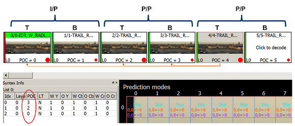

# **Interlace content support in HEVC encoder**
## Media SDK API Version 1.30

[**LEGAL DISCLAIMER**](./header-template.md#legal-disclaimer)

[**Optimization Notice**](./header-template.md#optimization-notice)

- [Introduction](#introduction)
- [Input surface layout](#input-surface-layout)
- [Encoder initialization](#encoder-initialization)
- [Runtime behavior](#runtime-behavior)
- [Reference lists management](#reference-lists-management)
- [Bitrate control](#bitrate-control)
- [Reset behavior](#reset-behavior)

### Introduction
The HEVC encoder processes interlaced content differently from other SDK encoders. The document describes how to properly initialize and use HEVC encoder for interlaced content processing.

### Input surface layout
In most cases, SDK components process both fields in one function call and both fields are stored in the same surface. However for HEVC encoder each field should be stored in a separate surface so separate calls are required for processing of each field. VPP can be used to separate fields from interleaved layout (two fields in the same surface) to single field layout.

### Encoder initialization
To properly initialize HEVC encoder for interlaced content application should set the following parameters:
#### Picture structure
- `mfxVideoParam::mfxFrameInfo::PicStruct` - `MFX_PICSTRUCT_FIELD_SINGLE` or `MFX_PICSTRUCT_FIELD_TOP` or `MFX_PICSTRUCT_FIELD_BOTTOM`. In case of `MFX_PICSTRUCT_FIELD_SINGLE` actual picture structure should be specified at runtime. Any other combination of `PicStruct` will be treated as progressive.
- `mfxExtCodingOption::FramePicture` - ignored.

#### Picture size
- `mfxVideoParam::mfxFrameInfo::Width/Height` - size of surface containing picture, should be aligned to 16 and might be bigger than encoding picture (field or frame) size. For dynamic resolution change initialize with maximum required resolution, then reset to current. Allocation will be performed at Init, then encoder will be re-initialized without reallocation at `MFXVideoENCODE_Reset` function.
- `mfxVideoParam::CropXYWH` - default display window parameters. If CropWH are zero, `mfxVideoParam::mfxFrameInfo::Width/Height` will be used.
- `mfxExtHEVCParam::PicWidthInLumaSamples/PicHeightInLumaSamples` - size of coded picture. if mfxExtHEVCParam extended buffer is absent or PicWidthInLumaSamples/PicHeightInLumaSamples values are zeros, crop size will represent size of coded picture.

#### Frame rate
- `mfxFrameInfo::FrameRateExtN/FrameRateExtD` - In contrast to the rest of the SDK encoders, frame rate for interlace HEVC content should be specified in fields. For example, 60 means 60 fields per seconds or 30 field pairs.

**Note** that for VPP field weaving/splitting filters, frame rate is specified in field pairs, i.e. should be the same for input and output.
#### GOP structure
The following GOP structures are supported for encoding in display order:
- low delay IPPP with and without `mfxExtCodingOption3::GPB`.
- reference and non-reference B.
- P- and B- pyramids `mfxExtCodingOption3::PRefType` and `mfxExtCodingOption2::BRefType`.

**Note**, `GopPicSize`, `GopRefDist` and `IdrInterval` are specified in field pairs.

#### Number of reference frames
- `mfxVideoParam::mfxInfoMFX::NumRefFrame` - for interlace HEVC DPB size is calculated in fields.

#### Asynchronous processing
`mfxVideoParam::AsyncDepth` - any valid value.

#### Picture timing SEI
PT SEI is controlled by `mfxExtCodingOption::PicTimingSEI`:
- `MFX_CODINGOPTION_OFF` - PT SEI is not inserted.
- `MFX_CODINGOPTION_UNKNOWN` - PT SEI inserted if field coding is enabled or HRD is enabled.
- `MFX_CODINGOPTION_ON`- PT SEI is always inserted.

### Runtime behavior
During runtime application can change the following parameters:
#### Picture structure
Supported picture structures are listed below. This value will be written in PT SEI and used to build reference lists. **Application must set valid PS for each surface**. If `mfxFrameSurface1::mfxFrameInfo::PicStruct` is zero for a particular surface then encode will internally use `MFX_PICSTRUCT_FIELD_TOP` or `MFX_PICSTRUCT_FIELD_BOTTOM` for that surface depending on initialization picture structure and expected field polarity, no error or warning will be returned to application.

- `MFX_PICSTRUCT_FIELD_TOP` corresponds to pic_struct = 1 in picture timing SEI.
- `MFX_PICSTRUCT_FIELD_BOTTOM`  corresponds to pic_struct = 2 in picture timing SEI.
- `MFX_PICSTRUCT_FIELD_TOP | MFX_PICSTRUCT_FIELD_PAIRED_PREV` corresponds to pic_struct = 9 in picture timing SEI.
- `MFX_PICSTRUCT_FIELD_BOTTOM | MFX_PICSTRUCT_FIELD_PAIRED_PREV` corresponds to pic_struct = 10 in picture timing SEI.
- `MFX_PICSTRUCT_FIELD_TOP | MFX_PICSTRUCT_FIELD_PAIRED_NEXT` corresponds to pic_struct = 11 in picture timing SEI.
- `MFX_PICSTRUCT_FIELD_BOTTOM | MFX_PICSTRUCT_FIELD_PAIRED_NEXT` corresponds to pic_struct = 12 in picture timing SEI.

#### Field order
There is no limitation on field polarity order. Any field, top or bottom, may be skipped or repeated.
#### Gaps in frame order
If encoder works in display order then `mfxFrameData::FrameOrder` is ignored. In encoding order it has to be specified and niether gaps nor repeating in it are allowed. I.e. frame numbers in display order (before an application reorders them) should monotonically increase. If a gap is present, encoder behavior is undefined.
#### Picture size
If input surface size is bigger than field size specified during initialization or reset, then encoder encodes the specified part of it. If smaller, then encoder returns an error.
#### Display order vs. encoding order
Both display and encoding orders are supported.
#### Picture type
Picture type can be changed in both display and encoding order via `mfxEncodeCtrl::FrameType`. For display order only forced IDR frames are supported, for encoding order the following combinations of types can be used: `MFX_FRAMETYPE_I/P/B` and `MFX_FRAMETYPE_IDR` with and w/o bit-ORed `MFX_FRAMETYPE_REF`. Second field types `MFX_FRAMETYPE_xI/xP/xB`, `MFX_FRAMETYPE_xIDR` and `MFX_FRAMETYPE_xREF` are prohibited and encoder returns an error if application uses them.
#### Scene change
Forced IDR picture can be used to process scene change. Any picture can be forced to an IDR including the second field of a field pair.

### Reference lists management
#### Display order
In display order encoder builds reference lists according to field polarity. On the first step, encoder populates a reference list by all fields from DPB according to temporal (POC) distance. Closest fields are located at lower reference indexes. On the second step, encoder truncates lists to the number of active references. On third step, encoder checks and corrects field polarity if necessary. If a number of reference fields is odd, i.e. only one field from field pair has been included in the list, encoder replaces it by the field of the same polarity as current encoded field. An example is shown below:

For P-pyramid two closest reference fields are followed by closest strong references.
#### Encoding order
In encoding order application can modify default reference lists by using `mfxExtAVCRefLists` and `mfxExtAVCRefListCtrl` structures. `PicStruct` field in these structures is ignored and `mfxFrameSurface1::mfxFrameInfo::PicStruct` is used instead. If `mfxExtCodingOption3::GPB` is ON then a P frame is internally converted to B frame and the L1 active reference list is copied from the L0 list.  Pictures are distinguished by `FrameOrder`. If a specified reference is absent in internal DPB, it is skipped. If all frames are absent then a default reference list is used. There is no way in current implementation to modify internal DPB. SDK HEVC encoder uses the following rules to build DPB:

- All pictures are removed from DPB on IDR frames.
- In non-P-pyramid configurations encoder follows a regular sliding window process to update DPB. The short-term reference pictures are stored in a first-in, first-out order so that short-term pictures with most recent POC are kept in DPB.
- See description of `PRefType::MFX_P_REF_PYRAMID` for P-pyramid cases in the SDK manual.
- On the first trailing picture of an associated particular IRAP picture, encoder removes all frames from DPB which preceed the IRAP in display or encoded order.

### <a id='HEVCi_Bitrate_control'>Bitrate control</a>
Only three bitrate control algorithms are supported `MFX_RATECONTROL_CQP`, `MFX_RATECONTROL_VBR` and `MFX_RATECONTROL_CBR`. `MFX_RATECONTROL_VBR` and `MFX_RATECONTROL_CBR` are software based bit-rate controls. To enable them use mfxExtCodingOption2::ExtBRC=MFX_CODINGOPTION_ON flag without mfxExtBRC extended buffer. HRD conformance is supported and controlled by `mfxExtCodingOption::NalHrdConformance`. Two flags `mfxExtCodingOption::VuiNalHrdParameters` and `mfxExtCodingOption::VuiVclHrdParameters` control whether HRD information is written in bitstream. `mfxInfoMFX::TargetKbps` and `mfxInfoMFX::BufferSizeInKB` can be changed dynamically without key frame insertion, even at the middle of a field pair if HRD is disabled. If HRD is enabled then `MFXVideoENCODE_Reset` function should be used for the change.

### Reset behavior
Reset behavior is similar to progressive content encoding. Reset can be used to change frame size to any size not exceeding the initialization size. Any valid crop can be set through reset call. Some BRC parameters can be changed as described in [bitrate control](#HEVCi_Bitrate_control) paragraph.
