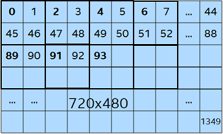

# <center>Intel® Media SDK for Linux\*<br>Release Notes</center>
- [<u>Overview</u>](#Overview)
- [<u>What’s New</u>](#What’s_New)
- [<u>System Requirements</u>](#System_Requirements)
- [<u>Features</u>](#Features)
- [<u>GPU Hang Reporting And Recovery</u>](#GPU_Hang_Reporting_And_Recovery)
- [<u>Known Limitations</u>](#Known_Limitations)
- [<u>Legal Information</u>](#Legal_Information)
- [<u>Attributions</u>](#Attributions)

## <a id='Overview'>Overview</a>

For the most up to date version please refer the Intel® Media SDK [documentation page](https://github.com/Intel-Media-SDK/MediaSDK/wiki).

**The Intel® Media SDK for Linux*** provide software development tools and libraries needed to develop enterprise grade media solutions on Intel® Xeon® and Core™ processor-based platforms. The SDK is designed for optimizing datacenter and embedded media applications for Linux operating systems to utilize Iris®, Iris® Pro and Intel® HD Graphics hardware acceleration capabilities.

**The Flexible Encode Infrastructure** (hereinafter referred to as “FEI”) is an extension of Intel® Media SDK that gives more control over encoding process compared to the standard Media SDK API with the following caveats:
- Only AVC/HEVC encoding supported. For AVC FEI, ENC interface is a **PRE-RELEASE** material, PREENC/ENCODE/PAK interfaces are in PV/production quality. For HEVC, only ENCODE interface is in PV/production quality, other interfaces are not supported yet.
- Intel does not provide technical support for the FEI through forum or Intel Premier Support.
- Building an application with FEI may take significantly more effort compared to the standard Media SDK API.
- FEI validation is limited. Some combinations of encoding parameters may lead to unstable application behavior, crashes and hangs.
- FEI API is not backward compatible.
- FEI is subject to the same EULA terms as Intel® Media SDK. Some FEI components are distributed as “pre-release materials” which restricts their usage according to EULA.

This document covers product features, system requirements and known limitations. For installation procedures description please see the *&lt;sdk-extract-folder&gt;/doc/mediasdk_getting_started_guide.pdf*.

In this document we will refer to processor families by their former codenames for the sake of readability:
- Intel Xe discrete graphics will be referred to as "DG1" and "SG1"
- 11th Generation Intel® Core™ Processors will be referred to as “Tigerlake”
- 10th Generation Intel® Core™ Processors will be referred to as “Icelake”
- 8th and 9th Generation Intel® Core™ Processors will be referred to as “Coffeelake”
- 7th Generation Intel® Core™ Processors will be referred to as “Kabylake”
- Intel® Xeon® E3-1200/1500 v5 Family and 6th Generation Intel® Core™ Processors will be referred to as “Skylake”
- Intel® Xeon® E3-1200 v4 Family and 5th Generation Intel® Core™ Processors will be referred to as “Broadwell”
- Intel® Celeron® and Pentuim® processors codenamed "Apollo Lake I" will be referred to as “Apollo Lake”


## What’s New in Media SDK 20.5.1
**New features**:
* **AV1 decode**
    - Refactored handling errors in SubmitFrame

* **AVC encode**
    - Improved handling support status for "Sliding window" feature
    - Added EncTools support
    - Added vaSyncBuffer support
    - Added external BRC support for Rocket Lake
    - Added TCBRC support
    - Added MCTF support

* **HEVC encode**
    - Extended B frames support across all target usage with LowPower on
    - Added TCBRC support

* **MPEG2 encode**
    - Added vaSyncBuffer support

* **Samples**
    - Added AdaptiveI and AdaptiveB frames support in sample_multi_transcode (#1401)
    - Added NV16 output support
    - Added 12 bit support in sample_multi_transcode, sample_decode and sample_vpp (#2055)
    - Enabled MBQP for all encoders in sample_multi_transcode
    - Added -disable_film_grain flag to disable film grain application in sample_decode

* **Misc**
    - Disabled plugins loading (Plugin implementations were moved to library runtime, except LA and FEI)
    - Added support for dynamic GPU session priority

* **Software requirements**
    - Libdrm 2.4.84 or later
    - Kernel 4.14 or later (5.4 recommended, consult [kernel support matrix](https://github.com/Intel-Media-SDK/MediaSDK/wiki/Intel-Graphics-Support-in-Linux-Kernels) wiki page for details)

* **Known issues**
    - Kernel 5.0 have known issue with endurance on Skylake see https://bugs.freedesktop.org/show_bug.cgi?id=110285 for details.
    - Media Stack 20.5.1 with Linux kernel 5.0 may cause higher CPU usage and instability in endurance testing. Issue root caused to media driver see https://github.com/intel/media-driver/issues/671 for details.
    - AV1 Decoder doesn't properly support asynchronous decoding (AsyncDepth > 1) and sometimes may return *MFX_ERR_UNDEFINED_BEHAVIOR* and *MFX_ERR_DEVICE_FAILED* from DecodeFrameAsync calls. See #2244 for details.

## <a id='System_Requirements'>System Requirements</a>

**Hardware**

Intel® Media SDK supports the following platforms with the Intel graphics:
- Intel® Celeron® and Pentuim® processors codenamed "Apollo Lake I"
- Intel® Xeon® E3-1200 v4 Family with C226 chipset
- Intel® Xeon® E3-1200 and E3-1500 v5 Family with C236 chipset
- 5th Generation Intel® Core™
- 6th Generation Intel® Core™
- 7th Generation Intel® Core™
- 8th Generation Intel® Core™
- 9th Generation Intel® Core™
- 10th Generation Intel® Core™
- 11th Generation Intel® Core™
- Intel Xe discrete graphics
- Note: chipset must have processor graphics enabled; make sure to check the datasheet.
    - Having a C226/C236 chipset is necessary but not sufficient. Make sure to consult with specific platform or board vendor regarding processor graphics being supported. Check Media Server Studio website for the list of “Known OEM/ODM Functional Platforms”:
    https://software.intel.com/en-us/intel-media-server-studio/details
    - Intel® Iris® Xe MAX Graphics require special setup decribed in the following online guide: https://dgpu-docs.intel.com/devices/iris-xe-max-graphics/index.html

**Software**
- **Linux kernel 4.14 or newer** of 64 - bit architecture. Kernel 4.19 or newer recommended, as it contains stability and performance improvements over 4.14. Release was validated against 4.19.5 for gen8 and gen9 graphics, 5.4 for gen10 (Icelake) graphics, and 5.5 for gen11 (Tigerlake) graphics.

## <a id='Features'>Features</a>
Intel® Media SDK included in this package implements SDK API 1.34 and contains the following components:

 Component | Supported features | Limitations
 --- | --- | ---
AV1 decoder               | Supported Profiles:<ul><li>0, 8bit and 10bit</li></ul>                                             | Maximum supported resolution:<br/>16384x8704
H.265 decoder             | Supported Profiles:<ul><li>Main</li></ul>                                                          | Maximum supported resolution:<br/>8192x8192
H.265 encoder             | Supported Profiles:<ul><li>Main</li></ul>Supported BRC methods:<ul><li>Constant QP (CQP)</li><li>Constant Bit Rate (CBR)</li><li>Variable Bit Rate (VBR)</li><li>Variable Bit Rate with Constant Quality (QVBR)</li><li>Software BRC</li></ul> | Maximum supported resolution:<br/>4096x2176
H.264 decoder             | Supported Profiles:<ul><li>Baseline</li><li>Main</li><li>High</li></ul>                            | Maximum supported resolution:<br/>4096x2304
H.264 encoder             | Supported Profiles:<ul><li>Baseline</li><li>Main</li><li>High</li></ul>Supported BRC methods:<ul><li>Constant QP (CQP)</li><li>Constant Bit Rate (CBR)</li><li>Variable Bit Rate (VBR)</li><li>Look Ahead (LA)</li><li>Intelligent Constant Quality (ICQ)</li><li>ICQ Look Ahead (LA)</li><li>Software BRC</li></ul>                            | Maximum supported resolution:<br/>4096x4096
MPEG-2 decoder            | Supported Profiles:<ul><li>Baseline</li><li>Main</li><li>High</li></ul>                            | Maximum supported resolution:<br/>2048x2048
MPEG-2 encoder            | Supported Profiles:<ul><li>Simple</li><li>Main</li></ul>Supported BRC methods:<ul><li>Constant QP (CQP)</li><li>Constant Bit Rate (CBR)</li><li>Variable Bit Rate (VBR)</li></ul>                            | Maximum supported resolution:<br/>1920x1088
VC1 decoder               | Supported Profiles:<ul><li>Simple</li><li>Main</li><li>Advanced</li></ul>                          | Maximum supported resolution:<br/>1920x1088
MJPEG encoder             | Supported Profiles:<ul><li>Baseline mode, 8bit</li></ul>                                           | Maximum supported resolution: per ISO/IEC 14495-1 and system memory limitations
MJPEG decoder             | Supported Profiles:<ul><li>Baseline mode, 8bit</li></ul>                                           | Maximum supported resolution: per ISO/IEC 14495-1 and system memory limitations
VP8 decoder               | Supported Profiles:<ul><li>Version 0 mode, 8bit</li></ul>                                          | Maximum supported resolution:<br/>1920x1088
VP9 decoder               | Supported Profiles:<ul><li>0, 8bit</li></ul>                                                       | Maximum supported resolution:<br/>4096x2304
VP9 encoder               | Supported Profiles:<ul><li>0, 8bit</li></ul>                                                       | Maximum supported resolution:<br/>4096x2304
Video PreProcessing (VPP) | Supported Algorithms:<ul><li>Color Conversion</li><li>Scaling</li><li>De-Interlacing(Advanced motion-compensated, BOB)</li><li>De-noising(including Motion-Compensated)</li><li>Frame Rate Conversion</li><li>Composition</li><li>Alpha Blending</li><li>Sharpness</li><li>PROCAMP</li><li>Rotation</li></ul> | Maximum supported resolution:<br/>4096x4096

Common for all components: minimum supported resolution is 32x32, frame width/height must be a multiple of 32.

Color formats supported by VPP filters (since Icelake platforms):

| Format><br>Filter˅                            |     YUV420     ||     YUV422     ||     YUV444     ||        RGB          ||
| --------------------------------------------- | ------ | ------ | ------ | ------ | ------ | ------ | ------ | ----------- |
|                                               | 8bit   | 10bit  | 8bit   | 10bit  | 8bit   | 10bit  | 8bit   | 10bit       |
|                                               | NV12   | P010   | YUY2   | Y210   | AYUV   | Y410   | ARGB   | A2R10G10B10 |
|Color conversion                               | X      | X      | X      | X      | X      | X      | X      | X           |
|Deinterlace                                    | X      | X      | X      |        |        |        |        |             |
|Resize (scaling)                               | X      | X      | X      | X      | X      | X      | X      |             |
|Crop                                           | X      | X      | X      | X      | X      | X      |        |             |
|Sharpening (detail)                            | X      |        | X      |        | X      | X      |        |             |
|Denoise                                        | X      | X      | X      |        |        |        |        |             |
|Composition/VideoWall                          | X      | X      | X      |        | X      | X      |        |             |
|Frame rate conversion                          | X      | X      | X      | X      | X      | X      |        |             |
|Field copy                                     | X      |        |        |        |        |        |        |             |
|Fields weaving                                 | X      |        |        |        |        |        |        |             |
|Fields splitting                               | X      |        |        |        |        |        |        |             |
|PROCAMP (Brightness, Contrast, Saturation, Hue)| X      | X      | X      | X      | X      | X      |        |             |
|Rotate                                         | X      | X      | X      | X      | X      | X      | X      |             |
|Horizontal mirroring                           | X      |        |        |        |        |        |        |             |
|MCTF                                           | X      |        |        |        |        |        |        |             |
|Scene Change Detector                          | X      |        |        |        |        |        |        |             |
X indicates a supported function

Color Conversion Support in VPP (since Icelake platforms):

| Output Color><br>Input Color˅ | NV12 | YV12 | YUY2 | AYUV | RGB4 | P010 | Y210 | Y410 | A2RGB10 | RGB565 |
| ------- | --- | --- | --- | --- | --- | --- | --- | --- | --- | --- |
| NV12    |  X  |     |  X  |  X  |  X  |  X  |  X  |  X  |  X  |     |
| YV12    |  X  |     |  X  |  X  |  X  |  X  |  X  |  X  |     |     |
| YUY2    |  X  |     |  X  |  X  |  X  |  X  |  X  |  X  |  X  |     |
| AYUV    |  X  |     |  X  |  X  |  X  |  X  |  X  |  X  |  X  |     |
| RGB4    |  X  |     |  X  |  X  |  X  |  X  |  X  |  X  |  X  |     |
| P010    |  X  |     |  X  |  X  |  X  |  X  |  X  |  X  |  X  |     |
| Y210    |  X  |     |  X  |  X  |  X  |  X  |  X  |  X  |  X  |     |
| Y410    |  X  |     |  X  |  X  |  X  |  X  |  X  |  X  |  X  |     |
| A2RGB10 |     |     |     |     |     |     |     |     |     |     |
| RGB565  |  X  |     |  X  |     |  X  |     |     |     |     |     |
X indicates a supported function

NOTE: Please use *Query* functions to check feature availability on any given machine at runtime. Availability of features depends on hardware capabilities as well as driver version.

Please see the Intel® Media SDK Reference Manual for details *“&lt;sdk-install-folder&gt;/doc/mediasdk-man.pdf”*.

Please also check the collateral materials: https://dgpu-docs.intel.com/devices/iris-xe-max-graphics/guides/media.html

## <a id='GPU_Hang_Reporting_And_Recovery'>GPU Hang Reporting And Recovery</a>

Intel® Media SDK supports reporting of GPU hangs occurred during SDK operations. This feature allows application to establish proper GPU hang recovery procedure without the need for additional monitoring of the system (e.g. without checking dmesg logs).

In this release, recommended GPU hang recovery procedure was modified (see below).

**GPU hang reporting procedure:** if GPU hang occurred during HW operation, SDK returns status *MFX_ERR_GPU_HANG* from any *SyncOperation()* call which synchronizes SDK workload affected by hang. In addition SDK rejects to accept new frames and returns *MFX_ERR_GPU_HANG* status from any subsequent call of *EncodeFrameAsync()*, *DecodeFrameAsync()*, *RunFrameVPPAsync()*. It’s available for H.264, H.265, MPEG2-Video decoders and encoders.

**SDK-independent GPU hang reporting procedure:** there is recommended way how to monitor GPU hang incidents independently from SDK. There are the following uevent messages being sent via udev system when GPU hang is happened:
* “*ERROR=1*” – GPU hang happened
* “*RESET=1*” – GPU reset is started (GPU is being recovered after GPU hang)
* “*ERROR=0*” – GPU successfully recovered after GPU hang (reset procedure is completed)

To be able to receive these messages, application need to monitor uevents of drm subsystem (devtype is “drm_minor”):
```c
uevent_monitor = udev_monitor_new_from_netlink(udev, "udev");
udev_monitor_filter_add_match_subsystem_devtype(uevent_monitor, "drm", "drm_minor");
```

**GPU hang recovery procedure:** it is recommended to process *MFX_ERR_DEVICE_FAILED*, *MFX_ERR_GPU_HANG* and *MFX_ERR_ABORTED* uniformly using the full reset procedure described in “Hardware Device Error Handling” of SDK manual. (I.e. recreate all resources: acceleration device, frames memory, SDK sessions, SDK components).

Informative: usually it takes SDK a few seconds to detect and report GPU hang. During this time all *SyncOperation()* calls for tasks affected by GPU hang will return status *MFX_WRN_IN_EXECUTION*. SDK will report the hang with status *MFX_ERR_GPU_HANG* only after GPU hang is detected and HW recovery mechanism is started by driver.

**Related limitations:**
* GPU hang reporting is supported for Linux only.
* In case of multiprocess usage model, SDK may return status *MFX_ERR_GPU_HANG* not to all processes. Application should ensure that upon receiving *MFX_ERR_GPU_HANG* in at least one process, GPU hang recovery procedure will be performed for all processes used the same GPU. To achieve this, application can establish intra process broadcast of *MFX_ERR_GPU_HANG* status returned from SDK session, monitor dmesg or follow “SDK-independent GPU hang reporting procedure” procedure.
* SDK decoders may buffer decoded frames. Decoder *SyncOperation()* call may return previously buffered frame with *MFX_ERR_NONE* status at the time when GPU hang was already reported by underlying HW for one of next frames. This means that even for synchronous pipeline application may get *MFX_ERR_GPU_HANG* from *DecodeFrameAsync()* earlier than from *SyncOperation()*.
* False positive GPU hangs (*MFX_ERR_GPU_HANG*) can be reported in a very heavy workloads (CPU and GPU utilization are close to 100%).

## <a id='Known_Limitations'>Known Limitations</a>

This release is subject to the following known limitations:
* **Limited support on certain platforms**:
    - MPEG-2 encode is not supported on Apollo Lake
    - H.264 Flexible Encode Infrastructure only supported on Broadwell and Skylake
    - Multi Frame Encode (MFE), HEVC Flexible Encode Infrastructure only supported on Skylake
    - VP9 decoder is supported starting from Kabylake platform
    - VP9 encoder is supported starting from Icelake platform
    - Support for Tigerlake, Elkhartlake and Jasperlake platforms is preliminary and may not be fully functional
    - SW fallback is unsupported for all components but MJPEG

* **Absence of software fallback**:
    - AVC Encode: MVC encode capabilities
    - AVC Encode: resolution larger than 4096x4096
    - AVC Encode: interlaced field encoding
    - AVC Encode: temporal layering
    - AVC Decode: flexible macroblock ordering (FMO)
    - AVC Decode: decoding to YUV 4:2:2 and/or bit depths larger than 8 bit
    - MJPEG Encode: YUV 4:2:0, YUV 4:0:0 (monochrome), RGB32 input formats
    - MJPEG Encode: external quantization and Huffman encoding tables
    - MJPEG Decode: decoding to formats other than NV12 and RGB32
    - MJPEG Decode: multi-scan
    - MJPEG Decode: resolution larger than 8192x8192
    - MJPEG Decode: decoding from a JPEG encoded as monochrome YCbCr
    - MJPEG Decode: decoding from a JPEG encoded with 4:1:1 color subsampling format
    - MJPEG Decode: decoding from a JPEG encoded as YCbCr with 4:4:4 color subsampling format
    - MJPEG Decode: decoding to RGB32 from a JPEG encoded as YCbCr with 4:2:0 color subsampling format with resolutions larger than 4096x4096
    - MPEG2 Encode: resolutions larger than supported by hardware
    - MPEG2 Encode: interlaced field encoding
    - MPEG2 Decode: resolutions larger than 2048x2048
    - VPP: resolutions larger than supported by hardware
    - VPP: input/output color formats other than supported by hardware
    - HEVC: resolutions larger than 8192x8192
    - Resolutions larger than 4096x4096 for codec (both decode and encode) other than MJPEG/HEVC

* **Reliability on Broadwell platforms**
    - This release is subject to Errata **BDW110** (for platforms of Intel® Xeon® E3-1200 v4 Family) and **BDM119** (for 5th Generation Intel® Core™ Processors). In the result, random rare segmentation faults might be observed. For more information on Errata please refer to Specification Updates available at http://www.intel.com/content/dam/www/public/us/en/documents/specification-updates/xeon-e3-1200v4-spec-update.pdf for Intel® Xeon® E3-1200 v4 and at http://www.intel.com/content/dam/www/public/us/en/documents/specification-updates/5th-gen-core-family-spec-update.pdf for 5th Generation Intel® Core™ Processors. Please contact your hardware vendor for a BIOS update with a workaround.

* **Reliability on Skylake platforms**
    - Kernel 5.0 have known issue with endurance on Skylake see https://bugs.freedesktop.org/show_bug.cgi?id=110285 for details.

* **Hardware Device Error Handling**
    - Application should treat *MFX_ERR_ABORTED* status returned from *MFXVideoCORE_SyncOperation()* as *MFX_ERR_DEVICE_FAILED* and run recovery procedure as described in Hardware Device Error Handling section of the SDK manual.

* **API**:
    Intel® Media SDK API is designed for a range of products. A particular product release may support only a subset of the features of the declared API version. This release has the following API limitations:

    - Only the following features among those introduced in API 1.7 are supported:
        - RateControlMethod::MFX_RATECONTROL_LA
        - mfxExtCodingOption2::LookAheadDepth
        - mfxExtCodingOption2::MBBRC
        - mfxExtCodingOption2::Trellis
    - Only the following features among those introduced in API 1.8 are supported:
        - mfxVideoCodecPlugin
        - mfxExtVPPComposite
        - mfxExtVPPDeinterlacing
        - mfxExtCodingOption2::LookAheadDS, RepeatPPS, BRefType
        - mfxHandleType::MFX_HANDLE_VA_DISPLAY
        - mfxImpl::MFX_IMPL_VIA_VAAPI, mfxIMPL::MFX_IMPL_AUDIO
        - CodecFormatFourCC::MFX_CODEC_HEVC, CodecLevel::HEVC level and tier definitions, CodecProfile::HEVC profile definitions
        - BRefControl
        - mfxFrameData::PitchHigh, PitchLow
    - Only the following features among those introduced in API 1.9 are supported:
        - mfxExtVPPComposite, mfxVPPCompInputStream::LumaKeyEnable, LumaKeyMin, LumaKeyMax, *GlobalAlphaEnable*, GlobalAlpha, PixelAlphaEnable
        - mfxExtAVCRefLists
        - *mfxExtAVCEncodedFrameInfo*::secondFieldOffset
        - mfxExtCodingOption2::SkipFrame, supported for AVC and MPEG Encode
        - ColorFourCC::MFX_FOURCC_P010, MFX_FOURCC_A2RGB
        - mfxExtCodingOption2::MaxSliceSize
    - Only the following features among those introduced in API 1.10 are supported:
        - MFXVideoENC class of functions
        - mfxENCInput
        - mfxENCOutput
        - mfxExtLAControl
        - mfxExtLAFrameStatistics
        - RateControlMethod::MFX_RATECONTROL_LA_EXT
        - mfxExtCodingOption2::BufferingPeriodSEI and enum {MFX_BPSEI_DEFAULT, MFX_BPSEI_IFRAME}
    - Only the following features among those introduced in API 1.11 are supported:
        - mfxExtCodingOption3::WinBRCMaxAvgKbps, WinBRCMaxAvgKbps
        - mfxFrameData:: NumExtParam, ExtParam
        - mfxExtVPPFieldProcessing, enum VPPFieldProcessingMode, enum PicType
        - RateControlMethod::MFX_RATECONTROL_LA_HRD
        - ExtendedBufferID::MFX_EXTBUFF_CODING_OPTION3, MFX_EXTBUFF_VPP_FIELD_PROCESSING
    - Only the following features among those introduced in API 1.12 and 1.13 are supported:
        - mfxExtCodingOption2::UseRawRef
        - mfxExtCodingOption3::DirecrBiasAdjustment, GLobalMotionBiasAdjustment, MVCostScalingFactor, MBDisableSkipMap, EnableMBQP.
        - mfxExtChromaLocInfo
        - mfxExtMBDisableSkipMap
        - mfxExtMBQP
        - MFXVideoUSER_LoadByPath()
        - For mfxExtVPPDeinterlacing extended buffer only DeinterlacingModes MFX_DEINTERLACING_BOB and MFX_DEINTERLACING_ADVANCED are supported
    - Only the following features among those introduced in API 1.14 are supported:
        - mfxExtDecodedFrameInfo
        - mfxExtTimeCode
    - Only the following features among those introduced in API 1.15 are supported:
        - mfxExtThreadsParam and MFX_EXTBUF_THREADS_PARAM enumerator
    - Only the following features among those introduced in API 1.16 are supported:
        - GPUCopy enumerator and control in mfxInitParam structure.
        - mfxFrameAllocRequest.AllocId
        - mfxInfoMFX.MaxDecFrameBuffering
    - Only the following features among those introduced in API 1.17 are supported:
        - mfxVideoParam.AllocId field
        - DeinterlacingMode::MFX_DEINTERLACIF_ADVANCED_NOREF enumerator
        - deprecated MFXVideoCORE_SetBufferAllocator() function, mfxBufferAllocator structure
        - deprecated fields:
            mfxCodingOption.EndOfSequence
            mfxCodingOption.EndOfStream
            mfxExtCodingOption2.ExtBRC
        - deprecated MFX_EXTBUFF_VPP_PICTSTRUCT_DETECTION enumerator
    - Only the following features among those introduced in API 1.19 are supported:
        - MFXVideoCORE_QueryPlatform() function
        - MFXVideoENC_*GetVideoParam()*function
        - mfxPlatform structure
        - mfxPayload.CtrlFlags field
        - mfxExtVPPScaling structure
        - mfxStatus (\*QueryPlatform) (mfxHDL pthis, mfxPlatform *platform) for USER interfaces
        - mfxStatus MFXVideoUSER_GetPlugin(mfxSession session, mfxUtype, mfxPlugin *par)
    - Only the following features among those introduced in API 1.20 are supported:
        - PicStruct::MFX_PICSTRUCT_FIELD_SINGLE
        - PicStruct::MFX_PICSTRUCT_FIELD_TOP
        - PicStruct::MFX_PICSTRUCT_FIELD_BOTTOM
        - PicStruct::MFX_PICSTRUCT_FIELD_PAIRED_PREV
        - PicStruct::MFX_PICSTRUCT_FIELD_PAIRED_NEXT
    - Only the following features among those introduced in API 1.21 are supported:
        - mfxExtCodingOption3.BRCPanicMode for H.264 and MPEG-2 encoders
    - Only the following features among those introduced in API 1.22 and 1.23 are supported:
        - mfxExtCodingOption3.RepartitionCheckEnable for H.264 encoder
    - Only the following features among those introduced in API 1.25 are supported:
        - mfxExtCodingOption3.EnableNalUnitType and mfxEncodeCtrl.MfxNalUnitType for HEVC encoder
        - mfxExtMultiFrameParam and mfxExtMultiFrameControl
        - mfxExtBRC, mfxBRCFrameParam, mfxBRCFrameCtrl, mfxBRCFrameStatus
    - Only the following features among those introduced in API 1.27 are supported:
        - mfxExtCodingOption3.ExtBrcAdaptiveLTR
        - mfxBRCFrameParam.SceneChange, mfxBRCFrameParam.LongTerm, mfxBRCFrameParam.LongTerm
    - Only the following features among those introduced in API 1.28 are supported:
        - *MFX_FOURCC_RGB565* and *MFX_FOURCC_RGBP* color formats.
    - Features introduced in API 1.29 are supported:
        - Added tile support for VP9 encode.
        - Added max frame size support to User-defined bitrate control.
    - Only the following features among those introduced in API 1.30 are supported:
        - Added content protection, currently Android only
    - Only the following features among those introduced in API 1.31 are supported:
        - Added TGL, EHL, JSL platform support
        - Added 12-bit color formats
        - Added support for multiadapter configurations (integrated + discrete)
        - Added partial bitstream output (slice-based encode)
    - Only the following features among those introduced in API 1.32 are supported:
        - Added Screen Content Coding (SCC) support to HEVC
    - Only the following features among those introduced in API 1.33 are supported:
        - Added Scaling Interpolation Method control (not supported on Linux currently).
    - Only the following features among those introduced in API 1.34 are supported:
        - Added Keem Bay platform support
        - Added AV1 decode support

    **NOTE**: Other options may be not supported. Please use *Query* functions to check feature availability on any given machine at runtime. Availability of features depends on hardware capabilities as well as driver version.

* **Performance**:
    - The product was fully validated only with the default values of mfxExtThreadsParam. Executing application or initializing the SDK library internal threads under real time scheduling policies (SCHED_FIFO or SCHED_RR) with specific Priority levels may lead to significantly increased latency, increased total processing time and/or increased CPU usage.
    - [27023]On the Skylake, Kabylake and Coffelake platforms the HEVC decoder and encoder tasks can be executed only on VDBOX0 and UMD/KMD will schedule such tasks accordingly.
    - To get better performance results and performance/resources tradeoff on the N:N multi-transcoding scenarios with the significant number of parallel sessions (N>4) it is recommended to consider synchronous pipeline implementations and initialize components with *mfxVideoParam::AsyncDepth*=1. In case of small number of parallel sessions asynchronous pipelines may give better results, it is recommended to consider *mfxVideoParam::AsyncDepth*=2,3.
    - [37705,37706] VC1 workloads may underperform in some scenarious where *AsyncDepth*>1. It is recommended to initialize components with *mfxVideoParam::AsyncDepth*=1. In case of small number of parallel sessions asynchronous pipelines may give better results.

* **Multi-Frame encode**:
    - Only H.264 encode and H.264 FEI ENCODE implemented.
    - Only supported for Intel® Xeon® E3-1200 and E3-1500 v5 Family and 6th Generation Intel® Core™, for other platforms MFE will be disabled.
    - Performance can be worse than usual single-frame in next known cases:
        - In N:N case, when number of encoders is less or equal to MaxNumFrames, performance for Multi-frame encode can be lower than single frame mode.
    - Following functionality is not supported with multi-frame encode operation and when set, multi-frame will be disabled:
        - When number of slices is controlled by parameters *NumSlice*, *NumSliceI*, *NumSliceP*, *NumSliceB*.
        - ‘intra refresh’ parameters are not supported.
        - Encoding resolution is bigger than 1920x1088;
    - Supported MaxNumFrames is 3 but only 2 will be used for next cases: *EnableMBQP*, *EnableMAD*, *EnableMBForceIntra*, *MBDisableSkipMap*, FEI ENCODE; for Intel® Xeon® E3-1200 series MaxNumFrames will be adjusted to 2 for resolutions bigger then 1280x720.

* **HEVC FEI:**
    - P frame support not implemented.
    - Due to non-upstreamed patсhes:
        - Performance gap between HEVC FEI and Legacy HEVC encode around 30%.
        - Visual quality degradation -6% avg, worst -22% (bdrate).
        - Component considered non-production quality.

* **HEVC decode:**
    - Function *GetPayload()* returns SEI with inserted emulation prevention bytes. If these SEI messages will be sent as Payloads to SDK HEVC encoder, emulation bytes will be duplicated.
    - When more than one frame is passed to *DecodeFrameAsync* in same input buffer, and external timestamp is set for this input, decoder will use provided timestamp to calculate PTS for 1st frame in the buffer. Decoder will not request additional timestamps for rest of frames in the buffer, and output PTS for these frames will be incorrect.
    - If Decoder is called with flag *MFX_BITSTREAM_EOS* set and incomplete (or absent frame), it will return *MFX_ERR_MORE_DATA* status instead of returning the buffered frames.
    - Decoder doesn't properly support API functions *GetDecodeStat()* and *SetSkipMode()*. Both functions always return status *MFX_ERR_NONE*. *GetDecodeStat()* doesn't modify output mfxDecodeStat structure. *SetSkipMode()* function doesn't affect decoder operation.

* **HEVC encode:**
    - Only following parameters from SDK API extended buffers are supported by Encoder:
        - mfxExtHEVCParam
            - PicWidthInLumaSamples
            - PicHeightInLumaSamples
        - mfxExtCodingOption
            - VuiNalHrdParameters
            - NalHrdConformance
            - AUDelimiter
        - mfxExtCodingOption2
            - IntRefType
            - IntRefCycleSize
            - IntRefQPDelta
            - BRefType
            - NumMbPerSlice
            - DisableDeblockingIdc
            - RepeatPPS
            - SkipFrame
        - mfxExtCodingOption3
            - PRefType
            - IntRefCycleDist
            - EnableQPOffset
            - EnableMBQP
            - QPOffset
            - NumRefActiveP
            - NumRefActiveBL0
            - NumRefActiveBL1
            - EnableNalUnitType
        - mfxExtEncoderCapability
            - MBPerSec

        If any other parameter is set in extended buffer and passed to functions Query, QueryIOSurf, Init or Reset, encoder will reset it to 0 and will return status *MFX_WRN_INCOMPATIBLE_VIDEO_PARAM*.
    - [31459] Encoder may produce non-bit exact streams from run-to-run. Run to run difference doesn’t affect visual quality
    - [29260] MBBRC option is not supported. For CBR/VBR, MBBRC is always enabled for TU 1-2, and always disabled for TU 3 - 7.
    - Parameter *NumMBPerSlice* is treated as number of coding units of maximum size supported by underlying HW. For Skylake it's 32x32. May vary for future platforms.
    - Encoder doesn't support insertion of HRD information to coded stream. At the same time Encoder tries to keep HRD conformance for given BRC and HRD parameters. E.g. padding will be inserted for CBR BRC mode.
    - If application needs to disable deblocking, it needs to always set respective value of DisableDeblockingIdc if extended buffer MfxExtCodingOption2 is sent to encoder in runtime. If value isn't set (equals to 0), and buffer is sent to EncodeFrameAsync, zero value will be applied to current frame, and deblocking will be turned on.
    - Attempt to create HEVC encoder on Broadwell will cause segmentation fault in *Init()*, *Query()* and *QueryIOSurf()* functions.
    - [27145, 27477] Encoder does not support resolution 16x16. *MFX_ERR_DEVICE_FAILED* will be returned on attempt to create encoder with such small resolutions from the SDK *Init()* function. Meanwhile *Query()* function will return *MFX_ERR_NONE*.
    - Values of PicWidthInLumaSamples, PicHeightInLumaSamples must be multiple of 16.
    - For very complex content *BufferSizeInKB* reported by *GetVideoParam()* may not be enough to hold coded bitstream. If it happen, HEVC encoder will return *MFX_ERR_NOT_ENOUGH_BUFFER* in runtime.
    - If in EncodedOrder application sends to Encoder equal FrameOrder values for subsequent frames (e.g. all zeroues, or some other value), Encoder may hang inside EncodeFrameAsync call.
    - Encoder cannot change frame rate via Reset() call (new value will be ignored). But if frame rate is changed along with bitrate by same Reset() call, encoder will apply new value.
    - [38510] Encoder cannot change bit rate via Reset() call for user-defined BRC if HRD conformance is enabled. *MFX_ERR_INCOMPATIBLE_VIDEO_PARAM* is returned.
    - For CQP encoding of very complex content with low QP *BufferSizeInKB* reported by *GetVideoParam()* may not be enough to hold coded bitstream. If it happens, HEVC encoder returns *MFX_ERR_NOT_ENOUGH_BUFFER* from SyncOperation. Application may workaround it by allocation of bigger buffer than SDK reported in *BufferSizeInKB*. Following value is enough: <frame size in pixels> * 3.
    - [18046] Encoder may generate too high bitrate in CBR mode.
    - Per-LCU QP mode has the following limitations:
        - the feature is applicable only for CQP BRC.
        - QP values can be set in range 0-51.
        - only *MFX_MBQP_MODE_QP_VALUE* is supported.
        - Application shall allocate memory for QP map for blocks 16x16. Please see an example for 720x480 case:  
          
        where 0...1349 are indices of a 16x16 blocks in a linear memory array of the QP map.
        QP values in blocks 0, 2, 4, 6, ..., 89, 91, 93, ... are used by encoder. The rest blocks are ignored.
    - SkipFrame feature has the following limitations:
        - works only with CQP BRC mode.
        - *MFX_SKIPFRAME_NO_SKIP*, *MFX_SKIPFRAME_INSERT_DUMMY*, *MFX_SKIPFRAME_INSERT_NOTHING* are supported.
        - If GOP has only P frames, arbitrary P can be skipped. When skipped, it is made non-reference.
        - If GOP has B frames, only non-reference B can be skipped.
    - [37552] In CQP mode encoder doesn't accept zero QP values in mfxEncodeCtrl.QP
    **Workaround:** Use QP=1.
    - In CQP mode encoder ignores zero initialization QPI/QPP/QPB values. Internall default QP is used instead.
    **Workaround:** Use QP=1.
    - [37754/37756] Encoder ignores *MFX_GOP_CLOSED*/*MFX_GOP_STRICT* flags set in *GopOptFlag*.
    - Maximal number of supported active references is 3 for L0 list and 1 for L1 list.
    - [40581] Interlace encode supports only CQP and software BRC rate controls.
    - [45382] Note for reordering in the field mode (if encoder is initialized in display order with B frames): field pairs are coded as neighboring fields, except one case if IDR is inserted as second field. In this case B fields can be encoded between first P field and second IDR fields.
    - [46581] Quality drops are possible with sliding window after static scenes.
    - [40392] The max/min CU size is hard-coded as 32x32 and 8x8 on SKL. Customized max/min CU size is not supported. This limitation apply to HEVC FEI ENCODE too. The max CU size is 64x64 with LowPower ON.
    - [42933] Unregister() call erroneously returns MFX_ERR_NOT_INITIALIZED when using optional plugin interface.
    **Workaround:** Use native style component loading or ignore error status.
    - Software BRC doesn't follow level-specific frame size limitation.
    **Workaround:** An application can explicitly define higher level to avoid possible violation.
    - QP range is extended to the higher QP values depending on bit-depth: [1; 51+6*(bits-8)]. For HEVC encoder with LowPower ON, QP range is [10; 51+6*(bits-8)]
    - For HEVC encoder with LowPower ON, MFX_CHROMAFORMAT_YUV422 is not supported as target encoding chroma format and max supported target encoding bit-depth for luma/chroma samples is 10.
* **H.264 decode:**
    - The H.264 decoder may leave Corrupted flag as 0 in case of minor corruption in macroblock bitstream data.
    - Decoder returns *MFX_ERR_UNSUPPORTED* for streams which cannot be processed by hardware, software fallback was removed.
    - For decoders it's not guaranteed that GPU hang will be timely reported from *SyncOperation* (there could be several frames delay). *MFX_ERR_GPU_HANG* will be timely reported from *DecodeFrameAsync* call.
    - Function *GetPayload()* returns SEI with inserted emulation prevention bytes. If these SEI messages will be sent as Payloads to SDK HEVC encoder, emulation bytes will be duplicated.
    - When more than one frame is passed to *DecodeFrameAsync* in same input buffer, and external timestamp is set for this input, decoder will use provided timestamp to calculate PTS for 1st frame in the buffer. Decoder will not request additional timestamps for rest of frames in the buffer, and output PTS for these frames will be incorrect.
* **H.264 encode:**
    - Encoder doesn’t support use of *MaxFrameSize* and *MaxSliceSize* together. If *MaxSliceSize* is set, *MaxFrameSize* is ignored.
    - Reset function isn’t supported for LookAhead BRC modes (except *MaxSliceSize* mode). Reset returns *MFX_ERR_INVALID_VIDEO_PARAM* for LA BRC.
    - LookAhead BRC modes (including *MaxSliceSize* mode) don't support CAVLC coding. CAVLC will be switched to CABAC for LA BRC.
    - Downscale factor 2 of LookAhead BRC modes may produce better objective coding quality than scale factor 1
    - To change encoding parameters on the fly with Reset() function without IDR insertion application should drain all the buffered surfaces from encoder. Otherwise encoder may demonstrate undefined behavior after Reset.
    - Call of Reset which starts new sequence (inserts IDR) will drop HRD conformance over the inserted IDR (CPB removal counter will be set to 0 in the IDR Picture Timing SEI).
    - [40604] Encoder may produce non-bit exact streams from run to run on Broadwell and Skylake. Run to run difference doesn’t affect visual quality.
    - Chroma artifacts are possible at very low bitrates (when QP is close to 51).
    - Support for encoded frame info (*mfxExtAVCEncodedFrameInfo*) is limited with *SecondFieldOffset* for interlace coding, and FrameOrder, LongTermIdx UsedRefListL0/L1 for progressive coding.
    - Encoder prohibits increase of DPB size (NumRefFrame) via Reset function even if new size is lower than initialization value. Reset function will return *MFX_ERR_INCOMPATIBLE_VIDEO_PARAM* on any attempt to increase NumRefFrame.
    - [32675] Encoder may not insert PCM macroblocks when required on Skylake.
    - Usual Look Ahead BRC may generate non HRD-compliant streams.
    - Look Ahead BRC (*MFX_RATECONTROL_LA_HRD*) may not give quality gain for B-pyramid case (or give very little gain in comparison with regular B-frame configuration)
    - Careful memory/resource planning is needed when using Look Ahead BRC due to storage of pre-analyzed frames. 1:N and N:N transcoding use cases are especially demanding for memory.
    - When external Look Ahead BRC is used in transcoding pipeline which includes Frame Rate conversion (FRC), FRC in the pipeline should take place before external Look Ahead. Otherwise encoder may return error *MFX_ERR_UNDEFINED_BEHAVIOR* from EncodeFrameAsync calls.
    - MBBRC option is enabled by default on lower target usages but can be switched off. Exact implementation details are hidden and may change with time and between platforms, so using *Query* function to retrieve actual support is strongly recommended.
    - SkipFrame feature has the following limitations:
        - If GOP has only P frames, arbitrary P can be skipped. When skipped, it is made non-reference.
        - If GOP has B frames, only non-reference B can be skipped.
        - [40205] Encoder may produce stream with HRD violation if application skips frames using SkipFrame interface.
        - [28500] Encoder incorreclty calculates cpb_removal_delays for cases when several frames are dropped using MFX_SKIPFRAME_BRC_ONLY. Delay is always incremented, but it needs to be increased by value of *mfxEncodeCtrl.SkipFrame*. As a result stream falls to HRD underflow.
    - MBQP mode is applicable only for CQP BRC and can be set in value range 1-51.
    - [35082] Encoder doesn't release Locked counters of input surfaces in Close() function.
    - For very complex content *BufferSizeInKB* reported by *GetVideoParam()* may not be enough to hold coded bitstream. If it happens AVC encoder will cut bytes that don't fit to output buffer.
    - If application needs to disable deblocking, it needs to always set respective value of DisableDeblockingIdc if extended buffer MfxExtCodingOption2 is sent to encoder in runtime. If value isn't set (equals to 0), and buffer is sent to EncodeFrameAsync, zero value will be applied to current frame, and deblocking will be turned on.
    - [27936] Turning ON Trellis for B-frames may slightly worsen objective quality of coded streams in terms of BDPSNR.
    - Encoder cannot change frame rate via Reset() call (new value will be ignored). But if frame rate is changed along with bitrate with same Reset() call, encoder will apply new value.
    - Encoder cannot change bit rate via Reset() call for software BRC if HRD conformance is enabled. *MFX_ERR_INCOMPATIBLE_VIDEO_PARAM* is returned.
    - Encoder cannot accept SEI payloads with total size over \~1130 bytes (the exact number may slightly vary depending on Encoder configuration). As a result of bigger payload error *MFX_ERR_DEVICE_FAILED* will be returned from *SyncOperation()*.
    - Parameters MaxQP and *MaxFrameSize* may contradict each other. If for particular frame MaxQP doesn't give BRC to reach *MaxFrameSize*, MaxQP is obeyed, and *MaxFrameSize* is violated.
    - [27539] When I/P field pair is encoded at the beginning of new GOP, P field in the pair may use frames from previous GOP as reference. So I/P field pairs can't be used as clean random access points, unlike IDR/P field pairs.
    - Parameters that are part of PPS header in AVC standard (e.g. weighted prediction) can't be correctly applied on per-frame level if RepeatPPS option is set to OFF during encoder initialization.
    - [28660] Encoder implements "force-to-skip" functionality: Inter frame is coded w/o coefficients and motion vectors if there is a risk of HRD underflow. But this feature doesn't guarantee HRD compliant encoding. In rare cases for very low bitrates and very complex content HRD underflow may happen (e.g. 500 kbps 1080p and white noise content). It's actual for both Skylake and Broadwell.
    - [28667, 31597] Rolling Intra refresh with MB-rows doesn't work correctly - all MBs below current Intra region in the frame are forced to Intra as well. Intra refresh with MB-columns could be used as work around.
    - Encoder may produce different output if cases when size of input surface is bigger than frame resolution, and when size of surface equal to frame resolution. Difference doesn't affect objective quality, and isn't visible by eye.
    - When number of slices is controlled by parameters *NumSlice*, *NumSliceI*, *NumSliceP*, *NumSliceB*, resulting slices are always aligned to MB-row. In addition all slices have equal sizes (except last one). Such alignment may cause change of slice number set by application. Application should use *NumMBPerSlice* parameter to get slices of arbitrary MB size.
    - Following restrictions are applied to reference lists set via mfxExtAVCRefLists for interlaced encoding. List should start from reference field with same polarity as current one. Fields in reference lists should alternate while it's possible to pick field of alternative parity. If listed restrictions are violated, coded field may contain visual artifacts, or be encoded with Intra macroblocks only.
    - Enabling or disabling of Rolling Intra Refresh by Reset() call will lead to insertion of IDR. E.g. if Encoder is initialized with IntRefType = 0 (disabled refresh), and IntRefType = 1 is sent to Reset call, IDR will be inserted right after Reset, and only then first Intra refresh cycle will be started.
    - For CQP encoding of very complex content with low QP *BufferSizeInKB* reported by *GetVideoParam()* may not be enough to hold coded bitstream. If it happens, AVC encoder truncates coded bitstream to fit to the buffer provided by application and returns *MFX_ERR_NONE* from respective *SyncOperation* call. Application may workaround it by allocation of bigger buffer than SDK reported in *BufferSizeInKB*. Following value is enough: <frame size in pixels> * 3.
    - Encoder fills *mfxExtAVCEncodedFrameInfo::SecondFieldOffset* correctly only if application attaches only 1 such buffer for the case of interlaced content.
    - [31266] Visual artifacts may occur when encoder tries to satisfy too small *MaxFrameSize* video parameter.
    - Encoder doesn’t support “Region Of Interest” feature.
    - [34037] On 4K content Look Ahead BRC may produce worse quality with *MFX_TARGETUSAGE_BEST_QUALITY* than with *MFX_TARGETUSAGE_BALANCED* / *MFX_TARGETUSAGE_SPEED*.
    **Workaround:** Use 2x2 downscaling to work around the issue.
    - [35309] In EncodedOrder mode AVC encoder always returns status *MFX_ERR_MORE_DATA* for EncodeFrameAsync calls with zero pointer to mfxFrameSurface1 structure. It means that when EncodedOrder mode is used together with asynchronous encoding (AsyncDepth > 1), buffered AsyncDepth frames cannot be retrieved from encoder at the end of encoding by mechanism described in Media SDK specification.
    - [35288] On SKL frequent (several time per second) BRC resets using VBR interlace encode results in low bitrate.
    - [38227] PSNR drop (without coding artifacts) is observed with dynamic *MaxFrameSize* parameter on screen content encode. It affects one frame when a complex scene is changed. On the other hand, an improvement in encoding quality is observed on the rest frames.
    - [37925] Encoder in CQP mode doesn't insert CABAC trailing bits.
    - [39869] In very rare cases encoder may produce GPU hang for very specific input content (static flat texture with small portion of very complex blocks - like white noise) on Skylake
* **MPEG-2 decode:**
    - Decoder does not support bitstreams with resolution bigger than 2048x2048. MFXVideoDECODE_Init returns *MFX_ERR_UNSUPPORTED* on such bitstreams.
    - Decoder does not support MPEG-1 bitstreams. It is interpreted as corrupted MPEG-2 bitstream. MFXVideoDECODE_Init returns *MFX_ERR_NONE* and MFXVideoDECODE_DecodeFrameAsync returns *MFX_ERR_MORE_DATA* until valid MPEG-2 bitstream is found.
    - Sequence headers are skipped if resolution exceeds maximum supported values (2048x2048) or level/chroma are invalid. It affects MFXVideoDECODE_DecodeFrameAsync.
    - For decoders it's not guaranteed that GPU hang will be timely reported from *SyncOperation* (there could be several frames delay). *MFX_ERR_GPU_HANG* will be timely reported from *DecodeFrameAsync* call.
    - If incoming bitstream is corrupted decoder may skip corrupted slices or entire frames. Usually corruptions in bitstream does not influence on decoding of next frames in bitstream that are not corrupted. It is recommended to reset decoder once corrupted frame occur to mitigate the issue.
    - Decoder returns *MFX_ERR_UNSUPPORTED* for streams which cannot be processed by hardware, software fallback was removed.
    - [46442] Decoder may report a GPU hang with delay in a 1-2 frames.
* **MPEG-2 encode:**
    - [36085, 35800] Encoder may produce non-bit exact streams. Run to run difference doesn’t affect visual quality.
    - [28337] The MPEG-2 encoder may produce output that under-runs the MPEG-2 video buffer verifier model (VBV) on some streams. We suggest the following guideline of the parameter values to be followed to keep VBV compliance.
        - MPEG2 buffer usage is mainly restricted by the number of bits used for I frame. The minimum size of each 16x16 blocks of intra frame at highest QP is about 50 bits. The minimum initial buffer fullness (InitVBVBufferFullnessInBit) should be at least twice the size of the initial I frame, and the minimum buffer size (vbv_buffer_size) should be twice of the initial buffer fullness (4 times of the initial I frame).
    - MBQP mode is applicable only for CQP BRC and can be set in value range 1-122.
    - SkipFrame feature has the following limitations:
        - works only with CQP BRC mode
        - only *MFX_SKIPFRAME_INSERT_DUMMY* is supported
        - If GOP has only P frames, arbitrary P can be skipped. When skipped, it is made non-reference.
    - Software implementation of MPEG-2 Encoder may erroneously insert a duplicated field in interlace field encode mode on specific content.
    - [26996] Setting too low bitrate for MPEG-2 Encoder may produce mosaic visual artifacts on complex content with fast motion or scene changes. For example bitrate 5.6 Mbps is too low for 1080<i></i>@25p, increasing bitrate to 8.5 Mbps produce much better quality stream. Sometimes Encoder Bitrate Control acts too conservative and produces artifacts caused by so-called panic mode.
    **Workaround:** Disable Encoder Bitrate Control panic mode. This may increase visual quality on low bitrates at the cost of potential VBV compliance violation.
    - Resetting MPEG-2 Encoder with new aspect ratio may return *MFX_ERR_INCOMPATIBLE_VIDEO_PARAM*, workaround - explicitly close and re-initialize encoder.
    - Contrary to SDK Reference Manual (mediasdkman.pdf) MPEG-2 Encoder may allocate surfaces on Reset call.
    - Encoder doesn't return errors on attempts to initialize it with some unsupported parameters (e.g. WeightedPrediction, FadeDetection and so on). Encoder ignores such parameters and returns *MFX_ERR_NONE* from Query/Init/Reset functions.
    - Once Encoder is initialized with some resolution, Encoder doesn't return error status on attempt to submit frame of bigger resolution to *EncodeFrameAsync*. Frame is accepted, consequence may be corrupted output, segmentation fault or some other undefined behavior.
    - [31656] On some content encoder may generate stream with lesser bitrate than requested.
    - [31893] On complex content like interlace stream with fast motion encoded to progressive frame PSNR quality may vary frame to frame by more than 10 dB from average.
    - [38895] In software implementation of MPEG2 encoder encoding quality depends on a number of executions threads. Bigger number of threads improves performance, but decreases quality. The number of executions threads depends on a number of CPU cores.
    - [47087] In VBR mode MPEG2 encoder uses provided target bitrate and ignores maximum bitrate, unlike other encoders.
* **JPEG/MJPEG decode and encode** support only the below feature set:
    - Baseline mode only
        - DCT based
        - 8 - bit samples
        - sequential
        - loadable 2 AC and 2 DC Huffman tables
        - 2 loadable quantization matrixes
    - No extended, lossless and hierarchical modes
        - no 12-bit samples
        - no progressive
        - no arithmetic coding
        - no 4 AC and 4 DC Huffman tables
    - Decoder supports resolutions <= 16384.
    - Decoder doesn't support multi-scan pictures.
    - [33278] Hardware accelerated decoder on Broadwell and Skylake doesn't support monochrome and 4:1:1, 4:4:4 chroma subsamplings (chroma subsamplings 4:2:0, 4:2:2 are supported).
    - Decoder with rotation doesn't support RGB32 and YUY2 formats, it supports NV12 pixel format only.
    - Decoder doesn't properly support output surfaces pool bigger than 128. *MFX_ERR_UNSUPPORTED* may be returned on attempt to use such big surface pool for decoder output.
    - Decoder doesn't support GPU hang reporting.
    - Decoder may produce non bit-exact output from run to run without visual artifacts.
    - [17872] Hardware accelerated decoder rotate feature may leave green areas on resulting image.
    - [32293] Hardware accelerated decoder rotate feature may trigger GPU hang on Broadwell.
    - Hardware accelerated encoder is not supported on Broadwell.
    - Encoder doesn't encode correctly NV12 monochrome format input.
    - Encoder doesn't support non-interleaved scans.
* **VC1 decoder:**
    - Decoder may cause GPU hangs and return status *MFX_ERR_UNDEFINED_BEHAVIOR* during decoding of corrupted content.
    - Decoder doesn’t support GPU hang reporting.
* **VP8 decoder:**
    - Decoder doesn’t support GPU hang reporting.
    - [34602] GPU hang can occur on streams with corrupted partition sizes.
* **VP9 encoder:**
    - Encoder supports only CQP, CBR and VBR rate control methods.
    - Encoder supports maximum 3 reference frames for Target Usage 1 and only 2 reference frames for Target Usage 4 and 7.
    - Supported QP values range is [1..255] for all formats.
    - Encoder supports only cases with 1xN or Nx1 tiles. For cases with MxN tiles *Query* function will return *MFX_ERR_UNSUPPORTED*.
    - Encoder doesn't support dynamic scaling with increasing resolution more than the first frame's resolution.
    - BRC doesn't support configurations where amount of bits for frames in base layer is less than amount of bits for frames in upper layers. Encoder may produce stream with bitrate of base layer proportionally bigger or equal to upper layers.
    - Distance between base layer frames more than 8 may leads decrease of compressing effective.
* **VP9 decoder:**
    - [59476]Decoder may return *MFX_ERR_INCOMPATIBLE_VIDEO_PARAM* while decoding bitstream containing dynamic resolution change
* **VPP:**
    - Multiple VPP filters being combined in one session may produce output that is not bit-exact with the output from the same VPP filters that are split by separate sessions, but the difference does not affect visual quality.
    - Field copy processing cannot be used with any other VPP filters including resize and color conversion. In case field processing is requested, all other VPP filters are skipped without error/warning messages.
    - [29614] Frames with interlaced content must have CropH multiple of 4. Otherwise, VPP may produce color artefacts on the bottom lines.
    - VPP interpolated FRC was deprecated and replaced by simple arbitrary FRC. Setting FRC algorithm to *MFX_FRCALGM_FRAME_INTERPOLATION* in *mfxExtVPPFrameRateConversion* extended buffer will cause fallback to *MFX_FRCALGM_PRESERVE_TIMESTAMP* algorithm. No errors/warning are returning by SDK in this case.
    - MFXVideoVPP_Reset could return error if additional memory allocation is required based on provided video parameters (changed type of color or frame rate conversion for example). The application should close VPP component and then re-initialize it in this case. See MFXVideoVPP_Reset in SDK API Reference Manual for more details  about possible return statuses.
    - Multiple RGB4 surfaces with PixelAlphaEnable enabled could give poor visual quality after composition on the same area with overlapping.
    - When composition is used for 8 or more channels AND at least one channel has *GlobalAlphaEnable*=true AND first channel has *GlobalAlphaEnable*=false => first channel is composed with artifacts looking like certain global alpha value was applied to it despite *GlobalAlphaEnable* is false.
    **Workaround:** For the first stream, replace *GlobalAlphaEnable*=false with *GlobalAlphaEnable*=true plus *GlobalAlpha*=255. This combination is visually equal to *GlobalAlphaEnable*=false and works correctly.
    - De-interlacing is supported for NV12, YUY2, P010 formats only.
    - *MFX_DEINTERLACING_ADI* can produce color artifacts and out of order frames after scene change. *MFX_DEINTERLACING_ADI_SCD* should be used.
    - *MFX_DEINTERLACING_ADI_SCD* is handling frame with scene change and two or four frames after with BOB algorithm producing frame from the second field (from bottom in case of TFF and from top in case of BFF). Number of frames which is processed by BOB depends on deinterlacing mode: two for 30i->30p and four for 30i->60p.
    - [35025] *MFX_DEINTERLACING_ADI_SCD* uses previous and current input frame to generate current output. The output timing may be offset by a field, which may be more visible after a scene change.
    - [27242] *MFX_DEINTERLACING_ADI* and *MFX_DEINTERLACING_ADI_SCD* may produce color artefacts in case of harmonic motion (repeated pattern and motion magnitude is the same as the periodic of repeated pattern).
    - VPP doesn’t support standalone scene change detection filter and ignores *MFX_EXTBUFF_VPP_SCENE_CHANGE*, *MFX_EXTBUFF_VPP_SCENE_ANALYSIS* extended buffers.
    - Fields weaving and fields splitting cannot be used with any other VPP filters including resize and color conversion. In case fields weaving or fields splitting is requested together with any other VPP filters, VPP initialization shall fail.
    - [29431] Per-pixel alpha blending doesn’t work with system-memory mode. Use video memory to work around the issue.
    - De-interlacing of mixed picture structure requires that the application or the decoder provides the correct picture structure for each frame as input to Video Processing.  This feature has been developed for processing H264 decoded streams with Picture Adaptive Frame/Field coding (PAFF) enabled.  Issue may be found with other decoders and some ADI_SCD corner cases.
    - MCTF:
        - Maximum input resolution is 3840x2160.
        - Maximum bit depth is 8bits.
        - Supports only NV12 420 input format.
        - Works with most VPP filters, exceptions are Frame Rate conversion, and Deinterlacer when frame rate is doubled (ex: 30i to 60p conversion is not allowed, but 30i to 30p conversion is allowed).

* **AVC FEI:**
    <br>&emsp;**General Limitations**
    - AVC FEI supported only on limited set of platforms
    - ENC is provided for prototyping purposes only. This component received less validation.
    - PREENC, ENC, PAK support only video memory.
    - FEI components do not have any type of built-in bitrate control.
    - FEI components do not have Target Usage settings (*mfxInfoMFX::TargetUsage* is ignored).
    - FEI components support only synchronous calling sequences: application need to do *SyncOperation* after each call of *MFXVideoENC_ProcessFrameAsync*, *MFXVideoPAK_ProcessFrameAsync* and *MFXVideoENCODE_EncodeFrameAsync*.
    - FEI ENC have the following limitations on number of references
        - Max 4 L0 references for P and B pictures, progressive and interlaced
        - Max 1 L1 reference for progressive B pictures
        - Max 2 L1 references for interlaced B pictures
    - FEI PAK have the following limitations on number of references
        - Max 16 L0 and L1 references for progressive and interlaced
    - FEI ENCODE has the following limitations on number of references:
        - Max 4 L0 references for P and B pictures, progressive and interlaced
        - Max 1 L1 reference for progressive B pictures
        - Max 2 L1 references for interlaced B pictures
    - FEI ENCODE, ENC: for B pictures only L0[0] and L1[0] are searched w/o external motion vector predictors (MVP), external MVP enables specific ref picture search.
    - Due different internal implementation it is impossible to align legacy ENCODE and FEI ENCODE performance.
    - FEI ENCODE, ENC, PAK: for progressive case each I frame is an access point to stream and references to previous GOP is forbidden. That is untrue for interlaced case, where such references present.
    - FEI ENC and PAK don't support Long Term references.
    - PREENC, ENCODE, ENC and PAK have very limited coverage with regards to input parameters validation (partly due to gaps in implementation, partly intentional to not affect hardware performance) and may return non-expected statuses, cause crashes/HW hangs and expose other types of “undefined behavior” in case of invalid parameters. Functions affected by gaps in implementation: PREENC Init, ENCODE Init, Query.
    - [28407] ENCODE and ENC do not use bidirectional search for external motion vector predictors. So bidirectional prediction mode can be a winner and appears in the bitsteam only if one of the default MVPs wins. It can be fixed (not for 8x8 MBs [28542]), if repartition check is enabled.
    - [32280/32281] If B-pyramid and Strict-GOP is configured and the last miniGOP is terminated on B frame, B frames in the last miniGOP is not reordered. This happens in both library and sample.
    <br><br>**Decode**
    - Decode Stream Out functionality supports Video memory only.
    - [28879] Decoder provides only one motion vector for the entire 8x8 block, even if there are two of four sub-partitions.
    - [28457] Decode stream out data does not contain field parity information for RefIdx field which makes it impossible to identify reference fields for interlaced streams.
    - RefIdx for non-active references are not valid.
    - [17696] RefIdx if points to frames which are missing from the stream is replaced as closest/maximum existing reference index.
    - *mfxFeiDecStreamOutMBCtrl::IsLastMB* is always zero.
    - *mfxFeiDecStreamOutMBCtrl::Direct8x8Pattern* is always zero.
    - [29085] Invalid RefIdx reported for streams with *SPS::gaps_in_frame_num_value_allowed_flag* as 1.
    <br><br>**ENCODE, PREENC**
    - FEI Encode has limited support for coding options of Legacy Encode (for current state of test coverage please refer to test gaps below). The following coding options are not supported by FEI Encode but supported by Legacy Encode (please also pay attention on general limitations above):
        - *mfxExtCodingOption2::SkipFrame*
        - *mfxExtCodingOption3:: DirectBiasAdjustment*, *GlobalMotionBiasAdjustment*, *MVCostScalingFactor*, *MBDisableSkipMap*
    - FEI ENCODE does not support temporal scalability functionality.
    - [30888] On some workloads multiprocess transcoding based on FEI PREENC (on 4x downscaled surfaces) + FEI ENCODE pipeline may ensure a bit less density than transcoding based on Legacy ENCODE with TU4.
    - [25073] On interlaced content, FEI PREENC+ENCODE usage model may ensure less objective quality than Legacy TU4. Average quality difference on big stream set is about 1% PSNR BDRATE.
    - [29108] SKL gives bigger performance advantage to Legacy (7% of fps) than to FEI (2% of fps) on average, comparing to BDW.
    - [28542] Result of bidirectional prediction by FEI ENCODE may be different to the expected: based on neighbor subblocks, biderctional prediction may be not used for a particular 8x8 subblock even if such prediction gives the best distortion.
    - [28398] FEI ENCODE may code 16x16, 16x8 and 8x16 MB partitions as 8x8 if repartition check or quarter pixel estimation are enabled.
    - FEI ENCODE: on some cases Trellis=ON may give no objective quality improvement or even small degradation compared to Trellis=OFF.
    - [1173] PREENC doesn’t support *Query* function. *QueryIOSurf* function is not required for PREENC, as PREENC is a stateless interface, and it operates only on surfaces that are managed by application and doesn’t leave locked surfaces after processing.
    - [29112] Encoder finds good matches on all reference frames but then during mode decision one of the best found partitions is lost. It happens when we mix 8x8 partitions with minor subblocks, like 8x4.
    <br><br>**ENC, PAK**
    - FEI ENC and PAK expect correct Frame Orders to be set for input surfaces (i.e.different for different frames and unique)
    - ENC and PAK do not support reconstructed surface pools bigger than 127 surfaces.
    - Incompatible combinations (per AVC standard) of DPB size, progressive/interlaced encoding, profile and level settings would not be adjusted by Media SDK and may lead to unpredictable errors, including corrupted bitstream and GPU hangs for FEI ENC and PAK.
    - FEI ENC doesn’t have proper *QueryIOSurf* implementation. It is suggested to use FEI PAK’s one instead.
    - [1173] FEI ENC and PAK don’t support *Query* functions.
    - [35095] FEI PAK may insert wrong MMCO for LT references and for some transformations in mixed picstructs streams, which doesn’t invoke sliding window algorithm.
    - FEI PAK doesn’t insert ALL_TO_UNUSED (MMCO_5), but uses multiple ST_TO_UNUSED / LT_TO_UNUSED (MMCO_1, MMCO_2).
    - FEI PAK doesn’t insert VUI to output bitstream.
    - FEI ENC requires both *mfxExtFeiEncMV* and *mfxExtFeiPakMBCtrl* extension buffers to be in same state: attached/not attached.
    - FEI ENC and PAK do not support RawRef feature.
    - [31455] PAK does not support PAK objects with weighted predictions.
    - [31623] FEI ENC and PAK don’t support slices which are not aligned to rows of MBs.
    - [31920] Usage of ENC + PAK in double field mode should be restricted to cases without references of second field to first field, otherwise output stream may contain artifacts. To avoid artifacts, use single-field mode.
    <br><br>**Major testing gaps:**
    - [31382] PREENC on sequences with long miniGOPs and LTRs
    - [29382] *mfxExtCodingOption*, *mfxExtCodingOption2*, *mfxExtCodingOption3*, *mfxPayload*, *mfxExtAVCRefListCtrl* were not tested (except of *mfxExtCodingOption2::Trellis*).
    - MB and frame level QP test for PREENC has not been implemented due to complexity of the validation algorithm. These parameters are used only in cost calculation and don't directly influence component output.
    - Major testing gaps for H.264 Decode Stream Out feature (referring to *mfxExtFeiDecStreamOut*):
        - ConcealMB
        - NzCoeffCount
        - CbpY/CbpCb/CbpCr
        - IntraPredAvailFlags
        - ChromaIntraPredMode
    - Transform size test has not been implemented.
    - Multiple slice encoding.
    - [29374] RawRef feature.

* **Misc:**
    - Due to specifics of GPU Copy implementation it is required to close/destroy SDK associated resources (including VADisplay and frame surfaces) only after MFXClose call.
    - Using system memory as input/output with *mfxInitParam::GPUCopy* set to *MFX_GPUCOPY_ON* has restriction for system memory allocation to be aligned at 64 bytes. Planar surface types types should be allocated as a single continous memory chunk.
    - Encode quality may be different (non-bit exact) between CPU generations.
    - General user plugin should not expect more than four input and four output surfaces in MFXVideoUSER_ProcessFrameAsync call. User should not provide more than four parameters to mfxHDL \*in, mfxU32 in_num, mfxHDL \*out, mfxU32 out_num.
    - [17856] hardware SDK implementations require at least two logical cores to run correctly.

<div style="page-break-after: always;"></div>

## <a id='Legal_Information'>Legal Information</a>
THIS DOCUMENT CONTAINS INFORMATION ON PRODUCTS IN THE DESIGN PHASE OF DEVELOPMENT.

No license (express or implied, by estoppel or otherwise) to any intellectual property rights is granted by this document.

Intel disclaims all express and implied warranties, including without limitation, the implied warranties of merchantability, fitness for a particular purpose, and non-infringement, as well as any warranty arising from course of performance, course of dealing, or usage in trade.

This document contains information on products, services and/or processes in development.  All information provided here is subject to change without notice. Contact your Intel representative to obtain the latest forecast, schedule, specifications and roadmaps.

The products and services described may contain defects or errors known as errata which may cause deviations from published specifications. Current characterized errata are available on request.
Copies of documents which have an order number and are referenced in this document may be obtained by calling 1-800-548-4725   or by visiting www.intel.com/design/literature.htm.

MPEG is an international standard for video compression/decompression promoted by
ISO. Implementations of MPEG CODECs, or MPEG enabled platforms may require
licenses from various entities, including Intel Corporation.

VP8 video codec is a high quality royalty free, open source codec deployed on millions of
computers and devices worldwide. Implementations of VP8 CODECs, or VP8 enabled
platforms may require licenses from various entities, including Intel Corporation.

Intel, the Intel logo, Intel Core, Iris, Intel HD Graphics, Intel Xeon are trademarks of Intel Corporation or its subsidiaries in the U.S. and/or other countries.

\* Other names and brands may be claimed as the property of others

© Intel Corporation.

**Optimization Notice**
Intel's compilers may or may not optimize to the same degree for non-Intel microprocessors for optimizations that are not unique to Intel microprocessors. These optimizations include SSE2, SSE3, and SSSE3 instruction sets and other optimizations. Intel does not guarantee the availability, functionality, or effectiveness of any optimization on microprocessors not manufactured by Intel.

Microprocessor-dependent optimizations in this product are intended for use with Intel microprocessors. Certain optimizations not specific to Intel microarchitecture are reserved for Intel microprocessors. Please refer to the applicable product User and Reference Guides for more information regarding the specific instruction sets covered by this notice.
Notice revision #20110804

<div style="page-break-after: always;"></div>

## <a id='Attributions'>Attributions</a>
**Google WebM**

Software License
Copyright (c) 2010, Google Inc. All rights reserved.
Redistribution and use in source and binary forms, with or without modification, are permitted provided that the following conditions are met:
•    Redistributions of source code must retain the above copyright notice, this list of conditions and the following disclaimer.
•    Redistributions in binary form must reproduce the above copyright notice, this list of conditions and the following disclaimer in the documentation and/or other materials provided with the distribution.
•    Neither the name of Google nor the names of its contributors may be used to endorse or promote products derived from this software without specific prior written permission.
THIS SOFTWARE IS PROVIDED BY THE COPYRIGHT HOLDERS AND CONTRIBUTORS "AS IS" AND ANY EXPRESS OR IMPLIED WARRANTIES, INCLUDING, BUT NOT LIMITED TO, THE IMPLIED WARRANTIES OF MERCHANTABILITY AND FITNESS FOR A PARTICULAR PURPOSE ARE DISCLAIMED. IN NO EVENT SHALL THE COPYRIGHT HOLDER OR CONTRIBUTORS BE LIABLE FOR ANY DIRECT, INDIRECT, INCIDENTAL, SPECIAL, EXEMPLARY, OR CONSEQUENTIAL DAMAGES (INCLUDING, BUT NOT LIMITED TO, PROCUREMENT OF SUBSTITUTE GOODS OR SERVICES; LOSS OF USE, DATA, OR PROFITS; OR BUSINESS INTERRUPTION) HOWEVER CAUSED AND ON ANY THEORY OF LIABILITY, WHETHER IN CONTRACT, STRICT LIABILITY, OR TORT (INCLUDING NEGLIGENCE OR OTHERWISE) ARISING IN ANY WAY OUT OF THE USE OF THIS SOFTWARE, EVEN IF ADVISED OF THE POSSIBILITY OF SUCH DAMAGE.

Additional IP Rights Grant (Patents)
"This implementation" means the copyrightable works distributed by Google as part of the WebM Project.
Google hereby grants to you a perpetual, worldwide, non-exclusive, no-charge, royalty-free, irrevocable (except as stated in this section) patent license to make, have made, use, offer to sell, sell, import, transfer, and otherwise run, modify and propagate the contents of this implementation of VP8, where such license applies only to those patent claims, both currently owned by Google and acquired in the future, licensable by Google that are necessarily infringed by this implementation of VP8. This grant does not include claims that would be infringed only as a consequence of further modification of this implementation. If you or your agent or exclusive licensee institute or order or agree to the institution of patent litigation against any entity (including a cross-claim or counterclaim in a lawsuit) alleging that this implementation of VP8 or any code incorporated within this implementation of VP8 constitutes direct or contributory patent infringement, or inducement of patent infringement, then any patent rights granted to you under this License for this implementation of VP8 shall terminate as of the date such litigation is filed.
