# **SDK Developer Reference for AVC FEI**
## Media SDK API Version 1.30

<div style="page-break-before:always" />

[**LEGAL DISCLAIMER**](./header-template.md##legal-disclaimer)

[**Optimization Notice**](./header-template.md##optimization-notice)

<div style="page-break-before:always" />

- [Overview](#overview)
  - [Document Conventions](#document-conventions)
  - [Acronyms and Abbreviations](#acronyms-and-abbreviations)
- [Architecture](#architecture)
  - [Usage models](#usage-models)
    - [PreENC followed by ENCODE](#preenc-followed-by-encode)
    - [ENC followed by PAK](#ENC_followed_by_PAK)
    - [DSO followed by PAK](#DSO_followed_by_PAK)
  - [Versioning](#versioning)
- [Programming Guide](#programming-guide)
  - [Working with interlaced content](#working-with-interlaced-content)
  - [PreENC](#PreENC)
  - [ENCODE](#ENCODE)
  - [ENC](#enc)
  - [PAK](#pak)
- [Function Reference](#function-reference)
  - [MFXVideoENC_Init](#mfxvideoenc_init)
  - [MFXVideoENC_Reset](#mfxvideoenc_reset)
  - [MFXVideoENC_Close](#mfxvideoenc_close)
  - [MFXVideoENC_ProcessFrameAsync](#MFXVideoENC_ProcessFrameAsync)
  - [MFXVideoPAK_QueryIOSurf](#MFXVideoPAK_QueryIOSurf)
  - [MFXVideoPAK_Init](#mfxvideopak_init)
  - [MFXVideoPAK_Reset](#mfxvideopak_reset)
  - [MFXVideoPAK_Close](#mfxvideopak_close)
  - [MFXVideoPAK_ProcessFrameAsync](#MFXVideoPAK_ProcessFrameAsync)
- [Structure Reference](#structure-reference)
  - [mfxExtFeiPreEncCtrl](#mfxExtFeiPreEncCtrl)
  - [mfxExtFeiEncQP](#mfxExtFeiEncQP)
  - [mfxExtFeiPreEncMBStat](#mfxExtFeiPreEncMBStat)
  - [mfxExtFeiEncMVPredictors](#mfxExtFeiEncMVPredictors)
  - [mfxExtFeiEncMV](#mfxExtFeiEncMV)
  - [mfxExtFeiPakMBCtrl](#mfxExtFeiPakMBCtrl)
  - [mfxExtFeiPPS](#mfxExtFeiPPS)
  - [mfxExtFeiParam](#mfxextfeiparam)
  - [mfxENCOutput](#mfxENCOutput)
  - [mfxPAKOutput](#mfxPAKOutput)
  - [mfxExtFeiRepackStat](#mfxextfeirepackstat)
  - [mfxExtFeiDecStreamOut](#mfxextfeidecstreamout)

# Overview

Intel® Media Software Development Kit – SDK is a software development library that exposes the media acceleration capabilities of Intel platforms for decoding, encoding and video preprocessing.

This document describes Flexible Encode Infrastructure extension (FEI) of the SDK for fine-tuning of hardware encoding pipeline. Please refer to the [*SDK API Reference Manual*](./mediasdk-man.md) for a complete description of the API.

| | |
--- | ---
 | It is intended for trusted experts, not for the broad adoption.<br><br>FEI API is not foolproof. Wrong configuration parameters may lead to crashes or even system hangs.<br><br>FEI API is not backward compatible. See also “[Versioning](#Versioning)” chapter.<br><br>FEI API is expected to change/expand often due to customers’ feedback.<br><br>Validation is limited to usage models defined in “[Usage models](#usage-models)” chapter.

## Document Conventions

The SDK API uses the Verdana typeface for normal prose. With the exception of section headings and the table of contents, all code-related items appear in the `Courier New` typeface (`mxfStatus` and `MFXInit`). All class-related items appear in all cap boldface, such as **DECODE** and **ENCODE**. Member functions appear in initial cap boldface, such as **Init** and **Reset**, and these refer to members of all classes, **DECODE**, **ENCODE** and **VPP**. Hyperlinks appear in underlined boldface, such as [mfxStatus](#mfxStatus).

## Acronyms and Abbreviations

| | |
--- | ---
**SDK** | Intel® Media Software Development Kit – SDK and Intel® Integrated Native Developer Environment Media SDK for Windows
**FEI** | Flexible Encode Infrastructure
**ENC** | ENCode – first stage of encoding process that include motion estimation and MB mode decision.
**PAK** | PAcK – last stage of encoding process that include bit packing.
**PreENC** | Pre Encoding
**MV** | Motion Vector
**MB** | Macro Block
**SPS** | Sequence Parameter Set
**PPS** | Picture Parameter Set

<div STYLE="page-break-after: always;"></div>

# Architecture

General SDK API provides **ENCODE** class of functions with broad range of configuration parameters that application developer can use to achieve quick results.

FEI adds even more controls to the **ENCODE** class of functions and introduces two new classes, **ENC** and **PAK**, that allow ultimate control over encoding process.

Figure below shows how conventional encoding pipeline is separated into **ENC** and **PAK** classes.
<br>
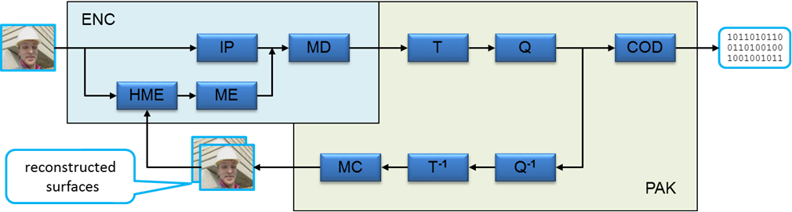
<br>

where

IP      – intra prediction

MD      – mode decision

HME     – hierarchical motion estimation

ME      – motion estimation

T, T<sup>**-1**</sup>      – transform and inverse transform

Q, Q<sup>**-1**</sup>      – quantization and inverse quantization

COD     – entropy coding

MC      – motion compensation


<div style="page-break-before:always" />

## Usage models

Overall, there are four different kinds of FEI calls:

**PreENC** – pre encoding. As follows from the name it is preliminary step to gather MB level statistics, that later may be used for optimal encode configuration. This step may be used on its own for different kind of video processing, but usually it is followed by ENCODE step. This step uses **ENC** class of functions.


**ENCODE** – actual encoding. It differs from conventional encoding described in [*SDK API Reference Manual*](./mediasdk-man.md) by additional MB level configuration parameters. This steps uses **ENCODE** class of functions, that internally combines **ENC** and **PAK** cases of functions. Note, that because application provides MV predictors, hierarchical motion estimation (HME) is skipped here.

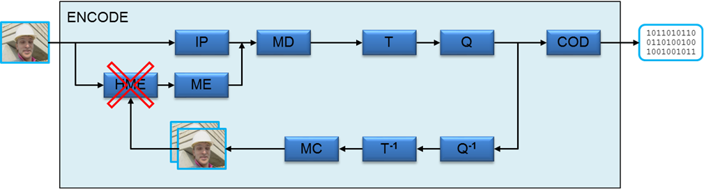

**ENC** – first stage of encoding process. It is used to perform motion estimation and mode decision. After this step, the application gets complete description of encoded frame with all MVs and MB types defined. This step is usually followed by PAK step. Note, that because application provides MV predictors, hierarchical motion estimation (HME) is skipped here.


**PAK** – last step of encoding process. It is used to pack provided by the application frame description into encoded bitstream.

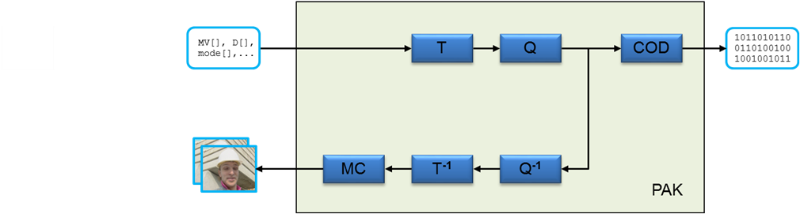

These four calls may be combined in many different ways. The two most common usage models are “PreENC followed by ENCODE” and “ENC followed by PAK”.

### PreENC followed by ENCODE

This is the simplest FEI usage model. It is almost as simple to use as general SDK encoder. It has all necessary reference list control and DPB handling logics. In addition, it provides the same level of feedback as more complicated usage models, including complete description of encoded stream on MB level, also known as PAK object. It also has similar to the general SDK encoder performance.
<br>

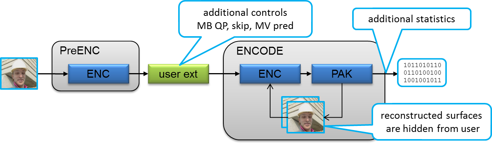

### <a id='ENC_followed_by_PAK'>ENC followed by PAK</a>

This is the most powerful usage model. It lacks bitrate control and reference list handling logics but instead allows application to make changes 
between mode decision and actual entropy coding. Any step in pipeline, including ENC and PAK, may be repeated as many times as necessary to achieve better mode decision or satisfy bitrate control requirements.

Major drawbacks of this model are performance degradation and high implementation complexity.

HW accelerated video processing works fine if there is no stalls in pipeline, i.e. if asynchronous processing is used. However, by its nature, this mode requires synchronous processing, after each HW accelerated step, some additional processing on CPU is required. That leads to performance degradation that potentially may be reduced by processing several independent streams or GOPs of the same stream in parallel.

Complexity of this mode follows from its strengths. Direct control other reference lists, header generation, mode decision requires implementation of all of this logic on application side.
<br>
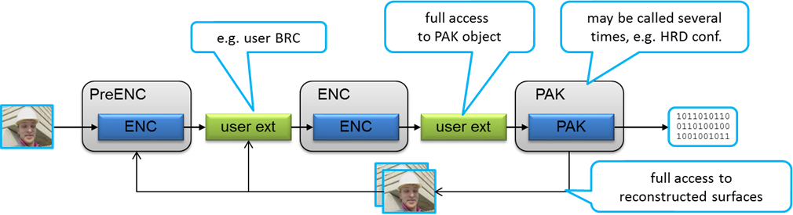
<br>
### <a id='DSO_followed_by_PAK'>DSO followed by PAK</a>

This is the fast transrating model. The decoder is enabled with one FEI extension to deliver a so-called "decode stream out" (DSO). DSO consists of MVs from source stream, plus MB level syntax elements. Afterwards, this DSO is repacked into a PAK object which, along with output raw YUV frames and MVs, is fed to PAK.

Fast transrating outperforms conventional transcoding in the trans-rate use case if the bitrate difference between source and destination is moderate. It also has significantly better subjective visual quality on low bitrates for streams with steady global motion in the regions with uniform textures like water or grass. More details, please refer to the [whitepaper](https://software.intel.com/sites/default/files/FastTransrating-whitepaper-0418.pdf).
<br>
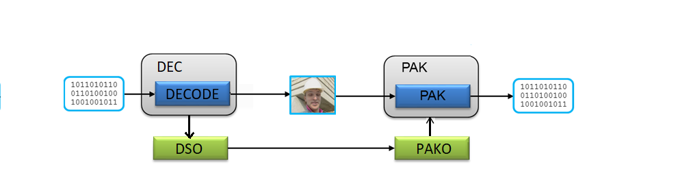
<br>
## Versioning

One of the major benefits of the SDK is its backward compatibility. Any application that uses SDK can work on future platforms without any changes. Unfortunately, it is not true for the FEI part of the SDK. Each application that uses FEI should be recompiled and probably updated and tuned for each new version of driver, HW or operation system. In other words, application should be built and later used only with header files, SDK library and driver from the same package.

The major reason for this is performance considerations. General SDK library hides all drivers and HW differences from application by performing additional processing. But FEI doesn’t have such processing and gives direct access to low-level interfaces and platform capabilities.

The amount of changes depends on the usage model. The more control application gets, the more potential amount of changes will be required. For example, ENCODE usage model provides higher level of abstraction and generally requires less changes than ENC followed by PAK usage model.

<div style="page-break-before:always" />

# Programming Guide

This chapter describes the concepts used in programming the FEI extension for SDK.

The application must use next include files, **mfxenc.h, mfxfei.h** and **mfxvideo.h** (for C programming), or **mfxvideo++.h** (for C++ programming), and link the SDK dispatcher library, **libmfx.so**.

FEI API is built upon the concept of extension buffers and most of configuration parameters and video data are passed in such buffers. Usually FEI related functions work with list of such buffers at input and at output. For example, **MFXVideoENC_ProcessFrameAsync** function receives **mfxENCInput** structure and outputs **mfxENCOutput** structure. Both of these structures are simply list of extension buffers, with  **mfxENCInput** also holding input and reference frames.

[*SDK API Reference Manual*](./mediasdk-man.md) has more information about handling of extension buffers. In short – extension buffer is special SDK structure that holds **mfxExtBuffer** value as its first member. This value holds unique buffer ID and buffer size. The application should allocate this structure, properly set ID and size and then “attach” this buffer to one of the other structures, for example **mfxVideoParam** or **mfxENCInput**. “Attach” means to put pointer to this extension buffer to the **ExtParam** array and to increase buffer counter **NumExtParam**. It is very important to zero all reserved fields in the extension buffers to ensure seamless future extensions.

Extension buffers may be used on any stages of the SDK pipeline – during initialization, at runtime and at reset. There are many limitations when and how particular extension buffer may be used, please refer to the buffer description for details.

## Working with interlaced content

FEI extension of the SDK API uses the same approach to the interlaced content processing as the rest of the SDK. Each **mfxFrameSurface1** structure holds either progressive frame or pair of interlaced fields. In later case, even lines represent top field and odd lines – bottom field.

In most cases, the SDK processes both fields at ones, i.e. each call of the SDK function takes pair of the fields in input frame surface, processes both of them and output them in another frame surface or bitstream buffer. The only exception is field output mode in **ENCODE** class of functions. In this case, application still has to submit both fields in the same frame surface, but two separate calls of **MFXVideoENCODEEncodeFrameAsync** are required, each one with separate bitstream buffer. After processing, each coded field is returned in separate bitstream buffer with corresponded sync point.

The general SDK uses the same set of parameters for both fields. To overcome this limitation FEI allows different controls for different fields. That is done by providing two separate sets of extension buffers. Each type of buffer should be present twice in the list of extension buffers. The first instance of the buffer in the list belongs to the first field in encoding order, the second buffer – to the second field. Number of macroblocks in the buffer should be equal to the number of macroblocks in the field, i.e. should be halved in comparison to the progressive frame case.

For example, to provide motion vector predictors for PreENC call in top field first case, next code may be used:

```
        mfxENCOutput in;
        mfxExtFeiPreEncMVPredictors mv_top;
        mfxExtFeiPreEncMVPredictors mv_bot;

        //allocate memory, fill in predictors
        ...

        in.ExtParam[in.NumExtParam++] = (mfxExtBuffer*) &mv_top;
        in.ExtParam[in.NumExtParam++] = (mfxExtBuffer*) &mv_bot;
```


Progressive or interlaced mode is selected during initialization by mfxVideoParam::mfx.FrameInfo.PicStruct. For mixed picture structure case (initialized as MFX_PICSTRUCT_UNKNOWN), the mode is selected during runtime by mfxFrameSurface1::Info.PicStruct.

For interlaced content FEI supports two different processing modes – conventional, double field mode, when both fields from input surface are processed in single call of **MFXVideoXXX_ProcessFrameAsync** and single field mode, when one call of **MFXVideoXXX_ProcessFrameAsync** processes only one field. The mode is selected during initialization by **mfxExtFeiParam::SingleFieldProcessing**.

## <a id='PreENC'>PreENC</a>

This is preliminary step in encoding process. Its major goal is to gather different kind of statistics for later steps. It is performed by **ENC** class of functions.

The table below provides summary of input and output parameters for this step.<br>

| Input | Input | Output | Output |
| --- | --- | --- | --- |
[mfxENCInput](#mfxENCInput)**::InSurface** | input frame | [mfxExtFeiPreEncMV](#mfxExtFeiPreEncMV) | best found MVs
[mfxExtFeiPreEncCtrl](#mfxExtFeiPreEncCtrl)**::RefFrame[2]** | reference frames | [mfxExtFeiPreEncMBStat](#mfxExtFeiPreEncMBStat) | MB level statistics
[mfxExtFeiPreEncCtrl](#mfxExtFeiPreEncCtrl) | frame level configuration |  |
[mfxExtFeiPreEncMVPredictors](#mfxExtFeiPreEncMVPredictors) | MV predictors for each MB |  |
[mfxExtFeiEncQP](#mfxExtFeiEncQP) | MB level QP |  |

Before using **ENC** the application should properly initialize this component by calling **MFXVideoENC_Init** function. Because **ENC** has different usage models, the application should choose PreENC by attaching **mfxExtFeiParam** extension buffer to **mfxVideoParam** structure and setting **Func** variable to **MFX_FEI_FUNCTIONPREENC**.

After successful initialization, the application can use PreENC by calling **MFXVideoENC_ProcessFrameAsync** function. Each call is executed in several stages:

<div class="indent">
  
1.　Downsampling of input surface, [mfxENCInput](#mfxENCInput)**::InSurface**. After this stage, downsampled version of input is stored in internal cache for future usage. Up to 16 surfaces can be stored, i.e. 16 frames or 16 field pairs.</br>

  During downsampling, pixel averages and variances are calculated and stored in **mfxExtFeiPreEncMBStat**.<br>

  <div>Whole surface is downsampled at once, i.e. complete frame or pair of fields. For interlaced contend it is done during top field processing.<br>

  Application can control downsampling process by using **mfxExtFeiPreEncCtrl:: DownsampleInput** variable. If the same surface is used several times as input, it is recommended to disable downsampling to improve performance. If surface has been updated by application between PreENC calls, then it is necessary to turn on downsampling to update internal cache.<br>

  PreENC controls cache eviction and downsample input surface if necessary, even if application turns off **mfxExtFeiPreEncCtrl::DownsampleInput** flag.

2.　HME stage. On this stage motion estimation is performed on downsampled pictures and MV predictors for the next stage are calculated. If two reference pictures are provided, this stage is performed two times, once for each reference picture.

   Because this stage is performed on downsampled pictures, every reference picture should be downsampled before usage. It may be done by using reference picture as PreENC input or by setting correspondent **mfxExtFeiPreEncCtrl::DownsampleReference[2]** flag. Application should also set this flag if reference picture has been changed after previous downsampling, PreENC does not track such changes.

   PreENC controls cache eviction and downsample reference surface if necessary, even if application turns off **mfxExtFeiPreEncCtrl::DownsampleReference[2]** flags.

   <div>Examples of reference picture downsampling:<br>
　　　　　a. reference picture is firstly used as PreENC input

```
             preenc_ctrl.DownsampleInput = MFX_CODINGOPTION_ON;
             preenc_ctrl.DownsampleRef[0] = MFX_CODINGOPTION_OFF;
             preenc_ctrl.DownsampleRef[1] = MFX_CODINGOPTION_OFF;
             PreENC(InSurface=F1, L0Surface=NULL, L1Surface=NULL )
             PreENC(InSurface=F2, L0Surface=NULL, L1Surface=NULL )
             PreENC(InSurface=F3, L0Surface=F1, L1Surface=F2 )
```
　　　　　b. reference picture is downsampled in the same PreENC call

```
             preenc_ctrl.DownsampleInput = MFX_CODINGOPTION_ON;
             preenc_ctrl.DownsampleRef[0] = MFX_CODINGOPTION_ON;
             preenc_ctrl.DownsampleRef[1] = MFX_CODINGOPTION_ON;
             PreENC(InSurface=F3, L0Surface=F1, L1Surface=F2 )
```
　　　　　c. reference picture has not been downsampled previously and automatically downsampled by PreENC

```
             preenc_ctrl.DownsampleInput = MFX_CODINGOPTION_ON;
             preenc_ctrl.DownsampleRef[0] = MFX_CODINGOPTION_OFF;
             PreENC(InSurface=F1, L0Surface=NULL, L1Surface=NULL )
             PreENC(InSurface=F2, L0Surface=F3, L1Surface=NULL )
```
F3 is missed in cache, downsampled by PreENC

3.　SIC (skip and intra check) stage. On this stage intra mode is selected and correspondent distortion is calculated. Also **NumOfNonZeroCoef** and **SumOfCoef** are calculated.

4.　IME (integer motion estimation) stage. On this stage integer motion estimation is performed. It is unidirectional motion estimation, even if two reference frames are provided, each one is estimated separately against input frame.

5.　FME (fractional motion estimation) stage. On this stage fractional refinement is performed.


<div style="margin-left:-2em;">
In double field mode, PreENC supports forth TFF and BFF picture structures, but PreENC always firstly processes top field then bottom field, regardless of specified by application picture structure. That is done to simplify calculation of pixel average and variances. They are calculated on downsampling stage and this stage is executed during top field processing.

If application skips downsampling stage by setting **mfxExtFeiPreEncCtrl::DownsampleInput** to OFF, then both pixel average and variance values are undefined. That is true for both progressive and interlaced contents.

Sometimes in double field mode, it may be necessary to skip processing of one of the fields, for example in case when fields have different number of references. To do so application should set both pointers in **mfxExtFeiPreEncCtrl::RefFrame[2]** array to **NULL** and disable MV and statistic output by using **mfxExtFeiPreEncCtrl::DisableMVOutput** and **mfxExtFeiPreEncCtrl::DisableStatisticsOutput** flags. In this case, PreENC skips all stages except Intra calculation.

In single field mode, application should use control flow that is similar to the double field mode. For both **MFXVideoENC_ProcessFrameAsync** calls application should provide the same set of extension buffers as for double field mode, i.e. both calls for first and for second fields should have the same extension buffers set, one buffer for first and one for second field.

In single field mode both TFF and BFF picture structures are supported. It is possible to start processing from bottom field, then call top field or vice versa. In any case, two calls for the same field pair should be performed, one call for each field. It is prohibited to repeat call for the same field or to skip processing of one of the fields. For example, it is prohibited to call PreENC two times for the same top field or to skip processing of bottom field. After such violation PreENC state becomes undefined and reset is required.

Apart from described above limitations, **PreENC** is stateless and no internal states are changed during processing, so application can call **PreENC** several times for the same frame or field pair. It is also possible to completely skip processing of frame or field pair.


## <a id='ENCODE'>ENCODE</a>

This is extension of conventional encoding functionality described in [*SDK API Reference Manual*](./mediasdk-man.md). It covers all stages of encoding and produces encoded bitstream from original row frames. It is performed by **ENCODE** class of functions.

The table below provides summary of additional input and output parameters that FEI adds to conventional encode. The application should attach input extension buffers to **mfxEncodeCtrl** structure and output ones to **mfxBitstream**.

| Input | Input | Output | Output |
| --- | --- | --- | --- |
**surface** in  **MFXVideoENCODEEncode FrameAsync** | input frame, the SDK encoder keeps track of reference frames internally | [mfxExtFeiEncMV](#mfxExtFeiEncMVs) | estimated MVs
[mfxExtFeiEncFrameCtrl](#mfxExtFeiEncFrameCtrl) | frame level configuration | [mfxExtFeiEncMBStat](#mfxExtFeiEncMBStat) | MB level statistics
[mfxExtFeiEncMVPredictors](#mfxExtFeiEncMVPredictors) | MV predictors for each MB | [mfxExtFeiPakMBCtrl](#mfxExtFeiPakMBCtrl) | estimated MB level configuration
[mfxExtFeiEncMBCtrl](#mfxExtFeiEncMBCtrl) | MB level configuration |  |
[mfxExtFeiEncQP](#mfxExtFeiEncQP) | Per MB QP values |  |

The usage model is completely described in [*SDK API Reference Manual*](./mediasdk-man.md). To allow additional extensions the application should attach **mfxExtFeiParam** buffer to **mfxVideoParam** structure during initialization and set **Func** variable to **MFX_FEI_FUNCTION_ENCPAK**. During runtime application can use different sets of extension buffers, see description of each buffer for more details.

This function call changes internal encoder state so it should be done only once for each encoded frame.


## ENC

This is the first step of “ENC followed by PAK” usage model. The application uses **ENC** class of　functions to generate complete description of encoded frame in **mfxExtFeiPakMBCtrl** structure. Then the application analyzes this data, makes necessary adjustment and calls PAK class of functions　to produce encoded bitstream.

This usage model is the most powerful one, but requires much higher, order of magnitude, development efforts than “PreENC followed by ENCODE” approach, and also leads to significant performance penalties.

The table below provides summary of input and output parameters for this step.<br>

| Input | Input | Output | Output |
| --- | --- | --- | --- |
[mfxENCInput](#mfxENCInput)**::InSurface** | input frame | [mfxExtFeiEncMV](#mfxExtFeiEncMVs) | estimated MVs
[mfxENCInput](#mfxENCInput)**::L0/1Surface** | reference frames | [mfxExtFeiEncMBStat](#mfxExtFeiEncMBStat) | MB level statistics
[mfxExtFeiEncFrameCtrl](#mfxExtFeiEncFrameCtrl) | frame level configuration | [mfxExtFeiPakMBCtrl](#mfxExtFeiPakMBCtrl) | estimated MB level configuration
[mfxExtFeiEncMVPredictors](#mfxExtFeiEncMVPredictors) | MV predictors for each MB |  |
[mfxExtFeiEncMBCtrl](#mfxExtFeiEncMBCtrl) | MB level configuration |  |
[mfxExtFeiSPS](#mfxExtFeiSPS) | Sequence parameter set |  |
[mfxExtFeiPPS](#mfxExtFeiPPS) | Picture parameter set |  |
[mfxExtFeiSliceHeader](#mfxExtFeiSliceHeader) | Slice parameters |  |

Before using **ENC** the application should properly initialize this component by calling **MFXVideoENC_Init** function. Because **ENC** has different usage models, the application should choose ENC by attaching **mfxExtFeiParam** extension buffer to **mfxVideoParam** structure and setting **Func** variable to **MFX_FEI_FUNCTION_ENC**.

After successful initialization, the application can call **MFXVideoENC_ProcessFrameAsync** function for each encoded frame. Each call of this function is independent from the others, i.e. no internal states are changed during the call, so application can call this function several times for the same frame.

Special care should be taken for double field processing. In this mode both fields from input surface are processed in one call of **MFXVideoENC_ProcessFrameAsync**. If one of the fields references the other then application should provide correct reference for this field. Obviously, reconstructed surface for first field is not ready yet, because first field has not been processed by **PAK** so the only alternative is to use raw input frame as reference. There is no such issue in single field mode if before calling **ENC** for second field first has been processed by **PAK**.

Examples of correct **ENC** usage:

- double field
       - second field does not reference first
       - raw reference is used for second field

- single field
       - next order of calls is used
          - **ENC** is called for first field, then **PAK** is called for first field, then **ENC** is called for second field, then **PAK** is called for second field

In current FEI **ENC** implementation, both buffers **mfxExtFeiEncMV** and **mfxExtFeiPakMBCtrl** should have the same status in runtime - provided or not provided. FEI **ENCODE** doesn’t have such limitation.


## PAK

This is the last step of “ENC followed by PAK” usage model. The application uses **PAK** class of functions to generate coded bitstream and reconstructed surfaces from the frame description in the **mfxExtFeiPakMBCtrl** structure.

The table below provides summary of input and output parameters for this step.

| Input | Input | Output | Output |
| --- | --- | --- | --- |
[mfxPAKInput](#mfxPAKInput)**::InSurface** | input frame | [mfxPAKOutput](#mfxPAKOutput)**:: OutSurface** | reconstructed input surface
[mfxPAKInput](#mfxPAKInput)**::L0/1Surface** | reconstructed reference frames | [mfxPAKOutput](#mfxPAKOutput)**::Bs** | coded bitstream
[mfxExtFeiSPS](#mfxExtFeiSPS) | Sequence parameter set |  |
[mfxExtFeiPPS](#mfxExtFeiPPS) | Picture parameter set |  |
[mfxExtFeiSliceHeader](#mfxExtFeiSliceHeader) | Slice parameters |  |
[mfxExtFeiPakMBCtrl](#mfxExtFeiPakMBCtrl) | MB level configuration |  |
[mfxExtFeiEncMV](#_mfxExtFeiEnvMV) | motion vectors |  |

For AVC, PAK does not generate SEI internally. All SEI inserted into bitstream should be provided by application as payload. The table below shows the payload types supported in PAK:

| Codec | Supported Types |
| --- | ---|
AVC | 00 //buffering_period<br>01 //pic_timing<br>02 //pan_scan_rect<br>03 //filler_payload<br>04 //user_data_registered_itu_t_t35<br>05 //user_data_unregistered<br>06 //recovery_point<br>07 //dec_ref_pic_marking_repetition<br>09 //scene_info<br>13 //full_frame_freeze<br>14 //full_frame_freeze_release<br>15 //full_frame_snapshot<br>16 //progressive_refinement_segment_start<br>17 //progressive_refinement_segment_end<br>19 //film_grain_characteristics<br>20 //deblocking_filter_display_preference<br>21 //stereo_video_info<br>45 //frame_packing_arrangement<br>

Before using **PAK** the application should properly initialize this component by calling **MFXVideoPAK_Init** function. **PAK** has only one usage model, but still, for future extensions, it is required to attach **mfxExtFeiParam** extension buffer to **mfxVideoParam** structure and set **Func** variable to **MFX_FEI_FUNCTION_PAK**.

After successful initialization, the application can call **MFXVideoPAK_ProcessFrameAsync** function for each encoded frame. Each call of this function is independent from the others, i.e. no internal states are changed during the call, so application can call this function several times for the same frame.


## DSO

This is the first step of “DSO followed by PAK” usage model. The application uses **MFXVideoDECODE** class of functions to generate MB level parameters as called “decode stream out” (DSO) in **mfxExtFeiDecStreamOut** structure. Then application repacks the DSO into a PAK object which, along with output raw YUV frames and MVs, is fed to PAK.

“DSO“ usage model is like the general decoding process, during the initialization, applicatin should attach **mfxExtFeiParam** extension buffer to **mfxVideoParam** structure and set **Func** variable to **MFX_FEI_FUNCTION_DEC**, during the runtime, attach **mfxExtFeiDecStreamOut** to **mfxFrameSurface1**.

The repacking of DSO to PAK object is necessary. The MVs from DSO are for 8x8 blocks, but not for 4x4 blocks. And DirectMB and skip conditions have to be re-computed as MV are changed. All CBP (Coding Block Patterns) and related vars are set, to let PAK decide on CBP. And after MV elimination some splits can be enlarged. More details about the repacking, please refer to the sample source code in FEI sample (sample_fei). 

<div STYLE="page-break-after: always;"></div>

# Function Reference

This section describes SDK functions and their operations.

In each function description, only commonly used status codes are documented. The function may return additional status codes, such as **MFX_ERR_INVALID_HANDLE** or **MFX_ERR_NULL_PTR**, in certain case. See the **mfxStatus** enumerator for a list of all status codes.

## MFXVideoENC_Init

*Deprecated in 1.35 and removed starting from 2.0*

**Syntax**

```
mfxStatus MFXVideoENC_Init(mfxSession session, mfxVideoParam *par);
```

**Parameters**

| | |
--- | ---
`session` | SDK session handle
`par`　| Pointer to the mfxVideoParam structure

**Description**

This function initializes **ENC** class of functions. [mfxFeiFunction](#mfxFeiFunction) should be attached to the **mfxVideoParam** to select required usage model – PreENC or ENC.

**Return Status**

| | |
--- | ---
`MFX_ERR_NONE` | The function completed successfully.

**Change History**

This function is available since SDK API 1.9.

## MFXVideoENC_Reset

*Deprecated in 1.35 and removed starting from 2.0*

**Syntax**

```
mfxStatus MFXVideoENC_Reset(mfxSession session, mfxVideoParam *par);
```

**Parameters**

| | |
--- | ---
`session` | SDK session handle
`par`　| Pointer to the mfxVideoParam structure

**Description**

This function resets **ENC** class of functions.

**Return Status**

| | |
--- | ---
`MFX_ERR_NONE` | The function completed successfully.

**Change History**

This function is available since SDK API 1.9.

## MFXVideoENC_Close

*Deprecated in 1.35 and removed starting from 2.0*

**Syntax**

```
mfxStatus MFXVideoENC_Close(mfxSession session);
```

**Parameters**

| | |
--- | ---
`session` | SDK session handle

**Description**

This function closes **ENC** class of functions.

**Return Status**

| | |
--- | ---
`MFX_ERR_NONE` | The function completed successfully.

**Change History**

This function is available since SDK API 1.9.

## <a id='MFXVideoENC_ProcessFrameAsync'>MFXVideoENC_ProcessFrameAsync</a>

*Deprecated in 1.35 and removed starting from 2.0*

**Syntax**


`mfxStatus MFXVideoENC_ProcessFrameAsync(mfxSession session,`[mfxENCInput](#mfxENCInput) `*in,`[mfxENCOutput](#mfxENCOutput) `*out, mfxSyncPoint *syncp);`

**Parameters**

| | |
--- | ---
`session` | SDK session handle
`in` | Pointer to the input parameters
`out` | Pointer to the output parameters
`syncp` | Pointer to the sync point associated with this operation

**Description**

This function performs motion estimation and mode decision.

In PreENC mode only one forward and one backward reference are supported. To perform multi-reference search the application should call this function several times.

In PreENC mode the function is stateless, i.e. the result of function call does not depend on previous call history.

The function is asynchronous.

**Return Status**

| | |
--- | ---
`MFX_ERR_NONE` | The function completed successfully.

**Change History**

This function is available since SDK API 1.9.

## <a id='MFXVideoPAK_QueryIOSurf'>MFXVideoPAK_QueryIOSurf</a>

*Deprecated in 1.35 and removed starting from 2.0*

**Syntax**

`mfxStatus MFXVideoPAK_QueryIOSurf(mfxSession session, mfxVideoParam *par, mfxFrameAllocRequest request[2]);`


**Parameters**

| | |
--- | ---
`session` | SDK session handle
`par` | Pointer to the mfxVideoParam structure as input
`request` | Pointer to the output mfxFrameAllocRequest structure; use `request[0]` for input surfaces requirements and `request[1]` for reconstructed surfaces requirements

**Description**

This function returns minimum and suggested numbers of the input and reconstructed frame surfaces and their types required for **PAK** initialization. The parameter `request[0]` refers to the input surfaces requirements; `request[1]` refers to reconstructed surfaces requirements.

This function does not validate I/O parameters except those used in calculating the number of reconstructed surfaces.

**Return Status**

| | |
--- | ---
`MFX_ERR_NONE` | The function completed successfully.
`MFX_ERR_INVALID_VIDEO_PARAM` | The function detected invalid video parameters. These parameters may be out of the valid range, or the combination of them resulted in incompatibility. Incompatibility not resolved.
`MFX_WRN_INCOMPATIBLE_VIDEO_PARAM` | The function detected some video parameters were incompatible with others; incompatibility resolved.

**Change History**

This function is available since SDK API 1.23.

## MFXVideoPAK_Init

*Deprecated in 1.35 and removed starting from 2.0*

**Syntax**

```
mfxStatus MFXVideoPAK_Init(mfxSession session, mfxVideoParam *par);
```

**Parameters**

| | |
--- | ---
`session` | SDK session handle
`par` | Pointer to the mfxVideoParam structure

**Description**

The function initializes **PAK** class of functions. [mfxFeiFunction](#mfxFeiFunction) should be attached to the **mfxVideoParam** to select **PAK** usage model.

**Return Status**

| | |
--- | ---
`MFX_ERR_NONE` | The function completed successfully.
`MFX_ERR_INVALID_VIDEO_PARAM` | The function detected invalid parameters. These parameters may be out of the valid range, or the combination of them resulted in incompatibility. Incompatibility not resolved.
`MFX_WRN_INCOMPATIBLE_VIDEO_PARAM` | The function detected some video parameters were incompatible with others; incompatibility resolved.
**Change History**

This function is available since SDK API 1.9.

## MFXVideoPAK_Reset

*Deprecated in 1.35 and removed starting from 2.0*

**Syntax**

```
mfxStatus MFXVideoPAK_Reset(mfxSession session, mfxVideoParam *par);
```

**Parameters**

| | |
--- | ---
`session` | SDK session handle
`par` | Pointer to the mfxVideoParam structure

**Description**

The function resets **PAK** class of functions.

**Return Status**

| | |
--- | ---
`MFX_ERR_NONE` | The function completed successfully.
`MFX_ERR_INVALID_VIDEO_PARAM` | The function detected that video parameters are wrong or they conflict with initialization parameters. Reset is impossible.
`MFX_ERR_INCOMPATIBLE_VIDEO_PARAM` | The function detected that provided by application video parameters are incompatible with initialization parameters. Reset requires additional memory allocation and cannot be executed. The application should close the SDK component and then reinitialize it.
`MFX_WRN_INCOMPATIBLE_VIDEO_PARAM` | The function detected some video parameters were incompatible with others; incompatibility resolved.

**Change History**

This function is available since SDK API 1.9.

## MFXVideoPAK_Close

*Deprecated in 1.35 and removed starting from 2.0*

**Syntax**

```
mfxStatus MFXVideoPAK_Close(mfxSession session);
```

**Parameters**

| | |
--- | ---
`session` | SDK session handle

**Description**

The function closes **PAK** class of functions.

**Return Status**

| | |
--- | ---
`MFX_ERR_NONE` | The function completed successfully.

**Change History**

This function is available since SDK API 1.9.

## <a id='MFXVideoPAK_ProcessFrameAsync'>MFXVideoPAK_ProcessFrameAsync</a>

*Deprecated in 1.35 and removed starting from 2.0*

**Syntax**

`mfxStatus MFXVideoPAK_ProcessFrameAsync(mfxSession session,` [mfxPAKInput](#mfxPAKInput) `*in,` [mfxPAKOutput](#mfxPAKOutput) `*out, mfxSyncPoint *syncp);`

**Parameters**

| | |
--- | ---
`session` | SDK session handle
`in` | Pointer to the input parameters
`out` | Pointer to the output parameters
`syncp` | Pointer to the sync point associated with this operation

**Description**

The function performs bitstream packing.

The function is asynchronous.

**Return Status**

| | |
--- | ---
`MFX_ERR_NONE` | The function completed successfully.

**Change History**

This function is available since SDK API 1.9.

<div STYLE="page-break-after: always;"></div>

# Structure Reference

In the following structures all reserved fields must be zero.

## <a id='mfxExtFeiPreEncCtrl'>mfxExtFeiPreEncCtrl</a>

*Deprecated in 1.35 and removed starting from 2.0*

**Definition**

```C
typedef struct {
    mfxExtBuffer    Header;

    mfxU16    Qp;
    mfxU16    LenSP;
    mfxU16    SearchPath;
    mfxU16    SubMBPartMask;
    mfxU16    SubPelMode;
    mfxU16    InterSAD;
    mfxU16    IntraSAD;
    mfxU16    AdaptiveSearch;
    mfxU16    MVPredictor;
    mfxU16    MBQp;
    mfxU16    FTEnable;
    mfxU16    IntraPartMask;
    mfxU16    RefWidth;
    mfxU16    RefHeight;
    mfxU16    SearchWindow;
    mfxU16    DisableMVOutput;
    mfxU16    DisableStatisticsOutput;
    mfxU16    Enable8x8Stat;
    mfxU16    PictureType; /* Input picture type*/
    mfxU16    DownsampleInput;

    mfxU16    RefPictureType[2]; /* reference picture type, 0 -L0, 1 - L1*/
    mfxU16    DownsampleReference[2];
    mfxFrameSurface1 *RefFrame[2];
    mfxU16    reserved[28];
} mfxExtFeiPreEncCtrl;
```

**Description**

This extension buffer specifies frame level control for PreENC usage model. It is used during runtime and should be attached to the [mfxENCInput](#mfxENCInput) structure.

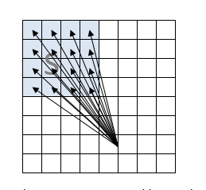To better utilize HW capability, motion estimation is performed on group of search locations, so called search unit (SU). The number of locations in one SU depends on the block size. For example, for 16x16 macroblock, SU consists of 4x4 locations, i.e. 16 motion vectors are estimated at once, in one SU. See the figure on the left.

These SUs are arranged in search path (SP). This is predefined set of search units, for example, diamond shaped path. Motion estimation will go along this path until **LenSP** SUs will be checked.

If all SUs in SP have been processed and adaptive search has been enabled, motion estimation continues for neighbor SUs, until local minimum will be found or number of processed SUs reached **MaxLenSP** (not controllable by application) or boundary of search window will be reached.

Note, that though search window size is rather small, just 48 by 40 pixels, actual motion vectors may be much longer, because this search window is specified relative to the motion vector predictor. And that in turn may be of any valid length.

**Members**

| | |
--- | ---
`Header.BufferId` | Buffer ID, must be **MFX_EXTBUFF_FEIPREENC_CTRL**.
`Qp` | Frame level QP. It is used only if forward transform calculation is enabled and MB level QPs are not provided. See **FTEnable** and **MBQp** below.
`LenSP` | reserved and must be zero<br><br>This value defines number of search units in search path. If adaptive search is enabled it starts after this number has been reached. Valid range [1,63].
`SearchPath` | reserved and must be zero<br><br>This value specifies search path.<br><br>0 - exhaustive aka full search<br>1 - diamond search
`SubMBPartMask` | This value specifies what block and sub-block partitions should be excluded from search.<br>0x01 - 16x16<br>0x02 - 16x8<br>0x04 - 8x16<br>0x08 - 8x8<br>0x10 - 8x4<br>0x20 - 4x8<br>0x40 - 4x4<br>For example, 0x00 – enables all partitions, 0x7f disables all and should not be used.
`SubPelMode` | This value specifies sub pixel precision for motion estimation.<br><br>0x00 - integer motion estimation<br>0x01 - half-pixel motion estimation<br>0x03 - quarter-pixel motion estimation<br>
`InterSAD IntraSAD` | These values specify intra and inter distortions adjustment.<br><br>0x00 - none<br>0x02 - Haar transform<br>
`AdaptiveSearch` | If set, adaptive search is enabled.
`MVPredictor` | This value specifies what predictors should be used during motion estimation.<br><br>0x00 – disables usage of predictors<br>0x01 – enable predictors for L0 (past) reference<br>0x02 – enable predictors for L1 (future) reference<br>0x03 – enable both, past and future predictors<br><br>If this value is not zero, then [mfxExtFeiPreEncMVPredictors](#mfxExtFeiPreEncMVPredictors) structure should be attached to the [mfxENCInput](#mfxENCInput) structure.
`MBQp` | Non-zero value enables MB level QP. It is used only if forward transform calculation is enabled. See **FTEnable** below.<br><br>If this value is not zero, then[mfxExtFeiPreEncQP](#_mfxExtFeiPreEncQPs) structure should be attached to the [mfxENCInput](#mfxENCInput) structure.
`FTEnable` | If set, forward transform calculation is enabled and number of non-zero coefficients and sum of coefficients are estimated and reported in [mfxExtFeiPreEncMBStat](#mfxExtFeiPreEncMBStat). Frame or MB level QP should be specified for proper calculation.
`IntraPartMask` | This value specifies what block and sub-block partitions are enabled for intra MBs.<br><br>0x01 - 16x16 is disabled<br>0x02 - 8x8 is disabled<br>0x04 - 4x4 is disabled<br><br>For example, 0x00 – enables all partitions, 0x07 disables all and should not be used.
`RefWidth, RefHeight` | reserved and must be zero<br><br>These values specify width and height of search region in pixels. They should be multiple of 4. Maximum allowed region is 64x32 for one direction and 32x32 for bidirectional search.
`SearchWindow` | This value specifies one of the predefined search path and window size:<br><br>1  - Tiny Diamond – 4 SUs 24x24 window<br>2  - Small Diamond – 9 SUs 28x28 window<br>3  - Diamond – 16 SUs 48x40 window<br>4  - Large Diamond – 32 SUs 48x40 window<br>5  - Exhaustive – 48 SUs 48x40 window<br>6  - Horizontal Diamond – 16 SUs 64x32 window<br>7  - Horizontal Large Diamond– 32 SUs 64x32 window<br>8  - Horizontal Exhaustive – 48 SUs 64x32 window
`DisableMVOutput` | If set, MV output is disabled. See [mfxExtFeiPreEncMV](#mfxExtFeiPreEncMV) structure for more details.
`DisableStatisticsOutput` | If set, statistics output is disabled. See [mfxExtFeiPreEncMBStat](#mfxExtFeiPreEncMBStat) structure for more details.
`Enable8x8Stat` | This value controls block size for statistic report. If it is set, then statistic is gathered for 8x8 and 16x16 blocks, if not set only for 16x16 macroblock. This value affects **Variance** and **PixelAverage** fields in the [mfxExtFeiPreEncMBStat](#mfxExtFeiPreEncMBStat) structure.
`PictureType` | This value specifies input picture type:<br><br>**MFX_PICTYPE_FRAME** – progressive frame,<br>**MFX_PICTYPE_TOPFIELD** - top field,<br>**MFX_PICTYPE_BOTTOMFIELD** – bottom field.
`DownsampleInput` | This flag indicates should SDK perform downsampling of input surface or not. If it is set to **MFX_CODINGOPTION_ON**, SDK downsamples input surface. This is default mode. If it is set to **MFX_CODINGOPTION_OFF**, then downsampling stage is skipped.
`RefPictureType[2]` | This value specifies reference picture type:<br><br>**MFX_PICTYPE_FRAME** – progressive frame,<br>**MFX_PICTYPE_TOPFIELD** - top field,<br>**MFX_PICTYPE_BOTTOMFIELD** – bottom field.<br>0 is for L0 (past) reference and 1 for L1 (future) reference.
`DownsampleReference[2]` | This flag indicates should SDK perform downsampling of reference surfaces or not. If it is set to **MFX_CODINGOPTION_OFF**, then downsampling stage for reference surfaces is skipped. This is default mode. If it is set to **MFX_CODINGOPTION_ON**, SDK downsamples reference surface.<br><br>0 is for L0 (past) reference and 1 for L1 (future) reference.
`RefFrame[2]` | This array holds reference surfaces. It should be used instead of **mfxENCInput::L0Surface** and **L1Surface** arrays. For field processing, each field, i.e. **mfxExtFeiPreEncCtrl** structure, may hold different set of reference surfaces.

**Change History**

This structure is available since SDK API 1.9.

## <a id='mfxExtFeiPreEncMVPredictors'>mfxExtFeiPreEncMVPredictors</a>

*Deprecated in 1.35 and removed starting from 2.0*

**Definition**

```C
typedef struct {
    mfxExtBuffer    Header;
    mfxU32  reserved1[3];
    mfxU32  NumMBAlloc;
    mfxU32  reserved2[20];

    struct  mfxExtFeiPreEncMVPredictorsMB {
        mfxI16Pair MV[2];
    } *MB;
} mfxExtFeiPreEncMVPredictors;
```

**Description**

This extension buffer specifies motion vector predictors for PreENC usage model. To enable usage of MV predictors, **MVPredictor** value should be set in the [mfxExtFeiPreEncCtrl](#mfxExtFeiPreEncCtrl) structure.

This structure is used during runtime and should be attached to the [mfxENCInput](#mfxENCInput) structure.

**Members**

| | |
--- | ---
`Header.BufferId` | Buffer ID, must be **MFX_EXTBUFF_FEIPREENC_MV_PRED**.
`NumMBAlloc` | Number of allocated **mfxExtFeiPreEncMVPredictorsMB** structures in the **MB** array. It should be greater or equal to the number of MBs in the processed frame.
`MB` | Array of MV predictors for each MB in raster scan order.
`MV[0]` | MV predictor for L0 (past) reference.
`MV[1]` | MV predictor for L1 (future) reference.

**Change History**

This structure is available since SDK API 1.9.

## <a id='mfxExtFeiEncQP'>mfxExtFeiEncQP</a>

*Deprecated in 1.35 and removed starting from 2.0*

**Definition**

```C
typedef struct {
    mfxExtBuffer    Header;
    mfxU32  reserved1[3];
    mfxU32  NumMBAlloc;
    mfxU32  reserved2[20];

    mfxU8    *MB;
} mfxExtFeiEncQP;
```

**Description**

This extension buffer specifies per MB QP values for PreENC, ENCODE and ENC usage models. To enable its usage for PreENC, set **mfxExtFeiPreEncCtrl**::**MBQp** value, for ENCODE and ENC set **mfxExtFeiEncFrameCtrl::PerMBQp** value.

This structure is used during runtime and should be attached to the [mfxENCInput](#mfxENCInput) or **mfxEncodeCtrl** structure.

**Members**

| | |
--- | ---
`Header.BufferId` | Buffer ID, must be **MFX_EXTBUFF_FEI_ENC_QP**.
`NumMBAlloc` | Number of allocated **MB** values. It should be greater or equal to the number of MBs in the processed frame.
`MB` | Array of QP values for each MB in raster scan order.

**Change History**

This structure is available since SDK API 1.9.

SDK API 1.23 renames `NumQPAlloc` and `QP` fields to `NumMBAlloc` and `MB` respectively.

## <a id='mfxExtFeiPreEncMV'>mfxExtFeiPreEncMV</a>

*Deprecated in 1.35 and removed starting from 2.0*

**Definition**

```C
typedef struct {
    mfxExtBuffer    Header;
    mfxU32  reserved[3];
    mfxU32  NumMBAlloc;
    mfxU32  reserved2[20];

    struct  mfxExtFeiPreEncMVMB {
        mfxI16Pair MV[16][2];
    } *MB;
} mfxExtFeiPreEncMV;
```

**Description**

This extension buffer specifies output MV values for PreENC usage model. To enable this buffer **DisableMVOutput** value in the [mfxExtFeiPreEncCtrl](#mfxExtFeiPreEncCtrl) structure should be set to zero.

This structure is used during runtime and should be attached to the [mfxENCOutput](#mfxENCOutput) structure.

**Members**

| | |
--- | ---
`Header.BufferId` | Buffer ID, must be **MFX_EXTBUFF_FEIPREENC_MV**.
`NumMBAlloc` | Number of allocated **mfxExtFeiPreEncMVMB** structures in the **MB** array. It should be greater or equal to the number of MBs in the processed frame.
`MB` | Array of MVs for each MB in raster scan order.
`MV[16][2]` | 32 MVs per MB. First index is sub-block (4x4 pixels) number, second one is 0 for L0 (past) reference and 1 for L1 (future) reference. MVs for each sub-block are located in zigzag scan order.<br><br><table> <tr><td>00</td> <td>01</td> <td>04</td> <td>05</td></tr> <tr><td>02</td> <td>03</td> <td>06</td> <td>07</td></tr> <tr><td>08</td> <td>09</td> <td>12</td> <td>13</td></tr> <tr><td>10</td> <td>11</td> <td>14</td> <td>15</td></tr> </table><br>For example, MV for right top 4x4 sub-block is stored in 5-th element of the array.<br><br>For bigger than 4x4 partitions MVs are replicated to all correspondent sub-block.

**Change History**

This structure is available since SDK API 1.9.

## <a id='mfxExtFeiPreEncMBStat'>mfxExtFeiPreEncMBStat</a>

*Deprecated in 1.35 and removed starting from 2.0*

**Definition**

```C
typedef struct {
    mfxExtBuffer    Header;
    mfxU32 reserved1[3];
    mfxU32 NumMBAlloc;
    mfxU32 reserved2[20];

    struct  mfxExtFeiPreEncMBStatMB {
        struct  {
            mfxU16  BestDistortion;
            mfxU16  Mode ;
        } Inter[2];

        mfxU16  BestIntraDistortion;
        mfxU16  IntraMode ;

        mfxU16  NumOfNonZeroCoef;
        mfxU16  reserved1;
        mfxU32  SumOfCoef;

        mfxU32  reserved2;

        mfxU32  Variance16x16;
        mfxU32  Variance8x8[4];
        mfxU32  PixelAverage16x16;
        mfxU32  PixelAverage8x8[4];
    } *MB;
} mfxExtFeiPreEncMBStat;
```

**Description**

This extension buffer specifies output statistics for PreENC usage model. To enable this buffer **DisableStatisticsOutput** value in the [mfxExtFeiPreEncCtrl](#mfxExtFeiPreEncCtrl) structure should be set to zero.

This structure is used during runtime and should be attached to the [mfxENCOutput](#mfxENCOutput) structure.

**Members**

| | |
--- | ---
`Header.BufferId` | Buffer ID, must be **MFX_EXTBUFF_FEIPREENC_MB**.
`NumMBAlloc` | Number of allocated **mfxExtFeiPreEncMBStatMB**structures in the **MB** array. It should be greater or equal to the number of MBs in the processed frame.
`MB` | Array of MB statistics for each MB in raster scan order.
`Inter[2]` | Inter modes and distortions. 0 is for L0 (past) reference and 1 for L1 (future) reference.
`BestDistortion` | This is distortion for the best found inter MB partitioning. It is calculated as sum of absolute differences between input frame and motion compensated reference frame. This is pure pixel distortion, without any additional correction like MV cost.
`Mode` | This is the best found inter MB type.<br><br><table> <tr><td></td> <td> `L0 (past)` </td> <td> `L1 (future)` </td></tr> <tr><td> `16x16` </td> <td> `1` </td> <td> `2` </td></tr> <tr><td> `16x8` </td> <td> `4` </td> <td> `6` </td></tr> <tr><td> `8x16` </td> <td> `5` </td> <td> `7` </td></tr> <tr><td> `8x8` </td> <td> `block modes` </td> <td> </td></tr> </table><br>For 8x8 case **Mode** is calculated as combination of four block types:<br><br><table> <tr><td>**(type3<<12)**</td> <td>**(type2<<8)**</td> <td>**(type1<<4)**</td> <td>**(type0)**</td></tr> </table><br>where **type3, type2, type1** and **type0** are modes of the correspondent  block from the table below:<br><br><table> <tr><td> </td> <td> `L0 (past)` </td> <td> `L1 (future)` </td></tr> <tr><td> `8x8` </td> <td> `0x1` </td> <td> `0x5` </td></tr> <tr><td> `8x4` </td> <td> `0x2` </td> <td> `0x7` </td></tr> <tr> <td> `4x8` </td> <td> `0x3` </td> <td> `0x8` </td></tr> <tr><td> `4x4` </td> <td> `0x4` </td> <td> `0xB` </td></tr> </table>
`BestIntraDistortion` | This is distortion for the best found intra mode. It is calculated as sum of absolute differences between original pixels from input frame and best found intra prediction. This distortion is adjusted by cost of intra prediction mode, i.e. cost is added to the pure distortion.
`IntraMode` | This is the best found intra MB type. It may be one of the next values defined in Table 7-11 of ISO*/IEC* 14496-10 specification.<br><br><table> <tr><td> `I_16x16_0_0_0` </td><td> `1` </td> <td> `I_16x16_1_0_1` </td> <td> `14` </td></tr> <tr><td> `I_16x16_1_0_0` </td> <td> `2` </td> <td> `I_16x16_2_0_1` </td> <td> `15` </td></tr> <tr><td> `I_16x16_2_0_0` </td> <td> `3` </td> <td> `I_16x16_3_0_1` </td> <td> `16` </td></tr> <tr><td> `I_16x16_3_0_0` </td> <td> `4` </td> <td> `I_16x16_0_1_1` </td> <td> `17` </td></tr> <tr><td> `I_16x16_0_1_0` </td> <td> `5` </td> <td> `I_16x16_1_1_1` </td> <td> `18` </td></tr> <tr><td> `I_16x16_1_1_0` </td> <td> `6` </td> <td> `I_16x16_2_1_1` </td> <td> `19` </td></tr> <tr><td> `I_16x16_2_1_0` </td> <td> `7` </td> <td> `I_16x16_3_1_1` </td> <td> `20` </td></tr> <tr><td> `I_16x16_3_1_0` </td> <td> `8` </td> <td> `I_16x16_0_2_1` </td> <td> `21` </td></tr> <tr><td> `I_16x16_0_2_0` </td> <td> `9` </td> <td> `I_16x16_1_2_1` </td> <td> `22` </td></tr> <tr><td> `I_16x16_1_2_0` </td> <td> `10` </td> <td> `I_16x16_2_2_1` </td> <td> `23` </td></tr> <tr><td> `I_16x16_2_2_0` </td> <td> `11` </td> <td> `I_16x16_3_2_1` </td> <td> `24` </td></tr> <tr><td> `I_16x16_3_2_0` </td> <td> `12` </td> <td> `I_8x8` </td> <td> `129` </td></tr> <tr><td> `I_16x16_0_0_1` </td> <td> `13` </td> <td> `I_4x4` </td> <td> `130` </td></tr> </table><br>Actual intra prediction mode for 16x16 cases can be deduced from MB type. Prediction modes for 8x8 and 4x4 cases are not reported.
`NumOfNonZeroCoef SumOfCoef` | Number of none zero coefficients and sum of coefficients after forward transform. **FTEnable** in the [mfxExtFeiPreEncCtrl](#mfxExtFeiPreEncCtrl) structure enables this calculation.<br><br>These values are calculated using next algorithm. Firstly, difference between current MB from input frame and correspondent MB from L0 reference frame is calculated. There is no offset on this step, i.e. zero MV is used. Then residual data computed on first step are transformed using 4x4 Haar transform. Then transformed data are compared against threshold and number of coefficients above threshold are counted and summed. Threshold in this algorithm is calculated based on QP value.<br><br>L1 reference and non-zero MVs are not supported.
`Variance16x16`, `Variance8x8[4]`, `PixelAverage16x16`, `PixelAverage8x8[4]` | These arrays hold variance and average values of luma samples for 16x16 macroblock and four 8x8 blocks. If **Enable8x8Stat** is set in the [mfxExtFeiPreEncCtrl](#mfxExtFeiPreEncCtrl) structure, then statistic for 8x8 blocks is calculated. If not set, then statistic is calculated for 16x16 macroblock only.


**Change History**

This structure is available since SDK API 1.9.

## <a id='mfxExtFeiEncFrameCtrl'>mfxExtFeiEncFrameCtrl</a>

*Deprecated in 1.35 and removed starting from 2.0*

**Definition**

```C
typedef struct {
    mfxExtBuffer    Header;

    mfxU16    SearchPath;
    mfxU16    LenSP;
    mfxU16    SubMBPartMask;
    mfxU16    IntraPartMask;
    mfxU16    MultiPredL0;
    mfxU16    MultiPredL1;
    mfxU16    SubPelMode;
    mfxU16    InterSAD;
    mfxU16    IntraSAD;
    mfxU16    DistortionType;
    mfxU16    RepartitionCheckEnable;
    mfxU16    AdaptiveSearch;
    mfxU16    MVPredictor;
    mfxU16    NumMVPredictors[2];
    mfxU16    PerMBQp;
    mfxU16    PerMBInput;
    mfxU16    MBSizeCtrl;
    mfxU16    RefWidth;
    mfxU16    RefHeight;
    mfxU16    SearchWindow;
    mfxU16    ColocatedMbDistortion;
    mfxU16    reserved[38];
} mfxExtFeiEncFrameCtrl;
```

**Description**

This extension buffer specifies frame level control for ENCODE and ENC usage models. It is used during runtime and should be attached to the **mfxEncodeCtrl** structure for ENCODE usage model and to the **mfxENCInput** for ENC.

This buffer is similar to the [mfxExtFeiPreEncCtrl](#mfxExtFeiPreEncCtrl) and only additional fields are described here.

**Members**

| | |
--- | ---
`Header.BufferId` | Buffer ID, must be **MFX_EXTBUFF_FEI_ENC_CTRL**.
`SearchPath` | See [mfxExtFeiPreEncCtrl](#mfxExtFeiPreEncCtrl) for description of this field.
`LenSP` | See [mfxExtFeiPreEncCtrl](#mfxExtFeiPreEncCtrl) for description of this field.
`SubMBPartMask` | See [mfxExtFeiPreEncCtrl](#mfxExtFeiPreEncCtrl) for description of this field.
`IntraPartMask` | See [mfxExtFeiPreEncCtrl](#mfxExtFeiPreEncCtrl) for description of this field.
`MultiPredL0, MultiPredL1` | If this value is not equal to zero, then MVs from neighbor MBs will be used as predictors.
`SubPelMode` | See [mfxExtFeiPreEncCtrl](#mfxExtFeiPreEncCtrl) for description of this field.
`InterSAD` | See [mfxExtFeiPreEncCtrl](#mfxExtFeiPreEncCtrl) for description of this field.
`IntraSAD` | See [mfxExtFeiPreEncCtrl](#mfxExtFeiPreEncCtrl) for description of this field.
`DistortionType` | This parameter is ignored. Distortion with additional cost is reported.<br>This value specifies distortion type. If it is zero, then pure distortion is reported, without any additional correction. If it is equal to one, then additional costs (like MVs, reference list indexes and so on) are added.
`RepartitionCheckEnable` | If this value is not equal to zero, then additional sub pixel and bidirectional refinements are enabled.
`AdaptiveSearch` | See [mfxExtFeiPreEncCtrl](#mfxExtFeiPreEncCtrl) for description of this field.
`MVPredictor` | If this value is not equal to zero, then usage of MV predictors is enabled and the application should attach [mfxExtFeiEncMVPredictors](#mfxExtFeiEncMVPredictors) structure to the **mfxEncodeCtrl** structure at runtime.
`NumMVPredictors[2]` | Number of provided by the application MV predictors: 0 –L0 predictors, 1 – L1 predictors. Up to four predictors are supported.
`PerMBQp` | If this value is not equal to zero, then MB level QPs are used during encoding and [mfxExtFeiEncQP](#_mfxExtFeiPreEncQP) structure should be attached to the **mfxEncodeCtrl** structure at runtime.
`PerMBInput` | If this value is not equal to zero, then MB level control is enabled and [mfxExtFeiEncMBCtrl](#mfxExtFeiEncMBCtrl) structure should be attached to the **mfxEncodeCtrl** structure at runtime.
`MBSizeCtrl` | reserved and must be zero<br><br>If this value is not equal to zero, then MB size control is enabled. See **MaxSizeInWord** and **TargetSizeInWord**values in the [mfxExtFeiEncMBCtrl](#mfxExtFeiEncMBCtrl)  structure.
`RefWidth` | See [mfxExtFeiPreEncCtrl](#mfxExtFeiPreEncCtrl) for description of this field.
`RefHeight` | See [mfxExtFeiPreEncCtrl](#mfxExtFeiPreEncCtrl) for description of this field.
`SearchWindow` | See [mfxExtFeiPreEncCtrl](#mfxExtFeiPreEncCtrl) for description of this field.
`ColocatedMbDistortion` | reserved and must be zero<br><br>If set, this field enables calculation of **ColocatedMbDistortion** value in the [mfxExtFeiEncMBStat](#mfxExtFeiEncMBStat) structure.

**Change History**

This structure is available since SDK API 1.9.

## <a id='mfxExtFeiEncMVPredictors'>mfxExtFeiEncMVPredictors</a>

*Deprecated in 1.35 and removed starting from 2.0*

**Definition**

```C
typedef struct {
    mfxExtBuffer    Header;
    mfxU32  reserved1[3];
    mfxU32  NumMBAlloc;
    mfxU32  reserved2[20];

    struct  mfxExtFeiEncMVPredictorsMB {
        struct mfxExtFeiEncMVPredictorsMBRefIdx{
            mfxU8   RefL0: 4;
            mfxU8   RefL1: 4;
        } RefIdx[4];
        mfxU32      reserved;
        mfxI16Pair MV[4][2];
    } *MB;
} mfxExtFeiEncMVPredictors;
```

**Description**

This extension buffer specifies MV predictors for ENCODE and ENC usage models. To enable usage of this buffer the application should set **MVPredictor** field in the [mfxExtFeiEncFrameCtrl](#mfxExtFeiEncFrameCtrl) structure to none zero value.

This structure is used during runtime and should be attached to the **mfxEncodeCtrl** structure for ENCODE usage model and to the **mfxENCInput** for ENC.

**Members**

| | |
--- | ---
`Header.BufferId` | Buffer ID, must be **MFX_EXTBUFF_FEI_ENC_MV_PRED**.
`NumMBAlloc` | Number of allocated **mfxExtFeiEncMVPredictorsMB** structures in the **MB** array. It should be greater or equal to the number of MBs in the processed frame.
`MB` | Array of MV predictors for each MB in raster scan order.
`RefIdx[4]` | Array of reference indexes for each MV predictor.
`RefL0 RefL1` | **L0** and **L1** reference indexes.
`MV[4][2]` | Up to 4 MV predictors per MB. First index is predictor number, second is 0 for L0 (past) reference and 1 for L1 (future) reference.<br><br>**0x8000** value should be used for intra MBs.<br><br>Number of actual predictors is defined by **NumMVPredictors[]** value in the [mfxExtFeiEncFrameCtrl](#mfxExtFeiEncFrameCtrl) structure.<br><br>MV predictor is for the whole 16x16 MB.

**Change History**

This structure is available since SDK API 1.9.

## <a id='mfxExtFeiEncMBCtrl'>mfxExtFeiEncMBCtrl</a>

*Deprecated in 1.35 and removed starting from 2.0*

**Definition**

```C
typedef struct {
    mfxExtBuffer    Header;
    mfxU32  reserved1[3];
    mfxU32  NumMBAlloc;
    mfxU32  reserved2[20];

    struct  mfxExtFeiEncMBCtrlMB {
        mfxU32    ForceToIntra                    : 1;
        mfxU32    ForceToSkip                     : 1;
        mfxU32    ForceToNoneSkip                 : 1;
        mfxU32    DirectBiasAdjustment            : 1;
        mfxU32    GlobalMotionBiasAdjustment      : 1;
        mfxU32    MVCostScalingFactor             : 3;
        mfxU32    reserved1        : 24;

        mfxU32    reserved2;
        mfxU32    reserved3;

        mfxU32    reserved4        : 16;
        mfxU32    TargetSizeInWord : 8;
        mfxU32    MaxSizeInWord    : 8;
    } *MB;
} mfxExtFeiEncMBCtrl;
```

**Description**

This extension buffer specifies MB level parameters for ENCODE and ENC usage models. To enable usage of this buffer the application should set **PerMBInput** field in the [mfxExtFeiEncFrameCtrl](#mfxExtFeiEncFrameCtrl) structure to none zero value.

This structure is used during runtime and should be attached to the **mfxEncodeCtrl** structure for ENCODE usage model and to the **mfxENCInput** for ENC.

**Members**

| | |
--- | ---
`Header.BufferId` | Buffer ID, must be **MFX_EXTBUFF_FEI_ENC_MB**.
`NumMBAlloc` | Number of allocated **mfxExtFeiEncMBCtrlMB** structures in the **MB** array. It should be greater or equal to the number of MBs in the processed frame.
`MB` | Array of MB level parameters.
`ForceToIntra` | If this value is set to ‘1’, then current MB is encoded as intra MB, otherwise encoder decides MB type.
`ForceToSkip` | If this value is set to ‘1’, then current MB is encoded as skip MB or CPB is set to zero, otherwise encoder decides MB type.
`ForceToNoneSkip` | If this value is set to ‘1’, then current MB will not be encoded as skip, otherwise encoder decides MB type.
`DirectBiasAdjustment` | If this value is set to ‘1’, then enable the ENC mode decision algorithm to bias to fewer B Direct/Skip types. Applies only to B frames, all other frames will ignore this setting.
`GlobalMotionBiasAdjustment` | If this value is set to ‘1’, then enable external motion bias.
`MVCostScalingFactor` | Specifies MV cost scaling factor to external motion. It takes effect only when GlobalMotionBiasAdjustment=1, and it controls how much we bias to the external MV predictors. Values are:<br><br>0: set MV cost to be 0 <br>1: scale MV cost to be 1/2 of the default value<br>2: scale MV cost to be 1/4 of the default value<br>3: scale MV cost to be 1/8 of the default value<br>4: scale MV cost to be 3/4 of the default value<br>5: scale MV cost to be 7/8 of the default value
`TargetSizeInWord` | reserved and must be zero<br>This value specifies target MB size in words. Encoder may increase compression ratio to keep MB size in specified boundary.<br>This value is ignored, i.e. there is no target size, if **MBSizeCtrl** value in [mfxExtFeiEncFrameCtrl](#mfxExtFeiEncFrameCtrl) structure is set to zero.
`MaxSizeInWord` | reserved and must be zero<br><br>This value specifies maximum MB size in words. If MB size comes close to this limit, “panic” mode is triggered and encoder begins drastically increase compression ratio.<br><br>This value is ignored, i.e. there is no limit, if **MBSizeCtrl** value in [mfxExtFeiEncFrameCtrl](#mfxExtFeiEncFrameCtrl) structure is set to zero.

**Change History**

This structure is available since SDK API 1.9.
SDK API 1.23 adds `DirectBiasAdjustment, GlobalMotionBiasAdjustment` and `MVCostScalingFactor` fields.

## <a id='mfxExtFeiEncMV'>mfxExtFeiEncMV</a>

*Deprecated in 1.35 and removed starting from 2.0*

**Definition**

```C
typedef struct {
    mfxExtBuffer    Header;
    mfxU32  reserved1[3];
    mfxU32  NumMBAlloc;
    mfxU32  reserved2[20];

    struct  mfxExtFeiEncMVMB {
        mfxI16Pair MV[16][2];
    } *MB;
} mfxExtFeiEncMV;
```

**Description**

This extension buffer holds output MVs for ENCODE and ENC usage models and input MVs for PAK usage model. This structure is used during runtime and should be attached to the **mfxBitstream** for ENCODE usage model, **mfxENCOutput** for ENC usage model and to **mfxPAKInput** for PAK usage model.

**Members**

| | |
--- | ---
`Header.BufferId` | Buffer ID, must be **MFX_EXTBUFF_FEI_ENC_MV**.
`NumMBAlloc` | Number of allocated **mfxExtFeiEncMVMB** structures in the **MB** array. It should be greater or equal to the number of MBs in the processed frame.
`MB` | Array of MVs for each MB in raster scan order.
`MV[16][2]` | Output MVs. Layout is the same as in [mfxExtFeiPreEncMV](#mfxExtFeiPreEncMV) structure. For intra MBs, MVs are set to **0x8000**.

**Change History**

This structure is available since SDK API 1.9.

## <a id='mfxExtFeiEncMBStat'>mfxExtFeiEncMBStat</a>

*Deprecated in 1.35 and removed starting from 2.0*

**Definition**

```C
typedef struct {
    mfxExtBuffer    Header;
    mfxU32  reserved1[3];
    mfxU32  NumMBAlloc;
    mfxU32  reserved2[20];

    struct mfxExtFeiEncMBStatMB {
        mfxU16  InterDistortion[16];
        mfxU16  BestInterDistortion;
        mfxU16  BestIntraDistortion;
        mfxU16  ColocatedMbDistortion;
        mfxU16  reserved;
        mfxU32  reserved1[2];
    } *MB;
} mfxExtFeiEncMBStat;
```

**Description**

This extension buffer holds output MB statistics for ENCODE and ENC usage models. This structure is used during runtime and should be attached to the **mfxBitstream** structure for ENCODE usage model and to the **mfxENCOutput** structure for ENC usage model.

**Members**

| | |
--- | ---
`Header.BufferId` | Buffer ID, must be **MFX_EXTBUFF_FEI_ENC_MB_STAT**.
`NumMBAlloc` | Number of allocated **mfxExtFeiEncMBStatMB** structures in the **MB** array. It should be greater or equal to the number of MBs in the processed frame.
`MB` | Array of per MB statistic in raster scan order.
`InterDistortion[16]` | Inter distortion for correspondent sub-block partitioning. Layout is the same as in [mfxExtFeiPreEncMV](#mfxExtFeiPreEncMV) structure. Only one distortion value for block or subblock is reported, the rest values are set to zero.<br><br>For example, for 16x16 MB only **InterDistortion[0]** is used, for 16x8 **InterDistortion[0]** and **InterDistortion[8]**, for 8x8, 8x4, 4x8, 4x4  - 0, 4, 6, 8, 9, 12, 13, 14, 15, see example below, where X means used value, 0 – unused.<br><br>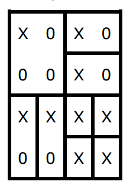<br>
`BestInterDistortion` | The best inter distortion for the whole MB.
`BestIntraDistortion` | The best intra distortion for the whole MB.
`ColocatedMbDistortion` | reservedrbr><br>This is the difference between colocated MB in the reference frame and current MB. This value is calculated only if **ColocatedMbDistortion** field in the [mfxExtFeiEncFrameCtrl](#mfxExtFeiEncFrameCtrl) structure is set.

**Change History**

This structure is available since SDK API 1.9.

## <a id='mfxExtFeiPakMBCtrl'>mfxExtFeiPakMBCtrl</a>

*Deprecated in 1.35 and removed starting from 2.0*

**Definition**

```C
typedef struct {
    /* dword 0-2 */
    mfxU32    Header;  /* MFX_PAK_OBJECT_HEADER */
    mfxU32    MVDataLength;
    mfxU32    MVDataOffset;

    /* dword 3 */
    mfxU32    InterMbMode         : 2;
    mfxU32    MBSkipFlag          : 1;
    mfxU32    Reserved00          : 1;
    mfxU32    IntraMbMode         : 2;
    mfxU32    Reserved01          : 1;
    mfxU32    FieldMbPolarityFlag : 1;
    mfxU32    MbType              : 5;
    mfxU32    IntraMbFlag         : 1;
    mfxU32    FieldMbFlag         : 1;
    mfxU32    Transform8x8Flag    : 1;
    mfxU32    Reserved02          : 1;
    mfxU32    DcBlockCodedCrFlag  : 1;
    mfxU32    DcBlockCodedCbFlag  : 1;
    mfxU32    DcBlockCodedYFlag   : 1;
    mfxU32    MVFormat            : 3;
    mfxU32    Reserved03          : 8;
    mfxU32    ExtendedFormat      : 1;

    /* dword 4 */
    mfxU8     HorzOrigin;
    mfxU8     VertOrigin;
    mfxU16    CbpY;

    /* dword 5 */
    mfxU16    CbpCb;
    mfxU16    CbpCr;

    /* dword 6 */
    mfxU32    QpPrimeY               : 8;
    mfxU32    Reserved30             :17;
    mfxU32    MbSkipConvDisable      : 1;
    mfxU32    IsLastMB               : 1;
    mfxU32    EnableCoefficientClamp : 1;
    mfxU32    Direct8x8Pattern       : 4;

    union {
        struct {/* Intra MBs */
            /* dword 7,8 */
            mfxU16   LumaIntraPredModes[4];

            /* dword 9 */
            mfxU32   ChromaIntraPredMode : 2;
            mfxU32   IntraPredAvailFlags : 6;
            mfxU32   Reserved60          : 24;
        } IntraMB;
        struct {/* Inter MBs */
            //dword 7
            mfxU8    SubMbShapes;
            mfxU8    SubMbPredModes;
            mfxU16   Reserved40;

            /* dword 8,9 */
            mfxU8    RefIdx[2][4]; /* first index is 0 for L0 and 1 for L1 */
        } InterMB;
    };

    /* dword 10 */
    mfxU16    Reserved70;
    mfxU8     TargetSizeInWord;
    mfxU8     MaxSizeInWord;

    mfxU32     reserved2[5];
}mfxFeiPakMBCtrl;

typedef struct {
    mfxExtBuffer    Header;
    mfxU32  reserved1[3];
    mfxU32  NumMBAlloc;
    mfxU32  reserved2[20];

    mfxFeiPakMBCtrl *MB;
} mfxExtFeiPakMBCtrl;
```

**Description**

This extension buffer specifies MB level parameters for **PAK** class of functions. Together with **mfxExtFeiEncMV** buffer, it provides complete description of encoded frame.

It may be used as **ENC** output, as **ENCODE** output and as **PAK** input. If used as **PAK** input, this buffer should be filled in by **ENC** and any reserved fields should not be modified by application. If this buffer is filled in or changed by application, care should be taken to observe all the rules and limitations described below, any violation may lead to artifacts in encoded bitstream or even system hang.

For ENCODE usage model it should be attached to the **mfxBitstream** during runtime.

**Members**

| | |
--- | ---
`Header.BufferId` | Buffer ID, must be **MFX_EXTBUFF_FEI_PAK_CTRL**.
`NumMBAlloc` | Number of allocated **mfxFeiPakMBCtrl** structures in the **MB** array. It should be greater or equal to the number of MBs in the processed frame.
`MB` | Array of per MB parameters in raster scan order.
`Header` | PAK object header, must be **MFX_PAK_OBJECT_HEADER**. This is HW specific header, it may be changed in future HW generations.
`MVDataLength MVDataOffset` | Length of and offset to MV data associated with current MB. Length includes forward and backward MVs for each of 16 subblocks and it should be equal to 128.<br><br>For example:<br>　　` int mv_data_offset=0;`<br><br>　　`foreach( mfxFeiPakMBCtrl *mb in frame ) {`<br>　　　　`mb->MVDataLength = mb->IntraMbFlag? 0 : 128;`<br>　　　　`mb->MVDataOffset = mv_data_offset;`<br>　　　　`mv_data_offset  += 128;`<br>　　`} `
`InterMbMode` | This auxiliary field specifies inter macroblock mode. It is derived from **MbType** and has next values:<br><br>0　　　　16x16 mode<br>1　　　　16x8 mode<br>2　　　　8x16 mode<br>3　　　　8x8 mode<br><br>Auxiliary in this context means that this parameter does not contain any additional information that cannot be derived from over variables of the same extension buffer. It does not mean that this parameter may be skipped. It is still mandatory and used by PAK. So application should set it to proper value.
`MBSkipFlag` | If set to 1, this flag forces PAK to encode skip MB or MB with zero CBP. PAK uses provided input MVs as skip MVs and does not verify them.<br><br>It is important to set this flag only when MVs and reference indexes match with skipped or direct MV.<br><br>Setting this flag to zero, does prohibit skip mode only if MbSkipConvDisable is set. Otherwise MB still may be encoded as skip depending on MVs and residual data values after processing.<br>This flag can be set only for inter MBs and for certain values of MbType. For intra MBs it must be zero.
`IntraMbMode` | This auxiliary field specifies intra macroblock mode. It is derived from **MbType** and has next values:<br><br>0　　　　16x16 mode<br>1　　　　8x8 mode<br>2　　　　4x4 mode<br>3　　　　ignored by PAK<br><br>
`FieldMbPolarityFlag` | This parameter indicates field polarity of the current MB. MBAFF only.<br><br>0　　　　top field<br>1　　　　bottom field<br><br>For progressive picture this value must be zero.
`MbType` | Together with **IntraMbFlag** this parameter specifies MB type according to the ISO*/IEC* 14496-10 with the following difference - it stores either intra or inter values according to IntraMbFlag, but not intra after inter. Values for P-slices are mapped to B-slice values. For example P_16x8 is coded with B_FWD_16x8 value.
`IntraMbFlag` | This flag specifies intra/inter MB type and has next values:<br><br>0　　　　inter MB<br>1　　　　intra MB<br><br>
`FieldMbFlag` | This flag specifies MB coding type – interlaced or progressive. MBAFF only.<br><br>0　　　　frame MB<br>1　　　　field MB<br><br>
`Transform8x8Flag` | This flag indicates transform size for the current MB. Should be set to 0 if not applied.<br>
`DcBlockCodedCrFlag DcBlockCodedCbFlag DcBlockCodedYFlag` | These flags specify if correspondent DC coefficients should be coded for luma and chroma components.<br><br>0　　　　no DC coefficients are present<br>1　　　　DC coefficients should be coded<br><br>It is somewhat similar to the **MBSkipFlag**on DC coefficient level. If this flag is set to zero, then PAK zeroes all DC coefficients regardless of their actual value. If it is set to 1, then PAK performs usual coding procedure and encodes DC coefficients if they are present.
`MVFormat` | Layout and number of MVs, must be 6. It means 32 MVs are used (2 MV per each 4x4 block).
`Reserved03` | Reserved and must be zero.
`ExtendedFormat` | Must be 1. It specifies that LumaIntraPredModes and RefIdx are fully replicated for 8x8 and 4x4 block/subblock.
`HorzOrigin VertOrigin` | Horizontal and vertical address of the current MB in units of MBs.
`CbpY CbpCb CbpCr` | These values hold coding block patterns for luma and chroma components. Each bit corresponds to single block or subblock. Zero value means that correspondent block/subblock coefficients are not coded. One means that correspondent coefficients are coded. The behavior is similar to **DcBlockCodedY/Cb/CrFlag** described above.<br><br>Depending on the transform size, 4 lower bits or all 16 bits are used for luma CBP. Chroma CBP always uses 4 lower bits (422 and 444 color formats are not supported).<br><br>Tables below illustrate mapping of subblock/block number to the bit number for both cases: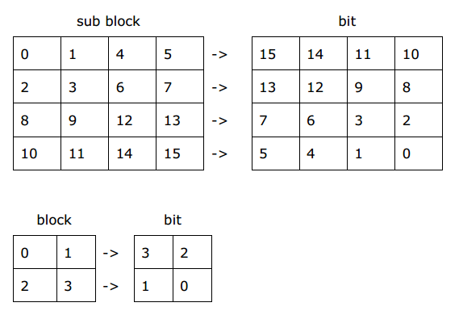
`QpPrimeY` | This value specifies quantization parameter for current MB.
`MbSkipConvDisable` | This flag disable conversion of the current MB to skip MB type.<br><br>0　　　　enable conversion to skip MB type<br>1　　　　disable conversion<br><br>If conversion is enabled, it occurs when CPB is equal to zero and for P MB motion vector of the MB is equal to the MV of the skip MB. CPB becomes zero when all coefficients are quantized to zero due to actual transform and quantization process or when application explicitly sets CBP to zero by using controls in this structure, **CbpY** and so on. For B MB skip conversion happens if MB type is B_8x8 and `Direct8x8Pattern` is set to 0xf value meaning that MVs match direct MVs.
`IsLastMB` | This flag indicates last MB in slice.<br><br>0　　　　there are more MBs in slice<br>1　　　　last MB in slice<br>
`EnableCoefficientClamp` | reserved and must be zero<br><br>This flag enables coefficients clamping after quantization. Internal clamp matrix is used.<br><br>0　　　　disable clamping<br>1　　　　enable clamping<br><br>
`Direct8x8Pattern` | This is four bits field. Each bit corresponds to the 8x8 block of the current MB. Each bit indicates that MVs and refIdx for current block are equal to the direct MVs defined by H264 spec.<br><br>0　　　　MV and RefIdx are not equal to the direct MV<br>1　　　　MV and RefIdx are equal to the direct MV<br><br>This field is used only for B_8x8 MB type. It signals that MVs and RefIdx for the block are exactly direct values. If all bits are set the MB is converted to B Direct or B skip. If only few of 4 bits are set, the corresponding subblocks are coded as direct. PAK does not verify if MV provided are equal to skipped.
`LumaIntraPredModes[4]` | These values specify luma intra prediction modes for current MB. Each element of the array corresponds to 8x8 block and each holds prediction modes for four 4x4 subblocks. Four bits per mode, lowest bits for left top subblock.<br><br>All 16 prediction modes are always specified. For 8x8 case, block prediction mode is duplicated to all subblocks of the 8x8 block. For 16x16 case - to all subblocks of the MB.<br><br>For example,<br><br>16x16 case<br>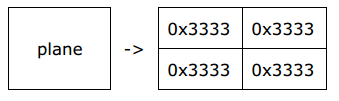<br><br><br><br><br><br><br>8x8 case<br>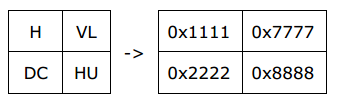
`ChromaIntraPredMode` | This value specifies chroma intra prediction mode.
`IntraPredAvailFlags` | This bit field shows availability of pixels in the neighbor MBs for intra prediction.<br><br>0　　　　samples are not available for prediction<br>1　　　　samples can be used for prediction<br><br>Table below shows mapping of bits to neighbor locations. Note that E and F locations are used only in MBAFF mode.<br><br><table> <tr><td> **bit** </td> <td> **neighbor** </td></tr> <tr><td> 0 </td> <td> D top left corner </td></tr>  <tr><td> 1 </td> <td> C top right </td></tr>  <tr><td> 2 </td> <td> B top </td></tr>  <tr><td> 3 </td> <td> E left, bottom half </td></tr>  <tr><td> 4 </td> <td> A left, top half </td></tr>  <tr><td> 5 </td> <td> F left, 8th row (-1,7) </td></tr> </table>
`SubMbShapes` | This field specifies subblock shapes for the current MB. Each block is described by 2 bits starting from lower bits for block 0.<br><br>0　　　　8x8<br>1　　　　8x4<br>2　　　　4x8<br>3　　　　4x4<br>
`SubMbPredModes` | This field specifies prediction modes for the current MB partition blocks. Each block is described by 2 bits starting from lower bits for block 0.<br><br>0　　　　Pred_L0<br>1　　　　Pred_L1<br>2　　　　BiPred<br>3　　　　reserved<br><br>Only one prediction value for partition is reported, the rest values are set to zero. For example:<br><br><table> <tr><td> 16x16 Pred_L1 </td> <td> 0x01<br>only 2 lower bits are used </td></tr> <tr><td> 16x8 Pred_L1 / BiPred </td> <td> 0x09 (1001b) </td></tr> <tr><td> 8x16 BiPred / BiPred </td> <td> 0x0a (1010b) </td></tr> </table><br>It is used by PAK only for BP_8x8 MB and ignored for other partitions. For P MBs this value is always zero.
`RefIdx` | This array specifies reference picture indexes for each of the blocks in the current MB. First index is 0 for L0 reference list and 1 for L1 reference list, second is 8x8 block number.<br><br>Unused reference indexes in B slices must be set to 0xff value, and all L1 indexes for P slices must be set to 0.
`TargetSizeInWord` | reserved and must be zero<br><br>See [mfxExtFeiEncMBCtrl](#mfxExtFeiEncMBCtrl) for description of this field.
`MaxSizeInWord` | reserved and must be zero<br><br>See [mfxExtFeiEncMBCtrl](#mfxExtFeiEncMBCtrl) for description of this field.

**Change History**

This structure is available since SDK API 1.9.

## <a id='mfxExtFeiSPS'>mfxExtFeiSPS</a>

*Deprecated in 1.35 and removed starting from 2.0*

**Definition**

```C
typedef struct {
    mfxExtBuffer    Header;

    mfxU16    SPSId;

    mfxU16    PicOrderCntType;
    mfxU16    Log2MaxPicOrderCntLsb;
    mfxU16    reserved[121];
} mfxExtFeiSPS;
```

**Description**

This extension buffer represents sequence parameter set (SPS). It is used by **ENC** and **PAK** classes of functions. The only possible usage is on Init Stage or during Reset.

See the ISO*/IEC* 14496-10 specification for more information on SPS parameters semantic.

**Members**

| | |
--- | ---
`Header.BufferId` | Buffer ID, must be **MFX_EXTBUFF_FEI_SPS**.
`SPSId` | This ID uniquely represents this parameter set, and is used by PPS to refer to this SPS. Valid range is [0,31].
`PicOrderCntType` | This parameter specifies type of picture order count. Valid range is [0,2].
`Log2MaxPicOrderCntLsb` | This parameter is used for picture order count processing. Valid range is [4,16]. See spec for more details.

**Change History**

This structure is available since SDK API 1.9.

## <a id='mfxExtFeiPPS'>mfxExtFeiPPS</a>

*Deprecated in 1.35 and removed starting from 2.0*

**Definition**

```C
typedef struct {
    mfxExtBuffer    Header;

    mfxU16    SPSId;
    mfxU16    PPSId;

    mfxU16    PictureType;
    mfxU16    FrameType;
    mfxU16    PicInitQP;
    mfxU16    NumRefIdxL0Active;
    mfxU16    NumRefIdxL1Active;
    mfxI16    ChromaQPIndexOffset;
    mfxI16    SecondChromaQPIndexOffset;
    mfxU16    Transform8x8ModeFlag;
    mfxU16    reserved[114];

    struct mfxExtFeiPpsDPB {
        mfxU16 Index;
        mfxU16 PicType;
        mfxI32 FrameNumWrap;
        mfxU16 LongTermFrameIdx;
        mfxU16 reserved[3];
} DpbBefore[16], DpbAfter[16];
} mfxExtFeiPPS;
```

**Description**

This extension buffer represents picture parameter set (PPS). It is used by **ENC** and **PAK** classes of function.

This buffer is the only way to control IDR interval (by default each I-frame is IDR), and to mark B-frames as reference frames for B-pyramid (by default B-frames are non-reference).

See the ISO*/IEC* 14496-10 specification for more information on PPS parameters semantic.

**Members**

| | |
--- | ---
`Header.BufferId` | Buffer ID, must be **MFX_EXTBUFF_FEI_PPS**.
`SPSId` | This value specifies active SPS ID. Valid range is [0,31].
`PPSId` | This ID uniquely represents this parameter set, and is used by slice header to refer to this PPS. Valid range is [0,255].
`PictureType` | Picture type. It should be one of the following values:<br><br>**MFX_PICTYPE_FRAME** – progressive frame,<br> **MFX_PICTYPE_TOPFIELD** – top field,<br> **MFX_PICTYPE_BOTTOMFIELD** – bottom field.
`FrameType` | One of the MFX_FRAMETYPE_xxx values, including reference and IDR flags.
`PicInitQP` | Initial value for quantization parameter. It may/will be later modified by slice header.
`NumRefIdxL0Active NumRefIdxL1Active` | These values specify number of active reference frames in L0 and L1 reference lists (if both SliceHeader and PPS are provided and these fields are different, SliceHeader has priority).
`ChromaQPIndexOffset SecondChromaQPIndexOffset` | These values specify offsets that are used during calculation of quantization parameter for chroma components.
`Transform8x8ModeFlag` | This flag enables usage of 8x8 transform during encoding. If it is equal to 1, then 8x8 transform may be used during encoding, if it is equal to 0, then only 4x4 transform is used.
`DpbBefore[16] DpbAfter[16]` | DPB state before/after encoding current frame/field.
`Index` | Index to active references in the mfxPAKInput::L0Surface array (only this array used to store pointers to actual surfaces). Value 0xffff indicates unused slot. All valid entries should precede unused slots.
`PicType` | Picture type. It should be one of the following values:<br><br>**MFX_PICTYPE_FRAME** – progressive frame, <br>**MFX_PICTYPE_TOPFIELD** - top field,<br> **MFX_PICTYPE_BOTTOMFIELD** – bottom field.
`FrameNumWrap` | Identifier for pictures. See sub-clauses 8.2.4.1 of the ISO*/IEC* 14496-10 specification for the definition of this syntax element.
`LongTermFrameIdx` | Index that used to mark long-term reference frame. Value 0xffff indicates short-term frame. This field is unsupported yet in SDK API 1.23.


**Change History**

This structure is available since SDK API 1.9.

The SDK API 1.23 adds `FrameType`,`DpbBefore`,`DpbAfter` fields and removes `ReferenceFrames` field.

## <a id='mfxExtFeiSliceHeader'>mfxExtFeiSliceHeader</a>

*Deprecated in 1.35 and removed starting from 2.0*

**Definition**

```C
typedef struct {
    mfxExtBuffer    Header;

    mfxU16    NumSlice; /* actual number of slices in the picture */
    mfxU16    reserved[11];

    struct mfxSlice{
        mfxU16    MBAddress;
        mfxU16    NumMBs;
        mfxU16    SliceType;
        mfxU16    PPSId;
        mfxU16    IdrPicId;

        mfxU16    CabacInitIdc;

        mfxU16    NumRefIdxL0Active;
        mfxU16    NumRefIdxL1Active;

        mfxI16    SliceQPDelta;
        mfxU16    DisableDeblockingFilterIdc;
        mfxI16    SliceAlphaC0OffsetDiv2;
        mfxI16    SliceBetaOffsetDiv2;
        mfxU16    reserved[20];

        struct {
            mfxU16   PictureType;
            mfxU16   Index;
            mfxU16   reserved[2];
        } RefL0[32], RefL1[32]; /* index in mfxPAKInput::L0Surface array */

    } *Slice;
}mfxExtFeiSliceHeader;

```

**Description**

This extension buffer represents slice parameters. It is used by **ENC** and **PAK** classes of functions to configure slice parameters.

This buffer can also be used with **ENCODE** class of functions for deblocking parameter configuration. In this use case only **DisableDeblockingFilterIdc**, **SliceAlphaC0OffsetDiv2** and **SliceBetaOffsetDiv2** values are used, the rest are ignored.

If this buffer is attached during initialization to **mfxVideoParam** structure then stream level parameters are set and all slices in the stream will have specified values. If this buffer is attached to the **mfxEncodeCtrl** structure during runtime, then slices in the correspondent frame will have specified values. Number of slices in this buffer should be equal to the number of slices specified during encoder initialization. If both initialization time and runtime parameters are specified, runtime parameters are used.

See the ISO*/IEC* 14496-10 specification for more information on slice parameters semantic.

**Members**

| | |
--- | ---
`Header.BufferId` | Buffer ID, must be **MFX_EXTBUFF_FEI_SLICE**.
`NumSlice` | Actual number of slices.
`MBAddress` | Address of the first MB in the slice.
`NumMBs` | Number of MBs in current slice.
`SliceType` | This parameter specifies slice type. Valid values are:<br><br>0, 5  P slice<br>1, 6  B slice<br>2, 7  I slice<br><br>
`PPSId` | This value specifies active PPS ID.
`IdrPicId` | This values specifies IDR picture ID.
`CabacInitIdc` | This values specifies initialization parameters for CABAC contexts. Valid range is [0,2].
`NumRefIdxL0Active`<br>`NumRefIdxL1Active` | These values specify number of active reference frames in L0 and L1 reference lists (if both SliceHeader and PPS are provided and these fields are different, SliceHeader has priority).
`SliceQPDelta` | Initial value for quantization parameter. It may/will be later modified on MB layer.
`DisableDeblockingFilterIdc` | This value controls deblocking filtering during encoding process. Valid range is [0,2].
`SliceAlphaC0OffsetDiv2`<br>`SliceBetaOffsetDiv2` | These values control strength of deblocking filtering during encoding process. Valid range [-6,6].
`RefL0`<br>`RefL1` | L0 and L1 reference lists for current slice
`PictureType` | Reference picture type. It should be one of the following values:<br><br>**MFX_PICTYPE_FRAME** – progressive frame,<br>**MFX_PICTYPE_TOPFIELD** - top field,<br>**MFX_PICTYPE_BOTTOMFIELD** – bottom field.
`Index` | Index of the reference frame in the **mfxPAKInput::L0Surface** array (only this array used to store pointers to actual surfaces). Value 0xffff indicates unused reference. All valid entries should precede unused references.

**Change History**

This structure is available since SDK API 1.9.

## mfxExtFeiParam

*Deprecated in 1.35 and removed starting from 2.0*

**Definition**

```C
typedef struct {
    mfxExtBuffer    Header;
    mfxFeiFunction  Func;
    mfxU16  SingleFieldProcessing;
    mfxU16 reserved[57];
} mfxExtFeiParam;
```

**Description**

This extension buffer specifies usage model for **ENCODE**, **ENC** and **PAK** classes of functions. It should be attached to the **mfxVideoParam** structure during initialization.

**Members**

| | |
--- | ---
`Header.BufferId` | Buffer ID, must be **MFX_EXTBUFF_FEI_PARAM**.
`Func` | One of the FEI usage models. See [mfxFeiFunction](#mfxFeiFunction) for more details.
`SingleFieldProcessing` | This flag indicates single field processing mode. If it is set to **MFX_CODINGOPTION_ON**, SDK processes fields one by one, one field in one function call. If it is set to **MFX_CODINGOPTION_OFF**, then both fields are processed in one function call. This is default mode equal to the general SDK encoder.

**Change History**

This structure is available since SDK API 1.9.

## <a id='mfxENCInput'>mfxENCInput</a>

**Definition**

```C
typedef struct mfxENCInput mfxENCInput;

struct mfxENCInput{
    mfxU32  reserved[32];

    mfxFrameSurface1 *InSurface;

    mfxU16  NumFrameL0;
    mfxFrameSurface1 **L0Surface;
    mfxU16  NumFrameL1;
    mfxFrameSurface1 **L1Surface;

    mfxU16  NumExtParam;
    mfxExtBuffer    **ExtParam;
};
```

**Description**

This structure specifies input parameters for [MFXVideoENC_ProcessFrameAsync](#MFXVideoENC_ProcessFrameAsync) function.

**Members**

| | |
--- | ---
`InSurface` | Input frame.
`NumFrameL0`<br>`NumFrameL1` | Number of reference frames in L0 and L1 lists. For ENC + PAK use case only L0 value is used and stores total number of reference. For PreENC these fields indicates if there any forward/backward reference present for current frame (for interlaced case it indicates that at least one field has such reference).
`L0Surface`<br>`L1Surface` | L0 stores all the surfaces required for current frame encoding for ENC + PAK use case, L1 is ignored. PreENC stores its references in mfxExtFeiPreEncCtrl and do not use this fields.
`NumExtParam` | Number of extension buffers attached to this structure.
`ExtParam` | List of extension buffers attached to this structure. See “PreENC” and “ENC” chapters for the list of supported extension buffers.

**Change History**

This structure is available since SDK API 1.9.

## <a id='mfxENCOutput'>mfxENCOutput</a>

**Definition**

```C
typedef struct mfxENCOutput mfxENCOutput;

struct mfxENCOutput{
    mfxU32  reserved[32];

    mfxFrameSurface1 *OutSurface;

    mfxU16  NumExtParam;
    mfxExtBuffer    **ExtParam;
} ;
```

**Description**

This structure specifies output parameters for [MFXVideoENC_ProcessFrameAsync](#MFXVideoENC_ProcessFrameAsync) function.

**Members**

| | |
--- | ---
`OutSurface` | Reconstructed surface.
`NumExtParam` | Number of extension buffers attached to this structure.
`ExtParam` | List of extension buffers attached to this structure. See “PreENC” and “ENC” chapters for the list of supported extension buffers.

**Change History**

This structure is available since SDK API 1.9.

## <a id='mfxPAKInput'>mfxPAKInput</a>

**Definition**

```C
typedef struct {
    mfxU32  reserved[32];

    mfxFrameSurface1 *InSurface;

    mfxU16  NumFrameL0;
    mfxFrameSurface1 **L0Surface;
    mfxU16  NumFrameL1;
    mfxFrameSurface1 **L1Surface;

    mfxU16  NumExtParam;
    mfxExtBuffer    **ExtParam;

    mfxU16  NumPayload;
    mfxPayload      **Payload;
} mfxPAKInput;
```

**Description**

This structure specifies input parameters for [MFXVideoENC_ProcessFrameAsync](#MFXVideoENC_ProcessFrameAsync) function.

**Members**

| | |
--- | ---
`InSurface` | Input frame.
`NumFrameL0`<br>`NumFrameL1` | Only L0 value is used and stores total number of reference.
`L0Surface`<br>`L1Surface` | L0 stores all the surfaces required for current frame.
`NumExtParam` | Number of extension buffers attached to this structure.
`ExtParam` | List of extension buffers attached to this structure. See “PAK” chapters for the list of supported extension buffers.
`NumPayload` | Number of payload records to insert into the bitstream.
`Payload` | Pointer to SEI messages (H.264) for insertion into the bitstream; See “PAK” chapters for the list of supported payload types.

**Change History**

This structure is available since SDK API 1.9.
SDK API 1.23 adds `NumPayload` and `Payload` fields.

## <a id='mfxPAKOutput'>mfxPAKOutput</a>

**Definition**

```C
typedef struct {
    mfxU16  reserved[32];
    mfxBitstream *Bs;

    mfxFrameSurface1 *OutSurface;

    mfxU16  NumExtParam;
    mfxExtBuffer    **ExtParam;
} mfxPAKOutput;
```

**Description**

This structure specifies output parameters for [MFXVideoPAK_ProcessFrameAsync](#MFXVideoPAK_ProcessFrameAsync) function.

**Members**

| | |
--- | ---
`Bs` | Encoded bitstream.
`OutSurface` | Reconstructed surface. It should be provided by the application and **PAK** will use it to store reconstructed frame if necessary.
`NumExtParam` | Number of extension buffers attached to this structure.
`ExtParam` | List of extension buffers attached to this structure. See “PAK” chapters for the list of supported extension buffers.

**Change History**

This structure is available since SDK API 1.9.

## mfxExtFeiRepackCtrl

**Definition**

```C
typedef struct {
    mfxExtBuffer    Header;
    mfxU32      MaxFrameSize;
    mfxU32      NumPasses;
    mfxU16      reserved[8];
    mfxU8       DeltaQP[8];
} mfxExtFeiRepackCtrl;
```

**Description**

This extension buffer specifies repack control parameters for ENCODE usage model. It is used during runtime and should be attached to the **mfxEncodeCtrl** structure.

**Members**

| | |
--- | ---
`Header.BufferId` | Buffer ID, must be **MFX_EXTBUFF_FEI_REPACK_CTRL**.
`MaxFrameSize` | Maximum frame or field size in bytes. If encoded picture size is greater than this value, then QP is increased by specified amount and picture repacked with higher QP.<br><br>Valid range is (0, 64M). If input value is zero, then whole extension buffer is ignored; if input value is equal to or bigger than 64M bytes, it is truncated.<br><br>For input values in (0, 512K) bytes, the granularity is 128 bytes; for input values in [512K, 64M), the granularity is 16K bytes. Value that is not integral multiple of the granularity is rounded.
`NumPasses` | Number of repack attempts. Zero value is not allowed. It should be equal to the number of QP deltas specified in **DeltaQP** array.<br><br>Actual number of packing can vary from 1, first attempt produced picture size lower than threshold, to **NumPasses + 1**. One original attempt plus **NumPasses** attempts with higher QPs.
`DeltaQP` | QP increment for each pass. First pass uses QP specified by **mfxInfoMFX** structure. Second **OriginalQP + DeltaQP[0]**, third **OriginalQP + DeltaQP[0] + DeltaQP[1]** and so on.<br><br>Maximum number of QP deltas is 4.<br><br>It is application responsibility to guard against QP overflow.

**Change History**

This structure is available since SDK API 1.19.

## mfxExtFeiRepackStat

**Definition**

```
typedef struct {
    mfxExtBuffer    Header;
    mfxU32          NumPasses;
    mfxU16          reserved[58];
} mfxExtFeiRepackStat;
```

**Description**

This extension buffer holds output number of actual repack passes for ENCODE usage model. It is used during runtime and should be attached to the **mfxBitstream** structure.

**Members**

| | |
--- | ---
`Header.BufferId` | Buffer ID, must be **MFX_EXTBUFF_FEI_REPACK_STAT**.
`NumPasses` | Number of pass(es) of the repack process that has (have) been actually conducted for ENCODE usage model for each frame or field. One instance of this extension buffer needs to be attached for progressive while two for interlaced, which shall be attached in encoded order.

**Change History**

This structure is available since SDK API 1.25.

## mfxExtFeiDecStreamOut

**Definition**

```C
typedef struct {
    /* dword 0 */
    mfxU32    InterMbMode         : 2;
    mfxU32    MBSkipFlag          : 1;
    mfxU32    Reserved00          : 1;
    mfxU32    IntraMbMode         : 2;
    mfxU32    Reserved01          : 1;
    mfxU32    FieldMbPolarityFlag : 1;
    mfxU32    MbType              : 5;
    mfxU32    IntraMbFlag         : 1;
    mfxU32    FieldMbFlag         : 1;
    mfxU32    Transform8x8Flag    : 1;
    mfxU32    Reserved02          : 1;
    mfxU32    DcBlockCodedCrFlag  : 1;
    mfxU32    DcBlockCodedCbFlag  : 1;
    mfxU32    DcBlockCodedYFlag   : 1;
    mfxU32    Reserved03          :12;

    /* dword 1 */
    mfxU16     HorzOrigin;
    mfxU16     VertOrigin;

    /* dword 2 */
    mfxU32    CbpY                :16;
    mfxU32    CbpCb               : 4;
    mfxU32    CbpCr               : 4;
    mfxU32    Reserved20          : 6;
    mfxU32    IsLastMB            : 1;
    mfxU32    ConcealMB           : 1;

    /* dword 3 */
    mfxU32    QpPrimeY            : 7;
    mfxU32    Reserved30          : 1;
    mfxU32    Reserved31          : 8;
    mfxU32    NzCoeffCount        : 9;
    mfxU32    Reserved32          : 3;
    mfxU32    Direct8x8Pattern    : 4;

    /* dword 4-6 */
    union {
        struct {/* Intra MBs */
            /* dword 4-5 */
            mfxU16   LumaIntraPredModes[4];

            /* dword 6 */
            mfxU32   ChromaIntraPredMode : 2;
            mfxU32   IntraPredAvailFlags : 6;
            mfxU32   Reserved60          : 24;
        } IntraMB;

        struct {/* Inter MBs */
            /* dword 4 */
            mfxU8    SubMbShapes;
            mfxU8    SubMbPredModes;
            mfxU16   Reserved40;

            /* dword 5-6 */
            mfxU8    RefIdx[2][4];
        } InterMB;
    };

    /* dword 7 */
    mfxU32     Reserved70;

    /* dword 8-15 */
    mfxI16Pair MV[4][2];
}mfxFeiDecStreamOutMBCtrl;

typedef struct {
    mfxExtBuffer    Header;
    mfxU16  reserved1[3];
    mfxU32  NumMBAlloc;
    mfxU16  RemapRefIdx;
    mfxU16  PicStruct;
    mfxU16  reserved2[18];

    mfxFeiDecStreamOutMBCtrl *MB;
} mfxExtFeiDecStreamOut;
```

**Description**

This extension buffer specifies output MB level parameters for **DECODE** class of functions. It holds data for complete frame of pair of fields. That is different from other extension buffers that are used in FEI, they usually holds data for single field. That is done to simplify memory management for this buffer, because at the time it is sent to decoder actual picture structure is not known.

This buffer should be attached to the **mfxFrameSurface1::mfxFrameData** during runtime.

**Members**

| | |
--- | ---
`Header.BufferId` | Buffer ID, must be **MFX_EXTBUFF_FEI_DEC_STREAM_OUT**.
`NumMBAlloc` | Number of allocated **mfxFeiDecStreamOutMBCtrl** structures in the **MB** array. It should be greater or equal to the number of MBs in the processed frame or pair of fields.
`RemapRefIdx` | If this value is equal to zero, then SDK returns **mfxFeiDecStreamOutMBCtrl::RefIdx[2][4]** array in the internal HW format. Otherwise, SDK converts it to the format defined by ISO*/IEC* 14496-10.
`PicStruct` | Decoded picture structure. One of the next values **MFX_PICTYPE_FRAME** or  **MFX_PICTYPE_TOPFIELD** or **MFX_PICTYPE_BOTTOMFIELD**.
`MB` | Array of MB level parameters. For interlaced content both fields are stored in the same buffer, firstly top field MBs then bottom field MBs.
`InterMbMode` | This field specifies inter macroblock mode. It is derived from **MbType** and has next values:<br><br>0　　　　16x16 mode<br>1　　　　16x8 mode<br>2　　　　8x16 mode<br>3　　　　8x8 mode<br><br>
`MBSkipFlag` | If set to 1, this flag specifies that all sub-blocks use predicted MVs, and no MVs are sent explicitly. This flag can be set only for inter MBs. For intra MBs it must be zero.
`IntraMbMode` | This field specifies intra macroblock mode and is ignored for inter MB. It is derived from **MbType** and has next values:<br><br>0　　　　16x16 mode<br>1　　　　8x8 mode<br>2　　　　4x4 mode<br>3　　　　PCM<br>
`FieldMbPolarityFlag` | This parameter indicates field polarity of the current MB.<br><br>0　　　　top field<br>1　　　　bottom field<br><br>For progressive picture this value must be zero.
`MbType` | Together with **IntraMbFlag** this parameter specifies MB type according to the ISO*/IEC* 14496-10. **IntraMbFlag** is used instead of intra offset for intra MB types in inter slices.
`IntraMbFlag` | This flag specifies intra/inter MB type and has next values:<br><br>0　　　　inter MB<br>1　　　　intra MB<br>
`FieldMbFlag` | This flag specifies MB coding type – interlaced or progressive.<br><br>0　　　　frame MB<br>1　　　　field MB<br><br>
`Transform8x8Flag` | This flag indicates transform size for the current MB. 8x8 must be set for intra 8x8 MB and may be set for inter that has no partition smaller than 8x8.<br><br>0: 4x4 integer transform<br>1: 8x8 integer transform<br>
`DcBlockCodedCrFlag DcBlockCodedCbFlag DcBlockCodedYFlag` | These flags specify whether correspondent DC coefficients are sent. Flag can be set to 1 even if all coefficients are zero.<br><br>0　　　　no DC coefficients are present<br>1　　　　DC coefficients are sent<br>
`HorzOrigin VertOrigin` | Horizontal and vertical address of the current MB in units of MBs.
`CbpY CbpCb CbpCr` | These values hold coding block patterns for luma and chroma components. Each bit corresponds to single block or subblock. Zero value means that correspondent block/subblock coefficients are not coded. One means that correspondent coefficients are coded. The behavior is similar to **DcBlockCodedY/Cb/CrFlag** described above.<br><br>Depending on the transform size, 4 lower bits or all 16 bits are used for luma CBP. Chroma CBP always uses 4 lower bits (422 and 444 color formats are not supported).<br><br>Tables below illustrate mapping of subblock/block number to the bit number for both cases:<br>
`IsLastMB` | This flag indicates last MB in slice.<br><br>0　　　　there are more MBs in　slice<br>1　　　　last MB in slice<br><br>
`ConcealMB` | This field specifies whether the current MB is a conceal MB. Conceal MB are inserted where input bitstream has errors.
`QpPrimeY` | This value specifies quantization parameter for current MB.
`NzCoeffCount` | Count of coded coefficients, including AC/DC blocks in current MB.
`Direct8x8Pattern` | This is four bits field which is used for B Direct and B skip MB types. Each bit corresponds to the 8x8 block of the current MB. Each bit indicates that MV for current block is equal to the predicted MV defined by H264 spec.<br><br>0　　　　Corresponding MVs are present<br>1　　　　Corresponding MVs are not present<br><br>This field is currently not applicable and should be equal to zero.
`LumaIntraPredModes[4]` | These values specify luma intra prediction modes for current MB. Each element of the array corresponds to 8x8 block and each holds prediction modes for four 4x4 subblocks. Four bits per mode, lowest bits for left top subblock.<br><br>All 16 prediction modes are always specified. For 8x8 case, block prediction mode is populated to all subblocks of the 8x8 block. For 16x16 case - to all subblocks of the MB.<br><br>For example,<br>16x16 case<br><br><br><br><br><br><br><br>8x8 case<br>
`ChromaIntraPredMode` | This value specifies chroma intra prediction mode.
`IntraPredAvailFlags` | This bit field shows availability of pixels in the neighbor MBs for intra prediction.<br><br>0　　　　samples are not available for prediction<br>1　　　　samples can be used for prediction<br><br>Table below shows mapping of bits to neighbor locations. Note that E and F locations are used only in MBAFF mode.<br><br><table> <tr><td> **bit** </td> <td> **neighbor** </td></tr> <tr><td> 0 </td> <td> D top left corner </td></tr>  <tr><td> 1 </td> <td> C top right </td></tr>  <tr><td> 2 </td> <td> B top </td></tr>  <tr><td> 3 </td> <td> E left, bottom half </td></tr>  <tr><td> 4 </td> <td> A left, top half </td></tr>  <tr><td> 5 </td> <td> F left, 8th row (-1,7) </td></tr> </table>
`SubMbShapes` | This field specifies subblock shapes for the current MB. Each block is described by 2 bits starting from lower bits for block 0.<br><br>0　　　　8x8<br>1　　　　8x4<br>2　　　　4x8<br>3　　　　4x4<br>
`SubMbPredModes` | This field specifies block prediction modes for the current MB. Each block is described by 2 bits starting from lower bits for block 0.<br><br>0　　　　Pred_L0<br>1　　　　Pred_L1<br>2　　　　BiPred<br>3　　　　reserved<br><br>Only one prediction value for partition is reported, the rest values are set to zero. For example:<br><br><table> <tr><td> 16x16 Pred_L1 </td> <td> 0x01<br>only 2 lower bits are used </td></tr> <tr><td> 16x8 Pred_L1 / BiPred </td> <td> 0x09 (1001b) </td></tr> <tr><td> 8x16 BiPred / BiPred </td> <td> 0x0a (1010b) </td></tr> </table>
`RefIdx` | In case `RemapRefIdx` is turned on, this array specifies reference picture indexes for each of the blocks in the current MB. First index is 0 for L0 reference list and 1 for L1 reference list, second is block number. Unused reference indexes should be set to 0xff value, for example, all L1 indexes for P frames.<br><br>When `RemapRefIdx` is turned off, the array contains reference picture indexes in the internal HW format.
`MV` | This array specifies motion vectors for each of the 8x8 blocks in the current MB. If 8x8 block is partitioned, MV from top-left 4x4 block is taken. First index is 8x8 block number, second is 0 for L0 reference list and 1 for L1 reference list.

**Change History**

This structure is available since SDK API 1.19.

<div style="page-break-before:always" />

# Enumerator Reference

## <a id='mfxFeiFunction'>mfxFeiFunction</a>

**Description**

The `mfxFeiFunction` enumerator specifies FEI usage models of **ENCODE**, **ENC** and **PAK** classes of functions.

**Name/Description**

| | |
--- | ---
`MFX_FEI_FUNCTIONPREENC` | PreENC usage models. It performs preliminary motion estimation and mode decision, as described in “[PreENC](#PreENC)” chapter.
`MFX_FEI_FUNCTIONENCODE` | ENOCDE usage model. It performs conventional encoding process with additional configuration parameters, as described in “[ENCODE](#ENCODE)” chapter.
`MFX_FEI_FUNCTION_ENC` | ENC usage model. It performs motion estimation and mode decision, as described in “[ENC followed by PAK](#ENC_followed_by_PAK)” chapter.
`MFX_FEI_FUNCTION_PAK` | PAK usage model. It performs packing of MB control data to the encoded bitstream, as described in “[ENC followed by PAK](#ENC_followed_by_PAK)” chapter.
`MFX_FEI_FUNCTION_DEC` | DSO usage model. It performs output of MB level parameters and MVs from source bitstream, as described in “[DSO followed by PAK](#DSO_followed_by_PAK)” chapter.

**Change History**

This enumerator is available since SDK API 1.9.
