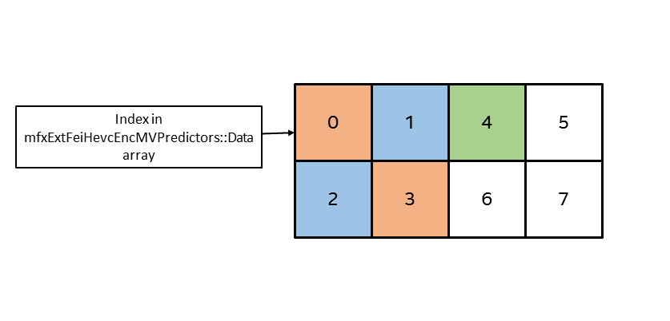

# **SDK Developer Reference for HEVC FEI**
## Media SDK API Version 1.30

<div style="page-break-before:always" />

[**LEGAL DISCLAIMER**](./header-template.md##legal-disclaimer)

[**Optimization Notice**](./header-template.md##optimization-notice)

<div style="page-break-before:always" />

- [Overview](#overview)
  * [Acronyms and Abbreviations](#acronyms-and-abbreviations)
- [Architecture](#architecture)
  * [Direct access to VA buffers](#direct-access-to-va-buffers)
- [Programming Guide](#programming-guide)
- [Structure Reference](#Structure_Reference)
  * [mfxExtFeiHevcEncFrameCtrl](#mfxExtFeiHevcEncFrameCtrl)
  * [mfxExtFeiHevcEncMVPredictors](#mfxExtFeiHevcEncMVPredictors)
  * [mfxExtFeiHevcEncQP](#mfxExtFeiHevcEncQP)
  * [mfxExtFeiHevcEncCtuCtrl](#mfxExtFeiHevcEncCtuCtrl)
  * [mfxExtFeiHevcRepackCtrl](#mfxExtFeiHevcRepackCtrl)
  * [mfxExtFeiHevcRepackStat](#mfxExtFeiHevcRepackStat)

# Overview

This document describes HEVC extension of the Flexible Encode Infrastructure (FEI). It is not a comprehensive manual, it describes only HEVC specific functionality of FEI, mostly data structures. For complete description of FEI, including architecture details and usage models please refer to the [*SDK API Reference Manual for Flexible Encode Infrastructure*](./mediasdkfei-man.md). Both these manuals assume that reader is familiar with Media SDK architecture described in the [*SDK API Reference Manual*](./mediasdk-man.md).

In this manual term "AVC FEI" is often used to distinguish general FEI extension described in above mentioned manual from "HEVC FEI" extension described in this document.


## Acronyms and Abbreviations

| | |
--- | ---
**FEI** | Flexible Encode Infrastructure
**PreENC** | Pre Encoding - preliminary stage of encoding process, usually used for content analysis.
**ENC** | ENCode - first stage of encoding process that includes motion estimation and mode decision.
**PAK** | PAcK - last stage of encoding process that includes bit packing.
**MVP** | Motion Vector Predictor.
**QP**  | Quantization Parameter.


<div style="page-break-before:always" />

# Architecture

HEVC FEI is built as extension of AVC FEI. It uses the same classes of functions **ENCODE**  and provides the same major usage model "PreENC followed by ENCODE", with AVC FEI PreENC. See *Architecture* chapter of the [*SDK API Reference Manual for Flexible Encode Infrastructure*](./mediasdkfei-man.md) for more details.

## Direct access to VA buffers

To improve performance, HEVC FEI eliminates additional data copy inside SDK library (see Figure 1) by allowing direct access to VA buffers, as illustrated in Figure 2.

###### Figure 1: mfxExtBuffer mapping to VA buffers


###### Figure 2: Direct access to VA buffers


The application manages extension buffer allocation through VA API for Linux\*. In order to do that, it is recommended to implement a buffer allocator and use it across the entire application.
The application must consider some driver requirements in the buffer allocator's implementation:
* VA context should be created with the same input parameters (picture width/height, RateControlMethod) as passed in Media SDK library.
* buffer allocation depends on HW layout implementation. See buffer structure description for more details.

Example 1 shows the pseudo code of the buffer allocator implementation and its usage.
<br>Note that only extension buffers with field `VaBufferID` support direct access to VA buffers. Others must be allocated in system memory.

###### Example 1: Buffer Allocator Pseudo Code
```C
#include <va/va.h>
#include "mfxfeihevc.h"

class mfxBufferAllocator
{

    CreateVAContext(mfxHDL VADisplay)
    {
        VAConfigAttrib attrib;
        attrib.type = VAConfigAttribRateControl;
        attrib.value = VA_RC_CQP;
        vaCreateConfig(VADisplay, VAProfileHEVCMain, VAEntrypointFEI, &attrib, 1, &VAConfigID);
        vaCreateContext(VADisplay, VAConfigID, picture_width, picture_height, VA_PROGRESSIVE, NULL, 0, &VAContextID);
    }

    Alloc(mfxExtBuffer buffer)
    {
        buffer.Pitch = buffer_pitch;
        buffer.Height = buffer_height;
        vaCreateBuffer(VADisplay, VAContextID, VABufferType, CalcVASize(buffer_pitch, buffer_height), CalcVANumElem(buffer_pitch, buffer_height), NULL, buffer.VaBufferID);        
        buffer.Data = NULL;
    }
    Free(mfxExtBuffer buffer)
    {
        vaDestroyBuffer(VADisplay, buffer.VaBufferID);
    }
    Lock(mfxExtBuffer buffer)
    {
        vaMapBuffer(VADisplay, buffer.VaBufferID, buffer.Data);
    }
    Unlock(mfxExtBuffer buffer)
    {
        vaUnmapBuffer(VADisplay, buffer.VaBufferID);
        buffer.Data = NULL;
    }
}

mfxBufferAllocator allocator(VADisplay);
mfxExtFeiHevcEncQP qp;
allocator.Alloc(qp, num_ctu);

for (;;)
{
    allocator.Lock(qp);
    FillInQpBuffer(qp);
    allocator.Unlock(qp);

    EncodeFrame(qp);
}
allocator.Free(qp);
```

Please refer to Appendix E in the [*SDK API Reference Manual*](./mediasdk-man.md) for more details about working directly with VA API.


<div style="page-break-before:always" />

# Programming Guide

To build HEVC FEI based application next header files should be included
- mfxenc.h - for PreENC and ENC functionality
- mfxfei.h - for basic FEI functionality and PreENC
- mfxhevcfei.h - for HEVC FEI extension
- mfxvideo.h - for the rest of Media SDK functionality

HEVC FEI does not extend PreENC functionality. Exactly the same functions and data structures should be used for HEVC pre-processing.

In most other use cases, command flow for HEVC FEI is the same as for AVC FEI. The same functions but different data structures should be used. See [Structure Reference](#Structure_Reference) below for description of new structures.

The SDK distinguishes between AVC and HEVC FEI by `CodecId` parameter in `mfxVideoParam` provided during initialization. The rest of initialization remains the same.


<div style="page-break-before:always" />

# <a id='Structure_Reference'>Structure Reference</a>

In the following structures all reserved fields must be zeroed by application if structure is used as input, and should not be modified if structure is passed between different SDK components.


## <a id='mfxExtFeiHevcEncFrameCtrl'>mfxExtFeiHevcEncFrameCtrl</a>

*Deprecated in 1.35 and removed starting from 2.0*

**Definition**

```
typedef struct {
    mfxExtBuffer    Header;

    mfxU16    SearchPath;
    mfxU16    LenSP;
    mfxU16    RefWidth;
    mfxU16    RefHeight;
    mfxU16    SearchWindow;

    mfxU16    NumMvPredictors[2];
    mfxU16    MultiPred[2];

    mfxU16    SubPelMode;
    mfxU16    AdaptiveSearch;
    mfxU16    MVPredictor;

    mfxU16    PerCuQp;
    mfxU16    PerCtuInput;
    mfxU16    ForceCtuSplit;
    mfxU16    NumFramePartitions;
    mfxU16    FastIntraMode;

    mfxU16    reserved0[107];
} mfxExtFeiHevcEncFrameCtrl;
```

**Description**

This extension buffer specifies frame level control for ENCODE. It is used during runtime and should be attached to the `mfxEncodeCtrl` structure for ENCODE usage model.

**Members**

| | |
--- | ---
`Header.BufferId` | Buffer ID, must be `MFX_EXTBUFF_HEVCFEI_ENC_CTRL`.
`SearchPath` | This value specifies search path.<br><br> 0x00 - default; <br> 0x01 - diamond search;<br> 0x02 - exhaustive, aka full search.
`LenSP` | This value defines number of search units in search path. If adaptive search is enabled it starts after this number has been reached. Valid range [1,63].
`RefWidth, RefHeight` | These values specify width and height of search region in pixels.<br><br>They should be multiple of 4. Valid range is [20, 64] for one direction and [20, 32] for bidirectional search. Note, that maximum allowed search area is 2048 for P-frames and 1024 for B-frames.
`SearchWindow` | This value specifies one of the predefined search path and window size.<br><br> 0x00 - not use predefined search window;<br> 0x01 - Tiny – 4 SUs 24x24 window diamond search;<br> 0x02 - Small – 9 SUs 28x28 window diamond search;<br> 0x03 - Diamond – 16 SUs 48x40 window diamond search;<br> 0x04 - Large Diamond – 32 SUs 48x40 window diamond search;<br> 0x05 - Exhaustive – 48 SUs 48x40 window full search.
`NumMvPredictors[2]` | Number of L0/L1 MV predictors provided by the application. Up to four predictors are supported.
`MultiPred[2]` | If this value is equal to zero, then no internal MV predictors will be used. Set it to 1 to enable additional (spatial) MV predictors from neighbor CUs. Note, that disabling internal MV predictors can severely degrade video quality.
`SubPelMode` | This value specifies sub pixel precision for motion estimation.<br><br> 0x00 - integer motion estimation<br> 0x01 - half-pixel motion estimation<br> 0x03 - quarter-pixel motion estimation<br>
`AdaptiveSearch` | If set, adaptive search is enabled.
`MVPredictor` | If this value is not equal to zero, then usage of MV predictors is enabled and the application should attach [mfxExtFeiHevcEncMVPredictors](#mfxExtFeiHevcEncMVPredictors) structure to the `mfxEncodeCtrl` structure at runtime. This value also specifies predictor block size: <br><br> 0x00 - MVPs are disabled; <br> 0x01 - MVPs are enabled for 16x16 block; <br> 0x02 - MVPs are enabled for 32x32 block; <br> 0x07 - MVPs are enabled, block size is defined by `BlockSize` variable in [mfxFeiHevcEncMVPredictors](#mfxExtFeiHevcEncMVPredictors) structure.
`PerCuQp` | If this value is not equal to zero, then CU level QPs are used during encoding and [mfxExtFeiHevcEncQP](#mfxExtFeiHevcEncQP) structure should be attached to the [mfxEncodeCtrl](#mfxEncodeCtrl) structure at runtime. The combination of [PerCUQp](#PerCUQp) enabled and [mfxExtFeiHevcRepackCtrl](#mfxExtFeiHevcRepackCtrl) or [mfxExtFeiHevcRepackStat](#mfxExtFeiHevcRepackStat) attached is not allowed.
`PerCtuInput` | If this value is not equal to zero, then CTU level control is enabled and [mfxExtFeiHevcEncCtuCtrl](#mfxExtFeiHevcEncCtuCtrl) structure should be attached to the `mfxEncodeCtrl` structure at runtime.
`ForceCtuSplit` | If this value is set to 1, then each Inter CTU in frame is split at least once in order to avoid 32x32 Inter PUs. Does not affect CUs of non-Inter modes. This is performance/quality trade-off flag, setting it improves performance but reduces quality. Valid values are {0, 1}.
`NumFramePartitions` | This value specifies number of partitions in frame that encoder processes concurrently. Valid numbers are {1, 2, 4, 8, 16}. This is performance/quality trade-off parameter. The smaller the number of partitions the better quality, the worse performance.
`FastIntraMode` | If this value is set to 1, then HEVC-specific Intra prediction modes are disabled and only AVC Intra modes are used. This is performance/quality trade-off flag, setting it improves performance but reduces quality. Valid values are {0, 1}.


**Change History**

This structure is available since SDK API 1.27


## <a id='mfxExtFeiHevcEncMVPredictors'>mfxExtFeiHevcEncMVPredictors</a>

*Deprecated in 1.35 and removed starting from 2.0*

**Definition**

```
typedef struct {
    struct {
        mfxU8   RefL0 : 4;
        mfxU8   RefL1 : 4;
    } RefIdx[4];

    mfxU32     BlockSize : 2;
    mfxU32     reserved0 : 30;

    mfxI16Pair MV[4][2];
} mfxFeiHevcEncMVPredictors;


typedef struct {
    mfxExtBuffer  Header;
    mfxU32        VaBufferID;
    mfxU32        Pitch;
    mfxU32        Height;
    mfxU16        reserved0[54];

    mfxFeiHevcEncMVPredictors *Data;
} mfxExtFeiHevcEncMVPredictors;
```

**Description**

This extension buffer specifies MV predictors for ENCODE. To enable usage of this buffer the application should set `MVPredictor` field in the [mfxExtFeiHevcEncFrameCtrl](#mfxExtFeiHevcEncFrameCtrl) structure to non-zero value.

This structure is used during runtime and should be attached to the `mfxEncodeCtrl` structure for ENCODE usage model.

This buffer has different layout from AVC. Each `mfxFeiHevcEncMVPredictors` element in Data array corresponds to 16x16 block of pixels from input frame. Four such elements are combined in group that corresponds to 32x32 block of pixels. Elements are located in zig-zag order inside group and groups are located in raster scan order inside buffer. Due to such layout input frame size should be aligned to 32 before calculation of buffer size. That means that buffer width in elements should be calculated as `((picture width + 31)/32)*2` and buffer height as `((picture height + 31)/32)*2`.

###### Working with MVP buffer
```C
mfxExtFeiHevcEncMVPredictors mvp_buffer;
mfxU32 Pitch  = sizeof(mvp_buffer.Data[0])
* (((picture_width + 31) / 32) * 2)
* (((picture_height + 31) / 32) * 2);
mfxU32 Height = 1;
vaCreateBuffer(display, context, type, Pitch, Height, NULL, &mvp_buffer.VaBufferID);
vaMapBuffer(display, mvp_buffer.VaBufferID, (void**)&mvp_buffer.Data);
//Fill MVP here
vaUnmapBuffer(display, mvp_buffer.VaBufferID);

```

Figure 3 shows example of buffer layout. Blue rectangle represents input frame. Each thin line rectangle represents one element corresponding to 16x16 block of pixels. Each thick rectangle represents group of four elements corresponding to 32x32 block of pixels. Number inside rectangle represent element layout inside MVP buffer. Zero element is located at the beginning of the buffer, it is followed by first, then second and so on elements.

MVP may be specified for 16x16 or 32x32 block of pixels, see description of `BlockSize` below. If MVP is specified for 16x16 block, then all four elements in group are used. For example, on Figure 3 element 0 is used for left top 16x16 block, element 2 for 16x16 block located just below first one in the frame and so on. If MVP is specified for 32x32 block then only first element from group is used, the rest are ignored. For example, on Figure 3 only 8-th element is used for 32x32 block of pixels that corresponds to 8, 9, 10 and 11 elements, three other elements 9, 10 and 11 are ignored.

###### Figure 3: MVP layout


To disable MVPs for some particular 16x16 block inside 32x32 group `BlockSize` should be set to 1 and reference indexes `RefL0, RefL1` values to 0xf. Possible case when there are some 16x16 blocks for which predictors are
need to be disabled while preserving MVP data for other blocks within 32x32 group illustrated on Figure 4:

###### Figure 4: How to skip MVPs for particular 16x16 block



On the figure 4 orange represent that MV predictors are disabled for this particular 16x16 block. Corresponding element in `mfxExtFeiHevcEncMVPredictors::Data` buffer `BlockSize` is set to 1, `RefL0, RefL1` are set to 0xf and all vectors in `MV` are set to (0x8000; 0x8000).

Blue represent that MV predictors are enabled for this particular 16x16 block. Corresponding element in the buffer has `BlockSize` set to 1 and other members set appropriately to provide actual MVP data.

Green represent that MV predictors are enabled for this whole 32x32 block group. MVP data provided in the buffer element corresponding to this 16x16 block is used within the group. This element `BlockSize` is set to 2.

White indicates that this 16x16 block uses values from left-upper block inside this 32x32 group. Values in the buffer element corresponding to this 16x16 block are ignored.

**Members**

| | |
--- | ---
`Header.BufferId` | Buffer ID, must be `MFX_EXTBUFF_HEVCFEI_ENC_MV_PRED`.
`VaBufferID` | VA buffer ID. It is used by buffer allocator and SDK encoder and should not be directly set or changed by application.
`Pitch`<br>`Height` | Pitch and height of `Data` buffer in elements. `Pitch` may be bigger than picture width divided by CTU size, and `Height` may be bigger than picture height divided by CTU size due to alignment requirements of underlying HW implementation. This value is set by buffer allocator and should not be directly set or changed by application.<br><br>To access an element located in specified row and column next code may be used: <br> `mfxFeiHevcEncMVPredictors *mvp = buf.Data + row * buf.Pitch + col;`
`Data` | Buffer that holds actual MV predictors.
`RefIdx[4]` | Array of reference indexes for each MV predictor. Index in the array is a predictor number.
`RefL0, RefL1` | L0 and L1 reference indexes. To skip external predictors for this block set it to 0xf.
`BlockSize` | Block size for which MV predictors are specified. <br><br> 0x0 - MVPs disabled for this 32x32 block<br> 0x1 - MVPs enabled per 16x16 block for this 32x32 block<br> 0x2 - MVPs enabled per 32x32 block, the rest of 16x16 block data within this 32x32 block is ignored <br><br>It is used only if `MVPredictor` variable in [mfxExtFeiHevcEncFrameCtrl](#mfxExtFeiHevcEncFrameCtrl) structure is set to 0x07.
`MV[4][2]` | Up to 4 MV predictors per 16x16 block. First index is predictor number, second is 0 for L0 reference and 1 for L1 reference. Each MVP component is given in quarter-pixel units.<br><br>Use 0x8000 value to indicate that application treats CUs related to this block as Intra and doesn't provide predictors.<br><br>Number of actual predictors is defined by `NumMVPredictors[2]` value in the [mfxExtFeiHevcEncFrameCtrl](#mfxExtFeiHevcEncFrameCtrl) structure. Unused MV predictors are ignored.

**Change History**

This structure is available since SDK API 1.27


## <a id='mfxExtFeiHevcEncQP'>mfxExtFeiHevcEncQP</a>

*Deprecated in 1.35 and removed starting from 2.0*

**Definition**

```
typedef struct {
    mfxExtBuffer  Header;
    mfxU32        VaBufferID;
    mfxU32        Pitch;
    mfxU32        Height;
    mfxU16        reserved[6];

    mfxU8    *Data;
} mfxExtFeiHevcEncQP;
```

**Description**

This extension buffer specifies per CTU QP values for ENCODE usage models. To enable its usage for ENCODE set `PerCuQp` value in the [mfxExtFeiHevcEncFrameCtrl](#mfxExtFeiHevcEncFrameCtrl) structure.

 mfxExtFeiHevcEncQP structure contains QP values for a stream. Each value in Data array corresponds to 32x32 block of pixels from an input frame. The width in elements (pitch) should be aligned to 64 and calculated as `((((picture width + 31) / 32) + 63) / 64)*64`, where `(picture width + 31 / 32)` is a number of 32x32 CTUs, `(+ 63) / 64) * 64)` is an alignment to 64. Height should be aligned to 4 and calculated as `((((picture height + 31) / 32) + 3) / 4) * 4`.

###### Working with QP buffer
```C
mfxExtFeiHevcEncQP qp_buffer;
mfxU32 Pitch   = ((((picture_width + 31) / 32) + 63) / 64) * 64;
mfxU32 Height  = ((((picture_height + 31) / 32) + 3) / 4) * 4;
vaCreateBuffer(display, context, type, Pitch, Height, NULL, &qp_buffer.VaBufferID);
vaMapBuffer(display, qp_buffer.VaBufferID, (void**)&qp_buffer.Data);
//Fill QP buffer with QP values in range [0,51]
vaUnmapBuffer(display, qp_buffer.VaBufferID);

```
Figure 5 shows an example of the buffer layout. A blue rectangle represents an input frame. Each black rectangle represents one element in Data array corresponding to 32x32 block of pixels.

###### Figure 5: QP layout


For example, let's take stream with `picture_width = 350` and `picture_height = 280`. Calculating pitch for this stream `((((350 + 31) / 32) + 63) / 64)*64 = 64` and height `((((280 + 31) / 32) + 3) / 4) * 4 = 12`, size of Data 64 x 12 = 768. Picture width in CTU `(350 + 31) / 32 = 11` and picture height in CTU `(280 + 31) / 32 = 9`. QP values located in buffer on positions 0, 1, 2 … 10 will be applicable, other values 11, 12, … 63  in a row are ignored. Next applicable values will be 64, 65, … , 74, the other values 75, 76, … ,127  in a row ignored, etc. This operation continues 9 rows, values in row 10, 11, 12 are ignored (elements on positions 576, 577, ... ,768 are ignores).

This structure is used during runtime and should be attached to the `mfxEncodeCtrl` structure for ENCODE usage model.

**Members**

| | |
--- | ---
`Header.BufferId` | Buffer ID, must be `MFX_EXTBUFF_HEVCFEI_ENC_QP`.
`VaBufferID` | VA buffer ID. It is used by buffer allocator and SDK encoder and should not be directly set or changed by application.
`Pitch`<br>`Height` | Pitch and height of `Data` buffer in elements. This value is set by buffer allocator and should not be directly set or changed by application.<br><br>To access an element located in specified row and column next code may be used: <br> `mfxU8 *qp = buf.Data + row * buf.Pitch + col;`
`Data` | Buffer that holds per CU QP values.

**Change History**

This structure is available since SDK API 1.27


## <a id='mfxExtFeiHevcEncCtuCtrl'>mfxExtFeiHevcEncCtuCtrl</a>

*Deprecated in 1.35 and removed starting from 2.0*

**Definition**

```
typedef struct {
    mfxU32    ForceToIntra : 1;
    mfxU32    ForceToInter : 1;
    mfxU32    reserved0    : 30;

    mfxU32    reserved1[3];
} mfxFeiHevcEncCtuCtrl;


typedef struct {
    mfxExtBuffer  Header;
    mfxU32        VaBufferID;
    mfxU32        Pitch;
    mfxU32        Height;
    mfxU16        reserved0[54];

    mfxFeiHevcEncCtuCtrl *Data;
} mfxExtFeiHevcEncCtuCtrl;
```

**Description**

This structure specifies CTU level control parameters for ENCODE. To enable its usage for ENCODE set `PerCtuInput` value in the [mfxExtFeiHevcEncFrameCtrl](#mfxExtFeiHevcEncFrameCtrl) structure.

This structure is used during runtime and should be attached to the `mfxEncodeCtrl` structure for ENCODE usage model.

**Members**

| | |
--- | ---
`Header.BufferId` | Buffer ID, must be 'MFX_EXTBUFF_HEVCFEI_ENC_CTU_CTRL'.
`VaBufferID` | VA buffer ID. It is used by buffer allocator and SDK encoder and should not be directly set or changed by application.
`Pitch`<br>`Height` | Pitch and height of `Data` buffer in elements. `Height` must be 1, while `Pitch` should be equal to the total number of CTUs in the frame. These values are set by buffer allocator and should not be directly set or changed by application.
`Data` | Buffer that holds per CTU control parameters. The `mfxFeiHevcEncCtuCtrl` elements inside the `Data` buffer are mapped to the CTUs inside the frame in the usual raster scan order, e.g. the CTU that is X-th from the left side of the frame and Y-th from the top side of the frame corresponds to the `Data[ (Y - 1) * frame_width_in_ctus + (X - 1) ]` element.
`ForceToIntra` <br>`ForceToInter` | If one of these values is set to 1, then the current CTU will be encoded accordingly, as Intra (each CU inside the CTU will be intra-coded) or Inter (each CU inside the CTU will be inter-coded as either "AMVP", "Merge" or "Skip"). If both values are set to 1, then the CTU will be encoded as Inter (see above).

**Change History**

This structure is available since SDK API 1.27


## <a id='mfxExtFeiHevcRepackCtrl'>mfxExtFeiHevcRepackCtrl</a>

*Deprecated in 1.35 and removed starting from 2.0*

**Definition**

```
typedef struct {
    mfxExtBuffer    Header;
    mfxU32      MaxFrameSize;
    mfxU32      NumPasses;
    mfxU16      reserved[8];
    mfxU8       DeltaQP[8];
} mfxExtFeiRepackCtrl;
```

**Description**

This extension buffer specifies repack control parameters for ENCODE usage model. It is used during runtime and should be attached to the **mfxEncodeCtrl** structure. The combination of [PerCUQp](#PerCUQp) in [mfxExtFeiHevcEncFrameCtrl](#mfxExtFeiHevcEncFrameCtrl) enabled and this one attached is not allowed.

**Members**

| | |
--- | ---
`Header.BufferId` | Buffer ID, must be **MFX_EXTBUFF_HEVCFEI_REPACK_CTRL**.
`MaxFrameSize` | Maximum frame size in bytes. If encoded picture size is greater than this value, then QP is increased by specified amount and picture repacked with higher QP.<br><br>If this value is zero, then whole extension buffer is ignored.
`NumPasses` | Number of repack attempts. Zero value is not allowed. It should be equal to the number of QP deltas specified in **DeltaQP** array.<br><br>Actual number of packing can vary from 1, in the case of first attempt producing picture size lower than threshold, to **NumPasses + 1**. One initial attempt plus **NumPasses** attempts with higher QPs.
`DeltaQP` | QP increment for each pass. First pass uses QP specified by **mfxInfoMFX** structure, then second pass uses **OriginalQP + DeltaQP[0]**, then **OriginalQP + DeltaQP[0] + DeltaQP[1]** for the third, and so on.<br><br>Maximum number of QP deltas is 8.<br><br>It is application responsibility to guard against QP overflow.

**Change History**

This structure is available since SDK API 1.27.


## <a id='mfxExtFeiHevcRepackStat'>mfxExtFeiHevcRepackStat</a>

*Deprecated in 1.35 and removed starting from 2.0*

**Definition**

```
typedef struct {
    mfxExtBuffer    Header;
    mfxU32          NumPasses;
    mfxU16          reserved[58];
} mfxExtFeiRepackStat;
```

**Description**

This extension buffer holds output number of actual repack passes for ENCODE usage model. It is used during runtime and should be attached to the **mfxBitstream** structure. The combination of [PerCUQp](#PerCUQp) in [mfxExtFeiHevcEncFrameCtrl](#mfxExtFeiHevcEncFrameCtrl) enabled and this one attached is not allowed.

**Members**

| | |
--- | ---
`Header.BufferId` | Buffer ID, must be **MFX_EXTBUFF_HEVCFEI_REPACK_STAT**.
`NumPasses` | Number of pass(es) of the packing process that has (have) been actually conducted for ENCODE usage model for each frame. It equals to 1 plus repack round number, whose range is [1, 9].

**Change History**

This structure is available since SDK API 1.27.
