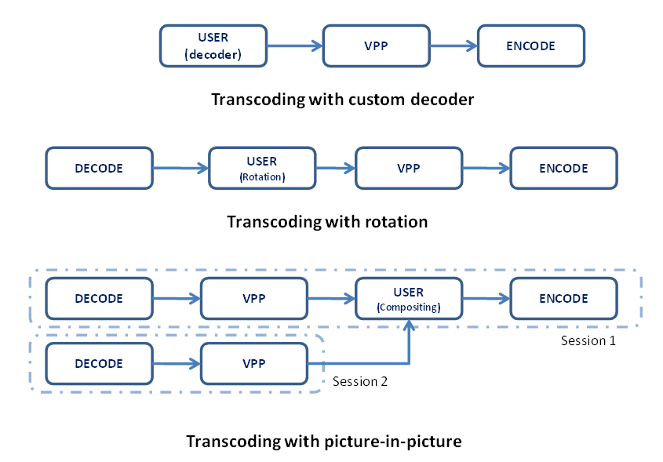

# **SDK Developer Reference Extensions for User-Defined Functions**
## Media SDK API Version 1.30

<div style="page-break-before:always" />

[**LEGAL DISCLAIMER**](./header-template.md#legal-disclaimer)

[**Optimization Notice**](./header-template.md#optimization-notice)

<div style="page-break-before:always" />

- [Overview](#overview)
  * [Document Conventions](#document-conventions)
  * [Acronyms and Abbreviations](#acronyms-and-abbreviations)
- [Architecture](#architecture)
  * [Using General Plug-in](#using-general-plug-in)
  * [Using Codec Plug-in](#using-codec-plug-in)
  * [Writing Plug-in](#writing-plug-in)
    + [Task Submission](#task-submission)
    + [Task Execution](#task_execution)
    + [Mandatory functions](#mandatory-functions)
  * [Working with Opaque Surfaces](#working-with-opaque-surfaces)
    + [Mapping and Un-mapping Opaque Surfaces](#mapping-and-un-mapping-opaque-surfaces)
    + [Accessing Opaque Surfaces](#accessing-opaque-surfaces)
  * [Plug-in Distribution](#plugin_distribution)
    + [Dynamic Link Library](#dynamic-link-library)
    + [Loading](#loading)
    + [System Wide Installation](#system-wide-installation)
    + [Application Folder Installation](#application-folder-installation)
- [Function Reference](#function-reference)
  * [MFXVideoUSER](#mfxvideouser)
    + [MFXVideoUSER_ProcessFrameAsync](#MFXVideoUSER_ProcessFrameAsync)
    + [MFXVideoUSER_Register](#MFXVideoUSER_Register)
    + [MFXVideoUSER_Unregister](#MFXVideoUSER_Unregister)
    + [MFXVideoUSER_Load](#MFXVideoUSER_Load)
    + [MFXVideoUSER_LoadByPath](#MFXVideoUSER_LoadByPath)
    + [MFXVideoUSER_UnLoad](#MFXVideoUSER_UnLoad)
    + [MFXVideoUSER_GetPlugin](#MFXVideoUSER_GetPlugin)
- [Structure Reference](#structure-reference)
  * [mfxCoreInterface](#mfxCoreInterface)
    + [CopyBuffer](#CopyBuffer)
    + [CopyFrame](#CopyFrame)
    + [DecreaseReference](#DecreaseReference)
    + [GetCoreParam](#GetCoreParam)
    + [GetHandle](#GetHandle)
    + [IncreaseReference](#IncreaseReference)
    + [MapOpaqueSurface](#MapOpaqueSurface)
    + [UnmapOpaqueSurface](#UnmapOpaqueSurface)
    + [GetRealSurface](#GetRealSurface)
    + [GetOpaqueSurface](#GetOpaqueSurface)
    + [GetFrameHandle](#GetFrameHandle)
    + [QueryPlatform](#QueryPlatform)
  * [mfxPlugin](#mfxPlugin)
    + [Execute](#Execute)
    + [FreeResources](#FreeResources)
    + [GetPluginParam](#GetPluginParam)
    + [PluginClose](#PluginClose)
    + [PluginInit](#PluginInit)
    + [Submit](#Submit)
  * [mfxVideoCodecPlugin](#mfxvideocodecplugin)
  * [mfxCoreParam](#mfxCoreParam)
  * [mfxPluginParam](#mfxPluginParam)
- [Enumerator Reference](#enumerator-reference)
  * [mfxThreadPolicy](#mfxThreadPolicy)
  * [mfxPluginType](#mfxPluginType)
  * [mfxStatus](#mfxStatus)

# Overview

Intel® Media Software Development Kit – SDK is a software development library that exposes the media acceleration capabilities of Intel platforms for decoding, encoding and video preprocessing. The API library covers a wide range of Intel platforms.

This document describes an API extension that allows user-defined functions into the transcoding pipeline. Please refer to the [*SDK API Reference Manual*](./mediasdk-man.md) for a complete description of the API.

## Document Conventions

The SDK API uses the Verdana typeface for normal prose. With the exception of section headings and the table of contents, all code-related items appear in the `Courier New` typeface (`mxfStatus` and `MFXInit)`. All class-related items appear in all cap boldface, such as **DECODE** and **ENCODE**. Member functions appear in initial cap boldface, such as **Init** and **Reset**, and are members of all three classes (**DECODE**, **ENCODE** and **VPP**).

## Acronyms and Abbreviations

| | |
--- | ---
**SDK** | Intel® Media Software Development Kit – SDK
**CORE** | SDK auxiliary functions for memory allocation and asynchronous operation synchronization
**DECODE** | SDK decoding functions
**ENCODE** | SDK encoding functions
**VPP** | SDK video preprocessing functions
**USER** | SDK user-defined functions

# Architecture

SDK provides the **USER** class of functions to allow user-defined functions, also known as plug-ins, to participate in transcoding operations. When combined with **DECODE**, **VPP** and **ENCODE**, **USER** provides additional functionality beyond what SDK defines. Figure 1 shows three usage examples. In the first example, the application uses custom decoder in the transcoding pipeline. In the second one, the application adds rotation into the pipeline. In the third example, the application opens two sessions to decode two video streams and then calls the **USER** class of functions to form a composite stream for encoding.

###### Figure 1: User-Defined Functions Examples



The SDK supports two kinds of plug-in. First one was introduced in version 1.1 of the SDK API. It was called general plug-in and it was intended for general kind of video processing. Although it can support decode and encode functionality its major goal was to support complex video processing filters. It has loosely defined interface and requires significant changes in application to implement.

Second kind of plug-ins has been added in version 1.8 of the SDK API. It is called codec plug-in and it is intended to completely replace one of the internal SDK components: decode, encode or VPP. Codec plug-in uses the same API functions as native SDK component and application can use the same code path for both native SDK component and codec plug-in. For example, to replace AVC decoder in the existent application by HEVC one, all that application developer has to do is to load plugin and to change codec ID during decoder initialization.

There are four different types of plugin. One for general plug-in and three for codec plug-ins:

- general – this is general type that can be used to implement any video processing functionality. It does not replace any SDK class of functions.
- decode – replaces the SDK **DECODE** class of functions,
- encode – replaces the SDK **ENCODE** class of functions,
- VPP – replaces the SDK **VPP** class of functions.

There are two different ways to insert plug-in into the SDK session. First one uses [MFXVideoUSER_Register](#MFXVideoUSER_Register) function and gives the application complete control over plugin code location. It can be in separate DLL or part of the application. All types of plug-ins can be loaded this way. Second one uses [MFXVideoUSER_Load](#MFXVideoUSER_Load) function and loads one of the preinstalled plug-ins directly from DLL. General types of plug-ins cannot be loaded by this method.

The SDK session can hold only one component of any given class of functions. Therefore, the application could not insert plug-in if the same component has been initialized, or plug-in with the same type has been inserted. For example, if application has initialized native SDK decoder, any attempts to insert decoder plugin in the SDK session fails. The application should use multiple session and session joining mechanism to deal with such pipelines.

The **USER** class of functions requires the application to use an additional include file, `mfxplugin.h`, besides the regular SDK include files. No additional library is required at link time.

```C
Include these files:
#include “mfxvideo.h”       /* SDK functions in C */
#include “mfxvideo++.h”     /* optional for C++ development */
#include “mfxplugin.h”      /* plugin development */
Link these libraries:
    libmfx.so              /* The SDK dispatcher library */

```

The following sections describe the **USER** class of functions including rules that application developers must follow when programming with **USER** functions.

## Using General Plug-in

Follow the procedure provided below to insert the general plug-in into the SDK pipeline.

- Create mfxPlugin structure with set of call back functions. Set pointer to mfxVideoCodecPlugin structure to zero.
- Initialize plug-in by registering a set of callback functions through the [MFXVideoUSER_Register](#MFXVideoUSER_Register) function. The SDK invokes these callback functions during **USER** operations.
- Once initialized, the application can use the function [MFXVideoUSER_ProcessFrameAsync](#MFXVideoUSER_ProcessFrameAsync) to process data. The function returns a sync point for result synchronization (as is done with **DECODE**, **VPP**, or
  **ENCODE**).
- Close **USER** by unregistering it via the [MFXVideoUSER_Unregister](#MFXVideoUSER_Unregister) function.

When comparing **USER** with **DECODE**, **VPP**, and **ENCODE,** notice that the **USER** class of functions does not support `Init`, `Close`, `Query`, `QueryIOSurf`, or `GetVideoParam`. This simplification is possible because SDK does not participate in any of these operations. If required, the application can define its own form of initialization, capability query, or status retrieval of the user-defined functions.

The function [MFXVideoUSER_ProcessFrameAsync](#MFXVideoUSER_ProcessFrameAsync) can take any number of inputs and generate any number of outputs. The interpretation of the I/O parameters is subject to the callback functions registered at the **USER** initialization stage. As per SDK convention on asynchronous operations, the application must consider the inputs “used” and the outputs unavailable until the application performs an explicit synchronization. However, the application can pass the output results to any downstream SDK component such as **VPP** and **ENCODE** *without* synchronization. See the Asynchronous Operation chapter in the [*SDK API Reference Manual*](./mediasdk-man.md) for more details on asynchronous operations.

Example 1 shows the pseudo code for transcoding with **USER** operations. The application passes data from **DECODE** to **VPP**, **VPP** to **USER** and **USER** to **ENCODE**. Finally, the application synchronizes the processing results and writes them to a file.

###### Example 1: Pseudo Code for transcoding with USER Operations


```C
MFXInit(MFX_IMPL_AUTO,0,&session);
MFXVideoUSER_Register(session,0,&my_user_module);

MFXVideoDECODE_Init(session, decoding_configuration);
MFXVideoVPP_Init(session, preprocessing_configuration);

/* Initialize my user module */
MFXVideoENCODE_Init(session, encoding_configuration);

do {
    /* load bitstream to bs_d */
    MFXVideoDECODE_DecodeFrameAsync(session, bs_d, surface_w, &surface_d, &sync_d);
    MFXVideoVPP_RunFrameVPPAsync(session, surface_d, surface_v, NULL, &sync_v);
    MFXVideoUSER_ProcessFrameAsync(session, &surface_v, 1, &surface_u, 1, &sync_u);
    MFXVideoENCODE_EncodeFrameAsync(session, NULL, surface_u, bs_e, &sync_e);
    MFXVideoCORE_SyncOperation(session, sync_e, INFINITE);
    /* write bs_e to file */
} while (!end_of_stream)

MFXVideoENCODE_Close(session);

/* Close my user module */
MFXVideoVPP_Close(session);
MFXVideoDECODE_Close(session);

MFXVideoUSER_Unregister(session);
MFXClose(session);
```

## Using Codec Plug-in

The codec plug-in is used to insert one of the custom codec in the SDK pipeline. Unlike the general type, the codec plug-in uses the same SDK functions for processing as native SDK encoder, decoder and VPP. Codec plugin defines Init, Close and most other API functions. Therefore, the application can use the same code path to work with native and custom decoder, encoder and VPP.

Follow one of the procedures provided below to insert the codec plug-in into the SDK pipeline.

Procedure A:

- Create mfxPlugin structure with set of callback functions including functions in the mfxVideoCodecPlugin structure. Depending on plug-in type set irrelevant function pointers to NULL.
- Initialize plug-in by registering a set of callback functions through the [MFXVideoUSER_Register](#MFXVideoUSER_Register) function.
- Once initialized, the application can use common **DECODE**, **VPP** and **ENCODE**  functions to process data.
- Close plug-in by unregistering it via the [MFXVideoUSER_Unregister](#MFXVideoUSER_Unregister) function.

Procedure B:

- Load plug-in by calling [MFXVideoUSER_Load](#MFXVideoUSER_Load) function.
- Use common **DECODE**, **VPP** and **ENCODE** functions to process data.
- Unload plug-in by calling MFXVideoUSER_UnLoad function.

## Writing Plug-in

This section describes internal design of the SDK plug-in interface. It is relevant to all four types of plug-in. Depending on plug-in type different functions correspond to name **Submit** and **Process**. See table below for mapping:

| **Plug-in Type** | **Process** | **Submit** |
| --- | --- | --- |
General | `MFXVideoUSER_ProcessFrameAsync`  | `Submit`
Decode  | `MFXVideoDECODE_DecodeFrameAsync` | `DecodeFrameSubmit`
Encode  | `MFXVideoENCODE_EncodeFrameAsync` | `EncodeFrameSubmit`
VPP     | `MFXVideoVPP_RunFrameVPPAsync`    | `VPPFrameSubmit`

### Task Submission

Internally, when the application calls the **Process** function, the SDK performs the following operations:

- Within the same thread, SDK calls back the function **Submit** to check the validity of the I/O parameters.
- If the function **Submit** returns an error code, SDK aborts the operation and returns the error code to the application.
- If the function **Submit** approves the I/O parameters, the function returns a task identifier to SDK. A task identifier is a unique user-defined parameter that identifies the work of processing the frames submitted by **Process** function. The SDK then schedules the task execution based on available resources. Next, the SDK returns a sync point back to the application for later  synchronization.

This discussion introduces two new concepts: task submission and task execution. Task submission checks the validity of the I/O parameters within the same application thread and submits a task identifier that is executed later by SDK. Task execution is the actual execution of the submitted task(s) within SDK internal threads.

Due to the asynchronous nature of the SDK API, the application must follow the guidelines below when accessing I/O parameters:

| **Data Type** | **During Task Submission (Submit)** | **During Task Execution (Execute)** |
| --- | --- | --- |
Frame data in system memory | The frame data is not ready. Do not read the frame data buffer. | SDK resolves the data dependency before running the task. The frame data is ready to access.
Frame data in video memory | The frame data is not ready. Do not lock the surface or access to the frame data. | SDK resolves the data dependency before running the task. The frame data is ready to access.
Bitstream data for decoder | The bitstream data is ready. It is safe to read data from buffer and move data pointer. | The bitstream buffer has been reused by application. Do not access it.
Bitstream data for encoder | The bitstream data is not ready. Do not access the bitstream buffer. | SDK resolves the data dependency before running the task. The bitstream data is ready to access.
Parameters in output structures | The structure parameters are available. The **Submit** function can overwrite output structure parameters if necessary. | The structure parameters are available. However, do not overwrite parameters unless an overwrite is anticipated by downstream components.


### <a id='task_execution'>Task Execution</a>

SDK defines two callback functions for task execution and cancellation:

SDK calls this function (with the task identifier) for task execution after resolving all input data dependencies.

SDK calls this function (with the task identifier) after each task completion. SDK also calls this function to cancel a task before execution. For example, if an upstream function returns an error, SDK aborts all subsequent queued tasks.

Parallel execution can improve performance. This is achieved by dividing a task into small units and executing them in parallel. For example, dividing a frame into several slices and processing each slice independently in different threads results in less overall processing time. Program the [Execute](#Execute) function to divide a task into small units and track the progress of execution. Note that the SDK is not involved in task partitioning.

SDK uses the following logic to execute a task in parallel:

- SDK determines a value for `T`, the number of available concurrent threads. This number is less than or equal to the `NumWorkingThread` value from the [mfxCoreParam](#mfxCoreParam) structure.
- SDK determines a value for `R`, the maximum number of concurrent threads a plug-in can support. This number is less than or equal to the `MaxThreadNum` value from the [mfxPluginParam](#mfxPluginParam) structure.
- SDK makes parallel calls to the [Execute](#Execute) function equal to the lesser of the values `R` and `T.` Each [Execute](#Execute) call has a unique `uid_p` value ranging from zero to `R-1,` and an associated `uid_a` value that increases by 1 with each [Execute](#Execute) call. The `uid_p` value uniquely identifies the current parallel execution and the `uid_a` value identifies each [Execute](#Execute) call during the entire task execution.

Note:   For `uid_p`, the p stands for parallelism and for `uid_a`, the `a` is the total number of executions.

- If any of the [Execute](#Execute) function calls return `MFX_TASK_DONE` and all remaining [Execute](#Execute) functions complete successfully, SDK signals the application that the asynchronous operation is complete.
- If any of the [Execute](#Execute) function calls return a failure, SDK signals the application that the asynchronous operation failed.
- If any of the [Execute](#Execute) function calls return `MFX_TASK_WORKING` or `MFX_TASK_BUSY`, or a working thread becomes available, SDK repeats the above process and schedules additional executions.

###### Example of task execution

Assume a plug-in component is designed to run a maximum of 4 threads. At initialization, the plug-in allocates 4 local thread resources.

Also assume there are two SDK threads available. The SDK schedules two parallel [Execute](#Execute) function runs with `uid_p` set to 0 and 3 (this can be any combination of two numbers from 0 to 3), and `uid_a` set to 0 and 1. The [Execute](#Execute) function evaluates its I/O parameters and determines that the best way to process the current frame is to use five slices, and tracks progress of such execution.

Sometime later, while the first two [Execute](#Execute) functions are still running, a third thread becomes available, so the SDK runs a third [Execute](#Execute) function with `uid_p` set to 1 (which can also be 2, but not 0 or 3 because these `uid_p` values are taken by the two [Execute](#Execute) functions currently running), and `uid_a` set to 2.

While the second and third [Execute](#Execute) functions continue to run, the first [Execute](#Execute) function (with `uid_p` = 3) finishes early and returns `MFX_TASK_WORKING`, signaling the SDK to immediately schedule additional runs. If the SDK does not find a task with a higher priority, the SDK runs the [Execute](#Execute) function again with `uid_p` set to 3 (or 2) and uid_a set to 3.

The process continues until one of the [Execute](#Execute) functions returns `MFX_TASK_DONE`, signaling the end of processing for the current frame. The SDK waits until the rest of the [Execute](#Execute) functions finishes running and then signals the application that the processing task is complete.

In this example, the `uid_a` valueincreased by one (from 0 to 4) with each [Execute](#Execute) call.

### Mandatory functions

Each type of plug-in has different set of mandatory functions. See table below for complete list.

| plug-in type>     | general   | encode    | decode | vpp |
| ----------------- | --------- | --------- | ------ | --- |
**mfxPlugin**       |           |           |        |
`PluginInit`        | **V**     | **V**     | **V**  | **V**
`PluginClose`       | **V**     | **V**     | **V**  | **V**
`GetPluginParam`    | **V**     | **V**     | **V**  | **V**
`Submit`            | **V**     |           |        | 
`Execute`           | **V**     | **V**     | **V**  | **V**
`FreeResources`     | **V**     | **V**     | **V**  | **V**
**mfxVideoCodecPlugin** |       |           |        | 
`Query`             |           | **V**     | **V**  | **V**
`QueryIOSurf`       |           | **V**     | **V**  | **V**
`Init`              |           | **V**     | **V**  | **V**
`Reset`             |           | **V**     | **V**  | **V**
`Close`             |           | **V**     | **V**  | **V**
`GetVideoParam`     |           | **V**     | **V**  | **V**
`EncodeFrameSubmit` |           | **V**     |        | 
`DecodeHeader`      |           |           | **V**  | 
`GetPayload`        |           |           | **V**  | 
`DecodeFrameSubmit` |           |           | **V**  | 
`VPPFrameSubmit`    |           |           |        | **V**

## Working with Opaque Surfaces

This chapter describes how to handle opaque surfaces in the **USER** module. The opaque surface concept is introduced in the SDK API 1.3. Please see the [*SDK API Reference Manual*](./mediasdk-man.md) for details about opaque surface.

### Mapping and Un-mapping Opaque Surfaces

Opaque surfaces are frame structures with empty data buffer pointers. Before the SDK can access surface content, the SDK needs to allocate native surfaces (for example, Direct3D9* surfaces or system memory buffers) and maps the opaque surfaces to them. After the SDK completes operations on the opaque surfaces, the SDK needs to remove the mapping and de-allocate native surfaces. This is usually done inside an SDK module initialization and closing functions.

Since the general plug-in does not have initialization or closing functions, the application needs to call the [MapOpaqueSurface](#MapOpaqueSurface) function before any USER module operations on the specific opaque surfaces. After all operations on the opaque surfaces are done, the application needs to call the [UnmapOpaqueSurface](#UnmapOpaqueSurface) function to remove the mapping and de-allocate the native surfaces.

For code plug-ins the best place to map opaque surfaces is `Init` function and to unmap them is `Close` function.

### Accessing Opaque Surfaces

If plug-in function works with opaque surfaces at input/output, the function needs to retrieve the corresponding native surface by calling the [GetRealSurface](#GetRealSurface) function. Then this real surface can be used as usual. For example, to get access to surface data plug-in function should call Lock function from FrameAllocator exposed by core interface.

Note that opaque surfaces and native surfaces are different identities. If the plug-in function needs to update the surface structure parameters for output, the update should be done on the opaque surface structures.

The plug-in function can optionally use the [GetOpaqueSurface](#GetOpaqueSurface) function to retrieve the opaque surface structure from a native surface structure.

## <a id='plugin_distribution'>Plug-in Distribution</a>

From deployment point of view, plug-in may be implemented as either part of the application or a separate dynamic link library. This chapter discusses DLL approach.

The SDK provides couple of auxiliary functions to simplify DLL plug-in loading - [MFXVideoUSER_Load](#MFXVideoUSER_Load) and [MFXVideoUSER_UnLoad](#MFXVideoUSER_UnLoad). To use these functions, plug-in developer should properly build and install plug-in on the system. This chapter describes how to do it.

### Dynamic Link Library

Plug-in should be compiled as dynamic link library (ELF shared object on Linux). That library should expose at least one function:

```C
mfxStatus MFX_CDECL CreatePlugin(mfxPluginUID uid, mfxPlugin* plugin);
```

This function should accept plugin identifier and fills in [mfxPlugin](#mfxPlugin) structure by appropriate function pointers. Irrelevant function pointers should be set to NULL. The function should return `MFX_ERR_NONE` if it succeeds and any negative value otherwise.

Because this function may be called multiple times during plug-in search, it is not recommended to perform any processing or initializations inside it. [mfxPlugin](#mfxPlugin)`::PluginInit` function should be used instead.

The plug-in DLL should not link Media SDK Dispatcher.

**Linux / Android specific**

To prevent global symbol list conflicts between different plug-ins, all DLL plug-ins are loaded with `RTLD_LOCAL | RTLD_NOW` flags passed to `dlopen` function. This means that plugin should make no assumptions about already loaded modules and other plug-ins.

### Loading

DLL plug-in loading functionality is implemented on dispatcher level. Plug-in is loading in next steps:

- When application calls [MFXVideoUSER_Load](#MFXVideoUSER_Load) dispatcher firstly looks in the registry on Windows or in global configuration file on Linux for specified by application plug-in uid.
- If such uid is found then dispatcher reads plug-in version Vplg and plug-in API version Vapi from registry.
- Dispatcher compares plug-in version specified by application Vapp with plug-in version. If Vplg < Vapp, dispatcher discards this plug-in and continues search.
- Dispatcher compares plug-in API version with library version Vlib. Note that dispatcher uses actual version of the loaded library, not the version provided by the application during `MFXInit` call.
- If Vapi is not equal to Vlib, dispatcher discards this plug-in and continues search.
- Dispatchers creates plug-in by calling `CreatePlugin` function. If function fails, dispatcher discards this plug-in and continues search.
- Dispatcher registers plug-in by calling [MFXVideoUSER_Register](#MFXVideoUSER_Register) function and returns control back to the application.
- If dispatcher has not been able to load plug-in from registry, it continue search in local application folder.
- Dispatcher looks for folder with required uid. If required folder does not exist, dispatcher stops search and returns error to the application.
- If required folder has been found, dispatcher reads plugin.cfg file and extracts plug-in version Vplg, plug-in API version Vapi and file name from it.
- Dispatcher checks versions and creates plug-in as has been described on steps 3 – 7.
- If all steps above fail, dispatcher returns error back to the application.

### System Wide Installation

Plug-in should be properly described system wide (in registry on Windows or in global configuration file on Linux) or in the local application folder. Each description is optional, but at least one of them should be present.

Below are two templates based on HEVC encoder plug-in. `GUID`, `PlgVer`, `APIVer` and `Path` fields are mandatory. The rest are optional and may be omitted.

```
[HKEY_LOCAL_MACHINE\SOFTWARE\Intel\MediaSDK\Dispatch\Plugin\<arbitrary name here>]
"GUID"          = hex: 2f,ca,99,74,9f,db,49,ae,b1,21,a5,b6,3e,f5,68,f7
"PluginVersion" = dword:01
"APIVersion"    = dword:0108
"Path"          = string:"C:\\...\\Plugin\mfxplugin32_hevce_sw.dll"
"Type"          = dword:02
"CodecID"       = dword:43564548
"Default"       = dword:00
```

Where

`<arbitrary name here>` – arbitrary name for the plug-in description. It is recommended to have plug-in GUID as part of the name to avoid possible conflicts with other plug-ins installed on the system. For example, `<2fca99749fdb49aeb121a5b63ef568f7_trial>;`

`GUID` – unique plug-in identifier;

`PluginVersion` – plug-in version;

`APIVersion` – the SDK API version;

`Path` – path to installed plug-in;

`Type` – codec plug-in type, see `mfxPluginType` enumerator;

`CodecID` – codec ID, it is strongly recommended to use predefined by the SDK value. If required
value is not defined, please contact the SDK development team;

`Default` – reserved and must be zero.

**Linux / Android specific**

Linux/Android implementation uses global configuration file located at /opt/intel/mediasdk/plugins/plugins.cfg. Format of this file is essentially ini-file. Each registered plug-in should have separate section in this file.

```
[HEVC_Decoder_15dd936825ad475ea34e35f3f54217a6]
GUID          = 15dd936825ad475ea34e35f3f54217a6
PluginVersion = 1
APIVersion    = 264
Path          = /opt/intel/mediasdk/plugins/libmfxplugin64_hevcd_sw.so
Type          = 1
CodecID       = HEVC
Default       = 0
```

### Application Folder Installation

The plugin can be located in the application folder. Each plug-in should have separate folder. Folder name should be equal to the plug-in uid without any dashes ‘-‘, curly brackets ‘{‘, ‘}’ or spaces ‘ ‘. Each folder should contain plug-in configuration file and plug-in dynamic link library.

Example of folder layout:

```
application_folder\
    application.exe
    2fca99749fdb49aeb121a5b63ef568f7\
        plugin.cfg
        mfxplugin32_hevce_sw.dll
```

Plug-in configuration file is plain text file that contains plugin description similar to description in the registry. Each line should start with parameter name followed by ‘=’ and then by parameter value. Parameter value is a number or a string inside quotation marks. `PlgVer`, `APIVer`, and file name (`FileName32` or `FileName64`) are mandatory parameters. The rest are optional. Note that file name should represent exact file name, without any absolute or relative path.

Example of plug-in configuration file:

```
PluginVersion = 1
APIVersion    = 264 //0x0108
FileName32    = "mfxplugin32_hevce_sw.dll"
FileName64    = "mfxplugin64_hevce_sw.dll"
Type          = 02 //encode
CodecID       = "HEVC"
Default       = 0

```

# Function Reference

This section describes the SDK plug-in functions and their operations.

Each description documents only commonly used status codes. The function may return additional status codes, such as `MFX_ERR_INVALID_HANDLE` or `MFX_ERR_NULL_PTR`, for example. See the [*SDK API Reference Manual*](./mediasdk-man.md) for details on all status codes.

## MFXVideoUSER

This class of functions allows applications to specify user-defined functions to use in the SDK transcoding pipeline.

| **Member Functions** |  |
| --- | --- |
[MFXVideoUSER_Register](#MFXVideoUSER_Register)                     | Register the plug-in
[MFXVideoUSER_ProcessFrameAsync](#MFXVideoUSER_ProcessFrameAsync)   | Process data using the plug-in
[MFXVideoUSER_Unregister](#MFXVideoUSER_Unregister)                 | Unregister the plug-in
[MFXVideoUSER_Load](#MFXVideoUSER_Load)                             | Load plug-in from dynamic link library
[MFXVideoUSER_LoadByPath](#MFXVideoUSER_LoadByPath)                 | Load plug-in from dynamic link library by path
[MFXVideoUSER_UnLoad](#MFXVideoUSER_UnLoad)                         | Unload plug-in


### <a id='MFXVideoUSER_ProcessFrameAsync'>MFXVideoUSER_ProcessFrameAsync</a>

*Deprecated in 1.35 and removed starting from 2.0*

**Syntax**

```C
mfxStatus MFXVideoUSER_ProcessFrameAsync(mfxSession session, mfxHDL *in, mfxU32 in_num, 
                                         mfxHDL *out, mfxU32 out_num, mfxSyncPoint *syncp);
```

**Parameters**

| | |
--- | ---
`session`       | SDK session handle
`in, in_num`    | A set of input parameters
`out, out_num`  | A set of output parameters
`syncp`         | The returned sync point

**Description**

This asynchronous function calls back the user-defined functions to generate output data from input data. If successful, the function returns a sync point for synchronizing the output results. Otherwise, the function returns a user-defined error code.

**Return Status**

| | |
--- | ---
`MFX_ERR_NONE` | The function completed successfully.

**Change History**

This function is available since SDK API 1.1.

### <a id='MFXVideoUSER_Register'>MFXVideoUSER_Register</a>

*Deprecated in 1.35 and removed starting from 2.0*

**Syntax**

```C
mfxStatus MFXVideoUSER_Register(mfxSession session, mfxU32 type, mfxPlugin *par);
```

**Parameters**

| | |
--- | ---
`session`   | SDK session handle
`type`      | Plug-in type. See [mfxPluginType](#mfxPluginType) for the list of supported plug-in types.
`par`       | Pointer to the [mfxPlugin](#mfxPlugin) structure

**Description**

This function registers user-defined functions and initializes the **USER** component. It may be used for both kinds of plug-ins, general and codec. See also [MFXVideoUSER_Load](#MFXVideoUSER_Load) function.

**Return Status**

| | |
--- | ---
`MFX_ERR_NONE` | The function completed successfully.

**Change History**

This function is available since SDK API 1.1.

SDK API 1.8 extends functionality and allows registering of codec plug-ins. Before this version of API `type` parameter has been reserved.

### <a id='MFXVideoUSER_Unregister'>MFXVideoUSER_Unregister</a>

*Deprecated in 1.35 and removed starting from 2.0*

**Syntax**

```C
mfxStatus MFXVideoUSER_Unregister(mfxSession session, mfxU32 type);
```

**Parameters**

| | |
--- | ---
`session`   | SDK session handle
`type`      | Reserved; must be zero

**Description**

This function removes any registered callback functions. **USER** becomes uninitialized after this function.

The application must call this function after all active tasks are completed.

**Return Status**

| | |
--- | ---
`MFX_ERR_NONE`          | The function completed successfully.
`MFX_WRN_IN_EXECUTION`  | Active tasks are in execution or in queue. Call back later after active tasks are completed.

**Change History**

This function is available since SDK API 1.1.

### <a id='MFXVideoUSER_Load'>MFXVideoUSER_Load</a>

*Deprecated in 1.35 and removed starting from 2.0*

**Syntax**

```C
mfxStatus MFXVideoUSER_Load(mfxSession session, const mfxPluginUID *uid, mfxU32 version);
```

**Parameters**

| | |
--- | ---
`session`   | SDK session handle
`uid`       | plug-in unique ID
`version`   | plug-in version

**Description**

The function loads plug-in directly from DLL into the SDK session. It is used only for codec plug-ins. See also [MFXVideoUSER_Register](#MFXVideoUSER_Register) function.

Function fails if plug-in with the same type has been loaded or native SDK component with the same type has been initialized or plug-in with the same uid has been loaded.

See [Plug-in Distribution](#plugin_distribution) for more details on how the SDK loads plug-ins.

**Return Status**

| | |
--- | ---
`MFX_ERR_NONE`                  | The function completed successfully.
`MFX_ERR_NOT_FOUND`             | Plug-in library has not been found.
`MFX_ERR_UNDEFINED_BEHAVIOR`    | Plug-in of the same type has been loaded or the SDK component initialized.
`MFX_ERR_UNKNOWN`               | Plug-in loading has failed.

**Change History**

This function is available since SDK API 1.8.

### <a id='MFXVideoUSER_LoadByPath'>MFXVideoUSER_LoadByPath</a>

*Deprecated in 1.35 and removed starting from 2.0*

**Syntax**

```C
mfxStatus MFXVideoUSER_LoadByPath(mfxSession session, const mfxPluginUID *uid,
                                  mfxU32 version, const mfxChar *path, mfxU32 len);
```

**Parameters**

| | |
--- | ---
`session`   | SDK session handle
`uid`       | plug-in unique ID
`version`   | plug-in version
`path`      | Path to plug-in library in UTF-8 encoding
`len`       | Length of `path` in bytes

**Description**

The function loads plug-in directly from DLL into the SDK session. It is used only for codec plug-ins. See also [MFXVideoUSER_Register](#MFXVideoUSER_Register) function.

Function fails if plug-in with the same type has been loaded or native SDK component with the same type has been initialized or plug-in with the same uid has been loaded.

See [Plug-in Distribution](#plugin_distribution) for more details on how the SDK loads plug-ins.

**Return Status**

| | |
--- | ---
`MFX_ERR_NONE`                  | The function completed successfully.
`MFX_ERR_NOT_FOUND`             | Plug-in library has not been found.
`MFX_ERR_UNDEFINED_BEHAVIOR`    | Plug-in of the same type has been loaded or the SDK component initialized.
`MFX_ERR_UNKNOWN`               | Plug-in loading has failed.

**Change History**

This function is available since SDK API 1.13.

### <a id='MFXVideoUSER_UnLoad'>MFXVideoUSER_UnLoad</a>

*Deprecated in 1.35 and removed starting from 2.0*

**Syntax**

```C
mfxStatus MFXVideoUSER_UnLoad(mfxSession session, const mfxPluginUID *uid);
```

**Parameters**

| | |
--- | ---
`session`   | SDK session handle
`uid`       | plugin unique ID

**Description**

The function unloads plug-in. Function does not check if plug-in has any task in execution.

**Return Status**

| | |
--- | ---
`MFX_ERR_NONE` | The function completed successfully.

**Change History**

This function is available since SDK API 1.8.

### <a id='MFXVideoUSER_GetPlugin'>MFXVideoUSER_GetPlugin</a>

*Deprecated in 1.35 and removed starting from 2.0*

**Syntax**

```C
mfxStatus MFXVideoUSER_GetPlugin(mfxSession session, mfxU32 type, mfxPlugin *par);
```

**Parameters**

| | |
--- | ---
`session`   | SDK session handle
`type`      | Plug-in type. See [mfxPluginType](#mfxPluginType) for the list of supported plug-in types.
`par`       | Pointer to the [mfxPlugin](#mfxPlugin) structure

**Description**

The function returns registered/loaded plug-in. This function intended to be used only with user-implemented plug-ins and may return `MFX_ERR_UNDEFINED_BEHAVIOR` when used to obtain one of SDK "native" plug-ins (IDs for those are listed in `mfxplugin.h`).

**Return Status**

| | |
--- | ---
`MFX_ERR_NONE`                  | The function completed successfully.
`MFX_ERR_UNDEFINED_BEHAVIOR`    | Plug-in of specified `type` has not been registered/loaded in this `session`.

**Change History**

This function is available since SDK API 1.19.

# Structure Reference

In the following structure references, initialize all reserved fields to zero at creation.

## <a id='mfxCoreInterface'>mfxCoreInterface</a>

**Definition**

```C
typedef struct mfxCoreInterface {
    mfxHDL pthis;

    mfxHDL reserved1[2];
    mfxFrameAllocator FrameAllocator;
    mfxBufferAllocator reserved3;

    mfxStatus (*GetCoreParam)       (mfxHDL pthis, mfxCoreParam *par);
    mfxStatus (*GetHandle)          (mfxHDL pthis, mfxHandleType type, mfxHDL *handle);
    mfxStatus (*IncreaseReference)  (mfxHDL pthis, mfxFrameData *fd);
    mfxStatus (*DecreaseReference)  (mfxHDL pthis, mfxFrameData *fd);
    
    mfxStatus (*CopyFrame) (mfxHDL pthis, mfxFrameSurface1 *dst, mfxFrameSurface1 *src);
    mfxStatus (*CopyBuffer)(mfxHDL pthis, mfxU8 *dst, mfxU32 size, mfxFrameSurface1 *src);

    mfxStatus (*MapOpaqueSurface)   (mfxHDL pthis, mfxU32  num, mfxU32  type,
                                     mfxFrameSurface1 **op_surf);
    mfxStatus (*UnmapOpaqueSurface) (mfxHDL pthis, mfxU32  num, mfxU32  type,
                                     mfxFrameSurface1 **op_surf);

    mfxStatus (*GetRealSurface)     (mfxHDL pthis, mfxFrameSurface1 *op_surf,
                                     mfxFrameSurface1 **surf);
    mfxStatus (*GetOpaqueSurface)   (mfxHDL pthis, mfxFrameSurface1 *surf,
                                     mfxFrameSurface1 **op_surf);

    mfxStatus (*CreateAccelerationDevice)(mfxHDL pthis, mfxHandleType type, mfxHDL *handle);
    mfxStatus (*GetFrameHandle) (mfxHDL pthis, mfxFrameData *fd, mfxHDL *handle);
    mfxStatus (*QueryPlatform)  (mfxHDL pthis, mfxPlatform *platform);

    mfxHDL reserved4[1];
} mfxCoreInterface;
```

**Description**

The `mfxCoreInterface` structure provides additional functions to assist in the development of user-defined functions.

**Members**

| | |
--- | ---
`pthis` | The class pointer points to the SDK internal implementation. When the plug-in uses any function defined in the `mfxCoreInterface` structure, pass this `pthis` value to the first argument of the function.
`FrameAllocator` | Frame allocator of the current session. It should be used to allocate surfaces in plug-in and to get access to surface data (use `Lock` and `GetHDL` functions).<br><br>See the [*SDK API Reference Manual*](./mediasdk-man.md) for the definition of the `FrameAllocator` structure.
[GetCoreParam](#GetCoreParam)               | Obtain information about the current session.
[GetHandle](#GetHandle)                     | Obtain system handle from the current session.
[IncreaseReference](#IncreaseReference)     | Atomically increase the frame lock counter.
[DecreaseReference](#DecreaseReference)     | Atomically decrease the frame lock counter.
[CopyFrame](#CopyFrame)                     | Accelerated copy from video memory surface to a system memory surface.
[CopyBuffer](#CopyBuffer)                   | Accelerated copy from video memory to a system memory buffer.
[MapOpaqueSurface](#MapOpaqueSurface)       | Map opaque surface to “real” one. Allocate “real” memory if necessary.
[UnmapOpaqueSurface](#UnmapOpaqueSurface)   | Unmap opaque surface from real one. Free “real” memory if necessary.
[GetRealSurface](#GetRealSurface)           | Get “real” surface mapped to opaque one.
[GetOpaqueSurface](#GetOpaqueSurface)       | Get opaque surface mapped to “real” one.
[GetFrameHandle](#GetFrameHandle)           | Get OS-specific handle associated with a video frame.
[QueryPlatform](#QueryPlatform)             | Get information about current hardware platform.

**Change History**

This structure is available since SDK API 1.1.

SDK API 1.19 adds `GetFrameHandle` and `QueryPlatform`.

### <a id='CopyBuffer'>CopyBuffer</a>

**Syntax**

```C
mfxStatus (*CopyBuffer)(mfxHDL pthis, mfxU8 *dst, mfxU32 size, mfxFrameSurface1 *src);
```

**Parameters**

| | |
--- | ---
`pthis` | The `pthis` value of the [mfxCoreInterface](#mfxCoreInterface) structure.
`dst`   | The destination buffer pointer in the system memory
`size`  | The size of the buffer in bytes
`src`   | The source buffer surface in video memory

**Description**

This function copies the linear buffer from a Direct3D9* video memory surface to a system memory buffer. The underlying platform accelerates the copy operation.

The application must share its Direct3D* device with SDK or the function will fail because a platform-accelerated copy requires a D3D device.

**Return Status**

| | |
--- | ---
`MFX_ERR_NONE` | The function completed successfully.

**Change History**

This function is available since SDK API 1.1.

### <a id='CopyFrame'>CopyFrame</a>

**Syntax**

```C
mfxStatus (*CopyFrame)(mfxHDL pthis, mfxFrameSurface1 *dst, mfxFrameSurface1 * src);
```

**Parameters**

| | |
--- | ---
`pthis` | The `pthis` value of the [mfxCoreInterface](#mfxCoreInterface) structure.
`dst`   | Surface in system memory
`src`   | Surface in video memory

**Description**

This function copies a video memory surface to a system memory surface. The underlying platform accelerates the copy operation. Do not use this function for other combinations of destination and source memory types.

The application must share its HW acceleration device with SDK, or this function will not function properly.

**Return Status**

| | |
--- | ---
`MFX_ERR_NONE` | The function completed successfully.

**Change History**

This function is available since SDK API 1.1.

### <a id='DecreaseReference'>DecreaseReference</a>

**Syntax**

```C
mfxStatus (*DecreaseReference)(mfxHDL pthis, mfxFrameData *fd);
```

**Parameters**

| | |
--- | ---
`pthis` | The `pthis` value of the [mfxCoreInterface](#mfxCoreInterface) structure.
`fd`    | Pointer to the `mfxFrameData` structure

**Description**

This function atomically decreases the lock counter of the `mfxFrameData` structure.

**Return Status**

| | |
--- | ---
`MFX_ERR_NONE` | The function completed successfully.

### <a id='GetCoreParam'>GetCoreParam</a>

**Syntax**

```C
mfxStatus (*GetCoreParam)(mfxHDL pthis, mfxCoreParam *par);
```

**Parameters**

| | |
--- | ---
`pthis` | The `pthis` value of the [mfxCoreInterface](#mfxCoreInterface) structure.
`par`   | Pointer to the [mfxCoreParam](#mfxCoreParam) structure

**Description**

This function returns information about the current session.

**Return Status**

| | |
--- | ---
`MFX_ERR_NONE` | The function completed successfully.

**Change History**

This function is available since SDK API 1.1.

### <a id='GetHandle'>GetHandle</a>

**Syntax**

```C
mfxStatus (*GetHandle)(mfxHDL pthis, mfxHandleType type, mfxHDL *handle);
```

**Parameters**

| | |
--- | ---
`pthis`     | The `pthis` value of the [mfxCoreInterface](#mfxCoreInterface) structure.
`type`      | Handle type defined in the **mfxHandleType** enumerator
`handle`    | Pointer to the handle to be returned

**Description**

This function returns the system handle from the current session and can be used to retrieve SDK internal Direct3D* device handle.

**Return Status**

| | |
--- | ---
`MFX_ERR_NONE`      | The function completed successfully.
`MFX_ERR_NOT_FOUND` | The specified handle type is not found.

**Change History**

This function is available since SDK API 1.1.

### <a id='IncreaseReference'>IncreaseReference</a>

**Syntax**

```C
mfxStatus (*IncreaseReference)(mfxHDL pthis, mfxFrameData *fd);
```

**Parameters**

| | |
--- | ---
`pthis` | The `pthis` value of the [mfxCoreInterface](#mfxCoreInterface) structure.
`fd`    | Pointer to the `mfxFrameData` structure

**Description**

This function atomically increases the lock counter of the `mfxFrameData` structure.

**Return Status**

| | |
--- | ---
`MFX_ERR_NONE` | The function completed successfully.

**Change History**

This function is available since SDK API 1.1.

### <a id='MapOpaqueSurface'>MapOpaqueSurface</a>

**Syntax**

```C
mfxStatus (*MapOpaqueSurface)(mfxHDL pthis, mfxU32  num, mfxU32  type, mfxFrameSurface1 **op_surf);
```

**Parameters**

| | |
--- | ---
`pthis`     | The `pthis` value of the [mfxCoreInterface](#mfxCoreInterface) structure.
`num`       | The number of opaque surfaces
`type`      | The surface type; see the **ExtMemFrameType** enumerator in the SDK Developer Reference for details.
`op_surf`   | The array pointers of the frame surfaces

**Description**

This function maps the opaque surfaces to the native surfaces. If not already allocated, the function allocates the native surfaces and keeps track. This function does not return the allocated native surfaces. Use the [GetRealSurface](#GetRealSurface) function to retrieve the native surface, and the [GetOpaqueSurface](#GetOpaqueSurface) function to retrieve the mapped opaque surface.

**Return Status**

| | |
--- | ---
`MFX_ERR_NONE` | The function completed successfully.

**Change History**

This function is available since SDK API 1.3.

### <a id='UnmapOpaqueSurface'>UnmapOpaqueSurface</a>

**Syntax**

```C
mfxStatus (*UnmapOpaqueSurface)(mfxHDL pthis, mfxU32  num, mfxU32  type, mfxFrameSurface1 **op_surf);
```

**Parameters**

| | |
--- | ---
`pthis`     | The `pthis` value of the [mfxCoreInterface](#mfxCoreInterface) structure.
`num`       | The number of opaque surfaces
`type`      | The surface type; see the **ExtMemFrameType** enumerator in the SDK Developer Reference for details.
`op_surf`   | The array of pointers to the frame surfaces

**Description**

This function removes the mapping between the opaque surfaces and the native surfaces. The native surfaces are de-allocated if the SDK allocates it in the mapping process.

**Return Status**

| | |
--- | ---
`MFX_ERR_NONE` | The function completed successfully.

**Change History**

This function is available since SDK API 1.3.

### <a id='GetRealSurface'>GetRealSurface</a>

**Syntax**

```C
mfxStatus (*GetRealSurface)(mfxHDL pthis, mfxFrameSurface1 *op_surf, mfxFrameSurface1 **surf);
```

**Parameters**

| | |
--- | ---
`pthis`     | The `pthis` value of the [mfxCoreInterface](#mfxCoreInterface) structure.
`op_surf`   | The pointer to the opaque surface
`surf`      | The pointer to the frame structure; the native memory handle is returned in the frame structure.

**Description**

This function returns the corresponding native surface of a mapped opaque surface. The native surface is part of SDK internal allocations. The application should not delete it. The SDK will manage the surfaces.

**Return Status**

| | |
--- | ---
`MFX_ERR_NONE` | The function completed successfully.

**Change History**

This function is available since SDK API 1.3.

### <a id='GetOpaqueSurface'>GetOpaqueSurface</a>

**Syntax**

```C
mfxStatus (*GetOpaqueSurface)(mfxHDL pthis, mfxFrameSurface1 *surf, mfxFrameSurface1 **op_surf);
```

**Parameters**

| | |
--- | ---
`pthis`     | The `pthis` value of the [mfxCoreInterface](#mfxCoreInterface) structure.
`surf`      | Pointer to the native memory structure
`op_surf`   | Pointer to the opaque surface structure

**Description**

This function returns the corresponding opaque surface from a mapped native surface.

**Return Status**

| | |
--- | ---
`MFX_ERR_NONE` | The function completed successfully.

**Change History**

This function is available since SDK API 1.3.

### <a id='GetFrameHandle'>GetFrameHandle</a>

**Syntax**

```C
mfxStatus (*GetFrameHandle) (mfxHDL pthis, mfxFrameData *fd, mfxHDL *handle);
```

**Parameters**

| | |
--- | ---
`pthis`     | The `pthis` value of the [mfxCoreInterface](#mfxCoreInterface) structure
`fd`        | Pointer to the `mfxFrameData` structure
`handle`    | Pointer to the returned OS-specific handle

**Description**

This function returns the OS-specific handle associated with a video frame. Must be used instead of `mfxFrameAllocator::GetHDL` to resolve internal/external allocator conflict (when external allocator set and opaque memory used). `mfxFrameData::MemType` must be equal to `mfxFrameAllocRequest::Type` for corresponding allocation.

**Return Status**

| | |
--- | ---
`MFX_ERR_NONE` | The function completed successfully.

**Change History**

This function is available since SDK API 1.19.

### <a id='QueryPlatform'>QueryPlatform</a>

**Syntax**

```C
mfxStatus (*QueryPlatform) (mfxHDL pthis, mfxPlatform *platform);
```

**Parameters**

| | |
--- | ---
`pthis` | The `pthis` value of the [mfxCoreInterface](#mfxCoreInterface) structure
`platform` | Pointer to the `mfxPlatform` structure

**Description**

This function returns information about current hardware platform.

**Return Status**

| | |
--- | ---
`MFX_ERR_NONE` | The function completed successfully.

**Change History**

This function is available since SDK API 1.19.

## <a id='mfxPlugin'>mfxPlugin</a>

**Definition**

```C
typedef struct mfxPlugin{
    mfxHDL pthis;

    mfxStatus (*PluginInit) (mfxHDL pthis, mfxCoreInterface *core);
    mfxStatus (*PluginClose)(mfxHDL pthis);

    mfxStatus (*GetPluginParam)(mfxHDL pthis, mfxPluginParam *par);

    mfxStatus (*Submit)(mfxHDL pthis, const mfxHDL *in, mfxU32 in_num,
                        const mfxHDL *out, mfxU32 out_num,
                        mfxThreadTask *task);

    mfxStatus (*Execute)(mfxHDL pthis, mfxThreadTask task,
                         mfxU32 uid_p, mfxU32 uid_a);

    mfxStatus (*FreeResources)(mfxHDL pthis, mfxThreadTask task,
                               mfxStatus sts);

    mfxVideoCodecPlugin  *Video;
    mfxHDL reserved[8];
} mfxPlugin;
```

**Description**

The `mfxPlugin` structure defines the plug-in callback functions.

**Members**

| | |
--- | ---
`pthis` | Pointer to the plug-in object. The SDK passes this pointer as the first argument of each callback function to locate the member function.
[PluginInit](#PluginInit) | SDK calls this function to initialize the plug-in component and allocate necessary internal resources.
[PluginClose](#PluginClose) | SDK calls this function to close the plug-in component and free internal resources.
[GetPluginParam](#GetPluginParam) | SDK calls this function to obtain plug-in configuration information.
[Submit](#Submit) | SDK calls this function to check the validity of the I/O parameters and submit a task to SDK for execution.
[Execute](#Execute) | SDK calls this function to execute the submitted task after resolving all input data dependencies.
[FreeResources](#FreeResources) | SDK calls this function when task execution finishes or to cancel the queued task.
`Video` | Pointer to video codec plug-in structure. Should be zero for general plug-in.

**Change History**

This structure is available since SDK API 1.1.

The SDK API 1.8 adds `Video` field.

### <a id='Execute'>Execute</a>

**Syntax**

```C
mfxStatus (*Execute)(mfxHDL pthis, mfxThreadTask task, mfxU32 uid_p, mfxU32 uid_a);
```

**Parameters**

| | |
--- | ---
`pthis` | SDK passes the class pointer from the `pthis` field of the [mfxPlugin](#mfxPlugin) structure.
`task`  | SDK passes the task identifier from the [Submit](#Submit) function.
`uid_p` | Unique identifier for concurrent execution. The value is from `0` to `MaxThreadNum-1` (from the [mfxPluginParam](#mfxPluginParam) structure)but may not be continuous. SDK calls the [Execute](#Execute) function as many times in parallel, at any moment, as the number of available working threads until the task is completed.
`uid_a` | Unique identifier for the overall execution of the task. The value increases by 1 with each call to the [Execute](#Execute) function.

**Description**

SDK calls this function for task execution after resolving all input dependencies. See the [Task Execution](#task_execution) section for a detailed description.

**Return Status**

| | |
--- | ---
`MFX_TASK_DONE` | The task execution is complete. SDK signals the application that the asynchrous operation is complete.
`MFX_TASK_BUSY` | The task execution was not completed due to an internal resource conflict. SDK schedules an additional task execution.
`MFX_TASK_WORKING` | The task execution is not yet completed. SDK schedules an additional task execution in the same thread unless a higher priority task is waiting in the queue.
`Any other values` | The task execution failed. SDK aborts the asynchronous pipeline and returns an error code to the application.

**Change History**

This function is available since SDK API 1.1.

### <a id='FreeResources'>FreeResources</a>

**Syntax**

```C
mfxStatus (*FreeResources)(mfxHDL pthis, mfxThreadTask task, mfxStatus sts);
```

**Parameters**

| | |
--- | ---
`pthis` | SDK passes the class pointer from the `pthis` field of the [mfxPlugin](#mfxPlugin) structure.
`task`  | SDK passes the task identifier from the [Submit](#Submit) function.
`sts`   | SDK passes the status return from the [Execute](#Execute) function to this function. Most common returns:<br><br>`MFX_TASK_DONE`	Execution completed successfully.<br><br>`MFX_ERR_ABORTED`	Aborted previous task.

**Description**

SDK calls this function after a task execution or to cancel any queued tasks. The application can now free any resources allocated for this task.

**Return Status**

| | |
--- | ---
`MFX_ERR_NONE`     | The task cancellation was successful.
`Any other values` | The task cancellation failed. The application can force SDK to execute the submitted/queued task by returning an error code.

**Change History**

This function is available since SDK API 1.1.

### <a id='GetPluginParam'>GetPluginParam</a>

**Syntax**

```C
mfxStatus (*GetPluginParam)(mfxHDL pthis, mfxPluginParam *par);
```

**Parameters**

| | |
--- | ---
`pthis` | SDK passes the class pointer from the `pthis` field of the [mfxPlugin](#mfxPlugin) structure.
`par`   | The [mfxPluginParam](#mfxPluginParam) structure filled by the plug-in.

**Description**

SDK calls this function to obtain the configurtion of the plug-in component. The plug-in must fill the [mfxPluginParam](#mfxPluginParam) structure.

**Return Status**

| | |
--- | ---
`MFX_ERR_NONE` | The function completed succesfully.

**Change History**

This function is available since SDK API 1.1.

### <a id='PluginClose'>PluginClose</a>

**Syntax**

```C
mfxStatus PluginClose(mfxHDL pthis);
```

**Parameters**

| | |
--- | ---
`pthis` | The class pointer passed by SDK from the `pthis` field of the [mfxPlugin](#mfxPlugin) structure.

**Description**

The SDK calls this function to deallocate any plugin resources. If plug-in initialization fails, the SDK does not call this function.

**Return Status**

| | |
--- | ---
`MFX_ERR_NONE` | The operation completed successfully.

**Change History**

This function is available since SDK API 1.1.

### <a id='PluginInit'>PluginInit</a>

**Syntax**

```C
mfxStatus PluginInit(mfxHDL pthis, mfxCoreInterface *core);
```

**Parameters**

| | |
--- | ---
`pthis` | SDK passes the class pointer from the `pthis` field of the [mfxPlugin](#mfxPlugin) structure.
`core`  | SDK passes the [mfxCoreInterface](#mfxCoreInterface) structure to provide a set of useful services to use in task submission or execution.

**Description**

SDK calls this function to initialize plug-in resources. The provided [mfxCoreInterface](#mfxCoreInterface) structure contains a set of useful services that the plug-in can use during task submission or execution.

**Return Status**

| | |
--- | ---
`MFX_ERR_NONE` | The operation completed successfully.

**Change History**

This function is available since SDK API 1.1.


### <a id='Submit'>Submit</a>

**Syntax**

```C
mfxStatus (*Submit)(mfxHDL pthis, mfxHDL *in, mfxU32 in_num,
                    mfxHDL *out, mfxU32 out_num, mfxThreadTask *task);
```

**Parameters**

| | |
--- | ---
`pthis`         | SDK passes the class pointer from the `pthis` field of the [mfxPlugin](#mfxPlugin) structure.
`in, in_num`    | SDK passes these input parameters from the arguments of the [MFXVideoUSER_ProcessFrameAsync](#MFXVideoUSER_ProcessFrameAsync) function. The `in` variable points to an array of input arguments. The `in_num` variable specifies the number of input arguments.
`out, out_num`  | SDK passes these output parameters from the arguments of the [MFXVideoUSER_ProcessFrameAsync](#MFXVideoUSER_ProcessFrameAsync) function. The `out` variable points to an array of output arguments. The `out_num` variable specifies the number of output arguments.
`Task`          | The returned task identifier. The task identifier uses the `mfxThreadTask` pseudo type (cast to `mfxHDL`.)

**Description**

SDK calls this function to check the validity of the I/O parameters from the [MFXVideoUSER_ProcessFrameAsync](#MFXVideoUSER_ProcessFrameAsync) function. If successful, this function returns a task identifier to be queued for execution after SDK resolves all input dependencies. The task identifier is a user-defined parameter that identifies the specific task to be executed.

**Return Status**

| | |
--- | ---
`MFX_ERR_NONE`      | The function completed succesfully.
`Any other values`  | The validity check failed. SDK returns the status code to the application.

**Change History**

This function is available since SDK API 1.1.

## mfxVideoCodecPlugin

**Definition**

```C
typedef struct mfxVideoCodecPlugin{
    mfxStatus (*Query)(mfxHDL pthis, mfxVideoParam *in, mfxVideoParam *out);
    mfxStatus (*QueryIOSurf)(mfxHDL pthis, mfxVideoParam *par,
                             mfxFrameAllocRequest *in, 
                             mfxFrameAllocRequest *out); 
    mfxStatus (*Init)(mfxHDL pthis, mfxVideoParam *par);
    mfxStatus (*Reset)(mfxHDL pthis, mfxVideoParam *par);
    mfxStatus (*Close)(mfxHDL pthis);
    mfxStatus (*GetVideoParam)(mfxHDL pthis, mfxVideoParam *par);

    mfxStatus (*EncodeFrameSubmit)(mfxHDL pthis, mfxEncodeCtrl *ctrl,
                                   mfxFrameSurface1 *surface, 
                                   mfxBitstream *bs, mfxThreadTask *task);
    
    mfxStatus (*DecodeHeader)(mfxHDL pthis, mfxBitstream *bs, 
                              mfxVideoParam *par);
    mfxStatus (*GetPayload)(mfxHDL pthis, mfxU64 *ts, mfxPayload *payload);
    mfxStatus (*DecodeFrameSubmit)(mfxHDL pthis, mfxBitstream *bs,
                                   mfxFrameSurface1 *surface_work,
                                   mfxFrameSurface1 **surface_out,
                                   mfxThreadTask *task);

    mfxStatus (*VPPFrameSubmit)(mfxHDL pthis,  mfxFrameSurface1 *in,
                                mfxFrameSurface1 *out, 
                                mfxExtVppAuxData *aux, mfxThreadTask *task);

    mfxHDL reserved1[5];
    mfxU32 reserved2[8];
} mfxVideoCodecPlugin;

```

**Description**

The `mfxVideoCodecPlugin` structure together with `mfxPlugin` structure defines the set of callback functions for codec plugin, i.e. for decode, encode and VPP plug-ins.

Irrelevant function pointers should be set to NULL. See Mandatory functions for list of irrelevant functions.

**Members**

| | |
--- | ---
`Query` | This plug-in function is mapped to the following API functions. I.e. if application calls one of the following API functions, the SDK routes this call to the plug-in `Query` function.<br>`MFXVideoENCODE_Query`<br>`MFXVideoDECODE_Query`<br>`MFXVideoVPP_Query`
`QueryIOSurf` | This plug-in function is mapped to:<br>`MFXVideoENCODE_QueryIOSurf`<br>`MFXVideoDECODE_QueryIOSurf`<br>`MFXVideoVPP_QueryIOSurf`<br>For decode plug-in only out parameter is routed, for encode only in and for VPP - both.
`Init` | This plug-in function is mapped to:<br>`MFXVideoENCODE_Init`<br>`MFXVideoDECODE_Init`<br>`MFXVideoVPP_Init`
`Reset` | This plug-in function is mapped to:<br>`MFXVideoENCODE_Reset`<br>`MFXVideoDECODE_Reset`<br>`MFXVideoVPP_Reset`
`Close` | This plug-in function is mapped to:<br>`MFXVideoENCODE_Close`<br>`MFXVideoDECODE_Close`<br>`MFXVideoVPP_Close`
`GetVideoParam` | This plug-in function is mapped to:<br>`MFXVideoENCODE_GetVideoParam`<br>`MFXVideoDECODE_GetVideoParam`<br>`MFXVideoVPP_GetVideoParam`
`EncodeFrameSubmit` | This plug-in function is mapped to:<br>`MFXVideoENCODE_EncodeFrameAsync`
`DecodeHeader` | This plug-in function is mapped to:<br>`MFXVideoDECODE_DecodeHeader`
`GetPayload` | This plug-in function is mapped to:<br>`MFXVideoDECODE_GetPayload`
`DecodeFrameSubmit` | This plug-in function is mapped to:<br>`MFXVideoDECODE_DecodeFrameAsync`
`VPPFrameSubmit` | This plug-in function is mapped to:<br>`MFXVideoVPP_RunFrameVPPAsync`

**Change History**

This structure is available since SDK API 1.8.

## <a id='mfxCoreParam'>mfxCoreParam</a>

**Definition**

```C
typedef struct {
    mfxU32      reserved[13];
    mfxIMPL     Impl;
    mfxVersion  Version;
    mfxU32      NumWorkingThread;
} mfxCoreParam;
```

**Description**

The `mfxCoreParam` structure describes the current session information.

**Members**

| | |
--- | ---
`Impl`              | Implementation type; See the SDK Developer Reference for the definition of the `mfxIMPL` structure.
`Version`           | API version supported; See the SDK Developer Reference for the definition of the `mfxVersion` structure.
`NumWorkingThread`  | Total number of working threads in the session. When using shared sessions, this number refers to the number of working threads within the shared sessions.

**Change History**

This structure is available since SDK API 1.1.


## <a id='mfxPluginParam'>mfxPluginParam</a>

**Definition**

```C
typedef struct {
    mfxU8  Data[16];
} mfxPluginUID;

typedef struct mfxPluginParam {
    mfxU32          reserved[6];
    mfxU16          reserved1;
    mfxU16          PluginVersion;
    mfxVersion      APIVersion;
    mfxPluginUID    PluginUID;
    mfxU32          Type;
    mfxU32          CodecId;
    mfxThreadPolicy ThreadPolicy;
    mfxU32          MaxThreadNum;
} mfxPluginParam;
```

**Description**

The `mfxPluginParam` structure defines plug-in implementation informaton.

**Members**

| | |
--- | ---
`PluginVersion` | Plug-in version. It is used to indicate set of supported by plug-in features. Each version should be backward compatible with previous ones, i.e. each new version should support all functionality of old versions and application that worked with old versions should continue to work with new one. If backward compatibility cannot be kept, for example due to significant changes in plug-in functionality, the plug-in uid should be changed.<br><br>See [Plug-in Distribution](#plugin_distribution) for information how plug-in version is used during plug-in loading.
`APIVersion` | API version that is supported by plug-in. It defines version of the SDK to plug-in interface (`mfxCoreInterface` and `mfxCoreParam`) and plug-in to the SDK interface (`mfxPlugin`, `mfxVideoCodecPlugin`, `mfxPluginParam`). This version should be equal to the version of currently loaded SDK library.<br><br>See [Plug-in Distribution](#plugin_distribution) for information how API version is used during plug-in loading.
`PluginUID` | Plugin ID. In conjunction with plug-in version, it is used to uniquely identify plug-in implementation.<br><br>See [Plug-in Distribution](#plugin_distribution) for information how this ID is used during plug-in loading.
`Type` | Plug-in type. See `mfxPluginType` for the list of supported plug-in types.
`CodecId` | Plug-in codec ID.
`ThreadPolicy` | The policy defining how to thread the [Execute](#Execute) function across frames (input data). See the [mfxThreadPolicy](#mfxThreadPolicy) enumerator for details.
`MaxThreadNum` | The number of local storage (tables, buffers or other resources) allocated at initialization. This number determines the maximum number of concurrent threads allowed for a task execution.

**Change History**

This structure is available since SDK API 1.1.

The SDK API 1.8 adds `PluginVersion`, `APIVersion`, `PluginUID`, `Type` and `CodecId` fields.

# Enumerator Reference

## <a id='mfxThreadPolicy'>mfxThreadPolicy</a>

**Description**

The `mfxThreadPolicy` enumerator defines the threading policy for how to thread the **USER** module for different input frames (data).

**Name/Description**

| | |
--- | ---
`MFX_THREADPOLICY_SERIAL`   | Process frames in serial only. SDK begin next task (mfxThreadTask) execution only after first task is finished.
`MFX_THREADPOLICY_PARALLEL` | Process frames in parallel. SDK may schedule execution of two different tasks (mfxThreadTask) simultaneously.

**Change History**

This enumerator is available since SDK API 1.1.

## <a id='mfxPluginType'>mfxPluginType</a>

**Description**

The `mfxPluginType` enumerator defines the supported type of plug-in. See Architecture chapter for more details.

**Name/Description**

| | |
--- | ---
`MFX_PLUGINTYPE_VIDEO_GENERAL`  | general plug-in, can be used to implement any kind of video processing
`MFX_PLUGINTYPE_VIDEO_DECODE`   | decode plug-in
`MFX_PLUGINTYPE_VIDEO_ENCODE`   | encode plug-in
`MFX_PLUGINTYPE_VIDEO_VPP`      | VPP plug-in

**Change History**

This enumerator is available since SDK API 1.8.

## <a id='mfxStatus'>mfxStatus</a>

**Description**

The `mfxStatus` enumerator itemizes status codes returned by SDK functions. See the [*SDK API Reference Manual*](./mediasdk-man.md) for the rest of `mfxStatus` values.

**Name/Description**

| | |
--- | ---
`MFX_ERR_MORE_DATA_SUBMIT_TASK` | Returned from any `Submit` function makes SDK to submit task for execution and return `MFX_ERR_MORE_DATA` and no SyncPoint. Used for internal tasks invisible by application.

**Change History**

This enumerator extension is available since SDK API 1.19.
