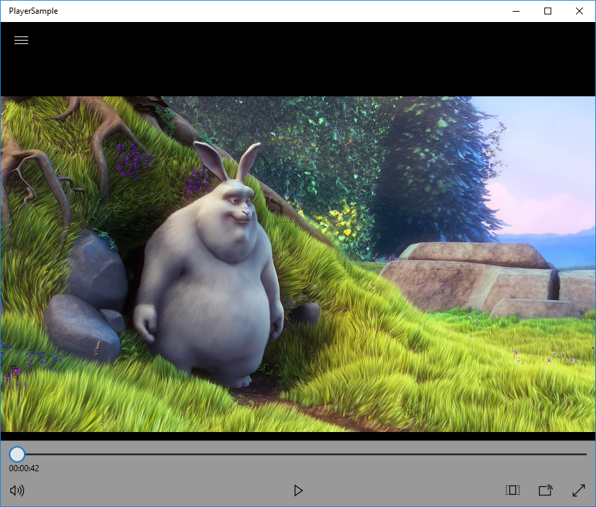
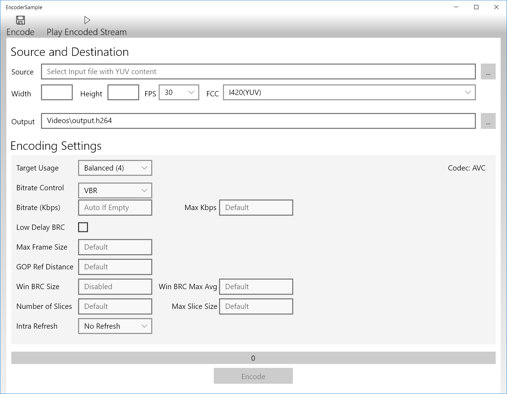

# Extended UWP Samples

## Overview

Extended UWP Samples solution (InteropSamples.sln) contains 3 projects:
* MSDKInterop – DLL providing classes for between MSDK and UWP applications
* EncoderSample – sample showing how to encode raw stream (YUV) into elementary encoded stream (AVC, HEVC)
* PlayerSample – sample showing how to use MSDK for decoding compressed streams and render decoded frames using MediaElement and MediaStreamSource classes.

## Hardware Requirements

PC with Intel Core CPU of 6th generation (SKL) or higher.

## Software Requirements

* Windows 10 19H1
* Microsoft Visual Studio 2017
* Windows 10 SDK build 10.0.18362.0
* Optional: FFMPEG package (for MP4 muxing support).

## How to Build the Application

Open and build samples solution: samples\ExtendedUWPSamples\InteropSamples.sln
For “WithExtras” configuration you need to copy built FFMPEG libraries into samples\ExtendedUWPSamples\ffmpeg folder.

## Running the Software

Run samples from Visual Studio or build Store Package using Visual Studio and install them using generated PowerShell script. Both methods use sideloading, so you have to enable Developer Mode in Windows settings to run samples.

After launching PlayerSample use popup menu to open elementary stream file (codec type is determined by file extension) and use player control buttons to play/pause.

After launching EncoderSample please provide required information about files into corresponding fields (in and out file names, frame size, frame rate, color format) and fill in encoding parameter or use default values. Codec type is determined by file extension of output file.

## Known Limitations

* MP4 files (MP4 container) cannot be played out using built-in player.

## Legal Information

INFORMATION IN THIS DOCUMENT IS PROVIDED IN CONNECTION WITH INTEL PRODUCTS. NO LICENSE, EXPRESS OR IMPLIED, BY ESTOPPEL OR OTHERWISE, TO ANY INTELLECTUAL PROPERTY RIGHTS IS GRANTED BY THIS DOCUMENT. EXCEPT AS PROVIDED IN INTEL'S TERMS AND CONDITIONS OF SALE FOR SUCH PRODUCTS, INTEL ASSUMES NO LIABILITY WHATSOEVER AND INTEL DISCLAIMS ANY EXPRESS OR IMPLIED WARRANTY, RELATING TO SALE AND/OR USE OF INTEL PRODUCTS INCLUDING LIABILITY OR WARRANTIES RELATING TO FITNESS FOR A PARTICULAR PURPOSE, MERCHANTABILITY, OR INFRINGEMENT OF ANY PATENT, COPYRIGHT OR OTHER INTELLECTUAL PROPERTY RIGHT.

UNLESS OTHERWISE AGREED IN WRITING BY INTEL, THE INTEL PRODUCTS ARE NOT DESIGNED NOR INTENDED FORANYAPPLICATION IN WHICH THE FAILURE OF THE INTEL PRODUCT COULD CREATE A SITUATION WHERE PERSONAL INJURY OR DEATH MAY OCCUR.

Intel may make changes to specifications and product descriptions at any time, without notice. Designers must not rely on the absence or characteristics of any features or instructions marked "reserved" or "undefined." Intel reserves these for future definition and shall have no responsibility whatsoever for conflicts or incompatibilities arising from future changes to them. The information here is subject to change without notice. Do not finalize a design with this information.

The products described in this document may contain design defects or errors known as errata which may cause the product to deviate from published specifications. Current characterized errata are available on request.

Contact your local Intel sales office or your distributor to obtain the latest specifications and before placing your product order.

Copies of documents which have an order number and are referenced in this document, or other Intel literature, may be obtained by calling 1-800-548-4725, or by visiting [Intel's Web Site](http://www.intel.com/).

MPEG is an international standard for video compression/decompression promoted by ISO. Implementations of MPEG CODECs, or MPEG enabled platforms may require licenses from various entities, including Intel Corporation.

Intel, the Intel logo, Intel Core are trademarks or registered trademarks of Intel Corporation or its subsidiaries in the United States and other countries.

**Optimization Notice**

Intel's compilers may or may not optimize to the same degree for non-Intel microprocessors for optimizations that are not unique to Intel microprocessors. These optimizations include SSE2, SSE3, and SSE3 instruction sets and other optimizations. Intel does not guarantee the availability, functionality, or effectiveness of any optimization on microprocessors not manufactured by Intel.

Microprocessor-dependent optimizations in this product are intended for use with Intel microprocessors. Certain optimizations not specific to Intel microarchitecture are reserved for Intel microprocessors. Please refer to the applicable product User and Reference Guides for more information regarding the specific instruction sets covered by this notice.

Notice revision \#20110804

##

\* Other names and brands may be claimed as the property of others.

OpenCL and the OpenCL logo are trademarks of Apple Inc. used by permission by Khronos.

Copyright © Intel Corporation