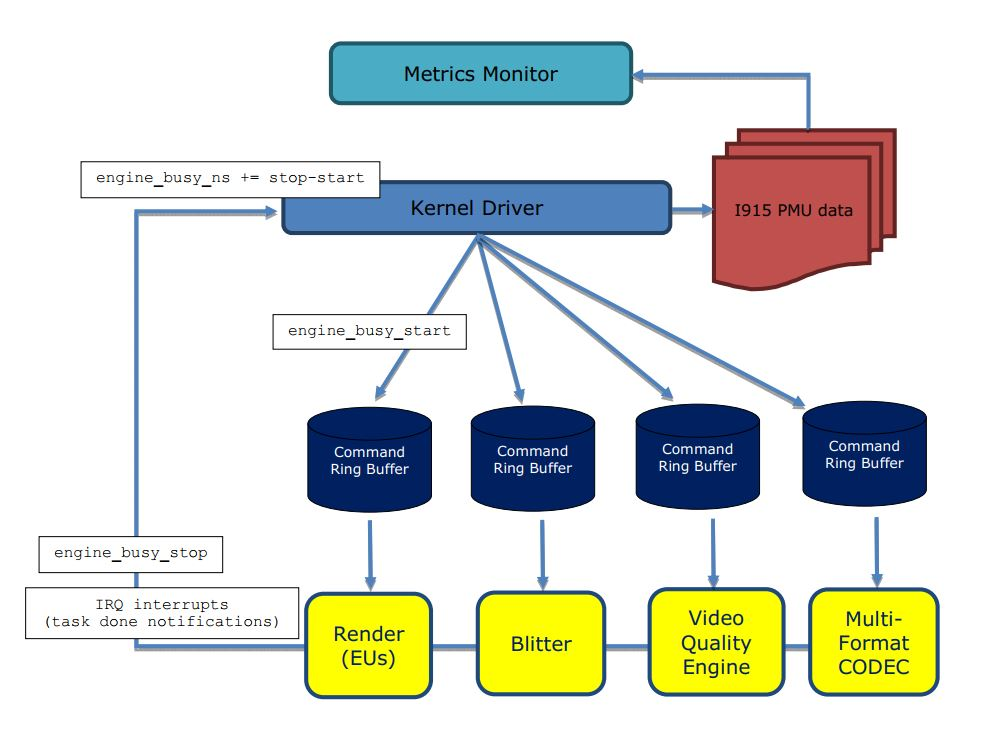
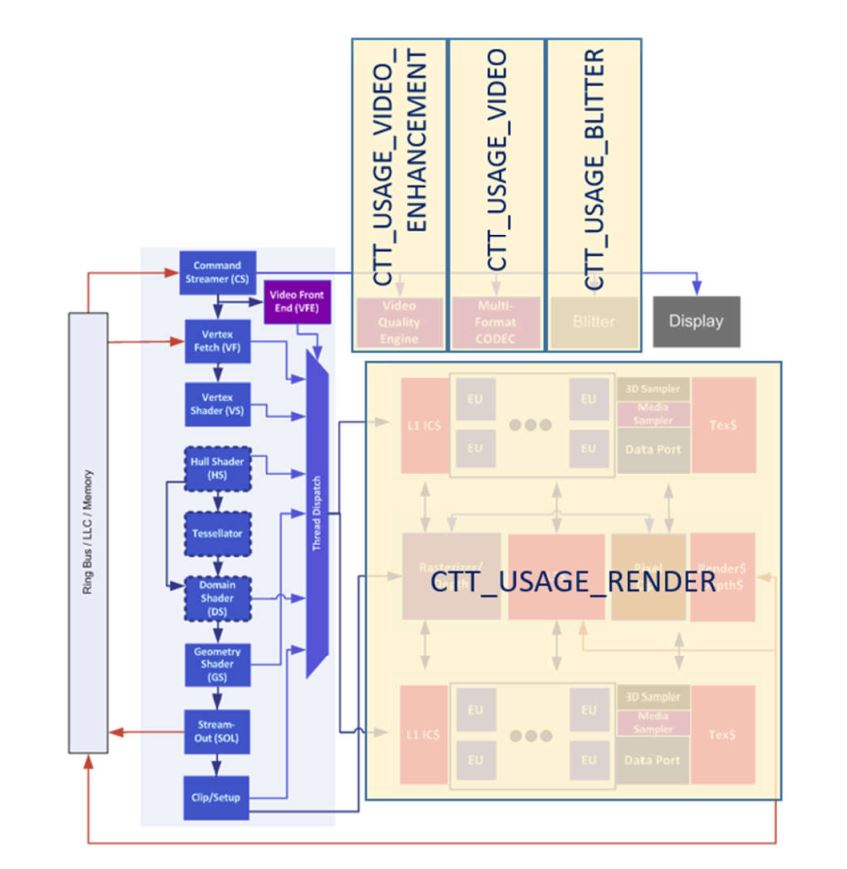
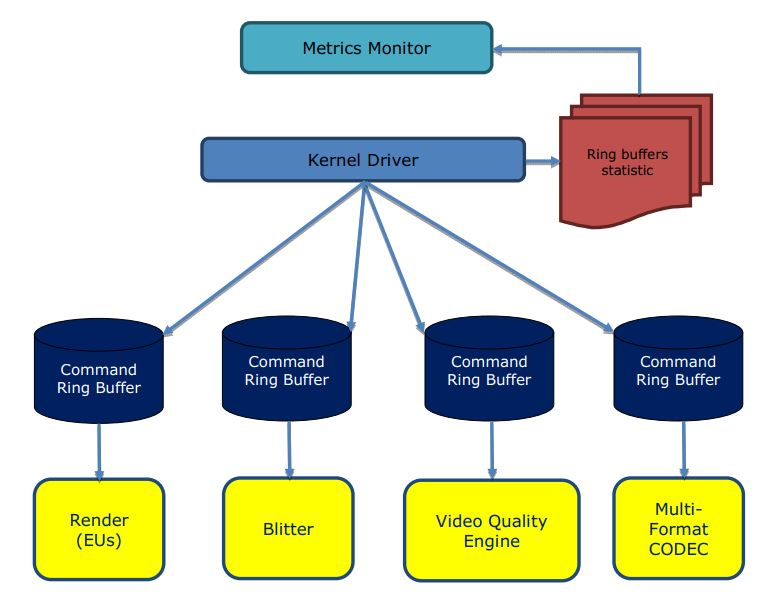

# Metrics Monitor (v2.0.0) Reference Manual

## Overview

Metrics Monitor is a user space shared library for Linux which provides applications access to a number of metrics from the GPU kernel mode driver to aid in understanding the state of the Intel GPU for Media workloads.

## What’s New

### Version 2.0.0:
* Extended CTTMetrics_Init with optional gfx device.
* Enabled PMU events subscription according to device handle

### Version 1.1.2:
* Support i915 PMU API to query metrics.
* Support precise engines utilization tracking instead of sampling estimations (requires i915 scheduler).
* Reduced CPU usage overhead in case of precise engines utilization path.

### Version 1.1.1:
* Support of systems with several GPU. Metrics Monitor detects Intel GPU automatically.

## Software Requirements

Metrics monitor requires appropriate i915 kernel mode driver support to function properly. Specifically, it requires one of the following:
* Kernel 4.16+
* Or previous kernel version patched with at least the following backported patch series: https://patchwork.freedesktop.org/patch/189611/
* Or custom kernel included in the MSS product series: https://software.intel.com/en-us/intel-media-server-studio and does not work with other driver versions. Make sure that you build and install kernel-mode driver. For more details how to do it refer to the Intel® Media Server Studio – Driver & SDK Getting Started Guide.

The Metrics Monitor requires special privileges to be able to report metrics. Metrics
can be reported either if:
1. User has `root` privileges
2. Or if `/proc/sys/kernel/perf_event_paranoid` is less than 1
3. Or if application has `CAP_SYS_ADMIN` capability

To provide CAP_SYS_ADMIN capability to metrics_monitor (or any other application which uses libctt.so library), do the following:
1. Install `libcttmetrics.so` to system path (for security reasons `LD_LIBRARY_PATH` will not work for applications which have capabilities), for example with:
	```
	$ sudo ln -s <metrics_lib_path>/libcttmetrics.so /usr/lib64
	```
	where `<metric_lib_path>` is where the `libcttmetrics.so` library is installed.

2. Execute the following command:
	```
	$ sudo setcap cap_sys_admin+ep ./metrics_monitor
	```
	Be aware that the use of any GUI (e.g. X Server) will add additional usage beyond the media workloads to the Blitter and Render engines.

## Building the software

To build the Metrics Monitor test application (test_monitor) need to install these
packages:
* `libpciaccess-devel`
* `libgtest-devel`

Also make sure, that libpciaccess-devel have the latest version.

## Running the software

To run the Metrics Monitor sample application change to root, set the path to the `cttmetrics.so` library through `$LD_LOAD_LIBRARY` environment variable and run the application:
```
$ sudo su
$ export LD_LIBRARY_PATH=<metrics_lib_path>:$LD_LIBRARY_PATH
$ ./metrics_monitor
```
metrics_monitor provides a few optional command line arguments:
| Option | Description |
|--|--|
| -h | Show this help text |
| -s | Number of metric samples to collect during sampling period(valid range 1..1000, default 100). |
| -p | Sampling period in milliseconds(valid range 10..1000, default 500) |
| -d | Path to gfx device (like /dev/dri/card* or /dev/dri/renderD*). If device is not set, the tool uses i915 render node device with smallest number." |

To run the Metrics Monitor test application change to root, set the path to the `cttmetrics.so` library through `$LD_LOAD_LIBRARY` environment variable and run the application:
```
$ sudo su
$ export LD_LIBRARY_PATH=<metrics_lib_path>:$LD_LIBRARY_PATH
$ ./test_monitor
```

## Architecture

This section describes the architecture of the Metrics Monitor library.

The Metrics Monitor library collects the following i915 kernel mode driver performance counters data:
1. Amount of time each GPU Engine spent executing tasks
2. Average actual GPU frequency

Metrics Monitor allows to monitor the following GPU hardware units (Engines):
* Render engine (execution units)
* Multi-Format CODEC (MFX)
* Video Quality Engine
* Blitter engine

The Intel® GPU provides 4 or 5 command streamers depending on the generation of Intel® Core™ processors. Each command streamer corresponds to one of the GPU Engines. The command streamers pull commands from command ring buffers in memory that the kernel driver populates.

I915 kernel mode driver tracks each request execution, when it was scheduled and when it was completed, and is capable to approximate time each engine spent actively running tasks which is reported as usage by metrics monitor in percent scale [0-100%] over elapsed time period. The described process is illustrated on the following diagram.

Metrics Monitor is also capable to report average actual GPU frequency over elapsed period of time. While Engines Usage metrics are precise metrics, frequency metric is sampled. Sampling period is defined inside i915 PMU and is not currently adjustable by the application. It can be noted however, that sampling is done once in i915 PMU regardless of number if i915 PMU clients (number of metric monitor applications running).



## Metrics Description

The table below provides description of metrics supported by the Metrics Monitor.

| Metric name from header file  | Hardware Units covered | Uses that will execute this unit |
|-------------------------------|------------------------|----------------------------------|
| CTT_USAGE_RENDER | Render Engine (Execution units, media samplers, VME and their caches) | Video Encode (ENC), OpenCL, Video Scaling, VPP Composition including frame rate conversion and image stabilization, VPP copy to CPU |
| CTT_USAGE_VIDEO | Multi-Format Codec Engine (also known as “MFX” or “VDBOX”) | Video Encode (PAK) and Decode |
| CTT_USAGE_VIDEO2 | 2<sup>nd</sup> instance of the Multi Format Codec Engine, if available (Examples of supported processor include 5<sup>th</sup> generation of Intel® Core™ processors with Intel® HD Graphics 6000, Intel® Iris® Graphics 6100, Intel® Iris® Pro Graphics 6200, Intel® Iris® Pro Graphics P6300) | Video Encode (PAK) and Decode |
| CTT_USAGE_VIDEO_ENHANCEMENT | Video Quality Engine (also known as “VEBOX” or Video Quality enhancement pipeline) | Deinterlace, Denoise |
| CTT_USAGE_BLITTER	| 2D graphics blitter engine. | 2D and 3D Blt (no media use) |
| CTT_AVG_GT_FREQ | Intel GPU | Any task running on any of the GPU Engines listed above |

Below is the example of mapping metrics to the 4<sup>th</sup> generation of Intel® Core™ processor architecture.



For detailed description of GPU’s engines refer to the Intel® Open Source Graphics Programmer’s Reference Manual (PRM) for Skylake and Broadwell platforms:
* https://01.org/linuxgraphics/documentation/hardware-specification-prms/2015-2016-intel-processors-based-skylake-platform
* https://01.org/linuxgraphics/documentation/hardware-specification-prms/2014-2015-intel-processors-based-broadwell-platform

## Usage Model

This section provides overview of possible usages of the Metrics Monitor.

The Metrics Monitor tool can be used for monitoring Intel GPU metrics. Different scenario of the Metrics monitor usages provided below. All sample applications referenced below can be found in the SDK sample package, which is part of Intel® Media Server Studio product.

A. Video engine usage during decoding
1. Run Metrics Monitor sample application. It begins collecting metrics from GPU.
2. Run sample_decode application to perform decoding of h264 stream to put a
    load on GPU.
3. Observe that video usage metric shows how video engine was busy
    performing decoding.

Example of command line to perform decoding:
```
$ ./sample_decode h264 -hw -vaapi -async 4 -i ../streams/bbb1920x1080.264
```

B. Video Enhancement pipeline usage during video processing
1. Run Metrics Monitor sample application. It begins collecting metrics from GPU.
2. Run sample_vpp application to perform de-interlacing of interlaced stream using advanced capabilities of video enhancement pipeline.
3. Observe that video enhancement usage metric shows how video enhancement pipeline was busy performing de-interlacing.

Example of command line to perform video processing with advanced de-interlacing:
```
$ ./sample_vpp -lib hw –vaapi -sw 1920 -sh 1080 -dw 1920 -dh 1080 -spic 0 -dpic 1 –di_mode 2 -i i_stream.nv12 –o p_stream.nv12
```

C. Video and Render engine usage during transcoding
1. Run Metrics Monitor sample application. It begins collecting metrics from GPU.
2. Run sample_multi_transcode application to perform transcoding from one format to another and with different transcoding speed to put a load on GPU.
3. Look for video and render usage metrics provided by the Metrics Monitor and run more workloads to observe how metrics value changes. Video engine usage scales with increasing or decreasing number of workloads.

Example of command line to perform transcoding:
```
$ ./sample_multi_transcode -i::h264 bbb1920x1080.264 -o::mpeg bbb1920x1080.mpeg2 -hw -async 4 -fps 15
```

## Limitations

This section describes limitations of the Metrics Monitor.

* The metrics are not normalized for GPU operating frequency and the metric values may change according to frequency change.
* Engines usage metrics provide approximation of the real Engines usages and may not be fully accurate due to scheduling notification latencies.
* Due to sampling nature of Average Frequency metric its values may not be fully accurate and provide only estimation of real average frequency.

## API Reference

This section describes the Metrics Monitor API.

* **CTTMetrics_Init**

	**Syntax**<br>
	`cttStatus CTTMetrics_Init(const char *device);`

    **Parameters**<br>
    `device` - If not NULL, the function uses provided gfx device for initialization. If NULL, the function uses render node device with smaller number.

	**Description**<br>
	This function initializes media metrics library.

	**Return Status**<br>
	`MFX_ERR_NONE` - Metrics Monitor library succesfully initialized.

* **CTTMetrics_GetMetricCount**

	**Syntax**<br>
	`cttStatus CTTMetrics_GetMetricCount(unsigned int* out_count);`

	**Parameters**<br>
	`out_count` - Number of metrics available.

	**Description**<br>
	This functions returns the number of available metrics. Must be called after `CTTMetrics_Init()`.

	**Return Status**<br>
	`MFX_ERR_NONE` - Number of available metrics returned successfully.

* **CTTMetrics_GetMetricInfo**

	**Syntax**<br>
	`cttStatus CTTMetrics_GetMetricInfo(unsigned int count, cttMetric* out_metric_ids);`

	**Parameters**<br>
	`count` - Number of elements in the out_metric_ids.<br>
	`out_metric_ids` - Output array of available metric IDs. Must be allocated and de-allocated by app.

	**Description**<br>
	This function returns IDs of available metrics. Must be called after `CTTMetrics_Init()`.

	**Return Status**<br>
	`MFX_ERR_NONE` - Metrics IDs returned succesfully.

* **CTTMetrics_Subscribe**

	**Syntax**<br>
	`cttStatus CTTMetrics_Subscribe(unsigned int count, cttMetric* in_metric_ids);`

	**Parameters**<br>
	`count` - Number of metrics to collect.<br>
	`in_metric_ids` - Input array of metric IDs.

	**Description**<br>
	This function specifies metrics being collected. Must be called after `CTTMetrics_Init()`.

	**Return Status**<br>
	`MFX_ERR_NONE` - Metrics subscription completed succesfully.

* **CTTMetrics_SetSampleCount**

	**Syntax**<br>
	`cttStatus CTTMetrics_SetSampleCount(unsigned int in_num);`

	**Parameters**<br>
	`in_num` - Number of metric samples to collect during sampling period.

	**Description**<br>
	Sets the number of metric samples to collect during sampling period. Default = 100. Valid range 1..1000. Must be called after `CTTMetrics_Init()`.

	**Return Status**<br>
	`MFX_ERR_NONE` - Number of samples set successfully.

* **CTTMetrics_SetSamplePeriod**

	**Syntax**<br>
	`cttStatus CTTMetrics_SetSamplePeriod(unsigned int in_period);`

	**Parameters**<br>
	`in_period` - Sampling period in milliseconds.

	**Description**<br>
	Sets the sampling period in milliseconds to collect metric samples. Default = 500. Valid range 10..1000. Must be called after `CTTMetrics_Init()`.

	**Return Status**<br>
	`MFX_ERR_NONE` - Sampling period set successfully.

* **CTTMetrics_Close**

	**Syntax**<br>
	`void CTTMetrics_Close();`

	**Description**<br>
	Close media metrics library and stops metrics collection.

* **CTTMetrics_GetValue**

	**Syntax**<br>
	`cttStatus CTTMetrics_GetValue(unsigned int count, float* out_metric_values);`

	**Parameters**<br>
	`count` - Number of metric values to receive.<br>
	`out_metric_values` - Output array of metric values (floats). Must be allocated and de-allocated by app. `out_metric_values[i]` corresponds to `in_metric_ids[i]` in `CTTMetrics_Subscribe()`.

	**Description**<br>
	This function returns metric values. Number of values equals to `count` - number of
	metric ids in `CTTMetrics_Subscribe()`.

	**Return Status**<br>
	`CTT_ERR_NONE` - Metric values received succesfully.

## Appendix – A (version 1.1.1 notes)

Version 1.1.1 of metrics monitor library used another approach of getting metrics. This metrics collector still remains in metrics monitor library for the backward compatibility. For this reason current Appendix contains detailed notes on the software requirements and implementation of Version 1.1.1 metrics collector.

### Software Requirements

The Metrics Monitor Version 1.1.1 data collector depends on installing **Intel® Media Server Studio 2017 R3 – Graphics Drivers (or earlier version)** and does not work with other driver versions. Make sure that you build and install kernel-mode driver. For more details how to do it refer to the Intel® Media Server Studio – Driver
& SDK Getting Started Guide.

The Metrics Monitor requires the “root” user privileges and debugfs file system set up on your machine.

To check if debugfs is mounted:
```
$ mount | grep debugfs
```
If you don’t have debugfs mounted:
```
$ mount -t debugfs nodev /sys/kernel/debug
```
For most accurate results it’s expected to run in headless operation. The use of any GUI (e.g. X Server) will add additional usage beyond the media workloads to the Blitter and Render engines.

### Architecture

This section describes the architecture of the Metrics Monitor library version 1.1.1 data collector.

The Metrics Monitor library collects statistical information from GPU kernel driver about ring command buffers of different GPU units. The driver provides information if the command ring buffer was in idle state or not in particular time. The driver exposes this information via debugfs file system. Command ring buffer idle state is
the state when it’s empty and doesn’t have any commands to pull and execute by GPU.

Metrics Monitor allows to monitor the following GPU hardware units:
* Render engine (execution units)
* Multi-Format CODEC (MFX)
* Video Quality Engine
* Blitter engine

The Intel® GPU provides 4 or 5 command streamers depending on the generation of Intel® Core™ processors. The command streamers pull commands from command ring buffers in memory that the kernel driver populates.

An overview of this process is shown in figure below:



The usage of particular GPU unit is estimated according to the following data – “how much time the command ring buffer was in idle state during the sampling period”.

The Metrics Monitor allows to collect metrics data within user defined sampling period.

During the sampling period the Metrics Monitor collects the number of idle states for command ring buffer and calculates the busy metrics as relation of number of busy states to the number of all states. Number of states collected during the sampling period can be 1000 or less depending on the performance of obtaining and processing data from driver and the number of samples a user defined to collect.

### Limitations

This section describes limitations of the Metrics Monitor version 1.1.1 data collector.
* The metrics are not normalized for GPU operating frequency and the metric values may change according to frequency change.
* The small workloads with processing time less than the duration of sampling period cannot be monitored.
* Due to statistical nature of metrics measurement on Linux the metric values may have big deviations.
* Sampling metrics may introduces performance impact to the media processing and total CPU Usage and Power Consumption.

The following table provides the overhead data for 100 millisecond sampling period.

|	| CPU usage, % | Processing time, sec | Processing speed, fps | Overhead, %	|
|--|--|--|--|--|
| No Metrics Monitor | 0 | 69.6	| 30.7 | 0 |
| 20 samples | 1 | 70.2 | 30.5 | 0.7 |
| 100 samples | 3 | 71.5 | 29.9	| 3.0 |
| 500 samples | 8 | 72.7 | 29.4	| 4.4 |
| 1000 samples | 13 | 74.4 | 28.7 | 6.8 |

The sampling overhead measurements were done using sample_multi_transcode application, which run in the N to N transcoding mode. It performs 10 joined transcoding sessions converting Full HD H264 streams to H264 Full HD streams. One stream containing 2136 frames was used as input stream for all transcoding sessions.

The “CPU usage” information was collected by “top” tool on the system without any media workloads and shows only impact introduced by metrics sampling in the Metrics Monitor.

The measurements were done on the CentOS 7 system with Intel® Core™ i7-4770K processor and enabled Turbo Boost (Max frequency 3.9 GHz) and processor graphics frequency fixed at 1350 MHz.

## Appendix – B

The following table provides comparison of metrics monitor CPU Usage overhead between Versions 1.1.1 and 1.1.2 on 100ms sampling period.

|	| Version 1.1.1<br>CPU Usage, % | Version 1.1.2<br>CPU Usage, % |
|--|--|--|
| No Metrics Monitor | 0 | 0 |
| 20 samples | 1 | 0.4 |
| 100 samples | 3 | 0.4 |
| 500 samples | 8 | 0.4 |
| 1000 samples | 13 | 0.4 |

Version 1.1.2 does not require samples within sampling period to get correct metrics, thus CPU Usage remains constant on any number of samples. Still metrics monitor Version 1.1.2 may have some CPU Usage overhead mostly defined by the requested sampling period.

## Legal Information

INFORMATION IN THIS DOCUMENT IS PROVIDED IN CONNECTION WITH INTEL PRODUCTS. NO LICENSE, EXPRESS OR IMPLIED, BY ESTOPPEL OR OTHERWISE, TO ANY INTELLECTUAL PROPERTY RIGHTS IS GRANTED BY THIS DOCUMENT. EXCEPT AS PROVIDED IN INTEL'S TERMS AND CONDITIONS OF SALE FOR SUCH PRODUCTS, INTEL ASSUMES NO LIABILITY WHATSOEVER AND INTEL DISCLAIMS ANY EXPRESS OR IMPLIED WARRANTY, RELATING TO SALE AND/OR USE OF INTEL PRODUCTS INCLUDING LIABILITY OR WARRANTIES RELATING TO FITNESS FOR A PARTICULAR PURPOSE, MERCHANTABILITY, OR INFRINGEMENT OF ANY PATENT, COPYRIGHT OR OTHER INTELLECTUAL PROPERTY RIGHT.

UNLESS OTHERWISE AGREED IN WRITING BY INTEL, THE INTEL PRODUCTS ARE NOT DESIGNED NOR INTENDED FOR ANY APPLICATION IN WHICH THE FAILURE OF THE INTEL PRODUCT COULD CREATE A SITUATION WHERE PERSONAL INJURY OR DEATH MAY OCCUR.

Intel may make changes to specifications and product descriptions at any time, without notice. Designers must not rely on the absence or characteristics of any features or instructions marked "reserved" or "undefined." Intel reserves these for future definition and shall have no responsibility whatsoever for conflicts or incompatibilities arising from future changes to them. The information here is subject to change without notice. Do not finalize a design with this information.

The products described in this document may contain design defects or errors known as errata which may cause the product to deviate from published specifications. Current characterized errata are available on request.

Contact your local Intel sales office or your distributor to obtain the latest specifications and before placing your product order.

Copies of documents which have an order number and are referenced in this document, or other Intel literature, may be obtained by calling 1- 800 - 548 - 4725, or by visiting Intel's Web Site.

MPEG is an international standard for video compression/decompression promoted by ISO. Implementations of MPEG CODECs, or MPEG enabled platforms may require licenses from various entities, including Intel Corporation.

Intel, the Intel logo, Intel Core are trademarks or registered trademarks of Intel Corporation or its subsidiaries in the United States and other countries.

**Optimization Notice**
Intel's compilers may or may not optimize to the same degree for non-Intel microprocessors for optimizations that are not unique to Intel microprocessors. These optimizations include SSE2, SSE3, and SSE3 instruction sets and other optimizations. Intel does not guarantee the availability, functionality, or effectiveness of any optimization on microprocessors not manufactured by Intel.

Microprocessor-dependent optimizations in this product are intended for use with Intel microprocessors. Certain optimizations not specific to Intel microarchitecture are reserved for Intel microprocessors. Please refer to the applicable product User and Reference Guides for more information regarding the specific instruction sets covered by this notice.

Notice revision \#20110804
