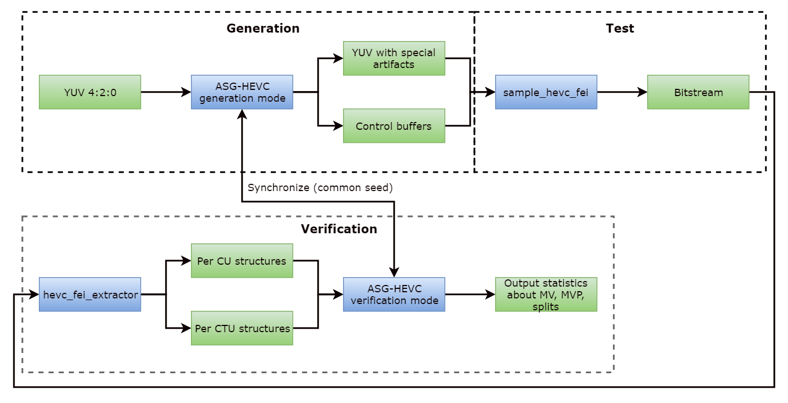

# **ASG-HEVC User Manual**

[**LEGAL DISCLAIMER**](../header-template.md#legal-disclaimer)

[**Optimization Notice**](../header-template.md#optimization-notice)

[Overview](#Overview)

[Running the Software](#Running_the_Software)

# Overview

**ASG-HEVC** is the specific validation tool for the motion estimation/mode decision. Current tool was developed to analyze HEVC FEI (Flexible encoding infrastructure) encoder.

Tool helps to check:

- Motion estimation quality in cases w/ and w/o External MVP (FEI specific).
- Optimality of Inter/Intra predictions.

Tool is required for validation of the open source [Media SDK](https://github.com/Intel-Media-SDK/MediaSDK).

The picture below shows the typical validation pipeline.

# Running the Software

Usage:

`asg-hevc -i InputYUVFile -o OutputYUVFile -w width -h height -n number_of_frames_to_process`

The above params are required. If `-pic_file` or repack parameters are enabled, parameters `-i InputYUVFile -o OutputYUVFile -w width -h height` can be removed.

Additional options:

| | |
|-|-|
| `-g <size>` | GOP size. |
| `-r <number>` | Number of B frames plus 1. |
| `-x <size>` | DPB size in frames. |
| `-idr_interval <interval>` | IDR interval in frames. |
| `-num_active_P <number>` | Number of active references for P frames. |
| `-num_active_BL0 <number>` | Number of active List 0 references for B frames. |
| `-num_active_BL1 <number>` | Number of active List 1 references for B frames. |
| `-generate` | Run ASG in test stream generation mode. |
| `-verify` | Run ASG in test results verification mode. |
| `-gen_split` | Enable CTU splitting. |
| `-no_cu_to_pu_split` | Disable CU splitting into Pus. |
| `-force_extbuf_mvp_block_size <size>` | Force mfxFeiHevcEncMVPredictors::BlockSize field in MVP output buffer to a specified value. ALL output mfxFeiHevcEncMVPredictors structs will be affected. Supported values are 0, 1, 2 and 3. See MVPredictor description in HEVC FEI manual for details. |
| `-mvp_block_size <size>` | Actual MVP block size used in actual generation algorithm. If -force_extbuf_mvp_block_size is not specified, this value is used in output mfxFeiHevcEncMVPredictors::BlockSize only for the structures for which MVPs were actually generated.When -force_extbuf_mvp_block_size is specified and -mvp_block_size is not default algorithm for MVP generation is used : MVP block size equals to CTU size.When both -force_extbuf_mvp_block_size and -mvp_block_size are specified : the 1st one value is used in the output ExtBuffer regardless to actual MVP block size.Supported values are 0, 1, 2 and 3. |
| `-force_symm_cu_part` | Forces using only symmetric CU into PU partioning modes for inter prediction test. |
| `-gen_inter` | Generate inter CUs (inter prediction test). |
| `-gen_intra` | Generate intra CUs (intra prediction test). |
| `-gen_pred` | Generate MV predictors (inter prediction test). |
| `-gen_mv` | Generate motion vectors inside search window (inter prediction test).If -gen_mv is not specified, then resulting MVs for PUs will be generated outside the search window only. |
| `-gen_repack_ctrl` | Generate/verify repack control data. |
| `-pred_file <File>` | Output file for MV predictors. |
| `-pic_file <File>` | Output file for pictures&#39; structure. |
| `-log2_ctu_size <size>` | Log2 CTU size to be used for CU quad-tree structure. Default is 4. Cannot be less than min_log2_tu_size (described below). |
| `-min_log2_tu_size <size>` | Minimum log2 TU size to be used for quad-tree structure. Must be less than min_log2_cu_size (described below), default is 2. |
| `-max_log2_tu_size <size>` | Maximum log2 TU size to be used for quad-tree structure. Must be less than or equal to Min(log2_ctu_size, 5), default is 4. |
| `-max_tu_qt_depth <value>` | Maximum TU quad-tree depth inside CU. Overrrides min_log2_tu_size, default is 4. |
| `-min_log2_cu_size <size>` | Mminimum log2 CU size to be used for quad-tree structure. Cannot be less than max_log2_tu_size, default is 3. |
| `-max_log2_cu_size <size>` | Maximum log2 CU size to be used for quad-tree structure. Cannot be larger than log2_ctu_size, default is 4. |
| `-block_size_mask <size>` | Bit mask specifying possible partition sizes. |
| `-ctu_distance <distance>` | Minimum distance between generated CTUs (in units of CTU), default is 3. |
| `-gpb_off` | Specifies that regular P frames should be used, not GPB frames. |
| `-bref` | Arrange B frames in B pyramid reference structure. |
| `-nobref` | Do not use B-pyramid. |
| `-pak_ctu_file <File>` | Input file with per CTU information. |
| `-pak_cu_file <File>` | Input file with per CU information. |
| `-repack_ctrl_file <File>` | Output/input file with repack control data for repack control generation/verify. |
| `-repack_stat_file <InputFile>` | Input file with repack stat data for repack control verify. |
| `-repack_str_file <File>` | Input file with multiPakStr data for repack control generation/verify. |
| `-log <File>` | Log output file. |
| `-csv <File>` | File to output statistics in CSV format. |
| `-config <File>` | Input configuration file. |
| `-sub_pel_mode <value>` | Specifies sub pixel precision for motion vectors. 0 - integer, 1 - half, 3 - quarter (0 is default). |
| `-mv_thres <value>` | Threshold for motion vectors in percents (0 is default). |
| `-numpredictors <number>` | Number of MV predictors enabled. Used in verification mode to check NumMvPredictors FEI control works correctly.Valid values are in range \[1; 4\] \(4 is default\). |
| `-split_thres <value>` | Thresholds for partitions in percents (0 is default). |
| `-DeltaQP <value(`s)> | Array of delta QP values for repack ctrl generation, separated by a space (8 values at max). |
| `-InitialQP <value>` | The initial QP value for repack ctrl verify (26 is default). |

Below are examples of command-lines that can be used to execute ASG-HEVC:

**Test of the inter prediction for p-frames with EMVP**

Run of the validation tool in the generation mode (CU 16x16)

`asg-hevc -generate -gen_inter -gen_mv -gen_pred -gen_split -i input_1920x1088_250.yuv -o test.yuv -w 1920 -h 1088 -n 250 -g 2 -x 1 -num_active_P 1 -r 1 -log2_ctu_size 5 -no_cu_to_pu_split -max_log2_cu_size 4 -min_log2_cu_size 4 -mvp_block_size 1 -gpb_off -sub_pel_mode 0 -pred_file emvp.mvin`

Run a test application

`sample_hevc_fei -i test.yuv -o test.hevc -w 1920 -h 1088 -n 250 -f 25 -qp 2 -g 2 -GopRefDist 1 -gpb:off -NumRefFrame 1 -NumRefActiveP 1 -NumPredictorsL0 4 -NumPredictorsL1 4 -encode -EncodedOrder -mvpin emvp.mvin`

Run an extractor

`hevc_fei_extractor test.hevc mvmvp.ctustat mvmvp.custat`

Run of the validation tool in the verification mode

`asg-hevc -verify -gen_inter -gen_mv -gen_pred -gen_split -w 1920 -h 1088 -n 250 -g 2 -x 1 -num_active_P 1 -r 1 -log2_ctu_size 5 -no_cu_to_pu_split -max_log2_cu_size 4 -min_log2_cu_size 4 -mvp_block_size 1 -gpb_off -sub_pel_mode 0 -pak_ctu_file mvmvp.ctustat -pak_cu_file mvmvp.custat -mv_thres 80 -split_thres 80 -numpredictors 4`

**Test of the inter prediction for b-frames with EMVP**

Run of the validation tool in the generation mode (CU 16x16)

`asg-hevc -generate -gen_inter -gen_mv -gen_pred -gen_split -i matrix_1920x1088_250.yuv -o test.yuv -w 1920 -h 1088 -n 250 -g 32 -x 2 -num_active_P 1 -num_active_BL0 1 -num_active_BL1 1 -r 4 -log2_ctu_size 5 -no_cu_to_pu_split -max_log2_cu_size 4 -min_log2_cu_size 4 -mvp_block_size 1 -sub_pel_mode 0 -pred_file emvp.mvin`

Run a test application

`sample_hevc_fei -i test.yuv -o test.hevc -w 1920 -h 1088 -n 250 -f 25 -qp 2 -g 32 -GopRefDist 4 -gpb:on -NumRefFrame 2 -NumRefActiveP 1 -NumRefActiveBL0 1 -NumRefActiveBL1 1 -NumPredictorsL0 4 -NumPredictorsL1 4 -encode -EncodedOrder -mvpin emvp.mvin`

Run an extractor

`hevc_fei_extractor test.hevc mvmvp.ctustat mvmvp.custat`

Run of the validation tool in the verification mode

`asg-hevc -verify -gen_inter -gen_mv -gen_pred -gen_split -w 1920 -h 1088 -n 250 -g 32 -x 2 -num_active_P 1 -num_active_BL0 1 -num_active_BL1 1 -r 4 -log2_ctu_size 5 -no_cu_to_pu_split -max_log2_cu_size 4 -min_log2_cu_size 4 -mvp_block_size 1 -sub_pel_mode 0 -pak_ctu_file mvmvp.ctustat -pak_cu_file mvmvp.custat -mv_thres 70 -split_thres 60 -numpredictors 4`

**Test of the multi-pass PAK**

Run a test application

`sample_hevc_fei -i input_1920x1088_250.yuv -o test.hevc -w 1920 -h 1088 -n 250 -qp 24 -g 2 -GopRefDist 1 -encode -EncodedOrder`

Run an extractor

`hevc_fei_extractor test.hevc -multi_pak_str test.multipak`

Run of the validation tool in the generation mode

`asg-hevc -generate -gen_repack_ctrl -n 250 -g 2 -r 1 -repack_ctrl_file test.repakctrl -repack_str_file test.multipak -InitialQP 24 -DeltaQP 1 1 2 2 3 3 4 4`

Run a test application

`sample_hevc_fei -i input_1920x1088_250.yuv -o test.repack -w 1920 -h 1088 -n 250 -qp 24 -g 2 -GopRefDist 1 -encode -EncodedOrder -repackctrl test.repakctrl -repackstat test.repakstat`

Run an extractor

`hevc_fei_extractor test.repack -multi_pak_str test_repak.multipak`

Run of the validation tool in the verification mode

`asg-hevc -verify -gen_repack_ctrl -n 250 -g 2 -r 1 -repack_ctrl_file test.repakctrl -repack_stat_file test.repakstat -repack_str_file test_repak.multipak -InitialQP 24`
